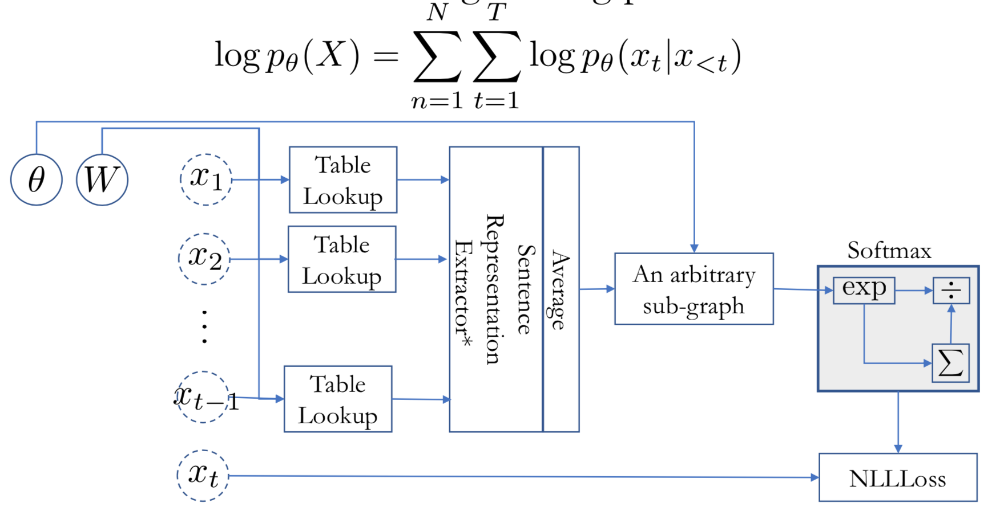
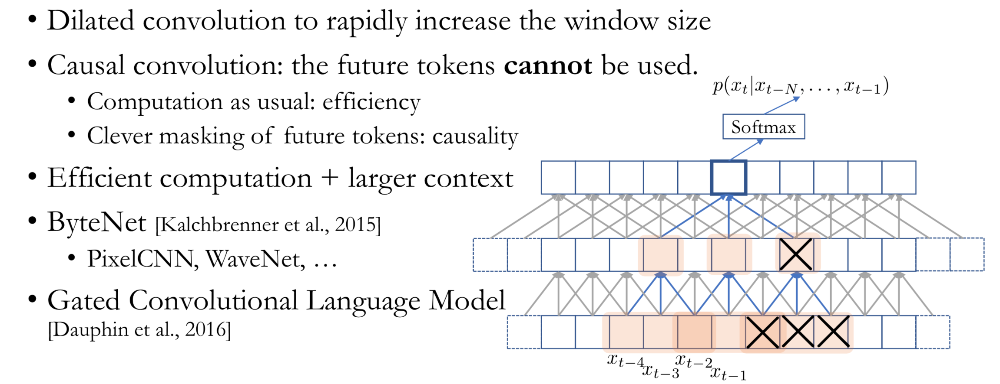
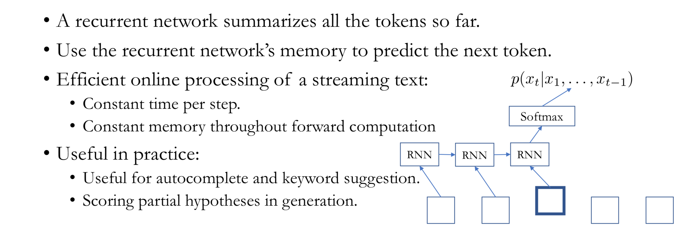
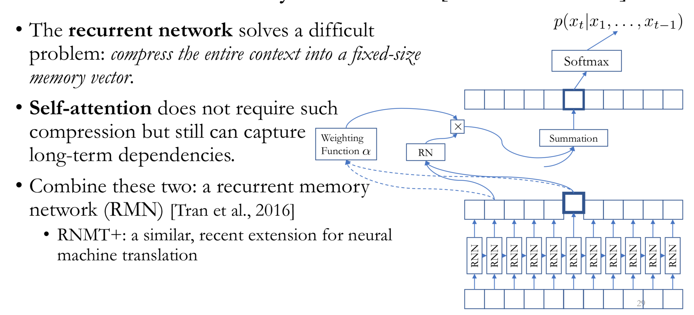

## Language Modeling

언어모델은 over all possible sentence의 분포를 잡아내는 문제입니다. 
$$
p(X) = p((x_{1},x_{2},x_{3},....x_{T}))
$$

문장이 주어졌을때, 이 문장이 얼마나 likely 한지? 를 보려고합니다. sentence scoring을 하는 문제입니다. 

- input : 문장
- ouput : the probability of input setence


#### 자기회귀 언어 모델링(Autoregressive language modeling):

어떤 sequence가 주어졌을때, 그 시퀀스 안에서 한 token이 등장했을때, 다음 토큰이 무엇이 나올것인지를 예측하는 문제로 볼수 있다.
$$
p(X)=p(x_{1})p(x_{2}|x_{1})...p(x_{T}|x_{1},...x_{T-1})
$$
각각의 conditional distribution을 보면, input, ouput pair가 생겨서 multiclassification인 supervised learning problem으로 바뀌게 된다. 

- Sequence 가 주어졌을 때, 문장에 점수를 부여하는 방법
- input은 이전에 나온 토큰, ouput은 다음에 나올 토큰을 예측하는 문제가 된다.
- 점수는 negative log likelihood로 측정합니다.



#### Scoring a sentence

문장을 Scoring하는것은, 결정적은 문장을 생성하는것과도 직접적인 연관이있다.

### N-gram Language Models

뉴럴넷을 사용하기 전에는, Conditional을 고려할때, N의 context 단위로 보게 되었습니다. 단위로 보면서 counting을 하게 됩니다. 

- 주어진 N개의 토큰에 대해서, 토큰 x가 나올 수 있는 확률은 이전 N개의 토큰과 토큰 x의 결합확률을 이전 N개의 토큰이 등장할수 있는 모든 토큰들의 결합확률 합으로 나눈것입니다.
$$
p(x|x_{-N},x_{-N+1}...x_{-1}) = \frac{p(x_{-N},x_{-N+1}...x_{-1},x)}{p(x_{-N},x_{-N+1}....x_{-1})}\\
= \frac{p(x_{-N},x_{-N+1}...x_{-1},x)}{\sum_{x}p(x_{-N},x_{-N+1},...x_{-1}x)}
$$

- 어떤 n-gram $p(x_{-N},x_{-N+1}...x_{-1},x)$ 의 등장 횟수를 셉니다.(counting이기 때문에 $c(x_{-N},x_{-N+1}...x_{-1},x)$라고 하겠습니다.)
- 주어진 n-gram에서 나오는 토큰들의 모든 경우에 수의 등장 횟수를 셉니다.
- 해당 토큰의 등장확률은 조건부 확률로 표현되며 $= \frac{p(x_{-N},x_{-N+1}...x_{-1},x)}{\sum_{x}p(x_{-N},x_{-N+1},...x_{-1}x)}$ 입니다.

#### Problem

- Data Sparsity
    - 희귀한 단어가 나오게 되면, 확률이 0으로 갑니다.
- Long-term dependencies 
    - n개의 토큰만을 조회하기 때문에, 긴 문장에 대한 추론이 힘듭니다.
    - n의 사이즈를 늘리면, Data Sparsity문제와 계산량 문제를 만나게 됩니다.
    
#### Solution

- Data Sparsity
    - Smoothing : 작은 상수 항을 더해주는 방법입니다.
    - Back off : Count가 0이 나올시 측정하는 n을 하나씩 줄여 다시 Count 합니다.
- Long-term dependencies
    - n-gram으로 해결이 안됩니다.

### Neural N-Gram Language Model

신경망을 사용하면서, count기반의 n그램모델의 한계를 보안할 수 있었습니다. 뉴럴넷을 이용한 vector공간을 이용한 단어의 분산표상(distribution representation)을 이용한다면, 토큰은 연속 벡터 공간에 mapping됩니다. 단어의 유사도 계산을 통해 연속 벡터 공간에서 의미가 있는 분포를 찾을 수 있게 됩니다. 

- token을 concate 하여 phrase 를 표현합니다. 
- 벡터 공간을 이용하여, dense한 공간에서 유사도 측정을 가능하게 합니다. 

1. 말뭉치(corpus)로 부터 모든 n-gram들을 취합시킵니다.
    - 읽어가면서 n-gram읽으면 됩니다.
2. 훈련 테스트셋 제작시, 모든 n-gram들을 셔플합니다.
    - uniform하게 만들기 위해서
3. n의 크기를 100~1000단위로 해서, neural n-gram을 학습시킵니다.
    - softmax regression을 합니다.
4. Early-strop을 vaildation-set 기준으로 진행합니다.
5. perplexity를 test-set에 적용해서 evaluation을 진행합니다.
    - perplexity의 경우는, 주어진 token에 대해서 다음에 등장할 토큰의 선택지가 얼마나 적은지 입니다. 만약에 선택지의 갯수가 vocab사이즈와 같을 경우, 무엇을 선택해야할지 모른다는 것이죠. 이럴때, perplexity는 1이 됩니다.


```python
import torch
import torch.nn as nn
import torch.nn.functional as F
import torch.optim as optim

torch.manual_seed(1)
```


    <torch._C.Generator at 0x105f3dfd0>


```python
Context_size = 2
Embedding_dim = 10

test_sentence = """When forty winters shall besiege thy brow,
And dig deep trenches in thy beauty's field,
Thy youth's proud livery so gazed on now,
Will be a totter'd weed of small worth held:
Then being asked, where all thy beauty lies,
Where all the treasure of thy lusty days;
To say, within thine own deep sunken eyes,
Were an all-eating shame, and thriftless praise.
How much more praise deserv'd thy beauty's use,
If thou couldst answer 'This fair child of mine
Shall sum my count, and make my old excuse,'
Proving his beauty by succession thine!
This were to be new made when thou art old,
And see thy blood warm when thou feel'st it cold.""".split()
```


```python
test_sentence[:5]
```


    ['When', 'forty', 'winters', 'shall', 'besiege']


```python
trigrams = [([test_sentence[i], test_sentence[i+1]], test_sentence[i+2]) for i in range(len(test_sentence) - 2)]
```


```python
print(trigrams[:5])
```

    [(['When', 'forty'], 'winters'), (['forty', 'winters'], 'shall'), (['winters', 'shall'], 'besiege'), (['shall', 'besiege'], 'thy'), (['besiege', 'thy'], 'brow,')]


```python
vocab = set(test_sentence)
word_to_ix = {word: i for i, word in enumerate(vocab)}
```


```python
class NGramLanguageModeler(nn.Module):

    def __init__(self, vocab_size, embedding_dim, context_size):
        super(NGramLanguageModeler, self).__init__()
        self.embeddings = nn.Embedding(vocab_size, embedding_dim)
        self.linear1 = nn.Linear(context_size * embedding_dim, 128)
        self.linear2 = nn.Linear(128, vocab_size)

    def forward(self, inputs):
        embeds = self.embeddings(inputs).view((1, -1))
        out = F.relu(self.linear1(embeds))
        out = self.linear2(out)
        log_probs = F.log_softmax(out, dim=1)
        return log_probs
```


```python
losses = []
loss_function = nn.NLLLoss()
model = NGramLanguageModeler(len(vocab), Embedding_dim, Context_size)
optimizer = optim.SGD(model.parameters(), lr= 0.001)
```


```python
for context, target in trigrams:
    print(context)
    print([word_to_ix[w] for w in context])
    break
```

    ['When', 'forty']
    [85, 62]


```python
for epoch in range(10):
    total_loss = torch.Tensor([0])
    for context, target in trigrams:
        # step1, input을 준비합니다. context의 key값인 idx를 long tensor로 만듭니다.
        context_idxs = torch.tensor([word_to_ix[w] for w in context], dtype = torch.long)
        # step2, accumulates gradients를 준비합니다.
        model.zero_grad()
        # step3, forward pass를 지나면서, log probability를 계산해봅시다.
        log_probs = model(context_idxs)
        # step4, loss function을 계산해 봅시다.
        loss = loss_function(log_probs, torch.tensor([word_to_ix[target]], dtype=torch.long))
        # step5, backward pass를 계산하고 gradients를 업데이트 해볼까?
        loss.backward()
        optimizer.step()
        # 1-element Tensor로 부터 python number를 얻어봅시다. tensor.item() 쓰면 가능!
        total_loss += loss.item()
    losses.append(total_loss)
print(losses)
```

    [tensor([521.6063]), tensor([519.2171]), tensor([516.8446]), tensor([514.4885]), tensor([512.1474]), tensor([509.8210]), tensor([507.5079]), tensor([505.2060]), tensor([502.9158]), tensor([500.6356])]


### How to solve Long-term dependency?

Context 사이즈를 늘려볼까?, 아키텍쳐 사이즈가 늘어나면, 파라미터 갯수가 늘어나고, 데이터셋 사이즈가 늘어나게 됩니다. 

#### CNN
- Convolution layer랑 n-gram이랑 상당히 유사한것 같은데, CNN layer를 많이 쌓아서 해결해보자!
- 하지만 너무 많이 쌓으면 parameter가 너무 많이 늘어날 것 같아.
- Dilated convolution을 만들어보자.
- 그런데 sequence 를 무시하면서 학습하게 되면, 우리의 목표인 이전 토큰을 기반으로 다음번 토큰을 인식할수가 없잖아.
     - Structure를 이해해야합니다.
     - Causal sentence representation을 알아야합니다.
     - Token Representation와 LauageModel은 구별해야합니다.
- Dilated convolution을 사용하면서 미래에 있는 테스킹을 Masking out 해보자는 아이디어가 제시됩니다.



### RNN (Infinite context)

- Context를 infinite로 늘리기 위해서는 online으로 token을 하나씩 읽을수 있어야합니다. 모든 토큰을 하나의 vector representation으로 표현이 가능해야합니다.
- Language 모델의 경우는 bi-direction은 사용되지 않습니다. casual structure를 가지고 있어야하기 떄문입니다.
- rnn으로 지정된 토큰까지의 정보를 압축한후 softmax를 통해서 예측을 하게 됩니다.



### Self-Attention (Infinite context)
- 문장이 길어지면 rnn이 정보를 압축하기가 힘들어집니다.
- Attention은 매번 step마다 모든 토큰을 각각 계산합니다. 하나의 백터로 압축하지 않는다는 것입니다.
- RNN + Self-Attention을 쓴다면 중요한 token의 정보를 기억할 수 있습니다.




```python

```
