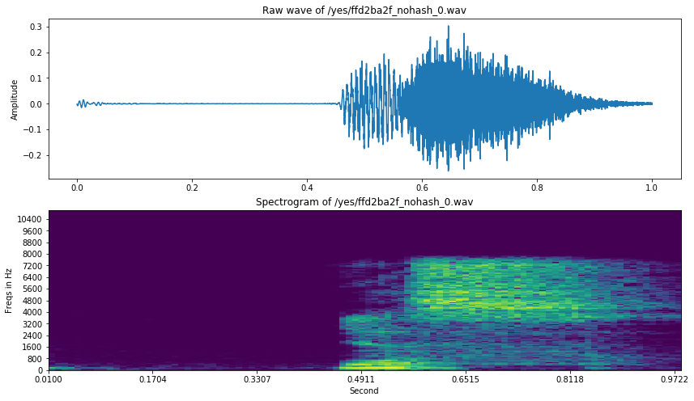
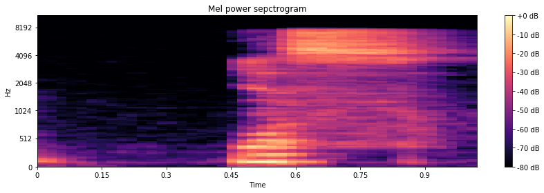
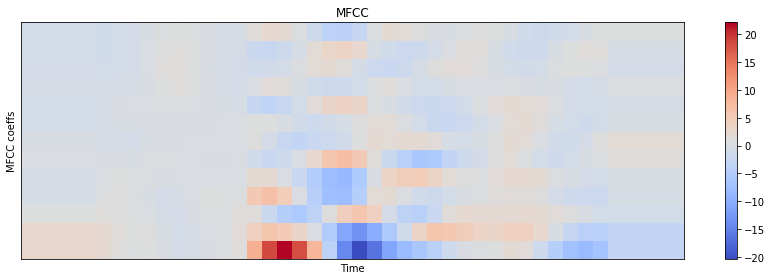
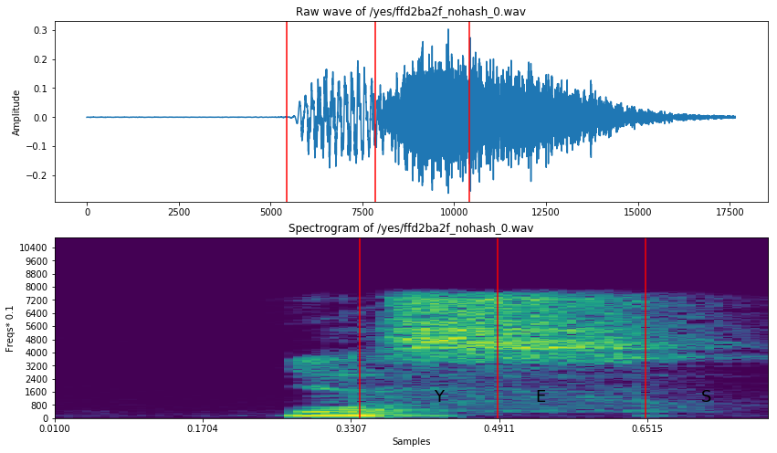
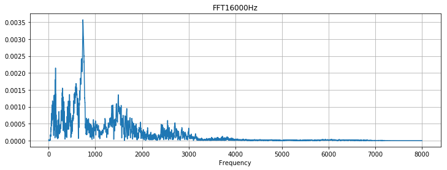
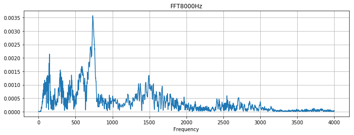

# Sound Data Representation

파일을 업로드 해봅시다.

scipy.io의 wavfile.read 함수의 경우, 파일이름을 인자로 받아서 sample rate와 data를 return 해줍니다.
- 24-bit 데이터인 wav파일은 읽지 못합니다.
- 32-bit floating-point 나 32-bit PCM 이 권장됩니다.
    - PCM(Pulse code modulation) : 아날로그인 소리신호를 디지털로 표현하기 위한 것입니다.


```python
import os
from os.path import isdir, join
from pathlib import Path
import pandas as pd

# Math
import numpy as np
from scipy.fftpack import fft
from scipy import signal
from scipy.io import wavfile
import librosa

from sklearn.decomposition import PCA

# Visualization
import matplotlib.pyplot as plt
import seaborn as sns
import IPython.display as ipd
import librosa.display

import plotly.offline as py
py.init_notebook_mode(connected=True)
import plotly.graph_objs as go
import plotly.tools as tls

%matplotlib inline
```


<script type="text/javascript">window.PlotlyConfig = {MathJaxConfig: 'local'};</script><script type="text/javascript">if (window.MathJax) {MathJax.Hub.Config({SVG: {font: "STIX-Web"}});}</script><script>requirejs.config({paths: { 'plotly': ['https://cdn.plot.ly/plotly-latest.min']},});if(!window._Plotly) {require(['plotly'],function(plotly) {window._Plotly=plotly;});}</script>


```python
train_audio_path = 'input/train/audio'
filename = '/yes/ffd2ba2f_nohash_0.wav'
samples, sample_rate = librosa.load(str(train_audio_path)+filename)
```


```python
samples, sample_rate
```


    (array([-1.7637392e-03, -2.2364603e-03, -2.1859868e-03, ...,
             2.3938194e-03,  2.1600134e-03, -5.6248632e-07], dtype=float32), 22050)


```python
type(samples)
```


    numpy.ndarray


```python
ipd.Audio(train_audio_path+filename)
```


                <audio controls="controls" >
                    <source src="data:audio/x-wav;base64,UklGRiR9AABXQVZFZm10IBAAAAABAAEAgD4AAAB9AAACABAAZGF0YQB9AADF/7n/r/+f/43/d/9i/1P/UP9N/0b/Qv87/yz/Hf8V/w7/B/8L/wv/EP8Y/x7/JP8q/zb/Nf8//0f/Uv9d/2v/ev+G/5T/nP+n/7T/vP/M/97/9f8IABsAOABKAF8AdwCJAJYArAC8AMgA2QDoAPgA/wAKAQ8BGAEmAS4BOAFAAUgBVQFfAWQBZgFhAVwBWAFVAVUBVAFOAUwBQgE8ASsBHQEWAQgB8wDgANYAxQCvAJQAggBrAFQAQgAuABsADQD8/+D/yv+y/5P/ev9k/1P/Pv8q/w//+f7g/sb+r/6W/ob+bv5d/kv+OP4u/hz+Gv4S/hD+B/4Q/hj+Ff4Z/hn+F/4Y/iP+KP42/lT+W/5k/nX+g/6c/qz+yP7i/vr+DP8e/zn/SP9j/3r/lv+1/9n//v8aADwAXABxAIMAnwC2ANMA7AADARwBMAFGAVYBawGAAZQBpAG0AcEBygHYAdcB2wHZAd4B4AHYAewB5wHrAe8B7gHoAdYBzQHBAbABpQGTAX4BbQFPATsBIwEEAeoA0gC1AJ8AhgBrAFIAOwAqAAwA9v/d/73/p/+R/3L/V/8+/yj/Ev///uv+0f7A/qT+l/6D/nP+cf5j/l3+Vf5U/lP+TP5R/lD+V/5X/mP+a/53/of+kf6m/qv+uP7D/tT+3P7o/gH/Fv8o/zz/Uf9k/3b/i/+X/6z/xP/T/+j/AwAcACcALwA9AEQASgBWAGkAdACFAIsAlQCiAKoArwC0ALsAvwDKAMwAyADLANQA3gDWAM8AzQDBAL8AuQCyALEAsgCuAKQAnACLAIIAegBpAGEAWQBUAE8ATABKAE4AQgA5ADQALQAsACgALQAvADMALwArAC0AJwAlACEAIwAeABgAFgAZABYADgAOAAoABAAAAP7/9v/z//D/7//t/+L/2f/e/+H/2f/R/8f/yv/N/83/0//W/9j/0v/O/87/1f/S/87/zv/T/9L/0P/W/9L/y//N/9H/zf/R/9P/1P/N/8v/zv/L/8z/zP/P/9H/1//V/9b/2//X/9v/2v/j/+X/7//u//P/+f/5/wAAAwADAAMABQAGAAgAEAAUAA4AEgATABUAFwAVABIAEQAMAAoABAAJAAQA+f/6//T/7f/t//T/8v/1//7/AwAHAAwAFQAbACQAKQAoAC4AQgA8AEAASwBQAFUAXgBkAGoAbQBtAG0AcgB5AHgAgQCEAIcAigCGAIUAfAByAHoAeQB2AH4AgwCDAH0AewB+AH8AfAB3AHwAgwCEAIUAfgB+AIMAfQB7AHgAdwB4AGsAbwBvAGcAYABQAFIASQA+ADgANQApAB8AHgAZABEADAAGAPv/+f/z/+v/5//k/9//2f/S/9T/x/+//7T/sf+l/53/oP+U/5D/hf9+/3r/b/9j/13/WP9T/0r/Rv9C/z3/Nf8v/yr/If8g/x7/Hv8Z/xr/IP8Y/yb/Lv8x/zr/QP9L/0j/Tv9X/2T/b/98/4L/kv+g/6r/vf/I/9H/4P/y//3/BAAPABkAIgA1ADcARwBOAFEAXgBgAGoAcwB1AHsAiACPAJYAmwCgAKIAowCnAKQArgCqALIAswCoAKwAsACxALEAsQCtALQArACpAKYApACfAJwAmQCTAIwAgAB2AGwAYABVAEkAPQAzACQAJAAYAAUA+f/u/+r/2v/S/8X/t/+w/6P/k/+M/4b/gv95/27/Z/9f/1b/U/9P/0r/Qv8//0P/Pv85/z3/Pv86/zf/Nf84/0L/Rv9A/0H/QP9G/0v/Sf9S/2L/Zv9j/2X/dP94/33/jf+M/6D/rv+x/8D/x//T/+D/5v/x/wEABwATABcAIgAsADYAQABHAFUAWgBdAGUAawBuAG0AcQByAG8AdQCAAIYAhQCCAHsAfAB7AHMAcABvAHIAcQBwAG0AcgBwAGcAZwBgAFgAUgBLAEQAPwA5ADcAOwAyADAAMgAmACEAHAAXABUAFwASAA0ADgAFAAIAAgD9//j/+P/0//D/8P/1//j/9P/9//f/+v/+//7/BwAIAA0ADQAKABEAFgAcABYAGwAbABcAHwAjACUAJQAqACgAIgAiACkALQAsADAAJwAlACgAGwAZABUADQATAA8ACAADAAUAAgD9//3/+v/4/+7/6//i/9v/2P/S/9f/0f/J/8n/xv/B/7//wv/D/9H/0//Y/9f/2//a/9b/2v/k/+n/4//j/+X/7f/r//P/+//9//3/+f/7//j/+P/9//v/BQACAPz/CAARAAsAEAAQABAAEAACAAoAEwAUABQAGAAXABQADgASABgAGgAgABoAHwAcABsAFgAUABkAFgAXABgAGQAXABQAEwASAA4ADgANAA0ADQAKAAgAAgD9//7/+P/6//r/7//y//L/8P/t/+z/6f/o/+v/6//s//L/7//y//X/9P/y//T/9//0/+//9//1//r/AQADAAoAEAASABMAEQAWABwAFgAbAB0AHwAbAB8AIAAdAB4AJgAkABoAHAAZABYAFQAVABMAEgAOAA8ACwANAA4ACgAEAAQABwD7//3//f/8/wEA///6//7/BQADAAIAAAD8//r/+P/2//v/9f/y/+7/6v/l/+P/4f/g/+T/3f/d/+H/3//b/97/3f/j/9r/2//c/9r/3f/W/9b/2f/W/9b/2v/Y/9j/4f/k/9//3//k/+f/4//q/+7/7//x//L/9v/9//7/+//+//7/BwACAAAACgAEAAQABgAIAAcACAAKAAgACQALABEAGAAZAB4AHQAgACcAIwAmACQAJwAiACMAKAAlACcAKwAtACoAKwAnACgAJQApACYAHAAmAB8AIQAgACIAGwAXABwAFgAZABMAEAANAA4ADQAJAAIAAAD+//j/8//x//T/9f/z//H/8P/q/+j/5//q/+3/7P/m/+n/5P/j/+P/4//h/+T/4//f/97/2//j/9//4v/f/+D/3P/g/+L/4P/j/93/3//f/+H/4P/d/97/2v/e/9//4P/h/+f/7v/v//L/9P/3//X/9P/7//7//f8CAAMABgAJAAUABwAHAAsADAAOAAwABwAUABUAEwATABcAGAAdABgAEgAXABIAGgAVABIAEQAVABkAGQAhAB4AHwAiACEAHgApACkAJwA0ADIANAAyADEAKQAqACcAIQAjAB0AIAAcAB8AFAAOABEAFAARAA4AEwAKAA4ACwAHAAgABAAAAAAABgD9//3/AAD+///////+//X/+f/1//T/+P/0//n/9//9//j/8P/x//P/+v/1//X/9f/v/+r/7P/q/+n/5//n/+X/3v/i/93/4P/f/9j/1//Z/9b/0//T/9H/1f/Q/9P/0//T/9D/0v/W/9f/2v/T/9T/1//b/9z/3v/h/97/5v/p/+7/7v/w//f/+P/0//T//P/6//j/+v/7//r/+/8AAP7/BAAFAAYABwAGAAMABgAMAA0ADgANABEAFAARABgAHwAfAB8AHwAjACUAKQAnAC0AKwAoACcAIQAiACMAIQAfABsAHwAYABIAEwAWABcADwAQAA8AEwAPAA4AEwAOAA4ADAAPAAcACwANAA4AEAAPAAkAAQAIAAUABgAEAAMAAQD5//f/8f/1//H/8v/s/+7/7//t//T/6//r/+z/5v/o/+T/5//p/+n/5v/j/+T/5f/d/+D/5v/g/+j/6P/r/+j/7//v/+//9f/1//P/9P/0/+z/7f/r/+X/5f/e/+X/5v/o/+P/4v/l/+P/5P/f/97/3//Y/9j/3f/b/9z/3v/b/9v/0v/Y/93/3v/e/9//5f/j/+L/4//o//D/7//y//n/+P/3//r//P8EAAUABQASABQAFQAcAB8AJQAmACQAJwAtACsALAAuADAANgA3ADsAOwA8AD4APAA2ADoANwA3ADIAMAApAC0ALgAvADEAMAAyAC8AMwAsACYAJAAdACMAHwAdABwAFwAUAA4ACwAHAAgAAQD6//n/8f/y//H/6P/l/+D/3//c/9v/3P/h/+L/3P/d/9z/1v/T/9L/0//T/9f/0v/M/8v/y//K/8X/zv/L/8v/0P/S/9X/1P/X/9D/zP/J/83/1f/Y/9j/1P/T/9n/2v/T/9r/2v/c/97/4P/m/+L/4v/m/+n/6v/v/+z/7v/x//T/+//9/wAA/f8DAAkACgARAA0ACQANAAYACQAGAA4AFgAOABMAEQAVABMADQANAAwACwAQABEAEAAPABIAGgAaACAAIQAfACIAIwAnACoALAAqAC0ALgAnACsANQAzADQANwAzADUANgA4ADcANQAzADAAMgA3ADwAPAA7AD0APwBAAEAAOQA7AD4APAA9ADsAPgA9AD8APwBCAEQARgBDAEQAQgA7ADoAMwAwACsAJQAcAB8AHAAYABQADQAHAAIAAQD6//T/9P/x/+//8f/v/+3/5//q/+//6f/o/+P/7v/t/+X/5//k/+L/2//f/+T/4f/h/97/5P/n/+b/6f/p/+n/5f/l/+v/4//e/9//3//a/9r/4P/e/+D/3f/d/93/3P/b/9X/1f/X/9v/3//Z/+D/3v/d/9r/1//X/9f/2f/c/9v/3//f/9r/3f/c/9z/3//e/93/3v/c/+D/4P/j/+r/7//u/+7/9P/u//T/8//2//f/+f/6//7/CAAFAAYABAADAAIAAgAIAAoABwADAAAA/v/7//z//v/4//7/+f/7//z/+////wAAAwAGAAcA///8/wUABwAAAAMAAQD//wAAAAAAAAAABgAEAAcACgAHAAYADAAPAAoADgARABQAFQAWABsAGQAZABcAFQAVABAACwAJAAoABAAGAAEAAQD//////v/8/wYAAgABAAAA/v/+//v/AAD9/wYA/v/7//r/9P/3/+//9v/2//r///8CAPv/+v/9//z/AgD5//z/AQD9////AQABAAEAAAD3//3/+P/8//7//v8CAAQACwAKAAoABwAFAAQABgAEAAEA/v/7/wIAAwAFAAoACwAKAAIAAwAFAAQAAAABAAQAAAAHAAYACAAIAAQACQAIAAgACQADAAkACgAHAAoACQAGAP//AgABAAIAAQD8//z/AQD///v/+//8//3//f/+//f/+//8//n//v8AAAYACQAFAAgABwAGAAYABQAHAAYABAAJAAUACgAMAAUABgAFAAkABAADAAUADAAPAA4AFAAWABEAFAASAA4AEQANABQAFQAQABIAEgATABEADQAFAAEA/f/+/wMAAwADAAIABAAGAAEA/v/7//n/+f/7//f/9//7//3//f/+//3//f/6//b/9v/2//n/+P8BAAIAAgALAAoADgAIAAQABwADAAMAAwACAAgACQAGAAgACgAKAAcABwAJAAsACQAJAAgACQAFAAcACwAIAAoADAAHAAUACAAHAAEABQAHAAwACQAEAAUAAQAAAP7/+//5//3//v8BAAEAAQAGAAUAAAAHAAQAAwAEAAAA///+/////v/+//7//P/9//7//P8AAP7//P/9//X/9P/y//H/9P/0//b/9f/y//X/8v/w//T/9P/1//j/9f/x//H/9v/3//H/9//2//P/8v/u//D/8//w//L/9f/2//n/+P/9//3/+f/3//f/+f/1//f/+//4//3/+//7//X/8v/z//b//P/5//b/8//3//H/8f/z//L/7//u/+v/6f/w//H/9v/w//j//P/w//b/8//z/+//7//x/+3/9//5//z/+//3//j/+v/4//j/9f/y//L/9P/5//T/9f/y//P/9P/v//T/8v/0//P/9f/0//H/8v/y//X/9P/1//H/7v/s/+3/7v/t/+7/7f/1//b/8v/0/+7/9f/0//f/9//3/wIA//////7/AQD9//7/+//3//7//P/6//3//P/+//7////9//j//P/5//z/BAD+/wEAAgD+/wMAAgACAAQABgAJAAcABwAFAAkABwD//wMACgANAAsABQAFAAMAAQAIAAwADwAJAAwADAAHAA4ACgAFAAQABgAJAAYADAAQABAACwANABEADAAIAA8AEQAQAA4AEAAUABAAEwAQABIAFQATABUAFAATABAAFwAaABMAEwAOAA0AFAAQAAkACwAWABoAFAAXABgAFgAWABMAEwATABYAEAAUAA0ACAARAA4ACQAKAAsACAAEAP//BAD+/wEAAgACAAQABQAHAAQABwAJAA0ABwAFAAsABQADAAQABQAKAAoADgAOAAYACAAFAAMAAgACAAMA/f8CAAAA/P8BAPn/+//5//j/+v/6//v//f8CAAEA/f/+/wAA/v/6//r/AAAEAAUABQACAAYAAwABAAIAAQAGAP7/+//5//3//P/7/wQABgD+//3/+//6//n//v/9//f/+v/6/wEA/f/7//r//P////3//f/6//n/AAAAAPn/AgADAAEAAAD8//z/AAD6//r//f/9//7/9/8BAAAA/v8AAPv///8GAAYABgABAAMABAAFAAMA/f8AAAMABgAGAAEA//8CAAMABgAHAAcABgAGAA0ADgAPABAAEAAJAAkABQACAAUA///9/wQAAgD+//3//P/3//b/9//w//b/9f/t//D/6//o/+z/6f/r/+n/6P/r/+r/7v/s/+3/8f/w//L/6//s/+3/8P/s/+v/5//o/+//7f/r/+z/7//x/+7/5//o/+r/7v/u/+r/6f/p/+n/5f/t//D/7f/s//H/9P/1/+7/7//w//D/9f/z//P//f8CAP3/+//9//r/+f/5//b/+f/9//7/+f8AAAcABQAEAP3//P8BAPr/+//5//7/AwAGAAQABQAMAAsACwALAA4ADAANAA4ADAAQABMADwAVABQADgAQAAgABwAKAAkAEAAMAA0AEAATABYAEgATABoAFgAOABEAFAATABQADgARABcAFgAVABAAEQAUABYAEwAQABEAEAAQAA0ADwASABYAFQAOAA8ADwAMAAQABAAEAAoABQACAAEABQABAAEAAAACAAcAAgAFAAIABwD+//z//v8AAAEAAAAAAPv/AAAAAPb/9//4//b/9f/z//L/+P/9//n/9//2//n/9P/y/+v/8P/2//L/8//4//z//v8CAP7/AQAHAAwACwAMAA0ADQANAA0ADgAHAAkACwAKAAoACQAKAAkACwAPABEADgAVABAADwATAA4ADQAMAA8ADwAJAAkACQAKAAwADQAHAAwADwAKAA8ACgANAAwACAAHAAcAEAAGAAoADgARABMAEgAQABAADwALAAwACwAOABQAEgAPAA4ACgARAAkADAAPAA4AEgAUABUAFwAYABUAFwAXABYAFgARAA4ADgAKAA0ADgANAAoACwAIAAEABgACAAIABAD8//j////7//j/9P/v//X/8f/w/+3/8f/0//T/9f/z//b/9f/z//r/+P/0//X/+f/1//X/9f/z//X/9f/z//H/9v/1//H/7//q/+3/7//s/+v/7P/l/+n/6//h/+X/5//n/+z/6//o/+X/5f/k/+P/5P/h/+v/6f/r//H/8P/y/+//8f/s//f/8//z//b//f8DAAMA/v8BAAcACQAFAAMACAAKAAoAAwAGAAcADwAPAA8AEQAVABkAEAARABEAFAASAA4AEAANAA0ADQAQABEADgARABAAEAAQAA8ADgAFAAkACQAHAAkABwAQABEAEAAOAA0ADgAMAAgACAAMAAkACwAHAAgACgALAAkABwAGAAcACgAKAAwADwANABIAEQARABEAEAAKAAsABgAGAAUAAQD//wEA/f/4//j/9v/z/+7/6//p/+j/5//j/93/4P/e/9//4//g/97/2//d/+b/5P/m/+X/5//q/+X/6v/s//H/8//y//D/8//y//j/+//8//z/AAADAP7/AQACAAIABgADAAAA/f8AAAAA/P/+//3/+v/8//v/AQD6//j//P/5//D/8//y//H/8v/t/+//9P/y//P/8//w//T/8v/2//v//v/6////AAAHAA4ABwANAA0AFQAWABcAIAAaABwAIAAlACMAHgAiACEAIAAcABgAGAAWABIAEQARAA4AEQAQAAsACAAIAAYABgAAAP3/AQAAAAIA///4/wEA///6//n/AQD///r/9f/2//n/9//7//n/+f/8//r//P///wMA/v8CAAoABQADAP7/BgAKAAoACAAGAAwABwADAAcACgALAAoAAgAGAAMAAAABAPv/+v/3//X/8f/3//7//P/+/////v/7//3/+//6//f/+v/8//H/9//4//L/+P/v//T/9//y//H/9f/y/+//8v/2//r/9//8//7/+f/6//v/9f/8/wQAAwAEAAQACgAJAAwADQAMAAsACQANAAwADQADAAEABAD7//n/9//4//b/9f/w/+r/7P/t//b/7v/y//L/8//7//r/+v/6/wEAAwD+////AQAFAAoACAAIABAAEgASABcAGAAZABcAFwATAA8ADwAGAAYAAgADAAoACAAFAAQAAgAAAP//AAACAAEA+v/6//r/+//5//n/AAD9//j//P///wQACAAFAAEABwAGAAIABQAJAA0ACQAKAAwACQAIAAsACAAGAAoACgAHAAUAAwAAAPz/AAD7//X/9P/0//P/8P/z//j/9//3//X/+P/2//L/+f/1//H/9f/2//T/9f/2//j/+//6//z//v8CAAcAAQD7//j/9v/0//P/7P/s/+3/6f/t/+3/9P/t/+7/8//t/+3/6P/r/+//7v/t/+//8v/0//L//P/6//n//f8AAP3/AgAJAAoABQAFAAQABAAIAAMA/////wUAAQD+/wQAAQAGAAEAAgAEAAIACQADAAgABwACAAcABgAHAAQABgAGAAEABQAHAAcABgANAAcABgAOAA4ACQAHAA8ADAALAA0ADgAOAAsABwAHAAYABgAFAAcABgABAAQABQACAAIABAAGAAIABwADAAEAAQADAAQABQAEAAEA/f/7//7/+//8/wIA/f/6/wAA//8AAPj/9v/z//T/+f/z//L/+P/1//f/+P/3//j/9v/2//n/8//z//H/8v/0//T/9//1//X/8v/z//j/+v/3//f/9v/z//7//f/2//j/9//6//b//v/8//j/+f/5//n//v/8////AgAAAP//BAAJAAMA/v///wMA/v/+//z///8CAAAAAAADAAYABgAGAAYAAgD9//n//f/6//b//P/5//7//f/4//z/AQAFAP7/AwAEAAAABgAHAAkACQAIAAgABwALAA0AEgAVABQAEQAUABsAEQAVABIADAATAA8AEQANAA4ACgAEAAsACAAFAAMABAACAP//AgD9//n//////wQABgD8//7/+P/7//n/+f8EAAEAAwD8/wAA/v/9/wAA+v/6//v//P/8//v/+P/2//v/+f/z//f/9P/s/+3/8f/v//P/8f/t/+3/8f/y//H/8v/1//j/9v/2//f/+P/z//H/9//1//X/7v/q//P/8f/w//D/8//1//L/7v/u/+z/7f/r/+b/7f/u/+3/8v/y//H/9P/x//L/8//z//P/9v/z//X/8//4//v/AAAIAAMAAwACAAEAAwAJAAwACwAKAAoADQASABIACQAMAAcABwAMAAsACwAGAAoACQAKAAkABgAEAP7/AAACAAIAAQADAAMAAgACAAYABAABAAEABAAGAAsABgD///3//f/9//7/AgD8//z/AgAFAAYABgAGAAUABQAJAAgACQALAAUACAAJAAsACQAJAA0ACgAMAAwACgANAAoACAAJAAUABgADAAIAAgADAP//AAAAAPv/+v/3//n/+f/3//n/+P/0//j/9P/0//X/9f/5//X/+f/6//X/9//3//b/9f/8//n/+v/4//j//f/5//r/9//2//f/9v/z//T/9f/3//P/9P/4//X/8f/w//D/7f/v//P/8//z//X/9f/4//n//f8AAAIAAwAFAAgACQAGAAYACAAFAAMABgAGAAQABQADAP//+P/9//b/8//3//T/+f/7//v/AAACAAAABgAAAAIAAwABAAUA/f8CAAAAAQAEAAUACQAHAAoABAAFAAkACAAHAAgADgALAA4ACgANAA0ACgAQAAsACAAJAAUABQAIAA0ACwAHAAoACwALABIAEAAPAA8AEQASABYAFQAWABYAEgAWABUAGQAZABAAEAAMAAwACAAFAAcABAAEAAAA/P/7//v/9//2//X/8P/1//T/8v/x//H/8//0//r/9//7/wEA//8AAAMABwACAAEAAAABAAIA+/8AAAEABAD///z//v/7//j/+P/5//T/8//2/+//7f/x//L/9f/1//v/+f/4//n/8f/v//P/+P/1//f/9f/0//v/+v/+/wAABgAGAP3///8DAAMAAwD//wEAAQD///v/+//7//3/+f8AAAUA/P/8//v/+v/7//n/+v/4//z//f/9//3/+v/9/wEAAwABAAIAAAAAAP//AwAJAAMACAAKAAUAAwAAAAoACQAFAAkABgAJAAIA/f8CAAUAAQD+//3/AgADAP//AwAEAAgABgAHAAgACAAKAAkACAAKAAkABwAJAAkADAAMAAgADAAHAAYABQAHAAcABgAMAAoABQAJAAoACQALAAYABQAHAAMAAwD//wIA/////wEAAAABAAUABQABAAEAAgADAAAAAAAFAAAAAgD//wEABgD9//v/+f/5//b/+v/8//j/+v/9//z/9v/3//P/8//0/+//8P/u/+v/6v/p/+3/6P/m/+H/4v/g/+T/6f/o/+r/8P/u//D/9f/0//n//f8BAPj//P8CAAUAAwAEAAkACAAKAAwAEgARAA4ADwAMABEADAALAAsABgAHAAgABQD7//3/+f/5//f/9v/4//f/9//w//D/8//0//T/9f/8//n/+/8BAAYAAgAEAAwACgASAA8AEgATABEAEQARABEAEgARABEAEgAOAA0ADgAMAAUABQAGAAcACQAHAAcABQAHAAYABQAGAAMAAwADAAEAAAAFAAMABgAEAAIACQAKAAYAAQABAAAA/v/6//3/9//1//b/9P/4//b/9P/3//X/8//5//X/8f/y//D/8//0//f/+v/2//n//P/4//f////9//3/BgALAAgACAADAAYACAAJAAkADAALAAgACwAIAAUA/v/8//3/9v/1//n/9P/z//H/8P/t/+3/6v/k/+b/6v/w//H/7//y//b/+f/5//f//P/7//3/AwABAAMABgAIAA4ACgAOABEADgALAAwAEQAKAAwADwAPABAADQAQAAkACAALAAsACAAFAAYAAwAEAAUABwAAAAIAAQD9//7/+f/3//n//f8CAAMAAAABAP7/+f/5//f//v/7//3//f/6/wAA/P/9//r//v/+/wMABQADAAMAAgABAP7/AAAAAAEAAAACAAUABAACAAYABwAIAAgACAALAAkACgALAAkABAAAAAcACgAJAAsABgACAAMAAwAAAPv/AAD9//f/9f/2//P/7v/y//X/9//3//X/8v/1//P/9v/5//H/7//s/+z/7f/o/+n/7f/q//L/9v/0//P/9//0//X/9f/v//P/9P/3//T/9f/1//j/+v/2//z/9//5//n/9v/z//j//f/6//z//f8AAP7/AQAAAP3/AAACAP//AgACAPv//P///////////wEAAQAFAAQABAABAAIA///8/wIA///+/wAABQACAAQAAgAAAAAABwAGAAUADQAQABIAEgAXABYAEgARABAADwAJAA0ADQAKAA8ADQAMAAoADAAOAAoADgALAAcACAAIAAQA/f///wEA/f/9////+//7/wEA/f/9/wMA/f8CAAEAAgD///n////8//v//v8DAAIAAQAJAAcACAAKAAMAAAAAAP7//v8CAAIAAAD6//z/+P/z//f/8//z//H/9P/w/+r/8f/1//X/8v/1//X/8//3//X/9//5//b/8P/w//L/7//x//L/9f/4//7/AAD+//7//v8AAP//AgD8////AQD+/wEAAQAAAAEA/v/8//3///8AAAEAAQAAAP//AgAGAAcABQAEAAUAAQADAP//AQAHAAEABwAHAAMACgAIABIAEAALAA4ADwAMAAcACgAEAAEABAACAAIABQAHAAkABwAIAAQAAgAFAAMA//8DAAQABwAGAAsAEwAOAAsADwAJAAUAAwAEAAMA/v8JAAgACQAGAAQABgAEAAYAAwACAAQAAAABAP7/+P/3//v//P/9//7/AgAFAAAAAAACAPr/AAD///f//v8AAP3//f///wAA+v/5//r//P/8////AAD+//z/AwAEAAAABwACAAgAAwABAAIA/P8DAPv//P8AAP3/+v/6/////P///wIAAQD///v///////j/9//0//P/+f/0//T/8//z//f/9//2//r/9v/4//n/+f/6//r/AAD9//r///////7/+v/7//r//f/8//f////7//7/AQAAAAEAAgD9/wAAAAD8//v//P/8//r////8////BAADAAgACAAJAAwACAAIAAQAAgAHAAUAAwD8//3/AwACAAQABwALAAcABgAMAAkACQAJAAwADQAMAA8ADwARABIADwAKAAkACgAJAA0ACwAKAA0ADgAMAA4ACwAEAAQAAwACAAQABgAIAAMABQADAP7//f/+/wIAAgABAAIAAwACAPz/9v/2//n/+P/4//n//f/4//j/9v/9//j/8f/3//f/9//2//j/9v/3//n/9v/3//f/9//z//L/7v/v//H/7//x//L/9P/z//b/+f/7//n/9//8//r/+f/5//j//P/+//r/+v/5//3//P/9/wUABQAAAAcACQAJAAkACgALAAsAEAANAA4ACgAKAAoACgAGAAcACgAGAAQAAgADAAMAAgAAAAIABAD//wAAAAD+//////8AAAIAAwAEAAUACQALAA0AEAAQAAsACgALAAoACgAHAAQABAACAAUAAgABAAEAAAAAAAIAAwACAAkACQAJAAkABgADAP7/AAAFAAUAAgD8/wIAAQABAPv/AQAEAAIA///8//z//v/9//v////6//f/+P/8//v/+f/3//z//f/6//r///8CAAAAAgD+////+//4//n/+f/7//r/+P/6//v//P/6//n/+//+//3/+//7//r/+f/+/wIAAQD+//7//f/7/wAAAAAFAP7//f/+//3///8AAAAA//8DAAgABgAFAAgABAAEAAIAAgD+/wUABAABAAMABAAFAAUACAAKAAoACAAHAAkADQALAA8ACAAHAAgACAAGAAUAAwACAAEAAAAAAP//AQD9////AgADAPz/AQD///7//P/+/////f////z//P/+/wEA/v8AAAIAAQACAAIAAAAAAAEAAwAFAAYAAwADAAMABwAEAAIAAQD//wIAAgAEAAEA/v/3//n////9/wAAAQD+/wAA/f////3//f8DAAEABgABAAIABAAAAAAAAwAAAAEAAgD8//7/AgD//wQAAQAEAAAA/f8CAAAAAwACAP3///////r//v/+/wEABAABAP///f/6//r//f/+/wAA/P/7//v/9f/3//T/9//6//T/9f/x//P/9f/2//X/7//y//b/+P/3//T/+P/z//D/9f/4//b/8//2//b/+P/2//P/9P/0//X/9//3/////v/+/wMABAAFAAIABQAJAAwADAAKAAkACQAOAAwADwALAAsADQAKAAwACAAIAAgABAAEAAEA//8AAAIA/v///wAABAALAAoABwAFAAUABwAFAAYABAACAAgACwADAAUABwADAAAAAgABAAUABwACAAQABgADAAAAAQAAAP///f/5//v//P/7//3/AgD//wAAAAACAAMAAQACAP3//P/2//n/+f/4//n/+P/1//T/9//x//D/8//v//P/8//y//H/8v/u//D/8f/w//j/9v/2//f/9//4//z/AwD///3/AAD8/wIAAwAFAAYABwAIAAsACgAJAAgACAAJAAMABgADAAMACAAHAAYACQAIAAgABAABAAMAAAD8////BQACAAMA///+/wEA////////BQAEAAEAAwD//wEABQAEAAUABAAFAAUABwAFAAEAAAABAAIAAwADAAMAAwAHAAEAAgAGAAYABgACAAAAAwAEAAEAAwACAAIABAAFAAEAAwACAAUABwAGAAwACgAGAAYABgAFAAMABAAEAAYABAADAAEAAwACAAMA/f////7//f////7/AwACAAUAAAAEAAUAAgAFAAUABAACAAAAAAACAAQAAgAEAAQABAACAAAAAwABAP///v8EAAQA/P/6//v/+P/5//r/+v/4//X/9v/x//X/9//5//v//P/6//n/9//+////+////wIAAAADAP7/AQAGAAYABQAIAAcAAwAHAAYACQAIAAUACQAPABEACQAJAAoACQAKAAkACQAGAAcACgAIAAcAAwAEAAEAAAAEAAUABgAEAAcABAABAAUAAAACAP3//P/8//n/9v/x//X/9P/1//j/+f/4//j//P/4//n/+f/5//n/+f/7//z/+//6//3/AQD///v/+//8//z////8//v/AwACAAUABAAAAAYABQALAA0ACwAMAAgABQAHAAIABAAGAAQABgACAAEAAQACAAAA/f/8//n//f8AAAEA/v///wIAAQACAAQABgAEAAYABAAEAAEAAgACAAAAAwD//wAABQACAAUAAgAFAAgABgALAAcABwAGAAYAAgACAAgABQAHAAQA//8AAAIA+//7//r/9//5//X/+P/1//f/9//1//X/9P/1//f/9v/x//X/9P/4//X/9//5//f/+v/8//z/+//8//v/+P/4//f/+f/7//z/+v/8//7/+f/+//7//P/5//v//v/7//3//f8BAAIAAAABAAMABAABAAIAAQABAPz/AAD///3/AAAAAAQAAgAEAAMAAwAGAAYAAwAHAAYABQAEAAcABwAIAAsABgAIAAUAAwABAAUAAwAEAAYADAAIAAgABgAEAAgABgAGAAUABwAGAAQABAAEAAUAAgAHAAoABQACAAMABAD9//z/+f///wAA/v8CAPv//v8AAP7/AwADAAEABAADAAAA/P/7//r/+P/5//j//f8DAP//AQAAAAEAAwD+//7/AAD9//7/AQABAAIA///+/////P/2//f/+f/4//f/8v/w/+7/8P/0/+7/8P/y//T/9//y//r/+f/6//f/+v8CAPv////6//r/+v/6//v/+v/+/wAA/P/+//z//P8AAPz//P///wMAAgD+///////+//7//v8AAAAA/f8AAAQAAQACAAMABQADAAEAAgADAAMA/v/+/wEA//8BAAIABQABAAAAAgADAAEAAQADAAYACwAKAAgABwAJAAkADAAKAAsADAAKAAsADAAMAAwADwASABEAEQAQAA4ADgAOABEAEQASABEADwAUABAACwALAAoACAAGAAkABwAGAAUAAQADAP7/9v/4//n/+f/1//T/8//y//H/8v/4//T/8v/x//P/9P/1//f/+P/5//f/+v/5//n/+f/4//r/+f/6//z/+v/8//3//v8BAP7//f/6//n/9//4//H/8f/0//H/7//y//L/7P/q/+r/6f/r/+r/8P/v//L/9P/s//X/8P/w//P/8v/w//T/9//4//j/+P/5//3//P///wQABQAHAAcACAAJAAgADAAHAAcACQAMAAUABwAHAAIABQD+/wEAAwADAAMAAQAEAAQABgALAAoABwAIAA0ADgANABAADQALAAwADQAPAA0ADwAQAAwAEAAOAAcACgAOABAAEAAQABEADwAOAA0AEQARAA0ADQAOABIAEgAOAA0ADgAPAA4AEQASABEADQAMAA4ACgAHAAcACwANAAkADQAIAAgABgAEAAUAAQACAP//+v/6//P/8P/w//L/8f/s/+//7P/t/+j/5v/o/+j/6P/p/+//7v/p/+r/7f/t/+v/7f/u//H/8//z//T/9v/5//v/+//9//z//P8BAP3//v8AAAAAAgD+/wAA//8BAP3/+v///wAAAgAAAAMABAAFAAQAAwAAAAIA///6/wEAAAAAAP//AAABAAIABgAEAAIAAgD//wEAAgADAAIAAAAFAAYABQAEAAgABwAHAAYABQAKAAcAAwAHAAkACAABAAcACAAFAAcAAwANAAcABwAJAAgACQAJAAkACwAOAA0ADgANAA0ACgAHAAgABwAKAAgABgAFAAUABwAFAAQAAwAFAAcABQAEAAEAAwACAAAAAAABAP3/AAD//wAAAQD+/wAAAgAFAAIAAAAAAAAAAQD+//7/BAAEAAQACAAGAAUABQAFAAUAAgD8/wAABAAGAAUABAAAAAEAAAADAAIAAAACAP7////8//r/+//9/wAAAQD8//3//v/5//b/9f/2//f/9f/0//j/+//1//j/+//3//j//v/9//v/AQD5//v////4/////v/+//z/9//2//b/9f/0//b/+P/2//r/+v/6//z/9//8/wQAAAD//////f//////AAD7//j/+f/7//7//P/8//3//v/8//v//P8AAAEABAAGAAMABgAHAAYACQALAAQABAAGAAYAAwAHAAkABgAIAAcACAALAAsADAALABAAEQANAAwADwAMAA8ADQANABEADAANAAoACQAIAAQABAADAAEABAADAAUABgAHAAAA//8AAPz///8EAP//AQAEAAIABwAHAAQABQACAAEA//8AAAUABgACAAAAAQACAAIAAgACAAAA///9//7////7//r/+v/5//X/9P/z/+//7v/s/+//8v/u/+//7v/t/+//7//x//D/6//r/+//7v/v//X/8//3//f/8v/1//j/9//5//3/+//7//z/+////////P/8//z/9//6//r//P8DAPv//v/5//v/AQAAAAAA//8EAAMAAQAEAAQABgAKAAkADAAKAAkADgAQAA0ADQAOAA0AEAAJAAQABAADAAcABgABAAMABAACAAYABwAFAAAAAwAHAAUABAAIAA0ACgAJAAoACgAMAA8ADgARAAwADgASABEAEwANAA0ADQAIAAoACwAMAAgABgAHAA0ACAAAAAEAAgD//////f/7//z/+v/7//b/9P/x//P/8f/s/+z/8f/z//H/8//4//P/8v/0//P/8f/v//L/8f/u/+//8P/t/+7/7f/q//L/9f/w/+//7P/x/+3/6v/s/+z/8P/w//H/9P/6//n//P/+////AAD7//7////7//3//f/9/wMA//8AAAEA/f8FAAUAAgADAAQAAwAFAAUAAQABAAQABQAGAAoADQAPAAsADgALABAADwAOABAAEAASABYAHQAeACIAIAAgACUAJAAnACgAJgAmACUAIAAfABsAGAAYABQAEgAQAA4ADQAPAAsACQAIAAQAAgD7//z//P/3//L/7//s/+v/6f/n/+//8//z//P/8v/1//P/8v/3/+7/8P/z/+3/8P/r/+n/7//t/+v/7P/q/+r/5v/n/+j/5P/l/+L/3//i/+T/6P/r/+z/7v/w/+//9P/2/+//8//z//T/+f/8//3/AAD+/wEABgAEAAMABQAIAA4ACAAKAA0ADQAPAA8AEAARAA8ADAAOAA8AEAAUABgAGwAaABgAIAAiABcAHwAhACEAIgAhACIAHwAeACAAGQAdAB4AHAAVABYAEgANAAwACgANAAYAAAADAAEA+v/4//j/9f/y/+//7v/s/+7/7f/t/+v/7P/n/+j/6//q/+v/7f/u//P/+P/1//P/9f/3//n/+f/6//n/+v/5//v//P////z//P/7//r//f/7//3//v/9//7/AgABAAAAAQD+//7//v8AAPv//v/+//v/AAABAAAA/f//////BAAEAAMAAwAEAAkABQAEAAoADgALAA4ADQASABAADQASABMADwARAAsACQALAAcABgAEAAMABQAEAP7//v/7//z/+//3//j/9//+//j//v/7//X//v/8//j/8P/1//n/8v/x//P/7v/y/+//7v/z//L/8P/v//P/9//3//n/+f/1//f/+//8//z//v8AAAMAAgAFAAYABwAJAA4ADQAOAAwAEQASAA0ADAAOAAYACAAJAAgADAALAAsACgAFAAEAAAAAAP7/+//4//X/8f/1//L/8f/x//P/9f/z//r/9P/3//f/+/8BAP7/AQABAAMA/v////7//f8FAAAA//8FAAQABAAFAA4AEQAJAA4ADwAMAA0ACgAIAAgACAAGAAgACQAOAAYAAwAJAAIAAgACAAEABAACAAQABgAIAAgACgAJAAgADAAEAAUAAAAHAP//+//5//3/AAD6/////f8CAP7/AAD6/wMAAQAAAAgA/v8CAP3/BwAEAAMABgAFAAQAAgAAAPz/CAAAAAMABAACAAQAAgAEAAIA/f/6//z/+f/8//j/9//5//P/9P/r//D/7P/v/+7/8P/t/+v/8v/t//T/8v/z//D/8//2//f/8//7/wAA+//6//j/+P/5//z/9P/6//3//f8AAP//BgD//wMA//8EAAMAAgD///f/AwD8//7//v/8/wEA/v/9//v/AQD1//j/+f/3//v/8f////v////7//3//v/5/wMA9v/5//b/+P/5//f/+v/8////+P/4//z//P/5/wYAAgALAAkADgAQAAsAFgAPABYADwAXABMAFgAUABIAGAASABcABQAQAAIABQAEAP3/AwAAAAAAAwADAAAABQD7//3//P/2//7/8P/6/+//8//t//X/9P/u//P/6//w//D/8v/u//T/6//z/+3/7P/r/+P/7f/i/+//4P/r/+T/5//q/+P/6//k/+n/4//q/+P/7f/n//H/8v/s//f/8f8AAPj//f////X/AQD7//3/+v/7//7//P/8//n/+f8BAAIAAgAGAP//EQAHAAsAFQAMABoAEAARABUAEQAWABYAGAAQACAAFgAWAB4AHQAhABwAHgAdACAAHQAeABsAGAAeABUAFwAWABQAGwAUABcAFQATAAsACQAKAAQADAAEAA4ADAAIAAwABwATAA4ADAAPABAADgATABUAFAAVABAAGwAYABAAGAAVABAAFAAOABAADwAGAAsABAADAPz/AwABAP3/9f/3//3/+//x/+n/8//m//P/5P/p/+v/4f/o/+H/5f/i/+X/2v/g/9v/2P/b/9v/3//e/9v/0P/W/8n/2//Q/83/yf/A/9b/w//J/73/zP/F/8b/xP+9/83/yP/Q/8P/1P/M/93/2v/Y/9v/2v/v/+f/7f/k//L/9P///wEA/v8FAAwAFgAXACMAFQAuACAALQAvADEAQAA9AEkASABWAE8AYgBgAGcAcABqAHUAeAB7AHwAhwB7AJMAigCKAIcAgwCGAIsAhwB2AHoAbQBtAGIATABXAE4ASgBJADEALwApABkAGwD8/+//1P/L/7z/q/+K/3H/cv9U/03/Kv8a/w3/Bf/i/tD+tP6V/pr+cv5f/jv+Iv4m/hj+9v3M/bX9rv29/aH9f/1v/XP9Z/1a/Sv9Pv1i/VT9ZP07/Vn9df2U/bf92P3n/Qj+Ov5g/rr+2f7n/gT/Wf/E/x4AHQAuAIkAAAFxAYgBpQEEAnoCxQLqAg4DewMFBC0EXwSEBN0EYAWLBaUFswUVBmsGqwaZBpYGzAbIBuMGAwcGB98GpgaMBqkGoAYoBhgGDAb/Bb0FCwX6BPkEvQRNBOcDygOoAxgDlgI8AkECtwEIAYMAZwB/AP/+zv0H/cD9Iv5e/IH6Bfo9+0D7WPk197b3NfkV+TH3ovV29rP3avcV9gX29PbB9yz3tvZt9xf4KvgG+O34Q/qT+mT5jfky++r8w/xg+9X7v/1e/4f+Rf1Z/Rf/YADi/1D/QP/L/7//y/8FAJYAbQD+/10ABQE+AW8ANAA1Ab0CyQIRAssBnALWAwkECgRnBD8F7wVLBn8Gvwa4BroGkgfHCIMJ1wicB4wHtgivCUMJHwijB5oIIwljCOgGBQYFB+8HuwcxBgwFTQUEBhMGFQWZBOcEjgWVBdsEUQRpBNAEUQWYBX8FXgXGBAEF1QQZBewE+AT+BKwDYAKgAbMCrALa/2T8IPxl/rX+dvq99c/18fhr+fD0IvE68iz1pvTx8Jrv9PFZ9AjzAfEO8rD0ZfUt9KD0YPem+BL3sfaE+cr8Nvwr+Xb5Of2r/6X9lfof+4j+v/+o/R376PqM/Nj85/vB+sr6u/qG+uj5pvlE+qX6qPsW+576ZPs2/UD/xf4+/qz/LQMTBVsEawOuBXQJsQqPCcgIQAsYDnMOkAziCwoN5Q7GDmkNYAyKC8ALeQuEC44KTAnEB9EHYggRCLcGugQTBc0FqQahBQMEjgOIBOIF7gVSBZQE8QSKBeEFGwZRBpIGywZnBn0GCgdZB8UGLwYuBj0HuAYHBUUDwgNrBN8CEADH/ogA8v+1+7P2//Zk+mj6qPWa8UnzqfXF8+vuv+4186/1P/IQ7zvxBPZg9sTyHvPM98f7Evpx97f4GPw//D76KPux/oIAwvyr+br6Nv4J/j36hvgo+gz9TPtq94L0/PSh9sb2//V29SX1W/Rg88byUvQs9m333vfs+Kb6PPzq+gH60fxKAnIHcwfYBSoGGAkFC9QLGwweD8wQVRB1D4QOxg4iDTwLPAspDeYM3Qk7BaoDIgTbAocAlP9zAYIDEgJy/uv8Qf5XAG8BGwLwA9QFBAb+BEkEhwU3CDAKYgvrC88LdAv+CToJDwqCCzcN8wwDDMIJgAjoB9UHhAe4BXMF0QVLBvcCk/5K/J7+6ACp/ZP4Bvas+X77VvjZ8lfz4fcu+tL2M/Mx9vr4APlr9Wv2fvvP/aj5MPf++a7+zf72+RX6TvzO/Fr4l/U9+L77C/m489ny8/QN9pbxxe428InzGPNb8BTuxe6c7yTvYfD78cfzjvOp8tPyCfTM9b34pvsQ/pX/DwECA1gETALeAXIG4g3lEVAP5AqtCgEOCBDuDjwNEQ4UD9gOLAxgCboG5AUkBZgFkQWcBBYDZQAu/xn+V/4j/5QBzgOmBkQHJgfTBoYHQQoRDf8P7BHiEw0VmxQtEmARhRJsFNsUhhIDEU0PTgxoCIIFyAV+BhoFCQImAJH+gf3r+c/3GPiT+m/88/q2+DT4I/oq+9T4LPUi93v8MAEwAEn8vvu2/Xn/AP9k/5oCDQQwAQ7+8P0lAPr/Z/zr+jL9Qv7v+yD3E/XR9CHyQO9g7vHv2/BR7vrqHuqE6jfrGeqp6ZPrOu6D8MrwQu897yPwyPGk81X2APq6+9D65PiR+FX74P/ZAbIC5wK9BbgGRQNWAGYBdgbTCisLgAnECeMIqAfXBY0HcAkWCdMHpAjNCcsIrgMlAHACRwapCGMIRAfjB8IGhwQSBWYJTg6BEKQPjg/fEAsRnw//DdIPPRLsE6ATrRHtDrAMrwmNCDoI0wcUBwcF+gHl/gD8UvtJ+3n77vvT/H/9ov4O/fT6NPs2/rACBATRA0cDrwU2B2sEu/49/jICmAfgBzUDlAAQAMz/nPwj+mP74fzn+h74zfZG94z1efCz7wPyoPSP85vww/A28QnuYOrt6g/vJvL778Hty+4N8uPyDfAc74XxNfXk9xf5APni+Fr3gvZ694D5hPuR+7v7ufs4+4X6mPu9/Hr9XP38/Wj/hgEhAmYAvf9bATYEXQerCDEImAjeCb0KewpoCQ8K2gxyDyIPKA3MCwMMAQwyCyUKkwuPDYYNJQ3pDPcMHQ3XDO8Mxg7xD9YO1AzpC8YLSAsxChYI2gd2CH0HWwUQBDcDcwFL/+j9cf//ABIAIP7z/gMBrQGJAEYAgAPgBfAGQQeICNoIZgfDBN4E7AfaBr4A5/uv/Lb//P9m+jn1V/Ua9wr2T/Os8sDy4PFC75zv3PN59k/0dfH08Rn2B/nj9xT3K/gP+Hn2gfZP+Pf41/Zz887z3PZf+C32PfPa8RjzjfUw99b1ivMa8mfyTfR69MH0gfQU9eb1N/ft+DL6BPlz+nf8xf0RAF4B4wLVBCIGhwfKCnQNFw74DHYNOA88ESQSAhFhD5cNzgwRDjsPpw0QC/wHiAeRCXkJxQZ+BRgHygkTC+cJWggzCFYJ1Qu6DS4OiQ08DNUL5AohC6oJDwccBgMG3AXtBZoCGP9D/jP+nv92/yoA5v9MAUwBzALxAkgCMgOoBDoIqQntCacHQAZrBusFGAEe/n/76fsk/q76iPhi9WbyUPBQ77vxrfN88h7wKfBS8zT2yvXD9cj18vfM+VD61/sy/aP8+fgF9//3ePrJ+3v4+/Oe81P0bvQn8+LxkPFH8Sjx1/HX8v7yQPAY7fnt4PFn9bb1iPEx8an0WPia+VT3pvYC+90A0wNDBYoGxwd1CBwLLQ5HEqcTxhCDDzQRhRN/EqkPiQ1cDVUNIwzsC8AL7QgvBRUDngOMBUAGbwWaBE4FHgayB2EK2wpzCkUKDgy1Dz8Rbw8MDHYJRQqrC1sLKQn7Bb0EiwOiA5oDiAK7AZIBKgJSA/UDsQKfAkgDnwNjA0UFeQdKCJQG0QTRB+IH6QA2+KT1X/hu+T/1ofHa8tzzOPFH70bxrvEw8E7vSPLl99741vaa97H6k/tY+gb6SPvO/Ir75PdR9wL3i/TM8Vrvqu8Q8MfuZ+0n7P7routB7J/tV+6J7lruZe/A8aPxSvG27/TvT/KO9D33dvil+Df6/vxWAXcFlgjLCjcMLw4rENASiRUyFv8VIxduGM0YvRbmEqYQGxAEDzsOog0nDHUKygdFBh4GZwUABboEwQWmB1UJ1AnxCfoJXgrkDEgQLBHvEE4RQhIrE2QRYQ6jDNwMVQyHCXwIbQc8BhEEwgCv/zH//f51/3H/+/9xAMAAdQBz//j/CQFnA2EF0QXsBQkGSQWxAk0Bsf93/N/7LvvS+e74xPao9F3zlvOm8q/xRvJx8YHyafNP887z6/Np9Ln1b/XD9Pn0gPTL8rXxrfF38SHyq/B17WTtme6P7y7wP/Co7n3ubvBh8YnysvID8Ivw6fJv8+r0M/MR8izzqPS+97L6fvy9/e8AXgUGB1QJdwrSC88N3A5REdMTdxWoFeUTLRS9EvkR1xHqD7cOQw7eDtcOwg2tDGULRgotCkgKOgvzC1ALcQqQCg8LJQuiCpIKLwv5DBAO1QxPDMcLwwq8CZsHkAasBp0GggX3BEoDhAGpAP/+sf7c/0v/m//lAOQAtAAdAFH/tv+EAD4ABAHlAJcAtwACAOoA/AF+Ap0BqwEWAggAbP2n+7r6DvqT+Fr35vhF+pX4MfZZ9jn2TfUo9FDzGfO18TTxHPKg83HyM/DE7nXuyO+18KLwPPCJ7+rvqfHa89nzoPJh8h/zn/Ww9hz11fJx8yP23/dx+Qr6yvkH+4/7p/1a/3r/3P6v/pYA6gKaBBIE9gN4BIkFpQZ5BsEHoAlBCSgJHwpRDNwNMQ1DDGgM5w1nD2EQ1A8XDxQP7Q/WEBAR9RDkDw0PYg/CD9IPtA3qCg4I7wYICA4IBQUPASMAdP+s/kf+//td+uL6p/vl/eIAugEHAaUCaATrBR4HQwdVB/AHhAlOChgKiQnDCSYJZgfYBjcGWARpAzwCZAEgAEX/sf32+ob58fZj9YX2VvWU8/v0EPcp9vL2lveE99L4gfky+h78yPy6+jP52PlJ+wv7u/q++VH77fsG+2r58/ei+Cj2hfOS9LH3DfYc8w/zVfSg9Mn0FvMR83n28/fF+ID4GPuR+3z8e/06AHYDQgPCAmAFJgasBhgHIAQ5BTsHBwfFBgwHwgU1BWEEQwLYAooCh//S/2oDSgOGAzsEgANjArQD4AWlBt8HXgVaBY8IRwiYBJkGjQUmAzYCQAD5AEgDS/5E/cv+tfz6++T8Rfp2+7D77Puk/04B/ADDAmgCdQHzAtYFwAYXCOwISAtZDWoOpwtfCjYKQwhBCH0KRAhsBy0G6ALCALn/lvrQ+0n6Kvfc+Pb6nvid+Hv2Zvp+/eX7gPytAfj/gAHXAJ8AhP8KAUP+8gJuAjgB+wLqAS8DbQDp/6oAMP4F/ZT+0v09+of54P4d9eLyjvoB9ODvZPeA9of2rveQ+Dj9Yvvf/dj9bf68AgcB5QWxBgILVQQpA2EIZgefAFUGOAdnAdACDAd6/+r+VAK3/Yj+Cf57AqcCYwBbAKQB4f4p/ar90P3A/+P+7/um+zD/a/wP+K78LPvR+cT88/3z/IH/AP6n/5/8+P7A/xb/JP7xASL+TQLzADj8AAcvAGsA5wBSBFYGjgDEAwIGPgHaAOgHZPw7AXoF/f7kAd0DoQKg/koAmQM9+Qj+ugcB/uX/2ArKBXQCeQdC/gsF5AOX/er+Kv95Ag391/te/DEAi/zZ/6X8MAE7A/n9AP9jApMDW/03BmMDZQPnAqcHWPtW/qYFD/vt+nv+/wLA+QMBTQBR/qkB7f4rAUb/YQqF/fAAWAUYBqkLVP1GCyYH0gH8BDcF+v6pCugAuv/FB4wKwfw5BToIov+HBSsFhwGa/DYJ6fwk+UcB3ADe9lT92v5Z+or5GPVa/kL1o/VK+5v0hvuE8j3/L/hz9WT/Sfp2/Yr8V/u6AK4Bwv8YAWoH7wE2Ak0GmQUABCb9yQiIAFT/ngek/wH8+P7P+1v5j/xZ+e73vf6w/7n26f9uAJ398fmt/awDx/jYCIH4QwTOA4v4IwZLBsj6+/4BB+X+5AAn/moA9giZ+7f84AS3Akr3mAg9/n31xv/RAx3tPPzsB3jxeAGYAof+0ALk/n8CyQBSAlAHsfswCpMIBv27BlQIcweUAFf+chQbBKX72QuODRz3lgprBxr+2wYZCLT//QOVAiMFN/9P/CoJGfvRA/wCJgOeAdMCmgaJ/NoCtAOL/6z4uwhDATX1DAPw9jwILfMf+EEI/+89/971zvxI+IP8mPma+er+m/0BAdf5Qv2xAOn/s/amB/v5AAAAAe8Cr/YNBrH+uvrJBH/7Mv/bAykA2fXkAGQBafcA+pX9mf3w95QB4/ha/fb81Pv493H8OvsO/jUFqfLeCnEDLfbPCRv//vf9DaT5cv3bCLj+Cf4Y/RED9v3O/k4A1QVg+SAAYQYd9UEHzflQ/8QEhAP081ILIQhZ8j4BcwtJAVf9IgCcDBIF7foCD1kKf/55CLwPiAD7B2wRdP+0/BgHoA248RQO4wSW+NMBvQ2K9qb53Q5zAMH1eQKIDyb86viQBJALge6ABREQ2u23BxoGzfyS+IABiA0g6tgH6v638QIL2PS3/iL66QDX/eT4sfUuD7bws/MbDkXx2PSHDBT72/fvBGUC+PmpAHgD0/qn/jwBUQbz7nMLW/2+9jIFB//a+WoCgP64/Wb1rQlf/1TyOv4vF33oU/9vENXxXfvlAMwKz+tZDZP4gAp697n95QtR8zMCYQix95gCxwZF9ob7wAtK+l7zVww3B7fwHgFXCgMAYfK4CuD7RAQsAL/9ZQ6qAqj5HBWoBAT3Qg3qBrIA6PzrBtILbPsm95kQagEc99EKiv8a/lAIm/+C/gAJgwJ29tQOAQag7/oOEATC/FP3OA7l/qn4lwLfAagJIPLXBdEFQfwN+4MDCwAg9NgF3wOU7REBRgCK/5T3OPcTAccFC+/s/DIAYQb+5RgFNA8m6+8CgPsGFZnkUwoFB078vwBa8QwVW/1t7+QHJAiI8xEAyv/r/rv6wgC4/jf+UQOJ+wb+JQi38/3+9gQMBIXpgAwLCHDtJwDFCs33kAIo+vgLbffuB3kCbvw+/8kMzvnm/KkPw/DsB0IGTfhc+ygK5ft+/FEQo/C8BAoOuvPRAgQClgfaAoIJBP7S/aATkv9J+30JagX4/csGg/0hB5f8lATP+7YHoPw7++ASw/EbA70Es/63+f//Xway9V4EXQYt/M8A8v/I/q4Lpfrr+u0CkA5n8k/yiBpQ9lvwAg8gBG/pOwT4DVDpDf6Q/NkGSPNL9ykC+AsA6ln4Ehge6F7+QAaj/UjxdA56BfnprgsyC4HqGgyNAjL1/Q2a+eb+Z/9gBgn50ABl+90Da/9a9bEJkP+C63ILDgRF7UYGzQDz/W0EbPSL/68S5/Qo8QAQrhCM45sLNRLA8mr5zBLI/PDyZAzZCJz0uQONBE4AzQIu/WwJ4f4C9wgXj/kU9QofpfGd75ceG/us7r8UVwk27goJ0QuKAfvxvwHMHh/nxf96D5QBQ/m1ApUFmfukATr/zwsy7VMOaQFN9N4NTvoTApL7+QrX8cgRNveZ/c8EQv9k/Pn9MBDT7qYDUgN9+H0Eke6rCaH6Ev59/Z8Bd/g/BEABNev2DoMAM/Vu+88JF/sW89oAfQcK6bIPBAEr7CcDIBXz6Bj1ZQwCAfT7X/WOCVAIJvIl/voK/O8MAeUBCf80+G7+Uwjt/ETyJwQfBj780faSCwL7P/bOB7z2MQW59xsMZf278q8UEPZ++8UAHgte+cr6YBAA//37QQa7BPj2zQgd/zgFF/b0CK4JgfDFBQwKgQFr8NoWRg1h544YCv5nC7T78vwZFAzz6gv3+ukK1fdQBZcEBvhMBSMHbPlO/YQOYfw29MUShvvC9PoRB/cU/hwCEgl67+YKUgrY9ekFO/22Cev3cf+dB/n8mftZCPv/BvRFClsCJ/KXAU8IT/nI9mwGnP1E+zL1KxH+7jL6BgdHAkTmvAKEFfPe/AQaAi4F3euaCRoGq/OO/VAL3QC15xYc+/Gn8dkN/gMx79IEqAxf+BHy4AoMCrDmBP4gFBbq4fhAEbT6HejUDvH+Nu9b+zoKPgXX6wgJPwnS+1z6OgcZ/0ECH/7YCKL+NQFoAsoGVvf+/SAVT/RO+2kQPPnMAj8FDPuJA7D9mg438mv9EReM+XfzPgiNEfzvVPtEFrb3GgLqBKUEPf77AHIESPl3CSH+GgQ2Bdv8sQVuAk8DEPkOCvb/Wvo6AdT9Ugte9eT1zhPq/xHtwwPjEhvzD+7MGu32pvPACWsFVfTGAwQJwO/vC87+HveiCvP3/v0CBxD0tgoYAhzoGRaFAELojQqxCB3xifVpFp7xG/c0C+QDyvD291kSsPrO5qsTsQjX6S37yBUD9oTvewpABoP2kfdLDaX8y/TFAxz8WAAm+AgM4vM6+7kIAQHO8aUBChy63u4HixV167f9WhXs70T7IgyW+hMB2f4V+U8OPP9W9pwL0wRp9agHnQJk/oH6ZQYHCRXxuf8UFe31QPp9C4QCT/6/+xUKgv+J9L8N7wZy7+ILBgjj9IsD5AQ5/CMBngbA/R/1ZA20A3z6t/RjGnjtLfwQDjT4bf5zA/MEJvYdAokGWP7k+KUGA/6rBtgAQ/c6DH7+8gBA87cN3gNf6m8JIw9i8Dj5dQw/A8ntfAEXE9ru4/g3FOLzl/TmEh/3MvElE3b3ovzHBq71DA3B8dYCXAlN96YCewcK9Sb6jRDJ8UP71w5fAdzn4QwOFHXflQ0LBFz3jwNcCAXyhwJuDiPjzAnrAwT2iQoR+J0HaftTBg/7WgrD8Y8BiRMc61j7EhYBAPHfWhsXCingKxCJEF716PDXHPf3hfSuCFcBAP4cBVPxjQbaEMjovABWCiIDkfi89TIV5vgC+MsB+w6t72r+cA5a+nfyeBZn/q7yYwfvDjL16/muERP7XfKyFqXw5QDiD1vqWAo1B0b2WAAWA9cBr/nQA4EA6vo3B5H1owtW9L38VxSB9L3x1RLuDMLklRNWB0v0ggZzBZzyjQE0D8Pz2PtmB/P5LwKoAkT4xwJ2Bqf/x/sUAFMFUAER8pIHCAKO9rz9+AEyCQLqpRIrAALzEg4N+4oEXwQG+1b5HQqqBL7swwpFBFv0lQaI/PUBmQDw++r/fwK+/UYFSvgLCT388gLC+ub+Rwrn700FVQYF9rj4whOS9Rvz5xMVAMHtmg3wBTb2+QKkAcX6UgYeAUz9CQNl/qH9hwUM++LyFhyx9XnwTQ5dBZbzg/qfDrTzEQiJ/i78OAJ+BacBT+8GBnMKoPop+50BqhEH7fUFjgd899j++Qnm8m4DYABjBr8IGu49C2UL7/IKAL4HNgHA9qIBegWrAR7u5hA9CUrpdwMGCJUAhfHs/NMUUfbg9t8Lc/5WAeH3RwR2CMrzEQI7BOQEQvaKBMMAagDx+pD8Igf6+E0JP/Wm//cKF/yN9UQL3AS79dEEiPihCt/+XecwEp4FWfJPBMYDNQPZ9n4JXQb77DwQdQM38yEEgALgBOH2Qv6fDJnyaAYv//X9RQBiAjEBKvyABTYD7PZ7AxUFZvw38yYJOw1468r+ug9aCTPhSw5FEFzzi/X5D9YBTPUsAVIARQz85aQNfQqS8NsCcg7v/SLr6RWX/Prx0AVPBHIFH+0nB7AJQfvU8yEJYgWX8dkLG/yEAZf81Av49FsAYwqC9lkH8/7m+xkHUvujBuv4MgGWAlX7+ARt9McGMgSR9hIKaf4B75EeLPDb708QjgRa9Df9AAu+9KIJVv3m9MMRHfkQ+78HmP+7+P0KUQOv760QHf+k/Vr5Vg6w9Sj8vgoH9SEKmvfBA6kEUwG8+7gCrQEy+1YC3fmD/A4HP/qfAFIFpPtiBqX9pPdaEhzyDgCXBJb7r/0wB6T4hQAXCoHxCgkcA2v7YvotAYAK/vrJ9fsIUQVI+Wn9Zwre+br60xFb8ur3bw8c+fMEpvDdAnkU3uwtAyr9kxQw60r7oxmK86DsMSTr9jXoTBcSA8j3u/QBEFX4cQHG+/8DHQTF8rMMYQDv8eYCNhH/+C7ughTyCC7tGwE4EXbv2APLCc/y6v7ABkoGFewOECb8gPmcClz5LP4jAzkBr/5B95MByQ+65vwL9P/fAST76vYeGuvwSfdUEVMIDeZYCBQTMu0M+j4KMgqD7ZUDTwucAtvt9wnsDDPtewLVBdkCd/FvDwj5If61AAj/Nvz4Ah8EIfrPBvv5HwfC/C34CQ6z9E3+/wWjBIntjQe8EQfsovnHG9z4J/NJD437TwkY9PIA8QStBfnrhwtfBsPwKwffA6z9+/OFFDb6SfaIBqcFSvd4/akGWvk3BWb+LP5c/k8C1QVl+pz53gyi/ZP92P+D/nIJqvuz+bEFSPwiClj4MP1lAagKWvoe+OoL9foF+sb7bQxZ+Cv+PfaiC+oDg/Lv/CISqvlU7bAYg/VM/l/7uQmS/ST6sQY//uoB/PTxHvfrfvo4ETsASvqm9BIYEPTf/BID5AIa+wb2/g5K+dz8RQhQ/IME6f3v+MkHkvwHADT11Q3P/+rw4w7OBpDy2PpgFzP13/M1EEb/1vUUA80FCvwl/d0BmAVL90D4gBDR9rT26gxpAJj8h/0rBJAGJvUSAZYBgAMb9g4EKAf1+BUB9/9sBNHytwr6/sf5OAV/Aa395/qcEP347Pj8BkUJfvZ4+p0K2AFa9EcEqgYr9lkBhQhx8ngLX/zCAGIB7PmTBv36RQiu9dUKFvt8AHL+aQHHBtL2YAOF/xEEI/llAqUBKvu7BG4AbfwcAiYBLfYGDCb0DgCSCzX23Qpt8UELoAL5+GP5mwxCAmLtGgirDJb7XuwOF0MEUvH8Ad0OC/XY+zcEgQVQ9R37Ag0C+WX6mwMmCyfqWw2dAvz8QfsSAR0KDPwb9XkO6foK8bUUDvbR+ogIjwO394kDMQg9/RT8cP/gB7X8rPk6B+0CxPfi+lMPGfpa8JQPmAgP7ccBXQ4v9OYAJfxbBBUCWfQGAGsTsfBY/D8JJwc7+P398gtq+OYCXPwODEbvAxGRAEHv+hIe83MKUf929EYCigbR/Rr2TQDICvj8ePBoDH0HLfLCAesF0fQrB6EId/E0//8Onfia+9sHlPubA1MBafvrAZEH8vdzBHIC3/oX/9IL3vUX/oELJvom9ZYK/wGg+U/6GgqT/pf4WQfD+msD1/aAA4sDjfcc/HcUFfLj8EgaXv0S8kAHEwrc+HQBUgPjBBP4WQX3A/b4NvrcE0L31vHVD+f53/43/Jf+fguA9A0CIf+BArn7qP4aBPb3KAW5/RQAcwDWBDn99flpBZIIn/GZCawAvfY8DfD4swA5AIUHq//p+GIE0QDRAzz4Z/zXDHn5qvd9DLv6DfklB8gAa/el/D0LeQBq+bD0TBZ3/x7viwAxEQb/hO7KCmwHs//s7gAMzgVl8/QBgwiH/IH4uQmwBkbrUgfFD7b26fRVC6IDwPgA/w75Jg2M/c7ysBFR+3H5VQPTA8P/bvssCQn7SQUq/ST9wQgL+Er/yPujBk37CP/6/6oBrP2R/0r8aAVpALT4DAhZAA//jvwgA60ABP2A+30GiQT1+mH7qBHB8879TQdk+6QDEfYCBVQJSPfT/N4KOACh7uIJTQn77AQFrA598GD5Rg+s/bH4UwE2AaIDW/629sYGnQIh/pH/rf74AI0IBvjF/+IOr/i8+ogHFws57JMC/w0X9Vn0ghP1AtTrsQk1Bi/8/vYcBYAD9Phv88ASqPbz9lENxf69/L780v7wDRv6YPUWEtQANvZtAmoIffvv/XYFy/jIBuX7jgj5/BD2ygUeBQ8Bru7BCxgIN/cN+goH2P2LAID9Bvv/CEQBb/cyBPkDvvQ1A28EHvkY/xAKiPx8ABkEH/oACZ75uPzIAtYFNPOjBgoN+O32CdwDAvqW/nkCP/9bA5X51ABMBsX4Yf8q/XwHMPX6As8CPgGJ+y0FpfwgBNUAxvn0BLb81AaE+sQEp/iKA68HNvlq9LYIehKL6On6xw9vBwbw5vb3D1YGn/Ku+HEQuf0w+WoC+AeS+in4hQnqA2bzAP6zEW/6d/TPC3cEZvbl/kkDQ/2pAbL8BfxKB+YFFPFZCA0J7/U6/z0GUwBd+l/96wr+/XfyegcWDebyAvBsIHb7uu2VAhQUV/nZ7LkNLgn18CT/nQaGAeL38wQyAfT/4Pv6ADENqvOl/R4JTQXd8bMDu/8uBFj4Q//KAkn8GAXR+BUHTwFX+5cCFwFuA8b4dwvH9SMJVP9p+KAM3/bi/kEFtgJx8NoKqQNu9Hz+aQcj/Kn6iwdl+vYNYvYH/DAK/gA/8zcGqgI8957/Vgj6Avrvjw+B9Y4MFftq+EcM0AKM81sHSQiz7noTifZV+JUIEgH79y39TgrT96QCuv2W/+kHtPTSBWv7vwEnAIv/cvemBvoHAvFOB5IDjAda8WX/NRF2/O/3AQDgBBkGS/jg/OwFyv1GCfXxUQbt/bYCRf949ugFbwEi/yL7pAaQ+y0IFvtT+3EB4gT4Aebr6gt5DFP0Mfc7EVEEIO53BrAInf/z7MYM4gbT9HsAJQlRAzTsoxjv/IHxRgRRC9n6u/ReBS0KgPhE+FoMN/dLAn0E8/MTBckE8/HJCDMCaft0AHoB0QRC/av7eguR/ZH1CgoCAAj6XQXYAlz2hQVmCUT2zfznBn4Da/dS/OoOkfXj/DgIpQDj8nwHvwTi+036sv9OCLL76vbXENj3C/hIFOjzfPfREGz6RPy6Ah3+hP5NBg75ZfetEZv7nf1J/V0GdwWH+Tn9ZATkA8D7gf80AbIDlveNBdsARPJyDMQAr/XrAUYFs/zq+0n/QP9fBSf3PwXCAfL5UAhcAYz4bwd/AVr8YwcM+xEFsvohCKn83vt6Bcj6OQmH87cG5ffHC+334/qbCQ8AgPVjBKwA9fpDAOsB9wFV+3v/VgQDBc/zCAOxCeL75fe9B6sLDfDgAOoMPPwz+JADLgp194L5+QdvBMD3iwKC/sQERPpYBNgBv/dvCZP3DwcU+AkC1wHm+D4GIAPI8YwHIhCq6nf9mRFG/pjsAA0PDyTygPjqFyQAjOZIFLMCRveX+P0I1wnm7pT9xxEY+2/xIAZSCcj0gQFH/xQDCf7aAhj21Ah6BOb20wEdCAz8Kf7mBuT8xfn6AhcEt/sZ9+sIXAq38V/5XBJbB3Dh1wyfDmr0HvP7DbIBufup/qf+Ag1n9b/7fwkK/O76MAUsAfb7aAS7AKf/NgN6+UP+/wvD9Yj7mwnQAjP2sPyMEpT0ZPqoBuYBfP3G+JwEDgbm89z6EhCs+Xv1cANcD5r0T/kgCZgHe/mT+8IG5gfk9+f7dA5W/yH4HgExBtMB/PWCAzsICfN5APcJv/Rq/ycEUf4A/Br6Xw5U9MEASQFGA94BDfq5/RULPwOc72ULHgCmAlT8dwEmA+n+b/xlBNYBC/lCAcQI9vu1+NIIuwRu9RH8vwdOAIr4EwCuCbj8E/diBK4LRu1Z/6YPEvro9aIJowSH97r+GQJdCSjz8QVtAnkDoPqd/2QDRgJ+/ET7hAa8/l4AC/qbCcL9N/ofAokJfP1I720OKwWs7rQAZQry+8P1GAgMAhf7jP9oBEQAAvqi/T8S4vKa/dsGGP+I/zb6YAOBAZ8AtPoyBUMESfoUAUcE7PtX/awBsQIR+wYBwwMX+5T+Gggn/dj+GfoVB4cFPfWS/n8JtACl9FUDmgUz+JwEQQAD+R0HA/0p/VQHjfcbBbIBrP4G/+gA0gRR/6MA9/23AyABbfsE/8EIe/cC/FEEwwcX9Ab8Pg10/Hf2ewFvCdL6bvkCB/kFm/VJ/38OR/xv8lQKXgMb+oUAtQIWAvv6ZgLP/ocBgQME/LQBl/+X/XYBaAWP9voCzQn8+DAAQf6NBWABG/LA//QMe/eg9DkNkQH09RMCNQVDA174GQLSA4UAMAA6/+8CAv49Aj0CNPsKADUDewDs9m4FPP7b/XkGQ/ml+Q0RLv646w4P3AUn9tT62wrG/0T2JgMtCGr3RP9OB7YCpvi5/psLS/dL/AUGSwC0/bD/iwI+//X9nAO1+gcBtgJH/ZT/kQH3AMz8wAGaA6YAGvXzBLUPAewzAH0QxffU+o8FtgLK914HFf+P+dQDqv+xAU74XQOFALwDcvvc+m0LBP6/++sD9gL7+CwHw/qZ/VoJHvcnBH0HS/NpAUgLUvlF9yEHBwPO/Un/3f8uBPgALfue/ekJr/0t9tgLgv9l8QINaAFX95H/hgO5/VECS/voA5QHFPUbAsgICP2Z8agNqAmh70z6YhOT/ivx/gR5BusCmPN9B0IFM/2y++8CWQHv94QHcfyd+5z/6gbw/N79BgdYAPX+Z/0oAHoBVQBd/An/zwPs/QQA+fxbAtME6/iu+wkHEgAE/dT9IADtBXADRPmaAMAIwf/o/QH9bwdm/bD7Fv9JAgD8tvtnDDj4K/pDCgwAKvU3Av4FZPsN/pABNQGH/m/+QwXG/vL5TwZQBWv2Ov/2CYb9xPmqBQQA1v6GAVP6VAhG/tb4IApFAEr1nQSGDG7zA/opDUsAd/aA/xkHTvwD/LP+awVI/zX0LgmDCrX00vqkDY8DL/MQAWUHUv4T+NT/5Qks/CT69wUMBbb2Vv9+Dvj3BvpxBLwHOvrZ++MFYAYc+Rf9Qwc2/NL8nAA0Al/+wfgeBa4BefvyA7j83QLOAHr+4ftLBQQBM/WtBfAGcvheAXgG0QDc+WcHwP9K+9YACQKtBODzCQbXBi7+0PK8Dcb94fWSAegF4vsh+JUM3PtF/Y//rwdiAO71GAPuBkcCDfAUCwcHAvSoAE8EuQDO9ykDbQBl//v7WwUo/1/9zAJFA3v+mwApBfP4SAmD/Fj5oQHVBcr8uPY1Cir+Nf5c+yIJLvpn+l8G8Px9/Nj+fgfj/a4AJwH5AecAugBa+iMBaAJm/JcC/vxXABsGOgTT9iIDBwle+Wf9DgE5ASf6YwDwBO/6DfwbCU4B7fbHA9sFwvpP++sEiP5V/q0BxgFRApz8VQImAzn+0vzpA6b9Jf7sBZD5G/+pCqT8H/ZMBwcGTfYZ+a4MSv2bAET7fAldBcXzLgNrCFj4E/VsEMv7M/MeCSwEmfgnAOoIm/rU/bABqQPN/dr34gi5/oH7EP9MCtj6mf3pBuL+Lv+M/x4B5QI+98ABGgcc9VYCAgYy/F7+3ANtAfD5YQJTBaT6Lv1AAusDSf2H/lD+LwK4Azf72/vwCkL7tP3IA6QD+/xZ/X4AuQM1/qH6QQR5AET/+P8EARj8oQiB/pL1XgN6AWwAJfrK/lAGYvw/AH4B2/9rBMQADALA/mH/TQLUAt/36/7ECLv7W/lJCQX+Kf1//3MAiQV0+Cj6HAh7ApnxegJRChT+3flpA/gDfgCH/mL8TQaH/kAAef1IBZz6PAQOBVT5Bv5lC+78GvcVCJMAwv32+HgGNwM/+639xgCAAUr72gCD/JoD0QC1+WYGpQAX/k//2AW5/EL9bAJcAqsAg/kVBq4Bgvk3BoICef7E+EoJMwTc8xz/IAr+/8v2hwEBA68BMvoS/QYEBwGA+4IC3v3m/DIHx/tj/Z8EDP/3/7kCyf6i+zoGogM/92H8hAwP/l35QgWKBIT9a/uMBYr8c/6j+/0EHv/++Z4D2wQf+lz9mQsJ+b76JwgA/5P+T/mRA0MH9/ms+nYGZQfh8gAFtwVy+5v7Dgkm/3X10AjVBC31iAHkAWgAxwES/UX+FwQl/+cCff04+7cEvQSX9WEAKQXq/af+UADTAKr+4Aav/wr8OP/qB0L9//pV/0wECQCm+/z+2wVt/q38eAaz/eb5egixAMb5qf8zBpD8a/ymA0D/sv5B/18BXAG5+R8E1wI4+jr9ngNMA+L8SP2CBgoCsf7pAk/9+AAXA7D8of5ZAWH/9wDa/tsBFP2t/98ATwHE+qr/uwf8/SH6agSQBFn71/7mAev8l/r3C6P48/gRCsAEPPeq/l0HswAO+XAEFQGR+KgGigEC/M/6aQsIA8f0TgbKBO/7e/9v/s/7+wXN+kP+Hv+tAwT/2PjbCCj/i/3dAf7/wwRN+SACJwKm+XMFNQLE+WoBLQQw/1z7FwCMAhkE+v5E+4gGNwPd+//8PQLS/kf/gQFk+0QAowDEAa3+jvwhAXMGrf9Y96gFOwCb/oP/1fmoBkIDhf7B/qABvQKE/SACtP/W+cgEzwL997ECqAFyAZX+w/x6BW8AFf6g/03/8ATA/Eb8UgTUAwD6HP9UBC8BtPnZ/doHpvwO9lIH9QXL94r/WgUCALX9nv0fA18C8PxI/mwH8f5j+5sCTgLu/yX79AXl/tj6TAXWAwz3TfsxDFUFVPDj/GQSKgAs7jn/HQ/w/Fv0IgL2CB8Bq/fnBOwEevmUAVgDPfuF/pEFnf7n+xn/4Qbg/lf51gG9CNj7tfhmB38ByP0h/RIBZABWBAn9v/gVCTsDifZ2AF0HTP3+/FT/wwLJ/bL+IgMC/237HwWUBAr4owCvAaYD2Psu/a0A8gM/AQr4iQGABov9qvpoBPEEGvxP/4UDkP6J/rsAzv5r/iD/WAb3/aP4zgUzB6r7W/gSBoMFcv3y9MkG9wWT9wL+Tv8MAhMAi/70AQr95gKlBvT5PPzZBogAzPu8/NcDwgNu/voAeAKL/o4AhQKP/k3+ewL9/lwATv8MAHX/2/2hApn78v2XAbQDMPzD/4z/agBOA6f6/P8U/3wD7fyRAJYBjPy+A+gC5f2h/Q8GnAWc+wsCBgPW/pkAXwEt/7r6EQV2AQn/cPjEAVoHwfk1+boCTgVn+vj8cgHV/zT/8f7U/9r9PAMSAfUARf04/4MI5P2g+JYGnQRS+YMBnwQ+/1b+fgEzAxYBfv04A7oBxv61/4z9hP+DAe/+g/p4/sQCtP0t/T7+lgAMAE8Dc/mIBc0A+PsXA2X/X/0WBBAD3fz6AWwF5/0jACsAiALJAK7+qgTk/1cAuv/S/2IA1v2g/2n/gACV/NoAWvzjA+D7dfzZA1v84wAN/y8BNvv1/zQAUwKs/NL/fgYIAdL97ABeBoP+1fwPAsj+oP2zAk//yv8z/7H/OwSw+33/wgRB+nv8OAOmALL72v4LAuD/5ADH+2QBFQCKAWf96/5VAYoDLf7Z+O0HtQGX+gz/EgUqBPf8DwCiBLkBCf/dAu79iPz2A7T/pPjO/oUHlQAu+iv//AZoAV36hP/CBWkDfPssAb3/AgOA/zv8l/9kAwwGZPvVANID/ANN+ugAUgLV/a0CoP4R/SwATgZM/y77FAZPAU3+bP44/v8BAgKa9z7+bAYC/I/8JgFAADr9RgNZAFP8awP+BOD8oP45AkIADwFT+Z7/SgV3/tH3Pf/2BAX9APwB/+QBewEo/vn66wRtBJP3JQBoBDD9Wv/gACEA5vslAroDrPmX/wcHCgJG+qD/AAWsAPH5bQG6AtL+Hv0mAcUC0fxfAFgBs/1aAJ0B4P1pAD//UP3XAS//KADC/DkBcQPs/e0A0wDPA4gBgv7VAPICMgHv/J0Dy/9QAWgBLwEOA7kACQSg/1X/PQJUAnz7kv7kALv+WP2T/tz/3f/t/3r+mAGfAV0A2AHn/0ED9f+T/5sBBwIF/0MBbgKF/uABRwGpAYT92QB0BED9I/1kAd8BI/2B/I8AwQDF/C/+1AG8AG/9N/+pAC39Ov6pAIb9sfph/sgC0fs9+iIADQVHAMD6rgMiAxwDcvsHAFMFK/6B/N4AoADU/T8CCP2f+mADEAFy+RH/hgFJAA3+L//NAIABy//M/7z8+P9KBB/9JftmAfAE1/22+7gE2gHz/VoB1gDD/78AJgMJ/639hwFTAhD/Z/xRAV4Exv45/SgDpgPt/4b9+AJIBI3+ZwCXAKMBSv4R/gQCbv3p/XoBlAC5+z7/xwOm/xz8jwA7Bl3/1fvcAeQCm/wW/e4A/gE7/Zb/cALGALX9FgVUAyT+MAJmBOoBl/1GAJYDSwCh+1r/SAI0/uT7EAJ0ABf+SwGM/3f9RwEsAhX8qv+iAZAAzf9I/UQDUwK5/hX/jgI6AuH/gwD7/8UBuADPAL39CwA+Arz9M/xkAT8BuPwH/0IB+QBQ/u3/6/8s/0b/kP/X/o7+/f8d/6/9zP3UAOb/X/4g/nYB6gCu/g8B0gFNAID/9v+8APD/SP/V/jUBeP8HAJL/OP6c/zH/aP40/5f/W/5fAjz+bP1TAXQC+/6i/JoBSQGu/0H+uv/NAaD+YP5z/9H/qf71AOv+b/2ZAdIBq/6I/WwDWwH7/TMEOAGE/gIE6wJU/VUBAASmAO38EgAfAzcA/P1l/2YBbf4F/7MBPgDQ/t8Bz/91/0cBfAEn/zkB0QHz/pMA8f/YASr/8P3DAXUBjP5wAMkCof9c/osCQgO7/qf+sgOsAWz99gAEAt//Nf5yAGMAnv9HAbgAtf4Q/9kCgAA9/fX/YQEU/h7+cP6tAM4Adfyo/rUAyv8iADgAv/7Q/9kA2P/QACz/1f+iAA0Buf3s/koDagG2/IT+yAQGAPz87AAl/yD91P9hAfH7jf6TAqf89v0U/0ABO/7z/tn9rP9LAm7+7P7o/50B0v/f/TAAcgLoAd38fwC6BG//Hv/O/2sAqf/P/8b/bgDA/xoA0gFd/uH/dwRv//H78wDlBCL+HPvIA/sAw/yi/WEB7f8c/3f/rf8mAMQAtwII/0cA2gKZAq/+yP9xAzoBRv28//AC3P9z/UcBRgHw/nQAtgCcAOEAX/9DAcgAPP3ZASQAwf0K/+z/BAEa/+j9eAA/Anr/pf1FANUBugDW/sn/JAG7AEj/Mf9r/zYBSgHN/XYAUgGO/3X+AgHoAGv//f+3/1sAdQDk/nL+t//6/9v+4f1QAHQBlf/h/dYARQJzAG3/uf8VA1wBSv0CAEECQ/+S/y/+iP8zACsAVf+w/eUAJgEBAC/96AHMAjr+5f4/AeYAE/+//u7/gQGi/er+dAJ6/7/9OAEYAuP+t/5kAS4CYP5B/ooCMQD5/SsAegES/zj+9wGLAHv8VwCAAln+7PzXAhACzfxN/8cBPQET/QAAfgJh/6L+iAGIATz/pP/NACsBkf5k/6wCKf59/mEBmv/E/gH/WwGU//3+IAAAAP//1P8aAFD/AAELASz+PgHTACMA4f/e/xAALQCnADP+cABzAYX/6f4oAbAAYP8sATkBmf9qAtAAzP7K/+0B4/8L/TsAzgAn/0X9bwB2AOX/o/7f/60A1f+oAGH+oQG2AbL+JQEHAV0AtQF9/0YA3gAPATgApv/X/xEBf/8P/X8A5v+i/sr9nAC8ABb/a//FAGIAuv8oAav/KQEGAUv/q/44AZcBFv5F/ksAZgHj/Wv+DwF1ACAAQv6s/1ECWQBR/xMBUf9EAzgAcv3iAMcBev+J/Sz/CQEmAeL8iP4OAS0Amf6Y/g4AeQEfANH+LQB/AZkAjQAy/yL/lAI4AYH9xv8AAksAWv6u/lECRgHN/hj/9QB/AaX+ZP50AHcAu/8S/xQAcf9nAbv/gf5BAGgB2wBH/gYB9gCaALn/3//9AMkAawB2/8wA7gDE/zH/7/7m/woA4f5k/l0AhAGB/iT+RQJWAXn+kf+aAqIAUP87AcwA5v84AXEA9v3fAPwB+v0h/tQBvgBD/TH/8AFYAG/+V/90Adb/9P7o/2IAQAAwAC4AzP82AG8APv90/0UASgC+/5z/9f+YAND/5v7yAGkAs/+3/tgA7wF7/oH/WQGF/0X/FAC//5//0f87/wr/HQAoAOb+AgHe/2L/TwFr/z8AYQBw/roAVP9UAHYAR/9KAKAAHQGv//b/WQAWAZ7/q/7LAA0B/P3P/moBPP+s/mgBJf9XAPcAF/8FAVL///85AKD/v/4pAPkAMP+9/RkA7gEE/4T+ygAvAdH/ev+bAEUAwwCxAMD+HADRAB0AHv9b/60AOwGD/5D/fAGhAVgAAP8VAOUBCf8c/kH/FAHy/3z9SAAYAcz+FgB/AJ//VwC0ACT/SP9cAWoAe/7N/1kBOf/w/qIAmgKu/2T//QEsAHQArQDR/1QAnQATADr/H/8lAbD/gP0h/5MAjf/n/cj/HgCi/5wAtv5YARMCnP5dALMADAGVAO7/NACCAKkAfwAX/8f/vQAFAHD+aP9RAbv/MP8yAHYAHwCqAD7/ZgBoAIP/gv+9/6AAYQDE/gUAnQCg/2P/4/8cADUAxP/B/wUATgDdAID+hf8dAa//nv6CAGEAIf+NAKEAUP8DAfsBi/1R/9sCS/9l/kAAYwGB/2D+lwCSABr/NQBPAHH/SwDJAPP/6P7MAOAAkv4AAGgAw/9SAE7/rP/PAHD/h/+H/4AAGgDb/soArADs/zwArgDXABIAmv/CAJ7/kf96AP//bQCb/68A//+t/y0BZ/8mACAAdP/MAMP/hv+C/yUB6/6u/moAGgCW//X+wADcAPD/0P+wAAcAzf+5AFAASP/mAKkAff8jAEMBrADk/7UA+v8OAZsA2f7X/0MBeP9y/awAEgAX/2z+dQDpAOf+xv+HAUsAqP7BAb0AZf4cAPIAUf/2/r8A2AD1/mX/LAFAACv/nwDoAOr/8f8NAM4ANwB+/z7/OAGu/3f+XwCTAEX/RP+LAO0A9f49/40Bdv8n/s4ADwFL/gr/5wF3/1D+1QBPABv/Uf9rAPj/QQDu/8H/sgD4/9f/uf/WAKD/tP+jAEgAgAApADoA8f/f/wsApv9PALf/vP9yAMv/NwDH/yIAzv+z/xcA+f/U/7D/nf/e/9L/Xv8/AIf/wv8eAGwAOwCp/0QAuAAWAGn/1wDIACQAmv+yAMcAX/9+AJIAMv96AHMA1//X/zgAYABh////KwACAHT/eP/O/10AcP9E/yABVv+L/1IAoADe/4f/KAEMAJD/cwCUAEn/cQDd/97/IwBKAK8AUv/Q/2sBkf9l/wwAMACX/6b/gADZ//H/x/+4ABH/bv9OAVb/UP8sAEQAxP/K/xsAHQB//43/MAFP/0v/JgElAAb/u/8aAXUAyP4FABQBGAACAGsAof/MAM8A2v6m/+cAAwAr/yX/vABFAJT/pf/9/48A1v/1/2L/IwCoADP/zv6qADoA9P5//zsAYQCN/8f/MgAbAHkADgCi/5IA2QAoAF7/hAC4AP7/of89/y4B3v/j/kAAfwC//23/rAC0/ycABQBaAGj/LAB4AN7/3v87//0AAwB2/+X/aQCoAEj/0P89Aa7/W//BAOn/Wf8IAOMAcv9n/hkB6wDA/mf/ZAH+/2H+dwBfASP/bP/uAKIAff9p/9sAagDG/qT/jwAx//D/ogCc/3P/DgHNAPD++P8mAXgAqv4lABMBEAB8/2D/jwB/AP7/Sf9XAMIAzv8V/z8AogDU/3n/KgA9AIX/zwAQAPv+SQBbAQH/Wf8LAacAX/9o/xsBmADa/qH/KQFl/1X/LgD4/03/wv9EACv/ff/PACkAEP85AKcACACM/ywA/P9LACkAqf+s/14AKQAIAH////+HAJz/9v/z/ywAdQAHAM7/EwB6ADgAYP+t/4kAxP9B//j/JwDN/8f/FgDt/w8AewARAG//DgACAcf/Cv/PAG8AHP+1/8sA0/+B/6YAZACe/28AuQC3//z/PAAkAFf/6P/dAHr/N//qAF0AcP/D/5EAKQBN/+L/awDm/9D/eADW/+7/mADb/8f/UQBqAGn//P87ABoA8/+o/5oAAQCk/94AHgBe/8IAWgAb/5AAdACA/ysADQDZ/9z//v/9/9z/m//8/zEAJf/X/+sAHv9S/wYBGQA6/0kAcgDZ/wIANAD3/x0APAAdABH/AgCkAKj/5/7w/+QAt/4s/zcAQgAH/6r/nQDm/7v/ZABzAE7/FQD4AIr/a//WAHEA//7j/w8Bl/9y/7UAOgCq/zYAdADZ/+7/AAAhALH/o/9vAOb/mP///1QArv/4/zYAUADV/wEAWADH/0MAawCM/8X/zgDS/5L/GgAqABcAzf/B/0YASgDS/8n/CwAkAHMAvP+D/7IASwBx/2gAiQAiAEAAHQC7/wEAswCF/4P/eACVAGD/pv+WAKoAZf+V/x0B/P94/zEAdgCP/2n/dADh/1v/bQAxAGn/MQDkAPD/W/+GAI4Aif8Y/10AmwD1/mz/TAAWAI7/7/8zABQABAAOACgAxv82ADMApP8GAPn/SwAjALf/3/9uADgA4/5TAGoAV/9+/0IAy/+a/1YA8v+X/14AWwD0/6n/IQBwAH7/Lf9kADkAF/+k/14A6v9q/zUAXgCt/zQA+v/v/2YA2/8JAB0A2P8FACwAr/+u/4QA6f8//xgAfwCh/5b/awATANL/nP+iAFYAd/9dAGQAGgA1AA8AzP88AIYAlv/G/2IAawABAHL/8P+bAD4AO//D/6YARwBm//D/QAAwABAANv/L/5AAAQBU/8r/hgBbAI3/9/9/AE8APwCp/xYAhgAUAMP/2v8vAD8A2/97/zQAMADD/6v/WgBmAOz/wP9uAFIAuf81AAAAKwD7/9L/wP/U/2oA3/9O//n/0AC6/1L/SwDQALv/W/+cABsAzf84APT/xf9NAG8AQP91/3oAJADy/qb/nAASAF//0P+NABYAuv81AGYAzf8+AAAAmf8mAAsAkv+r/wEA5v/T/6r/LABpAMb/z/9+AFUArv8pACwA/f8iAPH/xf/9/w4Atf+9/zEADQC8/w4AIwABANn/WgD9/8n/GgArAPX/FAAnABgA/v8nABsA0f8GAAkABADF/9j/hwDp/3X/UgB/APT/+P9jAE4AEwAPABIA/f8sABYA8P/U/xEAogD4/5z/IwCHADsAgf8WAIEAPgCd/8X/jgD1/4T//v/R/7z/JgDi/5v/EQCLABgAZv86AOkA1P8y/00AtACn/1P/SQAyAM//cf/X/xsA7//e/6L/BQBeAMH/hf8tAEgAx//R/7z/OQBgAJT/mv9WAIAAef+a/14AbAC6/5L/CwCmAPP/Lv8+AGEA2v+t//T/KwAVAM7/uf8PAG4A7P+I/zUA+v8nAM7/gP95AEoAlv+4/4IAKQC7/5n/MgBCAL3/t/8KACgADwD1/83/NgBGAO3/wP/3/0kAIwDw/9z/CwBmAAwAwf9lAA8A4v84AA4Av//i/3YAJACg////ewATAJ3/6v8aAB4A2/+u//D/FQA0AOH/rf9wAHEAyP/M/yEARQAVAJP/BgBjAO7/4//N/8P/NwD+/03/vf+UABkAVP8lAKUASQCF/9r/awAtAKn/nP8zABwA2v+X/woA6f8bAOj/f/8cAFMA+/99/+n/bABGAIX/sf+mAC8Aef/d/0cALgDY/4T/9P8sANL/pv/P//H/SAC9/6L/JwBWAA0AoP9MAHgAFQDd/wQAYQATAK7/zf9vAPf/gP8DAG4AFwDM/0cAWwAdAPL/DADz/w4ACgCy/7H/PQAEALf/3f8+AEIACQD5/wwAegAVAKH/KgBLAAQAuP/5/zAAEQDm/+L/OgAxAMn/5/8kAO//8P/h//L/FQCy/wgADADB//z/RgD0//z/RAAyAPb/HgBFANv/EgDf//r/7P/W/+b/1P/s//b/CgC8/xwAXgDO/6D/bwBVAIn/1/9iACQArP8KAFgADAD6/x4A/f/1/xEADACw/8z/YQDp/4n/EgBgAPL/kf8VAIgA//+K/zcAmQDo/9T/NwAuADoA1v/M/zEASQAEAJ//CwCcAC4Ai/8nALIAMgCZ/wsAZwAAANX/rP8BADwAx/+7//r/IgAhANL//v9EAEcA6f/Z/zwANgDl//D/KgANAPb/1/8CACUA5//V/14A/v+r/yYAKQC1/93/BgAHAMb/vf8yAP3/0v83AEgA7v/i/2oAHQCa/xcALgCm/6v/DADk/4L/1f9TAOz/jP9RAIIArf/R/3MAJQC2/+X/MADR//j/+/+x//f/GACz/7T/MgAJAOL/0f8kACIAz/8KAPD/9v8XAAEA5v8FAFcA+v/M/zsAYQDa/8b/XgATAA==" type="audio/x-wav" />
                    Your browser does not support the audio element.
                </audio>
              


## 1.1. sampling?

샘플링은 무엇일까요?? 아날로그 정보를 잘게 쪼개서 discrete한 디지털 정보로 표현해야합니다. 우리는 무한하게 쪼개서 저장할수 없으니, 어떤 기준을 가지고 아날로그 정보를 쪼개서 대표값을 취하게 됩니다.

```Convert into a sqeuence of binary values via Sampling and Quantization```

### Time domain
시간을 기준으로 쪼개게 됩니다. 

__Sampling rate : 얼마나 잘게 쪼갤 것인가?__<br>
잘개 쪼갤수록 원본 데이터와 거이 가까워지기 떄문에 좋지만 Data의 양이 증가하게 됩니다. 
- Audio CD : 44.1 kHz(44100 sample/second)
- Speech communication : 8 kHz(8000 sample/second)

__Sampling theorem__<br>
샘플링 레이트가 최대 frequency의 2배 보다 커져야 한다는 것입니다.
$ f_{s} > 2f_{m} $ 여기서 $f_{s}$는 sampling rate, 그리고 $f_{m}$은 maximum frequency를 말합니다.

- Nyqusit frequency = $f_{s}/2$, sampling rate의 절반입니다.


## 1.2. spectogram

스펙토로그램은 소리나 파동을 시각화하여 파악하는 도구로, waveform 과 spectrum의 특징이 조합되어 있습니다.
- waveform : 시간축 변화에 따라 진폭의 변화를 시각화합니다.
- spectrum : 주파수 축의 변화에 따라 진폭축의 변화를 볼수 있습니다.
- spectrogram : 시간축과 주파수 축 변화에 따라 진폭차이를 색상을 통해 보여줍니다.


```python
def log_specgram(audio, sample_rate, window_size=20, step_size=10, eps=1e-10):
    nperseq = int(round(window_size*sample_rate / 1e3))
    noverlap = int(round(step_size*sample_rate/ 1e3))
    freqs, times, spec = signal.spectrogram(audio,
                                           fs= sample_rate,
                                           window='hann',
                                           nperseg=nperseq,
                                           noverlap=noverlap,
                                           detrend=False)
    return freqs, times, np.log(spec.T.astype(np.float32)+eps)
```


```python
freqs, times, spectogram = log_specgram(samples, sample_rate)

fig = plt.figure(figsize = (14,8))
ax1 = fig.add_subplot(211)
ax1.set_title('Raw wave of '+filename)
ax1.set_ylabel('Amplitude')
ax1.plot(np.linspace(0, sample_rate/len(samples), sample_rate), samples)

ax2 = fig.add_subplot(212)
ax2.imshow(spectogram.T, aspect='auto', origin='lower',
          extent = [times.min(), times.max(), freqs.min(), freqs.max()])
ax2.set_yticks(freqs[::16])
ax2.set_xticks(times[::16])
ax2.set_title('Spectrogram of '+filename)
ax2.set_ylabel('Freqs in Hz')
ax2.set_xlabel('Second')
```


    Text(0.5,0,'Second')





```python
mean = np.mean(spectogram, axis=0)
std = np.std(spectogram, axis=0)
spectogram = (spectogram -mean)/std
```

## 1.3. MFCC

입력된 소리의 일정 구간(Sort time)을 나누어, 이 구간에 대한 스펙트럼을 분석하여 특징을 추출하는 기법이다.

1. Time domain의 소리신호를 작은 크기 프레임으로 자른다.
2. 각 프레임에 대하여, Power Spectrum의 Periodogram estimate (Periodogram Spectral Estimate) 를 계산한다.
3. 2번에서 구한 Power spectrum에 Mel Filter bank를 적용하고, 각 필터에 에너지를 합하게 됩니다.
4. 모든 필터 뱅크 에너지의 Log를 취한다.
5. 4번 값에 DCT를 취한다.
6. DCT를 취한 값에 Coefficients 2~13만 남기고 나머지는 버린다.

-----------------
#### 설명
- 1단계 시간영역에서 입력된 소리신호는 지속적으로 변하게 됩니다. 따라서 간단한 구간을 규정하고 짧은 시간 내에서는 소리 신호가 많이 변하지 않는다고 가정합니다.
- MFCC에서의 프레임 길이는 20~40ms 정도를 정하고 있습니다. 44.1kHz의 Sampling Rate의 기준에서는 대략 1000개의 샘플이 됩니다.
- 2단계, 프레임에 대한 파워 스펙트럼을 계산합니다. 가장 강한 frequency영역을 찾는 것입니다.
- 3단계, Mel Filter Bank는 주파수 대역에 대해서 얼마만큼 에너지가 있는지를 알려준다. 일반적으로 low frequency의 정보를 많이 고려하며, high frequency가 되면 거의 고려하지 않는다. 우리의 목적은 각 구간에서 얼마만큼의 에너지가 발생하는지 대략적으로 알게 됩니다.

MFCC -> phase 에 대한 정보가 있는건가?
feature space가 고정됬는가?


```python
S = librosa.feature.melspectrogram(samples, sr=sample_rate, n_mels = 128)
log_S = librosa.power_to_db(S, ref=np.max)

plt.figure(figsize=(12,4))
librosa.display.specshow(log_S, sr=sample_rate, x_axis='time', y_axis='mel')
plt.title('Mel power sepctrogram')
plt.colorbar(format='%+02.0f dB')
plt.tight_layout()
```





```python
mfcc = librosa.feature.mfcc(S=log_S, n_mfcc=13)
delta2_mfcc = librosa.feature.delta(mfcc, order=2)

plt.figure(figsize=(12,4))
librosa.display.specshow(delta2_mfcc)
plt.ylabel('MFCC coeffs')
plt.xlabel('Time')
plt.title('MFCC')
plt.colorbar()
plt.tight_layout()
```

    /Users/seungheondoh/anaconda3/envs/python3.6/lib/python3.6/site-packages/scipy/signal/_arraytools.py:45: FutureWarning:
    
    Using a non-tuple sequence for multidimensional indexing is deprecated; use `arr[tuple(seq)]` instead of `arr[seq]`. In the future this will be interpreted as an array index, `arr[np.array(seq)]`, which will result either in an error or a different result.
    





```python
data = [go.Surface(z=spectogram.T)]
layout = go.Layout(
    title='Spectrogram of yes in 3d',
    scene = dict(
    yaxis = dict(title='Frequencies'),
    xaxis = dict(title='Time domain'),
    zaxis = dict(title='log_amplitude'),
    ),
)
fig = go.Figure(data=data, layout= layout)
py.iplot(fig)
```


<div id="cbaaf404-d701-4992-aa2d-4437d72f1999" style="height: 525px; width: 100%;" class="plotly-graph-div"></div><script type="text/javascript">require(["plotly"], function(Plotly) { window.PLOTLYENV=window.PLOTLYENV || {};window.PLOTLYENV.BASE_URL="https://plot.ly";
if (document.getElementById("cbaaf404-d701-4992-aa2d-4437d72f1999")) {
    Plotly.newPlot("cbaaf404-d701-4992-aa2d-4437d72f1999", [{"z": [[0.6531616449356079, -0.5708790421485901, 0.652795672416687, 0.7033270597457886, 0.6868917346000671, -0.7329753637313843, -0.5688852071762085, -0.17326083779335022, -0.07424745708703995, 0.5436451435089111, 0.29939889907836914, -0.1370125412940979, 0.25512397289276123, -0.09873191267251968, -0.5192163586616516, -0.5683661699295044, -0.33295878767967224, -0.555350124835968, -0.7228971123695374, -0.6015536189079285, -0.6759219765663147, -0.38737404346466064, -0.7221211791038513, -0.7104215621948242, -0.7238046526908875, -0.7404486536979675, -0.5608810186386108, -0.7288678288459778, -0.7373974919319153, -0.7272721529006958, -0.7210509777069092, -0.6433092355728149, -0.6725444197654724, -0.7293366193771362, -0.7187178730964661, -0.7225182056427002, -0.7154034376144409, -0.6697458028793335, -0.7313293218612671, -0.7252879738807678, -0.6795211434364319, -0.7392650246620178, -0.7057768106460571, -0.6101710200309753, 0.7404636740684509, 2.0801756381988525, 2.201428174972534, 1.3599766492843628, 3.0257723331451416, 1.7586168050765991, 2.6502766609191895, 0.21202413737773895, 3.245602607727051, 2.699846029281616, 0.7174443006515503, 0.29127809405326843, 2.852663516998291, 1.9153128862380981, -0.4039164185523987, 1.4942044019699097, 1.0583516359329224, 1.2415997982025146, 1.6949806213378906, 0.5550665259361267, 1.4011446237564087, 0.3362829089164734, 0.016104644164443016, -0.7061824202537537, 0.04684773087501526, -0.5537287592887878, -0.5804392695426941, -0.622016191482544, -0.7158668041229248, -0.16507260501384735, -0.522065281867981, -0.5280221104621887, -0.12251430004835129, -0.7367714047431946, -0.15618015825748444, -0.683157742023468, -0.7367435693740845, -0.6382117867469788, -0.3075239956378937, -0.4845295250415802, 0.5456240177154541, -0.17109043896198273, -0.7330962419509888, -0.5528276562690735, -0.25868457555770874, -0.35924550890922546, -0.2706603407859802, -0.6454325318336487, -0.7398225665092468, -0.7283787727355957, -0.7227129936218262, -0.626049816608429, -0.7400248646736145, -0.5696728825569153], [0.6748450994491577, 0.6581278443336487, 0.90541672706604, 0.34840139746665955, 0.17633262276649475, -0.35223281383514404, -0.5173060894012451, -0.3375811278820038, -0.3879671096801758, 0.4939254820346832, 0.014008419588208199, -0.5881572365760803, -0.1984759420156479, -0.06568815559148788, -0.5259148478507996, -0.1639050543308258, -0.1652456521987915, -0.6189939975738525, -0.6104512810707092, -0.681593120098114, -0.8124006390571594, -0.4067426919937134, -0.6691643595695496, -0.6018407344818115, -0.6769857406616211, -0.8242354393005371, -0.5350534319877625, -0.7755095362663269, -0.7793373465538025, -0.8471685647964478, -0.8810703158378601, -0.8529441952705383, -0.7552792429924011, -0.9143210053443909, -0.8865468502044678, -0.7223192453384399, -0.5066797733306885, -0.5781904458999634, -0.7661992311477661, -0.8415166735649109, -0.8832632303237915, -0.8378390073776245, -0.6701043248176575, -0.46941691637039185, -0.13452720642089844, 1.8349095582962036, 2.0836713314056396, 2.3265457153320312, 2.287658929824829, 2.225583076477051, 2.273179292678833, 2.2424933910369873, 2.314288854598999, 2.3143818378448486, 2.4426803588867188, 2.1222267150878906, 1.8805899620056152, 1.4353419542312622, 1.4117259979248047, 0.833379328250885, 0.8309690356254578, 1.3368803262710571, 1.0980833768844604, 0.7033094167709351, 0.5499459505081177, -0.8819118142127991, -0.4528810381889343, -0.754243791103363, -0.685538649559021, -0.6788074374198914, -0.7447412610054016, -0.6498836278915405, -0.7195485830307007, -0.270004004240036, -0.5715739130973816, -0.5813286900520325, -0.25560757517814636, -0.6765394806861877, -0.32988107204437256, -0.44770124554634094, -0.8486611247062683, -0.6352860331535339, -0.21851766109466553, 0.19062934815883636, 0.6451603174209595, 0.649959921836853, 0.49751603603363037, 0.08329913765192032, -0.7836973071098328, -0.17764319479465485, -0.7437406182289124, -0.5827792286872864, -0.8018181920051575, -0.8324795961380005, -0.6466811299324036, -0.6318882703781128, -0.6494770050048828, -0.7903738617897034], [1.1261875629425049, 0.7172220349311829, 0.703352153301239, 0.6861975789070129, -0.0838305875658989, -0.2980688512325287, -0.08111023157835007, -0.051752425730228424, 0.056941211223602295, 0.19061289727687836, -0.34164726734161377, -1.0411399602890015, -0.8518449068069458, -0.5668769478797913, -0.8900274038314819, -0.38700106739997864, -0.4020008444786072, -0.33159032464027405, -0.6305737495422363, -0.6861717104911804, -0.6472971439361572, -0.5161615610122681, -0.6566959023475647, -0.6428880095481873, -0.637156069278717, -0.8257321715354919, -0.6587864756584167, -0.6806523203849792, -0.7909331917762756, -0.7155623435974121, -0.9841294884681702, -0.8176642060279846, -0.9287312030792236, -1.123019814491272, -0.82110995054245, -0.6160817742347717, -0.44941484928131104, -0.7662548422813416, -0.6485388278961182, -0.4959595799446106, -0.40469133853912354, -1.0239524841308594, -0.8181187510490417, -0.4754737913608551, 0.2631463408470154, 1.7162193059921265, 2.0959160327911377, 2.18613600730896, 2.2256996631622314, 2.2766473293304443, 2.2723782062530518, 2.272939682006836, 2.3268210887908936, 2.358626365661621, 2.2438387870788574, 1.7891682386398315, 1.148084044456482, 1.5175065994262695, 1.5302811861038208, 1.3438526391983032, 1.3104329109191895, 1.4094468355178833, 1.2847436666488647, 0.8943917155265808, 0.37541070580482483, -0.34901171922683716, -1.103835940361023, -0.6243364214897156, -0.6397952437400818, -0.5894697308540344, -0.5534613728523254, -0.5816243290901184, -0.6770751476287842, -0.4880305230617523, -0.49363452196121216, -0.4608738124370575, -0.5274034738540649, -0.5703535676002502, -0.5479823350906372, -0.5480271577835083, -0.7668642401695251, -0.7866136431694031, -0.8102006912231445, 0.40876638889312744, 0.6986076831817627, 0.5294671058654785, 0.5376032590866089, -0.18574026226997375, -0.2900073528289795, -0.3770870268344879, -0.5575698018074036, -0.4335637092590332, -0.8699115514755249, -0.6739599704742432, -0.4077826142311096, -0.5459415912628174, -0.508014976978302, -0.7397796511650085], [1.3644797801971436, 0.7611255645751953, 0.6047594547271729, 0.8739093542098999, -0.6646456122398376, -0.07670867443084717, 0.0024292815942317247, -0.07088323682546616, 0.12165957689285278, -0.20080043375492096, -0.5589495897293091, -0.9668859839439392, -0.8808289170265198, -0.9530308246612549, -0.7038078308105469, -0.5640520453453064, -0.6885846853256226, -0.39343133568763733, -0.7605620622634888, -0.7829540371894836, -0.6750832796096802, -0.59779292345047, -0.8295580148696899, -0.7341458201408386, -0.6229544281959534, -0.7968101501464844, -0.6777724623680115, -0.692943811416626, -0.8953421711921692, -0.629261314868927, -0.8692627549171448, -0.6297302842140198, -0.9911096096038818, -0.8087000846862793, -0.7862998843193054, -0.6776078939437866, -0.5049382448196411, -0.9826105237007141, -0.6540883779525757, -0.4737766683101654, -0.10057225078344345, -0.5291666984558105, -0.836456298828125, -0.3194805085659027, 0.45216187834739685, 1.8854091167449951, 2.0961174964904785, 2.108415126800537, 2.2019400596618652, 2.25555419921875, 2.266957998275757, 2.2349050045013428, 2.3497684001922607, 2.353442430496216, 2.2064361572265625, 1.6306170225143433, 0.8836458325386047, 1.4530941247940063, 1.5651415586471558, 1.460520625114441, 1.3512994050979614, 1.36817467212677, 1.2633737325668335, 0.8810437917709351, 0.12613971531391144, 0.12589824199676514, -0.28894755244255066, -0.07067564129829407, -0.12737177312374115, -1.0093766450881958, -0.5009028315544128, -0.5542734861373901, -0.7170938849449158, -0.6643731594085693, -0.6107121706008911, -0.46814045310020447, -0.7241320610046387, -0.6499252319335938, -0.7349302172660828, -0.6076465249061584, -0.8545287847518921, -0.8030178546905518, -0.4739862084388733, 0.5831587314605713, 0.7645009160041809, 0.28162872791290283, 0.5275446176528931, -0.40020090341567993, -0.24855953454971313, -0.6730866432189941, -0.6487314105033875, -0.4780729115009308, -0.8740187287330627, -0.5463212132453918, -0.45630520582199097, -0.6788472533226013, -0.41207680106163025, -0.5473132729530334], [1.479263186454773, 0.9029589295387268, 0.4270579218864441, 0.8647288084030151, 0.4107125401496887, 0.03818774223327637, -0.4130357503890991, -0.3376322090625763, 0.12369178235530853, -0.2515411674976349, -0.8440689444541931, -0.49690404534339905, -0.7839733362197876, -0.8100794553756714, -0.6103124618530273, -0.765236496925354, -0.6779149770736694, -0.8002651333808899, -0.6096334457397461, -0.8412253260612488, -0.8020899295806885, -0.8559045195579529, -0.730808436870575, -0.7034617066383362, -0.6000431776046753, -0.8679946660995483, -0.6168903708457947, -0.8341389298439026, -0.7626694440841675, -0.6650758385658264, -0.757251501083374, -0.6508651971817017, -0.6667770743370056, -0.5879926085472107, -0.8104068040847778, -0.7620875239372253, -0.6774803996086121, -0.8711695671081543, -0.8592436909675598, -0.7447606325149536, -0.17211773991584778, -0.2598089575767517, -0.7980457544326782, -0.2935168147087097, 0.5094626545906067, 2.2536635398864746, 1.9525929689407349, 1.7681505680084229, 2.2758474349975586, 2.297852039337158, 2.0636699199676514, 1.1110072135925293, 2.4191455841064453, 2.615994453430176, 2.397519588470459, 1.790521502494812, 1.6146196126937866, 1.8750460147857666, 1.7774035930633545, 1.4400634765625, 0.4957311749458313, 1.0588915348052979, 0.9254181981086731, 0.5234797596931458, -0.7717940807342529, 0.46581122279167175, 0.3742186725139618, 0.39546215534210205, 0.03308189660310745, -0.3472467362880707, -0.27960583567619324, -0.5396292805671692, -0.608962893486023, -0.4253730773925781, -0.7179811596870422, -0.8387333750724792, -0.758537232875824, -0.8541773557662964, -0.8288722038269043, -0.7673632502555847, -0.7952795028686523, -0.5672463178634644, -0.11394969373941422, 0.6028280854225159, 0.7990735769271851, 0.3686652183532715, 0.034412823617458344, -0.09434360265731812, -0.6795044541358948, -0.5852980017662048, -0.6350983381271362, -0.7653985023498535, -0.6500490307807922, -0.7040950059890747, -0.7147870659828186, -0.7037473320960999, -0.4857254922389984, -0.6609492897987366], [-0.28023841977119446, 0.6106246709823608, 0.007582121528685093, -0.401933491230011, 0.2937919795513153, -0.5211970210075378, -0.7397684454917908, -0.6936272978782654, -0.20105326175689697, -0.23045338690280914, -0.563776433467865, -0.49933069944381714, -0.8399720191955566, -0.779870331287384, -0.7074193954467773, -0.8301095366477966, -0.6118191480636597, -0.38876107335090637, -0.29981398582458496, -0.729265570640564, -0.7602695226669312, -0.6139966249465942, -0.6223956346511841, -0.7597636580467224, -0.5399079918861389, -0.3848165273666382, -0.520730197429657, -0.7962549924850464, -0.8226256966590881, -0.7455024719238281, -0.8239800333976746, -0.6808590292930603, -0.7705246210098267, -0.5648525357246399, -0.8444046378135681, -0.6341429948806763, -0.5313273668289185, -0.6835165023803711, -0.8068837523460388, -0.6751002669334412, -0.8087749481201172, -0.7275353074073792, -0.6264103055000305, -0.6128647923469543, -0.17088918387889862, 1.7055985927581787, 1.82138192653656, 1.2750004529953003, 1.9159854650497437, 2.3069653511047363, 2.352086305618286, 2.433663845062256, 2.5160586833953857, 2.6124255657196045, 2.5443742275238037, 2.3579018115997314, 2.2791101932525635, 2.1427299976348877, 1.8212804794311523, 1.6276251077651978, 1.1694810390472412, 0.7467705607414246, 0.8859114050865173, 0.5163378715515137, 0.226588174700737, 0.44249239563941956, 0.43265458941459656, 0.4745005667209625, 0.21149232983589172, -0.30687588453292847, -0.054666005074977875, -0.5012058615684509, -0.6718961000442505, -0.4150145351886749, -0.30346134305000305, -0.5474556088447571, -0.6554810404777527, -0.821235179901123, -0.676404595375061, -0.7062427401542664, -0.4174662232398987, -0.5537046790122986, -0.25382000207901, 0.2109554260969162, 0.17627312242984772, 0.2499973177909851, -0.24215710163116455, -0.23524926602840424, -0.8292604684829712, -0.27322137355804443, -0.5064799785614014, -0.7019952535629272, -0.2579140067100525, -0.4678858816623688, -0.3736451268196106, -0.41443854570388794, -0.5184187889099121, -0.8151804208755493], [-0.21739056706428528, -0.15211869776248932, 0.0503692589700222, -0.7106861472129822, -0.13936154544353485, -0.5606138706207275, -0.8405346870422363, -0.6868653893470764, -0.5212584137916565, -0.5298303365707397, -0.33959704637527466, -0.6571677923202515, -0.7328499555587769, -0.8606653809547424, -0.7831181883811951, -0.8587684631347656, -0.5107045769691467, -0.1768520325422287, -0.08448734879493713, -0.6520640254020691, -0.8449199795722961, -0.6817203760147095, -0.7980932593345642, -0.7151179909706116, -0.43783316016197205, -0.2724389135837555, -0.678877055644989, -0.7056408524513245, -0.756506621837616, -0.769859254360199, -0.8045144081115723, -0.6556863188743591, -0.6792512536048889, -0.6086236834526062, -0.7714650630950928, -0.5185427069664001, -0.5908019542694092, -0.7519544363021851, -0.7040836215019226, -0.6765268445014954, -0.46839475631713867, -0.28703445196151733, -0.38866227865219116, -0.5883587002754211, -0.5191236138343811, 1.4102561473846436, 2.2905609607696533, 2.134871006011963, 1.8472256660461426, 2.5864853858947754, 1.8577854633331299, 1.86048424243927, 2.6371607780456543, 2.7856833934783936, 2.7217979431152344, 2.402637481689453, 2.162017822265625, 1.8689730167388916, 1.7219581604003906, 1.7643649578094482, 1.319090485572815, 1.08209228515625, 1.024303674697876, 0.3663402497768402, -0.35710835456848145, -0.3361242711544037, -0.044084399938583374, 0.2702229917049408, -0.0633896067738533, -0.13081026077270508, -0.1427399218082428, -0.41010230779647827, -0.7364882230758667, -0.6171045303344727, 0.19675540924072266, -0.4407370090484619, -0.5218937993049622, -0.38655003905296326, -0.36640870571136475, -0.36939626932144165, -0.29693296551704407, -0.507931649684906, -0.36381393671035767, 0.19916275143623352, -0.10362572222948074, 0.4108533561229706, -0.7829700112342834, -0.06305927783250809, -0.7743250131607056, -0.1479174941778183, -0.6232497692108154, -0.18930278718471527, -0.18236923217773438, -0.5899173021316528, -0.17278774082660675, -0.37989696860313416, -0.5816730856895447, -0.5997812747955322], [-0.6808145046234131, -0.7490726113319397, -0.7891940474510193, -0.5561285018920898, -0.44585174322128296, -0.6054336428642273, -0.7760108709335327, -0.865326464176178, -0.8267097473144531, -0.8139570355415344, -0.7532668709754944, -0.910762369632721, -0.8434025049209595, -0.8930763006210327, -0.9279642701148987, -0.9366931915283203, -0.8901970386505127, -0.7271593809127808, -0.7917442321777344, -0.4853128492832184, -0.8707621693611145, -0.8848621845245361, -0.8087014555931091, -0.7227567434310913, -0.5570312142372131, -0.6658921837806702, -0.9459782242774963, -0.8087076544761658, -0.9098981618881226, -0.8438708782196045, -0.9142787456512451, -0.9167547821998596, -0.9346203804016113, -0.9409225583076477, -0.9311209917068481, -0.8685330748558044, -0.9038123488426208, -0.9367169737815857, -0.8487849235534668, -0.9241771697998047, -0.85655677318573, -0.8333070278167725, -0.9460926055908203, -0.8900973796844482, -0.6398050785064697, 1.046050786972046, 2.025554656982422, 2.4915542602539062, 2.5253384113311768, 2.4053823947906494, 1.4032093286514282, 2.162687063217163, 2.380506992340088, 1.8884146213531494, 1.9137728214263916, 2.098809003829956, 1.9254591464996338, 1.743632435798645, 0.8611457943916321, 0.915794849395752, 1.0770621299743652, 1.1317253112792969, 0.4735574424266815, 0.21553464233875275, -0.5935150980949402, 0.22844085097312927, 0.5787484645843506, 0.5442105531692505, 0.3169352114200592, 0.6505637168884277, 0.7121039628982544, 0.32948747277259827, 0.4290197193622589, 0.5348156094551086, 0.6361029148101807, 0.07108014076948166, 0.30334657430648804, 0.47571516036987305, 0.13139255344867706, 0.17700856924057007, -0.07797526568174362, 0.2769225239753723, 0.806270182132721, 0.49049821496009827, 0.8321635723114014, 0.687920868396759, 0.6891107559204102, -0.11454068869352341, -0.13876113295555115, 0.05018067732453346, 0.19381512701511383, 0.3361974060535431, -0.04284663870930672, -0.46757861971855164, -0.6167286038398743, -0.7808241844177246, -0.9251235127449036, -0.8372441530227661], [-0.9012475609779358, -0.39409586787223816, -0.3191812038421631, -0.5827889442443848, -0.8965284824371338, -0.7804664373397827, -0.7728559970855713, -0.7363734245300293, -0.9373685717582703, -0.728766679763794, -0.9388221502304077, -1.0107158422470093, -1.0157902240753174, -1.0197677612304688, -0.8730515837669373, -1.0078023672103882, -0.9008997082710266, -0.9146922826766968, -0.8367792963981628, -0.5450947284698486, -1.015207290649414, -0.8218957781791687, -0.8602730631828308, -0.6646230816841125, -0.7358247637748718, -0.6033101677894592, -0.9829609990119934, -0.8742696046829224, -1.0194003582000732, -0.9549052119255066, -0.9947455525398254, -0.9848182797431946, -0.9192147850990295, -0.9803547859191895, -0.9950913190841675, -0.9263429641723633, -0.8315495252609253, -0.984685480594635, -0.946574330329895, -0.8567577004432678, -0.7133550643920898, -0.8805671334266663, -0.92693692445755, -0.9329183101654053, -0.9228312969207764, 0.7216601371765137, 1.876765251159668, 2.2293810844421387, 2.387800931930542, 2.304894208908081, 1.9698618650436401, 1.9427984952926636, 2.1778013706207275, 1.6533480882644653, 1.9895272254943848, 1.8309355974197388, 1.3559584617614746, 1.5048737525939941, 1.0938478708267212, 0.7593300938606262, 1.0013371706008911, 0.835127592086792, 0.9009118676185608, 0.5614133477210999, 0.6673905253410339, -0.06655164062976837, 0.08670397102832794, 0.7849151492118835, 0.27419909834861755, 0.9340345859527588, 0.7657641768455505, -0.08437393605709076, 0.7703725695610046, 0.8233356475830078, 0.7073947787284851, 0.5428885221481323, 0.04049544036388397, 0.6394186019897461, 0.1728508621454239, 0.5400931239128113, 0.4114823043346405, 0.25983521342277527, 1.0900352001190186, 0.4799792468547821, 0.9916877150535583, 0.8608243465423584, 0.8349462747573853, -0.2512344717979431, 0.1554870903491974, 0.2408297210931778, 0.1895347535610199, 0.28074541687965393, -0.016975872218608856, -0.38537076115608215, -0.8099557161331177, -0.7386006712913513, -0.868209719657898, -0.9790735840797424], [-0.9134141802787781, -0.4836376905441284, -0.4932159185409546, -0.8833053112030029, -0.9354778528213501, -0.9421972632408142, -0.8930752873420715, -0.8234657049179077, -0.9661588072776794, -0.7502334117889404, -0.9826062917709351, -0.949633777141571, -0.9958390593528748, -0.9365773797035217, -0.9701187610626221, -0.8803115487098694, -0.9289926886558533, -0.9567919969558716, -0.9786824584007263, -0.9016294479370117, -0.9183876514434814, -0.8845206499099731, -0.8187286257743835, -0.757111668586731, -0.935228705406189, -0.784957230091095, -0.9476243257522583, -0.9747012853622437, -0.9878091812133789, -0.9539820551872253, -0.9677991271018982, -0.9270533323287964, -0.9480524659156799, -0.9923996925354004, -0.9866326451301575, -0.9885241985321045, -0.9495918154716492, -0.9953222274780273, -0.9716746211051941, -0.8529127240180969, -0.7770543098449707, -0.9524490833282471, -0.9055022597312927, -0.8295981884002686, -0.7468864917755127, 0.5136684775352478, 1.515453577041626, 1.5895652770996094, 1.8244627714157104, 1.697371482849121, 1.6534909009933472, 1.9037680625915527, 2.027111530303955, 1.914918065071106, 1.982215404510498, 2.093174695968628, 1.4614673852920532, 1.7454215288162231, 1.4043997526168823, 1.1780564785003662, 1.125899076461792, 0.9309107661247253, 1.1014117002487183, 0.7140871286392212, 0.8555399775505066, 0.6558957695960999, 0.39801034331321716, 0.7437700629234314, 0.6670325398445129, 1.0292668342590332, 0.9175138473510742, 0.45346876978874207, 0.6462963223457336, 0.9151527285575867, 0.9062607884407043, 0.5354479551315308, 0.040666114538908005, 0.3317328095436096, 0.39740636944770813, 0.84771728515625, 0.5173198580741882, -0.2257724106311798, 1.1141914129257202, 0.966896653175354, 0.9722164273262024, 0.7296305298805237, 0.6314375996589661, 0.41238725185394287, 0.4430873692035675, 0.11881178617477417, -0.14939025044441223, -0.8311364650726318, -0.23850373923778534, -0.2713455557823181, -0.4770202338695526, -0.4796639084815979, -0.862453281879425, -0.7687966227531433], [-0.8329843282699585, -0.800859808921814, -0.7176839709281921, -0.8917123079299927, -0.8152264356613159, -0.8834896683692932, -0.8406698107719421, -0.7780932784080505, -0.8433246612548828, -0.7985764145851135, -0.8560358881950378, -0.8109695911407471, -0.8783104419708252, -0.8295969367027283, -0.8499342799186707, -0.8778189420700073, -0.8904217481613159, -0.8414887189865112, -0.7591747641563416, -0.8356424570083618, -0.8948222994804382, -0.8755003809928894, -0.8567700386047363, -0.8491313457489014, -0.8478572964668274, -0.8953181505203247, -0.8955784440040588, -0.8876942992210388, -0.8534283638000488, -0.8246020674705505, -0.8700591325759888, -0.8165016174316406, -0.893028736114502, -0.8945399522781372, -0.885867178440094, -0.8782113790512085, -0.8930270671844482, -0.8940413594245911, -0.8954348564147949, -0.8870239853858948, -0.8554932475090027, -0.8399703502655029, -0.8887129426002502, -0.8272932171821594, -0.8860944509506226, 0.30605244636535645, 0.9223162531852722, 1.3383067846298218, 1.796992540359497, 1.9496898651123047, 2.0361225605010986, 2.3451573848724365, 2.3418827056884766, 2.274906873703003, 2.0827274322509766, 2.3926727771759033, 0.36337873339653015, 1.9331914186477661, 1.743989109992981, 1.5537163019180298, 1.4381579160690308, 1.057136058807373, 1.1733516454696655, 0.5159613490104675, 0.7166482210159302, 0.4517937898635864, 0.4139969050884247, 0.5004280209541321, 0.5885337591171265, 0.6823223829269409, 0.7519498467445374, 0.1873636543750763, 0.1411762684583664, 0.7667281627655029, 0.916648268699646, 0.5567218661308289, 0.07508579641580582, -0.7818058729171753, -0.5172326564788818, 0.8658347129821777, 0.09535376727581024, 0.06232118606567383, 0.708475649356842, 0.6771453022956848, 0.9626089334487915, 0.8616147041320801, 0.3370707631111145, 0.5300313830375671, 0.4210456907749176, 0.1564146727323532, 0.4243207573890686, 0.14428789913654327, -0.39495566487312317, -0.6205993890762329, -0.26648014783859253, -0.3750162422657013, -0.5988301038742065, -0.5887230634689331], [-0.46648281812667847, -0.7631386518478394, -0.8848880529403687, -0.8964061737060547, -0.8169434666633606, -0.8304915428161621, -0.8928253650665283, -0.8490105867385864, -0.8235943913459778, -0.8898094892501831, -0.7909088134765625, -0.8402761816978455, -0.8476037383079529, -0.899419367313385, -0.8601324558258057, -0.8938540816307068, -0.8647493124008179, -0.8661755919456482, -0.7720839381217957, -0.8629107475280762, -0.9013054966926575, -0.883136510848999, -0.8681541085243225, -0.843646764755249, -0.8974328637123108, -0.8507166504859924, -0.8941438794136047, -0.872428297996521, -0.8890591859817505, -0.8482844233512878, -0.8941144347190857, -0.8214666247367859, -0.8953359127044678, -0.8770123720169067, -0.8900310397148132, -0.8612890243530273, -0.8782994151115417, -0.8885632157325745, -0.8945146799087524, -0.8820964097976685, -0.8896428346633911, -0.855288028717041, -0.8982715010643005, -0.8828346729278564, -0.8872842192649841, 0.1690894365310669, 0.49333539605140686, 0.8961746096611023, 1.645628571510315, 2.222766160964966, 2.47579288482666, 2.634995222091675, 2.0829615592956543, 2.0035336017608643, 2.327866792678833, 2.4729042053222656, 1.5035041570663452, 1.6175763607025146, 1.8196605443954468, 1.0910544395446777, 1.6332591772079468, 0.8850815296173096, 0.6602696776390076, 0.6771194338798523, 0.8813949823379517, 0.11884598433971405, 0.3566898703575134, 0.5602961182594299, -0.0632808730006218, 0.4464069902896881, 0.08305016160011292, 0.5730530619621277, 0.5057918429374695, 0.5101309418678284, 0.9125116467475891, 0.5891886949539185, 0.5659490823745728, 0.8775457739830017, 1.0242054462432861, 0.2800898253917694, -0.5278294086456299, 0.41320809721946716, -0.0965186059474945, -0.07940177619457245, 0.45321786403656006, 1.0230568647384644, 0.6771689653396606, 0.20737843215465546, 0.36564451456069946, 0.27052944898605347, 0.29584527015686035, -0.10621550679206848, -0.01072629727423191, -0.2952890992164612, 0.11950324475765228, -0.485930860042572, -0.3974854052066803, -0.8046048283576965], [-0.4870709478855133, -0.8480512499809265, -0.8892265558242798, -0.8856766223907471, -0.8530305624008179, -0.8128902912139893, -0.8709660172462463, -0.8476361036300659, -0.8849797248840332, -0.8872472643852234, -0.8019167184829712, -0.8503336906433105, -0.9100052714347839, -0.8766791224479675, -0.9073238968849182, -0.882036030292511, -0.8959869742393494, -0.8911572694778442, -0.8941954970359802, -0.9159709811210632, -0.9039216637611389, -0.8986191153526306, -0.8584840297698975, -0.8836843967437744, -0.9109560251235962, -0.8834745287895203, -0.8965750336647034, -0.8867835402488708, -0.8895840644836426, -0.8448964357376099, -0.9167896509170532, -0.8962013721466064, -0.9176173806190491, -0.8706201314926147, -0.885811984539032, -0.8996443748474121, -0.8789077997207642, -0.917020857334137, -0.8747316002845764, -0.8764628171920776, -0.916497528553009, -0.8697904944419861, -0.9132500886917114, -0.8974941372871399, -0.857272207736969, -0.017345381900668144, 0.6357680559158325, 1.5515955686569214, 1.984425663948059, 2.1389453411102295, 2.3443596363067627, 2.601064682006836, 2.7831480503082275, 2.2453181743621826, 1.509737253189087, 1.359466314315796, 2.1482486724853516, 1.2241969108581543, 1.086453914642334, 1.07298743724823, 0.11826737970113754, 1.1751490831375122, 0.755217432975769, 0.27579617500305176, 0.5974029898643494, 0.4911610186100006, 0.6043111085891724, 0.45849618315696716, 0.7135991454124451, 0.5384406447410583, 0.845731258392334, 0.9029015302658081, 0.7535839676856995, 1.0478038787841797, 0.9907398819923401, 0.36397644877433777, 0.5496363639831543, 0.930688738822937, 0.6865185499191284, 0.3695969879627228, 0.2120293378829956, 0.5158471465110779, 0.12780244648456573, 0.17299720644950867, 0.6958120465278625, -0.2130766212940216, 0.7804456353187561, -0.057827651500701904, 1.0542042255401611, 0.31270715594291687, 0.5720037817955017, -0.16950494050979614, -0.3552412688732147, -0.6916435956954956, -0.008608894422650337, -0.5791929960250854, -0.44126737117767334, -0.42756128311157227], [-0.8471740484237671, -0.7896232008934021, -0.8178796172142029, -0.8839359879493713, -0.8962385654449463, -0.8580552935600281, -0.8882636427879333, -0.9029552936553955, -0.8688855171203613, -0.8530523777008057, -0.8246633410453796, -0.8625010848045349, -0.9017216563224792, -0.8687979578971863, -0.8968573808670044, -0.8836156129837036, -0.8835711479187012, -0.8753369450569153, -0.9022522568702698, -0.9076511263847351, -0.8933879137039185, -0.8960886597633362, -0.8854926228523254, -0.9048303365707397, -0.8969854116439819, -0.9006213545799255, -0.9028956294059753, -0.8977003693580627, -0.8910559415817261, -0.8767237663269043, -0.8929223418235779, -0.9013568758964539, -0.9056500792503357, -0.8483917713165283, -0.8795247077941895, -0.9087865948677063, -0.8616719841957092, -0.8846250772476196, -0.8442159295082092, -0.8846914172172546, -0.902888298034668, -0.867095410823822, -0.8663034439086914, -0.7859076857566833, -0.9048906564712524, -0.38601788878440857, 0.590562105178833, 1.2754675149917603, 1.508352279663086, 1.8266626596450806, 2.1588175296783447, 2.5712549686431885, 2.7652087211608887, 2.374117851257324, 1.6726044416427612, 1.607887864112854, 2.0339322090148926, 1.4377931356430054, 1.214603066444397, -0.6521255970001221, 0.4512697160243988, 1.1891143321990967, 0.9222777485847473, 0.2994147539138794, 0.3387182652950287, 0.0056595089845359325, 0.7073450684547424, 0.4354008138179779, 0.6319946050643921, 0.8062037825584412, 0.8225031495094299, 0.8543490767478943, 0.8118367791175842, 0.9157785773277283, 0.9548174738883972, 1.0545828342437744, 0.9761608242988586, 0.836011528968811, 0.5684235095977783, 0.34478169679641724, 0.3162645995616913, 0.6395947933197021, 0.14839480817317963, 0.45440953969955444, 1.2165676355361938, 0.9770708084106445, 0.03763941675424576, 0.30901992321014404, 1.1220916509628296, 0.3330594003200531, 0.49248936772346497, -0.1488305628299713, -0.24468272924423218, -0.06780069321393967, -0.7275357246398926, -0.29078322649002075, -0.5397591590881348, -0.45529696345329285], [-0.6997078657150269, -0.9195017218589783, -0.864998459815979, -0.8758091926574707, -0.9108603000640869, -0.8787084817886353, -0.8069131374359131, -0.9036741852760315, -0.8626111745834351, -0.8649176955223083, -0.8007755279541016, -0.8992090821266174, -0.9243188500404358, -0.9246800541877747, -0.9162877798080444, -0.8923879861831665, -0.8864721059799194, -0.9210690855979919, -0.9254968762397766, -0.9236651062965393, -0.9121533632278442, -0.9241337180137634, -0.8766183853149414, -0.9066473841667175, -0.8661954998970032, -0.9164165258407593, -0.9051478505134583, -0.911014974117279, -0.9270832538604736, -0.9272410273551941, -0.9021959900856018, -0.9180775880813599, -0.9210066199302673, -0.8631247878074646, -0.9047546982765198, -0.9067845344543457, -0.8870306015014648, -0.9144034385681152, -0.8719505667686462, -0.9277560710906982, -0.8704380989074707, -0.9273042678833008, -0.802573025226593, -0.8484858870506287, -0.89887535572052, -0.5561812520027161, -0.002859651343896985, -0.5975300073623657, 1.0722984075546265, 0.45690643787384033, 1.0809763669967651, 1.8624072074890137, 2.6180903911590576, 2.521860361099243, 1.233660340309143, 1.5518900156021118, 2.165186643600464, 0.927483320236206, 1.472867488861084, 1.6826834678649902, 0.9033823609352112, 0.8555211424827576, 0.7992417216300964, 0.7998101115226746, 0.7614017724990845, 0.9020093083381653, 1.053133487701416, 0.19026091694831848, 0.4984258711338043, 0.8985812664031982, 0.30325713753700256, 0.2522886097431183, 0.4096631407737732, -0.1683628261089325, 0.6928912997245789, 1.395070195198059, 1.1017109155654907, 1.1272306442260742, 0.8460034132003784, -0.18776167929172516, 0.9959473013877869, 0.4030744433403015, 0.8781880140304565, 1.365661382675171, 1.4421603679656982, 1.6085070371627808, 1.0297160148620605, 1.1986533403396606, 1.3707833290100098, 0.8331239223480225, 0.7427405118942261, -0.3901492655277252, -0.18368592858314514, -0.5291330218315125, -0.20276778936386108, -0.5211910605430603, -0.7887555360794067, -0.1370689570903778], [-0.8369776606559753, -0.9316824078559875, -0.9262593388557434, -0.8705984950065613, -0.8431503772735596, -0.900530219078064, -0.8673456907272339, -0.9498294591903687, -0.9448966979980469, -0.9206968545913696, -0.8849050402641296, -0.929282009601593, -0.944066047668457, -0.9421664476394653, -0.9209142923355103, -0.8974806070327759, -0.9444558620452881, -0.948181688785553, -0.9318840503692627, -0.9274175763130188, -0.93443363904953, -0.9401648044586182, -0.9319657683372498, -0.9134138822555542, -0.8961012363433838, -0.9459214806556702, -0.9007626175880432, -0.9068513512611389, -0.9254624843597412, -0.9360612034797668, -0.9053340554237366, -0.9490250945091248, -0.9299386739730835, -0.9341959953308105, -0.9483338594436646, -0.947514533996582, -0.9434071183204651, -0.9493091702461243, -0.9381535053253174, -0.9497305154800415, -0.9034808874130249, -0.9477056860923767, -0.8940681219100952, -0.9444214105606079, -0.9226647019386292, -0.8429404497146606, -0.3012844920158386, 0.4498366713523865, 0.9283209443092346, 0.6035007834434509, 0.5520522594451904, 0.974919855594635, 2.1649169921875, 2.2446682453155518, 0.9382652044296265, 2.165949583053589, 2.505460500717163, 1.4493117332458496, 1.5518563985824585, 1.9630082845687866, 0.9380350112915039, 1.1017498970031738, 1.0587643384933472, 0.3830530643463135, 1.1628262996673584, 1.1214854717254639, 0.8692333698272705, 0.6512797474861145, 0.9771074056625366, 0.7937206625938416, 0.6552154421806335, 0.8852783441543579, 0.4453222155570984, 0.9100486636161804, 0.3887377679347992, 1.1291028261184692, 0.21047423779964447, 0.7147153615951538, 1.1399518251419067, 0.7797207832336426, 1.3270418643951416, 0.21260027587413788, 1.1118260622024536, 1.480492353439331, 1.3386406898498535, 1.1432106494903564, 0.7091326117515564, 0.5417309403419495, 1.2750273942947388, 0.09055012464523315, -0.04294736310839653, 0.010702918283641338, -0.39625611901283264, -0.3697226047515869, -0.5751200914382935, 0.09076977521181107, -0.031571995466947556, -0.07860501110553741], [-0.8885612487792969, -0.9275181293487549, -0.8977688550949097, -0.9473080635070801, -0.8262384533882141, -0.9053794741630554, -0.9075136780738831, -0.9449106454849243, -0.9222293496131897, -0.9493990540504456, -0.9437566995620728, -0.9502751231193542, -0.952545166015625, -0.9480922818183899, -0.9273113012313843, -0.9216867089271545, -0.937801718711853, -0.950862467288971, -0.9162473678588867, -0.9069170355796814, -0.9464828968048096, -0.9439573884010315, -0.95017009973526, -0.9525219798088074, -0.9272403120994568, -0.9467368721961975, -0.9196265935897827, -0.8394203782081604, -0.8399143815040588, -0.8652068972587585, -0.9254395365715027, -0.9381452202796936, -0.9355679750442505, -0.9461548924446106, -0.9475210905075073, -0.9280337691307068, -0.9298044443130493, -0.9493797421455383, -0.9446659684181213, -0.9518890976905823, -0.9388939142227173, -0.9385511875152588, -0.9385218620300293, -0.9518504738807678, -0.9412164688110352, -0.8774440884590149, -0.3282794952392578, -0.03818964585661888, 0.38819101452827454, -0.023807454854249954, -0.4335513114929199, 0.5123318433761597, 1.687985897064209, 1.9564170837402344, 1.6256992816925049, 2.098623514175415, 2.393949270248413, 2.1802167892456055, 1.9812076091766357, 1.5960395336151123, 1.3777471780776978, 1.515701413154602, 0.8081265687942505, 0.5205861926078796, 1.5331501960754395, 0.7024727463722229, 1.0921125411987305, 0.6696143746376038, 1.0786627531051636, 0.7726137638092041, 1.0093591213226318, 1.055948257446289, 0.9630865454673767, 0.7642436623573303, 0.4227451682090759, 0.9082431197166443, 0.9805184006690979, 1.3293743133544922, 0.5998044013977051, 0.5174154043197632, 1.0683506727218628, 0.41903558373451233, 0.8607308268547058, 1.1265833377838135, 1.4380346536636353, -0.055595237761735916, 0.8238402605056763, 0.5020043253898621, 0.8153404593467712, 0.09908837825059891, 0.5818438529968262, 0.3494209349155426, -0.1438288539648056, -0.1270206868648529, 0.08939604461193085, 0.41549888253211975, 0.25156599283218384, -0.14606572687625885], [-0.8756240010261536, -0.7862098217010498, -0.7739185690879822, -0.8483966588973999, -0.8584867715835571, -0.8567134141921997, -0.8915767073631287, -0.8559144735336304, -0.886410117149353, -0.8995695114135742, -0.8936284780502319, -0.888957142829895, -0.8706691861152649, -0.8936309814453125, -0.8682082295417786, -0.8919470310211182, -0.8108758330345154, -0.886390745639801, -0.8821167349815369, -0.8913396000862122, -0.8531008958816528, -0.8935373425483704, -0.8819016218185425, -0.8971633911132812, -0.8916037082672119, -0.8950702548027039, -0.884154200553894, -0.8506736755371094, -0.8088021278381348, -0.8555803894996643, -0.8923283815383911, -0.8747811913490295, -0.9004434943199158, -0.8927586674690247, -0.8980222344398499, -0.8860102295875549, -0.8935078382492065, -0.8852779269218445, -0.8923056125640869, -0.8901534080505371, -0.8829249739646912, -0.874167799949646, -0.8965559601783752, -0.878136396408081, -0.889022946357727, -0.8792027831077576, -0.881988525390625, -0.2077437788248062, 0.3473673164844513, 0.26182809472084045, -0.08142302185297012, 0.6123338341712952, 1.4669700860977173, 2.077472448348999, 2.3402581214904785, 2.159938097000122, 1.5285807847976685, 2.227647066116333, 1.6532732248306274, 0.6102930307388306, 0.24362114071846008, 1.8958145380020142, 0.7642182111740112, 0.27731427550315857, 2.0262362957000732, 1.6318316459655762, 1.4926958084106445, 1.3734989166259766, 0.819216251373291, 0.36356300115585327, 0.008544557727873325, 1.07218337059021, 0.9894999265670776, 0.008849961683154106, 0.004111140500754118, -0.6524724960327148, 1.0469419956207275, 1.2676326036453247, 0.5786035656929016, 0.6659693121910095, -0.21491064131259918, 0.6498335599899292, 0.6050589680671692, 0.4437846541404724, 1.3123995065689087, 1.354596734046936, 1.4661340713500977, 1.5904123783111572, 0.7778027653694153, 0.542547345161438, 1.0359677076339722, 0.6756047010421753, 0.422439306974411, 0.37272006273269653, 0.033036764711141586, -0.33399197459220886, -0.03917352482676506, -0.45908689498901367], [-0.7011243104934692, -0.8978553414344788, -0.9018386602401733, -0.9091015458106995, -0.8788870573043823, -0.9004199504852295, -0.9084252715110779, -0.8963382244110107, -0.8695130944252014, -0.8975374102592468, -0.8665659427642822, -0.8961864709854126, -0.8400853872299194, -0.902356743812561, -0.898617148399353, -0.8955174684524536, -0.8508167266845703, -0.8713045716285706, -0.9018653035163879, -0.7978500127792358, -0.8969240784645081, -0.9133390188217163, -0.9066233038902283, -0.9103822112083435, -0.9114813804626465, -0.9003795981407166, -0.910272479057312, -0.9133269190788269, -0.8979844450950623, -0.8952374458312988, -0.9051876664161682, -0.8980538845062256, -0.9138280749320984, -0.9070453643798828, -0.9016336798667908, -0.912081778049469, -0.9073430895805359, -0.9080597162246704, -0.9095187783241272, -0.8857327699661255, -0.8594369888305664, -0.9092686176300049, -0.9117751121520996, -0.880212128162384, -0.9032460451126099, -0.8419156670570374, -0.8147047758102417, -0.3974607288837433, 0.2525787353515625, 0.8951148390769958, 0.7933034300804138, 0.4682360887527466, 1.3296502828598022, 1.7663871049880981, 1.9479056596755981, 1.5005334615707397, 0.9121559858322144, 1.580750584602356, 0.8840711712837219, 1.4208714962005615, -0.5043432116508484, 1.8096256256103516, 1.0035216808319092, 1.2658319473266602, 1.9175652265548706, 1.6209346055984497, 0.4646264314651489, 1.0378340482711792, 1.1031606197357178, 1.1245224475860596, 1.2904999256134033, 1.5275715589523315, 1.4502184391021729, 0.8372399806976318, 0.7562182545661926, 1.069551944732666, 1.262470006942749, 0.9634256362915039, -0.03166786953806877, 0.25471726059913635, 0.9975886940956116, 0.9694457650184631, 0.16304166615009308, 0.928735613822937, 1.5791696310043335, 1.8016324043273926, -0.15468448400497437, 1.4547085762023926, 0.5615732669830322, 0.8427541255950928, 0.6623662114143372, 0.37104395031929016, 0.4658086895942688, 0.3242708444595337, -0.7400380969047546, -0.6620838046073914, -0.6252697110176086, -0.8105165362358093], [-0.7660366296768188, -0.9297565221786499, -0.9186290502548218, -0.94062739610672, -0.8901695609092712, -0.9055281281471252, -0.9401084780693054, -0.9327263832092285, -0.8715747594833374, -0.9389390349388123, -0.9047696590423584, -0.9170973896980286, -0.9118723273277283, -0.9352325797080994, -0.9391964673995972, -0.9383689165115356, -0.9288656711578369, -0.9184845089912415, -0.9105892181396484, -0.8150302171707153, -0.904842734336853, -0.8953118324279785, -0.9285724759101868, -0.9166873097419739, -0.9410269260406494, -0.9249699711799622, -0.8674988150596619, -0.9191089868545532, -0.9336091876029968, -0.9414963722229004, -0.9257374405860901, -0.9174522757530212, -0.9355736374855042, -0.9379490613937378, -0.9211221933364868, -0.9355037808418274, -0.9401896595954895, -0.9399216771125793, -0.9386702179908752, -0.9156818985939026, -0.8549095392227173, -0.9322009682655334, -0.9181352853775024, -0.8961296081542969, -0.9325071573257446, -0.6912416219711304, -0.6875969171524048, -0.2201937884092331, 0.6458781361579895, 1.4397724866867065, 1.6511906385421753, 1.2021760940551758, 1.609331488609314, 1.3168325424194336, 0.8194293975830078, 1.4610586166381836, 0.4064991772174835, 1.384084701538086, -0.1412488967180252, 1.537980556488037, 0.8198768496513367, 1.2802917957305908, 1.2078437805175781, 1.7635902166366577, 2.0016965866088867, 1.41693115234375, 1.2427773475646973, 1.2949576377868652, 1.371298909187317, 0.6662092208862305, 1.2830805778503418, 1.1920417547225952, 0.7988993525505066, 0.9742331504821777, 0.039161406457424164, 0.8869893550872803, 0.6161859035491943, 1.0001604557037354, 0.29645952582359314, 0.7714501619338989, 1.2872686386108398, -0.15625418722629547, 0.7861922979354858, 1.4166007041931152, 1.7894567251205444, 1.695462703704834, 1.1094554662704468, 0.7532297372817993, 0.28883546590805054, 1.0525007247924805, 0.3143331706523895, 0.5974636077880859, -0.36829930543899536, -0.3990992605686188, -0.39431676268577576, -0.8458228707313538, -0.1941235363483429, -0.2224668711423874], [-0.7505765557289124, -0.9274671077728271, -0.9232920408248901, -0.9245234727859497, -0.8750209808349609, -0.914916455745697, -0.9230884909629822, -0.9136279821395874, -0.9021813273429871, -0.8587450385093689, -0.9196451306343079, -0.9252671003341675, -0.9308059215545654, -0.9049792289733887, -0.9170761108398438, -0.9283350706100464, -0.9317752718925476, -0.9222522377967834, -0.903491199016571, -0.8890984654426575, -0.9331983923912048, -0.9194717407226562, -0.9297447204589844, -0.8894010186195374, -0.9268414974212646, -0.9315772652626038, -0.8805273175239563, -0.9074849486351013, -0.9300892353057861, -0.9273863434791565, -0.9276658892631531, -0.9234963655471802, -0.9331801533699036, -0.9227257966995239, -0.920809268951416, -0.9309983849525452, -0.9315670132637024, -0.9329837560653687, -0.9325085878372192, -0.9228414297103882, -0.8860162496566772, -0.9270632266998291, -0.9235913753509521, -0.9067357778549194, -0.8934010863304138, -0.6620607376098633, -0.3956351578235626, -0.21177232265472412, 0.3642529845237732, 1.1748862266540527, 1.6231353282928467, 0.11573392152786255, 1.7091184854507446, 0.16595076024532318, 1.6260037422180176, 1.5222898721694946, 1.005733609199524, 1.043361783027649, 1.0586802959442139, 1.5575675964355469, 0.7083274126052856, 0.9759036898612976, 1.4492011070251465, 1.2347218990325928, 1.7217808961868286, 1.6430621147155762, 1.3369652032852173, 1.9387301206588745, 1.3997927904129028, 0.6701670289039612, 0.736294686794281, 0.98186856508255, 0.8723577260971069, 0.44546234607696533, 1.0333865880966187, 0.3027248978614807, 0.05447192117571831, 0.705314040184021, 1.0786007642745972, 1.4374574422836304, 1.143822431564331, 0.5914673209190369, 1.625386118888855, 1.7070982456207275, 1.696696162223816, 1.2664960622787476, 1.156360387802124, -0.05931225046515465, 0.18079248070716858, 1.0654339790344238, -0.5008275508880615, 0.6771788597106934, -0.8660657405853271, -0.5174962878227234, 0.07163481414318085, -0.19416752457618713, -0.19954004883766174, -0.1911153942346573], [-0.6615193486213684, -0.9057238101959229, -0.9196334481239319, -0.9204713106155396, -0.8872366547584534, -0.9195755124092102, -0.9240958094596863, -0.9180107116699219, -0.9046363830566406, -0.8339071869850159, -0.9125778079032898, -0.9016228318214417, -0.8988874554634094, -0.9063473343849182, -0.927121102809906, -0.921894907951355, -0.9190570116043091, -0.9056035876274109, -0.9181737899780273, -0.9276160597801208, -0.924838662147522, -0.9258109927177429, -0.9223251342773438, -0.8856172561645508, -0.9157190322875977, -0.9171409606933594, -0.8929553031921387, -0.9168468117713928, -0.9103474617004395, -0.9201603531837463, -0.9246344566345215, -0.9275421500205994, -0.915363609790802, -0.9079372882843018, -0.924595832824707, -0.9268866181373596, -0.9242042303085327, -0.9174367785453796, -0.9276186227798462, -0.9068709015846252, -0.9189662337303162, -0.9222865104675293, -0.9215351939201355, -0.9152652621269226, -0.9115869998931885, -0.8523826003074646, -0.5561714768409729, -0.18855978548526764, -0.05892036110162735, 0.057802680879831314, 1.2188900709152222, -0.32703477144241333, 1.8307750225067139, 1.6763466596603394, 0.8523414134979248, 0.8524498343467712, 1.6660186052322388, 0.718028724193573, 1.4371994733810425, 0.8617601990699768, 0.35669371485710144, 0.6199163794517517, 0.46577534079551697, 1.6769617795944214, 1.5132650136947632, 1.6978002786636353, 0.7970967888832092, 1.9222981929779053, 1.7074400186538696, 0.9778487682342529, 0.5950172543525696, 1.1777291297912598, 0.46805691719055176, 0.950141191482544, 0.7069552540779114, 1.0607010126113892, 1.0797234773635864, 0.49880242347717285, 1.8774840831756592, 0.8675082921981812, 1.869275450706482, 1.1630092859268188, 1.51190185546875, 1.83645761013031, 1.8521009683609009, 0.7510381937026978, 0.912532389163971, 0.3871408998966217, 0.6824578642845154, 0.6345714330673218, 0.5508864521980286, 0.10639918595552444, -0.3374972939491272, -0.17343324422836304, 0.12680403888225555, -0.29066890478134155, -0.5190442800521851, -0.41130301356315613], [-0.6733540296554565, -0.8431510925292969, -0.8609399795532227, -0.8623266220092773, -0.8439964652061462, -0.833827018737793, -0.8605924844741821, -0.8555238246917725, -0.8147305250167847, -0.8003838658332825, -0.865131139755249, -0.8679069876670837, -0.8510572910308838, -0.8635308146476746, -0.8542640209197998, -0.8618618249893188, -0.8678314089775085, -0.8480415940284729, -0.8566802144050598, -0.8367775082588196, -0.8399946689605713, -0.8404325842857361, -0.8321614861488342, -0.8238121867179871, -0.8695160150527954, -0.8554655909538269, -0.8345289826393127, -0.7727252244949341, -0.7782100439071655, -0.8519486784934998, -0.8631580471992493, -0.8663492202758789, -0.8485203385353088, -0.842799186706543, -0.8371997475624084, -0.8689287304878235, -0.8658696413040161, -0.8391693234443665, -0.864915668964386, -0.8449912071228027, -0.8540225028991699, -0.8660433888435364, -0.8364169001579285, -0.8658105731010437, -0.8541371822357178, -0.7950215339660645, -0.5954616069793701, -0.005093841347843409, 0.5936293005943298, 1.0307753086090088, 1.4739620685577393, 1.6756184101104736, 2.108968496322632, 1.6473143100738525, 1.02142333984375, 0.945273756980896, 1.3577994108200073, 1.0716233253479004, 1.5674244165420532, 1.0041227340698242, 1.178922414779663, 0.7928416728973389, -0.1476423442363739, 1.2666358947753906, 0.7614732384681702, 0.7846739888191223, 1.716766119003296, 0.9983624815940857, 1.0382931232452393, -0.5724285840988159, 1.4839942455291748, 1.7611998319625854, 1.0011401176452637, 0.2651803493499756, 0.6435208320617676, 1.0957571268081665, 1.5027613639831543, 1.162530541419983, 2.0433993339538574, 1.662084937095642, 1.5466642379760742, 1.7185028791427612, 0.26884761452674866, 1.943790078163147, 1.493704080581665, 0.09085942804813385, 0.6944670677185059, -0.6255311965942383, 0.09162832796573639, -0.5330097079277039, -0.26502397656440735, -0.49034762382507324, -0.280374139547348, -0.3713690936565399, -0.14217056334018707, -0.29750970005989075, -0.6376832723617554, -0.8083056807518005], [-0.795927882194519, -0.856654942035675, -0.8662123680114746, -0.8422497510910034, -0.8457580804824829, -0.8467897772789001, -0.8574672937393188, -0.8648678660392761, -0.8076563477516174, -0.8444898128509521, -0.863304078578949, -0.8445791602134705, -0.8538472056388855, -0.8676207661628723, -0.8620022535324097, -0.78016197681427, -0.8644829988479614, -0.8201636672019958, -0.8656680583953857, -0.8146081566810608, -0.8526133894920349, -0.8512608408927917, -0.8477433323860168, -0.8489872217178345, -0.8652964234352112, -0.8470487594604492, -0.8429250121116638, -0.7953521013259888, -0.8384895324707031, -0.8575302362442017, -0.8500311374664307, -0.8596363067626953, -0.8605247735977173, -0.8575413823127747, -0.8178839683532715, -0.8643256425857544, -0.8630238175392151, -0.8522478342056274, -0.8560354709625244, -0.8637976050376892, -0.8345323204994202, -0.8653817176818848, -0.8296307325363159, -0.8660407066345215, -0.8432742953300476, -0.8224748373031616, -0.6852965354919434, -0.27389460802078247, -0.08685965836048126, 0.37567630410194397, 0.6586419343948364, 1.5704408884048462, 1.8573007583618164, 0.7432056665420532, 0.7264131307601929, -0.40605658292770386, 1.682478666305542, 1.924015998840332, 2.270685911178589, -0.6743123531341553, 0.9670192003250122, 1.5949174165725708, 1.694863200187683, 0.9906365871429443, 1.021585464477539, 1.128116488456726, 2.1030054092407227, 0.40049800276756287, 1.245972752571106, 1.3842893838882446, 2.0266923904418945, 1.4877842664718628, 1.4367567300796509, 1.1571259498596191, 0.409309059381485, 0.5090852975845337, 1.735877275466919, 1.166853904724121, 0.5954310894012451, 1.5878945589065552, 0.5796520113945007, 0.9852892160415649, 0.3768400251865387, 2.0003108978271484, 0.9682296514511108, 0.813186526298523, 0.6434802412986755, 0.30302587151527405, 0.10258900374174118, 0.30071672797203064, 0.27183830738067627, -0.45783138275146484, 0.13014021515846252, -0.05627122521400452, -0.5719173550605774, -0.2768312692642212, -0.7417769432067871, -0.7787068486213684], [-0.8332818746566772, -0.8401128649711609, -0.8183283805847168, -0.7488757967948914, -0.8369492888450623, -0.8103026151657104, -0.823422372341156, -0.8419082164764404, -0.8008922338485718, -0.8241562247276306, -0.834983229637146, -0.8054021000862122, -0.8247258067131042, -0.8341973423957825, -0.8194592595100403, -0.7232213020324707, -0.8111140131950378, -0.7906886339187622, -0.8253418803215027, -0.8366507887840271, -0.8215686082839966, -0.8370168209075928, -0.82832932472229, -0.8415074944496155, -0.8325397968292236, -0.8292894959449768, -0.8242137432098389, -0.8233329653739929, -0.8363760709762573, -0.839668333530426, -0.8310593366622925, -0.8298919200897217, -0.841616153717041, -0.8353328108787537, -0.830109179019928, -0.8415595293045044, -0.8305874466896057, -0.8402999639511108, -0.8290385007858276, -0.8402661681175232, -0.822917640209198, -0.8282699584960938, -0.8289809823036194, -0.839863657951355, -0.8372541069984436, -0.7581100463867188, -0.6945483684539795, -0.4348123073577881, -0.48226863145828247, -0.4890275001525879, 0.17295047640800476, 0.4761267602443695, 1.755780816078186, 0.8051072359085083, 1.6370117664337158, 1.7072200775146484, 2.180809497833252, 2.3877267837524414, 1.9894945621490479, 1.790907859802246, 1.0705443620681763, 1.185478925704956, 1.4378025531768799, 1.5606991052627563, 1.330253005027771, 1.3268191814422607, 1.880751132965088, 0.6682174801826477, -0.2184891253709793, 0.5265550017356873, 1.667528510093689, 0.8516015410423279, 1.5479133129119873, 1.139765977859497, 1.459815263748169, 0.834628164768219, 1.346979022026062, 1.244667649269104, 1.4175560474395752, 1.0994491577148438, 0.41627538204193115, 0.899552583694458, 1.2377007007598877, -0.101206935942173, 0.6138435006141663, 0.9341602325439453, -0.5971265435218811, -0.7134211659431458, 0.2517513632774353, 0.7068950533866882, -0.11162590980529785, 0.03173794969916344, 0.2674076557159424, 0.20762015879154205, -0.2205355018377304, -0.5349147915840149, -0.7793632745742798, -0.8267611861228943], [-0.8222218751907349, -0.8301119208335876, -0.8106212615966797, -0.7956728339195251, -0.7686302065849304, -0.7998037338256836, -0.8078681826591492, -0.8304566144943237, -0.8264136910438538, -0.833532989025116, -0.7756063938140869, -0.7916948795318604, -0.7693507671356201, -0.8273324966430664, -0.8038186430931091, -0.7873418927192688, -0.8258041739463806, -0.8229910135269165, -0.8074897527694702, -0.8328955173492432, -0.8269845247268677, -0.824439525604248, -0.8321189880371094, -0.82777339220047, -0.8076773285865784, -0.8322283625602722, -0.8318384885787964, -0.8322678804397583, -0.829043447971344, -0.8335115909576416, -0.8328559994697571, -0.8319733738899231, -0.8212652802467346, -0.8235429525375366, -0.830422043800354, -0.8311467170715332, -0.8322991132736206, -0.8157524466514587, -0.8264392018318176, -0.8316304087638855, -0.8273999094963074, -0.8324348330497742, -0.8052803874015808, -0.807235598564148, -0.8325557708740234, -0.6946109533309937, -0.7376993298530579, -0.5387276411056519, 0.2092076539993286, -0.1861758679151535, -0.3258817791938782, 0.47898319363594055, 1.7774696350097656, 1.6041685342788696, 0.9481177926063538, 1.7979680299758911, 2.21397066116333, 1.9434894323349, 0.6383804678916931, 1.3285454511642456, 1.3549555540084839, 1.1375304460525513, 0.7270421981811523, 1.0975152254104614, 1.2603647708892822, 1.1635555028915405, 1.74172842502594, 0.8750214576721191, 1.182627558708191, 1.0573419332504272, 1.2938168048858643, 0.9714753031730652, 1.917737364768982, 1.316584587097168, 1.2215561866760254, 1.2665092945098877, 1.0020698308944702, 1.821182370185852, 1.9329572916030884, 1.6717019081115723, 1.552938461303711, 1.3612991571426392, -0.6293717622756958, 0.9726343154907227, 0.9678124785423279, 0.06174412742257118, -0.40482738614082336, 0.24632832407951355, 0.08918815851211548, 0.3354128301143646, -0.20672105252742767, -0.5674548745155334, -0.5720629096031189, -0.6794354915618896, -0.7540732622146606, -0.555377185344696, -0.48568955063819885, -0.3730599582195282], [-0.8448265790939331, -0.8332083225250244, -0.8583309054374695, -0.8413163423538208, -0.8084903955459595, -0.8574022054672241, -0.8520463705062866, -0.8569753766059875, -0.857145369052887, -0.8294287323951721, -0.8514848947525024, -0.6939783096313477, -0.8463064432144165, -0.8060634732246399, -0.8487731218338013, -0.8314664363861084, -0.8531362414360046, -0.8554351925849915, -0.8506054878234863, -0.8546249270439148, -0.8588356971740723, -0.828387439250946, -0.8570430874824524, -0.8508137464523315, -0.8448758721351624, -0.8406069278717041, -0.8587893843650818, -0.8535969257354736, -0.8583220839500427, -0.8510338068008423, -0.8593876361846924, -0.8522340655326843, -0.8401610255241394, -0.8577797412872314, -0.855777382850647, -0.839374303817749, -0.8532046675682068, -0.8543843030929565, -0.8416776657104492, -0.8585847616195679, -0.8523399829864502, -0.8543453216552734, -0.8538839221000671, -0.8334099054336548, -0.8539170026779175, -0.7952532172203064, -0.7311195135116577, 0.22450585663318634, 1.1284701824188232, 1.2404390573501587, 0.7403895258903503, 0.5813868641853333, 1.6709731817245483, 1.7234894037246704, 1.7475758790969849, 1.0226320028305054, 1.8795385360717773, 1.531459927558899, 1.3873281478881836, 1.2501049041748047, 1.2938449382781982, 1.5515261888504028, 1.231227159500122, -0.5018789172172546, 0.7202062010765076, 1.281118392944336, 1.5320014953613281, 0.13203223049640656, 1.3649533987045288, 1.1036933660507202, 1.0686922073364258, 1.2609659433364868, 1.6998047828674316, 1.004060983657837, 0.8292771577835083, 1.1156773567199707, 1.3248023986816406, 1.6444376707077026, 1.9589383602142334, 1.4260419607162476, 1.4946116209030151, 1.2596906423568726, 0.8765839338302612, 0.9041401743888855, 0.7985315918922424, -0.6667091250419617, -0.17169827222824097, -0.036146268248558044, 0.006930628791451454, 0.03530219942331314, 0.14796428382396698, -0.5671775341033936, -0.754806399345398, -0.40384340286254883, -0.8466523289680481, -0.7371074557304382, -0.6599102020263672, -0.3291540741920471], [-0.8309268355369568, -0.7512959241867065, -0.791919469833374, -0.8297023177146912, -0.8495702147483826, -0.8532797694206238, -0.8413917422294617, -0.8571274280548096, -0.857111930847168, -0.8497942090034485, -0.8257361054420471, -0.7586488127708435, -0.8075423836708069, -0.837982177734375, -0.8404459357261658, -0.8213088512420654, -0.8299418687820435, -0.837463915348053, -0.8533753752708435, -0.8539884686470032, -0.846748411655426, -0.8254222273826599, -0.8539198040962219, -0.8546587824821472, -0.8533892631530762, -0.8296410441398621, -0.8372620344161987, -0.851071834564209, -0.8542222380638123, -0.8403494954109192, -0.8528285026550293, -0.8447914719581604, -0.856044352054596, -0.855556309223175, -0.8501653075218201, -0.8313249349594116, -0.8575468063354492, -0.85491544008255, -0.8476802706718445, -0.8520519733428955, -0.8495039939880371, -0.853206992149353, -0.8527337312698364, -0.8319936394691467, -0.8534285426139832, -0.8378375172615051, -0.7494354844093323, 0.3319304585456848, 1.3106333017349243, 1.6735799312591553, 1.59421706199646, 1.48123300075531, 2.0156383514404297, 1.4152549505233765, 1.6935843229293823, 1.397970199584961, 1.8451776504516602, 1.5575329065322876, 1.3852450847625732, 1.0241957902908325, -0.02129267528653145, 1.367099642753601, 1.7274622917175293, 1.0295238494873047, 0.6847890615463257, 1.8440709114074707, 1.6049795150756836, 1.3150237798690796, 1.3043185472488403, 1.0705430507659912, 0.9670870304107666, 1.114310383796692, 1.4717531204223633, 0.7354065775871277, 0.9547624588012695, 0.898435115814209, 0.47041624784469604, 1.3632707595825195, 1.8931728601455688, 0.6144581437110901, 0.9530425667762756, 1.0413211584091187, 0.4794366955757141, 0.6418431997299194, 0.7754308581352234, -0.1529209315776825, -0.2727404534816742, -0.08484535664319992, -0.34340813755989075, -0.3465757369995117, -0.13305796682834625, -0.46818625926971436, -0.701314389705658, -0.5459787249565125, -0.7338092923164368, -0.6443568468093872, -0.7797044515609741, -0.46357262134552], [-0.7756337523460388, -0.6398687362670898, -0.7416516542434692, -0.8491506576538086, -0.80626380443573, -0.8581454753875732, -0.8302744626998901, -0.8594982624053955, -0.852361261844635, -0.847341001033783, -0.8331236243247986, -0.8434240818023682, -0.8453856706619263, -0.8516267538070679, -0.816106379032135, -0.850588321685791, -0.8211098909378052, -0.8369755148887634, -0.8531932830810547, -0.8479979634284973, -0.8309094905853271, -0.8579285740852356, -0.8480912446975708, -0.8542777895927429, -0.8517336249351501, -0.8334788084030151, -0.8457052707672119, -0.8129847645759583, -0.8344942331314087, -0.8565202355384827, -0.8566491007804871, -0.853157639503479, -0.8568985462188721, -0.8567602038383484, -0.8555845022201538, -0.8590225577354431, -0.8493769764900208, -0.8526945114135742, -0.8508659601211548, -0.8374219536781311, -0.8575764894485474, -0.8504918813705444, -0.8568608164787292, -0.8513239026069641, -0.8503870964050293, -0.8465906977653503, -0.7062329053878784, -0.23275813460350037, 0.9196098446846008, 0.9285837411880493, 1.7748873233795166, 1.6102663278579712, 2.1474363803863525, 1.8185538053512573, -0.03985223546624184, 2.1781094074249268, 1.856417179107666, 1.2309879064559937, 1.1378823518753052, 0.1567809134721756, 1.4681313037872314, 0.44337499141693115, 1.742765188217163, 0.476333349943161, 1.39926278591156, 1.9384489059448242, 1.9898370504379272, 1.6810377836227417, 1.0012999773025513, 0.31121671199798584, 0.8787547945976257, 1.3321830034255981, 0.7198812961578369, 1.3559128046035767, 1.419313669204712, 1.2131857872009277, 0.6279053688049316, 1.4819735288619995, 1.8313806056976318, 0.4687405526638031, 0.9650429487228394, 0.768636167049408, 0.9388401508331299, 0.6936313509941101, 0.09360015392303467, 0.17439649999141693, 0.053254373371601105, -0.28851479291915894, -0.2547757923603058, 0.10624364018440247, -0.1724390834569931, -0.08197099715471268, -0.114323690533638, -0.3273579478263855, -0.7935113310813904, -0.6273384690284729, -0.6098559498786926, -0.5576871633529663], [-0.7031896114349365, -0.5782142281532288, -0.7774849534034729, -0.8467330932617188, -0.8048741221427917, -0.8449646830558777, -0.8514158129692078, -0.8468882441520691, -0.8412156701087952, -0.8429136276245117, -0.8518707752227783, -0.8302645683288574, -0.8475021123886108, -0.8411052227020264, -0.845059871673584, -0.8344447612762451, -0.8430896997451782, -0.8466293215751648, -0.8511750102043152, -0.8321471810340881, -0.8493171334266663, -0.8455167412757874, -0.8506600856781006, -0.8516718149185181, -0.8444183468818665, -0.8408625721931458, -0.8430954217910767, -0.8285076022148132, -0.8516204357147217, -0.8372410535812378, -0.8490668535232544, -0.8441908955574036, -0.8432029485702515, -0.8511121869087219, -0.847083330154419, -0.8511016964912415, -0.8501356840133667, -0.846061110496521, -0.8425281643867493, -0.8268762230873108, -0.8487793803215027, -0.8428279757499695, -0.8437854647636414, -0.8468025326728821, -0.8352832794189453, -0.8327058553695679, -0.6975474953651428, -0.7654954791069031, -0.5199857354164124, 0.4133586585521698, 0.11236056685447693, 1.49508535861969, 1.8497509956359863, 1.4427387714385986, 1.6280527114868164, 1.9037964344024658, 1.175991177558899, 1.808624029159546, 1.6377379894256592, 0.927453875541687, 1.4519271850585938, 1.0528147220611572, 0.22194860875606537, 1.2264189720153809, 1.8863219022750854, 1.8771193027496338, -0.8084632754325867, 1.660055160522461, 1.6339918375015259, 1.0852367877960205, 1.22435462474823, 0.7889890670776367, 1.2189780473709106, 0.907728374004364, 1.4325720071792603, 1.4247093200683594, 0.6927362680435181, 0.5099083781242371, 1.1962182521820068, 1.3651303052902222, 1.418695092201233, -0.12068761885166168, 0.8612790107727051, 1.669897437095642, 1.0414447784423828, 0.6948901414871216, 0.5597260594367981, -0.15765352547168732, -0.5843474864959717, 0.4522671103477478, 0.7916149497032166, 0.36027923226356506, -0.3526022434234619, -0.19243700802326202, -0.6102756261825562, -0.6413871645927429, -0.6684793829917908, -0.6772785186767578], [-0.8175681233406067, -0.7204291820526123, -0.8142445087432861, -0.8469736576080322, -0.8501129150390625, -0.8362319469451904, -0.8364421725273132, -0.8389824032783508, -0.8474536538124084, -0.8424432873725891, -0.8455614447593689, -0.845009446144104, -0.8506735563278198, -0.8282771706581116, -0.8432919383049011, -0.8433668613433838, -0.8469218015670776, -0.8499746918678284, -0.8493832945823669, -0.841529369354248, -0.8508463501930237, -0.8446906805038452, -0.8316152095794678, -0.8456037044525146, -0.847387433052063, -0.8389536142349243, -0.8378083109855652, -0.8460414409637451, -0.8269264101982117, -0.8413978219032288, -0.8439486026763916, -0.8423194289207458, -0.8426026701927185, -0.8450910449028015, -0.8505094051361084, -0.8494303226470947, -0.8490799069404602, -0.8481890559196472, -0.8376460671424866, -0.8419114351272583, -0.8301108479499817, -0.8495426774024963, -0.8380569219589233, -0.8490482568740845, -0.8458763360977173, -0.8198846578598022, -0.6334818005561829, -0.7769101858139038, 0.08633295446634293, 0.20009665191173553, 0.11259918659925461, 1.8932663202285767, 1.9532456398010254, 1.3192167282104492, 1.6727125644683838, 1.6668180227279663, 1.2893435955047607, 0.8077231049537659, 1.571120023727417, 1.6720155477523804, 0.7587341070175171, 1.3593811988830566, 1.1556622982025146, 1.8566269874572754, 1.4155069589614868, 1.0528093576431274, 1.3171237707138062, 0.5225952863693237, 1.8656176328659058, 0.5843449234962463, 1.5414187908172607, 1.5092849731445312, 1.4799025058746338, 0.3811512291431427, 0.8321806192398071, 1.176342248916626, 0.8816631436347961, 0.5713078379631042, 1.0173019170761108, 1.1675723791122437, 1.389370322227478, -0.3464425802230835, 0.7477380037307739, 1.8598085641860962, 0.9095757603645325, 1.2678487300872803, 1.0686640739440918, -0.814211905002594, 0.16924726963043213, -0.39230096340179443, 0.7172198295593262, 0.4550778269767761, -0.60234534740448, -0.5710764527320862, -0.6010867953300476, -0.6294621825218201, -0.7113713622093201, -0.6074632406234741], [-0.8328629732131958, -0.8488146066665649, -0.8287904858589172, -0.8478416800498962, -0.8435678482055664, -0.8433549404144287, -0.8383622765541077, -0.8490176200866699, -0.8068460822105408, -0.8132721185684204, -0.8478994369506836, -0.8522673845291138, -0.8470403552055359, -0.8377714157104492, -0.8417019844055176, -0.8497834205627441, -0.8452454805374146, -0.8498329520225525, -0.8493320345878601, -0.8474562764167786, -0.8523994088172913, -0.8517829775810242, -0.8351827263832092, -0.8456424474716187, -0.8436759114265442, -0.8231954574584961, -0.8526973128318787, -0.8374363780021667, -0.853092610836029, -0.8484969139099121, -0.8469917178153992, -0.8489235639572144, -0.8489227294921875, -0.8451968431472778, -0.8489285111427307, -0.8505871891975403, -0.8512449264526367, -0.8525751829147339, -0.8417193293571472, -0.8514627814292908, -0.8460137844085693, -0.8477146029472351, -0.8528070449829102, -0.8512151837348938, -0.8527492880821228, -0.8409072756767273, -0.6982446312904358, -0.2658153176307678, 0.6317660808563232, 0.8775844573974609, 0.9833240509033203, 1.558715581893921, 2.066622495651245, 1.8477263450622559, 1.3737328052520752, 2.239471912384033, 1.8194078207015991, 1.5476715564727783, 1.1008825302124023, 0.22431549429893494, 0.894041121006012, 1.5850939750671387, 0.8683724999427795, 1.5355234146118164, 0.9131079912185669, 1.4889492988586426, 1.206164002418518, 1.1520720720291138, 0.41332781314849854, 0.570642352104187, 1.5723648071289062, 1.7210805416107178, 1.1146026849746704, 1.4334907531738281, 1.6534111499786377, 0.7930441498756409, 1.2919867038726807, 1.3989418745040894, 1.3541758060455322, 0.542813241481781, 1.1161409616470337, 0.8002195358276367, 0.47808003425598145, 1.3328346014022827, -0.6723911166191101, 0.7168485522270203, 0.6722871661186218, -0.5380311012268066, 0.03777473419904709, -0.21529825031757355, -0.4077492952346802, 0.09142187237739563, -0.1863732486963272, -0.5987008810043335, -0.7616211771965027, -0.5943577289581299, -0.6044378876686096, -0.6344538331031799], [-0.692895233631134, -0.8347828388214111, -0.8216695785522461, -0.8362103700637817, -0.8231856226921082, -0.8394007682800293, -0.8316064476966858, -0.8184947371482849, -0.7848502993583679, -0.8251829147338867, -0.8171479105949402, -0.8312322497367859, -0.8363361358642578, -0.8214056491851807, -0.8369043469429016, -0.8216525316238403, -0.8390646576881409, -0.836753785610199, -0.8312540054321289, -0.8342356085777283, -0.839056134223938, -0.834408700466156, -0.8388822674751282, -0.8336704969406128, -0.8288111090660095, -0.8262316584587097, -0.8251798152923584, -0.8318835496902466, -0.8266733288764954, -0.8210656642913818, -0.8398712277412415, -0.8377900719642639, -0.8353922367095947, -0.8301012516021729, -0.8300811052322388, -0.8338497877120972, -0.8361971974372864, -0.8401126265525818, -0.8339444994926453, -0.839719831943512, -0.8351205587387085, -0.8387891054153442, -0.8394699096679688, -0.8393580913543701, -0.8389078974723816, -0.8269504308700562, -0.7089652419090271, -0.21126608550548553, 0.6439982652664185, 0.7217082381248474, 1.1673781871795654, 1.4452522993087769, 2.0510942935943604, 2.121863842010498, 1.6087058782577515, 2.439434766769409, 2.237034559249878, 1.3459687232971191, 0.6428928375244141, 0.7413303852081299, 1.0307443141937256, 1.1573272943496704, 1.4759695529937744, 1.0448938608169556, 1.2963039875030518, 1.605372667312622, 1.2268028259277344, 0.6280757188796997, 0.5860322117805481, 0.27586284279823303, 1.7889877557754517, 1.7600706815719604, 0.1454436182975769, 1.414878249168396, 1.0283797979354858, 0.8606515526771545, 1.521995186805725, 1.15508234500885, 1.205757737159729, 0.7345855236053467, 0.9749534130096436, 0.9897177219390869, 1.3397586345672607, 0.8713242411613464, 0.23026102781295776, 0.32088324427604675, 0.44517782330513, -7.917791663203388e-05, -0.01855635456740856, -0.7388688921928406, -0.44189661741256714, 0.030464867129921913, -0.5133050084114075, -0.7579624056816101, -0.8394970297813416, -0.6753860712051392, -0.5702859163284302, -0.74063640832901], [-0.5979196429252625, -0.784115731716156, -0.767475962638855, -0.7745997309684753, -0.7824065685272217, -0.7824047803878784, -0.7729462385177612, -0.7895500659942627, -0.787885844707489, -0.77843177318573, -0.7831588387489319, -0.7894127368927002, -0.7577086091041565, -0.7742146253585815, -0.7862736582756042, -0.7815897464752197, -0.7712433934211731, -0.7773402333259583, -0.7877745628356934, -0.78416508436203, -0.7900213599205017, -0.7710127234458923, -0.7873939275741577, -0.7858140468597412, -0.7893813252449036, -0.7852799892425537, -0.7887036204338074, -0.7888957262039185, -0.7891973257064819, -0.7823653221130371, -0.7859307527542114, -0.7836686968803406, -0.7866327166557312, -0.7802782654762268, -0.7838922142982483, -0.7883256673812866, -0.7713924050331116, -0.7882601618766785, -0.7896730899810791, -0.7899908423423767, -0.782898485660553, -0.7878454327583313, -0.7897467017173767, -0.7899702191352844, -0.7886793613433838, -0.7626860737800598, -0.5316712260246277, -0.11606801301240921, 0.49929746985435486, 0.9081306457519531, 1.1599180698394775, 2.244182825088501, 1.8896270990371704, 2.252244710922241, 1.9477850198745728, 2.378661870956421, 2.394778251647949, 2.3249499797821045, 1.8035370111465454, 1.0180586576461792, 1.4093239307403564, 0.9441012740135193, 2.2478749752044678, -0.34493210911750793, -0.06552130728960037, 1.3486337661743164, 1.1449766159057617, 0.2817572355270386, 0.8947960138320923, 0.9478417634963989, 1.774522304534912, 1.0187175273895264, 0.6747683882713318, 0.8965509533882141, 0.5803804397583008, 0.6081429719924927, 1.4604055881500244, -0.05005748197436333, 0.4947131872177124, 0.00620186747983098, 0.750195324420929, 0.9340018033981323, 1.2898098230361938, 0.45186561346054077, 0.701000452041626, 0.11802578717470169, -0.09142660349607468, -0.5347510576248169, 0.5224568843841553, -0.3982417583465576, -0.5855428576469421, -0.044344834983348846, -0.45572909712791443, -0.5586923360824585, -0.5103888511657715, -0.7838221788406372, -0.6809298992156982, -0.7514870166778564], [-0.6894358396530151, -0.7731097340583801, -0.7706912755966187, -0.7621890306472778, -0.7680929899215698, -0.7976201772689819, -0.7896356582641602, -0.7972639799118042, -0.7951351404190063, -0.7921382188796997, -0.7889881730079651, -0.7914499044418335, -0.7837649583816528, -0.7959107756614685, -0.7958957552909851, -0.8000046014785767, -0.7883689403533936, -0.7927082777023315, -0.7924228310585022, -0.7964284420013428, -0.7996017932891846, -0.7926158905029297, -0.7978648543357849, -0.7984049916267395, -0.7960838675498962, -0.7901865839958191, -0.7918410897254944, -0.8003474473953247, -0.7921789884567261, -0.7908640503883362, -0.7951567769050598, -0.774968147277832, -0.7964608669281006, -0.7988610863685608, -0.7859978675842285, -0.792020857334137, -0.7777578234672546, -0.7868884205818176, -0.798419177532196, -0.797173261642456, -0.7996824979782104, -0.7996433973312378, -0.7965166568756104, -0.7998747229576111, -0.7981004118919373, -0.7317447066307068, -0.6263650059700012, 0.32168513536453247, 1.343204140663147, 1.1839474439620972, 2.3659303188323975, 2.6025192737579346, 2.417100667953491, 1.9835716485977173, 1.5014355182647705, 1.3566648960113525, 1.3614028692245483, 2.2625885009765625, 1.689772605895996, 1.7556955814361572, 2.0361053943634033, 1.4685277938842773, 1.794142723083496, 1.5062518119812012, -0.48285600543022156, 0.8134153485298157, 0.7548752427101135, 1.390901803970337, 0.5502328872680664, 0.743076503276825, 1.1148860454559326, 1.180084228515625, 0.19497084617614746, 0.598415732383728, 0.7230760455131531, -0.14670230448246002, 0.3425977826118469, 0.40928640961647034, -0.297728955745697, 0.10453079640865326, 0.629783034324646, 0.7313002347946167, 1.1015751361846924, 0.6950268745422363, 0.2521111071109772, 0.6688277721405029, 0.22635230422019958, -0.002495070220902562, 0.36513662338256836, 0.19086289405822754, -0.59091717004776, -0.47262439131736755, -0.6044262051582336, -0.5180100202560425, -0.3926040530204773, -0.7894791960716248, -0.7948188781738281, -0.7724081873893738], [-0.7969216704368591, -0.7776376605033875, -0.7781446576118469, -0.7766514420509338, -0.800869345664978, -0.8210530877113342, -0.820310115814209, -0.8231111764907837, -0.8233500123023987, -0.8207365274429321, -0.8031479120254517, -0.8215761780738831, -0.8220077157020569, -0.8142714500427246, -0.8214868307113647, -0.8211944699287415, -0.8221974968910217, -0.8231470584869385, -0.817643940448761, -0.8238130807876587, -0.8195576667785645, -0.823746383190155, -0.8226993680000305, -0.8231844305992126, -0.8206837773323059, -0.8077828288078308, -0.8077102899551392, -0.8200448751449585, -0.8209966421127319, -0.8206706047058105, -0.81818026304245, -0.8168907165527344, -0.8190096616744995, -0.8212611675262451, -0.818679928779602, -0.8118088841438293, -0.8136830925941467, -0.8124800324440002, -0.8197247385978699, -0.8227360248565674, -0.8239061236381531, -0.8218560814857483, -0.8159463405609131, -0.8243977427482605, -0.8233778476715088, -0.7443917393684387, -0.5207132697105408, 0.9429885745048523, 2.198409080505371, 2.472938299179077, 2.2699432373046875, 2.168765068054199, 1.999234914779663, 1.7853955030441284, 1.0912513732910156, 1.444477915763855, 0.7919226288795471, 1.4059926271438599, 1.677511215209961, 1.024530291557312, 1.6806418895721436, 1.7193689346313477, 1.1339502334594727, 1.3556952476501465, 1.258255958557129, 0.4658658802509308, 0.8968769311904907, 1.2019197940826416, 1.1452356576919556, 1.1368852853775024, 1.5112253427505493, 0.41910654306411743, 0.5792180895805359, 0.607567548751831, 1.0655959844589233, 0.7930333614349365, 0.02656901255249977, -0.29623904824256897, 0.009503534063696861, 0.4433954656124115, 0.6747414469718933, 1.1466723680496216, 1.125522255897522, 0.7031391859054565, 0.24584928154945374, -0.15217743813991547, 0.2773653268814087, 0.42521923780441284, 0.26994478702545166, 0.25711342692375183, -0.6700024604797363, -0.3793896436691284, -0.7865477204322815, -0.7011792659759521, -0.5894257426261902, -0.7276486754417419, -0.8098863363265991, -0.7709996104240417], [-0.7875484228134155, -0.7807050943374634, -0.7920490503311157, -0.783536970615387, -0.7742415070533752, -0.7896460890769958, -0.7956889271736145, -0.7977046966552734, -0.796996533870697, -0.7966077923774719, -0.7883653044700623, -0.7963457107543945, -0.7936902642250061, -0.7822248935699463, -0.7883689999580383, -0.7965996265411377, -0.797176718711853, -0.7965765595436096, -0.7939516305923462, -0.7935711145401001, -0.790464460849762, -0.7938228249549866, -0.7930342555046082, -0.7955191731452942, -0.7973904609680176, -0.7974075675010681, -0.778130829334259, -0.7909350991249084, -0.7933008074760437, -0.7966874837875366, -0.7977083921432495, -0.7971834540367126, -0.7895299196243286, -0.7818377017974854, -0.7919195294380188, -0.7845489382743835, -0.7873257398605347, -0.7936820983886719, -0.7956375479698181, -0.7976347208023071, -0.7953002452850342, -0.7940760254859924, -0.7895321846008301, -0.7954662442207336, -0.7970739603042603, -0.5546926856040955, 0.1380997896194458, 1.8019022941589355, 2.5863559246063232, 3.0683462619781494, 2.3924949169158936, 1.5810420513153076, 1.4492353200912476, 0.324638307094574, 0.9173684120178223, 1.7234132289886475, 1.464343547821045, 0.12884601950645447, 1.8618428707122803, 1.170462965965271, 0.31762370467185974, 1.776655673980713, 1.4415497779846191, 1.5137659311294556, 1.4006388187408447, 1.4960589408874512, 1.0578868389129639, 0.10117334127426147, 1.2984192371368408, 1.3324943780899048, 1.0149279832839966, 0.5801276564598083, 0.3846369683742523, 0.3613681495189667, 1.0576649904251099, 0.9763223528862, 0.4515363276004791, -0.28753238916397095, 0.2400490641593933, 0.6652284860610962, 0.8043752908706665, 1.0838208198547363, 1.1196458339691162, 0.7649944424629211, 0.5271533131599426, 0.02568148449063301, -0.3939562737941742, 0.27718400955200195, -0.33276987075805664, -0.13035990297794342, -0.48237526416778564, -0.5497884154319763, -0.6571825742721558, -0.7721892595291138, -0.7236469984054565, -0.6966959238052368, -0.7184247970581055, -0.7430726885795593], [-0.7713238596916199, -0.7897690534591675, -0.7844727039337158, -0.7880076766014099, -0.7761070132255554, -0.7829699516296387, -0.7802018523216248, -0.7894293665885925, -0.7847673296928406, -0.7908093333244324, -0.7898107767105103, -0.7907454967498779, -0.7854417562484741, -0.7857740521430969, -0.7836558222770691, -0.7868831157684326, -0.785395085811615, -0.7899261713027954, -0.7912644147872925, -0.7898598909378052, -0.7840372323989868, -0.766273021697998, -0.7856799364089966, -0.7870680689811707, -0.7892910838127136, -0.7889538407325745, -0.7849826216697693, -0.7884611487388611, -0.7913028597831726, -0.783433198928833, -0.7878595590591431, -0.7908060550689697, -0.7850947380065918, -0.7828578352928162, -0.7812135219573975, -0.7876426577568054, -0.7854949831962585, -0.7903689742088318, -0.7892902493476868, -0.7885470390319824, -0.7827915549278259, -0.7891159057617188, -0.7907954454421997, -0.7879765629768372, -0.7869853973388672, -0.0853048712015152, 0.8886892795562744, 2.452406644821167, 2.292290210723877, 3.01094913482666, 1.8992030620574951, 0.3431036174297333, 1.634933352470398, 1.0793370008468628, 0.8706884980201721, 1.541515827178955, 2.0177109241485596, 0.8135539889335632, 1.7256786823272705, 0.9813154339790344, 0.9187862873077393, 2.159559488296509, 1.0733997821807861, 1.715079426765442, 1.2164334058761597, 1.659783124923706, 0.489689439535141, 1.388053059577942, 0.7855203151702881, 1.2417291402816772, 0.5027335286140442, 0.5534912943840027, 0.3041793406009674, 1.210904598236084, 0.34639471769332886, 0.39606475830078125, 0.5555956363677979, 0.09138287603855133, 0.38323187828063965, 0.9010040760040283, 1.0454593896865845, 0.019008293747901917, 0.7597506046295166, 1.0818520784378052, 0.20927537977695465, -0.06297274678945541, -0.05357745662331581, -0.40326327085494995, -0.014093343168497086, -0.6533699631690979, -0.7428130507469177, -0.7510902881622314, -0.7308706641197205, -0.7383049130439758, -0.6793262958526611, -0.7700077295303345, -0.7476437091827393, -0.7541759610176086], [-0.7659870386123657, -0.7689808011054993, -0.7691100835800171, -0.7760460376739502, -0.7388085126876831, -0.7759684324264526, -0.7682245373725891, -0.7728786468505859, -0.7602599263191223, -0.7762251496315002, -0.7691322565078735, -0.7769491076469421, -0.7769426703453064, -0.7728924751281738, -0.7606357336044312, -0.7609829306602478, -0.7632573843002319, -0.7760450839996338, -0.7736875414848328, -0.7756618857383728, -0.7750459313392639, -0.7506118416786194, -0.7698156237602234, -0.746982753276825, -0.7759296894073486, -0.7704463005065918, -0.7747393846511841, -0.7758724093437195, -0.775919497013092, -0.7700999975204468, -0.7682697772979736, -0.7757459282875061, -0.768062949180603, -0.7771412134170532, -0.7740790843963623, -0.7763387560844421, -0.7764735817909241, -0.7746765613555908, -0.7769962549209595, -0.7744032144546509, -0.770732581615448, -0.7757145166397095, -0.7725415825843811, -0.7710668444633484, -0.7690593004226685, 0.4816163182258606, 1.2695441246032715, 2.9056622982025146, 3.2655491828918457, 2.7104384899139404, 0.2895539700984955, 0.8019261956214905, 1.3541815280914307, 1.29178786277771, 0.8809685111045837, 1.2785762548446655, 1.8203774690628052, 1.3461412191390991, 0.05057373642921448, 1.5938100814819336, 1.1608706712722778, 1.7787001132965088, 1.3080172538757324, 1.6290639638900757, 0.5974371433258057, 1.1167490482330322, 0.20776444673538208, 1.3097690343856812, 0.19551970064640045, -0.41991519927978516, 0.345520555973053, 0.026064861565828323, 0.13711431622505188, 1.3701579570770264, 1.1635366678237915, 0.9768782258033752, 0.6651720404624939, 0.2738315761089325, 0.9364216327667236, 0.925377368927002, 1.0456215143203735, 0.8522025942802429, 0.39366933703422546, 1.5907598733901978, 0.7300986647605896, -0.10171076655387878, -0.6486563682556152, -0.23244230449199677, 0.028764059767127037, -0.5088114738464355, -0.6394506692886353, -0.5950676202774048, -0.7179675102233887, -0.7639896273612976, -0.5391989350318909, -0.7720447778701782, -0.7602654695510864, -0.740677535533905], [-0.7323907613754272, -0.7255299687385559, -0.7348514199256897, -0.7287533283233643, -0.6864014267921448, -0.7338130474090576, -0.7336028814315796, -0.7306854128837585, -0.7127135992050171, -0.7360438108444214, -0.7204223275184631, -0.7343301773071289, -0.7229787707328796, -0.7086214423179626, -0.7310007214546204, -0.71980220079422, -0.7281976938247681, -0.7335050702095032, -0.7303358316421509, -0.7258764505386353, -0.7327861189842224, -0.7281383872032166, -0.7340378165245056, -0.7013319730758667, -0.736523449420929, -0.7281633615493774, -0.7300549149513245, -0.7326050996780396, -0.7295242547988892, -0.7341782450675964, -0.7283360958099365, -0.7242408394813538, -0.7172458171844482, -0.7327299118041992, -0.733934760093689, -0.7354153394699097, -0.7365078330039978, -0.7337121367454529, -0.7355808019638062, -0.735973060131073, -0.732583224773407, -0.7363205552101135, -0.7348150014877319, -0.7347692251205444, -0.7270355224609375, 0.5998632907867432, 1.6426604986190796, 2.870149612426758, 3.444826602935791, 2.9504168033599854, -0.6754640936851501, 1.2024879455566406, 1.1383758783340454, 0.5310212969779968, 0.42028313875198364, 0.4228728413581848, 1.537264108657837, 1.6936981678009033, 1.1719640493392944, 1.1838335990905762, 0.6918762922286987, -0.36639150977134705, 1.4721333980560303, 1.9913766384124756, 1.18256413936615, -0.04717234522104263, 0.985473096370697, -0.3381732106208801, 1.5211139917373657, -0.2763480842113495, 1.2750235795974731, 0.8680905699729919, -0.4449805021286011, 1.3517584800720215, 1.248400330543518, -0.12231327593326569, 0.8337845206260681, -0.19036035239696503, 1.3354440927505493, 1.3959603309631348, 1.3558610677719116, 0.8179789185523987, -0.5820214748382568, 1.3446885347366333, -0.13288329541683197, 0.5241500735282898, -0.6445520520210266, 0.027087317779660225, 0.020552191883325577, -0.0573313869535923, 0.11908473074436188, -0.565211832523346, -0.6776615381240845, -0.6769227981567383, -0.4674117863178253, -0.7145323157310486, -0.7145822644233704, -0.7010313272476196], [-0.7859092950820923, -0.7784011960029602, -0.7870403528213501, -0.7740995287895203, -0.7186297178268433, -0.7849729061126709, -0.7675368189811707, -0.7749162316322327, -0.7709389925003052, -0.7828953266143799, -0.7617180943489075, -0.7655778527259827, -0.7637542486190796, -0.7763169407844543, -0.772379994392395, -0.7830284833908081, -0.7847837805747986, -0.7791485786437988, -0.7740659713745117, -0.772633969783783, -0.7852514386177063, -0.781112015247345, -0.7849762439727783, -0.769286572933197, -0.7757866382598877, -0.7838776111602783, -0.7830060720443726, -0.7815706729888916, -0.7808569073677063, -0.7838295102119446, -0.7808233499526978, -0.7823885083198547, -0.7866029143333435, -0.7685559988021851, -0.7852615118026733, -0.7861699461936951, -0.7859708070755005, -0.7847021222114563, -0.7832030057907104, -0.7852011322975159, -0.7855926752090454, -0.7805817127227783, -0.7837657332420349, -0.7843295931816101, -0.7861408591270447, -0.22787481546401978, 1.865860939025879, -0.051374007016420364, 2.731760263442993, 2.587369203567505, 1.5282256603240967, 1.8512005805969238, 1.8545546531677246, 1.6293883323669434, 1.0857367515563965, 0.23740115761756897, 0.37147700786590576, 1.6316158771514893, 0.12339270859956741, -0.5087547898292542, 1.1480165719985962, 1.2280110120773315, -0.4742194414138794, 1.3497133255004883, 1.8220587968826294, 1.4886043071746826, 1.392364263534546, 1.543899655342102, 1.9561984539031982, 1.2345647811889648, 1.947806477546692, 0.4744722843170166, 0.9674233198165894, 0.3926609754562378, 0.39270907640457153, -0.04661698639392853, 0.741054356098175, -0.05573385953903198, 0.34961172938346863, 1.4807281494140625, 0.5872254967689514, 0.9766218662261963, 0.3004103899002075, 1.292852759361267, 0.2177790254354477, 1.2389582395553589, 0.07350555062294006, -0.09653659164905548, -0.3941970467567444, -0.5369445085525513, 0.2565578818321228, -0.7359035611152649, -0.6717789173126221, -0.6190422177314758, -0.723942756652832, -0.716884434223175, -0.6966961622238159, -0.7777612805366516], [-0.7770357728004456, -0.7632092833518982, -0.7757110595703125, -0.7601833939552307, -0.7053884863853455, -0.7687012553215027, -0.7675161361694336, -0.7756904363632202, -0.7771195769309998, -0.769305944442749, -0.7539482712745667, -0.7584627866744995, -0.760501503944397, -0.7750128507614136, -0.7514797449111938, -0.7738326191902161, -0.7775360345840454, -0.7776101231575012, -0.7658089399337769, -0.7632238268852234, -0.7779598236083984, -0.7695305943489075, -0.7780800461769104, -0.7699664831161499, -0.7592872977256775, -0.7764420509338379, -0.7709366679191589, -0.7655684947967529, -0.7762489318847656, -0.770470380783081, -0.7590043544769287, -0.7571805715560913, -0.7651508450508118, -0.7721120715141296, -0.7759004831314087, -0.7756831049919128, -0.7759369015693665, -0.7771681547164917, -0.7777218222618103, -0.7719432711601257, -0.7658064961433411, -0.7770479321479797, -0.7739637494087219, -0.7710447311401367, -0.7738969922065735, -0.7226743698120117, 1.1892586946487427, 0.9564090967178345, 1.8862056732177734, 2.2467808723449707, 0.805954098701477, 2.5248231887817383, 2.0556259155273438, 1.0259473323822021, 1.3416674137115479, -0.09185831248760223, 0.1492735594511032, 1.128103494644165, 1.962244987487793, 0.4795317053794861, 1.6194279193878174, 1.9879053831100464, 2.0761828422546387, 1.1992517709732056, 1.7527682781219482, 0.5363094806671143, 1.5655728578567505, 1.6330674886703491, 1.7840081453323364, 0.31303054094314575, 1.6959419250488281, 0.026110973209142685, -0.18011519312858582, 0.7318005561828613, 0.7627672553062439, 0.3185686767101288, 1.6376160383224487, 0.9790182113647461, 0.050055745989084244, 0.16722242534160614, -0.33309340476989746, 0.3944986164569855, 0.3618963360786438, 1.7229830026626587, -0.22160449624061584, 1.1518710851669312, 0.10237240046262741, -0.6601325869560242, -0.13656048476696014, -0.7128414511680603, -0.3092481791973114, -0.5740358233451843, -0.7497190833091736, -0.5157439112663269, -0.5910727977752686, -0.66592937707901, -0.7368979454040527, -0.5392115116119385], [-0.7973557114601135, -0.773874819278717, -0.7910022139549255, -0.793006181716919, -0.7880493402481079, -0.7877693176269531, -0.7813071012496948, -0.761157214641571, -0.7950562834739685, -0.7727251052856445, -0.792833685874939, -0.7989413738250732, -0.7828325629234314, -0.7943094968795776, -0.7927320599555969, -0.7939503192901611, -0.79964679479599, -0.7907623052597046, -0.7892085313796997, -0.7872151732444763, -0.7966951727867126, -0.7879064083099365, -0.7999741435050964, -0.7994436025619507, -0.7984085083007812, -0.7976664304733276, -0.7915469408035278, -0.7811794877052307, -0.7996728420257568, -0.794253945350647, -0.7982773184776306, -0.7956801652908325, -0.7975471019744873, -0.799098551273346, -0.7983399629592896, -0.7928383946418762, -0.797352135181427, -0.7993277907371521, -0.7858881950378418, -0.7898796796798706, -0.7895748019218445, -0.7937541604042053, -0.7967779040336609, -0.7975636720657349, -0.777309775352478, -0.7024219632148743, -0.5913262367248535, 0.8972746133804321, 1.2537224292755127, 1.2598892450332642, 0.32762259244918823, 2.241997241973877, 1.5606669187545776, -0.21444249153137207, 0.33578628301620483, 0.6819116473197937, 0.8620154857635498, 1.4306986331939697, 1.7523304224014282, 1.3603930473327637, 0.6604288816452026, 1.9324367046356201, 2.3726911544799805, 2.2383780479431152, 0.33485400676727295, 1.183530330657959, 1.2936949729919434, 1.182104229927063, 1.6286954879760742, 1.194313645362854, 1.0747021436691284, 0.6966450810432434, 0.9726315140724182, 1.2173845767974854, 0.8278458118438721, 1.5994921922683716, 2.3245737552642822, 1.9522675275802612, 1.507104754447937, 0.9893299341201782, -0.5012016296386719, 0.12791471183300018, -0.7082472443580627, 1.1643399000167847, 0.6079856753349304, 0.2548286020755768, 0.38346290588378906, 0.08111131191253662, -0.6202282905578613, -0.6967290043830872, -0.585042417049408, -0.18668067455291748, -0.6652498245239258, -0.4885998070240021, -0.5629310607910156, -0.5656558275222778, -0.5516951680183411, -0.5068733096122742], [-0.7506488561630249, -0.74465012550354, -0.7801423668861389, -0.7698757648468018, -0.7713093757629395, -0.7756847143173218, -0.778799831867218, -0.7267361879348755, -0.7640130519866943, -0.765471875667572, -0.7713082432746887, -0.7839024066925049, -0.7735908031463623, -0.7802444100379944, -0.7846614122390747, -0.781152606010437, -0.7833133935928345, -0.7708311080932617, -0.77302485704422, -0.7735052704811096, -0.7831170558929443, -0.7810823917388916, -0.7852351069450378, -0.785563051700592, -0.7794524431228638, -0.785012423992157, -0.7794634103775024, -0.772054135799408, -0.7838793992996216, -0.7840713262557983, -0.7711470127105713, -0.7800019979476929, -0.7852010726928711, -0.7824468612670898, -0.7847722172737122, -0.7773398756980896, -0.7803364992141724, -0.7823361158370972, -0.7580844759941101, -0.777343213558197, -0.7760620713233948, -0.7810242772102356, -0.7745571732521057, -0.7742851376533508, -0.7666871547698975, -0.6686607003211975, -0.43005287647247314, 1.6329704523086548, 2.2472598552703857, 2.393369197845459, 1.6902210712432861, 0.9641386270523071, 1.4292865991592407, 0.35843443870544434, 0.9737065434455872, 1.0750378370285034, 0.7453762888908386, 0.7901567220687866, 1.6673307418823242, 1.8759294748306274, 1.615280270576477, 0.6818888783454895, 1.0625730752944946, 1.7569618225097656, 1.3392596244812012, 1.9124966859817505, 1.0935100317001343, 1.870188593864441, 1.6182955503463745, 0.025296904146671295, 1.979355812072754, 1.1086817979812622, 1.3215540647506714, 0.9753934741020203, 0.48006534576416016, 1.474385142326355, 1.6333093643188477, 1.1921825408935547, 0.9482330083847046, 1.1934813261032104, -0.6931920051574707, -0.4675753712654114, -0.3558732569217682, 0.2955382168292999, 0.001733040320686996, -0.029754547402262688, -0.051883719861507416, -0.6385726928710938, -0.19492535293102264, 0.04456436634063721, -0.602189838886261, -0.5402939915657043, -0.7851802706718445, -0.5654450058937073, -0.5934950113296509, -0.5319468379020691, -0.7138228416442871, -0.7313089966773987], [-0.6864897608757019, -0.7124746441841125, -0.7594410181045532, -0.7330315709114075, -0.7100496292114258, -0.7426232099533081, -0.7589212656021118, -0.740349292755127, -0.7481533885002136, -0.75611811876297, -0.7411354184150696, -0.7596871852874756, -0.7547373175621033, -0.7569839358329773, -0.7589843273162842, -0.7597419023513794, -0.759261429309845, -0.7541974186897278, -0.7503179311752319, -0.7526156306266785, -0.7609823346138, -0.7575785517692566, -0.758091151714325, -0.7503666877746582, -0.7461839318275452, -0.7601902484893799, -0.7564772963523865, -0.7532888054847717, -0.7580816149711609, -0.7513526082038879, -0.7604601979255676, -0.7563357353210449, -0.760390043258667, -0.7593934535980225, -0.7608479261398315, -0.7592566609382629, -0.7583956122398376, -0.7599678635597229, -0.7576404213905334, -0.7541022896766663, -0.7545328140258789, -0.7587880492210388, -0.7520542740821838, -0.7542580366134644, -0.7519294023513794, -0.7417966723442078, 0.2819683253765106, 1.7396767139434814, 1.8959259986877441, 2.9284286499023438, 2.3881149291992188, 0.7554223537445068, 1.995252251625061, 0.650255560874939, 1.0192004442214966, 0.9806625843048096, 0.9309311509132385, 1.115285873413086, 1.586187720298767, 0.7644931077957153, 2.1213231086730957, 0.602428138256073, 0.4157804548740387, 0.5098654627799988, 2.065922260284424, 1.9747451543807983, 0.25640565156936646, 2.234297752380371, 1.0004929304122925, 0.9901793599128723, 2.323373317718506, 1.7170872688293457, 1.1306657791137695, -0.1263754814863205, 0.4481910765171051, 0.7871622443199158, -0.6382936239242554, -0.5879746675491333, 0.8343022465705872, 0.11022725701332092, -0.6310437321662903, -0.5853034853935242, -0.48610931634902954, 0.34843555092811584, -0.01806417480111122, 1.1828519105911255, 0.8133195638656616, -0.11081714928150177, 0.562598705291748, 0.1587837189435959, 0.3534389138221741, -0.18084153532981873, -0.5374071002006531, -0.7185983061790466, -0.6320177316665649, -0.677037239074707, -0.7550013661384583, -0.7405978441238403], [-0.7426798343658447, -0.7513203620910645, -0.7686957716941833, -0.7591134309768677, -0.7137389183044434, -0.7508179545402527, -0.7612791657447815, -0.7707469463348389, -0.7667314410209656, -0.767430305480957, -0.7521362900733948, -0.7701185941696167, -0.7687712907791138, -0.765449583530426, -0.7703226208686829, -0.7676896452903748, -0.7705240845680237, -0.7694033980369568, -0.7519524693489075, -0.761070191860199, -0.7582924365997314, -0.7496305108070374, -0.767775297164917, -0.7607906460762024, -0.7623167634010315, -0.7707834839820862, -0.765784502029419, -0.7708942890167236, -0.7707910537719727, -0.7667175531387329, -0.7707305550575256, -0.7678004503250122, -0.7686680555343628, -0.7698416113853455, -0.7702256441116333, -0.768500566482544, -0.7693731784820557, -0.7672892212867737, -0.7704233527183533, -0.7709685564041138, -0.7709106206893921, -0.769316554069519, -0.7550487518310547, -0.7693706750869751, -0.7682285904884338, -0.6683631539344788, 0.7748544216156006, 1.7729624509811401, 2.627152681350708, 1.811509609222412, 2.0228867530822754, 2.1243033409118652, 2.607008218765259, 1.4084402322769165, 1.4753869771957397, 1.0551210641860962, -0.423036128282547, 1.8132271766662598, 1.0770182609558105, 2.0772228240966797, 0.8375060558319092, 0.5447672009468079, -0.2295079529285431, 1.105461835861206, 1.7339643239974976, 1.756853699684143, 0.9649324417114258, 1.53392493724823, 0.5524532198905945, 0.6305134892463684, 1.50444757938385, 0.9647397994995117, 1.2264411449432373, 0.015934905037283897, 0.1246158629655838, 0.5772275924682617, 0.5621224641799927, 0.5889769792556763, 1.2183270454406738, 1.0261801481246948, -0.22132454812526703, -0.1312706172466278, -0.7493724226951599, 0.594876229763031, 0.706444501876831, 1.0766140222549438, 0.5143177509307861, -0.5842676758766174, 0.046818774193525314, -0.5615168213844299, -0.38797178864479065, -0.22006160020828247, -0.7181309461593628, -0.7695154547691345, -0.7197200059890747, -0.7659708857536316, -0.7652947306632996, -0.7695192694664001], [-0.7574847936630249, -0.7572291493415833, -0.7654073238372803, -0.7414809465408325, -0.7597174048423767, -0.7610790133476257, -0.7503169178962708, -0.7661377787590027, -0.7581049799919128, -0.7655333280563354, -0.7613818645477295, -0.7657440900802612, -0.7575574517250061, -0.7519365549087524, -0.7560916543006897, -0.7655526995658875, -0.7634121179580688, -0.7631868124008179, -0.757250964641571, -0.764100193977356, -0.7427480816841125, -0.7643497586250305, -0.7623473405838013, -0.7658821940422058, -0.7646138668060303, -0.7661135792732239, -0.7624236345291138, -0.7593600153923035, -0.7606537938117981, -0.7665169835090637, -0.7623364329338074, -0.7607652544975281, -0.765234112739563, -0.7585980296134949, -0.7663400769233704, -0.7652280330657959, -0.762688934803009, -0.7622092366218567, -0.7658095359802246, -0.7665520906448364, -0.7629712224006653, -0.7641717195510864, -0.7575101852416992, -0.7655478715896606, -0.7598603367805481, -0.6094456315040588, -0.08219712227582932, 0.31527167558670044, 2.2293381690979004, 0.5548914670944214, 1.1847200393676758, 2.8460569381713867, 2.784733533859253, 0.2896929681301117, 1.3118577003479004, 1.3091877698898315, 1.365240454673767, 1.8575074672698975, 1.5595260858535767, 0.4719808101654053, 1.4495429992675781, 1.7350481748580933, 0.9297627806663513, 0.4922281503677368, 1.8059369325637817, 2.2656800746917725, 1.9002856016159058, 1.558228611946106, 1.8698673248291016, 0.7593285441398621, 0.6404175162315369, 0.029432173818349838, 0.4474063515663147, 0.8462610244750977, 0.5214204788208008, -0.6834561228752136, 0.10418039560317993, 1.2106040716171265, 0.5517030358314514, 1.4422407150268555, 0.07678337395191193, -0.45246514678001404, 0.6735589504241943, 1.1470891237258911, 0.7613891363143921, 0.08974535763263702, -0.6267238259315491, 0.23002547025680542, 0.049117423593997955, 0.3079148530960083, -0.3413931131362915, -0.4473833441734314, -0.7147635221481323, -0.755357563495636, -0.7418734431266785, -0.7586368322372437, -0.751804530620575, -0.7596665024757385], [-0.8054238557815552, -0.8057800531387329, -0.804840624332428, -0.7861604690551758, -0.8024903535842896, -0.8108610510826111, -0.805346667766571, -0.8114696145057678, -0.8090939521789551, -0.8057593107223511, -0.8119272589683533, -0.8089245557785034, -0.8057131767272949, -0.8051334023475647, -0.7998541593551636, -0.808600664138794, -0.8077349662780762, -0.8065154552459717, -0.8066929578781128, -0.7804178595542908, -0.8103630542755127, -0.8090789914131165, -0.808939516544342, -0.8029410243034363, -0.810486376285553, -0.8120402097702026, -0.8117024898529053, -0.8028246164321899, -0.8080934882164001, -0.8112322092056274, -0.7943087220191956, -0.7896957397460938, -0.8012201189994812, -0.8073372840881348, -0.8059633374214172, -0.8118534684181213, -0.8094086647033691, -0.8100172877311707, -0.8081695437431335, -0.8070572018623352, -0.8085683584213257, -0.8110949993133545, -0.8118811249732971, -0.810871422290802, -0.8029629588127136, -0.7060407996177673, -0.1963191032409668, 0.8770576119422913, 1.7148703336715698, 2.032700300216675, 1.646378755569458, 2.808229684829712, 2.6266233921051025, 0.5027203559875488, 0.8711571097373962, 0.12233158946037292, 1.275213599205017, 1.7630553245544434, 2.0878348350524902, 0.9920859336853027, 1.2215027809143066, 1.7371307611465454, 1.3332366943359375, 1.0079673528671265, 0.8808960318565369, 1.6203906536102295, 1.6266796588897705, 1.2146997451782227, 1.546660304069519, 1.2303944826126099, 1.3106017112731934, 0.3216683864593506, -0.004169203341007233, 0.5287153720855713, 0.20291927456855774, 0.933623731136322, 0.13807588815689087, 1.1296154260635376, 0.9581248164176941, 0.9623297452926636, -0.19811725616455078, 0.6828963160514832, 0.7845214009284973, 0.7374579310417175, 0.6488430500030518, 0.3573688268661499, 0.4809337854385376, 0.4354586899280548, -0.23758234083652496, -0.12058068811893463, -0.2629767954349518, -0.6587306261062622, -0.6846760511398315, -0.8082179427146912, -0.8116229176521301, -0.7925843000411987, -0.794790506362915, -0.8098328709602356], [-0.7655824422836304, -0.7665231227874756, -0.7663014531135559, -0.7658410668373108, -0.7707224488258362, -0.7719197869300842, -0.7763667106628418, -0.7724810242652893, -0.7750964760780334, -0.7664262652397156, -0.7754430174827576, -0.7742246389389038, -0.7730352878570557, -0.7746900320053101, -0.7715303301811218, -0.7717410326004028, -0.7699854373931885, -0.7733657956123352, -0.7753531336784363, -0.7619463801383972, -0.7705246806144714, -0.7760122418403625, -0.775718629360199, -0.7674458622932434, -0.7765434980392456, -0.7765774726867676, -0.7764096856117249, -0.7707603573799133, -0.774921715259552, -0.7735385894775391, -0.7619543671607971, -0.7656293511390686, -0.7640275359153748, -0.773411750793457, -0.7762349247932434, -0.77460116147995, -0.7742246389389038, -0.7767731547355652, -0.762763261795044, -0.7706624865531921, -0.7763876914978027, -0.7752183079719543, -0.7744044065475464, -0.7752861976623535, -0.7756876349449158, -0.6164145469665527, -0.32077816128730774, 1.263672113418579, 1.9505248069763184, 2.553494691848755, 2.314481019973755, 2.362675428390503, 1.4556007385253906, 1.408044457435608, 1.0912878513336182, 1.6583276987075806, 1.3426744937896729, 0.9732456207275391, 1.9266822338104248, 0.7224641442298889, 0.5882359147071838, 0.9581731557846069, 1.3903895616531372, 1.9885669946670532, 1.964919090270996, 1.061544418334961, 0.5627157092094421, 0.369476854801178, 0.2922559976577759, 1.4373326301574707, 1.200190544128418, 1.0258110761642456, 0.5830080509185791, 1.0370596647262573, 0.46989309787750244, 1.4539400339126587, 1.0744138956069946, 1.3686591386795044, 0.026403043419122696, 0.8140214681625366, 0.1371372491121292, -0.4487488865852356, 0.45679593086242676, 1.1407535076141357, 0.8985244035720825, -0.5604018568992615, 0.01219139713793993, 0.3983265459537506, -0.34088677167892456, -0.7194292545318604, -0.6823318004608154, -0.7749576568603516, -0.7294506430625916, -0.7739779949188232, -0.7666289806365967, -0.7579218745231628, -0.7307698130607605, -0.7766783237457275], [-0.8085293173789978, -0.8058401942253113, -0.8137421607971191, -0.8057404160499573, -0.8098896145820618, -0.8068317770957947, -0.8134251832962036, -0.8134344220161438, -0.8124327063560486, -0.7983485460281372, -0.8125888705253601, -0.8127413988113403, -0.8077946901321411, -0.801941454410553, -0.8125944137573242, -0.8113856911659241, -0.8084424734115601, -0.8126027584075928, -0.8135120868682861, -0.8096253275871277, -0.8097574710845947, -0.8077669739723206, -0.8120067119598389, -0.8058993220329285, -0.8083417415618896, -0.8103211522102356, -0.810860812664032, -0.8119087815284729, -0.8122016787528992, -0.8104357719421387, -0.8091521859169006, -0.8123698830604553, -0.8132708668708801, -0.8064380884170532, -0.8098572492599487, -0.8126434087753296, -0.8118191361427307, -0.8127487897872925, -0.8056276440620422, -0.8037526607513428, -0.8132339119911194, -0.8110114336013794, -0.813572108745575, -0.8118191361427307, -0.7876899838447571, -0.3996548056602478, 0.9667792320251465, 0.823675274848938, 0.9275457262992859, 2.3092200756073, 2.2753186225891113, 1.8850340843200684, 0.8224730491638184, 1.3822555541992188, 0.5354824066162109, 1.7980912923812866, 1.6894848346710205, 0.9790605306625366, 1.8792641162872314, -0.14877237379550934, 1.259812593460083, 0.9115301966667175, 0.6688694953918457, 1.867263674736023, 2.071096658706665, 1.5749890804290771, 0.5614089369773865, -0.3088437020778656, 0.3740914762020111, 1.4797099828720093, 1.7763010263442993, 0.41620171070098877, 0.6992935538291931, 1.0263457298278809, 1.2201807498931885, 1.736297845840454, 1.4604092836380005, 1.2231415510177612, 0.11678842455148697, 1.0144609212875366, 0.83234703540802, 0.5076143741607666, 1.0204333066940308, 1.2272926568984985, 0.5517613291740417, -0.30679866671562195, -0.8003806471824646, 0.24365967512130737, -0.10982257127761841, -0.6109387278556824, -0.17678086459636688, -0.7563058137893677, -0.7310973405838013, -0.43447113037109375, -0.6268221139907837, -0.710770845413208, -0.7684696912765503, -0.7990295886993408], [-0.8778054714202881, -0.857044517993927, -0.8668151497840881, -0.8771955966949463, -0.8705289363861084, -0.876616358757019, -0.874782145023346, -0.8725809454917908, -0.875244677066803, -0.862551748752594, -0.8689292669296265, -0.8771325945854187, -0.8742214441299438, -0.8636908531188965, -0.8739897012710571, -0.8782114386558533, -0.8764662146568298, -0.8772030472755432, -0.87730872631073, -0.8759833574295044, -0.8775904774665833, -0.8639864921569824, -0.8754087090492249, -0.8750129342079163, -0.8668169975280762, -0.8778963088989258, -0.8755291700363159, -0.8780612945556641, -0.8776924014091492, -0.8775487542152405, -0.8763642311096191, -0.8780390620231628, -0.8782725930213928, -0.8763651847839355, -0.8763151168823242, -0.8759518265724182, -0.8775246739387512, -0.8768832683563232, -0.8755338191986084, -0.8688143491744995, -0.8753178715705872, -0.8744874596595764, -0.8764013051986694, -0.8752641081809998, -0.8618751764297485, 0.12729786336421967, 1.4506746530532837, 1.019294023513794, 1.5220792293548584, 0.8730063438415527, 0.9093194603919983, 2.058049440383911, 2.0042083263397217, 1.9983294010162354, 1.2406582832336426, 1.2446233034133911, 0.9634925127029419, 1.2837474346160889, 1.8963764905929565, -0.23535294830799103, 1.6214008331298828, -0.28393444418907166, 1.4406732320785522, 1.434679388999939, 1.3769111633300781, 0.6981168389320374, 0.3381139934062958, 0.7342640161514282, 0.4808138608932495, 1.7774673700332642, 1.9866578578948975, 1.1727672815322876, 1.1204293966293335, 0.6292924880981445, 1.0201661586761475, 1.830190896987915, 1.5845983028411865, 1.3760557174682617, 0.691161036491394, 0.9842793941497803, 0.9277874231338501, 0.20667783915996552, 0.7222152948379517, 0.6619437336921692, -0.24061176180839539, -0.4100339114665985, 0.2520367503166199, -0.10154318809509277, 0.35920485854148865, -0.38917383551597595, 0.17645122110843658, -0.8050550818443298, -0.36824142932891846, -0.10207982361316681, -0.07900089770555496, -0.36715611815452576, -0.7053562998771667, -0.7847223877906799], [-0.859929084777832, -0.8475293517112732, -0.854293704032898, -0.8582455515861511, -0.8557019233703613, -0.859348475933075, -0.8587872982025146, -0.8551164269447327, -0.8395479321479797, -0.8370618224143982, -0.8582155704498291, -0.8495798110961914, -0.8579321503639221, -0.8499523401260376, -0.8523306846618652, -0.8590682744979858, -0.8597817420959473, -0.8553950190544128, -0.8518982529640198, -0.8594821095466614, -0.8557448387145996, -0.8571328520774841, -0.8504317402839661, -0.8591678738594055, -0.8578835129737854, -0.8512245416641235, -0.8591921925544739, -0.8598440885543823, -0.8577385544776917, -0.8592124581336975, -0.8563092947006226, -0.859144389629364, -0.8590577840805054, -0.8595873713493347, -0.8600659370422363, -0.8560687899589539, -0.8572283983230591, -0.8602263331413269, -0.8589006662368774, -0.8592650890350342, -0.8532798290252686, -0.8599874377250671, -0.8593751788139343, -0.8569360971450806, -0.8574462532997131, -0.06424666196107864, 1.0146803855895996, 1.3663939237594604, 1.2409381866455078, 1.577099323272705, 2.3705573081970215, 2.591865062713623, 0.8851577639579773, 1.9899693727493286, 1.8287065029144287, 1.48453950881958, -0.1787319779396057, 1.051524043083191, 1.5723304748535156, 0.03328783065080643, 1.5727312564849854, 0.7725536227226257, 1.5665346384048462, 0.9855322241783142, 0.5440583229064941, 0.6271451115608215, 0.5833548903465271, 1.1663624048233032, 1.4382883310317993, 1.8400737047195435, 1.591550350189209, -0.7249257564544678, -0.16991563141345978, 0.8342890739440918, 0.9990009069442749, 1.2422808408737183, 1.2762504816055298, 0.9173904061317444, 0.971286952495575, 0.9445796012878418, 0.008958058431744576, 0.5237686634063721, 0.8687535524368286, 0.7385393977165222, 0.6034850478172302, 0.35912081599235535, 1.1758265495300293, 0.3029203712940216, 0.43202996253967285, -0.23371610045433044, 0.3865489065647125, -0.8142156600952148, -0.4383869171142578, -0.7884014844894409, -0.3695049583911896, -0.5696108937263489, -0.5941892862319946, -0.8149549961090088], [-0.811674952507019, -0.8114656805992126, -0.8062088489532471, -0.8131346702575684, -0.8130811452865601, -0.8130268454551697, -0.8127945065498352, -0.8135746717453003, -0.808471143245697, -0.8058463335037231, -0.813589870929718, -0.8034834265708923, -0.8143085241317749, -0.8054909706115723, -0.8074881434440613, -0.8119911551475525, -0.8135539293289185, -0.8092234134674072, -0.8036510944366455, -0.8144003748893738, -0.8018009066581726, -0.7866740226745605, -0.7972356081008911, -0.8083338141441345, -0.8147245645523071, -0.8075320720672607, -0.8144443035125732, -0.8125453591346741, -0.8101672530174255, -0.8111023902893066, -0.8124902248382568, -0.805869460105896, -0.810297429561615, -0.8146646618843079, -0.8147972226142883, -0.8140905499458313, -0.812985360622406, -0.8121524453163147, -0.8108340501785278, -0.8142294883728027, -0.8101664781570435, -0.8126291632652283, -0.8143277168273926, -0.8122618794441223, -0.8120430707931519, -0.5535076856613159, 0.8383703827857971, 1.651136875152588, 1.8476642370224, 1.7310627698898315, 2.2894515991210938, 2.1085641384124756, 2.2961158752441406, 1.6654740571975708, 2.2580926418304443, 1.8119492530822754, 1.0138096809387207, 0.5848978161811829, 1.6476424932479858, -0.2130109816789627, 1.5786248445510864, 1.3198163509368896, 0.8413050174713135, 1.386733055114746, 0.9527343511581421, -0.08301620930433273, 1.0551377534866333, 1.1901170015335083, 1.303727149963379, 1.5418117046356201, 0.61967533826828, -0.2410551756620407, 1.416400671005249, 0.6310953497886658, 1.1040279865264893, 0.5305326581001282, 0.888298749923706, -0.09990788996219635, 0.846031665802002, 0.9207325577735901, 0.01941029727458954, -0.6894276738166809, -0.609318196773529, -0.3613755404949188, -0.08229831606149673, 0.5296470522880554, 1.5909184217453003, 0.3861033618450165, 0.16126908361911774, 0.40337035059928894, 0.3032899796962738, -0.002606459427624941, -0.2848682701587677, -0.44626832008361816, -0.804547905921936, -0.8113986253738403, -0.7459696531295776, -0.7817557454109192], [-0.8328226208686829, -0.8246650099754333, -0.8190020322799683, -0.8297603130340576, -0.8318737745285034, -0.8322068452835083, -0.8316782712936401, -0.8278453350067139, -0.8319647312164307, -0.8305437564849854, -0.8302700519561768, -0.8318617343902588, -0.8326789736747742, -0.8293054103851318, -0.8272430896759033, -0.831885039806366, -0.8310226798057556, -0.8299099206924438, -0.8298392295837402, -0.8315850496292114, -0.8201268315315247, -0.8088159561157227, -0.8270964622497559, -0.8285633325576782, -0.8323414325714111, -0.8260995149612427, -0.8304505348205566, -0.829500138759613, -0.8283115029335022, -0.8288844227790833, -0.8299227356910706, -0.8260040283203125, -0.8307911157608032, -0.8310745358467102, -0.8325399160385132, -0.8318309187889099, -0.8273581266403198, -0.8285813927650452, -0.8328571915626526, -0.8324542045593262, -0.8308437466621399, -0.8251364231109619, -0.832840621471405, -0.8306279182434082, -0.8269761800765991, -0.789864718914032, 0.48523107171058655, 1.4403133392333984, 1.9945844411849976, 2.10192608833313, 1.8670486211776733, 2.4499120712280273, 2.488236904144287, 1.7897130250930786, 2.2728111743927, 1.7254694700241089, 0.7861731052398682, 1.2270132303237915, 1.523566722869873, 1.166253685951233, -0.08270686864852905, 0.17069850862026215, 1.250607967376709, 1.7394869327545166, 0.8439725637435913, 1.2139461040496826, 0.8249995708465576, 0.8721633553504944, 0.013349154964089394, 1.0094547271728516, 0.6965815424919128, 0.6671231389045715, 1.336478590965271, 0.6924102306365967, 0.6059561371803284, 1.2200939655303955, 0.6152618527412415, -0.13628166913986206, 0.3876577913761139, 0.5479709506034851, 0.6013503074645996, 0.3713613748550415, 0.8712145090103149, 0.8573420643806458, 0.15631480515003204, 0.8150255084037781, 1.1828358173370361, -0.4880896210670471, -0.30368781089782715, 0.16293787956237793, -0.8192614316940308, 0.2662951648235321, 0.11088933795690536, -0.43752521276474, -0.8264160752296448, -0.8267859816551208, -0.6833421587944031, -0.7200521230697632], [-0.8238503336906433, -0.8193817734718323, -0.820279061794281, -0.82204270362854, -0.8260980844497681, -0.8263490796089172, -0.8264672756195068, -0.8201487064361572, -0.826535701751709, -0.8179841041564941, -0.8176409602165222, -0.8193475604057312, -0.8253792524337769, -0.8266017436981201, -0.8239554762840271, -0.8259367346763611, -0.8249114751815796, -0.8253613114356995, -0.825147807598114, -0.8261445164680481, -0.8132050037384033, -0.8234355449676514, -0.8200337886810303, -0.8263539671897888, -0.8263857364654541, -0.8114022612571716, -0.8149311542510986, -0.8241462111473083, -0.8232277035713196, -0.8258054852485657, -0.8158154487609863, -0.8237770199775696, -0.8264697194099426, -0.8213361501693726, -0.8265520334243774, -0.8230125308036804, -0.8202049136161804, -0.8258527517318726, -0.8242089152336121, -0.8259220123291016, -0.8239188194274902, -0.8231478333473206, -0.8254982233047485, -0.8259774446487427, -0.8162628412246704, -0.5556765794754028, 0.3921475410461426, 1.3325780630111694, 1.811056137084961, 2.0104575157165527, 2.3008241653442383, 2.601027488708496, 2.227889060974121, 2.0627989768981934, 2.2027904987335205, 1.6751484870910645, 0.8125603795051575, 0.9080960750579834, 1.2098733186721802, 1.5703847408294678, 0.9511386156082153, 1.1869909763336182, 1.2066287994384766, 1.5406452417373657, 1.3113209009170532, 1.4393523931503296, 1.0763968229293823, 0.6626195907592773, 1.3034790754318237, 0.6597573757171631, 1.106551170349121, 0.015051942318677902, 0.46212372183799744, 1.0977901220321655, 0.4193826913833618, 0.9652402997016907, 0.512771725654602, 0.5065452456474304, 0.007474219426512718, 0.31476643681526184, 0.6149943470954895, 0.1266811341047287, 0.7923675179481506, 0.7634926438331604, 0.23010016977787018, 0.4710966944694519, 0.4237290024757385, -0.47646254301071167, -0.44609788060188293, -0.043190084397792816, -0.41078460216522217, -0.3029426336288452, -0.4149076044559479, -0.539849579334259, -0.8188862800598145, -0.8206849694252014, -0.6523084044456482, -0.7780164480209351], [-0.743589460849762, -0.7415913939476013, -0.7451804280281067, -0.7481828331947327, -0.7490628361701965, -0.7498599290847778, -0.7490776777267456, -0.7454270124435425, -0.7493211030960083, -0.7500565052032471, -0.7455757856369019, -0.7443822622299194, -0.7434215545654297, -0.7497270703315735, -0.7475153803825378, -0.7442005276679993, -0.7473888993263245, -0.7488034963607788, -0.7500256896018982, -0.7467299699783325, -0.7415392994880676, -0.7489033937454224, -0.7467470169067383, -0.7439571619033813, -0.7474250793457031, -0.7359564900398254, -0.72891765832901, -0.7465206384658813, -0.747270941734314, -0.7499948740005493, -0.7396889925003052, -0.7458648681640625, -0.7501447200775146, -0.7438806295394897, -0.7494518160820007, -0.746617317199707, -0.7478384971618652, -0.7492477297782898, -0.7477800250053406, -0.7498418688774109, -0.747260332107544, -0.750048041343689, -0.7497557401657104, -0.7501128315925598, -0.7450816035270691, -0.5739160776138306, 0.44971954822540283, 2.488964557647705, 2.253819227218628, 2.202357769012451, 2.5527586936950684, 2.6275875568389893, 0.6531587839126587, 1.4824154376983643, 0.4214174449443817, 1.4405914545059204, 0.14376677572727203, 1.1772342920303345, 1.2705568075180054, 1.4017252922058105, 0.6145816445350647, 1.2794151306152344, -0.2357969433069229, 0.6646401286125183, 1.317209005355835, 1.6081700325012207, 1.81814444065094, 1.67894446849823, 1.9344189167022705, 1.1580392122268677, 1.0932409763336182, 0.6621255278587341, 1.276638150215149, 1.1269654035568237, 1.284818410873413, -0.40006813406944275, 1.2688467502593994, 0.696158230304718, 0.04432046413421631, 1.0577342510223389, -0.4721561074256897, 0.5365526676177979, -0.07199232280254364, -0.4913649559020996, 0.4952112138271332, -0.4459848999977112, 0.03893318027257919, -0.479526549577713, -0.029031168669462204, 0.16209883987903595, -0.6925755143165588, -0.6189826726913452, -0.715596616268158, -0.6455821394920349, -0.7379502654075623, -0.7499470710754395, -0.7004720568656921, -0.7332750558853149], [-0.7317593693733215, -0.7351376414299011, -0.731163740158081, -0.7350971698760986, -0.7351900339126587, -0.7304979562759399, -0.7353925108909607, -0.7354784607887268, -0.7333853244781494, -0.732081413269043, -0.7333398461341858, -0.733333945274353, -0.731476902961731, -0.733835756778717, -0.7283386588096619, -0.7239103317260742, -0.7334011197090149, -0.7334011197090149, -0.7347326874732971, -0.7311479449272156, -0.728140115737915, -0.7352937459945679, -0.7322009205818176, -0.7328064441680908, -0.7301996350288391, -0.7314354181289673, -0.7276975512504578, -0.7341498732566833, -0.7329042553901672, -0.7355732917785645, -0.732639491558075, -0.7328953742980957, -0.7345845103263855, -0.7305473685264587, -0.7346546053886414, -0.7273834347724915, -0.7298035621643066, -0.7345677018165588, -0.733814001083374, -0.733735978603363, -0.7336747050285339, -0.7343997955322266, -0.7339048981666565, -0.7348373532295227, -0.734995424747467, 0.6763785481452942, 2.3016738891601562, 2.896282434463501, 1.5861114263534546, 1.7718825340270996, 2.2089226245880127, 2.4598567485809326, 2.010146141052246, 1.4857442378997803, 1.0880115032196045, 1.5952959060668945, 1.2791197299957275, 1.7016322612762451, 2.006251335144043, 0.6642158031463623, -0.3335001766681671, 1.3498796224594116, 0.6096172332763672, 0.3498828113079071, 1.1239367723464966, 0.9589784741401672, 1.3808292150497437, 2.031198024749756, 1.5558699369430542, -0.18816949427127838, 0.5324544310569763, 0.6920657157897949, 1.3747236728668213, 0.7951720356941223, 0.08216894418001175, 0.27458202838897705, 1.2125717401504517, -0.27368804812431335, -0.6490442156791687, 0.5471301674842834, 0.030428113415837288, -0.23468488454818726, -0.43989288806915283, 0.8572057485580444, 0.4778420925140381, -0.38334938883781433, -0.2838386595249176, -0.6057687997817993, -0.182647705078125, -0.4135720431804657, -0.1647409200668335, -0.5877286195755005, -0.6885254979133606, -0.7118908166885376, -0.67372727394104, -0.7188528180122375, -0.7338564991950989, -0.7318275570869446], [-0.7448843717575073, -0.7395595908164978, -0.7479878664016724, -0.7457221746444702, -0.7475376725196838, -0.7442039251327515, -0.7396690845489502, -0.7462288737297058, -0.7477731704711914, -0.7457821369171143, -0.745510995388031, -0.7472178339958191, -0.7443447113037109, -0.7429463863372803, -0.7416627407073975, -0.7465208768844604, -0.7466599345207214, -0.7479408979415894, -0.7439136505126953, -0.7467268109321594, -0.7456830739974976, -0.7440796494483948, -0.7474142909049988, -0.7477810382843018, -0.7458508014678955, -0.7476837038993835, -0.7477462291717529, -0.7468675971031189, -0.7446975708007812, -0.7462306022644043, -0.744012713432312, -0.7425439953804016, -0.7459446787834167, -0.7441474199295044, -0.7471430897712708, -0.7447366714477539, -0.7391215562820435, -0.7474985718727112, -0.7431471347808838, -0.7411673665046692, -0.7480000257492065, -0.7458560466766357, -0.7460281252861023, -0.7461245656013489, -0.7472517490386963, 0.9054715633392334, 2.5762133598327637, 1.639496088027954, 2.4404590129852295, 1.5168342590332031, 1.3358978033065796, 2.5565457344055176, 2.067807912826538, 0.9493779540061951, 1.9200950860977173, 1.884028673171997, 1.6030184030532837, 1.4617663621902466, 1.4351727962493896, 0.7952679991722107, 1.2518428564071655, 1.3701914548873901, 0.5376176238059998, -0.19179293513298035, 1.4841728210449219, -0.06023452430963516, 0.6618098020553589, 1.9152917861938477, 1.2287864685058594, 1.311361312866211, 0.6961702704429626, 1.4797900915145874, 0.9069550633430481, 0.7174608111381531, -0.026543203741312027, -0.6607955694198608, 0.5003066062927246, 0.12670637667179108, 0.4850604832172394, -0.5907240509986877, 0.9111440181732178, -0.027430526912212372, -0.2532702386379242, 1.218092441558838, 0.8474618792533875, -0.6893576383590698, -0.3299311101436615, -0.6425719857215881, -0.05383206903934479, -0.6436044573783875, -0.2547120153903961, -0.6729156374931335, -0.5863525867462158, -0.6598526239395142, -0.6234880685806274, -0.7351820468902588, -0.7477653622627258, -0.7477966547012329], [-0.7821005582809448, -0.7760608196258545, -0.7846096158027649, -0.7744922041893005, -0.784471869468689, -0.7784739136695862, -0.7530299425125122, -0.7846547365188599, -0.784662127494812, -0.7760320901870728, -0.7814815044403076, -0.7833296656608582, -0.7797481417655945, -0.7821629047393799, -0.7761239409446716, -0.7810420393943787, -0.7811928987503052, -0.7839159369468689, -0.7830525636672974, -0.7843406796455383, -0.784398078918457, -0.7815413475036621, -0.7844579219818115, -0.7816553115844727, -0.7780942916870117, -0.7835092544555664, -0.7792028784751892, -0.7845169901847839, -0.7839815616607666, -0.781305193901062, -0.7816627025604248, -0.7781122922897339, -0.7829508781433105, -0.7828713059425354, -0.7842767238616943, -0.7843201756477356, -0.7802056670188904, -0.7812060117721558, -0.780365526676178, -0.7743282318115234, -0.7849146723747253, -0.7822161912918091, -0.7844644784927368, -0.7843284010887146, -0.7777761220932007, 1.013744831085205, 1.9734244346618652, 1.9343143701553345, 2.288780689239502, 2.068314552307129, -0.560208797454834, 2.3028106689453125, 1.4961826801300049, 1.2747000455856323, 1.9732645750045776, 1.3022103309631348, 1.4348124265670776, 0.5265070796012878, -0.024274731054902077, 1.2734463214874268, 1.5730516910552979, 0.6688567399978638, 0.5071971416473389, 1.3034099340438843, 1.7936643362045288, 1.0235867500305176, 1.3156551122665405, 1.575458288192749, 1.2876594066619873, 1.449684739112854, 1.2566242218017578, 1.673079490661621, 0.13982999324798584, 0.9287238717079163, 1.0999220609664917, -0.18429362773895264, 0.25266629457473755, 1.3008614778518677, 1.0088465213775635, 0.4357742667198181, 0.890470564365387, -0.12611544132232666, 0.4286267161369324, 0.7663041353225708, 0.2870379388332367, -0.6569362878799438, -0.6097356677055359, -0.32018372416496277, -0.15290333330631256, -0.49288156628608704, -0.6092477440834045, -0.5571651458740234, -0.5778845548629761, -0.740993857383728, -0.7358059883117676, -0.7757131457328796, -0.784307062625885, -0.7791348099708557], [-0.8029121160507202, -0.7951124310493469, -0.8038581013679504, -0.7993916869163513, -0.8010138869285583, -0.8007112741470337, -0.7857420444488525, -0.7990348935127258, -0.8045831322669983, -0.7851998209953308, -0.8018817901611328, -0.799656093120575, -0.8051440119743347, -0.8008328676223755, -0.7770292162895203, -0.8016359806060791, -0.8025189638137817, -0.80389004945755, -0.8003403544425964, -0.8010351657867432, -0.805040180683136, -0.8014096617698669, -0.8041846752166748, -0.8029760122299194, -0.8009366989135742, -0.8047899007797241, -0.798557460308075, -0.8015099763870239, -0.8029085397720337, -0.794555127620697, -0.8038651943206787, -0.7967808246612549, -0.8052345514297485, -0.8048156499862671, -0.8048405051231384, -0.8032466769218445, -0.8043018579483032, -0.7981075644493103, -0.8038004636764526, -0.7957602739334106, -0.803180992603302, -0.797989547252655, -0.7989088892936707, -0.8024417757987976, -0.8050561547279358, 1.4256947040557861, 0.17620356380939484, 2.148707628250122, 1.0114227533340454, 1.7820526361465454, 1.3555492162704468, 1.1578245162963867, 0.48132023215293884, 1.7321761846542358, 1.6681761741638184, 0.5542122721672058, 1.7237979173660278, 0.41820061206817627, -0.057763077318668365, 1.1016480922698975, 1.3774830102920532, 1.4976797103881836, 1.1023988723754883, 1.3970988988876343, 1.7881048917770386, 1.279772162437439, 1.5856590270996094, 1.8795452117919922, 1.621711015701294, 1.4118986129760742, 1.8710870742797852, 1.4082539081573486, 1.0549628734588623, 0.5603400468826294, 1.6230076551437378, 0.9131597876548767, 0.47003474831581116, 1.7151055335998535, 0.7248383164405823, -0.2985611855983734, 0.8938891887664795, 0.6180436611175537, 0.2955865263938904, 0.06543050706386566, 0.5230802297592163, -0.16616135835647583, -0.5667233467102051, 0.0890256017446518, -0.7129369378089905, -0.5792672038078308, -0.8007379174232483, -0.5529787540435791, -0.7532344460487366, -0.801785945892334, -0.794506311416626, -0.8014504909515381, -0.8035129308700562, -0.7978226542472839], [-0.7990342378616333, -0.7870590686798096, -0.7936363220214844, -0.7968189120292664, -0.7963593602180481, -0.7981597781181335, -0.7981554865837097, -0.7935873866081238, -0.7953801155090332, -0.7899452447891235, -0.7937368750572205, -0.7920454740524292, -0.7993159890174866, -0.7833817005157471, -0.7823526263237, -0.7964916229248047, -0.7902888655662537, -0.7995530962944031, -0.7942513823509216, -0.7964495420455933, -0.7993563413619995, -0.7990634441375732, -0.7990058660507202, -0.7992215156555176, -0.7994637489318848, -0.7988641858100891, -0.7977852821350098, -0.7971470355987549, -0.7980773448944092, -0.7971676588058472, -0.7938923239707947, -0.7949325442314148, -0.7928735613822937, -0.7900861501693726, -0.7990685701370239, -0.7962785959243774, -0.7988821864128113, -0.7914201617240906, -0.7989646792411804, -0.793731689453125, -0.7975335717201233, -0.7962597012519836, -0.7973265647888184, -0.7870419025421143, -0.7383113503456116, 1.2773534059524536, 1.819643259048462, 1.9686806201934814, 1.4988104104995728, 1.6987215280532837, 1.885288953781128, 1.674135446548462, 1.5187716484069824, 1.6483417749404907, 0.5655942559242249, -0.3777666389942169, 0.578778862953186, 0.17287088930606842, 1.0489428043365479, 1.5388290882110596, 1.8836113214492798, 1.342464804649353, 1.061814785003662, 0.5362571477890015, 1.0362417697906494, 0.5449011921882629, 1.0894888639450073, 1.9140934944152832, 1.5232418775558472, 0.5142618417739868, 1.5443722009658813, -0.7349621653556824, 1.9930964708328247, 0.7691963315010071, 1.573386311531067, 1.4317198991775513, 1.1438603401184082, 1.081380009651184, 1.0448153018951416, 0.7072992324829102, -0.06569641828536987, 0.6510027647018433, 0.39293038845062256, 0.9874244928359985, 1.0840110778808594, -0.5007327795028687, -0.06727180629968643, -0.00571657856926322, -0.5528210401535034, -0.5794557929039001, -0.6656253337860107, -0.728524923324585, -0.7926536798477173, -0.7813166975975037, -0.7941878437995911, -0.795352578163147, -0.7960819005966187, -0.779894232749939], [-0.7621412873268127, -0.7609988451004028, -0.7640507817268372, -0.7635182738304138, -0.7635008096694946, -0.7663148045539856, -0.7652056813240051, -0.7644435167312622, -0.7655276656150818, -0.7665128111839294, -0.765519380569458, -0.7560274004936218, -0.7658421993255615, -0.7596243023872375, -0.7662391066551208, -0.7661533951759338, -0.7631721496582031, -0.753463864326477, -0.7630007863044739, -0.7654885649681091, -0.7660119533538818, -0.7652813792228699, -0.7655676007270813, -0.766411304473877, -0.7661042809486389, -0.7666701078414917, -0.7632487416267395, -0.7666051983833313, -0.7655202150344849, -0.7632112503051758, -0.7667508125305176, -0.7651108503341675, -0.7627677917480469, -0.752819836139679, -0.7655426859855652, -0.7646082639694214, -0.765839695930481, -0.7627711296081543, -0.7658945918083191, -0.7567562460899353, -0.7644518613815308, -0.7649352550506592, -0.7600212097167969, -0.7617868185043335, -0.6393529772758484, 0.7038764357566833, 2.072157144546509, 1.7364275455474854, 1.9435428380966187, 1.2460888624191284, 2.356502056121826, 0.8941885828971863, 1.9040206670761108, 1.5271930694580078, -0.3347727060317993, -0.6703683137893677, 1.0266261100769043, 1.104178547859192, 1.211459994316101, 1.8985291719436646, 1.8031983375549316, -0.0715467631816864, 0.8225835561752319, -0.028924399986863136, 0.4610680639743805, 0.3683249354362488, 0.9965093731880188, 1.8799911737442017, 1.735600471496582, 1.3121849298477173, 1.1899117231369019, 1.5417821407318115, 2.1675353050231934, 1.3954644203186035, 1.3662629127502441, 1.0170583724975586, 0.7023529410362244, 0.4471787214279175, 1.3529759645462036, 0.8859471678733826, -0.6341751217842102, 0.07017971575260162, 0.753132700920105, 0.9954110383987427, 0.9997019171714783, -0.5406091213226318, -0.5878002643585205, 0.05585022643208504, -0.6833540201187134, -0.46346768736839294, -0.4997282326221466, -0.7453938722610474, -0.7053150534629822, -0.763633131980896, -0.7521775364875793, -0.7354226112365723, -0.7564609050750732, -0.7311708331108093], [-0.8536237478256226, -0.8561896681785583, -0.8565195202827454, -0.8527712225914001, -0.8523043990135193, -0.8548458218574524, -0.8544542193412781, -0.8502315282821655, -0.8557820320129395, -0.8564239740371704, -0.8564375042915344, -0.8510679602622986, -0.8524447679519653, -0.8564679622650146, -0.8559892773628235, -0.8557016849517822, -0.8521090149879456, -0.8415898084640503, -0.8482152819633484, -0.8511626720428467, -0.8564645648002625, -0.8547451496124268, -0.8550843000411987, -0.8541167974472046, -0.8539087176322937, -0.8562421202659607, -0.8509563207626343, -0.8547680377960205, -0.8506239056587219, -0.8554555773735046, -0.8561093211174011, -0.8508954048156738, -0.8554598093032837, -0.849845826625824, -0.851283609867096, -0.8547739386558533, -0.8553921580314636, -0.8531442284584045, -0.8511778712272644, -0.8541878461837769, -0.8539552688598633, -0.8559452891349792, -0.8488292694091797, -0.8550995588302612, -0.8208490610122681, 0.3644446134567261, 2.2788031101226807, 1.140612006187439, 2.4296786785125732, 1.8149439096450806, 1.697962999343872, 1.3568412065505981, 1.4118890762329102, 1.0527708530426025, 0.7976024150848389, 0.03674960136413574, 0.48380449414253235, 1.0872352123260498, 1.028286099433899, 1.4854711294174194, 1.0213391780853271, 0.8117033243179321, 0.4987621009349823, 0.6895161867141724, 0.2911737561225891, 0.7359443306922913, 1.3892191648483276, 1.9843262434005737, 1.518471598625183, 1.6217278242111206, 1.4953137636184692, 1.2647206783294678, 1.4865121841430664, 0.7150446176528931, 1.0965290069580078, 0.779663622379303, 0.6310228109359741, 0.7298508286476135, 0.9065640568733215, 1.2587674856185913, 0.674045205116272, 1.3545053005218506, 1.2030844688415527, 1.191192626953125, 0.8047826886177063, 0.33262985944747925, 0.014300486072897911, -0.0072732968255877495, -0.6092655062675476, -0.11072664707899094, -0.4588816165924072, -0.5538421273231506, -0.8277637958526611, -0.7978113293647766, -0.8553346395492554, -0.7533799409866333, -0.7947092056274414, -0.825191080570221], [-0.8802233338356018, -0.8780763745307922, -0.8777775764465332, -0.8745541572570801, -0.8780307173728943, -0.8792553544044495, -0.8773013353347778, -0.877409815788269, -0.8781142830848694, -0.8797548413276672, -0.8776535391807556, -0.8789918422698975, -0.8744783401489258, -0.8758510947227478, -0.8794344663619995, -0.8668035268783569, -0.8724071979522705, -0.8775062561035156, -0.8793922662734985, -0.8805513978004456, -0.8786869645118713, -0.877308189868927, -0.8802560567855835, -0.8752155303955078, -0.8805195689201355, -0.8737170696258545, -0.8770550489425659, -0.872928261756897, -0.876173198223114, -0.879745364189148, -0.8799890875816345, -0.8747539520263672, -0.8775269389152527, -0.8800528049468994, -0.8677172064781189, -0.8800812363624573, -0.8794146776199341, -0.8797488212585449, -0.8763600587844849, -0.876844048500061, -0.8748934268951416, -0.8784027695655823, -0.8765391707420349, -0.8789849281311035, -0.8804214000701904, 0.4730078876018524, 2.1118221282958984, 1.7598962783813477, 2.4294652938842773, 2.3255112171173096, 1.5874594449996948, 1.1541459560394287, 1.68314528465271, 0.830551266670227, 0.9235036969184875, 0.823201060295105, -0.2540440559387207, 0.9324591159820557, 0.7114611268043518, 0.7893566489219666, 0.7436520457267761, 1.6967390775680542, 0.3761078417301178, 0.5581907629966736, 0.658831775188446, 0.9151700139045715, 1.5736366510391235, 1.9614436626434326, 1.5320227146148682, 1.3452885150909424, 1.2104543447494507, 1.1721197366714478, 0.7096647024154663, 0.7354691624641418, 1.037847876548767, 1.0903282165527344, 1.1842856407165527, -0.1289317011833191, -0.5434998869895935, 0.9987131953239441, 0.4087371230125427, 1.551055669784546, 1.1771162748336792, 0.790524423122406, 0.4411312937736511, 0.6509175300598145, 0.8235076665878296, 0.17922809720039368, -0.110209621489048, 0.45648959279060364, -0.00979851558804512, -0.7512218356132507, -0.19592726230621338, -0.23885110020637512, -0.6578569412231445, -0.545602023601532, -0.7479735016822815, -0.8528265357017517], [-0.88238924741745, -0.8705079555511475, -0.8779933452606201, -0.8777239322662354, -0.8776410818099976, -0.8821754455566406, -0.8781139254570007, -0.8795060515403748, -0.8791584968566895, -0.8801296353340149, -0.875183641910553, -0.881651759147644, -0.8806655406951904, -0.8639606833457947, -0.878680944442749, -0.8680194020271301, -0.8821142315864563, -0.8817242980003357, -0.8741267919540405, -0.864599347114563, -0.8785066604614258, -0.8807512521743774, -0.8813418745994568, -0.8792498707771301, -0.8811967968940735, -0.8737406134605408, -0.8791518807411194, -0.8750074505805969, -0.8799412250518799, -0.8823986649513245, -0.8823996186256409, -0.8765861392021179, -0.8781638145446777, -0.8778417110443115, -0.8804705739021301, -0.880156934261322, -0.8818853497505188, -0.8821066617965698, -0.8824175000190735, -0.87276291847229, -0.8812570571899414, -0.8794552087783813, -0.8794175386428833, -0.8806655406951904, -0.8697383999824524, 0.7188456058502197, 1.5695459842681885, 1.5138816833496094, 0.386996865272522, 1.7202541828155518, 1.6881839036941528, 1.2679873704910278, 1.9927198886871338, -0.5501816868782043, 0.34584367275238037, 0.4158948063850403, 0.32700634002685547, 0.9758808612823486, 0.37223613262176514, 1.5049909353256226, 1.1983205080032349, 2.2223708629608154, 0.18627206981182098, 0.5043490529060364, 0.5411421060562134, 1.1225143671035767, 1.517723798751831, 2.225242853164673, 1.9234826564788818, 1.6339701414108276, 1.1972600221633911, 1.171491026878357, -0.5090284943580627, 0.7743036150932312, 1.0862082242965698, 1.8490798473358154, 1.0187492370605469, 1.4403266906738281, 1.420670747756958, 0.46194878220558167, 0.10511671751737595, 1.635798454284668, 0.3054421544075012, 0.6168889999389648, 0.26346006989479065, 0.6282729506492615, 0.9657119512557983, 0.029316145926713943, 0.04900498688220978, 0.7068154811859131, 0.10860650986433029, -0.43814754486083984, -0.12681089341640472, -0.02323891408741474, -0.5862908959388733, -0.43775475025177, -0.7045962810516357, -0.821567952632904], [-0.7998588681221008, -0.7872132062911987, -0.8017342686653137, -0.7911985516548157, -0.7973088622093201, -0.8033992052078247, -0.7994263768196106, -0.8016499280929565, -0.7906574606895447, -0.8006604909896851, -0.800844132900238, -0.802189290523529, -0.8019780516624451, -0.792012631893158, -0.7995541095733643, -0.8026994466781616, -0.7948757410049438, -0.793067216873169, -0.7909914255142212, -0.7861126661300659, -0.7847241163253784, -0.7973046898841858, -0.8022427558898926, -0.8033891916275024, -0.803209662437439, -0.8028030395507812, -0.7988694310188293, -0.8027161955833435, -0.798266589641571, -0.8034751415252686, -0.802445650100708, -0.8003523349761963, -0.8004584312438965, -0.8029942512512207, -0.8019964098930359, -0.8013551831245422, -0.8024581670761108, -0.8033958673477173, -0.8033807873725891, -0.7968830466270447, -0.8034008741378784, -0.7992309927940369, -0.802753746509552, -0.8027295470237732, -0.7672447562217712, 0.9384481310844421, 2.0303187370300293, 2.1860315799713135, 1.9822325706481934, 1.8118315935134888, 1.7558640241622925, 0.3796249330043793, 0.8922514319419861, 0.6083464026451111, -0.41574931144714355, 0.4889724850654602, 0.3025667071342468, 1.019578456878662, 0.30809175968170166, 2.199324607849121, 2.1140267848968506, 1.96373450756073, 0.05692194774746895, 1.1398333311080933, 0.23362362384796143, 1.5175670385360718, 0.37830400466918945, 1.434388518333435, 1.046089768409729, -0.352237731218338, 1.3176814317703247, 0.5660841464996338, -0.012860291637480259, 1.6128093004226685, 1.6424643993377686, 1.8840001821517944, -0.1687827706336975, 1.772833228111267, 1.794817328453064, 1.2005761861801147, 0.17556360363960266, 1.0649644136428833, 0.8568960428237915, 0.9375254511833191, 0.6539544463157654, 0.5431156158447266, -0.45565110445022583, 0.10867038369178772, -0.6716358661651611, 0.0016975051257759333, -0.5939305424690247, -0.7280042171478271, -0.7511839866638184, -0.4279032051563263, -0.793239176273346, -0.5308147668838501, -0.5580291152000427, -0.5360609292984009], [-0.8217968344688416, -0.8107341527938843, -0.8226354122161865, -0.7910491824150085, -0.8128538727760315, -0.8208834528923035, -0.815414547920227, -0.8228836059570312, -0.8124390244483948, -0.8179640173912048, -0.8224045038223267, -0.8200321197509766, -0.8190761804580688, -0.821285605430603, -0.8110204339027405, -0.822230339050293, -0.8180051445960999, -0.8209238052368164, -0.8128755688667297, -0.819500744342804, -0.8165521025657654, -0.8202294707298279, -0.8223162889480591, -0.8227677345275879, -0.8205919861793518, -0.819329559803009, -0.8210844993591309, -0.8227266073226929, -0.8183773756027222, -0.822006106376648, -0.8191352486610413, -0.8221085071563721, -0.8205388784408569, -0.8222624659538269, -0.8224127292633057, -0.8226406574249268, -0.8224964141845703, -0.8209948539733887, -0.8217340111732483, -0.8184468746185303, -0.8206906318664551, -0.8185447454452515, -0.8210456371307373, -0.8184483647346497, -0.806369960308075, 0.9098832607269287, 1.8914005756378174, 1.3038315773010254, 2.0764100551605225, 1.256439447402954, 1.55801260471344, 1.1889947652816772, 1.4652756452560425, 0.5927674174308777, -0.15627115964889526, 0.8200538158416748, 0.851776123046875, 1.5078086853027344, 1.0137194395065308, 1.7895756959915161, 1.2494674921035767, 1.554361343383789, 0.07116919755935669, 0.36392641067504883, 1.592813491821289, 1.4280627965927124, -0.30073896050453186, 0.04360784590244293, -0.1503986418247223, 1.2551658153533936, 1.8537250757217407, 0.8696059584617615, 0.5353037714958191, 1.842054009437561, 1.4741857051849365, 1.952454924583435, 1.0121536254882812, 0.9543910026550293, 0.18896956741809845, 1.9241012334823608, 1.5402268171310425, 1.1179354190826416, 1.560530662536621, 0.6896024942398071, 0.5599247813224792, 0.2735356390476227, -0.42154625058174133, 0.2721402049064636, -0.8122671246528625, -0.30815643072128296, -0.6337368488311768, -0.6637676954269409, -0.73219233751297, -0.5435419082641602, -0.80118727684021, -0.6718413829803467, -0.8135998249053955, -0.5560134649276733], [-0.87052321434021, -0.8681399822235107, -0.869927704334259, -0.8464851975440979, -0.8604224920272827, -0.8620395660400391, -0.8664053082466125, -0.8651030659675598, -0.87103271484375, -0.8658907413482666, -0.8713678121566772, -0.8706521987915039, -0.8696343898773193, -0.866684079170227, -0.8634253144264221, -0.8709271550178528, -0.8678081035614014, -0.8676424622535706, -0.8642622828483582, -0.8702456951141357, -0.8712109923362732, -0.8700579404830933, -0.8709043860435486, -0.8702627420425415, -0.8703076243400574, -0.8683340549468994, -0.8713045716285706, -0.8697760105133057, -0.8683568239212036, -0.8694788813591003, -0.8693600296974182, -0.8698310256004333, -0.8685900568962097, -0.8689706325531006, -0.8712381720542908, -0.8711623549461365, -0.8707982301712036, -0.870695173740387, -0.8691084384918213, -0.868533194065094, -0.8680856227874756, -0.8653799295425415, -0.867577314376831, -0.8705004453659058, -0.8414140343666077, 0.5795139074325562, 1.5285300016403198, 1.2354576587677002, 1.9922711849212646, 1.3822098970413208, 0.4668814539909363, 1.2179169654846191, 0.6867357492446899, 0.42726126313209534, 0.497528076171875, 0.590184211730957, 0.8893730640411377, 1.4222201108932495, 0.8907309174537659, 1.2508773803710938, 1.1548904180526733, 0.6763063073158264, 0.4614138901233673, 1.1297656297683716, 1.3459546566009521, 1.6283013820648193, 1.3634402751922607, 0.9867520928382874, 0.8521595001220703, 1.434250831604004, 1.1707019805908203, 1.6516433954238892, 1.5910879373550415, 1.2353912591934204, 1.1656365394592285, 1.6320226192474365, 1.2691607475280762, 1.0645214319229126, 1.5373989343643188, 1.6555520296096802, 0.704433798789978, 1.652786374092102, 1.8651747703552246, 0.521040141582489, -0.818673849105835, 0.2901855707168579, 0.6615908145904541, 0.38706138730049133, -0.41306668519973755, -0.47415637969970703, -0.8357043266296387, -0.6794525980949402, -0.6596058011054993, -0.43915414810180664, -0.8550503849983215, -0.6033300161361694, -0.8387829661369324, -0.4894433617591858], [-0.9295188784599304, -0.9345231652259827, -0.9301662445068359, -0.9316878914833069, -0.9330309629440308, -0.9253441691398621, -0.9307823181152344, -0.9294157028198242, -0.9325887560844421, -0.9341470003128052, -0.93086838722229, -0.9320275187492371, -0.9348851442337036, -0.9324166178703308, -0.9266229271888733, -0.9219853281974792, -0.9273940920829773, -0.9267738461494446, -0.9336600303649902, -0.9333062767982483, -0.9340774416923523, -0.9317315220832825, -0.9339583516120911, -0.9252669215202332, -0.9288963079452515, -0.9301361441612244, -0.9332650303840637, -0.9327008128166199, -0.9337071776390076, -0.9331023097038269, -0.9326725006103516, -0.9335998892784119, -0.9313518404960632, -0.9336175918579102, -0.9343339204788208, -0.9333245754241943, -0.933173656463623, -0.9343451261520386, -0.9343975782394409, -0.9316225051879883, -0.9302487969398499, -0.9264472126960754, -0.9337691068649292, -0.9333410859107971, -0.9198004007339478, 0.4771171510219574, 1.2426649332046509, 1.7051931619644165, 1.4985666275024414, 1.618972897529602, 1.0132626295089722, 0.6901655793190002, 0.03332430124282837, 0.7860274314880371, 0.41204091906547546, 0.6150183081626892, 0.5712544918060303, 1.1522876024246216, 1.1462751626968384, 0.9767352342605591, 1.0066641569137573, 0.5664064288139343, 0.6484522819519043, 1.4363861083984375, 1.3121148347854614, 1.2861634492874146, 1.8029981851577759, 1.27975332736969, 0.9763832688331604, 1.4025903940200806, 0.5923510789871216, 1.57810378074646, 1.7253894805908203, 1.3102335929870605, 0.8113259077072144, 1.2619203329086304, 1.4431921243667603, 1.2320441007614136, 1.3774924278259277, 1.132508635520935, 1.730236291885376, 1.4573674201965332, 1.772919774055481, 0.34343141317367554, -0.2495175153017044, 0.4224562644958496, 0.8698408007621765, 0.6292092800140381, -0.2647413909435272, -0.34242263436317444, -0.7740113735198975, -0.5128462910652161, -0.029158396646380424, -0.00639212504029274, -0.4062153697013855, -0.15181857347488403, -0.4277559220790863, -0.277847558259964], [-0.9738017916679382, -0.9737719297409058, -0.9734993577003479, -0.9739429950714111, -0.9761644005775452, -0.9744324684143066, -0.9721054434776306, -0.9753254055976868, -0.9767927527427673, -0.9754332900047302, -0.9724377393722534, -0.972608745098114, -0.9740124344825745, -0.9726718664169312, -0.9596303105354309, -0.9224492311477661, -0.9562026262283325, -0.9651961922645569, -0.9768180251121521, -0.9729702472686768, -0.9759508967399597, -0.9714260101318359, -0.9747722148895264, -0.9641087055206299, -0.966474175453186, -0.9747549891471863, -0.9756708741188049, -0.9750149250030518, -0.9767950773239136, -0.9764352440834045, -0.9751922488212585, -0.9767566323280334, -0.9761408567428589, -0.9765419960021973, -0.9758102893829346, -0.9744611382484436, -0.9766045212745667, -0.9762585163116455, -0.9766103029251099, -0.9761494398117065, -0.9746137857437134, -0.9724463224411011, -0.976158082485199, -0.9720296859741211, -0.975818932056427, 0.6053863167762756, 1.057999849319458, 1.670094609260559, 0.8978351950645447, 1.2410125732421875, 0.3668379485607147, 1.1583237648010254, 0.8964734077453613, 0.3677320182323456, 0.6773864030838013, 0.7816248536109924, 0.5673427581787109, 0.1351339966058731, 0.6294001340866089, 1.3686760663986206, 1.4580695629119873, 1.2732583284378052, 1.2198460102081299, 1.487371802330017, 1.5720113515853882, 1.2130439281463623, 1.7716749906539917, 1.176315188407898, 0.8055479526519775, 1.0827326774597168, 1.2702901363372803, 0.978763997554779, 1.350685715675354, 1.4729830026626587, 0.9442703127861023, 0.615623414516449, 1.5308072566986084, 1.392020344734192, 1.1911617517471313, 1.411849856376648, 1.6815769672393799, 1.1310535669326782, 1.4738576412200928, 0.8217434883117676, 0.4650537073612213, 0.5750870108604431, 0.8872554898262024, 0.720709502696991, -0.08551221340894699, 0.14059370756149292, 0.004014733247458935, -0.4221346378326416, 0.07831943780183792, -0.1445682793855667, -0.1840665638446808, -0.16350626945495605, -0.4180269241333008, -0.4476949870586395], [-0.95991051197052, -0.9437681436538696, -0.9510840177536011, -0.9574651122093201, -0.9638569355010986, -0.964163064956665, -0.9609929323196411, -0.9631442427635193, -0.9640159606933594, -0.9646162390708923, -0.9643896222114563, -0.9612553119659424, -0.9572845101356506, -0.9554376602172852, -0.9621361494064331, -0.9233437180519104, -0.9633622765541077, -0.9520846605300903, -0.9643447995185852, -0.9639937877655029, -0.963810920715332, -0.9598855376243591, -0.9626370668411255, -0.9631743431091309, -0.9632981419563293, -0.9643908143043518, -0.9640812873840332, -0.9638915657997131, -0.9638097882270813, -0.9646242260932922, -0.9632844924926758, -0.9645481109619141, -0.9646025896072388, -0.9643873572349548, -0.9644180536270142, -0.9625927805900574, -0.9607930779457092, -0.9623247385025024, -0.9637439250946045, -0.9642271995544434, -0.964272677898407, -0.962655782699585, -0.964625895023346, -0.960178017616272, -0.9593062400817871, 0.6583895683288574, 1.3100377321243286, 1.6021640300750732, 1.4500689506530762, 1.3211463689804077, 1.428991675376892, 1.0441615581512451, 1.049493670463562, -0.43424734473228455, 0.7782663702964783, 0.8572261333465576, 0.7120283842086792, 0.9687131643295288, 1.175211787223816, 1.5298525094985962, 1.6631121635437012, 1.2810474634170532, 1.2291243076324463, 0.8963695764541626, 1.2074487209320068, 1.3323462009429932, 1.511532187461853, 1.4971891641616821, 1.0190807580947876, 0.885478138923645, 1.1600371599197388, 0.7821736335754395, -0.5281398296356201, 1.383061170578003, 1.083220362663269, 0.34105566143989563, 1.4156633615493774, 1.526768684387207, 1.2686879634857178, 1.3090929985046387, 1.4855175018310547, 0.4902038276195526, 1.0291584730148315, 0.6931532621383667, 1.076802372932434, 0.3745545744895935, 0.7163848280906677, 0.753816545009613, 0.48400789499282837, 0.18641632795333862, 0.3373091220855713, -0.2683911621570587, -0.4613243043422699, -0.2795603275299072, -0.3474622666835785, 0.024187417700886726, -0.28128451108932495, -0.4891236424446106], [-0.9742703437805176, -0.9598249793052673, -0.9651210308074951, -0.9711973667144775, -0.9767345190048218, -0.9766958355903625, -0.9739850163459778, -0.9759542346000671, -0.9768600463867188, -0.9759066700935364, -0.9755643606185913, -0.9746281504631042, -0.9767201542854309, -0.975796103477478, -0.9773417115211487, -0.976429283618927, -0.9777088761329651, -0.9672069549560547, -0.9734939336776733, -0.9718272089958191, -0.9773212671279907, -0.9742571115493774, -0.977319061756134, -0.9776723980903625, -0.9763081669807434, -0.9769623875617981, -0.9764348268508911, -0.9775634407997131, -0.9733114838600159, -0.9770464301109314, -0.9773057699203491, -0.9765630960464478, -0.9772382974624634, -0.9766703844070435, -0.9765321016311646, -0.9753470420837402, -0.9759586453437805, -0.9754781126976013, -0.9767450094223022, -0.9763545989990234, -0.9773356318473816, -0.977551281452179, -0.9766266942024231, -0.9770795702934265, -0.9703933000564575, 0.46410590410232544, 1.0937434434890747, 1.176853895187378, 1.4063735008239746, 1.1160387992858887, 1.3802413940429688, 1.1721824407577515, 0.7968983054161072, -0.2404911369085312, 0.3132367730140686, 0.15000702440738678, 0.9021446704864502, 0.909031093120575, 1.5012030601501465, 1.4471855163574219, 1.44730806350708, 1.3177024126052856, 1.06602942943573, 1.2938801050186157, 1.202390193939209, 1.4740902185440063, 1.6831152439117432, 1.3236056566238403, 0.7573617696762085, 1.3098888397216797, 1.5906951427459717, 1.2259395122528076, 1.0596892833709717, 1.2359318733215332, 1.0656505823135376, 0.7884960770606995, 1.4045614004135132, 0.3910599946975708, 0.6947498321533203, 1.4220045804977417, 1.386067509651184, 1.181910753250122, -0.22313587367534637, 0.6854135990142822, 0.9848790764808655, 0.7963005304336548, 0.9241577982902527, 0.5425523519515991, 0.7691583037376404, 0.48859813809394836, -0.7523438930511475, 0.006193011533468962, 0.3573565185070038, 0.24394847452640533, -0.8314821720123291, 0.05798448249697685, -0.16591840982437134, 0.08606842905282974], [-0.9943265318870544, -0.9937174320220947, -0.9912512302398682, -0.9885749816894531, -0.995288610458374, -0.9906166791915894, -0.9940937757492065, -0.9941940903663635, -0.9924300312995911, -0.9919329285621643, -0.9949222803115845, -0.9926555752754211, -0.995419979095459, -0.9948170185089111, -0.9946135878562927, -0.9884042739868164, -0.9946839809417725, -0.9898967742919922, -0.9829769730567932, -0.9891691207885742, -0.9942888617515564, -0.9903960824012756, -0.9957607984542847, -0.9951068758964539, -0.9934453368186951, -0.9951550960540771, -0.9930124878883362, -0.9946363568305969, -0.9934342503547668, -0.9924760460853577, -0.9958384037017822, -0.9901367425918579, -0.9924871325492859, -0.9934037923812866, -0.9955280423164368, -0.9957757592201233, -0.9958384037017822, -0.9949029088020325, -0.9955829381942749, -0.9931798577308655, -0.9956344366073608, -0.9956660270690918, -0.9881199598312378, -0.9905657172203064, -0.9891402721405029, 0.1763548105955124, 0.8624699711799622, 0.8127799034118652, 1.3972773551940918, 1.0057692527770996, 0.7966952323913574, 0.6786172986030579, 0.9328906536102295, -0.055707063525915146, 0.09667226672172546, 0.39730265736579895, 1.2672330141067505, 0.8486397862434387, 1.2723935842514038, 1.0489847660064697, 0.9830379486083984, 1.4169272184371948, 0.9524341225624084, 1.3453422784805298, 1.605029582977295, 1.527786374092102, 1.5822210311889648, 1.2071183919906616, 1.0851854085922241, 0.6769192218780518, 1.5912550687789917, 1.7951217889785767, 1.1721923351287842, 1.4579622745513916, 0.5265627503395081, 0.7667365074157715, 0.1538158357143402, 1.1063231229782104, 0.5550068020820618, 1.1377848386764526, 1.2970517873764038, 1.4162325859069824, 1.2040544748306274, 1.4397187232971191, 1.342413306236267, 0.5838315486907959, 1.283919334411621, 0.2999609112739563, 0.9346624612808228, 0.3984459936618805, 0.11799975484609604, -0.3017798066139221, 0.3992916941642761, 0.3571571111679077, -0.5071616768836975, -0.01659180223941803, -0.07050047069787979, 0.321774423122406], [-0.9976819157600403, -1.0059497356414795, -1.0031213760375977, -0.9967243671417236, -1.0061277151107788, -1.004347324371338, -1.0062596797943115, -1.002976655960083, -1.0029598474502563, -1.0018116235733032, -1.006447196006775, -1.0047534704208374, -1.0060569047927856, -1.0034784078598022, -1.0027828216552734, -1.0016076564788818, -1.002376675605774, -1.0064034461975098, -0.9921610951423645, -1.0044153928756714, -1.0049118995666504, -1.0012195110321045, -1.006359577178955, -1.0057405233383179, -1.0065058469772339, -1.0061203241348267, -1.0058108568191528, -1.0056005716323853, -1.0064704418182373, -0.9944786429405212, -1.0030194520950317, -1.0005497932434082, -1.0027971267700195, -1.004835844039917, -1.0064868927001953, -1.004343032836914, -1.0062280893325806, -1.0042908191680908, -1.0062159299850464, -1.0026856660842896, -1.0062439441680908, -1.0063363313674927, -1.0028356313705444, -1.0063695907592773, -1.0049599409103394, -0.1971927285194397, 0.8838083148002625, 1.0543586015701294, 1.116533637046814, 0.9175470471382141, 1.0874680280685425, -0.10079112648963928, 1.027963638305664, 0.03793076053261757, 0.5950798988342285, 0.3290860652923584, 1.1561965942382812, 0.6229898929595947, 1.0306051969528198, 0.8251093029975891, 1.02383291721344, 1.1787832975387573, 0.9748511910438538, 0.9489812254905701, 1.5420092344284058, 0.6323356628417969, 0.40996667742729187, 1.2361761331558228, 0.6137170195579529, 1.7243329286575317, 0.6188375353813171, 1.742206335067749, 1.4234521389007568, 0.9293118119239807, 1.2631837129592896, 1.3347233533859253, 0.9325340986251831, 0.6786857843399048, 0.6340135931968689, 1.0928071737289429, 1.4276726245880127, 1.709634780883789, 1.3871840238571167, 1.634566307067871, 1.4974162578582764, 1.328188180923462, 1.0156828165054321, 0.9429805278778076, 0.900175929069519, 0.6704211831092834, 0.2573172450065613, -0.5264135003089905, 0.5329330563545227, 0.4310586750507355, 0.0916566252708435, -0.023178236559033394, 0.23930597305297852, 0.3319375813007355], [-0.9766108989715576, -0.9859218001365662, -0.9856106638908386, -0.974773645401001, -0.9870972037315369, -0.9833646416664124, -0.9873667359352112, -0.9828425645828247, -0.9857783317565918, -0.9822582602500916, -0.9859781861305237, -0.9865846633911133, -0.9877121448516846, -0.982202410697937, -0.9837981462478638, -0.9873524904251099, -0.9801652431488037, -0.9855557680130005, -0.9816492199897766, -0.9860119223594666, -0.9863346815109253, -0.9844262003898621, -0.9876377582550049, -0.9834168553352356, -0.9835555553436279, -0.9877142310142517, -0.9875169992446899, -0.9875085353851318, -0.9876356720924377, -0.9832538962364197, -0.9833182692527771, -0.9863489270210266, -0.9842495322227478, -0.9868282675743103, -0.9875327944755554, -0.9855136275291443, -0.987109363079071, -0.9841883778572083, -0.9861116409301758, -0.9872838854789734, -0.9870803356170654, -0.9853796362876892, -0.9870376586914062, -0.9869506359100342, -0.9849683046340942, -0.6444008946418762, 0.5837948322296143, 0.9187723994255066, 0.9713158011436462, 0.6760001182556152, 0.8347030282020569, 0.2837103307247162, 1.0287909507751465, 0.27847057580947876, -0.8428474068641663, 0.0456114262342453, 0.9907683730125427, 0.902367115020752, 1.1092939376831055, -0.45851367712020874, 0.8010592460632324, 1.0217007398605347, 1.4745430946350098, 0.7549784779548645, 0.36225414276123047, 0.8605283498764038, 0.7917062044143677, 1.4833099842071533, 1.258912444114685, 1.8141874074935913, 0.8515201807022095, 1.4268721342086792, 1.7646145820617676, 1.1952970027923584, 1.477645993232727, 1.4493268728256226, 1.4082846641540527, 0.9846252799034119, 0.7946566939353943, 1.0330321788787842, 1.006826400756836, 1.6507574319839478, 1.2868194580078125, 1.7496930360794067, 1.12440824508667, 1.2178419828414917, 0.9236181974411011, 0.8602709770202637, 1.2264295816421509, 0.37047284841537476, 0.8299679756164551, -0.022537292912602425, 0.6400291323661804, 0.4652611017227173, 0.4421231746673584, 0.4227505028247833, 0.20323483645915985, 0.24270528554916382], [-0.9938570261001587, -0.9991218447685242, -0.9958141446113586, -0.9887397885322571, -0.9905394315719604, -0.9946003556251526, -0.9985339641571045, -0.9958105087280273, -0.9980978965759277, -0.9990999102592468, -0.997477650642395, -0.994042158126831, -0.99598628282547, -0.9964547157287598, -0.9955559372901917, -0.9991218447685242, -0.9974719285964966, -0.9989434480667114, -0.9978229999542236, -0.9967411160469055, -0.9966190457344055, -0.9940786957740784, -0.9986727237701416, -0.9938476085662842, -0.9971975088119507, -0.99895179271698, -0.9970530271530151, -0.9987233281135559, -0.9993591904640198, -0.9986106157302856, -0.9982147216796875, -0.9989079833030701, -0.9980639815330505, -0.9977384805679321, -0.9990910291671753, -0.998876690864563, -0.9985386729240417, -0.9948893189430237, -0.9985657930374146, -0.9983305335044861, -0.9981656670570374, -0.9893041849136353, -0.9869552850723267, -0.9982767701148987, -0.99895179271698, -0.832575261592865, 0.04157717525959015, 0.496801495552063, 0.8781267404556274, 0.8747726678848267, -0.2760709524154663, 0.27048948407173157, 0.9896260499954224, -0.1711854338645935, 0.6579506993293762, 0.7488043308258057, 1.1459587812423706, 1.1060552597045898, 0.8462560772895813, 0.694769024848938, 0.9968910813331604, 1.544714093208313, 1.5065345764160156, 1.062853455543518, 1.503503680229187, 1.1597168445587158, 0.7525157928466797, 1.4893163442611694, 1.3735675811767578, 1.043859839439392, 1.1771730184555054, 1.1727370023727417, 1.6972711086273193, 1.0744644403457642, 1.263573169708252, 0.9306821823120117, 1.443807601928711, 0.7461862564086914, 1.0456455945968628, 1.3922338485717773, 0.7527812719345093, 1.566100001335144, 0.9449394345283508, 1.4796794652938843, 1.0316088199615479, 0.719481348991394, 0.7919584512710571, 0.960852324962616, 1.2335989475250244, 0.9892992377281189, 0.9528108239173889, 0.08744789659976959, 0.32727953791618347, -0.5084682703018188, 0.10032698512077332, 0.5932778120040894, 0.5086346864700317, 0.4695279598236084], [-0.9865865111351013, -0.9889371395111084, -0.9819751381874084, -0.9881479144096375, -0.9741427302360535, -0.9884806871414185, -0.9890933632850647, -0.9870108962059021, -0.9858794808387756, -0.9845051765441895, -0.987542450428009, -0.9850620627403259, -0.9870660901069641, -0.9839024543762207, -0.9855896830558777, -0.9892633557319641, -0.9891805648803711, -0.9891976714134216, -0.9850896596908569, -0.9864771962165833, -0.9882510900497437, -0.9879298806190491, -0.9882190823554993, -0.9847679138183594, -0.9872438311576843, -0.988766610622406, -0.9867863059043884, -0.9882632493972778, -0.9893510937690735, -0.9858612418174744, -0.9876081347465515, -0.987191379070282, -0.9870997667312622, -0.9878112077713013, -0.9868878722190857, -0.9893146753311157, -0.9867868423461914, -0.986809492111206, -0.988490104675293, -0.9856796860694885, -0.9888057708740234, -0.9850825071334839, -0.977914035320282, -0.9873117208480835, -0.983160674571991, -0.8164651393890381, -0.6323716640472412, 0.4559401273727417, 0.38891783356666565, 0.5921962857246399, 0.58958899974823, 0.51612788438797, 1.0267304182052612, 0.25772008299827576, 0.37004023790359497, 0.901154637336731, 1.1375501155853271, 1.2904331684112549, 0.601555347442627, 1.160819172859192, 1.1804084777832031, 1.4842256307601929, 1.3856432437896729, 1.1922591924667358, 1.5457371473312378, 1.3886921405792236, 1.4225876331329346, 1.568166971206665, 0.9798088073730469, 0.9697785973548889, 1.589154601097107, 1.3427865505218506, 1.8901511430740356, 1.242950201034546, 0.37071746587753296, 1.2998656034469604, 1.1754214763641357, 0.9897733330726624, 0.4401538670063019, 1.6790080070495605, 1.0687520503997803, 1.5612046718597412, 1.4888982772827148, 0.8078991770744324, 0.48200327157974243, 0.7453044652938843, 0.8242881298065186, 1.0078771114349365, 0.8657081723213196, 0.5899184942245483, 0.4617927670478821, 0.41625264286994934, 0.1980406492948532, 0.24021956324577332, -0.18027961254119873, 0.34933629631996155, 0.2465788722038269, 0.24347980320453644], [-0.9173636436462402, -0.9103128910064697, -0.9006009697914124, -0.9179160594940186, -0.9028156995773315, -0.9159177541732788, -0.9156756401062012, -0.9164040684700012, -0.9083549976348877, -0.9155177474021912, -0.908298134803772, -0.9181494116783142, -0.9158996939659119, -0.9082396626472473, -0.9145041108131409, -0.9172067642211914, -0.9160991311073303, -0.9174756407737732, -0.89925616979599, -0.9136778712272644, -0.9108145236968994, -0.9161237478256226, -0.9161854982376099, -0.9157270193099976, -0.9161297678947449, -0.9174280762672424, -0.9179559350013733, -0.9173138737678528, -0.9182034730911255, -0.918188750743866, -0.9136144518852234, -0.9159783720970154, -0.9149871468544006, -0.9158816933631897, -0.9130839109420776, -0.9169581532478333, -0.9076271057128906, -0.9152554273605347, -0.9117915630340576, -0.9179428219795227, -0.9136166572570801, -0.9178482890129089, -0.9153892993927002, -0.9174335598945618, -0.9108926653862, -0.7023146152496338, -0.7450108528137207, -0.09170062094926834, -0.70699542760849, -0.02136424370110035, -0.18248267471790314, 0.06830033659934998, 0.9084342122077942, 0.05800318345427513, -0.06706155091524124, 0.14063067734241486, 0.657290518283844, 1.5089982748031616, 0.4349793493747711, 1.4352365732192993, 1.5372439622879028, 0.7080369591712952, 1.3961468935012817, 1.412659764289856, 0.4850050210952759, 1.6207504272460938, 1.7502920627593994, 1.3685472011566162, 0.6827181577682495, 0.8547359108924866, 0.9707750678062439, 1.718839168548584, 1.9074338674545288, 1.5543910264968872, 1.4369666576385498, 1.5985208749771118, 1.6411892175674438, 1.201502799987793, 1.538167119026184, 1.5607868432998657, 1.2601619958877563, 1.7696353197097778, 1.461321234703064, 1.1713354587554932, 1.0220067501068115, 0.7859508395195007, 0.8841962218284607, 1.0275754928588867, 0.7377585172653198, 0.8713756203651428, -0.10758132487535477, 0.1496158242225647, 0.5607019662857056, 0.31436920166015625, 0.11369109153747559, -0.20126225054264069, 0.055169880390167236, -0.38361597061157227], [-0.8914642930030823, -0.8825153112411499, -0.8747948408126831, -0.8897033333778381, -0.874004602432251, -0.8846738934516907, -0.8936362266540527, -0.8858751058578491, -0.8883689641952515, -0.8925697803497314, -0.8879228830337524, -0.8904445767402649, -0.8908294439315796, -0.8880337476730347, -0.891607403755188, -0.8885393738746643, -0.8928794264793396, -0.8882375359535217, -0.8758507370948792, -0.8835417032241821, -0.8844962120056152, -0.8873386979103088, -0.8918179273605347, -0.8907976746559143, -0.8925113081932068, -0.8930999636650085, -0.8935660719871521, -0.8943724632263184, -0.892555296421051, -0.891301691532135, -0.8939080238342285, -0.8907208442687988, -0.8934558033943176, -0.89186692237854, -0.8881824016571045, -0.8863574266433716, -0.8851906657218933, -0.881747305393219, -0.8898047208786011, -0.8912610411643982, -0.884965717792511, -0.8934463262557983, -0.8935510516166687, -0.8936490416526794, -0.8888446092605591, -0.6012807488441467, -0.7924883961677551, -0.6638936996459961, -0.0800364762544632, -0.06232280656695366, 0.1351105272769928, 0.2639307379722595, 0.6925345659255981, -0.055117491632699966, 0.05300234258174896, 0.31355932354927063, -0.00610207486897707, 1.2257871627807617, 1.1985015869140625, 1.4293538331985474, 1.6448321342468262, 1.5561387538909912, 1.6528041362762451, 1.7996083498001099, 0.7946274876594543, 2.0358805656433105, 1.676573634147644, 1.549689769744873, 1.1043474674224854, 1.652461051940918, 1.2736072540283203, 1.606420636177063, 1.357028841972351, 0.1829291433095932, 1.817367434501648, 1.443034291267395, 1.4545080661773682, 1.198639988899231, 1.555365800857544, 1.4753315448760986, 0.6085044741630554, 1.824025273323059, 0.9468357563018799, 1.150700330734253, 1.1669108867645264, 0.7065753936767578, 0.17789633572101593, 1.1255563497543335, 0.26669079065322876, 0.8582428693771362, 0.28382471203804016, -0.5898312330245972, 0.22640162706375122, -0.39309456944465637, 0.23849382996559143, -0.19121430814266205, 0.020221998915076256, -0.3141646981239319], [-0.833278477191925, -0.8312051892280579, -0.8292244076728821, -0.8318430781364441, -0.8282768726348877, -0.8332451581954956, -0.8340330719947815, -0.8288623094558716, -0.827244758605957, -0.8305266499519348, -0.834642231464386, -0.8324719071388245, -0.8328644633293152, -0.8330568075180054, -0.8337894082069397, -0.8302773833274841, -0.8328419327735901, -0.8315266370773315, -0.8325768113136292, -0.8320449590682983, -0.8346444964408875, -0.8319722414016724, -0.8342615365982056, -0.8335215449333191, -0.8341972231864929, -0.8302655220031738, -0.8326405882835388, -0.8329998254776001, -0.8269723057746887, -0.8342406153678894, -0.8318678736686707, -0.8330833315849304, -0.834480881690979, -0.8339992165565491, -0.8309773206710815, -0.8274573683738708, -0.8336873650550842, -0.8309136033058167, -0.8343748450279236, -0.8296135663986206, -0.831064760684967, -0.8346439003944397, -0.8341994881629944, -0.8336072564125061, -0.8229814171791077, -0.5933115482330322, -0.80400550365448, -0.7408251762390137, -0.7211154699325562, -0.04408087953925133, 0.1908939927816391, -0.6176432967185974, 0.7094806432723999, 0.5603489279747009, 0.16198201477527618, 0.8220294117927551, 1.0396126508712769, 1.038527488708496, 1.438815951347351, 1.349509835243225, 1.592572569847107, 1.8445966243743896, 1.915403962135315, 1.7217435836791992, 1.749672532081604, 2.088879108428955, 0.7691370844841003, 1.9377527236938477, 1.808701753616333, 1.5084540843963623, 1.5708160400390625, 1.8320682048797607, 1.429943323135376, 1.1463972330093384, 1.7642791271209717, 1.30843985080719, 1.3624842166900635, 0.6701458692550659, 1.3189921379089355, 0.9472095370292664, 0.8816581964492798, 1.5514650344848633, 0.5295982956886292, 0.5546688437461853, 0.7600853443145752, 0.801688551902771, 0.9082983136177063, 0.5346647500991821, -0.45708537101745605, 0.2485053390264511, -0.125918447971344, -0.06466816365718842, -0.5221229791641235, -0.02255847677588463, -0.4442001283168793, -0.7403672337532043, -0.4489462375640869, -0.5861464738845825], [-0.8538695573806763, -0.8439207673072815, -0.8509919047355652, -0.8530392646789551, -0.8473911881446838, -0.8480324149131775, -0.8526034951210022, -0.8468462824821472, -0.8466784358024597, -0.853366494178772, -0.8531610369682312, -0.8529980182647705, -0.8529459238052368, -0.8533519506454468, -0.8534289598464966, -0.8530392646789551, -0.8528344035148621, -0.8533477187156677, -0.8539907932281494, -0.852591335773468, -0.8517622351646423, -0.852587103843689, -0.8540810942649841, -0.8534168004989624, -0.8462566137313843, -0.8487851619720459, -0.8529362082481384, -0.8467620611190796, -0.8435965180397034, -0.8448898792266846, -0.8530804514884949, -0.8530392646789551, -0.8536131978034973, -0.8540253043174744, -0.8533568382263184, -0.8483851552009583, -0.8528374433517456, -0.853125274181366, -0.850887656211853, -0.8447729349136353, -0.8527052998542786, -0.8530938029289246, -0.8512834310531616, -0.8540986776351929, -0.844327449798584, -0.6879150867462158, -0.7407155632972717, -0.7985702157020569, -0.4610537588596344, 0.05426903814077377, 0.36728528141975403, 0.3946188986301422, 0.7774907350540161, 0.3265627324581146, 0.3820299804210663, 0.9950802326202393, 1.294111728668213, 1.462957501411438, 0.8408048748970032, 1.6565666198730469, 1.5093520879745483, 1.8268402814865112, 1.9168598651885986, 1.333737850189209, 2.0089635848999023, 1.7415417432785034, 0.9868411421775818, 2.155522108078003, 1.914794683456421, 1.4261811971664429, 1.7282670736312866, 1.9398527145385742, 1.5606149435043335, 0.7845115661621094, 1.327644944190979, 1.2063512802124023, 1.3978168964385986, 0.9265034198760986, 0.9963068962097168, 0.6060312390327454, 0.9787154197692871, 1.3347718715667725, 0.016061734408140182, 0.8710289001464844, 0.174501433968544, 0.6074821949005127, 0.9413717985153198, 0.6271609663963318, 0.49659493565559387, 0.3111985921859741, -0.5442976951599121, 0.0021631005220115185, -0.1259622722864151, -0.4898892641067505, -0.09305817633867264, -0.40418586134910583, -0.8525434732437134, -0.7129534482955933], [-0.8214405179023743, -0.7982414960861206, -0.8226456046104431, -0.8173328042030334, -0.8197299242019653, -0.8165380358695984, -0.8221883177757263, -0.8183385133743286, -0.8192439675331116, -0.8210372924804688, -0.8230546712875366, -0.8210066556930542, -0.8219825029373169, -0.8219056129455566, -0.8208321332931519, -0.8224788308143616, -0.8233686685562134, -0.8231406807899475, -0.8232879042625427, -0.8209167718887329, -0.8193795084953308, -0.8221114873886108, -0.8224912285804749, -0.8184994459152222, -0.8102083802223206, -0.8223960995674133, -0.8222736716270447, -0.8198921084403992, -0.8197143077850342, -0.816440999507904, -0.8234168887138367, -0.820236086845398, -0.823377788066864, -0.8221206068992615, -0.8219798803329468, -0.8226377964019775, -0.8232051730155945, -0.8210490345954895, -0.8222879767417908, -0.814651608467102, -0.8234038352966309, -0.8228482007980347, -0.820243239402771, -0.8233504295349121, -0.821889340877533, -0.7101425528526306, -0.6994380950927734, -0.8031830191612244, -0.09852460771799088, -0.15502072870731354, -0.017987173050642014, -0.17789407074451447, 0.4616410434246063, -0.7979196906089783, -0.37488335371017456, 1.0024958848953247, 1.4995183944702148, 1.7124104499816895, 1.5311355590820312, 2.232114315032959, 1.840978980064392, 1.6072447299957275, 1.3712247610092163, 0.8157928586006165, 1.4906249046325684, 1.8762162923812866, 1.0853086709976196, 2.1565093994140625, 1.140348196029663, 0.7765575647354126, 1.281234860420227, 1.8477939367294312, 0.6596022248268127, 1.1109198331832886, 0.7401624321937561, 1.6421452760696411, 0.8093960881233215, 1.0688978433609009, 1.0612367391586304, 1.8424228429794312, 1.6883782148361206, 1.35359525680542, -0.14115497469902039, 1.2566789388656616, 1.2312872409820557, 0.5138704776763916, 1.2237635850906372, 0.9824711084365845, 0.7049932479858398, 0.27390751242637634, -0.7853919267654419, 0.24439053237438202, -0.09889134764671326, -0.08475135266780853, -0.6404855251312256, -0.5224494338035583, -0.8127260804176331, -0.29758405685424805], [-0.8026964664459229, -0.7968677282333374, -0.7945603132247925, -0.80271977186203, -0.8034430742263794, -0.7986313104629517, -0.8007026314735413, -0.8014084100723267, -0.8007206916809082, -0.7986919283866882, -0.8033929467201233, -0.8029085993766785, -0.8026136755943298, -0.8019545674324036, -0.8010132908821106, -0.8027716279029846, -0.8032192587852478, -0.8026055693626404, -0.802390456199646, -0.8033806681632996, -0.8003214597702026, -0.8016607761383057, -0.8017919063568115, -0.797255277633667, -0.8025204539299011, -0.8024067878723145, -0.8025874495506287, -0.8030997514724731, -0.802998960018158, -0.8006390929222107, -0.803049623966217, -0.8009200096130371, -0.8034407496452332, -0.802740752696991, -0.8005284070968628, -0.8009165525436401, -0.8031493425369263, -0.8025397062301636, -0.8030304312705994, -0.8000020980834961, -0.8031953573226929, -0.8017849326133728, -0.7994524836540222, -0.8018501996994019, -0.8017546534538269, -0.7607959508895874, -0.7449240684509277, -0.6949719190597534, -0.2777325510978699, -0.01486943382769823, -0.6575648784637451, -0.13060657680034637, 0.18818782269954681, -0.30902519822120667, -0.3198801875114441, 1.1287994384765625, 1.038258671760559, 0.9792116284370422, 1.9390993118286133, 2.1526591777801514, 1.9049452543258667, 1.0521810054779053, 0.7106199860572815, 1.7450268268585205, 1.8525030612945557, 1.9749886989593506, 0.6037253141403198, 1.7386627197265625, 0.5858450531959534, 1.268066644668579, 0.7603920698165894, 1.7741668224334717, 0.7842164635658264, 1.3921270370483398, 1.5778535604476929, 1.773622989654541, 1.589186191558838, 1.8282345533370972, 1.893905520439148, 1.5824803113937378, 1.4000239372253418, 1.044843316078186, 0.4668651223182678, 0.7731901407241821, 1.2400150299072266, 1.0132732391357422, 0.9202625155448914, 0.4599628150463104, 0.462467759847641, -0.265171080827713, -0.6876919269561768, 0.27912256121635437, -0.23559540510177612, -0.3771408796310425, -0.7284582853317261, -0.6918975114822388, -0.7926364541053772, -0.11959773302078247], [-0.8182570338249207, -0.8205865621566772, -0.8185707926750183, -0.8205655813217163, -0.819222092628479, -0.820127546787262, -0.8173936009407043, -0.8190099596977234, -0.8189746141433716, -0.8132443428039551, -0.813170313835144, -0.8181813359260559, -0.820425271987915, -0.8189735412597656, -0.8193856477737427, -0.8202512860298157, -0.820425808429718, -0.8202540278434753, -0.8207666873931885, -0.8199744820594788, -0.8210086226463318, -0.8188381791114807, -0.820783793926239, -0.8180200457572937, -0.8207854628562927, -0.8206573128700256, -0.8192320466041565, -0.8185939788818359, -0.8209406733512878, -0.8185172080993652, -0.8193601965904236, -0.8203877210617065, -0.820201575756073, -0.8200993537902832, -0.8190232515335083, -0.8160583972930908, -0.8211157917976379, -0.8200634717941284, -0.8204269409179688, -0.8177101016044617, -0.8195248246192932, -0.8158169984817505, -0.8187658190727234, -0.8198662400245667, -0.8167693614959717, -0.8139359951019287, -0.7108610272407532, -0.5650280714035034, -0.5461042523384094, 0.018780168145895004, -0.651032567024231, 0.10661153495311737, -0.13071484863758087, 0.19440865516662598, 0.2976653277873993, 1.1334214210510254, 1.2315806150436401, 1.5471173524856567, 1.4952943325042725, 1.6440154314041138, 1.7274665832519531, 0.5084002614021301, 0.5043681263923645, 1.3253169059753418, 1.7965837717056274, 2.166539430618286, 1.7058384418487549, 1.5283076763153076, 1.3198446035385132, 0.4885152578353882, 1.4347670078277588, 1.9487401247024536, 1.343153715133667, 1.6037209033966064, 1.7585406303405762, 1.3575549125671387, 1.8146151304244995, 1.9430996179580688, 1.9685633182525635, 0.7152450680732727, 1.110105276107788, 1.1774462461471558, 1.11318838596344, 0.7717524170875549, 0.7001285552978516, 0.460518479347229, 0.7687809467315674, 0.5109812021255493, -0.3105456233024597, 0.15323105454444885, -0.02798629365861416, 0.3138308823108673, 0.05815687030553818, -0.4455489218235016, -0.77334064245224, -0.7253361940383911, -0.6527693867683411, -0.5526731014251709], [-0.8506333827972412, -0.8505353927612305, -0.851477861404419, -0.8508451581001282, -0.8489089608192444, -0.8511263132095337, -0.8483259677886963, -0.8493260741233826, -0.8513370752334595, -0.850033164024353, -0.8450632691383362, -0.8466729521751404, -0.8473824858665466, -0.8494073152542114, -0.8503423929214478, -0.8507988452911377, -0.8504083752632141, -0.8505580425262451, -0.851147472858429, -0.8490892052650452, -0.8494659066200256, -0.8511799573898315, -0.8500937223434448, -0.8503093719482422, -0.8490458726882935, -0.8499646782875061, -0.8501710295677185, -0.8489665985107422, -0.8504625558853149, -0.8513375520706177, -0.8493757843971252, -0.8513484001159668, -0.8493614792823792, -0.8480250835418701, -0.8497554063796997, -0.8478503227233887, -0.849800705909729, -0.8501759767532349, -0.8513035774230957, -0.8484874963760376, -0.8482018709182739, -0.8453665971755981, -0.8509894013404846, -0.8490286469459534, -0.8460224866867065, -0.8500183820724487, -0.8157111406326294, -0.754888117313385, -0.646266758441925, -0.439293771982193, -0.2984776496887207, -0.21341271698474884, -0.4887598752975464, -0.06997499614953995, -0.3282807767391205, 0.7391068339347839, 0.11885363608598709, 1.4250391721725464, 1.5533442497253418, 1.5430060625076294, 1.5230348110198975, 1.25779128074646, 1.23367178440094, 0.6951025724411011, 1.4472233057022095, 1.9349170923233032, 1.4056901931762695, 1.4053400754928589, 1.7038770914077759, 1.6539530754089355, 1.5933645963668823, 1.9232358932495117, 1.7324204444885254, 1.9314846992492676, 1.5261335372924805, 1.1935144662857056, 1.1861342191696167, 1.3197475671768188, 1.1922616958618164, 1.1952513456344604, 1.1376218795776367, 1.6630176305770874, 0.6863868832588196, 1.4424203634262085, 1.1029438972473145, 0.8804572224617004, 0.8690224885940552, 0.3164949417114258, 0.6313422918319702, 0.43760186433792114, 0.37974509596824646, 0.5421066284179688, 0.09883665293455124, -0.085342638194561, -0.24373389780521393, -0.48182180523872375, -0.37128153443336487, -0.30464112758636475], [-0.827838122844696, -0.8293507695198059, -0.8289169669151306, -0.827216386795044, -0.8287784457206726, -0.8301395773887634, -0.8284628391265869, -0.8273428082466125, -0.8290905356407166, -0.8277216553688049, -0.8299005627632141, -0.8294944763183594, -0.8276506662368774, -0.8270930051803589, -0.8288684487342834, -0.8299949765205383, -0.8294247984886169, -0.8287360072135925, -0.8273649215698242, -0.8273307085037231, -0.8275237679481506, -0.8295736908912659, -0.8292027115821838, -0.8298209309577942, -0.8257752060890198, -0.827315092086792, -0.8287455439567566, -0.8297520875930786, -0.8300443291664124, -0.829675018787384, -0.8298823833465576, -0.8297979831695557, -0.8296079039573669, -0.8275948166847229, -0.8300880193710327, -0.8300672769546509, -0.8269163966178894, -0.8285654187202454, -0.8300867080688477, -0.8289745450019836, -0.827890932559967, -0.8293386101722717, -0.8301348090171814, -0.8275025486946106, -0.829064130783081, -0.8295983672142029, -0.829752504825592, -0.7941461801528931, -0.8036385774612427, -0.6814172267913818, -0.5553700923919678, -0.6876609325408936, -0.3724614381790161, -0.6771221160888672, -0.14908596873283386, 0.5081763863563538, 0.8017204999923706, 1.2499220371246338, 1.4582204818725586, 1.7005541324615479, 1.581282377243042, 1.3672761917114258, 1.6287614107131958, 1.5008231401443481, 1.2383500337600708, 1.533536434173584, 0.26586365699768066, 1.396087884902954, 1.6233917474746704, 0.4991839826107025, 1.7357978820800781, 1.8797004222869873, 1.6230953931808472, 1.6895225048065186, 1.7260427474975586, 1.4882460832595825, 1.5719609260559082, 1.450278401374817, 0.6677085161209106, 1.4800784587860107, 0.8455479741096497, 1.6868385076522827, 1.244223952293396, 1.2563462257385254, 1.2727159261703491, 1.0167890787124634, 0.867616593837738, 0.8206817507743835, 0.46920228004455566, 0.5487973093986511, 0.39930787682533264, 0.6882198452949524, -0.2650229036808014, 0.08487897366285324, -0.008598857559263706, -0.7493366003036499, -0.1666252613067627, -0.0033119150903075933], [-0.8244174122810364, -0.8284682035446167, -0.8227439522743225, -0.8213483691215515, -0.8272755146026611, -0.827870786190033, -0.827495276927948, -0.8269193768501282, -0.8285090327262878, -0.8234221935272217, -0.828308641910553, -0.8279507756233215, -0.8284833431243896, -0.8218678832054138, -0.8275660276412964, -0.8283385038375854, -0.828125536441803, -0.8281933069229126, -0.8275778293609619, -0.8283827304840088, -0.8251975178718567, -0.8262912631034851, -0.8282673954963684, -0.8270165920257568, -0.8263270258903503, -0.8217222094535828, -0.8249385952949524, -0.8280303478240967, -0.8262024521827698, -0.8278266191482544, -0.8283877968788147, -0.8281608819961548, -0.8281515836715698, -0.8271433115005493, -0.8278729319572449, -0.8283389806747437, -0.8278421759605408, -0.8283903002738953, -0.8283528685569763, -0.8284370303153992, -0.8283675909042358, -0.8270553350448608, -0.8271298408508301, -0.8272216320037842, -0.8281869888305664, -0.8220531344413757, -0.8275693655014038, -0.8222164511680603, -0.8237699270248413, -0.6869502663612366, -0.7962614893913269, -0.7989832162857056, -0.5214605927467346, -0.5385751724243164, 0.051005639135837555, 0.4863743484020233, -0.3144060969352722, 0.9164009094238281, 0.9655323028564453, 1.7569401264190674, 1.7014307975769043, 1.2501925230026245, 1.6458921432495117, 1.6857917308807373, 1.4874829053878784, 0.9123924374580383, 1.2940645217895508, 1.670257806777954, 1.2401363849639893, 1.529670000076294, 1.6813141107559204, 1.8613203763961792, 1.274536371231079, 1.4444360733032227, 1.9195672273635864, 1.7550376653671265, 1.6104493141174316, 1.6762433052062988, 1.175926923751831, 1.531578779220581, 1.1479741334915161, 1.5611631870269775, 1.0167793035507202, 0.6743996739387512, 0.8492363095283508, 0.9527255296707153, 0.8834473490715027, 0.9377853870391846, 0.008370151743292809, 0.5801998972892761, 0.33484354615211487, 0.649676501750946, 0.28068846464157104, 0.23661360144615173, -0.11992193758487701, -0.34199702739715576, 0.1392795443534851, -0.14883477985858917], [-0.8296605348587036, -0.8309837579727173, -0.824665904045105, -0.8311445116996765, -0.8299508094787598, -0.8308930397033691, -0.8323774337768555, -0.8329296112060547, -0.8328695893287659, -0.8311638832092285, -0.8323593735694885, -0.8311625719070435, -0.8312997817993164, -0.81768798828125, -0.8290573358535767, -0.8329936861991882, -0.83294677734375, -0.8305656909942627, -0.8290848731994629, -0.8277738094329834, -0.8324352502822876, -0.8324713706970215, -0.8325097560882568, -0.831878125667572, -0.8316501379013062, -0.8253684043884277, -0.8315512537956238, -0.8330519795417786, -0.8299142718315125, -0.8326704502105713, -0.8323991298675537, -0.8326248526573181, -0.8330709338188171, -0.8329079151153564, -0.832561194896698, -0.8327847123146057, -0.8330022692680359, -0.8324180841445923, -0.8324469923973083, -0.831672728061676, -0.8330799341201782, -0.8327499032020569, -0.8331327438354492, -0.8319594264030457, -0.8332492709159851, -0.8230248093605042, -0.8237665891647339, -0.8317395448684692, -0.8224167227745056, -0.7401251792907715, -0.8330357074737549, -0.7914811372756958, -0.8139064908027649, -0.326611191034317, -0.18100294470787048, 0.29473114013671875, 0.5032899379730225, 0.5933480858802795, 0.1481734812259674, 1.7064568996429443, 1.6081669330596924, 1.4178084135055542, 1.5193859338760376, 1.51896333694458, 1.5523711442947388, 1.7107813358306885, 1.62790846824646, 1.6752203702926636, 0.9487232565879822, 1.5113821029663086, 1.5901720523834229, 1.6666653156280518, 1.4698656797409058, 1.4871779680252075, 1.7941755056381226, 1.6185286045074463, 1.5702123641967773, 1.8721336126327515, 1.4796228408813477, 1.5372655391693115, 1.370341420173645, 1.4298772811889648, 0.4882763624191284, 0.8194072246551514, 0.5600617527961731, 0.9140042066574097, 0.6101301312446594, 0.8659317493438721, 0.18423140048980713, 0.5594310164451599, 0.19784997403621674, 0.5823873281478882, 0.5728952288627625, 0.5430513024330139, -0.07463369518518448, 0.2739112079143524, 0.28365886211395264, -0.21116559207439423], [-0.8173156380653381, -0.816946804523468, -0.8178569078445435, -0.821998655796051, -0.8187838792800903, -0.8203327059745789, -0.8228745460510254, -0.8200702667236328, -0.8227719068527222, -0.8229528069496155, -0.8225858807563782, -0.8227292895317078, -0.8222489356994629, -0.8155174851417542, -0.8173531293869019, -0.8229523301124573, -0.8232147693634033, -0.8219377398490906, -0.8147686123847961, -0.8214124441146851, -0.8208500742912292, -0.8230090737342834, -0.8226486444473267, -0.8223482966423035, -0.8220258355140686, -0.8202188014984131, -0.8228455185890198, -0.8229753375053406, -0.8233206868171692, -0.8222053647041321, -0.8224532604217529, -0.821792483329773, -0.8230282664299011, -0.8228834271430969, -0.8229448199272156, -0.822429358959198, -0.822643518447876, -0.8217653036117554, -0.8229382634162903, -0.8202614784240723, -0.8221978545188904, -0.8222217559814453, -0.8231505751609802, -0.8233188390731812, -0.822849690914154, -0.8128013014793396, -0.8064311742782593, -0.8216326832771301, -0.8189384937286377, -0.748397946357727, -0.8088230490684509, -0.7738503813743591, -0.8205683827400208, -0.48773568868637085, -0.5835140347480774, 0.05839826539158821, 0.6002634167671204, 0.8211855888366699, -0.09534015506505966, 1.5872620344161987, 1.3729606866836548, 0.6889419555664062, 1.2740169763565063, 1.0123581886291504, 1.7026580572128296, 1.8948930501937866, 2.0205636024475098, 1.6649389266967773, 1.7478392124176025, 1.7395062446594238, 1.8431843519210815, 1.1726402044296265, 1.782623291015625, 1.159407615661621, 1.0821808576583862, 0.9389594793319702, 1.6936286687850952, 1.729374885559082, 1.4229798316955566, 1.1213257312774658, 1.1521550416946411, 1.6060165166854858, 1.354728102684021, 0.5433211922645569, 1.2104696035385132, 1.1847866773605347, 0.6762973070144653, 1.2235925197601318, 0.6939343214035034, -0.501376211643219, 0.4516200125217438, 0.6570205688476562, 0.6796696186065674, 0.5626795291900635, 0.5373897552490234, 0.35472115874290466, -0.012629666365683079, 0.037474729120731354], [-0.8351606130599976, -0.83855140209198, -0.8391873836517334, -0.8357712030410767, -0.8356016278266907, -0.838806688785553, -0.8386343717575073, -0.8372016549110413, -0.8387680053710938, -0.8396633863449097, -0.8391168713569641, -0.8386338949203491, -0.8394440412521362, -0.8387495875358582, -0.8380970358848572, -0.8398265242576599, -0.8382514119148254, -0.839564323425293, -0.8381513953208923, -0.8394362330436707, -0.8361550569534302, -0.8396813869476318, -0.8369324803352356, -0.83968186378479, -0.8390002846717834, -0.8397666215896606, -0.8373869061470032, -0.8371896743774414, -0.8379214406013489, -0.8371375799179077, -0.838219165802002, -0.8390311598777771, -0.8371587991714478, -0.8387320637702942, -0.8393979668617249, -0.8396283984184265, -0.8378380537033081, -0.8390675187110901, -0.8388707637786865, -0.8373090028762817, -0.8375108242034912, -0.8397228717803955, -0.8384251594543457, -0.8377698659896851, -0.8396390080451965, -0.8299379944801331, -0.8301384449005127, -0.8296623826026917, -0.8398394584655762, -0.7286421060562134, -0.8272287249565125, -0.7357707619667053, -0.832206666469574, -0.7368385195732117, -0.18934088945388794, 0.19360637664794922, 0.6880924105644226, 1.1580556631088257, 0.9904449582099915, 1.3634059429168701, 1.4126092195510864, 1.1564518213272095, 1.2688788175582886, 1.3596711158752441, 1.563736081123352, 1.1130998134613037, 1.7040551900863647, 1.6054457426071167, 1.6504267454147339, 1.4440550804138184, 1.239782452583313, 0.9068101048469543, 1.664107084274292, 1.6718790531158447, 1.1064105033874512, 1.3110872507095337, 1.5539443492889404, 1.5058342218399048, 1.5787503719329834, 1.3992201089859009, 1.2101389169692993, 1.6208871603012085, 1.5561816692352295, 1.057283639907837, 1.1076856851577759, 1.2085264921188354, 1.1167596578598022, 1.116273045539856, 0.8705934286117554, 0.6678138971328735, 0.5591668486595154, 0.5705710649490356, -0.19978569447994232, -0.3693830966949463, 0.48938554525375366, 0.12501956522464752, -0.16623146831989288, -0.045259859412908554], [-0.8162146210670471, -0.8153049945831299, -0.8158194422721863, -0.8116830587387085, -0.8151903748512268, -0.8150333762168884, -0.8168894052505493, -0.8159812092781067, -0.8166950941085815, -0.8167422413825989, -0.8168030977249146, -0.8149065375328064, -0.8138776421546936, -0.8161334991455078, -0.8161236047744751, -0.8170473575592041, -0.8153021335601807, -0.8163376450538635, -0.8169945478439331, -0.8126991987228394, -0.8133499622344971, -0.8164640665054321, -0.8146985769271851, -0.816004753112793, -0.8162245154380798, -0.8159825801849365, -0.8128439784049988, -0.815550684928894, -0.8166733980178833, -0.8155431151390076, -0.8162259459495544, -0.8167634606361389, -0.8160750269889832, -0.8164381384849548, -0.8165682554244995, -0.8170525431632996, -0.8152055144309998, -0.8170661926269531, -0.8167031407356262, -0.81586092710495, -0.8156572580337524, -0.8161325454711914, -0.8164918422698975, -0.8141982555389404, -0.8162245154380798, -0.8107526898384094, -0.8142633438110352, -0.7856159210205078, -0.8168549537658691, -0.6391408443450928, -0.7696210741996765, -0.6778524518013, -0.8168389201164246, -0.7140422463417053, -0.36567917466163635, 0.04499261826276779, 0.9531804919242859, 0.7968467473983765, 0.9339039325714111, 1.1849517822265625, 1.304263949394226, 1.6456252336502075, 0.8127322196960449, 1.728764533996582, 0.9821608066558838, 1.8983923196792603, 1.6501895189285278, 1.8421971797943115, 1.8445146083831787, 1.9216511249542236, 1.7521626949310303, 1.6496645212173462, 1.4408400058746338, 1.7053159475326538, 0.671205997467041, 1.5910441875457764, 1.2730796337127686, 1.6665300130844116, 1.651638150215149, 1.0800226926803589, 1.1776350736618042, 1.4446747303009033, 1.4756343364715576, 1.1428706645965576, 0.8918077349662781, 0.8372318744659424, 0.9154020547866821, 0.5958000421524048, -0.5106047987937927, 0.6068625450134277, 0.13496418297290802, 0.07601896673440933, 0.6602270007133484, -0.03511796146631241, 0.11663845926523209, 0.3640584945678711, 0.20770873129367828, -0.20933414995670319], [-0.8136492967605591, -0.8126894235610962, -0.8117771148681641, -0.8124736547470093, -0.8133764863014221, -0.8093889951705933, -0.814119815826416, -0.8125808835029602, -0.8142896294593811, -0.8143072128295898, -0.8136784434318542, -0.8138976097106934, -0.8131213188171387, -0.8131654858589172, -0.8143994212150574, -0.8133940696716309, -0.8143025040626526, -0.8143929839134216, -0.8137290477752686, -0.8093001842498779, -0.8137354850769043, -0.8133863806724548, -0.8142831921577454, -0.8121352791786194, -0.8143218159675598, -0.8111303448677063, -0.814376711845398, -0.814119815826416, -0.812056303024292, -0.814433753490448, -0.8143810033798218, -0.8133760690689087, -0.813957691192627, -0.8141845464706421, -0.814167857170105, -0.8144410252571106, -0.8140408992767334, -0.8144367337226868, -0.8137702345848083, -0.8143921494483948, -0.8130990266799927, -0.8137157559394836, -0.8112667202949524, -0.8143445253372192, -0.8119285106658936, -0.8135459423065186, -0.8118435740470886, -0.7757358551025391, -0.8099881410598755, -0.6795433163642883, -0.7877121567726135, -0.5537940859794617, -0.7879184484481812, -0.7173808217048645, -0.558277428150177, -0.08376074582338333, 0.9042300581932068, 0.9298909902572632, 1.385790228843689, 1.1619724035263062, 1.508344054222107, 1.7899940013885498, 1.7118935585021973, 1.7324916124343872, 1.4507580995559692, 1.8967646360397339, 1.5553035736083984, 1.7098270654678345, 1.8459030389785767, 1.6820363998413086, 1.588186502456665, 1.5465401411056519, 1.5193004608154297, 1.6123218536376953, 1.1127959489822388, 1.363960862159729, 1.2751405239105225, 1.3545533418655396, 1.6004412174224854, 1.3295818567276, 1.1778753995895386, 0.9718725681304932, 0.9146897196769714, 1.261595606803894, 1.0428547859191895, 0.8852162957191467, 0.8190684914588928, 0.582181990146637, -0.06391533464193344, 0.5427480936050415, -0.06582438945770264, -0.24280279874801636, 0.4136084020137787, -0.07762226462364197, 0.3768259882926941, 0.23492853343486786, -0.11360348761081696, -0.24673156440258026], [-0.8196286559104919, -0.825229823589325, -0.8247756361961365, -0.8250693082809448, -0.823312520980835, -0.818339467048645, -0.8254407644271851, -0.8244932293891907, -0.8241978287696838, -0.8234999179840088, -0.8219884634017944, -0.8255887031555176, -0.8255155682563782, -0.8239679932594299, -0.8251063227653503, -0.8207178115844727, -0.8240848183631897, -0.8256285786628723, -0.8242747187614441, -0.8223342895507812, -0.8255122303962708, -0.8254643082618713, -0.8252886533737183, -0.8254227042198181, -0.8239827156066895, -0.8253285884857178, -0.8248193264007568, -0.8253159523010254, -0.8227927088737488, -0.825642466545105, -0.8249714374542236, -0.8239704966545105, -0.8256533741950989, -0.8245797753334045, -0.8255184888839722, -0.8251407742500305, -0.8251718282699585, -0.8256462812423706, -0.8246188759803772, -0.825262188911438, -0.8256038427352905, -0.8242377638816833, -0.8230507373809814, -0.8246520757675171, -0.8241545557975769, -0.8251680731773376, -0.8098666667938232, -0.8001005053520203, -0.8072261810302734, -0.6587772369384766, -0.762354850769043, -0.39461544156074524, -0.6548572182655334, -0.8236910700798035, -0.275342732667923, 0.40891173481941223, 0.8594565987586975, 1.0585178136825562, 1.4593254327774048, 1.3178027868270874, 1.7712953090667725, 1.5088443756103516, 1.863301396369934, 1.5623334646224976, 1.3841725587844849, 1.6834163665771484, 1.7773635387420654, 1.7386709451675415, 1.6487624645233154, 1.6334483623504639, 1.3996286392211914, 1.5601751804351807, 1.4526065587997437, 1.517405390739441, 1.5131330490112305, 0.2465047687292099, 1.43751060962677, 1.3144091367721558, 1.5990681648254395, 1.3180309534072876, 1.3957319259643555, 1.0787090063095093, 0.8802480697631836, 1.2616994380950928, 0.784045934677124, 0.9587759375572205, 1.0495054721832275, 0.08143123239278793, 0.43859052658081055, -0.034285373985767365, 0.4471070468425751, -0.05770241096615791, 0.27017518877983093, 0.6488236784934998, 0.577491819858551, -0.327796071767807, -0.1550380140542984, -0.4245690405368805], [-0.8369442224502563, -0.8474217653274536, -0.846841037273407, -0.8464468717575073, -0.8427010774612427, -0.8429288268089294, -0.8455771207809448, -0.845146656036377, -0.845993161201477, -0.8473461866378784, -0.8445135951042175, -0.8472714424133301, -0.845788300037384, -0.8472244739532471, -0.8455171585083008, -0.845909059047699, -0.8476052284240723, -0.8457878232002258, -0.8462446331977844, -0.8454039692878723, -0.8474150896072388, -0.8471864461898804, -0.8434107303619385, -0.8468585014343262, -0.8455489277839661, -0.8467264771461487, -0.8472719192504883, -0.844028115272522, -0.8403432369232178, -0.8476168513298035, -0.8446728587150574, -0.8465690016746521, -0.8473551273345947, -0.8466106057167053, -0.8471667766571045, -0.8473752737045288, -0.8455489277839661, -0.8476244807243347, -0.8463466763496399, -0.8454656600952148, -0.8462960720062256, -0.8469542264938354, -0.846394956111908, -0.8462616205215454, -0.8471425771713257, -0.8465555906295776, -0.8408845663070679, -0.8326539397239685, -0.8340238928794861, -0.6058700084686279, -0.5264398455619812, -0.4199955463409424, -0.4215145409107208, -0.6156057715415955, -0.3856465518474579, 0.4385109543800354, 0.821910560131073, 1.3539701700210571, 1.408032774925232, 1.3648674488067627, 1.8937451839447021, 1.8665680885314941, 0.06009376794099808, 1.5183297395706177, 1.5468310117721558, 1.7388267517089844, 1.9185376167297363, 1.586368441581726, 1.1777644157409668, 1.6498138904571533, 1.5968118906021118, 1.587870478630066, 1.6716161966323853, 1.638199806213379, 1.1626421213150024, 1.2046737670898438, 1.3691744804382324, 1.4831098318099976, 1.448241114616394, 1.2118556499481201, 1.5165249109268188, 1.1741206645965576, 0.9713975787162781, 0.8719556331634521, 0.793552041053772, 0.40371498465538025, 0.8653752207756042, 0.5511962175369263, 0.2198735922574997, 0.375624418258667, 0.333456814289093, 0.40232574939727783, 0.544753909111023, 0.6437066197395325, 0.4564720392227173, -0.04371745511889458, 0.052692167460918427, -0.45939767360687256], [-0.8134645223617554, -0.8148590922355652, -0.8151516914367676, -0.8151808977127075, -0.8154366612434387, -0.8156766295433044, -0.815200686454773, -0.8118640780448914, -0.8155665397644043, -0.8148236274719238, -0.8161184191703796, -0.8158586621284485, -0.8138977885246277, -0.8163273930549622, -0.8158829212188721, -0.8150209188461304, -0.813727855682373, -0.8158254027366638, -0.8161863088607788, -0.8157840371131897, -0.8165930509567261, -0.8161867260932922, -0.812275767326355, -0.8150995373725891, -0.8161404728889465, -0.8155476450920105, -0.8149656057357788, -0.8012016415596008, -0.8115670084953308, -0.8152559399604797, -0.8139858245849609, -0.8162577748298645, -0.8161562085151672, -0.8165310025215149, -0.8163768649101257, -0.8161049485206604, -0.8144717216491699, -0.8160905838012695, -0.8160927891731262, -0.8144443035125732, -0.8165327906608582, -0.8113763928413391, -0.8133444786071777, -0.8156226873397827, -0.8163597583770752, -0.8105341792106628, -0.783532440662384, -0.7737036943435669, -0.7888888120651245, -0.4882963299751282, -0.40534552931785583, -0.053841665387153625, -0.5551523566246033, -0.36465394496917725, -0.7074652314186096, 0.679989755153656, 0.7083609700202942, 1.5277867317199707, 1.6160264015197754, 1.2238835096359253, 1.7311639785766602, 2.024780511856079, 2.131920576095581, 1.091862678527832, 1.2463263273239136, 1.6564143896102905, 1.5610853433609009, 1.6069966554641724, 1.5896538496017456, 1.427173376083374, 1.6447138786315918, 1.4321308135986328, 1.8039047718048096, 1.8615319728851318, 1.656055212020874, 1.7384988069534302, 1.4473687410354614, 0.9220069050788879, 1.07599937915802, 1.2940059900283813, 1.434610366821289, 1.2565207481384277, 0.6962729096412659, 0.7475406527519226, 0.9364875555038452, 0.43056073784828186, 0.17898966372013092, 0.27649369835853577, 0.4075509011745453, 0.09004427492618561, 0.13457494974136353, 0.577362596988678, 0.2555948793888092, -0.17133216559886932, -0.3449501693248749, -0.5995684266090393, -0.23506009578704834, -0.37337344884872437], [-0.8422091603279114, -0.8401639461517334, -0.8297213315963745, -0.841788649559021, -0.840492308139801, -0.8287032842636108, -0.8383822441101074, -0.8414325714111328, -0.8388108611106873, -0.8398904800415039, -0.8421719074249268, -0.8420124650001526, -0.8381025195121765, -0.8405629396438599, -0.8410813212394714, -0.8408077955245972, -0.8393625617027283, -0.8413901329040527, -0.8407829999923706, -0.8408316969871521, -0.8416831493377686, -0.8409858345985413, -0.8413113355636597, -0.8393663763999939, -0.8420903086662292, -0.840130090713501, -0.8318524360656738, -0.8378476500511169, -0.8392050862312317, -0.8389039039611816, -0.8403128385543823, -0.8421055674552917, -0.8414134979248047, -0.8421055674552917, -0.8414454460144043, -0.8413939476013184, -0.8410183191299438, -0.8414039611816406, -0.8421938419342041, -0.8408932685852051, -0.8409486413002014, -0.8377187848091125, -0.8366258144378662, -0.8420917391777039, -0.8411734104156494, -0.8343095183372498, -0.782202959060669, -0.7497348785400391, -0.6486976146697998, -0.5196349024772644, -0.6061950325965881, -0.09595367312431335, -0.45936858654022217, -0.4036322236061096, -0.08125174790620804, 0.7935824990272522, 1.113713026046753, 1.598736047744751, 2.0450279712677, 1.7230099439620972, 1.36014986038208, 1.9217931032180786, 2.208405017852783, 1.768021821975708, 0.6798082590103149, 0.839061439037323, 1.5480525493621826, 1.532873272895813, 1.5783333778381348, 1.3749037981033325, 1.7313957214355469, 1.1915886402130127, 1.739018201828003, 0.9850638508796692, 1.5948972702026367, 1.435073971748352, 1.75725519657135, 0.8988853096961975, 0.5993287563323975, 1.3746198415756226, 1.480980396270752, 0.9262301325798035, 0.6148287057876587, 0.7939853072166443, 0.9160096645355225, 0.5998924374580383, 0.6457493901252747, 0.23159678280353546, 0.6636887788772583, 0.6181349158287048, 0.8468708395957947, 0.7490748167037964, -0.4168006181716919, -0.22554190456867218, -0.40357065200805664, 0.05951792001724243, -0.20343053340911865, -0.3139052391052246], [-0.821682333946228, -0.8140922784805298, -0.812442421913147, -0.8195940852165222, -0.8215807676315308, -0.814005434513092, -0.8190469741821289, -0.8221848011016846, -0.8221349716186523, -0.8198165893554688, -0.8219309449195862, -0.8219655752182007, -0.8178697228431702, -0.8216690421104431, -0.8219451904296875, -0.821469247341156, -0.8220557570457458, -0.8217573165893555, -0.8140040040016174, -0.8185411691665649, -0.8177411556243896, -0.8212149143218994, -0.8222522139549255, -0.820146381855011, -0.8206654787063599, -0.8186232447624207, -0.8137430548667908, -0.8134602308273315, -0.8202109336853027, -0.819754421710968, -0.8209663033485413, -0.8220899105072021, -0.8218222856521606, -0.8218773603439331, -0.821328341960907, -0.8221862316131592, -0.8213905096054077, -0.8219186067581177, -0.822304368019104, -0.8218711614608765, -0.8211513757705688, -0.8218099474906921, -0.8204799294471741, -0.8222365379333496, -0.8206393718719482, -0.8171916604042053, -0.7994198799133301, -0.8062236905097961, -0.6857086420059204, -0.5595375299453735, -0.7154538631439209, -0.3943462371826172, -0.7481372356414795, 0.09605570882558823, 0.21250386536121368, 0.893683910369873, 1.043668508529663, 1.5099705457687378, 2.157099723815918, 1.2537652254104614, 1.994364619255066, 1.9148809909820557, 1.6534925699234009, 2.100947618484497, 1.8667237758636475, 0.9732816815376282, 1.1050776243209839, 1.597783088684082, 1.5017086267471313, 1.283551812171936, 1.5674753189086914, 1.34321928024292, 1.6477501392364502, 1.5763585567474365, 1.074395775794983, 1.3515609502792358, 1.1536028385162354, 1.3373761177062988, 1.0610038042068481, 1.0808244943618774, 1.5387961864471436, 0.5951295495033264, 0.7200413346290588, 0.8125667572021484, 0.9989858865737915, 0.5318544507026672, 0.7777960896492004, 0.10458669066429138, 0.22255180776119232, 0.6906135082244873, 0.9056919813156128, 0.5523560643196106, -0.2721191644668579, -0.31807607412338257, -0.6418784260749817, -0.21790696680545807, -0.2959166169166565, -0.629433274269104], [-0.8122845888137817, -0.8094069957733154, -0.8123835921287537, -0.8133246898651123, -0.8111060857772827, -0.8132918477058411, -0.8126423954963684, -0.8135621547698975, -0.8132314682006836, -0.8134541511535645, -0.8132566809654236, -0.8130863308906555, -0.8120923638343811, -0.8119115829467773, -0.8133941888809204, -0.8136630058288574, -0.8136449456214905, -0.813544511795044, -0.8077079057693481, -0.8125653266906738, -0.7984293699264526, -0.8110584616661072, -0.8122289180755615, -0.8102486729621887, -0.8107715845108032, -0.8117407560348511, -0.8115928173065186, -0.8093494176864624, -0.8138694763183594, -0.8131439089775085, -0.8135507106781006, -0.8133313655853271, -0.8136582374572754, -0.8122484683990479, -0.8123526573181152, -0.8136758208274841, -0.8131020069122314, -0.8121699690818787, -0.8137843012809753, -0.813850462436676, -0.8124335408210754, -0.813896119594574, -0.8132771253585815, -0.8139128088951111, -0.8129317164421082, -0.8124587535858154, -0.7945863604545593, -0.7954494953155518, -0.6702029705047607, -0.25341588258743286, -0.21437907218933105, -0.6517158150672913, -0.4145784378051758, 0.045308757573366165, 0.12181554734706879, 0.7577553987503052, 1.2063735723495483, 1.5129250288009644, 1.9990922212600708, 1.7641384601593018, 2.1774959564208984, 1.3913933038711548, 1.7320243120193481, 2.3516056537628174, 2.1433541774749756, 1.498538851737976, 1.4697957038879395, 1.7405983209609985, 1.5681513547897339, 1.3530114889144897, 1.5924583673477173, 1.4442154169082642, 1.642723798751831, 1.0401910543441772, 1.1019326448440552, 1.0977613925933838, 0.8476325273513794, 1.199230670928955, 1.1626390218734741, 0.6751940846443176, 1.3915462493896484, 1.3401448726654053, 1.1397581100463867, 0.6229639053344727, -0.3026951551437378, 0.42447930574417114, 0.44758450984954834, 0.369011789560318, 0.5272800922393799, -0.22631539404392242, 0.4518076777458191, 0.21115268766880035, 0.04561897739768028, -0.21543867886066437, -0.6091543436050415, -0.18562093377113342, -0.4580610692501068, -0.4544045627117157], [-0.8316386938095093, -0.8306229114532471, -0.8296294212341309, -0.8331071734428406, -0.8305241465568542, -0.8327251672744751, -0.830468475818634, -0.8329473733901978, -0.8334901332855225, -0.833519697189331, -0.8303793668746948, -0.8325169682502747, -0.8333507180213928, -0.8319054841995239, -0.8330383896827698, -0.8325130939483643, -0.8308228850364685, -0.8331018686294556, -0.8329197764396667, -0.82847660779953, -0.8185139298439026, -0.8238319754600525, -0.8328510522842407, -0.8243558406829834, -0.8260650038719177, -0.8330316543579102, -0.8331986665725708, -0.8306529521942139, -0.8330974578857422, -0.8330466747283936, -0.8330814838409424, -0.8316323757171631, -0.8329483866691589, -0.8333749175071716, -0.8298085331916809, -0.8334170579910278, -0.8308974504470825, -0.8324758410453796, -0.8316343426704407, -0.8325600624084473, -0.8316681981086731, -0.8321141600608826, -0.8295199871063232, -0.8322826623916626, -0.8328626751899719, -0.8327348232269287, -0.8256272673606873, -0.8243849277496338, -0.5415962338447571, -0.44171082973480225, -0.041192833334207535, -0.5313662886619568, -0.4328593313694, -0.4414891004562378, 0.29581955075263977, 0.7140101194381714, 1.590731143951416, 1.5791079998016357, 1.3682596683502197, 1.7737928628921509, 1.960526704788208, 1.634727120399475, 1.7464570999145508, 2.091728925704956, 2.1199352741241455, 1.3720210790634155, 1.315630316734314, 1.665350079536438, 1.641593098640442, 1.5987409353256226, 1.4511888027191162, 1.4267170429229736, 1.204341173171997, 1.232557773590088, 1.169526219367981, 0.8776872158050537, 0.6997727155685425, 1.0837169885635376, 1.120281457901001, 1.171675205230713, 1.4907959699630737, 1.498796820640564, 1.183222770690918, 0.7179115414619446, 0.8176743984222412, -0.032015468925237656, 0.7245363593101501, 0.6936829090118408, 0.04823744669556618, 0.4918118417263031, 0.07437805086374283, 0.20864064991474152, 0.31087613105773926, -0.6793733835220337, -0.13809864223003387, -0.009439297951757908, -0.3873060941696167, -0.6006813645362854], [-0.8037344217300415, -0.8029250502586365, -0.8011913895606995, -0.8046308159828186, -0.8044955730438232, -0.8030093908309937, -0.8024420738220215, -0.8034359812736511, -0.8028237819671631, -0.8036884069442749, -0.7962055802345276, -0.8042885661125183, -0.8047808408737183, -0.8045229315757751, -0.8046390414237976, -0.8034074902534485, -0.7999012470245361, -0.8037716150283813, -0.8033291697502136, -0.8019377589225769, -0.8047091364860535, -0.7958030700683594, -0.8044134378433228, -0.8003853559494019, -0.7983000874519348, -0.8019312024116516, -0.8039671182632446, -0.8040043711662292, -0.8046346306800842, -0.8040377497673035, -0.804585337638855, -0.8034255504608154, -0.8041960000991821, -0.8039956092834473, -0.8014903664588928, -0.8045864701271057, -0.8027164340019226, -0.80361008644104, -0.7963200211524963, -0.8022635579109192, -0.8035629987716675, -0.8010178208351135, -0.8029327392578125, -0.8026386499404907, -0.8042923808097839, -0.804428219795227, -0.7933416962623596, -0.7965056300163269, -0.6054051518440247, -0.5073474645614624, -0.23303338885307312, -0.5888689756393433, -0.7310712933540344, -0.7829079031944275, 0.35813823342323303, 0.6618300080299377, 1.8232895135879517, 1.3014012575149536, 1.5577434301376343, 1.5490775108337402, 1.8127347230911255, 1.7886483669281006, 2.083033561706543, 1.8217509984970093, 2.1542296409606934, 0.9100968241691589, 0.47624045610427856, 0.796177089214325, 1.6009377241134644, 1.794766902923584, 1.04355788230896, 1.3712539672851562, -0.753041684627533, 1.1245580911636353, 1.0874719619750977, 1.112563133239746, 1.4026793241500854, 1.6826155185699463, 1.8107433319091797, 1.5685380697250366, 1.6806360483169556, 1.1344952583312988, 1.1058913469314575, 0.7750838994979858, 1.0911145210266113, -0.43891939520835876, 1.1685669422149658, 0.13656044006347656, 0.7521108388900757, 0.6538510918617249, 0.3605213463306427, 0.5063536167144775, 0.16868925094604492, 0.015676436945796013, -0.11300581693649292, -0.14502455294132233, -0.36269527673721313, -0.4650997221469879], [-0.8013630509376526, -0.8030559420585632, -0.8041439652442932, -0.8105753064155579, -0.810585618019104, -0.8107417225837708, -0.8101396560668945, -0.8098458051681519, -0.8070809245109558, -0.8065657615661621, -0.8062210083007812, -0.8102020025253296, -0.810870349407196, -0.8085536956787109, -0.8106096386909485, -0.8105307221412659, -0.8098509311676025, -0.810404360294342, -0.80870121717453, -0.8042914271354675, -0.8069185614585876, -0.8078710436820984, -0.8081220388412476, -0.809849202632904, -0.8095776438713074, -0.8062078952789307, -0.8076692223548889, -0.8098555207252502, -0.80989670753479, -0.8086274266242981, -0.8098098039627075, -0.8101087808609009, -0.8086057305335999, -0.8100802302360535, -0.8078361749649048, -0.8108034729957581, -0.810207724571228, -0.8100310564041138, -0.8050569891929626, -0.810518741607666, -0.8103363513946533, -0.8093535304069519, -0.8099967241287231, -0.809453010559082, -0.8070723414421082, -0.8081506490707397, -0.8027654886245728, -0.790959894657135, -0.7231236696243286, -0.597317636013031, -0.4422527849674225, -0.4763787090778351, -0.785663366317749, -0.5067700743675232, -0.11771152168512344, -0.03027246706187725, 1.745713472366333, 0.4746657907962799, 0.30423402786254883, 2.2394847869873047, 2.149381637573242, 2.1317970752716064, 1.9094574451446533, 1.839917540550232, 1.8722350597381592, 1.0343865156173706, 1.1176525354385376, 1.8051812648773193, 1.888822078704834, 1.627101182937622, 0.939391553401947, 1.2574505805969238, 0.46133023500442505, 1.1792174577713013, 1.5302672386169434, 1.4845012426376343, 1.883385181427002, 1.0846089124679565, 1.5640983581542969, 1.2574917078018188, 0.9632766246795654, 0.8009600043296814, 1.044029951095581, 0.8009657263755798, 0.9054188132286072, 0.8170364499092102, 0.9714083671569824, 0.7106965780258179, 0.061362504959106445, 0.33532634377479553, 0.4988327920436859, 0.4345424473285675, 0.13494114577770233, 0.14580971002578735, -0.13813824951648712, -0.13652083277702332, -0.5913825035095215, -0.07078459858894348], [-0.7856270670890808, -0.7975210547447205, -0.7913061380386353, -0.7941271066665649, -0.7960056066513062, -0.7963608503341675, -0.7928094267845154, -0.7896674275398254, -0.7974233031272888, -0.7913685441017151, -0.7947785258293152, -0.7950171828269958, -0.7958697080612183, -0.7888856530189514, -0.7956464886665344, -0.7965144515037537, -0.7976000905036926, -0.7974420785903931, -0.7969045042991638, -0.7968818545341492, -0.7973111271858215, -0.796708345413208, -0.793775737285614, -0.7969995141029358, -0.796795666217804, -0.795474112033844, -0.7961580753326416, -0.7970299124717712, -0.7976155877113342, -0.7972558736801147, -0.7962398529052734, -0.7963757514953613, -0.7968266010284424, -0.7972337603569031, -0.7965801954269409, -0.7950260043144226, -0.7951210737228394, -0.7970486879348755, -0.7968918085098267, -0.7975122332572937, -0.7963879108428955, -0.794624388217926, -0.7927818298339844, -0.7935928702354431, -0.7960360050201416, -0.7948707938194275, -0.7931215763092041, -0.7848541140556335, -0.7554483413696289, -0.6806703209877014, -0.7160137295722961, -0.5196555852890015, -0.7230154275894165, -0.19232606887817383, -0.7952442765235901, 0.23614193499088287, 1.3551393747329712, 0.6923554539680481, 0.691257655620575, 2.0540199279785156, 1.927781105041504, 1.4774402379989624, 1.8362454175949097, 1.5378444194793701, 1.7063475847244263, 1.8553940057754517, 1.9737669229507446, 1.7932767868041992, 1.2962762117385864, 1.6629916429519653, -0.253108948469162, 1.6294904947280884, 1.486068844795227, 1.8596874475479126, 1.5162392854690552, 1.4823930263519287, 1.6089143753051758, 1.4407368898391724, 1.081676721572876, 1.1162245273590088, 0.6764818429946899, 0.8015388250350952, 0.8617663979530334, 1.3203357458114624, 0.6858333349227905, 0.9674762487411499, 0.7059566974639893, 0.8228323459625244, 0.8987877368927002, 0.6786304712295532, 0.3720161020755768, -0.06350445002317429, -0.32744938135147095, -0.4382934868335724, 0.02899308130145073, 0.042787130922079086, -0.1433902531862259, -0.40887555480003357], [-0.8072543740272522, -0.8053570985794067, -0.8081242442131042, -0.8010896444320679, -0.8052528500556946, -0.8064404726028442, -0.806511402130127, -0.8075448870658875, -0.8061659932136536, -0.8044494986534119, -0.8045914173126221, -0.8068651556968689, -0.8038923144340515, -0.8044561743736267, -0.7987011671066284, -0.8079662322998047, -0.807684600353241, -0.8078897595405579, -0.8073070049285889, -0.8079479336738586, -0.8079668283462524, -0.8068451881408691, -0.8078675866127014, -0.8075598478317261, -0.8074167966842651, -0.8074844479560852, -0.8073596954345703, -0.8076080679893494, -0.8062735795974731, -0.8069449663162231, -0.8044001460075378, -0.806348979473114, -0.8080788254737854, -0.8069355487823486, -0.8076823949813843, -0.804262101650238, -0.8076612949371338, -0.8074068427085876, -0.8077067732810974, -0.8076679706573486, -0.8075642585754395, -0.807094156742096, -0.8061577081680298, -0.8067321181297302, -0.8074073791503906, -0.8044556379318237, -0.8046590685844421, -0.7955437302589417, -0.7632266283035278, -0.3984798789024353, -0.30603671073913574, -0.6841685175895691, -0.509922206401825, -0.16506053507328033, -0.06684354692697525, 0.482900470495224, 0.7973084449768066, 0.6256452798843384, 1.0387299060821533, 1.667201280593872, 1.999441146850586, 1.3774476051330566, 1.0368425846099854, 1.1569395065307617, 1.7342455387115479, 1.7255557775497437, 2.4168660640716553, 1.7862858772277832, 1.2251060009002686, 2.1683027744293213, 1.6110074520111084, 1.813989520072937, 1.4748512506484985, 2.0402517318725586, 1.6050828695297241, 0.768746554851532, 0.6810686588287354, 1.2858047485351562, 1.6253527402877808, 1.1607041358947754, 0.6345843076705933, 0.6710052490234375, 1.3343175649642944, 1.4454485177993774, 0.45385119318962097, 0.8886372447013855, 0.791057288646698, 0.5638575553894043, 0.5041067600250244, 0.8236238360404968, 0.3704978823661804, -0.212377667427063, -0.044258907437324524, -0.7345172166824341, -0.2560577392578125, 0.05131400749087334, -0.202520489692688, -0.7979333400726318], [-0.7983455061912537, -0.7988244891166687, -0.7996732592582703, -0.798130452632904, -0.7887481451034546, -0.7996887564659119, -0.7957343459129333, -0.7973231077194214, -0.7993414402008057, -0.799980640411377, -0.8000564575195312, -0.8002036809921265, -0.7997331619262695, -0.7999945878982544, -0.7921566963195801, -0.797191858291626, -0.7977242469787598, -0.8000315427780151, -0.7993564009666443, -0.7995385527610779, -0.8003444075584412, -0.7985166311264038, -0.7993329763412476, -0.8003528714179993, -0.7997211813926697, -0.8001852035522461, -0.8001772165298462, -0.7996612787246704, -0.7988210320472717, -0.7985984683036804, -0.7975316643714905, -0.8003588914871216, -0.8001223206520081, -0.7980700731277466, -0.8000744581222534, -0.7990066409111023, -0.7996578216552734, -0.8002655506134033, -0.7994846701622009, -0.799397349357605, -0.8002271056175232, -0.7993334531784058, -0.8000824451446533, -0.8000969290733337, -0.7992256879806519, -0.7979333400726318, -0.7916257977485657, -0.7886982560157776, -0.6852638721466064, -0.37956172227859497, -0.07661989331245422, -0.24100781977176666, 0.014533698558807373, -0.2537701427936554, -0.12563887238502502, 0.11179027706384659, 1.156173825263977, 1.3135905265808105, 1.4919171333312988, 1.9665462970733643, 1.9796252250671387, 1.5796302556991577, 1.8362926244735718, 1.7400288581848145, 1.7255802154541016, 1.5806723833084106, 2.048044204711914, 1.831505298614502, 1.7536673545837402, 2.039759635925293, 1.7674071788787842, 1.7020536661148071, 0.8447463512420654, 1.4847577810287476, 1.2870242595672607, 1.1163746118545532, 1.4543777704238892, 0.548528254032135, 1.4315983057022095, 0.8032085299491882, 0.4577912986278534, 0.5429911017417908, 1.1307945251464844, 1.396498680114746, 1.0258713960647583, 0.1425207555294037, 0.7264164686203003, -0.1714085340499878, -0.4666646122932434, 0.44745948910713196, 0.22349272668361664, 0.26038259267807007, 0.11581052839756012, -0.5191035866737366, 0.0011137162800878286, -0.309472918510437, -0.7993538975715637, -0.72403484582901], [-0.7946539521217346, -0.8022947311401367, -0.803526759147644, -0.7994314432144165, -0.7912641763687134, -0.8030487298965454, -0.7978336215019226, -0.8034484386444092, -0.8009209632873535, -0.8027573227882385, -0.803493857383728, -0.8028616309165955, -0.8023236989974976, -0.8001250624656677, -0.7976125478744507, -0.7922965884208679, -0.8015796542167664, -0.8024529218673706, -0.8032099008560181, -0.8029054999351501, -0.8018301725387573, -0.7962343096733093, -0.8034988641738892, -0.8034195303916931, -0.8034569025039673, -0.8034229874610901, -0.8034599423408508, -0.8018586039543152, -0.8022648096084595, -0.8022173643112183, -0.8031889796257019, -0.8016814589500427, -0.8028815984725952, -0.8006095886230469, -0.8032907843589783, -0.8025282621383667, -0.8024533987045288, -0.8035387396812439, -0.8035083413124084, -0.8034818768501282, -0.8021196126937866, -0.8018137216567993, -0.8023316860198975, -0.8033865690231323, -0.8029873371124268, -0.8029504418373108, -0.7987717390060425, -0.8020227551460266, -0.672055184841156, -0.4749276638031006, -0.48729607462882996, -0.04511728882789612, -0.2862088978290558, 0.1399172991514206, -0.2663109600543976, -0.5659357309341431, 1.167445421218872, 1.2631685733795166, 1.2634365558624268, 2.0091614723205566, 1.8809223175048828, 1.557173252105713, 1.933118462562561, 1.786043643951416, 1.586050033569336, 1.7303886413574219, 1.5315583944320679, 1.8580141067504883, 1.553242564201355, 1.7260087728500366, 1.8320871591567993, 1.8364676237106323, 1.1932755708694458, 1.3272087574005127, 1.405437707901001, 0.1479458212852478, 1.7080894708633423, 1.0677895545959473, 1.455180287361145, 1.4292491674423218, 1.0445934534072876, 0.9349210262298584, 0.9072425365447998, 1.3167532682418823, 0.9160939455032349, 0.711557149887085, 0.546684980392456, 0.22349411249160767, -0.5929449796676636, -0.39368072152137756, -0.2640998661518097, 0.4750728905200958, 0.17457687854766846, -0.40707409381866455, 0.05121666193008423, -0.1787126511335373, -0.18312138319015503, -0.3998853862285614], [-0.8321011066436768, -0.8393544554710388, -0.8384749889373779, -0.8338848352432251, -0.8379012942314148, -0.8344302177429199, -0.8379062414169312, -0.8380484580993652, -0.8381016254425049, -0.8387618660926819, -0.8393559455871582, -0.8375498056411743, -0.8387886881828308, -0.8350014686584473, -0.8389647006988525, -0.8351500630378723, -0.837505042552948, -0.839068591594696, -0.8387056589126587, -0.8372172117233276, -0.8358510732650757, -0.8349258899688721, -0.839068591594696, -0.8388364315032959, -0.8393703699111938, -0.8389025330543518, -0.8387961387634277, -0.8378530740737915, -0.8388622999191284, -0.8372798562049866, -0.8380718231201172, -0.8363015055656433, -0.8354031443595886, -0.8376979827880859, -0.8385242223739624, -0.8392992615699768, -0.8382349014282227, -0.8391038775444031, -0.8381990790367126, -0.8393370509147644, -0.8371874094009399, -0.8378660082817078, -0.8388697504997253, -0.8393648862838745, -0.8387290239334106, -0.8369030356407166, -0.8393107056617737, -0.8296715617179871, -0.7268106341362, -0.5926926136016846, -0.4983726441860199, -0.11478696763515472, -0.5504103899002075, 0.4089590013027191, 0.05753815174102783, 0.5552868843078613, 0.9116802215576172, 1.6676503419876099, 1.5171127319335938, 1.2600511312484741, 1.5632145404815674, 0.946198046207428, 1.710566520690918, 1.6966350078582764, 1.2543754577636719, 1.5437830686569214, 2.0031630992889404, 1.785666823387146, 1.4471991062164307, 1.346543788909912, 1.5290653705596924, 1.2010092735290527, 1.7113144397735596, 1.6446335315704346, 1.6755212545394897, 1.0551351308822632, 1.7947252988815308, 1.6214754581451416, 0.9230692982673645, 1.6655974388122559, 1.436994194984436, 1.001155972480774, 0.7672762870788574, 1.1325416564941406, 0.5603901147842407, 0.9808809161186218, 0.8973758220672607, 0.3138614892959595, -0.2427448183298111, -0.03304825723171234, 0.07226559519767761, 0.3050411343574524, -0.05295347422361374, 0.12653352320194244, -0.0675606057047844, -0.007718684151768684, -0.3000607490539551, -0.7003147602081299], [-0.8386663794517517, -0.8399921655654907, -0.8343116641044617, -0.8376913666725159, -0.83989417552948, -0.8362059593200684, -0.8378475308418274, -0.8380013108253479, -0.8399863839149475, -0.8380309343338013, -0.8377854824066162, -0.8367968201637268, -0.8396914005279541, -0.8381614089012146, -0.8396851420402527, -0.8397035598754883, -0.8378742337226868, -0.8374133706092834, -0.839866042137146, -0.8374449014663696, -0.8384214043617249, -0.8386150002479553, -0.839220404624939, -0.838430643081665, -0.8399499654769897, -0.839902937412262, -0.8379207849502563, -0.8399844169616699, -0.8396919369697571, -0.8384694457054138, -0.8393673896789551, -0.839589536190033, -0.8353633284568787, -0.8394813537597656, -0.8393926024436951, -0.8391054272651672, -0.8399204015731812, -0.8392267227172852, -0.8387600183486938, -0.8398903012275696, -0.8394736051559448, -0.8382147550582886, -0.8395681977272034, -0.8391898274421692, -0.839787483215332, -0.8230849504470825, -0.8354031443595886, -0.7289718985557556, -0.7841245532035828, -0.5456356406211853, -0.052936192601919174, 0.28293338418006897, 0.16944830119609833, 0.33600735664367676, 0.2656152844429016, 0.8294106721878052, 0.6366527676582336, 1.6250699758529663, 1.4324465990066528, 1.41151762008667, 1.8188526630401611, 1.6017729043960571, 1.4128061532974243, 2.119290590286255, 2.0121657848358154, 1.5159037113189697, 2.0217514038085938, 1.6921197175979614, 1.2291773557662964, 1.272205114364624, 0.7737477421760559, 1.8308656215667725, 1.6586816310882568, 1.0413495302200317, 1.4173898696899414, 1.6970800161361694, 1.8598432540893555, 1.6706966161727905, 1.0945000648498535, 1.0545507669448853, 1.2903997898101807, 0.4687116742134094, 0.8892634510993958, 0.9571635723114014, 0.6941232085227966, 0.3506559431552887, 0.5175153017044067, -0.309584379196167, 0.22112955152988434, -0.14948347210884094, 0.43148159980773926, -0.2962630093097687, -0.2911932170391083, -0.08710042387247086, 0.07607940584421158, -0.13362018764019012, -0.42405226826667786, -0.4768579602241516], [-0.8353615999221802, -0.8353438973426819, -0.8301166296005249, -0.8313707113265991, -0.8339789509773254, -0.8332245945930481, -0.8317949175834656, -0.8316887617111206, -0.8342514038085938, -0.8340939879417419, -0.8314708471298218, -0.8336427807807922, -0.8345201015472412, -0.83396315574646, -0.8349536657333374, -0.8337242603302002, -0.8289775848388672, -0.8341927528381348, -0.8348399996757507, -0.834399938583374, -0.8345866799354553, -0.8341759443283081, -0.8347007632255554, -0.8330718278884888, -0.8344022631645203, -0.8347436189651489, -0.8339966535568237, -0.8349108099937439, -0.8320925235748291, -0.8347785472869873, -0.835015594959259, -0.8317996263504028, -0.8329293131828308, -0.8348861336708069, -0.8344204425811768, -0.8351031541824341, -0.8353061676025391, -0.8350262641906738, -0.8353326916694641, -0.8351156711578369, -0.8346192836761475, -0.8347431421279907, -0.8350365161895752, -0.8350793719291687, -0.8336544036865234, -0.8181812763214111, -0.8348032236099243, -0.6939150094985962, -0.6904181838035583, -0.32124412059783936, 0.02797516994178295, 0.10822368413209915, 0.008192216046154499, 0.040937796235084534, 0.024415990337729454, 0.5351200103759766, 1.1115944385528564, 1.2921253442764282, 1.3160130977630615, 1.6938235759735107, 1.9651069641113281, 1.7454559803009033, 1.650171160697937, 1.8429991006851196, 2.16119384765625, 1.5382022857666016, 1.2230955362319946, 1.5270518064498901, 1.1285464763641357, 1.6500051021575928, 1.4947566986083984, 1.331088662147522, 1.4526063203811646, 1.6844679117202759, 1.4596960544586182, 1.661569595336914, 1.7845317125320435, 1.4136625528335571, 1.450474500656128, 1.346354365348816, 1.249062418937683, 1.0763846635818481, 0.7724339962005615, 0.8601207733154297, 0.474763423204422, 0.3028973340988159, 0.34144943952560425, 0.04401826113462448, 0.03781542181968689, -0.19403518736362457, 0.31218668818473816, -0.46988219022750854, -0.6413785219192505, -0.3644888997077942, 0.0378764271736145, 0.010026989504694939, -0.464945524930954, -0.16983947157859802], [-0.8237895965576172, -0.8224374651908875, -0.823177695274353, -0.8221364617347717, -0.823974072933197, -0.8234720826148987, -0.8180299401283264, -0.8229601979255676, -0.822852611541748, -0.8235655426979065, -0.8221850395202637, -0.8236372470855713, -0.8235518336296082, -0.8211164474487305, -0.8206385374069214, -0.8228917717933655, -0.8191990852355957, -0.8225247263908386, -0.8233683109283447, -0.824065625667572, -0.823849081993103, -0.8225657939910889, -0.8238056898117065, -0.8235291838645935, -0.8218420743942261, -0.8211631178855896, -0.8235414624214172, -0.8230644464492798, -0.8205167651176453, -0.823938250541687, -0.8237547278404236, -0.8231843113899231, -0.8229069113731384, -0.8233725428581238, -0.8232715725898743, -0.8237698078155518, -0.8238344192504883, -0.8213273286819458, -0.8231404423713684, -0.8223907351493835, -0.8221539258956909, -0.823969841003418, -0.8224992752075195, -0.8235659599304199, -0.8238372802734375, -0.8175468444824219, -0.8127737045288086, -0.795454204082489, -0.605259120464325, -0.36873018741607666, 0.007240614388138056, -0.11062896251678467, 0.03438100591301918, 0.27737775444984436, 0.24000322818756104, 0.7958405613899231, 1.146836280822754, 1.4973137378692627, 1.4991306066513062, 1.752884030342102, 2.0154099464416504, 1.5033812522888184, 1.8663338422775269, 1.8995308876037598, 1.95833420753479, 1.3584802150726318, 1.4301841259002686, 1.2575939893722534, 1.100980281829834, 1.8214473724365234, 1.9412322044372559, 1.539427638053894, 1.5921725034713745, 1.4054838418960571, 1.6810485124588013, 0.977129340171814, 1.5429998636245728, 1.0928430557250977, 1.4080711603164673, 1.294150471687317, 0.743714451789856, 1.330015778541565, 1.1324366331100464, 0.7066338658332825, 0.574638307094574, 0.5471709966659546, 0.6675603985786438, -0.2673257291316986, -0.6739522814750671, -0.015169575810432434, -0.0154200978577137, -0.016034845262765884, -0.4023006558418274, -0.3684239983558655, -0.49291709065437317, -0.18966947495937347, -0.34477630257606506, -0.318513423204422], [-0.8113828897476196, -0.8091242909431458, -0.8117047548294067, -0.8106610774993896, -0.8086156249046326, -0.8113833665847778, -0.8088297247886658, -0.8117393851280212, -0.8121451735496521, -0.8110283017158508, -0.8106288909912109, -0.8120466470718384, -0.8114526271820068, -0.8111468553543091, -0.8106118440628052, -0.8106400966644287, -0.8096949458122253, -0.8116086721420288, -0.8100982308387756, -0.8114448189735413, -0.8117340207099915, -0.8113926649093628, -0.8121241927146912, -0.8117818236351013, -0.80945885181427, -0.8101046085357666, -0.8114360570907593, -0.8111653923988342, -0.8109576106071472, -0.8112950921058655, -0.8117623329162598, -0.8119398355484009, -0.8116989135742188, -0.8115516304969788, -0.8120008111000061, -0.8121324777603149, -0.8120354413986206, -0.8086156249046326, -0.8057469129562378, -0.810619592666626, -0.810758113861084, -0.8118588924407959, -0.8115569949150085, -0.8110039234161377, -0.8118550181388855, -0.80445396900177, -0.7929044961929321, -0.8069900870323181, -0.7318089008331299, -0.47741183638572693, -0.17271564900875092, 0.05826248228549957, 0.0418139286339283, 0.28909674286842346, -0.5765040516853333, 1.0393974781036377, 0.9466111063957214, 1.6390444040298462, 1.8056014776229858, 1.0278774499893188, 2.044480562210083, 1.4773612022399902, 1.887164831161499, 1.9873278141021729, 1.4146466255187988, 1.8918217420578003, 1.9727106094360352, 1.8396894931793213, 1.5595567226409912, 1.3462738990783691, 1.8059284687042236, 1.1525225639343262, 1.5029816627502441, 1.1993943452835083, 1.5596351623535156, 1.0025599002838135, -0.60118567943573, 1.5590494871139526, 1.5162639617919922, 1.0605217218399048, 1.2454744577407837, 1.0679036378860474, 1.1626564264297485, 0.7387914657592773, 0.7552253603935242, 0.5915645956993103, 0.6303035020828247, 0.10446776449680328, 0.17832531034946442, 0.34989091753959656, -0.1294800341129303, 0.19007183611392975, -0.6197640299797058, -0.2719961106777191, 0.132944256067276, -0.42809203267097473, -0.11164297163486481, -0.75773024559021], [-0.8150414824485779, -0.8117384314537048, -0.8148694634437561, -0.8136283755302429, -0.8117608428001404, -0.8099080324172974, -0.812937319278717, -0.8136446475982666, -0.8140746355056763, -0.8142898678779602, -0.8142303228378296, -0.8142160773277283, -0.8143610954284668, -0.8146140575408936, -0.8143708109855652, -0.8144099712371826, -0.8112941980361938, -0.8119145035743713, -0.8138726353645325, -0.8149396777153015, -0.8147183656692505, -0.8151259422302246, -0.8152608275413513, -0.8148292899131775, -0.8140573501586914, -0.8149392008781433, -0.8149468302726746, -0.8149223923683167, -0.8152877688407898, -0.8140720725059509, -0.8152837157249451, -0.8151941299438477, -0.8148022890090942, -0.8150730133056641, -0.8137550354003906, -0.8144903779029846, -0.8145341277122498, -0.8146481513977051, -0.8132467269897461, -0.8131912350654602, -0.8149692416191101, -0.8148776292800903, -0.8143066763877869, -0.8151127099990845, -0.8117104172706604, -0.7988417148590088, -0.7967854142189026, -0.7868248224258423, -0.7623529434204102, -0.5812133550643921, -0.2799105644226074, -0.32955148816108704, 0.09273833781480789, 0.057184357196092606, -0.3846204876899719, 0.9837632179260254, 1.0370278358459473, 1.408725380897522, 1.7389618158340454, 1.8393478393554688, 1.9500023126602173, 1.7191592454910278, 1.6937164068222046, 1.4309073686599731, 1.512184500694275, 1.5477211475372314, 1.991343379020691, 1.9317282438278198, 1.8468154668807983, 0.517126739025116, 1.0097672939300537, 1.6398035287857056, 1.6665529012680054, 0.8684775233268738, 1.134220004081726, 1.145731806755066, 1.115342617034912, 1.5233306884765625, 1.6593129634857178, 1.268323302268982, 1.0494593381881714, 1.2345073223114014, 1.1759446859359741, 1.1786178350448608, 0.6473690271377563, 0.6487144827842712, 0.4019906222820282, 0.10053366422653198, 0.6020733118057251, 0.6624782681465149, -0.607116162776947, 0.20710450410842896, -0.6898323893547058, 0.01065973099321127, 0.07538345456123352, -0.5063336491584778, -0.43173131346702576, -0.7355626821517944], [-0.8051804304122925, -0.8015245199203491, -0.799856960773468, -0.7935416102409363, -0.8055801391601562, -0.8005899786949158, -0.8060292601585388, -0.8052361011505127, -0.8010231852531433, -0.8053541779518127, -0.8065913915634155, -0.8061615824699402, -0.8032471537590027, -0.805560290813446, -0.8056948184967041, -0.8065363168716431, -0.8049839735031128, -0.8056738376617432, -0.8019657135009766, -0.8066174983978271, -0.8064272999763489, -0.8062717318534851, -0.8055347204208374, -0.8064999580383301, -0.8060207366943359, -0.8058890104293823, -0.8039563298225403, -0.8045343160629272, -0.8052230477333069, -0.8059849739074707, -0.8062524199485779, -0.8059594035148621, -0.8062120676040649, -0.8059548735618591, -0.8059861063957214, -0.8059463500976562, -0.8061155676841736, -0.8048471808433533, -0.803087055683136, -0.8042890429496765, -0.8065987229347229, -0.8060116767883301, -0.8060542345046997, -0.7980241775512695, -0.8050424456596375, -0.7936046123504639, -0.8003435730934143, -0.7959495186805725, -0.788135826587677, -0.5665959715843201, -0.2551584243774414, -0.4679948687553406, 0.13485072553157806, -0.7756396532058716, 0.016248608008027077, 0.9003163576126099, 0.7733503580093384, 0.867862343788147, 0.9958810210227966, 1.7624679803848267, 1.6117260456085205, 1.9472575187683105, 1.8042199611663818, 1.8810386657714844, 1.858763337135315, 1.9503177404403687, 1.9085184335708618, 1.6383408308029175, 1.9384725093841553, 0.603480339050293, 0.7591854929924011, 1.776594877243042, 1.6691176891326904, 1.6083793640136719, 1.2789825201034546, 1.063538908958435, 1.2471206188201904, 0.4687449038028717, 1.5389764308929443, 1.2606086730957031, 1.3053556680679321, 1.2725632190704346, 1.06685471534729, 1.2990267276763916, -0.23470772802829742, 0.4091965854167938, 0.6696733832359314, 0.678055465221405, 0.7419291138648987, 0.7126306891441345, 0.5450522899627686, 0.2511516511440277, -0.3375750780105591, 0.08442087471485138, -0.20289865136146545, -0.4807732403278351, -0.786736786365509, -0.8045275211334229], [-0.8055874705314636, -0.806487500667572, -0.8026989102363586, -0.8045327067375183, -0.8066560626029968, -0.8071881532669067, -0.8069844841957092, -0.8088815808296204, -0.798209011554718, -0.8082084655761719, -0.8065658211708069, -0.805054783821106, -0.805517315864563, -0.8086509704589844, -0.8088552355766296, -0.8085644841194153, -0.8048899173736572, -0.8084102869033813, -0.8026293516159058, -0.8086315393447876, -0.808842122554779, -0.8073887228965759, -0.808241069316864, -0.8076669573783875, -0.8084197044372559, -0.80599045753479, -0.8047758936882019, -0.8086390495300293, -0.8056896328926086, -0.808639645576477, -0.8083357214927673, -0.8081890344619751, -0.8068754076957703, -0.80890291929245, -0.8071787357330322, -0.8085343837738037, -0.8088477253913879, -0.8085067868232727, -0.8023316264152527, -0.8075385093688965, -0.808875322341919, -0.8073768019676208, -0.8079302310943604, -0.7943984866142273, -0.8035587668418884, -0.7999199628829956, -0.8088489770889282, -0.8039817810058594, -0.8085274696350098, -0.5960758924484253, -0.7313387393951416, -0.46211034059524536, -0.4584997594356537, -0.3918989896774292, -0.14456729590892792, 0.5885820388793945, 0.6350134015083313, 1.3640495538711548, -0.4270278513431549, 1.1041010618209839, 1.076419711112976, 1.6155282258987427, 1.646475911140442, 2.060833215713501, 1.2526086568832397, 2.2368099689483643, 2.144597291946411, 1.4637222290039062, 1.7951598167419434, 1.5040884017944336, 0.9942001700401306, 2.0908024311065674, 1.986177921295166, 1.5794310569763184, 1.4824470281600952, 1.7827459573745728, 1.0548287630081177, 1.1765649318695068, 1.1060746908187866, 0.42916813492774963, 0.956608235836029, 0.2643173336982727, 1.0843747854232788, 1.5294020175933838, 1.009813904762268, 0.705662190914154, 0.5650439262390137, 1.0030853748321533, 0.7174779772758484, 0.7408688068389893, 0.8104177117347717, 0.23058544099330902, 0.36703094840049744, 0.04197778180241585, -0.01777595840394497, -0.2889365553855896, -0.5007921457290649, -0.6622084975242615], [-0.807128369808197, -0.8054386973381042, -0.8059667348861694, -0.806239902973175, -0.8075973987579346, -0.8074570298194885, -0.8067000508308411, -0.806428074836731, -0.8047797083854675, -0.8070629239082336, -0.8062552213668823, -0.8037089109420776, -0.807892382144928, -0.8077590465545654, -0.8068711757659912, -0.8078912496566772, -0.8007088303565979, -0.8075419664382935, -0.8074139356613159, -0.8060953617095947, -0.8075271844863892, -0.8080044984817505, -0.8075914978981018, -0.8075690865516663, -0.8080930113792419, -0.804429829120636, -0.8052180409431458, -0.8076186776161194, -0.8075336813926697, -0.8075307607650757, -0.8075631856918335, -0.8070528507232666, -0.8038887977600098, -0.8059236407279968, -0.8074251413345337, -0.8063791394233704, -0.8078133463859558, -0.8070705533027649, -0.8067678809165955, -0.8056640625, -0.8079478740692139, -0.8063177466392517, -0.8065348863601685, -0.8066192269325256, -0.7938439249992371, -0.7854809761047363, -0.79505455493927, -0.7644212245941162, -0.8018646240234375, -0.6830587983131409, -0.7978150248527527, -0.689705491065979, -0.7978339195251465, -0.1173350065946579, -0.3750695288181305, 0.4348370432853699, 0.7350940704345703, 1.706440806388855, 1.674748182296753, 1.5825084447860718, 1.899705171585083, 1.44428288936615, 2.106893539428711, 1.6638294458389282, 1.981967568397522, 1.2566924095153809, 1.5104578733444214, 1.62840735912323, -0.1881769597530365, 2.104794979095459, 1.5680419206619263, 1.421036958694458, -0.5837510824203491, 1.2072683572769165, 1.0278719663619995, 1.848885178565979, 1.1533339023590088, 1.3659871816635132, 1.6306047439575195, 1.1095695495605469, 0.3640877306461334, 1.0979169607162476, 0.8797750473022461, 1.2519354820251465, 1.0105137825012207, 1.0326820611953735, 0.8581618666648865, 0.921505868434906, 0.483210951089859, 0.684105396270752, 0.5931476354598999, 0.27870994806289673, 0.5355412364006042, 0.373622328042984, 0.2354765087366104, -0.3118966817855835, -0.36582520604133606, -0.3213616609573364], [-0.7892948389053345, -0.7893877029418945, -0.7880499958992004, -0.7871975302696228, -0.7843299508094788, -0.788181483745575, -0.7894371151924133, -0.7890956997871399, -0.7900930643081665, -0.789867103099823, -0.7899030447006226, -0.7893839478492737, -0.7901150584220886, -0.7891644239425659, -0.786815345287323, -0.7889894247055054, -0.7872018218040466, -0.7870767712593079, -0.7867938876152039, -0.7891601324081421, -0.7902508974075317, -0.788716733455658, -0.7891091108322144, -0.7902610898017883, -0.7902240753173828, -0.787871778011322, -0.7873183488845825, -0.7879506945610046, -0.7893528342247009, -0.7895616292953491, -0.7895466089248657, -0.7892932295799255, -0.7892143130302429, -0.7885051965713501, -0.7890737056732178, -0.7895551919937134, -0.788062334060669, -0.789186418056488, -0.789796769618988, -0.789143979549408, -0.7881144285202026, -0.7874208688735962, -0.7888965606689453, -0.7894735932350159, -0.7485936284065247, -0.5403197407722473, -0.6478275656700134, -0.7028089165687561, -0.6790900826454163, -0.542252242565155, -0.648399829864502, -0.7111519575119019, -0.7650145292282104, 0.11499251425266266, -0.3825867176055908, 0.7130935788154602, 0.7899003624916077, 1.599748969078064, 1.9310978651046753, 1.7224255800247192, 1.9437793493270874, 2.1682655811309814, 2.2041432857513428, 1.203145980834961, 1.6461137533187866, 1.726818323135376, 1.3332622051239014, 1.2550280094146729, 1.4512567520141602, 2.107788324356079, 1.802790880203247, 0.8199921250343323, 1.9833725690841675, 1.7978482246398926, 1.473818302154541, 1.342307448387146, 0.13728876411914825, 1.1820276975631714, 1.4614531993865967, 1.0736202001571655, 0.8922044038772583, 1.0315769910812378, 0.39735695719718933, 0.7384539246559143, 0.8282981514930725, 0.6128997206687927, 0.28982335329055786, 0.7659088969230652, 0.30657440423965454, 0.3833989202976227, 0.06359759718179703, -0.14389631152153015, 0.21688103675842285, -0.1802252233028412, -0.35303983092308044, -0.7061693072319031, -0.726506233215332, -0.3290617763996124], [-0.8129625916481018, -0.8134397864341736, -0.8138540387153625, -0.8135480284690857, -0.80414217710495, -0.8111053705215454, -0.8124984502792358, -0.8131218552589417, -0.8125416040420532, -0.81220543384552, -0.8130547404289246, -0.8125400543212891, -0.8128746747970581, -0.8128288388252258, -0.8132253885269165, -0.8131312131881714, -0.8137936592102051, -0.8130994439125061, -0.8067211508750916, -0.8103700876235962, -0.8135152459144592, -0.8115118145942688, -0.8138893842697144, -0.8137343525886536, -0.8138940930366516, -0.8114764094352722, -0.8121039867401123, -0.8079305291175842, -0.8068861365318298, -0.8139044642448425, -0.8139986991882324, -0.8139898180961609, -0.8139908909797668, -0.8139310479164124, -0.812873125076294, -0.8133320808410645, -0.8110215663909912, -0.8137212991714478, -0.8127138614654541, -0.8132004141807556, -0.8124276399612427, -0.8117943406105042, -0.813766598701477, -0.8091498017311096, -0.786523163318634, -0.4000736176967621, -0.5063803791999817, -0.5120946764945984, -0.3684844672679901, -0.6726641058921814, -0.81080561876297, -0.785921573638916, -0.7167418003082275, 0.03667271509766579, 0.04990388825535774, 0.8071634769439697, 1.1618883609771729, 0.8547506332397461, 1.950425386428833, 1.162064552307129, 2.099259614944458, 1.6601344347000122, 1.3496085405349731, 1.6690932512283325, 1.5826842784881592, 1.6206361055374146, 1.9586611986160278, 1.7355314493179321, 1.5676820278167725, 1.9019465446472168, 1.5840879678726196, 1.3858509063720703, 2.0551657676696777, 1.5691944360733032, 1.112465500831604, 1.5263737440109253, 1.244697093963623, 1.040400743484497, 1.3862497806549072, 1.2392014265060425, 1.2390106916427612, 1.0055103302001953, 0.6731792688369751, 0.8536162376403809, 0.8302823901176453, 0.36016568541526794, 0.48267868161201477, 0.42282721400260925, 0.6588849425315857, -0.17792509496212006, -0.006374130491167307, 0.010820774361491203, 0.10347593575716019, -0.1893276572227478, -0.6946152448654175, -0.6125898957252502, -0.5388957858085632, -0.4331156313419342], [-0.7949952483177185, -0.7949318885803223, -0.7967595458030701, -0.7965947389602661, -0.7903225421905518, -0.7954590320587158, -0.7949287295341492, -0.7960728406906128, -0.7950708270072937, -0.7953687310218811, -0.7967215180397034, -0.7954289317131042, -0.7945013642311096, -0.7948653101921082, -0.7963618040084839, -0.7961151003837585, -0.7962719798088074, -0.7963380217552185, -0.7940866947174072, -0.7922727465629578, -0.7958499789237976, -0.7964394688606262, -0.796142578125, -0.7951775193214417, -0.7962878346443176, -0.7939287424087524, -0.7957786321640015, -0.7940011620521545, -0.7909854650497437, -0.7966317534446716, -0.7965149879455566, -0.7956756353378296, -0.7964051365852356, -0.7967125773429871, -0.7966744899749756, -0.796708345413208, -0.7940016388893127, -0.7963850498199463, -0.7942631244659424, -0.7909675240516663, -0.7935294508934021, -0.7952530384063721, -0.7913293242454529, -0.7784637212753296, -0.7872556447982788, -0.5960886478424072, -0.6144716143608093, -0.22398072481155396, -0.07710806280374527, -0.3957330882549286, -0.6025726795196533, -0.2814163863658905, -0.3059643507003784, -0.315638929605484, -0.04521503299474716, 0.6849361062049866, 1.3139095306396484, 1.5348423719406128, 0.8969085812568665, 1.8758009672164917, 2.1945440769195557, 1.645700454711914, 2.076662302017212, 2.266517400741577, 0.2426304668188095, 1.3798608779907227, 2.148491621017456, 1.3866536617279053, 1.9102472066879272, 0.9112780690193176, 1.1809974908828735, 1.5227646827697754, 1.4583446979522705, 1.9950329065322876, 1.5588903427124023, 1.6473643779754639, 1.5558762550354004, 0.5319845676422119, 0.7233755588531494, 1.734988808631897, 1.3504533767700195, 0.9315589666366577, 0.7802153825759888, 0.5722527503967285, 0.6258217096328735, 0.2120310664176941, 0.7377809286117554, 0.7034215927124023, 0.7452982068061829, -0.7467445135116577, -0.7024860978126526, -0.5997012257575989, 0.1284400224685669, -0.08823578804731369, -0.3327409327030182, -0.585124671459198, -0.5629944205284119, -0.33486971259117126], [-0.7998338341712952, -0.798633337020874, -0.8012325167655945, -0.800289511680603, -0.8012543320655823, -0.8002640604972839, -0.8011899590492249, -0.8011043667793274, -0.8002235889434814, -0.800676703453064, -0.8004862070083618, -0.8006943464279175, -0.8004659414291382, -0.7977235317230225, -0.8003185391426086, -0.7965111136436462, -0.8009880781173706, -0.7992997765541077, -0.7981184720993042, -0.8009413480758667, -0.8012673258781433, -0.8008811473846436, -0.7978823781013489, -0.8011266589164734, -0.8013119697570801, -0.8004867434501648, -0.800640344619751, -0.8009330630302429, -0.8003782629966736, -0.8003450632095337, -0.8006014227867126, -0.7990475296974182, -0.8003029823303223, -0.8007078170776367, -0.8011531233787537, -0.8003092408180237, -0.7988544702529907, -0.8009901642799377, -0.8000040650367737, -0.7962210178375244, -0.784936785697937, -0.7972092032432556, -0.7928184270858765, -0.7980359792709351, -0.7855923175811768, -0.7529515027999878, -0.7201617956161499, -0.3589380383491516, 0.058245401829481125, -0.3298649191856384, -0.6344780921936035, -0.1180696189403534, -0.17871646583080292, -0.41240236163139343, -0.2864500880241394, 0.6669574975967407, 1.108683705329895, 1.2826740741729736, 1.952351450920105, 1.9169186353683472, 1.857413649559021, 1.222541093826294, 1.915060043334961, 2.0245370864868164, 1.7004839181900024, 1.327057123184204, 1.7399717569351196, 1.5318068265914917, 1.6842405796051025, 1.5009154081344604, 1.8017185926437378, 1.3479094505310059, 1.6212154626846313, 1.8257648944854736, 1.3352466821670532, 1.4096988439559937, 1.601941704750061, 0.7878894209861755, 1.063696265220642, 1.3341648578643799, 1.0943098068237305, 1.3185474872589111, 1.1736351251602173, 0.2216828614473343, 0.648614764213562, 0.33555683493614197, 0.001064999494701624, 0.5745630860328674, 0.5372834205627441, -0.7950797080993652, -0.6554470062255859, -0.34865447878837585, 0.1137421503663063, -0.21291685104370117, -0.2598417103290558, -0.48473772406578064, -0.6439961791038513, -0.4830177426338196], [-0.7793245315551758, -0.7786760330200195, -0.7768669128417969, -0.7760359048843384, -0.7780314683914185, -0.7732105255126953, -0.7783711552619934, -0.7789175510406494, -0.777992308139801, -0.7794226408004761, -0.7763998508453369, -0.7737101316452026, -0.7791910767555237, -0.778494656085968, -0.7779790759086609, -0.773616373538971, -0.7790907025337219, -0.7767224311828613, -0.7791568636894226, -0.7793360948562622, -0.7793289422988892, -0.7774288058280945, -0.7752882242202759, -0.7776046991348267, -0.7793768644332886, -0.778021514415741, -0.7791127562522888, -0.7781025767326355, -0.7783661484718323, -0.7772716283798218, -0.778721272945404, -0.7775710225105286, -0.7784764170646667, -0.7776548266410828, -0.7783617377281189, -0.7792974710464478, -0.7791497111320496, -0.7794017195701599, -0.7793900966644287, -0.7791303992271423, -0.7708389759063721, -0.7760999202728271, -0.7775412797927856, -0.7790272831916809, -0.7772446274757385, -0.7010163068771362, -0.5534033179283142, -0.28580090403556824, 0.021271508187055588, -0.5317033529281616, -0.365815132856369, 0.10598865151405334, -0.42166903614997864, -0.16644346714019775, -0.5325320959091187, 0.6336998343467712, 1.2583351135253906, 0.8141158819198608, 2.190829277038574, 1.2045142650604248, 1.898018479347229, 1.927596926689148, 1.5745084285736084, 0.8504765629768372, 1.6228126287460327, 1.780925989151001, 0.9100910425186157, 1.6973475217819214, 2.1469385623931885, 2.1721341609954834, 2.0360398292541504, 1.5789762735366821, 1.6500219106674194, 1.5239778757095337, 1.4774655103683472, 1.3069086074829102, 1.7795913219451904, 0.6332305669784546, 0.859110414981842, 1.0769459009170532, 0.20836615562438965, 1.5161261558532715, 1.3524131774902344, 0.5960003733634949, 1.0527321100234985, 0.8010619282722473, 0.4293501079082489, -0.5999230146408081, 0.6043292880058289, -0.5502752065658569, -0.7719604969024658, -0.6053444147109985, 0.1714298129081726, -0.4116731882095337, -0.2999025285243988, -0.45576566457748413, -0.6185230016708374, -0.5935239791870117], [-0.7904263734817505, -0.7920004725456238, -0.788873553276062, -0.7863893508911133, -0.7895886898040771, -0.7901814579963684, -0.7932124137878418, -0.7916779518127441, -0.7895381450653076, -0.7935763001441956, -0.7922844886779785, -0.7877714037895203, -0.7933193445205688, -0.7926943898200989, -0.79200679063797, -0.7910311818122864, -0.7910398244857788, -0.7921425104141235, -0.7888591289520264, -0.7934251427650452, -0.7934900522232056, -0.7892960906028748, -0.7907063364982605, -0.7913582921028137, -0.7921217679977417, -0.7881503105163574, -0.7931773066520691, -0.7923155426979065, -0.792565643787384, -0.7918918132781982, -0.7924327850341797, -0.7935901284217834, -0.7922919392585754, -0.7924650311470032, -0.7933647632598877, -0.7933923602104187, -0.793609082698822, -0.7932434678077698, -0.7934136390686035, -0.7926139235496521, -0.7906712889671326, -0.7933026552200317, -0.7933561205863953, -0.7923845052719116, -0.7834147214889526, -0.6950556635856628, -0.37315863370895386, -0.15856923162937164, 0.10145328938961029, -0.5399197936058044, -0.7123283743858337, 0.3900564908981323, -0.6078602075576782, 0.12051225453615189, -0.3712872862815857, 0.5870218873023987, 1.1883896589279175, 1.5805906057357788, 1.824145793914795, 1.7358750104904175, 1.540941596031189, 2.212559223175049, 1.5095162391662598, 1.8085061311721802, 1.7900512218475342, 1.9841684103012085, 0.06356590241193771, 1.7737417221069336, 2.0525591373443604, 1.969190239906311, 1.7318836450576782, 1.71410071849823, 1.6275748014450073, 0.5468544363975525, 1.4713190793991089, 1.5106086730957031, 1.9250432252883911, 0.9964478015899658, 0.19026020169258118, 1.114166021347046, 1.1460788249969482, 0.8658228516578674, 0.5070428252220154, 0.5994912385940552, 0.7251518368721008, 0.602669894695282, 0.24814365804195404, 0.46327173709869385, 0.6580996513366699, -0.44747599959373474, -0.7496615648269653, -0.5058498382568359, 0.19822850823402405, -0.6851332187652588, -0.6066552400588989, -0.15021516382694244, -0.49975693225860596, -0.3534914255142212], [-0.7986499071121216, -0.8009982109069824, -0.8007459044456482, -0.7958812713623047, -0.7968514561653137, -0.8002548813819885, -0.7994588613510132, -0.7999436855316162, -0.798373818397522, -0.8013138771057129, -0.7988501787185669, -0.8006508946418762, -0.8003798723220825, -0.7977011799812317, -0.7990866303443909, -0.796772837638855, -0.7979229688644409, -0.8013755679130554, -0.7970245480537415, -0.7985888123512268, -0.7994458675384521, -0.7990854978561401, -0.8005156517028809, -0.7996410727500916, -0.7995550632476807, -0.7991822361946106, -0.8000348210334778, -0.8013585805892944, -0.800351619720459, -0.8008941411972046, -0.8001660108566284, -0.7973962426185608, -0.7988920211791992, -0.7988501787185669, -0.8009427785873413, -0.8010225296020508, -0.8013512492179871, -0.8000732660293579, -0.80135577917099, -0.7996585965156555, -0.7979693412780762, -0.8011492490768433, -0.8005688190460205, -0.7998814582824707, -0.7944488525390625, -0.7598196864128113, -0.6373838782310486, -0.6529056429862976, 0.18167568743228912, -0.04238918423652649, -0.2296525239944458, 0.39927318692207336, -0.20115357637405396, -0.14787815511226654, -0.07875396311283112, 0.6903786659240723, 1.704577088356018, 2.0822956562042236, 1.705169916152954, 1.6132643222808838, 2.062830686569214, 1.5527263879776, 1.6540069580078125, 2.1736786365509033, 1.3413127660751343, 2.2375612258911133, 1.2756739854812622, 1.9781781435012817, 1.549238920211792, 0.7611293196678162, 1.5641369819641113, 1.288861870765686, 0.556800365447998, 1.611757755279541, 1.7985221147537231, -0.06794239580631256, 1.6665693521499634, 1.1553099155426025, 0.9321795701980591, 1.1595103740692139, 1.0203042030334473, 1.1567219495773315, 1.4994226694107056, 0.8883082270622253, -0.5451362133026123, 0.6884207129478455, 0.10968269407749176, -0.08685344457626343, 0.4859331548213959, -0.6863263845443726, -0.3968241512775421, -0.0656500831246376, 0.10969683527946472, -0.44527679681777954, -0.6982705593109131, -0.009468533098697662, -0.6200839877128601, -0.30860957503318787], [-0.8009297251701355, -0.8040480017662048, -0.8037881255149841, -0.8010635375976562, -0.7975822687149048, -0.8027336597442627, -0.8028724789619446, -0.8041015267372131, -0.803893506526947, -0.8032237887382507, -0.8020728826522827, -0.8016886711120605, -0.8021024465560913, -0.8027843832969666, -0.8020622730255127, -0.7993505597114563, -0.7980958819389343, -0.8035014867782593, -0.8037558197975159, -0.8003653883934021, -0.7969839572906494, -0.8031268119812012, -0.803392231464386, -0.8027275204658508, -0.8036102652549744, -0.8037568926811218, -0.803447425365448, -0.8035232424736023, -0.8013128042221069, -0.8040602803230286, -0.8041372299194336, -0.796507716178894, -0.803512692451477, -0.8002616763114929, -0.8037842512130737, -0.8039554357528687, -0.8041673302650452, -0.8021933436393738, -0.8033777475357056, -0.8039682507514954, -0.8015933036804199, -0.8008533120155334, -0.7962891459465027, -0.8010401725769043, -0.7966794967651367, -0.8025529980659485, -0.7566836476325989, -0.28303736448287964, -0.7308013439178467, 0.5111367106437683, -0.2217702567577362, 0.052602704614400864, -0.5282464027404785, -0.6399091482162476, -0.6030030846595764, 0.6716732978820801, 1.674490213394165, 1.96548330783844, 1.952392339706421, 1.5914047956466675, 1.9251779317855835, 0.7504722476005554, 0.6642022132873535, 2.131866216659546, 1.8095022439956665, 2.272711992263794, 1.633432388305664, 1.9818353652954102, 1.5348538160324097, 1.2587636709213257, 0.9424461722373962, 1.546305775642395, 1.469376802444458, 1.585386037826538, 1.798669695854187, 1.186775803565979, 0.6968334317207336, 1.4365057945251465, 1.1998159885406494, 0.9238582253456116, 1.2440447807312012, 1.1326429843902588, 1.289929986000061, 0.46352142095565796, 0.09043886512517929, 0.5979437232017517, 0.5540779232978821, -0.15875329077243805, -0.37608203291893005, 0.32297635078430176, 0.2647349238395691, 0.16294051706790924, -0.319128155708313, 0.016777904704213142, -0.36315789818763733, -0.33705589175224304, -0.4293064773082733, -0.6703243851661682], [-0.8139999508857727, -0.8182480335235596, -0.8157731890678406, -0.8182344436645508, -0.8149551153182983, -0.8158801794052124, -0.817724347114563, -0.8169033527374268, -0.8177065849304199, -0.8170404434204102, -0.818306565284729, -0.8180541396141052, -0.8138303160667419, -0.8176025748252869, -0.8152388334274292, -0.8167041540145874, -0.8115055561065674, -0.8171876668930054, -0.8176214694976807, -0.816338837146759, -0.8155905604362488, -0.8145301342010498, -0.8131617903709412, -0.8173076510429382, -0.8176078796386719, -0.8175357580184937, -0.8180411458015442, -0.8182255625724792, -0.8160072565078735, -0.8182787895202637, -0.8163495063781738, -0.8152163624763489, -0.8164576292037964, -0.8158919811248779, -0.818077802658081, -0.818321943283081, -0.8182994723320007, -0.81730055809021, -0.8182675242424011, -0.8155243396759033, -0.8170735836029053, -0.8151684999465942, -0.8074442744255066, -0.8158807754516602, -0.8105787634849548, -0.8077746629714966, -0.7901616096496582, -0.5366964936256409, -0.06751744449138641, 0.4729897677898407, 0.1411265730857849, -0.13993553817272186, -0.5519771575927734, -0.5873397588729858, -0.7255369424819946, 0.7769148945808411, 1.128743052482605, 1.7231751680374146, 1.8288099765777588, 1.336869239807129, 1.3959685564041138, 1.763852834701538, 1.5730358362197876, 2.1145999431610107, 1.0492863655090332, 2.0254852771759033, 2.2788243293762207, 1.6153368949890137, 1.802626609802246, 1.1477782726287842, 0.27671530842781067, 1.222792387008667, 1.3530879020690918, 1.6254762411117554, 1.556797981262207, 1.3809177875518799, 0.6847115159034729, 1.5065832138061523, 1.2913087606430054, 0.8738362789154053, 1.5070838928222656, 1.3952616453170776, 0.5164626240730286, 1.2664579153060913, 0.7971452474594116, 0.2676439881324768, 0.48075419664382935, -0.2333606779575348, 0.37159448862075806, 0.656353235244751, 0.5810766816139221, 0.09941987693309784, 0.1384064108133316, -0.2396734207868576, -0.3638513386249542, -0.8182716965675354, -0.6641041040420532, -0.7679198384284973], [-0.7869478464126587, -0.7891370058059692, -0.7889742851257324, -0.7858681678771973, -0.7883229851722717, -0.7878842949867249, -0.788001298904419, -0.7882974147796631, -0.7875388264656067, -0.7878879308700562, -0.789170503616333, -0.7883412837982178, -0.7834548354148865, -0.7881121635437012, -0.7832854390144348, -0.7892028093338013, -0.7864726185798645, -0.7885624170303345, -0.7856488227844238, -0.7888707518577576, -0.7860729098320007, -0.7882011532783508, -0.7866870760917664, -0.7786353826522827, -0.7836772203445435, -0.7885033488273621, -0.788962721824646, -0.7878812551498413, -0.789043128490448, -0.7889413833618164, -0.7873109579086304, -0.7884984612464905, -0.7883583307266235, -0.7886093258857727, -0.7869009375572205, -0.7892045974731445, -0.7892637252807617, -0.7893191576004028, -0.7890748381614685, -0.7869399189949036, -0.7877892255783081, -0.7884746789932251, -0.7849274277687073, -0.7815964818000793, -0.7843486070632935, -0.7798673510551453, -0.7350443005561829, -0.45167744159698486, -0.18278104066848755, -0.3335180878639221, -0.16326938569545746, -0.0010893967701122165, -0.09270535409450531, -0.5544773936271667, -0.7671802639961243, 0.5628373622894287, 0.36038196086883545, 1.7399839162826538, 1.406875491142273, 1.0084469318389893, 0.8930543661117554, 1.8818315267562866, 1.9749634265899658, 1.8352445363998413, 1.6496739387512207, 1.2602121829986572, 2.283972978591919, 0.8570061326026917, 1.863456130027771, 1.2079954147338867, 1.5791007280349731, 1.561781883239746, 2.0902554988861084, 1.7493177652359009, 1.899843692779541, 1.7082688808441162, 1.475751519203186, 1.0327798128128052, 0.6387496590614319, 0.7887768745422363, 1.5804990530014038, 0.7207559943199158, 0.18090324103832245, 1.6838918924331665, 1.167110800743103, -0.20972107350826263, -0.08632799237966537, -0.0763077363371849, 0.7040050029754639, 0.9414995908737183, 0.8412769436836243, -0.12078473716974258, -0.43682801723480225, -0.25044122338294983, -0.7805838584899902, -0.4558022916316986, -0.5235660672187805, -0.7013784050941467], [-0.8089892268180847, -0.8164917826652527, -0.8136861324310303, -0.811751663684845, -0.8167266249656677, -0.8146065473556519, -0.815701425075531, -0.8170108199119568, -0.8150159120559692, -0.8175625801086426, -0.8169313073158264, -0.8176624774932861, -0.8118151426315308, -0.8176519870758057, -0.8103799819946289, -0.8170040249824524, -0.8178036212921143, -0.8163037300109863, -0.8152168989181519, -0.8151712417602539, -0.8125690817832947, -0.817105770111084, -0.8164744973182678, -0.8157858848571777, -0.8076686859130859, -0.8173326253890991, -0.8158537149429321, -0.816676676273346, -0.8158290386199951, -0.8171020746231079, -0.8178622126579285, -0.8174362182617188, -0.8176531791687012, -0.8168370127677917, -0.8164658546447754, -0.8169381022453308, -0.8177580237388611, -0.8162969350814819, -0.8137299418449402, -0.8170484304428101, -0.8164991736412048, -0.816485583782196, -0.8161637783050537, -0.8103060126304626, -0.8120895028114319, -0.800314724445343, -0.7843953371047974, -0.4615430235862732, -0.7960776686668396, -0.15870162844657898, -0.20480816066265106, 0.3063417673110962, -0.3824418783187866, -0.5403087735176086, -0.5916683673858643, 0.32272225618362427, 1.0360634326934814, 1.0297309160232544, 1.217262864112854, 0.9800136685371399, 0.7237547039985657, 1.2008490562438965, 1.5353084802627563, 0.9139294624328613, 1.9384733438491821, 1.7950646877288818, 1.814579963684082, 1.3492012023925781, 2.1508753299713135, 1.9313751459121704, 1.7113689184188843, 1.4354751110076904, 2.4128127098083496, 2.021002769470215, 2.086827278137207, 1.5805879831314087, 1.4056270122528076, 0.4813240170478821, 0.30891185998916626, 0.10176047682762146, 1.074811577796936, 1.369873046875, 1.0791800022125244, 1.1920087337493896, 1.1748453378677368, 0.23464393615722656, -0.05123317241668701, 0.6875075101852417, 0.7236628532409668, 0.9288631081581116, 0.8779640197753906, 0.030857279896736145, 0.29952719807624817, -0.19661082327365875, -0.28211164474487305, -0.5017695426940918, -0.4342126250267029, -0.5834019780158997], [-0.7890639901161194, -0.7998738288879395, -0.7888673543930054, -0.7987458109855652, -0.7903732657432556, -0.7994459271430969, -0.7995772361755371, -0.7976690530776978, -0.7956218719482422, -0.7954681515693665, -0.7970983386039734, -0.7996451258659363, -0.7984934449195862, -0.799411952495575, -0.7985011339187622, -0.7996681928634644, -0.8000531792640686, -0.8001114726066589, -0.7986170649528503, -0.7994023561477661, -0.7958338856697083, -0.7989251613616943, -0.7996355295181274, -0.798691987991333, -0.7970451712608337, -0.7993428111076355, -0.7987534999847412, -0.7963572144508362, -0.798620879650116, -0.8003324270248413, -0.8004419803619385, -0.8004772067070007, -0.8004060983657837, -0.8002684116363525, -0.7999154329299927, -0.7995874881744385, -0.800482988357544, -0.7992159724235535, -0.7932851910591125, -0.8001883029937744, -0.7992197871208191, -0.7986599802970886, -0.8002126812934875, -0.7988399863243103, -0.798914909362793, -0.7741994857788086, -0.7853161692619324, -0.7021663784980774, -0.5415741801261902, -0.35937121510505676, -0.7891549468040466, 0.3470868468284607, -0.2325984388589859, -0.17787222564220428, -0.28106334805488586, 0.7806280255317688, 0.32471325993537903, 1.8514125347137451, 2.129307508468628, 1.2437379360198975, 0.49324122071266174, 1.3225140571594238, 0.4902338683605194, 1.7437933683395386, 2.252214193344116, 2.4534194469451904, 2.071129083633423, 1.0417672395706177, 1.9243807792663574, 1.7254122495651245, 1.0593239068984985, 1.5287131071090698, 2.3692827224731445, 1.6708827018737793, 2.111471176147461, 1.2696634531021118, 1.240013837814331, 0.6968498826026917, -0.29813769459724426, 0.8366634845733643, 1.2842665910720825, 1.1275585889816284, 0.12428617477416992, 0.9379880428314209, 0.37717193365097046, 0.5694493651390076, 0.6918222308158875, 0.5803552865982056, 0.600785493850708, 0.5706331133842468, 0.02941509522497654, 0.40091949701309204, 0.2309131622314453, 0.13275545835494995, -0.37513309717178345, -0.3998337686061859, -0.299940824508667, -0.7004414200782776], [-0.7916037440299988, -0.7985134720802307, -0.7888816595077515, -0.7851287126541138, -0.7961821556091309, -0.7973030209541321, -0.7967150807380676, -0.7987082600593567, -0.7961154580116272, -0.7888020873069763, -0.7975710034370422, -0.7946827411651611, -0.798278272151947, -0.7981641888618469, -0.7987767457962036, -0.7986667156219482, -0.7979413270950317, -0.7987105846405029, -0.7980747222900391, -0.7980536222457886, -0.7977353930473328, -0.7976897358894348, -0.798140823841095, -0.7986047267913818, -0.7986047267913818, -0.7984374165534973, -0.7967115640640259, -0.7982391119003296, -0.7976412177085876, -0.7986047267913818, -0.7989586591720581, -0.7987597584724426, -0.798855721950531, -0.7985526323318481, -0.7946476340293884, -0.7969689965248108, -0.7941772937774658, -0.7954450249671936, -0.7961265444755554, -0.7989603877067566, -0.7973978519439697, -0.7959697842597961, -0.7983397245407104, -0.7983005046844482, -0.7983034253120422, -0.7189440131187439, -0.766443133354187, -0.7969391942024231, -0.7265130281448364, -0.6409348845481873, -0.7725771069526672, 0.11064871400594711, -0.0859338790178299, 0.09750853478908539, -0.4350328743457794, 0.6804624795913696, 0.6965850591659546, 1.7225065231323242, 2.0220017433166504, 1.5361076593399048, 1.5608357191085815, 1.066718578338623, 1.2542601823806763, 1.6887829303741455, 2.2704503536224365, 1.9235824346542358, 2.2649734020233154, 1.4034794569015503, 1.3282742500305176, 1.5922178030014038, 1.4711582660675049, 1.5734918117523193, 1.7937946319580078, 1.210811734199524, 1.6474069356918335, 1.5014281272888184, 1.3971675634384155, 1.0413028001785278, 0.8667890429496765, 0.9430747032165527, 1.6420762538909912, 1.332714557647705, 1.043383240699768, 0.774425745010376, 0.7167414426803589, -0.048493642359972, 0.08293973654508591, -0.2431427389383316, -0.39823615550994873, 0.47900956869125366, 0.5447853207588196, 0.014705697074532509, 0.13172295689582825, -0.19854417443275452, -0.4294775128364563, -0.1738913506269455, -0.5277465581893921, -0.608380138874054], [-0.7892308831214905, -0.7915531396865845, -0.7855581641197205, -0.7796440124511719, -0.7922298312187195, -0.7918522357940674, -0.7916704416275024, -0.7909618020057678, -0.7883334755897522, -0.7880442142486572, -0.7926061749458313, -0.784310519695282, -0.7914329171180725, -0.7914677262306213, -0.7919312715530396, -0.7924278974533081, -0.7924749255180359, -0.7914305925369263, -0.7879315614700317, -0.7912632822990417, -0.7921369075775146, -0.7885617613792419, -0.7921293377876282, -0.7918127775192261, -0.792231559753418, -0.7910001873970032, -0.7923814058303833, -0.7899900674819946, -0.7907474637031555, -0.7920294404029846, -0.7920967936515808, -0.7922199368476868, -0.7916721701622009, -0.7899773120880127, -0.7902647852897644, -0.7923442125320435, -0.7892460227012634, -0.7907335758209229, -0.7919899225234985, -0.7926177978515625, -0.7907759547233582, -0.7890101671218872, -0.791551411151886, -0.77475905418396, -0.7801772356033325, -0.6359885334968567, -0.5935319662094116, -0.7257912158966064, -0.7560824751853943, -0.6815241575241089, -0.42364072799682617, 0.2720915377140045, 0.22907738387584686, 0.21825559437274933, -0.587334930896759, 0.5484127998352051, 0.7723078727722168, 1.4340558052062988, 1.9453071355819702, 1.778245210647583, 1.9094501733779907, 1.6238243579864502, 1.9577668905258179, 0.4390053451061249, 2.1267740726470947, 1.7170522212982178, 2.413217306137085, 1.9210634231567383, 1.7733460664749146, 1.975170612335205, 1.4244180917739868, 0.7279995679855347, 1.0108914375305176, 1.3884272575378418, 0.8747567534446716, 1.5303817987442017, 0.9950563311576843, 1.0413569211959839, 1.386481761932373, 1.1729063987731934, 1.9083460569381714, 1.42897367477417, 0.7120163440704346, -0.23157444596290588, 0.10301407426595688, 0.6128847002983093, 0.29520291090011597, -0.1208525151014328, -0.7047656178474426, 0.4395536780357361, 0.6458438038825989, -0.4027818739414215, 0.2813241183757782, -0.45153483748435974, -0.339106947183609, -0.11323700845241547, -0.35947614908218384, -0.35822615027427673], [-0.7740505933761597, -0.7710261344909668, -0.7637792229652405, -0.7704522609710693, -0.7721246480941772, -0.771733820438385, -0.7739404439926147, -0.7739037275314331, -0.774163544178009, -0.7701517939567566, -0.7740703821182251, -0.7681213617324829, -0.7712209820747375, -0.7728232741355896, -0.7702653408050537, -0.774061918258667, -0.7739602327346802, -0.7707013487815857, -0.7703184485435486, -0.7739811539649963, -0.7736253142356873, -0.7725369334220886, -0.7727481722831726, -0.7741850018501282, -0.7739602327346802, -0.7733570337295532, -0.7740669846534729, -0.7668737769126892, -0.7674944400787354, -0.7722116112709045, -0.7738721370697021, -0.7740675210952759, -0.7739241123199463, -0.7712814211845398, -0.7730712294578552, -0.773128867149353, -0.7739472389221191, -0.7739314436912537, -0.7735965251922607, -0.7735885977745056, -0.7724341750144958, -0.7728690505027771, -0.7733722925186157, -0.7386413216590881, -0.7701032757759094, -0.6646785736083984, -0.4881705045700073, -0.670771598815918, -0.5207812190055847, -0.5228743553161621, -0.448381245136261, 0.2078084647655487, 0.1933717280626297, 0.37305736541748047, -0.29878848791122437, 0.7614816427230835, 0.7665038108825684, 1.5555963516235352, 1.9520971775054932, 1.790298342704773, 2.0882158279418945, 1.939827561378479, 2.1495046615600586, 2.151435375213623, 0.7672233581542969, 2.24894118309021, 1.9407354593276978, 2.0876338481903076, 1.6361448764801025, 1.7648755311965942, 1.3071867227554321, 1.1550021171569824, -0.0013131486484780908, 1.6119521856307983, 1.3161793947219849, 1.4749865531921387, 0.27555564045906067, 1.0164138078689575, 1.4465676546096802, 1.4688700437545776, 1.7023526430130005, 0.8974758386611938, 0.4207735061645508, 0.5405303835868835, 0.8573527932167053, 0.03430509194731712, -0.15453529357910156, -0.33388203382492065, -0.6120261549949646, -0.3960258662700653, -0.05000470206141472, -0.04954439401626587, 0.0811079666018486, -0.24515724182128906, -0.4250360131263733, -0.5453667640686035, -0.18672239780426025, -0.6496126651763916], [-0.779363751411438, -0.7791771292686462, -0.7775421738624573, -0.7789534330368042, -0.779100239276886, -0.7786301970481873, -0.7782666087150574, -0.7784897685050964, -0.7794051766395569, -0.775012195110321, -0.779364287853241, -0.7762303948402405, -0.7779288291931152, -0.7762944102287292, -0.7725231647491455, -0.7789689898490906, -0.7785317301750183, -0.7755296230316162, -0.779060959815979, -0.7765557765960693, -0.7786312699317932, -0.778779149055481, -0.7788485288619995, -0.7792712450027466, -0.779422402381897, -0.7785021662712097, -0.7789545059204102, -0.7740495204925537, -0.7635409832000732, -0.7783080339431763, -0.7791911363601685, -0.7784774303436279, -0.7789609432220459, -0.7778546214103699, -0.7780730128288269, -0.7761147618293762, -0.7792911529541016, -0.7779896259307861, -0.777489960193634, -0.7760082483291626, -0.7791873812675476, -0.7783676981925964, -0.7785683274269104, -0.7556989192962646, -0.7716696262359619, -0.7127633094787598, -0.48294582962989807, -0.4801351726055145, -0.5360350608825684, -0.7345860600471497, -0.48758459091186523, 0.037329353392124176, 0.1793431043624878, 0.4260353446006775, -0.26999029517173767, 0.5207608342170715, 1.0796605348587036, 1.3563673496246338, 1.7521686553955078, 2.0585505962371826, 2.055588722229004, 1.899207592010498, 1.7562408447265625, 1.9243011474609375, 1.7749600410461426, 2.1281614303588867, 2.1999452114105225, 1.167066216468811, 1.5488065481185913, 1.5737885236740112, 1.7638005018234253, 1.4249191284179688, 1.346569299697876, 1.3605551719665527, 1.1125242710113525, 1.7055730819702148, 0.7424297332763672, 0.9877155423164368, 1.3617485761642456, 1.1381021738052368, 1.194989562034607, 0.7449300289154053, 0.9381808042526245, 0.5343511700630188, 0.8076114058494568, 0.27599403262138367, -0.521457314491272, 0.3989483416080475, -0.01104316022247076, -0.04854784533381462, 0.173017218708992, -0.4655117094516754, -0.6683502197265625, -0.5022833347320557, -0.7383836507797241, -0.6026269793510437, -0.5660015940666199, -0.655931293964386], [-0.7641999125480652, -0.7634108662605286, -0.7633160352706909, -0.7627028822898865, -0.7632194757461548, -0.7593405246734619, -0.7624942660331726, -0.7641194462776184, -0.7641560435295105, -0.7603475451469421, -0.7639929056167603, -0.7604363560676575, -0.7577580809593201, -0.7466443777084351, -0.7640795111656189, -0.76102614402771, -0.7639824151992798, -0.7635562419891357, -0.7642187476158142, -0.7611903548240662, -0.7612658143043518, -0.7596023678779602, -0.7618983387947083, -0.7642803192138672, -0.7642886638641357, -0.7620803713798523, -0.7641605138778687, -0.7633898258209229, -0.7588083744049072, -0.7636772394180298, -0.7640206813812256, -0.7636162042617798, -0.7637127041816711, -0.7633881568908691, -0.7634502649307251, -0.7614489197731018, -0.7642237544059753, -0.7613757252693176, -0.7637715339660645, -0.7618312239646912, -0.7641499638557434, -0.7642658948898315, -0.7642359733581543, -0.7516264319419861, -0.7288064956665039, -0.6064967513084412, -0.4638150930404663, -0.4204806685447693, -0.5373533964157104, -0.7102283835411072, -0.6081296801567078, 0.17965860664844513, 0.023899661377072334, 0.3797573745250702, -0.6261578798294067, 0.4998071789741516, 1.1866896152496338, 1.2315583229064941, 1.6880269050598145, 2.1634035110473633, 1.8837354183197021, 1.9933736324310303, 0.6160790324211121, 1.7357820272445679, 2.2066729068756104, 1.938938856124878, 2.1500730514526367, 1.3611329793930054, 1.275810956954956, 2.061284065246582, 2.014413356781006, 1.716281771659851, 1.4187251329421997, 1.4077417850494385, 1.4435516595840454, 1.7851474285125732, 0.9248049259185791, 0.9209442734718323, 1.4043314456939697, 0.9258452653884888, 0.495511531829834, 1.062516212463379, 0.9495140910148621, 0.11511608958244324, 0.09105052798986435, 0.4499804377555847, -0.21923945844173431, 0.6037025451660156, 0.3417944312095642, 0.12114953994750977, 0.10735427588224411, -0.2750502824783325, -0.5832718014717102, -0.6391275525093079, -0.7406719923019409, -0.7041267156600952, -0.761104941368103, -0.7182610034942627], [-0.7429804801940918, -0.7412199378013611, -0.7419425845146179, -0.7423936128616333, -0.7430635690689087, -0.7391412854194641, -0.7418503165245056, -0.7415620684623718, -0.7412806749343872, -0.7426704168319702, -0.7361354231834412, -0.7426394820213318, -0.7390639185905457, -0.7308343052864075, -0.7351852059364319, -0.7399430871009827, -0.7415632009506226, -0.7431179881095886, -0.7430910468101501, -0.7421930432319641, -0.7429867386817932, -0.7345570921897888, -0.7394903302192688, -0.7424675226211548, -0.7425305843353271, -0.7409986853599548, -0.7431426644325256, -0.7426704168319702, -0.7430813312530518, -0.7431924939155579, -0.7428514957427979, -0.7426761388778687, -0.7415735125541687, -0.7429483532905579, -0.7415190935134888, -0.7429386377334595, -0.7428016662597656, -0.7428016662597656, -0.7415798306465149, -0.7415282130241394, -0.7429603934288025, -0.7418050169944763, -0.7421477437019348, -0.7333083748817444, -0.7347049713134766, -0.6471619606018066, -0.5770874619483948, -0.5886800289154053, -0.4957946240901947, -0.6749622225761414, -0.739371657371521, 0.18517301976680756, 0.12446458637714386, -0.08972763270139694, -0.09014198184013367, 0.48943671584129333, 1.1939327716827393, 1.2831439971923828, 1.5465891361236572, 1.8223686218261719, 1.037734866142273, 2.24576735496521, 1.8475795984268188, 1.957067847251892, 2.389591932296753, 1.3559808731079102, 1.7964472770690918, 1.2903558015823364, 1.9523217678070068, 1.808396577835083, 1.8115371465682983, 1.7548526525497437, 1.30630624294281, 2.001516342163086, 1.5604387521743774, 1.5576225519180298, 1.2755649089813232, 1.048418402671814, 1.1723827123641968, 1.1530603170394897, 0.6936542391777039, 1.112359642982483, -0.7366219758987427, 0.39911767840385437, 0.24803228676319122, 0.3055359721183777, 0.3072386384010315, 0.4164491891860962, 0.5183115005493164, 0.17578230798244476, -0.5152225494384766, -0.356994092464447, -0.7404101490974426, -0.6946926712989807, -0.6990333199501038, -0.6998534202575684, -0.7406445145606995, -0.7130924463272095], [-0.7477787733078003, -0.7497023940086365, -0.7502701282501221, -0.7494392991065979, -0.7496335506439209, -0.7491509914398193, -0.7496061325073242, -0.7476304173469543, -0.7490188479423523, -0.7469759583473206, -0.7441291213035583, -0.7496733069419861, -0.7495372891426086, -0.7485703825950623, -0.7444896697998047, -0.7487086653709412, -0.7485267519950867, -0.7499241232872009, -0.7492987513542175, -0.7498177289962769, -0.7492640614509583, -0.743610680103302, -0.7463573217391968, -0.7477496862411499, -0.7502667307853699, -0.7491117715835571, -0.7480688095092773, -0.7485670447349548, -0.7495887875556946, -0.7503042817115784, -0.7478801012039185, -0.7488945722579956, -0.7473773956298828, -0.7495792508125305, -0.7491929531097412, -0.7485625743865967, -0.7450360655784607, -0.7481628656387329, -0.7502942085266113, -0.749081015586853, -0.747146725654602, -0.7478302717208862, -0.7502460479736328, -0.7485278844833374, -0.7502538561820984, -0.6928637623786926, -0.5285608768463135, -0.702921450138092, -0.670195996761322, -0.7014132142066956, -0.7406670451164246, -0.22544007003307343, -0.5064491033554077, -0.4549306333065033, -0.013685513287782669, -0.3981557786464691, 1.2959500551223755, 1.8956395387649536, 1.3565993309020996, 1.96701180934906, 1.436672568321228, 2.2179152965545654, 2.0806007385253906, 1.611984133720398, 1.8664133548736572, 1.7446860074996948, 1.675154685974121, 1.4737539291381836, 1.6585767269134521, 1.4666547775268555, 1.364532470703125, 1.5870805978775024, 1.574165940284729, 1.9372351169586182, 1.3376163244247437, 1.1705354452133179, 1.442060947418213, 1.534074306488037, 1.1282718181610107, 1.31941556930542, 1.0416592359542847, 1.3805015087127686, 0.596297025680542, -0.10725758224725723, 0.40985605120658875, 0.28311124444007874, 0.41875654458999634, 0.3955989480018616, 0.38695093989372253, 0.15282650291919708, 0.24907298386096954, -0.10790588706731796, -0.3720673620700836, -0.7428532242774963, -0.6908186078071594, -0.6454265713691711, -0.743584930896759, -0.7292628884315491], [-0.7145824432373047, -0.7255574464797974, -0.724923849105835, -0.7245592474937439, -0.722260057926178, -0.7248479723930359, -0.7256971597671509, -0.7253015041351318, -0.7259029150009155, -0.7219429612159729, -0.7253533601760864, -0.724315345287323, -0.7258488535881042, -0.725919246673584, -0.7251677513122559, -0.7246657013893127, -0.7243147492408752, -0.7244839668273926, -0.7203521132469177, -0.7257516980171204, -0.722975492477417, -0.7197725176811218, -0.7250869870185852, -0.725609302520752, -0.725070059299469, -0.7242400050163269, -0.7256687879562378, -0.7237510085105896, -0.7250422835350037, -0.7258750796318054, -0.7223124504089355, -0.721488356590271, -0.724181056022644, -0.7256954908370972, -0.725676953792572, -0.7237449884414673, -0.7206336855888367, -0.7253500819206238, -0.7255868911743164, -0.7251683473587036, -0.7244032025337219, -0.7254231572151184, -0.7239916920661926, -0.7233057022094727, -0.7219134569168091, -0.6517013311386108, -0.450471431016922, -0.7141889333724976, -0.6521897912025452, -0.6296694874763489, -0.7216585874557495, -0.6623461842536926, -0.54496830701828, -0.24207696318626404, -0.6460588574409485, -0.7135684490203857, 0.8274262547492981, 1.835850715637207, 1.8628793954849243, 2.2793262004852295, 1.182413101196289, 2.2153124809265137, 2.1599533557891846, 1.1409934759140015, 0.6419864892959595, 2.0688834190368652, 2.0339717864990234, 1.6041593551635742, 1.7413538694381714, 1.9776188135147095, 1.6666581630706787, 1.5477322340011597, 1.7806177139282227, 1.8391990661621094, 1.7199136018753052, 1.0702006816864014, 0.8081831932067871, 1.3093783855438232, 1.2780346870422363, 1.2336970567703247, 0.5729717016220093, 1.1245211362838745, 0.3824848532676697, 0.4806605875492096, 0.944917619228363, 0.18774664402008057, 0.369251012802124, 0.20017550885677338, 0.2267032414674759, 0.03856147453188896, 0.12841017544269562, 0.23678812384605408, -0.13184183835983276, -0.6585286259651184, -0.7206063866615295, -0.5650583505630493, -0.7149704694747925, -0.7153568863868713], [-0.74966961145401, -0.7647292017936707, -0.7635484337806702, -0.7641124129295349, -0.7600825428962708, -0.7645220756530762, -0.7648375034332275, -0.7644906640052795, -0.7620500326156616, -0.7653329968452454, -0.7649660110473633, -0.7623873353004456, -0.7641590237617493, -0.764826238155365, -0.7647892236709595, -0.7629479765892029, -0.7622610926628113, -0.764341413974762, -0.75808185338974, -0.7648313045501709, -0.7598412036895752, -0.7598653435707092, -0.7639480233192444, -0.7652078866958618, -0.7639053463935852, -0.7652802467346191, -0.7635893821716309, -0.7651124596595764, -0.7648285031318665, -0.765148937702179, -0.7643930315971375, -0.759812593460083, -0.7641006708145142, -0.7650636434555054, -0.7651422023773193, -0.7628615498542786, -0.7642953991889954, -0.7651079893112183, -0.7648666501045227, -0.7638009786605835, -0.7653347253799438, -0.7646943926811218, -0.7617211937904358, -0.7554330825805664, -0.7559914588928223, -0.5851768851280212, -0.5788067579269409, -0.3722056448459625, -0.4096595048904419, -0.5488049983978271, -0.7486292123794556, -0.6199622750282288, -0.5455079674720764, 0.1595301777124405, 0.20034274458885193, -0.0024288322310894728, 0.6094231009483337, 1.0933364629745483, 1.7910130023956299, 2.185255527496338, 1.9571012258529663, 2.030991792678833, 1.9929264783859253, 1.334291696548462, 0.362263023853302, 1.671589970588684, 1.9309368133544922, 2.2278451919555664, 1.9606916904449463, 2.1150741577148438, 1.5725951194763184, 1.3944710493087769, 1.4707719087600708, 1.7608919143676758, 1.29801607131958, 1.378131628036499, 0.8939893245697021, 0.9645348787307739, 1.461699366569519, 0.9697668552398682, 1.3710862398147583, 0.8013255596160889, 1.0531771183013916, 0.21314911544322968, 1.180838942527771, 0.6203691363334656, 0.20902885496616364, 0.32841596007347107, 0.09704048931598663, 0.1420300155878067, -0.49284812808036804, -0.17501454055309296, -0.46398666501045227, -0.4082099497318268, -0.40787041187286377, -0.6718016266822815, -0.731499969959259, -0.7052519917488098], [-0.7822265625, -0.7878735661506653, -0.7842079997062683, -0.7870288491249084, -0.7860462069511414, -0.7874149084091187, -0.7863879203796387, -0.7880516052246094, -0.7829195857048035, -0.7848291397094727, -0.7873178124427795, -0.7886475920677185, -0.7886098027229309, -0.7873525619506836, -0.7871685028076172, -0.7874143123626709, -0.785422682762146, -0.7845155596733093, -0.7878639698028564, -0.7888040542602539, -0.7887896299362183, -0.7877434492111206, -0.7885666489601135, -0.785066545009613, -0.787811815738678, -0.7879922986030579, -0.7879988551139832, -0.7846360802650452, -0.7879910469055176, -0.7874089479446411, -0.7871037721633911, -0.7875840067863464, -0.7885120511054993, -0.7845659255981445, -0.7868867516517639, -0.7887632846832275, -0.7873477935791016, -0.7865161895751953, -0.7887542843818665, -0.7873987555503845, -0.7883963584899902, -0.7878957390785217, -0.7833530902862549, -0.7823998332023621, -0.7781305313110352, -0.48743876814842224, -0.7142746448516846, -0.3401707708835602, -0.5289709568023682, -0.6946998238563538, -0.7863975167274475, -0.6632949709892273, -0.7405840158462524, 0.10023505985736847, 0.2636893093585968, 0.19594843685626984, 0.26594772934913635, 1.7212998867034912, 1.5234745740890503, 1.5426459312438965, 1.7954038381576538, 2.2643649578094482, 1.9225410223007202, 0.9626913666725159, 1.6610256433486938, 1.902086615562439, 1.6236637830734253, 2.343142032623291, 1.6682733297348022, 1.131732702255249, 1.4884231090545654, 1.3291794061660767, 1.4609146118164062, 1.6204478740692139, 0.5343955755233765, 1.7529511451721191, 1.5920451879501343, 1.4868121147155762, 1.428760051727295, 0.8339256644248962, 1.1015886068344116, 0.25206971168518066, 1.268206000328064, 1.1995856761932373, 0.9291222095489502, 0.7045687437057495, 0.669680655002594, 0.018670719116926193, 0.1861070692539215, 0.16605022549629211, 0.10198690742254257, 0.1904057264328003, -0.3309859037399292, -0.7439180612564087, -0.041454847902059555, -0.4301963746547699, -0.6036862134933472, -0.700316846370697], [-0.7793019413948059, -0.7788498997688293, -0.775599479675293, -0.7797423005104065, -0.7782261967658997, -0.7790742516517639, -0.7753596305847168, -0.7796392440795898, -0.7770302891731262, -0.7796475887298584, -0.7747005224227905, -0.7786892652511597, -0.7785003781318665, -0.7793517708778381, -0.7785546779632568, -0.7797838449478149, -0.7786266803741455, -0.7775947451591492, -0.7783718705177307, -0.7787158489227295, -0.7743465304374695, -0.7792426347732544, -0.7793290615081787, -0.7684533596038818, -0.7777032852172852, -0.7793716788291931, -0.7788056135177612, -0.7794985771179199, -0.774653434753418, -0.7786527276039124, -0.7789418697357178, -0.7797489166259766, -0.7782278656959534, -0.774140477180481, -0.7785912156105042, -0.7766630053520203, -0.7750394940376282, -0.778211236000061, -0.7797849178314209, -0.7794952392578125, -0.7798120975494385, -0.779466450214386, -0.7795423269271851, -0.7748799920082092, -0.7679027915000916, -0.5807594656944275, -0.5663531422615051, -0.57191002368927, -0.7784062027931213, -0.7529950737953186, -0.7456656098365784, -0.7203852534294128, -0.7783397436141968, -0.4002942740917206, -0.14525246620178223, 0.39624011516571045, 1.218994379043579, 1.713355541229248, 1.7794407606124878, 1.2785485982894897, 1.6417046785354614, 2.1435160636901855, 1.8913599252700806, 1.6837725639343262, 1.9758774042129517, 1.8446801900863647, 1.583627700805664, 1.6709893941879272, 1.7241023778915405, 1.4154481887817383, 1.5943189859390259, 1.4478052854537964, 1.5516606569290161, 1.4976215362548828, 0.24778655171394348, 1.1199122667312622, 1.7523717880249023, 1.2692959308624268, 1.1680176258087158, 1.3082960844039917, 1.196831464767456, 1.1081459522247314, 0.63435298204422, 1.310683250427246, -0.3758259117603302, 0.48458442091941833, 0.843634843826294, 0.4601038694381714, 0.3304021954536438, 0.30926069617271423, -0.21349219977855682, 0.25464797019958496, 0.20759570598602295, -0.4014674723148346, -0.5916235446929932, -0.2397037297487259, -0.5326088070869446, -0.6679239273071289], [-0.7938854098320007, -0.790808379650116, -0.7930543422698975, -0.7967078685760498, -0.7925716638565063, -0.7967912554740906, -0.7963798642158508, -0.7959706783294678, -0.7935330867767334, -0.797346830368042, -0.7965123653411865, -0.7972822189331055, -0.7970486283302307, -0.7959595918655396, -0.7968161106109619, -0.7955537438392639, -0.7894582152366638, -0.7916069030761719, -0.7970922589302063, -0.7906819581985474, -0.7942051887512207, -0.79725182056427, -0.7972921133041382, -0.7902109026908875, -0.7920365929603577, -0.7972120642662048, -0.7956337928771973, -0.7950522899627686, -0.7917549014091492, -0.7970911264419556, -0.796972393989563, -0.7955846190452576, -0.7951368093490601, -0.7955658435821533, -0.7973219752311707, -0.7960032224655151, -0.7958657145500183, -0.7958320379257202, -0.7971397042274475, -0.796972930431366, -0.79737389087677, -0.7966212034225464, -0.789955735206604, -0.7818153500556946, -0.7756215333938599, -0.6965532302856445, -0.6458397507667542, -0.6264376640319824, -0.5632812976837158, -0.7277067303657532, -0.7702577114105225, -0.7779144048690796, -0.7958386540412903, -0.6223793029785156, -0.3998156785964966, 0.351203978061676, 1.529005527496338, 1.2098931074142456, 1.4827960729599, 1.5090336799621582, 1.2304432392120361, 1.9057477712631226, 1.9687384366989136, 1.579018235206604, 1.9663729667663574, 1.600545048713684, 0.9589304327964783, 1.8107296228408813, 1.6486873626708984, 1.6427279710769653, 1.6917991638183594, 1.6398510932922363, 1.603648066520691, 1.543214201927185, 1.3795652389526367, 1.4062451124191284, 1.4255651235580444, 1.4811115264892578, 1.3541237115859985, 1.5194050073623657, 0.1360606551170349, 0.9192383289337158, 1.0272407531738281, 0.9526593089103699, 0.7387192845344543, 0.4670060873031616, 0.8820550441741943, 0.5686666965484619, 0.4641455411911011, 0.6372862458229065, -0.12563510239124298, -0.14792586863040924, 0.3167823851108551, -0.5154476761817932, -0.06036648154258728, -0.290225088596344, -0.6374331116676331, -0.3986836075782776], [-0.7922389507293701, -0.7888358235359192, -0.7910791635513306, -0.7926651239395142, -0.7878450751304626, -0.7903061509132385, -0.7915026545524597, -0.7858350872993469, -0.7904984951019287, -0.7924447655677795, -0.7924225926399231, -0.7926537990570068, -0.7925862669944763, -0.7917733192443848, -0.7924550175666809, -0.791677713394165, -0.786836564540863, -0.789919912815094, -0.7904131412506104, -0.7885046601295471, -0.7926176190376282, -0.7921400666236877, -0.7917284965515137, -0.7916582226753235, -0.7919326424598694, -0.7909225225448608, -0.7921260595321655, -0.7888390421867371, -0.7908620238304138, -0.7921751737594604, -0.7923529148101807, -0.7922232747077942, -0.7926121950149536, -0.7912336587905884, -0.7925862669944763, -0.7927866578102112, -0.7926532626152039, -0.7908350229263306, -0.7910429835319519, -0.7919726371765137, -0.7927126884460449, -0.792758584022522, -0.7920801043510437, -0.7854834198951721, -0.7905833125114441, -0.7156471610069275, -0.604209303855896, -0.2421056032180786, -0.34151414036750793, -0.6849724054336548, -0.7905681729316711, -0.7563065886497498, -0.7926068305969238, -0.675510585308075, -0.6938118934631348, 0.2158430516719818, 1.228080153465271, 1.491560697555542, 1.8290210962295532, 1.6117702722549438, 1.6587647199630737, 1.940704107284546, 1.8891453742980957, 1.882136583328247, 1.5323336124420166, 1.0737961530685425, 1.0989654064178467, 1.8771636486053467, 1.2060909271240234, 1.9090418815612793, 1.8905603885650635, 1.376287817955017, 1.948050618171692, 1.3261427879333496, 1.5265663862228394, 1.4343719482421875, 1.069078803062439, 1.4923161268234253, 1.245330810546875, 1.3620692491531372, 1.2593222856521606, 0.38228273391723633, 1.4149672985076904, 0.016070401296019554, 0.6926407814025879, 0.6614944934844971, 0.5478262305259705, 0.3172156810760498, 0.6254940629005432, 0.4566619396209717, 0.3355191946029663, -0.46183255314826965, 0.2020387053489685, -0.2747001647949219, -0.18519261479377747, -0.19573856890201569, -0.5418561100959778, -0.4686782658100128], [-0.736390233039856, -0.7457530498504639, -0.7496845722198486, -0.7449773550033569, -0.7470293045043945, -0.7480484247207642, -0.7491528987884521, -0.7444219589233398, -0.7490016222000122, -0.7487160563468933, -0.7457240223884583, -0.7487840056419373, -0.7490748763084412, -0.7495185732841492, -0.7498052716255188, -0.749697744846344, -0.7495011687278748, -0.7496914267539978, -0.7478365898132324, -0.7493736743927002, -0.7485837936401367, -0.7471752762794495, -0.7484910488128662, -0.7495870590209961, -0.7494648098945618, -0.7494701147079468, -0.7488841414451599, -0.7460876107215881, -0.7492993474006653, -0.7485263347625732, -0.7491766214370728, -0.7486454248428345, -0.7492471933364868, -0.7471631169319153, -0.7491902709007263, -0.7495575547218323, -0.7496297955513, -0.7490516901016235, -0.7494484782218933, -0.7497003674507141, -0.7482681274414062, -0.7492735385894775, -0.745978057384491, -0.7378240823745728, -0.7368613481521606, -0.7461161017417908, -0.7098369002342224, -0.39688920974731445, -0.5251005291938782, -0.6542060971260071, -0.7473596930503845, -0.5765805840492249, -0.6757450103759766, -0.717006504535675, -0.7485147714614868, 0.2607915699481964, 0.7574422955513, 1.259825348854065, 1.9789588451385498, 1.6186197996139526, 1.963927984237671, 2.211801528930664, 1.7651891708374023, 2.014145851135254, 1.9208762645721436, 2.059169054031372, 1.7616482973098755, 1.6193925142288208, 1.825393795967102, 1.2708145380020142, 1.3780403137207031, 1.522026777267456, 1.9544076919555664, 0.9187711477279663, 0.8718550205230713, 1.0320287942886353, 1.6199463605880737, 1.5964171886444092, 1.282759428024292, 1.1914598941802979, 0.9486943483352661, 0.6111845970153809, 1.4565761089324951, 0.6992384195327759, 0.06438864022493362, 0.3275778293609619, 0.7589682936668396, 0.2970391809940338, -0.022075366228818893, -0.008968628011643887, -0.09463957697153091, 0.30928805470466614, -0.6510117650032043, -0.18305698037147522, -0.5336512923240662, -0.3911876380443573, -0.5678585767745972, -0.5321089029312134], [-0.7160616517066956, -0.7309534549713135, -0.731840193271637, -0.7307111024856567, -0.7316977977752686, -0.7309436798095703, -0.7301221489906311, -0.7291588187217712, -0.7310366034507751, -0.7318494319915771, -0.7253315448760986, -0.7312218546867371, -0.7288469076156616, -0.7313163876533508, -0.7318934202194214, -0.7321645617485046, -0.7323090434074402, -0.732196569442749, -0.7266523838043213, -0.7296570539474487, -0.7293168902397156, -0.7262041568756104, -0.7295119762420654, -0.7298662066459656, -0.7307317852973938, -0.7310957908630371, -0.7302421927452087, -0.729963481426239, -0.7319694757461548, -0.7308980226516724, -0.7320259809494019, -0.7318369150161743, -0.7320656776428223, -0.7311506867408752, -0.7273853421211243, -0.7323590517044067, -0.7323416471481323, -0.7315864562988281, -0.7324362397193909, -0.7315608859062195, -0.7313305139541626, -0.7295538187026978, -0.7274391651153564, -0.7249495387077332, -0.7250968217849731, -0.720954418182373, -0.7164778709411621, -0.6626929044723511, -0.6993736028671265, -0.5989028811454773, -0.6944786310195923, -0.2620261013507843, -0.37051156163215637, -0.6085047721862793, -0.7199758291244507, 0.3223099112510681, 1.2508561611175537, 1.6551005840301514, 1.9616189002990723, 2.215873956680298, 1.8773103952407837, 2.338944911956787, 0.04336375743150711, 1.618558645248413, 2.1538450717926025, 2.101944923400879, 1.8122206926345825, 1.4771839380264282, 2.094463586807251, 1.39279305934906, 0.6072431206703186, 1.7503544092178345, 1.7515994310379028, 0.9546421766281128, 1.006343960762024, 1.2757258415222168, 1.7314891815185547, 1.329784631729126, 1.4320200681686401, 1.1686687469482422, -0.28614917397499084, 0.7782884836196899, 1.2396047115325928, 0.17555123567581177, 0.8723793029785156, 0.5915265679359436, 0.6775797605514526, 0.5046191811561584, 0.04101328179240227, -0.3996279239654541, -0.5513380765914917, 0.41660448908805847, 0.204799622297287, -0.5511690974235535, -0.350909560918808, -0.6580669283866882, -0.5352867841720581, -0.5908550024032593], [-0.7395744323730469, -0.7403631210327148, -0.7391221523284912, -0.7414476871490479, -0.7401777505874634, -0.7418195605278015, -0.739263653755188, -0.7376931309700012, -0.7393295168876648, -0.7410532832145691, -0.738006591796875, -0.7392834424972534, -0.7367468476295471, -0.7387846112251282, -0.7405329942703247, -0.7398428320884705, -0.7398321628570557, -0.7416260838508606, -0.7341132164001465, -0.7416598796844482, -0.741080641746521, -0.7385863661766052, -0.7417863011360168, -0.7389287352561951, -0.7339535355567932, -0.7415039539337158, -0.7406390905380249, -0.7403422594070435, -0.7418018579483032, -0.7399854063987732, -0.7418318390846252, -0.7401021718978882, -0.741278350353241, -0.7409761548042297, -0.7381507158279419, -0.7408984303474426, -0.7410865426063538, -0.7402024269104004, -0.7412794232368469, -0.7415087819099426, -0.7418237924575806, -0.7401992082595825, -0.7384786605834961, -0.7285459637641907, -0.7372606992721558, -0.7345279455184937, -0.7090594172477722, -0.6627294421195984, -0.5570391416549683, -0.468523234128952, -0.6755073666572571, -0.13541226089000702, -0.36846664547920227, -0.5783490538597107, -0.7374648451805115, 0.28199443221092224, 1.227171540260315, 1.547771692276001, 1.5344394445419312, 2.0885794162750244, 1.8036173582077026, 1.7180445194244385, 1.8090003728866577, 2.092731475830078, 1.6694484949111938, 2.044018030166626, 1.6851547956466675, 1.771366834640503, 2.0585944652557373, 1.3747402429580688, 0.8850817084312439, 1.754625678062439, 1.5326370000839233, 1.7626231908798218, 1.5026873350143433, 1.0138663053512573, 0.9634489417076111, 1.0983281135559082, 1.3848330974578857, 1.450506329536438, 0.794695258140564, 0.5604400634765625, 1.0924992561340332, 0.8583801984786987, 1.111996054649353, -0.417338103055954, 0.24883511662483215, 0.38818198442459106, 0.4417847990989685, -0.5414646863937378, -0.7334884405136108, 0.0364626906812191, 0.11624883115291595, -0.6441189646720886, -0.47139260172843933, -0.7100592851638794, -0.6615597009658813, -0.615778386592865], [-0.7654115557670593, -0.7649447321891785, -0.7652629017829895, -0.7647397518157959, -0.7597466707229614, -0.7652841806411743, -0.7432575821876526, -0.7593634724617004, -0.7596564292907715, -0.765349805355072, -0.7602205872535706, -0.765160083770752, -0.7620021104812622, -0.7635332942008972, -0.7653279304504395, -0.7638410329818726, -0.7625914216041565, -0.7645555138587952, -0.7643029689788818, -0.7645407319068909, -0.7654345035552979, -0.7651245594024658, -0.7644641995429993, -0.7643171548843384, -0.7604551315307617, -0.7628849744796753, -0.7646834254264832, -0.7650660872459412, -0.7638973593711853, -0.763180673122406, -0.7652355432510376, -0.7633774876594543, -0.7638388276100159, -0.7654011845588684, -0.7652847170829773, -0.764136791229248, -0.7653913497924805, -0.762431800365448, -0.7644122838973999, -0.7653290033340454, -0.7651513814926147, -0.7650354504585266, -0.7615336179733276, -0.7523133158683777, -0.7466959953308105, -0.6538636684417725, -0.6012482643127441, -0.12449470162391663, -0.1005580797791481, -0.5670346617698669, -0.48032206296920776, -0.14983785152435303, -0.7117455005645752, -0.5758832693099976, -0.7632216811180115, -0.13606996834278107, 1.1584535837173462, 0.6429334282875061, 0.713481068611145, 1.9940186738967896, 2.0177249908447266, 1.6767038106918335, 1.5198153257369995, 2.143205165863037, 1.8927994966506958, 1.6552549600601196, 1.995835781097412, 1.8056970834732056, 2.080350637435913, 1.4399131536483765, 0.5281789302825928, 1.7548121213912964, 1.669685959815979, 1.7983438968658447, 1.554748773574829, 0.6991430521011353, 0.10945259034633636, 1.5335607528686523, 1.5449312925338745, 1.5900882482528687, 0.3421584367752075, 1.0696572065353394, 1.2729637622833252, 1.5476046800613403, 1.2400791645050049, 0.5619316697120667, 0.6136189103126526, 0.13177496194839478, 0.4309083819389343, -0.19376811385154724, -0.19983646273612976, -0.13810624182224274, -0.32014548778533936, -0.506072461605072, -0.37820276618003845, -0.474109411239624, -0.5900594592094421, -0.7410682439804077], [-0.7906662225723267, -0.7891729474067688, -0.7911766171455383, -0.7913947701454163, -0.7861557602882385, -0.7902371287345886, -0.7753965854644775, -0.7781571745872498, -0.7872633337974548, -0.7915461659431458, -0.7881098985671997, -0.7892814874649048, -0.7895380258560181, -0.7903300523757935, -0.7914827466011047, -0.790869951248169, -0.790704071521759, -0.7910380363464355, -0.7909350395202637, -0.7908076047897339, -0.7911437749862671, -0.7904012799263, -0.7898369431495667, -0.7918517589569092, -0.7915751338005066, -0.791773796081543, -0.7866711020469666, -0.7914671301841736, -0.7884727716445923, -0.7911487817764282, -0.7916792035102844, -0.7915406227111816, -0.791772723197937, -0.7911465764045715, -0.7907909154891968, -0.7912066578865051, -0.7904324531555176, -0.7905927896499634, -0.7918189167976379, -0.7917971611022949, -0.7911437749862671, -0.791201651096344, -0.7634279727935791, -0.7143841981887817, -0.7358001470565796, -0.4440593421459198, -0.045253489166498184, -0.12734782695770264, -0.16591405868530273, -0.15442800521850586, -0.21739841997623444, -0.041390854865312576, -0.5165905952453613, -0.4644867777824402, -0.5388981699943542, -0.7653965950012207, 1.3192003965377808, 1.465428113937378, 1.4934138059616089, 1.824992299079895, 1.7580457925796509, 2.0848641395568848, 1.5497064590454102, 2.1826703548431396, 1.288264274597168, 1.6124253273010254, 2.344130754470825, 1.8723078966140747, 1.8548158407211304, 0.8174525499343872, 0.7819035053253174, 1.2097125053405762, 2.0943684577941895, 1.0979905128479004, 1.124340534210205, 0.9494795203208923, 1.1778262853622437, 1.5734789371490479, 1.2167270183563232, 1.593837857246399, 1.3251392841339111, 0.9467645287513733, 0.35046058893203735, 1.5039125680923462, 1.0594632625579834, 0.7849256992340088, 0.47486692667007446, -0.26345115900039673, 0.12488386780023575, -0.6400195956230164, 0.2446327656507492, -0.29297247529029846, -0.4264938235282898, -0.49496209621429443, -0.5085859298706055, -0.20588231086730957, -0.695315957069397, -0.706287682056427], [-0.7827107906341553, -0.7860314249992371, -0.787172794342041, -0.7881486415863037, -0.7861195802688599, -0.7878119945526123, -0.7872986197471619, -0.7872349619865417, -0.7880844473838806, -0.78813236951828, -0.7863777875900269, -0.7836794853210449, -0.7877503633499146, -0.7864623069763184, -0.7878736257553101, -0.7877824306488037, -0.7879591584205627, -0.7877111434936523, -0.7879642844200134, -0.7881389856338501, -0.7868524789810181, -0.7870092988014221, -0.7862066626548767, -0.7874305248260498, -0.7876245975494385, -0.7855542302131653, -0.7868773937225342, -0.7877635955810547, -0.7858873009681702, -0.7881435751914978, -0.7870200276374817, -0.7874137163162231, -0.7875731587409973, -0.7879770398139954, -0.7872201800346375, -0.7880737781524658, -0.7871605753898621, -0.7876734733581543, -0.7880442142486572, -0.7879968881607056, -0.78776615858078, -0.7881883978843689, -0.7632445096969604, -0.6932716369628906, -0.70420902967453, -0.4447581470012665, -0.21819740533828735, -0.008961791172623634, 0.19601395726203918, -0.28438812494277954, -0.5607032179832458, 0.014065570197999477, -0.3305477797985077, -0.648669958114624, -0.395831435918808, -0.5872718095779419, 1.1342644691467285, 1.5830917358398438, 1.3509224653244019, 1.8451961278915405, 1.751341700553894, 1.9820399284362793, 1.5840637683868408, 1.6342853307724, 1.3024375438690186, 1.7737740278244019, 2.085355043411255, 2.204843521118164, 1.6667006015777588, 1.5984842777252197, 1.2827069759368896, 1.6398887634277344, 2.0674681663513184, 1.7515617609024048, 1.724250316619873, 1.3066515922546387, 1.4782992601394653, 1.4818060398101807, 1.2183527946472168, 1.0447056293487549, 0.5827450752258301, 1.0088533163070679, 0.4737255871295929, 0.890444278717041, 0.34348368644714355, 0.5812833905220032, -0.12531889975070953, 0.05467578396201134, 0.0015946446219459176, -0.25035107135772705, -0.049617841839790344, -0.4080161452293396, -0.35262781381607056, -0.7863044142723083, -0.5544106960296631, -0.4246496260166168, -0.4286772608757019, -0.557425320148468], [-0.7745500802993774, -0.7743272185325623, -0.7791500687599182, -0.7780423164367676, -0.7785817980766296, -0.7787567973136902, -0.7783211469650269, -0.7793331146240234, -0.7788535952568054, -0.7763778567314148, -0.7789151072502136, -0.7788798213005066, -0.778719961643219, -0.778312087059021, -0.7782636284828186, -0.7778567671775818, -0.7792519330978394, -0.7778375744819641, -0.7792463898658752, -0.7788671851158142, -0.7789599895477295, -0.779325008392334, -0.7792428731918335, -0.7789342403411865, -0.7791662216186523, -0.7785026431083679, -0.7780508995056152, -0.7791803479194641, -0.7787598371505737, -0.778533935546875, -0.7785717248916626, -0.7792978286743164, -0.7787820100784302, -0.7787446975708008, -0.7791385054588318, -0.7789100408554077, -0.7790880799293518, -0.779345691204071, -0.7790310978889465, -0.7773807644844055, -0.778235912322998, -0.7770141959190369, -0.7714395523071289, -0.7289817333221436, -0.640108048915863, -0.6834391355514526, -0.6660970449447632, -0.1181885227560997, 0.3296036720275879, 0.020241383463144302, -0.32902586460113525, 0.21783840656280518, -0.2438233643770218, -0.6138719916343689, -0.7506344318389893, -0.6910316944122314, 1.120726466178894, 1.6120368242263794, 1.6670914888381958, 1.5974785089492798, 1.9490842819213867, 1.6831244230270386, 1.8200920820236206, 1.5661240816116333, 1.5845273733139038, 1.6902445554733276, 1.4689781665802002, 2.145063877105713, 1.7083066701889038, 1.8556522130966187, 1.0013883113861084, 1.8480271100997925, 1.8731505870819092, 1.7832127809524536, 1.661292552947998, 1.3323826789855957, 1.5033316612243652, 1.4866605997085571, 1.6493439674377441, 0.9211695194244385, 0.939137876033783, 1.056867003440857, 0.2901424765586853, 0.48134398460388184, -0.12261708080768585, 0.5223808884620667, 0.013215086422860622, 0.10444048047065735, 0.2727907598018646, -0.6277128458023071, -0.6294443011283875, -0.3100823163986206, 0.030944952741265297, -0.4598778486251831, -0.27474460005760193, -0.4275417625904083, -0.6209537386894226, -0.4032459259033203], [-0.8166701793670654, -0.8134262561798096, -0.8151551485061646, -0.812476396560669, -0.8172698616981506, -0.816679835319519, -0.8171787858009338, -0.8161463141441345, -0.81742262840271, -0.8126823306083679, -0.814638614654541, -0.8174271583557129, -0.8170073628425598, -0.8164196014404297, -0.8173224925994873, -0.8148733973503113, -0.8169168829917908, -0.8153265714645386, -0.8171544671058655, -0.8172953128814697, -0.8168823719024658, -0.8164478540420532, -0.8172959089279175, -0.8171567320823669, -0.8170967698097229, -0.8166453242301941, -0.8148728609085083, -0.8173377513885498, -0.8173954486846924, -0.816929280757904, -0.8173835873603821, -0.8172845840454102, -0.815680742263794, -0.8161265254020691, -0.8164512515068054, -0.8174401521682739, -0.8168676495552063, -0.81735759973526, -0.8171765208244324, -0.8161882162094116, -0.8170430064201355, -0.8136927485466003, -0.8096018433570862, -0.794755756855011, -0.7253273129463196, -0.5607112050056458, -0.7421942353248596, -0.2082616537809372, 0.1521761119365692, -0.12962183356285095, 0.12373816967010498, 0.27620676159858704, -0.19158709049224854, -0.26917746663093567, -0.18717943131923676, 0.3382902443408966, 1.5083898305892944, 1.4057426452636719, 1.74097740650177, 1.8880579471588135, 1.5817086696624756, 1.9342074394226074, 0.11576013267040253, 1.7339707612991333, 1.5471160411834717, 1.176453948020935, 1.4765855073928833, 1.5030657052993774, 2.1412289142608643, 1.4392080307006836, 1.9273689985275269, 1.650498390197754, 1.151795744895935, 1.999285101890564, 1.5618906021118164, 1.507460117340088, 1.3405241966247559, 1.312177062034607, 1.5883071422576904, 1.233764886856079, 1.2256872653961182, 1.2509474754333496, 0.8125810623168945, 0.8567782044410706, 0.21311059594154358, 0.486042857170105, -0.4587397873401642, 0.40498507022857666, 0.5519705414772034, -0.4132459759712219, -0.8132027983665466, -0.21013255417346954, 0.2364829182624817, -0.3470574915409088, -0.24722062051296234, -0.6194031238555908, -0.6462688446044922, -0.7345777153968811], [-0.8098158836364746, -0.8095884919166565, -0.8058742880821228, -0.8058574795722961, -0.8097384572029114, -0.8089921474456787, -0.807999849319458, -0.8082740306854248, -0.8088559508323669, -0.8079890608787537, -0.807410717010498, -0.8096340894699097, -0.809799075126648, -0.8095626831054688, -0.8095123171806335, -0.8089567422866821, -0.8095800876617432, -0.8086411952972412, -0.8098020553588867, -0.8097480535507202, -0.8097072839736938, -0.8082350492477417, -0.8088109493255615, -0.8094661235809326, -0.8097306489944458, -0.8092015385627747, -0.808533787727356, -0.8097144961357117, -0.8098194599151611, -0.8088397979736328, -0.8091727495193481, -0.809394121170044, -0.8088613748550415, -0.8095164895057678, -0.8082230687141418, -0.8093857169151306, -0.8094937205314636, -0.8097690939903259, -0.8093701004981995, -0.8095374703407288, -0.8093047142028809, -0.8084186315536499, -0.8054483532905579, -0.8025668859481812, -0.7983547449111938, -0.6684284806251526, -0.45112016797065735, 0.059911102056503296, -0.16904550790786743, -0.5519598722457886, -0.19736653566360474, -0.04039948433637619, -0.23859453201293945, -0.4258563816547394, -0.31249186396598816, 0.5204172134399414, 1.707432508468628, 1.5393645763397217, 1.8118106126785278, 1.997192621231079, 1.6683757305145264, 1.3569529056549072, 1.8548834323883057, 1.0129609107971191, 0.6925320029258728, 0.9665093421936035, 0.5468964576721191, 1.8533902168273926, 2.210948944091797, 1.5797038078308105, 2.0663106441497803, 2.178161382675171, 1.681246042251587, 2.014979839324951, 1.6565296649932861, 1.1035676002502441, 1.4018698930740356, 0.9856969714164734, 0.5693837404251099, 1.4032503366470337, 1.1543434858322144, 0.968829870223999, 1.4702160358428955, 0.5379058718681335, -0.0003683588292915374, 0.5770466923713684, 0.36005693674087524, 0.5528640151023865, 0.5886445641517639, -0.0840098112821579, -0.23232582211494446, 0.17379577457904816, -0.38940566778182983, -0.335344523191452, -0.3249404728412628, -0.7189434170722961, -0.7395025491714478, -0.5594128370285034], [-0.7812084555625916, -0.780688464641571, -0.7810903191566467, -0.7808079123497009, -0.7804644703865051, -0.7765198349952698, -0.7792874574661255, -0.7813097238540649, -0.7805761098861694, -0.7812915444374084, -0.779996395111084, -0.7812169194221497, -0.7812779545783997, -0.7810922861099243, -0.7783505916595459, -0.7811110615730286, -0.779109537601471, -0.7790758013725281, -0.780607283115387, -0.7808845043182373, -0.7804060578346252, -0.7811520099639893, -0.7802703380584717, -0.7812364101409912, -0.7811071872711182, -0.781293511390686, -0.7805469036102295, -0.7813441753387451, -0.7812259793281555, -0.7805508375167847, -0.7801632285118103, -0.7811753749847412, -0.7813136577606201, -0.781303882598877, -0.7792848348617554, -0.7802703380584717, -0.7809370756149292, -0.7813130021095276, -0.7811578512191772, -0.7807857990264893, -0.7813058495521545, -0.7808806300163269, -0.7810714840888977, -0.7793861031532288, -0.7799645662307739, -0.7639977335929871, -0.594322144985199, -0.03284325823187828, 0.266780287027359, -0.580906093120575, -0.6225826144218445, 0.03284390643239021, -0.6191553473472595, -0.6977152228355408, -0.2376265525817871, 0.5924517512321472, 1.2672463655471802, 1.4603028297424316, 2.230142831802368, 1.6398652791976929, 2.1046695709228516, 2.0236804485321045, 1.5167418718338013, 1.421629548072815, 0.37276503443717957, 1.6633962392807007, 1.5600167512893677, 2.0299994945526123, 1.6819907426834106, 1.5260478258132935, 1.8117690086364746, 1.8040562868118286, 1.7776588201522827, 1.6161786317825317, 1.600661039352417, 1.7703992128372192, 1.110150694847107, 0.6204012036323547, 0.40928417444229126, 1.6064702272415161, 0.8913533687591553, 0.3729260563850403, 1.2572555541992188, 0.9529777765274048, 0.7160478234291077, 0.3162402808666229, 0.26516440510749817, 0.1466432809829712, 0.3885994553565979, -0.053921397775411606, -0.21725994348526, -0.5749819874763489, -0.21577712893486023, 0.020168587565422058, -0.5953848958015442, -0.7618247866630554, -0.6963200569152832, -0.45483389496803284], [-0.7491154074668884, -0.7507426142692566, -0.7507830262184143, -0.7501426935195923, -0.7509316205978394, -0.748746931552887, -0.7499632239341736, -0.7505365014076233, -0.75065016746521, -0.7505241632461548, -0.7499564290046692, -0.751065194606781, -0.7508870959281921, -0.7505056858062744, -0.7490852475166321, -0.750229001045227, -0.7468992471694946, -0.7509775161743164, -0.7498611807823181, -0.750950813293457, -0.7504727840423584, -0.7510679364204407, -0.7510720491409302, -0.7510330080986023, -0.7510542273521423, -0.7509692907333374, -0.7504851222038269, -0.7509679198265076, -0.7506248354911804, -0.7510473728179932, -0.7505289316177368, -0.7510987520217896, -0.7509062886238098, -0.7511007785797119, -0.7505083680152893, -0.7507686614990234, -0.7511117458343506, -0.7505864500999451, -0.7510172128677368, -0.7510809302330017, -0.750959038734436, -0.7504392266273499, -0.7493783831596375, -0.7470978498458862, -0.7505385279655457, -0.748801052570343, -0.7354443669319153, -0.716175377368927, 0.16963517665863037, -0.14543044567108154, -0.6243593096733093, 0.1851285845041275, -0.7291821241378784, -0.5982999801635742, -0.4369617998600006, 0.9036639928817749, 0.7931130528450012, 1.2922998666763306, 1.5418312549591064, 2.1179966926574707, 1.8775235414505005, 2.046456813812256, -0.18932810425758362, 2.151979446411133, 1.7800458669662476, 1.9430776834487915, 2.108489751815796, 2.1435842514038086, 1.573437213897705, 1.8650336265563965, 1.6974530220031738, 1.2196699380874634, 1.8449550867080688, 1.5852830410003662, 1.5559768676757812, 1.6639527082443237, 0.99350905418396, 0.9743619561195374, -0.7312462329864502, 1.3689204454421997, 1.520655632019043, 0.5818073749542236, 0.36054253578186035, 0.7341411113739014, 0.5304516553878784, 0.18460741639137268, 0.41667646169662476, 0.07779373973608017, 0.2216668277978897, 0.10864085704088211, -0.3937969207763672, 0.12095313519239426, -0.15536901354789734, -0.02917950227856636, -0.4131343960762024, -0.6044691205024719, -0.5842159986495972, -0.6513198614120483], [-0.733953595161438, -0.7360491156578064, -0.7352767586708069, -0.7353495359420776, -0.7359490990638733, -0.7351487874984741, -0.7354131937026978, -0.7359445691108704, -0.7359887361526489, -0.7361810207366943, -0.7360140681266785, -0.7359471321105957, -0.7357496619224548, -0.7363765239715576, -0.7359653115272522, -0.7361452579498291, -0.736014723777771, -0.7352885007858276, -0.7363128662109375, -0.7361881732940674, -0.7362251877784729, -0.7362537384033203, -0.7361634373664856, -0.7361569404602051, -0.7363083362579346, -0.7362258434295654, -0.7363024950027466, -0.7362056970596313, -0.7361946702003479, -0.7363590002059937, -0.7357600927352905, -0.7363668084144592, -0.7358652949333191, -0.7363024950027466, -0.7362530827522278, -0.7363187074661255, -0.7361556887626648, -0.7351917028427124, -0.7363719940185547, -0.7362563610076904, -0.7363433837890625, -0.7360185980796814, -0.7355060577392578, -0.7346447110176086, -0.7359347939491272, -0.729918360710144, -0.6949941515922546, -0.34086254239082336, -0.22276173532009125, -0.2251853346824646, -0.7196322083473206, 0.008205541409552097, -0.7340679168701172, -0.6994223594665527, -0.4353048801422119, 0.08683375269174576, 0.6649287939071655, 1.1363706588745117, 1.4791462421417236, 2.076392412185669, 1.7874877452850342, 2.1294808387756348, 1.3876322507858276, 1.853750467300415, 2.0705301761627197, 1.6176056861877441, 1.9325543642044067, 2.050082206726074, 1.95112144947052, 2.0905587673187256, 0.23106016218662262, 0.5418931245803833, 2.0465199947357178, 1.4711518287658691, 1.725346326828003, 1.4065039157867432, 1.4604973793029785, 1.2531697750091553, 1.2487324476242065, 1.3392298221588135, 1.3849806785583496, 0.6158592700958252, 1.178175926208496, 1.1388481855392456, 0.4030666947364807, -0.11706017702817917, 0.4057338833808899, -0.06523638963699341, -0.3215237855911255, 0.03505023568868637, -0.3936009407043457, -0.040415797382593155, -0.4590296149253845, -0.3081170320510864, -0.49076762795448303, -0.6584368944168091, -0.711868405342102, -0.7232990860939026], [-0.7212706208229065, -0.721440315246582, -0.7199445366859436, -0.721238374710083, -0.7207378149032593, -0.720786452293396, -0.7211140394210815, -0.7214344143867493, -0.7213738560676575, -0.7212995290756226, -0.721489667892456, -0.720992386341095, -0.7211601138114929, -0.7213061451911926, -0.7211357951164246, -0.720927894115448, -0.7214370369911194, -0.721129834651947, -0.721286416053772, -0.7213087677955627, -0.7213752269744873, -0.7213350534439087, -0.7211146950721741, -0.7214298248291016, -0.7212522029876709, -0.7214699387550354, -0.7213252186775208, -0.7213857173919678, -0.7214909791946411, -0.7212995290756226, -0.7198458313941956, -0.721500813961029, -0.721287727355957, -0.7214028239250183, -0.721287727355957, -0.7214331030845642, -0.721488356590271, -0.7211304903030396, -0.7213758826255798, -0.721406102180481, -0.7212469577789307, -0.7214791178703308, -0.7211252450942993, -0.7207581996917725, -0.7213547825813293, -0.7109183669090271, -0.6967042684555054, -0.4747062027454376, -0.18795306980609894, -0.4133617579936981, -0.5452175736427307, -0.3449494242668152, -0.6399071216583252, -0.7143349051475525, -0.6592848300933838, -0.06132141873240471, 0.8696184158325195, 1.3430129289627075, 1.9887609481811523, 1.6664402484893799, 1.7258672714233398, 2.104583501815796, 1.737699270248413, 1.4488520622253418, 2.0405466556549072, 1.909245491027832, 1.5316777229309082, 1.7401899099349976, 2.2321369647979736, 1.6832098960876465, 1.5913968086242676, 1.6287682056427002, 1.9640252590179443, 1.670827031135559, 1.6201913356781006, 1.1913690567016602, 1.4662432670593262, 1.1510190963745117, 0.9120482206344604, 1.1641530990600586, 1.1452391147613525, 0.6145909428596497, 0.7839667797088623, 1.0704877376556396, 0.7120346426963806, 0.28224071860313416, -0.13374164700508118, -0.08717437088489532, -0.01356485765427351, -0.36335623264312744, -0.09750621020793915, -0.39693883061408997, -0.6677091121673584, -0.5537450909614563, -0.669800877571106, -0.6885141730308533, -0.7208713293075562, -0.6944698095321655], [-0.6940761804580688, -0.6940394043922424, -0.6935979723930359, -0.6939608454704285, -0.6937529444694519, -0.6941246390342712, -0.6940218210220337, -0.6940908432006836, -0.6941261291503906, -0.6940732002258301, -0.6941297650337219, -0.6940048933029175, -0.6940827369689941, -0.6939652562141418, -0.6939365863800049, -0.6938198208808899, -0.6937742829322815, -0.6941231489181519, -0.6940680742263794, -0.6941275596618652, -0.6941268444061279, -0.6939960718154907, -0.6939343810081482, -0.6941092014312744, -0.693769097328186, -0.6941025853157043, -0.6941114068031311, -0.694034993648529, -0.6940335631370544, -0.6938227415084839, -0.6926893591880798, -0.6939997673034668, -0.6940768957138062, -0.6940864324569702, -0.6938154101371765, -0.6941033005714417, -0.6940945386886597, -0.6941114068031311, -0.6940827369689941, -0.6940937638282776, -0.6939703822135925, -0.6941121220588684, -0.6940453052520752, -0.6936647891998291, -0.6939733028411865, -0.6883063912391663, -0.6855320334434509, -0.6495583057403564, -0.4164540767669678, -0.38379743695259094, -0.6047539114952087, -0.6422672867774963, -0.6032341718673706, -0.66025310754776, -0.42240965366363525, -0.028674719855189323, 0.9556868672370911, 1.2707562446594238, 1.960520625114441, 1.9611552953720093, 2.196608543395996, 1.618773102760315, 1.772596836090088, 1.2511162757873535, 1.8670777082443237, 2.0137267112731934, 2.167327880859375, 1.9732390642166138, 2.272883653640747, 1.475919485092163, 1.8828047513961792, 1.9664064645767212, 1.7505601644515991, 2.0521209239959717, 1.7365591526031494, 0.7108727097511292, 0.8447179794311523, 1.4591920375823975, 0.721891462802887, 0.5851675868034363, 1.0410330295562744, 0.15078283846378326, 0.08397775143384933, 0.5457848310470581, 0.6147561073303223, 0.3632238805294037, 0.3674393892288208, 0.1641102135181427, 0.1929788440465927, -0.4262858033180237, -0.17373554408550262, -0.432033509016037, -0.5803049802780151, -0.6424443125724792, -0.6781808733940125, -0.6744104623794556, -0.6886971592903137, -0.6817396879196167], [-0.6293208599090576, -0.6293292045593262, -0.6292197704315186, -0.6292769312858582, -0.6292827725410461, -0.6292960047721863, -0.6292280554771423, -0.6292893886566162, -0.6293018460273743, -0.6293267011642456, -0.629257082939148, -0.6292794346809387, -0.6293324828147888, -0.6293134093284607, -0.6293275356292725, -0.6293349862098694, -0.6293150782585144, -0.6292056441307068, -0.6292711496353149, -0.6292554140090942, -0.6293125748634338, -0.6292139291763306, -0.6293042898178101, -0.6293333172798157, -0.6292073130607605, -0.629163384437561, -0.6293134093284607, -0.6292786002159119, -0.6292736530303955, -0.6292412877082825, -0.6291824579238892, -0.6292985081672668, -0.6291459798812866, -0.6292985081672668, -0.6291302442550659, -0.6292669773101807, -0.6292628645896912, -0.6293267011642456, -0.6293208599090576, -0.6292927265167236, -0.6293200850486755, -0.6293333172798157, -0.6293150782585144, -0.629229724407196, -0.6290713548660278, -0.6265869736671448, -0.6242533922195435, -0.6242285370826721, -0.486331582069397, -0.3549121618270874, -0.5814803838729858, -0.6037762761116028, -0.6244482398033142, -0.6048721671104431, -0.49560606479644775, -0.23552851378917694, 0.9738908410072327, 1.6564654111862183, 2.1721465587615967, 2.4848990440368652, 2.1010594367980957, 2.436837673187256, 1.8295586109161377, 0.03566712513566017, 0.9619023203849792, 1.8572319746017456, 2.6004624366760254, 2.018491744995117, 1.7121760845184326, 2.183199167251587, 1.999449610710144, 1.6876503229141235, 1.3585646152496338, 1.8865376710891724, 2.22348952293396, 0.7264592051506042, 0.12198908627033234, 1.526565432548523, 1.190116047859192, 0.8701357245445251, 0.20943430066108704, 0.2596066892147064, 0.34297090768814087, -0.14788435399532318, 0.09752877056598663, 0.16710560023784637, 0.24123844504356384, -0.5597357749938965, -0.15799443423748016, -0.27411526441574097, -0.42732903361320496, -0.5604486465454102, -0.6038906574249268, -0.5824245810508728, -0.5779738426208496, -0.6247607469558716, -0.6108730435371399, -0.6261426210403442], [-0.5963031053543091, -0.5962825417518616, -0.5962576270103455, -0.596276044845581, -0.59629225730896, -0.5962143540382385, -0.596222996711731, -0.5962846875190735, -0.5962251424789429, -0.5962998270988464, -0.5962955355644226, -0.5962998270988464, -0.5962749719619751, -0.5962976813316345, -0.5962868332862854, -0.5962197184562683, -0.5962879061698914, -0.5961558818817139, -0.5962727665901184, -0.5962565541267395, -0.5962424874305725, -0.5962554812431335, -0.5962846875190735, -0.5962933301925659, -0.5962197184562683, -0.5961753726005554, -0.596248984336853, -0.5962846875190735, -0.5962792634963989, -0.596305251121521, -0.5963020324707031, -0.5962586998939514, -0.596276044845581, -0.5962662696838379, -0.5962446331977844, -0.5963020324707031, -0.5962976813316345, -0.596291184425354, -0.5962716937065125, -0.5962414145469666, -0.5962966084480286, -0.5962576270103455, -0.5963031053543091, -0.596306324005127, -0.5962284207344055, -0.5952023863792419, -0.5933180451393127, -0.5879172086715698, -0.5594293475151062, -0.44584032893180847, -0.5826798677444458, -0.5252721905708313, -0.5823789834976196, -0.5840684771537781, -0.5794242024421692, -0.19845309853553772, 1.2953481674194336, 1.67241632938385, 2.49782395362854, 2.9685306549072266, 1.5511201620101929, 2.6300225257873535, 1.9591774940490723, 1.582961082458496, 2.226585626602173, 2.124481201171875, 2.0711312294006348, 1.3864951133728027, 0.04703138768672943, 2.3847219944000244, 1.4819324016571045, 1.0815531015396118, 1.6628562211990356, 0.6393449902534485, 2.001493215560913, 1.2728952169418335, 0.2994644045829773, 1.3666852712631226, 1.5955148935317993, 1.2645407915115356, 0.6148260235786438, 0.038236405700445175, 0.027702130377292633, -0.4512324631214142, -0.54609614610672, -0.4166196882724762, -0.2713163495063782, -0.20277699828147888, -0.38147005438804626, -0.3646388053894043, -0.462395578622818, -0.5415428280830383, -0.5670132040977478, -0.5844061374664307, -0.5219559669494629, -0.5901781916618347, -0.5819979906082153, -0.5951969623565674], [-0.5901120901107788, -0.5901211500167847, -0.5901075601577759, -0.5901181101799011, -0.5900939106941223, -0.5900651812553406, -0.5901075601577759, -0.5901060104370117, -0.5900984406471252, -0.5901196599006653, -0.5901135802268982, -0.5901196599006653, -0.5901060104370117, -0.5901135802268982, -0.5901196599006653, -0.5900742411613464, -0.5901090502738953, -0.5900787711143494, -0.5901045203208923, -0.5901196599006653, -0.5900015830993652, -0.5901211500167847, -0.5901135802268982, -0.5901196599006653, -0.5901075601577759, -0.5901166200637817, -0.5901105403900146, -0.5900939106941223, -0.5900848507881165, -0.5901150703430176, -0.5901196599006653, -0.5901196599006653, -0.5901150703430176, -0.5901211500167847, -0.5901181101799011, -0.5901014804840088, -0.5901045203208923, -0.5901196599006653, -0.5901029706001282, -0.5900984406471252, -0.5901166200637817, -0.5900803208351135, -0.5900681614875793, -0.5900576114654541, -0.5901120901107788, -0.5900636315345764, -0.5882598161697388, -0.5883188247680664, -0.5893993377685547, -0.451447069644928, -0.5869961977005005, -0.533744752407074, -0.5803285837173462, -0.5643481612205505, -0.5900636315345764, 0.06491594761610031, 1.0006183385849, 0.3352046012878418, 2.658041477203369, 2.1061294078826904, 1.7538094520568848, 3.0031020641326904, 2.763780117034912, 1.6494630575180054, 1.90664803981781, 0.13882996141910553, 0.5967433452606201, 1.3510119915008545, 0.690626859664917, 0.7334486246109009, 0.8012065291404724, 2.4954237937927246, 2.073192596435547, 1.3734843730926514, 1.688096046447754, 2.392404556274414, 1.2379882335662842, 1.4736193418502808, 1.4558380842208862, 1.8826955556869507, 1.3372787237167358, 0.46993502974510193, 0.38529929518699646, -0.16219528019428253, -0.417538583278656, -0.5167685747146606, -0.553192138671875, -0.5434949398040771, -0.4083498418331146, -0.45950838923454285, -0.532366156578064, -0.5818176865577698, -0.5171120762825012, -0.585573673248291, -0.5626517534255981, -0.5822187066078186, -0.5896914005279541, -0.5891329646110535], [-0.5024251937866211, -0.5024251937866211, -0.5024406909942627, -0.5024451017379761, -0.5024362206459045, -0.5024473071098328, -0.5024495124816895, -0.5024495124816895, -0.5024451017379761, -0.5024451017379761, -0.5024384260177612, -0.5024473071098328, -0.5024473071098328, -0.5024473071098328, -0.5024495124816895, -0.5024340152740479, -0.5024362206459045, -0.5024428963661194, -0.5024473071098328, -0.5024473071098328, -0.5024163126945496, -0.5024495124816895, -0.5024495124816895, -0.5024473071098328, -0.5024495124816895, -0.5024495124816895, -0.5024451017379761, -0.5024428963661194, -0.5024384260177612, -0.5024473071098328, -0.5024495124816895, -0.5024473071098328, -0.5024384260177612, -0.5024473071098328, -0.5024495124816895, -0.5024384260177612, -0.5024318099021912, -0.5024495124816895, -0.5024451017379761, -0.5024495124816895, -0.5024473071098328, -0.5024362206459045, -0.5024318099021912, -0.5024052858352661, -0.5024318099021912, -0.5024251937866211, -0.5011799931526184, -0.5022880434989929, -0.5020602345466614, -0.46982842683792114, -0.5004854798316956, -0.49672770500183105, -0.5002731680870056, -0.4886172413825989, -0.4978888928890228, -0.021610993891954422, 0.33986610174179077, 1.1326606273651123, 2.462646961212158, 3.743917226791382, 2.2441437244415283, 1.7384718656539917, 3.227637529373169, 2.416304111480713, 1.9946032762527466, -0.48984917998313904, 0.27925312519073486, 1.4820748567581177, 0.09920354932546616, -0.05215081572532654, 0.7599744200706482, 2.3409321308135986, -0.031875718384981155, 3.487060070037842, -0.2674335539340973, 1.5252724885940552, 0.573172390460968, 0.7963355779647827, 1.9393450021743774, 0.8849780559539795, 1.574766993522644, 0.30189037322998047, -0.11921766400337219, -0.3467247188091278, -0.2239859700202942, -0.3554478585720062, -0.42570406198501587, -0.5020890235900879, -0.4968183934688568, -0.4953122138977051, -0.48048463463783264, -0.49634507298469543, -0.47932127118110657, -0.488004595041275, -0.5019562840461731, -0.4955997169017792, -0.5011401772499084, -0.5021332502365112], [-0.48251044750213623, -0.48249319195747375, -0.4825018346309662, -0.48251044750213623, -0.48251044750213623, -0.48251044750213623, -0.48251044750213623, -0.48251044750213623, -0.48249751329421997, -0.48250612616539, -0.48251044750213623, -0.48251044750213623, -0.48251044750213623, -0.48251044750213623, -0.48250612616539, -0.48251044750213623, -0.48251044750213623, -0.48250612616539, -0.48250612616539, -0.48251044750213623, -0.48251044750213623, -0.48251044750213623, -0.48251044750213623, -0.48250612616539, -0.48251044750213623, -0.48251044750213623, -0.48251044750213623, -0.48251044750213623, -0.48251044750213623, -0.48251044750213623, -0.48251044750213623, -0.48251044750213623, -0.48250612616539, -0.48251044750213623, -0.48251044750213623, -0.48251044750213623, -0.48250612616539, -0.48251044750213623, -0.48250612616539, -0.48251044750213623, -0.48251044750213623, -0.48251044750213623, -0.48250612616539, -0.48249319195747375, -0.48250612616539, -0.48248887062072754, -0.48217400908470154, -0.48076778650283813, -0.4782918691635132, -0.47226160764694214, -0.47228750586509705, -0.48142775893211365, -0.4778863787651062, -0.4724729657173157, -0.478787899017334, -0.16304531693458557, 0.914738655090332, 3.341848850250244, 1.1166613101959229, 1.4474364519119263, 4.689333438873291, 1.7848457098007202, 0.5907227993011475, 3.15004563331604, 0.636104941368103, 1.36638605594635, 0.5910549163818359, 2.1271204948425293, 0.5866940021514893, 0.15192946791648865, 2.315145254135132, 2.325195550918579, 1.828446388244629, 2.2329647541046143, 1.853153944015503, 0.5934230089187622, -0.461961030960083, -0.3129388391971588, -0.18815840780735016, 0.00045291564310900867, 0.6604804396629333, -0.4330693185329437, 0.2763001024723053, -0.20919957756996155, -0.18681691586971283, -0.4090820252895355, -0.44371068477630615, -0.4789086878299713, -0.4823724031448364, -0.4753759503364563, -0.4755743741989136, -0.48174265027046204, -0.48131129145622253, -0.4790467321872711, -0.48077642917633057, -0.4818418622016907, -0.48118188977241516, -0.48154422640800476], [-0.36780881881713867, -0.36780881881713867, -0.36780881881713867, -0.36780881881713867, -0.36780881881713867, -0.36780881881713867, -0.36780881881713867, -0.36780881881713867, -0.3677970767021179, -0.36780881881713867, -0.36780881881713867, -0.36780881881713867, -0.36780881881713867, -0.36780881881713867, -0.36780881881713867, -0.36780881881713867, -0.36780881881713867, -0.36780881881713867, -0.36780881881713867, -0.36780881881713867, -0.36780881881713867, -0.36780881881713867, -0.36780881881713867, -0.36780881881713867, -0.36780881881713867, -0.36780881881713867, -0.36780881881713867, -0.36780881881713867, -0.36780881881713867, -0.36780881881713867, -0.36780881881713867, -0.36780881881713867, -0.36780881881713867, -0.36780881881713867, -0.36780881881713867, -0.36780881881713867, -0.36780881881713867, -0.36780881881713867, -0.36780881881713867, -0.36780881881713867, -0.36780881881713867, -0.36780881881713867, -0.36780881881713867, -0.36780881881713867, -0.36780881881713867, -0.36780881881713867, -0.367738276720047, -0.3671150803565979, -0.36707982420921326, -0.3641873002052307, -0.36650365591049194, -0.36669179797172546, -0.36619794368743896, -0.3639168441295624, -0.3660450875759125, 0.04314090311527252, -0.3671385943889618, 2.202596426010132, 4.852216720581055, 2.188345432281494, 1.4914242029190063, 0.5038631558418274, 1.8046866655349731, 5.015444278717041, 2.057382583618164, 3.7391839027404785, 0.7388393878936768, 1.7335729598999023, -0.0651170164346695, -0.1319742351770401, 1.321694254875183, -0.3005400598049164, -0.2560116946697235, -0.34672632813453674, 0.02469225786626339, 0.1318684220314026, -0.2760476768016815, -0.31696629524230957, -0.28143295645713806, 0.3366142809391022, -0.32189297676086426, -0.30525511503219604, 0.26907506585121155, -0.145754873752594, -0.3569207191467285, -0.36580991744995117, -0.36697399616241455, -0.36707982420921326, -0.36624497175216675, -0.36263522505760193, -0.36624497175216675, -0.36310553550720215, -0.36555126309394836, -0.36775004863739014, -0.3677617907524109, -0.3676559627056122, -0.3674795925617218, -0.367738276720047], [-0.2881908118724823, -0.2881908118724823, -0.2881908118724823, -0.2881908118724823, -0.2881908118724823, -0.2881908118724823, -0.2881908118724823, -0.2881908118724823, -0.2881908118724823, -0.2881908118724823, -0.2881908118724823, -0.2881908118724823, -0.2881908118724823, -0.2881908118724823, -0.2881908118724823, -0.2881908118724823, -0.2881908118724823, -0.2881908118724823, -0.2881908118724823, -0.2881908118724823, -0.2881908118724823, -0.2881908118724823, -0.2881908118724823, -0.2881908118724823, -0.2881908118724823, -0.2881908118724823, -0.2881908118724823, -0.2881908118724823, -0.2881908118724823, -0.2881908118724823, -0.2881908118724823, -0.2881908118724823, -0.2881908118724823, -0.2881908118724823, -0.2881908118724823, -0.2881908118724823, -0.2881908118724823, -0.2881908118724823, -0.2881908118724823, -0.2881908118724823, -0.2881908118724823, -0.2881908118724823, -0.2881908118724823, -0.2881908118724823, -0.2881908118724823, -0.2881908118724823, -0.2881908118724823, -0.2875503897666931, -0.2881908118724823, -0.28717678785324097, -0.28749701380729675, -0.2881908118724823, -0.28674983978271484, -0.2879239618778229, -0.2855757474899292, -0.1313936561346054, -0.1434016078710556, -0.07605034857988358, 0.4177165627479553, 6.137983798980713, 1.5553231239318848, 1.3097738027572632, -0.11004619300365448, 5.633489608764648, 3.7918972969055176, 0.8719372749328613, 0.852671205997467, -0.2559027671813965, -0.22729715704917908, 0.9552991390228271, -0.25595614314079285, -0.04296177625656128, -0.2507793605327606, 0.1264837384223938, 1.074898362159729, -0.27180662751197815, -0.2686578631401062, -0.09126041829586029, -0.2646552324295044, -0.12498942017555237, 0.0933951660990715, -0.09627708047628403, -0.22292092442512512, -0.10390879958868027, -0.2758626341819763, -0.2778906524181366, -0.28488194942474365, -0.2860026955604553, -0.2878705859184265, -0.2875503897666931, -0.28739026188850403, -0.28685659170150757, -0.2877104878425598, -0.2880840599536896, -0.2880840599536896, -0.2877638638019562, -0.28813743591308594, -0.28813743591308594], [-0.3481418192386627, -0.3481418192386627, -0.3481418192386627, -0.3481418192386627, -0.3481418192386627, -0.3481418192386627, -0.3481418192386627, -0.3481418192386627, -0.3481418192386627, -0.3481418192386627, -0.3481418192386627, -0.3481418192386627, -0.3481418192386627, -0.3481418192386627, -0.3481418192386627, -0.3481418192386627, -0.3481418192386627, -0.3481418192386627, -0.3481418192386627, -0.3481418192386627, -0.3481418192386627, -0.3481418192386627, -0.3481418192386627, -0.3481418192386627, -0.3481418192386627, -0.3481418192386627, -0.3481418192386627, -0.3481418192386627, -0.3481418192386627, -0.3481418192386627, -0.3481418192386627, -0.3481418192386627, -0.3481418192386627, -0.3481418192386627, -0.3481418192386627, -0.3481418192386627, -0.3481418192386627, -0.3481418192386627, -0.3481418192386627, -0.3481418192386627, -0.3481418192386627, -0.3481418192386627, -0.3481418192386627, -0.3481418192386627, -0.3481418192386627, -0.3481418192386627, -0.3481418192386627, -0.3475874662399292, -0.3481418192386627, -0.3475874662399292, -0.34148943424224854, -0.3475874662399292, -0.34647873044013977, -0.3481418192386627, -0.3470330834388733, -0.20012611150741577, -0.2827266454696655, 0.49615752696990967, 3.9448680877685547, 3.666576385498047, 1.0128265619277954, 0.9518463611602783, 0.11419938504695892, 4.78695011138916, 3.34338116645813, 1.1758102178573608, 0.587073564529419, 0.054327864199876785, 0.7805472612380981, 0.5166690945625305, 0.7068166136741638, 0.3215322494506836, -0.3071187436580658, 4.522517681121826, 0.028827030211687088, -0.3182060718536377, -0.3431525230407715, -0.19181062281131744, -0.16242922842502594, -0.2627694606781006, -0.05266476795077324, -0.10366643220186234, -0.22618131339550018, -0.32763028144836426, -0.3154342472553253, -0.33151084184646606, -0.3470330834388733, -0.34592434763908386, -0.34536999464035034, -0.34259817004203796, -0.3470330834388733, -0.3448156416416168, -0.3475874662399292, -0.34647873044013977, -0.3481418192386627, -0.3481418192386627, -0.3475874662399292, -0.3481418192386627], [-0.2692120671272278, -0.2692120671272278, -0.2692120671272278, -0.2692120671272278, -0.2692120671272278, -0.2692120671272278, -0.2692120671272278, -0.2692120671272278, -0.2692120671272278, -0.2692120671272278, -0.2692120671272278, -0.2692120671272278, -0.2692120671272278, -0.2692120671272278, -0.2692120671272278, -0.2692120671272278, -0.2692120671272278, -0.2692120671272278, -0.2692120671272278, -0.2692120671272278, -0.2692120671272278, -0.2692120671272278, -0.2692120671272278, -0.2692120671272278, -0.2692120671272278, -0.2692120671272278, -0.2692120671272278, -0.2692120671272278, -0.2692120671272278, -0.2692120671272278, -0.2692120671272278, -0.2692120671272278, -0.2692120671272278, -0.2692120671272278, -0.2692120671272278, -0.2692120671272278, -0.2692120671272278, -0.2692120671272278, -0.2692120671272278, -0.2692120671272278, -0.2692120671272278, -0.2692120671272278, -0.2692120671272278, -0.2692120671272278, -0.2692120671272278, -0.2692120671272278, -0.2692120671272278, -0.2692120671272278, -0.2692120671272278, -0.2692120671272278, -0.26309362053871155, -0.2692120671272278, -0.26615282893180847, -0.2692120671272278, -0.2692120671272278, -0.21720518171787262, 0.03671073541045189, 0.03365150839090347, 0.4252326786518097, 4.864172458648682, 0.06424378603696823, -0.20496827363967896, 2.4106717109680176, 0.05200687795877457, 7.274844169616699, 1.4470148086547852, 0.8902353644371033, 0.0978952944278717, -0.17743521928787231, 1.0217821598052979, 0.18049445748329163, 0.49559494853019714, 2.31583571434021, 0.35792967677116394, 0.5751348733901978, -0.26615282893180847, -0.2569751441478729, 0.07648070156574249, -0.2355605512857437, -0.14378371834754944, -0.14684294164180756, -0.045888420194387436, -0.16519831120967865, -0.14990217983722687, -0.22332364320755005, -0.2692120671272278, -0.26615282893180847, -0.26615282893180847, -0.26309362053871155, -0.26615282893180847, -0.26615282893180847, -0.26615282893180847, -0.2692120671272278, -0.2692120671272278, -0.2692120671272278, -0.2692120671272278, -0.2692120671272278, -0.2692120671272278], [-0.2463058978319168, -0.2463058978319168, -0.2463058978319168, -0.2463058978319168, -0.2463058978319168, -0.2463058978319168, -0.2463058978319168, -0.2463058978319168, -0.2463058978319168, -0.2463058978319168, -0.2463058978319168, -0.2463058978319168, -0.2463058978319168, -0.2463058978319168, -0.2463058978319168, -0.2463058978319168, -0.2463058978319168, -0.2463058978319168, -0.2463058978319168, -0.2463058978319168, -0.2463058978319168, -0.2463058978319168, -0.2463058978319168, -0.2463058978319168, -0.2463058978319168, -0.2463058978319168, -0.2463058978319168, -0.2463058978319168, -0.2463058978319168, -0.2463058978319168, -0.2463058978319168, -0.2463058978319168, -0.2463058978319168, -0.2463058978319168, -0.2463058978319168, -0.2463058978319168, -0.2463058978319168, -0.2463058978319168, -0.2463058978319168, -0.2463058978319168, -0.2463058978319168, -0.2463058978319168, -0.2463058978319168, -0.2463058978319168, -0.2463058978319168, -0.2463058978319168, -0.2463058978319168, -0.2463058978319168, -0.2463058978319168, -0.2463058978319168, -0.2298855036497116, -0.2463058978319168, -0.2463058978319168, -0.2463058978319168, -0.2463058978319168, -0.1477835327386856, -0.1149427518248558, 0.9031215906143188, 2.906409502029419, 3.2512378692626953, 6.387532711029053, 1.954026699066162, 1.9868675470352173, 1.8719247579574585, 1.067325472831726, 1.0837459564208984, 0.722497284412384, 0.8538604378700256, 0.7881788611412048, -0.01642039231956005, 1.7077208757400513, 1.6420392990112305, 2.627262830734253, 1.9047656059265137, 1.116586685180664, -0.2463058978319168, -0.0985223576426506, 0.2298855036497116, 0.0, -0.0328407846391201, -0.2134651094675064, 0.443350613117218, -0.1642039269208908, -0.0492611788213253, -0.1313631385564804, -0.2134651094675064, -0.2298855036497116, -0.2298855036497116, -0.2134651094675064, -0.2463058978319168, -0.2463058978319168, -0.2463058978319168, -0.2463058978319168, -0.2463058978319168, -0.2463058978319168, -0.2463058978319168, -0.2463058978319168, -0.2463058978319168], [-0.22624795138835907, -0.22624795138835907, -0.22624795138835907, -0.22624795138835907, -0.22624795138835907, -0.22624795138835907, -0.22624795138835907, -0.22624795138835907, -0.22624795138835907, -0.22624795138835907, -0.22624795138835907, -0.22624795138835907, -0.22624795138835907, -0.22624795138835907, -0.22624795138835907, -0.22624795138835907, -0.22624795138835907, -0.22624795138835907, -0.22624795138835907, -0.22624795138835907, -0.22624795138835907, -0.22624795138835907, -0.22624795138835907, -0.22624795138835907, -0.22624795138835907, -0.22624795138835907, -0.22624795138835907, -0.22624795138835907, -0.22624795138835907, -0.22624795138835907, -0.22624795138835907, -0.22624795138835907, -0.22624795138835907, -0.22624795138835907, -0.22624795138835907, -0.22624795138835907, -0.22624795138835907, -0.22624795138835907, -0.22624795138835907, -0.22624795138835907, -0.22624795138835907, -0.22624795138835907, -0.22624795138835907, -0.22624795138835907, -0.22624795138835907, -0.22624795138835907, -0.22624795138835907, -0.22624795138835907, -0.22624795138835907, -0.22624795138835907, -0.22624795138835907, -0.22624795138835907, -0.22624795138835907, -0.22624795138835907, -0.22624795138835907, -0.15083196759223938, -0.1759706288576126, 0.7038825154304504, 2.212202310562134, 3.770799160003662, 7.063963890075684, 1.9105383157730103, 1.4580423831939697, 1.5334583520889282, 0.37707993388175964, 1.055823802947998, 0.7290211915969849, 0.8295758366584778, 0.7038825154304504, 0.2765252888202667, 1.2569330930709839, 1.6591516733169556, 2.111647605895996, 1.1312397718429565, 1.8351222276687622, -0.22624795138835907, -0.10055464506149292, 0.3268026113510132, -0.02513866126537323, -0.10055464506149292, -0.20110929012298584, 0.3268026113510132, -0.07541598379611969, -0.07541598379611969, -0.12569330632686615, -0.22624795138835907, -0.22624795138835907, -0.22624795138835907, -0.20110929012298584, -0.22624795138835907, -0.22624795138835907, -0.22624795138835907, -0.22624795138835907, -0.22624795138835907, -0.22624795138835907, -0.22624795138835907, -0.22624795138835907, -0.22624795138835907], [-0.07772861421108246, -0.07772861421108246, -0.07772861421108246, -0.07772861421108246, -0.07772861421108246, -0.07772861421108246, -0.07772861421108246, -0.07772861421108246, -0.07772861421108246, -0.07772861421108246, -0.07772861421108246, -0.07772861421108246, -0.07772861421108246, -0.07772861421108246, -0.07772861421108246, -0.07772861421108246, -0.07772861421108246, -0.07772861421108246, -0.07772861421108246, -0.07772861421108246, -0.07772861421108246, -0.07772861421108246, -0.07772861421108246, -0.07772861421108246, -0.07772861421108246, -0.07772861421108246, -0.07772861421108246, -0.07772861421108246, -0.07772861421108246, -0.07772861421108246, -0.07772861421108246, -0.07772861421108246, -0.07772861421108246, -0.07772861421108246, -0.07772861421108246, -0.07772861421108246, -0.07772861421108246, -0.07772861421108246, -0.07772861421108246, -0.07772861421108246, -0.07772861421108246, -0.07772861421108246, -0.07772861421108246, -0.07772861421108246, -0.07772861421108246, -0.07772861421108246, -0.07772861421108246, -0.07772861421108246, -0.07772861421108246, -0.07772861421108246, -0.07772861421108246, -0.07772861421108246, -0.07772861421108246, -0.07772861421108246, -0.07772861421108246, 0.0, -0.07772861421108246, 0.816150426864624, 2.5650441646575928, 3.536651849746704, 6.9178466796875, 1.9820796251296997, 1.5545722246170044, 1.593436598777771, 0.7772861123085022, 1.4768435955047607, 0.816150426864624, 1.049336314201355, 0.7772861123085022, 0.4275073707103729, 1.2825220823287964, 1.7877581119537354, 2.176401138305664, 1.2825220823287964, 2.0209438800811768, -0.07772861421108246, 0.07772861421108246, 0.4275073707103729, 0.11659292131662369, 0.03886430710554123, -0.07772861421108246, 0.46637168526649475, 0.07772861421108246, 0.07772861421108246, 0.03886430710554123, -0.07772861421108246, -0.07772861421108246, -0.07772861421108246, -0.03886430710554123, -0.07772861421108246, -0.07772861421108246, -0.07772861421108246, -0.07772861421108246, -0.07772861421108246, -0.07772861421108246, -0.07772861421108246, -0.07772861421108246, -0.07772861421108246], [0.10842455923557281, 0.10842455923557281, 0.10842455923557281, 0.10842455923557281, 0.10842455923557281, 0.10842455923557281, 0.10842455923557281, 0.10842455923557281, 0.10842455923557281, 0.10842455923557281, 0.10842455923557281, 0.10842455923557281, 0.10842455923557281, 0.10842455923557281, 0.10842455923557281, 0.10842455923557281, 0.10842455923557281, 0.10842455923557281, 0.10842455923557281, 0.10842455923557281, 0.10842455923557281, 0.10842455923557281, 0.10842455923557281, 0.10842455923557281, 0.10842455923557281, 0.10842455923557281, 0.10842455923557281, 0.10842455923557281, 0.10842455923557281, 0.10842455923557281, 0.10842455923557281, 0.10842455923557281, 0.10842455923557281, 0.10842455923557281, 0.10842455923557281, 0.10842455923557281, 0.10842455923557281, 0.10842455923557281, 0.10842455923557281, 0.10842455923557281, 0.10842455923557281, 0.10842455923557281, 0.10842455923557281, 0.10842455923557281, 0.10842455923557281, 0.10842455923557281, 0.10842455923557281, 0.10842455923557281, 0.10842455923557281, 0.10842455923557281, 0.10842455923557281, 0.10842455923557281, 0.10842455923557281, 0.10842455923557281, 0.10842455923557281, 0.21684911847114563, 0.10842455923557281, 0.9758210778236389, 2.5479772090911865, 3.3069491386413574, 6.668110370635986, 2.0600666999816895, 1.6263684034347534, 1.8432176113128662, 0.9216088056564331, 1.6263684034347534, 0.8673964738845825, 1.192670226097107, 0.8673964738845825, 0.6505473852157593, 1.3010947704315186, 1.8432176113128662, 2.1684911251068115, 1.3553069829940796, 2.11427903175354, 0.10842455923557281, 0.21684911847114563, 0.5421227812767029, 0.32527369260787964, 0.21684911847114563, 0.10842455923557281, 0.5963351130485535, 0.27106139063835144, 0.27106139063835144, 0.21684911847114563, 0.10842455923557281, 0.10842455923557281, 0.10842455923557281, 0.10842455923557281, 0.10842455923557281, 0.10842455923557281, 0.10842455923557281, 0.10842455923557281, 0.10842455923557281, 0.10842455923557281, 0.10842455923557281, 0.10842455923557281, 0.10842455923557281], [0.21916060149669647, 0.21916060149669647, 0.21916060149669647, 0.21916060149669647, 0.21916060149669647, 0.21916060149669647, 0.21916060149669647, 0.21916060149669647, 0.21916060149669647, 0.21916060149669647, 0.21916060149669647, 0.21916060149669647, 0.21916060149669647, 0.21916060149669647, 0.21916060149669647, 0.21916060149669647, 0.21916060149669647, 0.21916060149669647, 0.21916060149669647, 0.21916060149669647, 0.21916060149669647, 0.21916060149669647, 0.21916060149669647, 0.21916060149669647, 0.21916060149669647, 0.21916060149669647, 0.21916060149669647, 0.21916060149669647, 0.21916060149669647, 0.21916060149669647, 0.21916060149669647, 0.21916060149669647, 0.21916060149669647, 0.21916060149669647, 0.21916060149669647, 0.21916060149669647, 0.21916060149669647, 0.21916060149669647, 0.21916060149669647, 0.21916060149669647, 0.21916060149669647, 0.21916060149669647, 0.21916060149669647, 0.21916060149669647, 0.21916060149669647, 0.21916060149669647, 0.21916060149669647, 0.21916060149669647, 0.21916060149669647, 0.21916060149669647, 0.21916060149669647, 0.21916060149669647, 0.21916060149669647, 0.21916060149669647, 0.21916060149669647, 0.29221412539482117, 0.21916060149669647, 1.022749423980713, 2.5568735599517822, 3.0682482719421387, 6.4287109375, 2.1185524463653564, 1.6802312135696411, 1.9724453687667847, 0.9496959447860718, 1.6802312135696411, 0.9496959447860718, 1.2419100999832153, 0.8766424059867859, 0.8035888671875, 1.2419100999832153, 1.8993918895721436, 2.1185524463653564, 1.3149635791778564, 2.1185524463653564, 0.21916060149669647, 0.36526766419410706, 0.5844282507896423, 0.43832120299339294, 0.29221412539482117, 0.21916060149669647, 0.6574817895889282, 0.36526766419410706, 0.36526766419410706, 0.29221412539482117, 0.21916060149669647, 0.21916060149669647, 0.21916060149669647, 0.21916060149669647, 0.21916060149669647, 0.21916060149669647, 0.21916060149669647, 0.21916060149669647, 0.21916060149669647, 0.21916060149669647, 0.21916060149669647, 0.21916060149669647, 0.21916060149669647], [0.49058255553245544, 0.49058255553245544, 0.49058255553245544, 0.49058255553245544, 0.49058255553245544, 0.49058255553245544, 0.49058255553245544, 0.49058255553245544, 0.49058255553245544, 0.49058255553245544, 0.49058255553245544, 0.49058255553245544, 0.49058255553245544, 0.49058255553245544, 0.49058255553245544, 0.49058255553245544, 0.49058255553245544, 0.49058255553245544, 0.49058255553245544, 0.49058255553245544, 0.49058255553245544, 0.49058255553245544, 0.49058255553245544, 0.49058255553245544, 0.49058255553245544, 0.49058255553245544, 0.49058255553245544, 0.49058255553245544, 0.49058255553245544, 0.49058255553245544, 0.49058255553245544, 0.49058255553245544, 0.49058255553245544, 0.49058255553245544, 0.49058255553245544, 0.49058255553245544, 0.49058255553245544, 0.49058255553245544, 0.49058255553245544, 0.49058255553245544, 0.49058255553245544, 0.49058255553245544, 0.49058255553245544, 0.49058255553245544, 0.49058255553245544, 0.49058255553245544, 0.49058255553245544, 0.49058255553245544, 0.49058255553245544, 0.49058255553245544, 0.49058255553245544, 0.49058255553245544, 0.49058255553245544, 0.49058255553245544, 0.49058255553245544, 0.5723463296890259, 0.49058255553245544, 1.1446926593780518, 2.2893853187561035, 2.6164402961730957, 5.4781718254089355, 1.9623302221298218, 1.7170389890670776, 1.9623302221298218, 1.1446926593780518, 1.6352752447128296, 1.0629289150238037, 1.3082201480865479, 0.9811651110649109, 0.9811651110649109, 1.2264564037322998, 1.7988027334213257, 1.9623302221298218, 1.389983892440796, 1.9623302221298218, 0.49058255553245544, 0.5723463296890259, 0.8176376223564148, 0.6541100740432739, 0.5723463296890259, 0.49058255553245544, 0.8176376223564148, 0.5723463296890259, 0.5723463296890259, 0.5723463296890259, 0.49058255553245544, 0.49058255553245544, 0.49058255553245544, 0.49058255553245544, 0.49058255553245544, 0.49058255553245544, 0.49058255553245544, 0.49058255553245544, 0.49058255553245544, 0.49058255553245544, 0.49058255553245544, 0.49058255553245544, 0.49058255553245544], [0.7313522696495056, 0.7313522696495056, 0.7313522696495056, 0.7313522696495056, 0.7313522696495056, 0.7313522696495056, 0.7313522696495056, 0.7313522696495056, 0.7313522696495056, 0.7313522696495056, 0.7313522696495056, 0.7313522696495056, 0.7313522696495056, 0.7313522696495056, 0.7313522696495056, 0.7313522696495056, 0.7313522696495056, 0.7313522696495056, 0.7313522696495056, 0.7313522696495056, 0.7313522696495056, 0.7313522696495056, 0.7313522696495056, 0.7313522696495056, 0.7313522696495056, 0.7313522696495056, 0.7313522696495056, 0.7313522696495056, 0.7313522696495056, 0.7313522696495056, 0.7313522696495056, 0.7313522696495056, 0.7313522696495056, 0.7313522696495056, 0.7313522696495056, 0.7313522696495056, 0.7313522696495056, 0.7313522696495056, 0.7313522696495056, 0.7313522696495056, 0.7313522696495056, 0.7313522696495056, 0.7313522696495056, 0.7313522696495056, 0.7313522696495056, 0.7313522696495056, 0.7313522696495056, 0.7313522696495056, 0.7313522696495056, 0.7313522696495056, 0.7313522696495056, 0.7313522696495056, 0.7313522696495056, 0.7313522696495056, 0.7313522696495056, 0.7313522696495056, 0.7313522696495056, 1.170163631439209, 1.9015158414840698, 2.1209216117858887, 4.022437572479248, 1.7552454471588135, 1.5358396768569946, 1.7552454471588135, 1.170163631439209, 1.4627045392990112, 1.097028374671936, 1.243298888206482, 1.023893117904663, 1.097028374671936, 1.170163631439209, 1.6089749336242676, 1.6821101903915405, 1.3164340257644653, 1.6821101903915405, 0.7313522696495056, 0.8044874668121338, 0.8776227235794067, 0.8044874668121338, 0.8044874668121338, 0.7313522696495056, 0.9507579207420349, 0.8044874668121338, 0.8044874668121338, 0.7313522696495056, 0.7313522696495056, 0.7313522696495056, 0.7313522696495056, 0.7313522696495056, 0.7313522696495056, 0.7313522696495056, 0.7313522696495056, 0.7313522696495056, 0.7313522696495056, 0.7313522696495056, 0.7313522696495056, 0.7313522696495056, 0.7313522696495056], [0.7979831695556641, 0.7979831695556641, 0.7979831695556641, 0.7979831695556641, 0.7979831695556641, 0.7979831695556641, 0.7979831695556641, 0.7979831695556641, 0.7979831695556641, 0.7979831695556641, 0.7979831695556641, 0.7979831695556641, 0.7979831695556641, 0.7979831695556641, 0.7979831695556641, 0.7979831695556641, 0.7979831695556641, 0.7979831695556641, 0.7979831695556641, 0.7979831695556641, 0.7979831695556641, 0.7979831695556641, 0.7979831695556641, 0.7979831695556641, 0.7979831695556641, 0.7979831695556641, 0.7979831695556641, 0.7979831695556641, 0.7979831695556641, 0.7979831695556641, 0.7979831695556641, 0.7979831695556641, 0.7979831695556641, 0.7979831695556641, 0.7979831695556641, 0.7979831695556641, 0.7979831695556641, 0.7979831695556641, 0.7979831695556641, 0.7979831695556641, 0.7979831695556641, 0.7979831695556641, 0.7979831695556641, 0.7979831695556641, 0.7979831695556641, 0.7979831695556641, 0.7979831695556641, 0.7979831695556641, 0.7979831695556641, 0.7979831695556641, 0.7979831695556641, 0.7979831695556641, 0.7979831695556641, 0.7979831695556641, 0.7979831695556641, 0.7979831695556641, 0.7979831695556641, 1.196974754333496, 1.7555630207061768, 1.835361361503601, 3.4313275814056396, 1.6757646799087524, 1.5161679983139038, 1.6757646799087524, 1.196974754333496, 1.436369776725769, 1.1171764135360718, 1.196974754333496, 1.037378191947937, 1.1171764135360718, 1.1171764135360718, 1.5161679983139038, 1.5161679983139038, 1.2767730951309204, 1.5959663391113281, 0.7979831695556641, 0.7979831695556641, 0.9575798511505127, 0.8777815103530884, 0.7979831695556641, 0.7979831695556641, 0.9575798511505127, 0.8777815103530884, 0.8777815103530884, 0.7979831695556641, 0.7979831695556641, 0.7979831695556641, 0.7979831695556641, 0.7979831695556641, 0.7979831695556641, 0.7979831695556641, 0.7979831695556641, 0.7979831695556641, 0.7979831695556641, 0.7979831695556641, 0.7979831695556641, 0.7979831695556641, 0.7979831695556641], [0.8507848381996155, 0.8507848381996155, 0.8507848381996155, 0.8507848381996155, 0.8507848381996155, 0.8507848381996155, 0.8507848381996155, 0.8507848381996155, 0.8507848381996155, 0.8507848381996155, 0.8507848381996155, 0.8507848381996155, 0.8507848381996155, 0.8507848381996155, 0.8507848381996155, 0.8507848381996155, 0.8507848381996155, 0.8507848381996155, 0.8507848381996155, 0.8507848381996155, 0.8507848381996155, 0.8507848381996155, 0.8507848381996155, 0.8507848381996155, 0.8507848381996155, 0.8507848381996155, 0.8507848381996155, 0.8507848381996155, 0.8507848381996155, 0.8507848381996155, 0.8507848381996155, 0.8507848381996155, 0.8507848381996155, 0.8507848381996155, 0.8507848381996155, 0.8507848381996155, 0.8507848381996155, 0.8507848381996155, 0.8507848381996155, 0.8507848381996155, 0.8507848381996155, 0.8507848381996155, 0.8507848381996155, 0.8507848381996155, 0.8507848381996155, 0.8507848381996155, 0.8507848381996155, 0.8507848381996155, 0.8507848381996155, 0.8507848381996155, 0.8507848381996155, 0.8507848381996155, 0.8507848381996155, 0.8507848381996155, 0.8507848381996155, 0.8507848381996155, 0.8507848381996155, 1.1910988092422485, 1.5314127206802368, 1.6164911985397339, 2.9777469635009766, 1.5314127206802368, 1.4463342428207397, 1.5314127206802368, 1.1910988092422485, 1.3612557649612427, 1.1060203313827515, 1.1910988092422485, 1.0209418535232544, 1.1910988092422485, 1.1060203313827515, 1.4463342428207397, 1.4463342428207397, 1.1910988092422485, 1.4463342428207397, 0.8507848381996155, 0.8507848381996155, 0.9358633160591125, 0.9358633160591125, 0.8507848381996155, 0.8507848381996155, 1.0209418535232544, 0.9358633160591125, 0.8507848381996155, 0.8507848381996155, 0.8507848381996155, 0.8507848381996155, 0.8507848381996155, 0.8507848381996155, 0.8507848381996155, 0.8507848381996155, 0.8507848381996155, 0.8507848381996155, 0.8507848381996155, 0.8507848381996155, 0.8507848381996155, 0.8507848381996155, 0.8507848381996155], [0.886608898639679, 0.886608898639679, 0.886608898639679, 0.886608898639679, 0.886608898639679, 0.886608898639679, 0.886608898639679, 0.886608898639679, 0.886608898639679, 0.886608898639679, 0.886608898639679, 0.886608898639679, 0.886608898639679, 0.886608898639679, 0.886608898639679, 0.886608898639679, 0.886608898639679, 0.886608898639679, 0.886608898639679, 0.886608898639679, 0.886608898639679, 0.886608898639679, 0.886608898639679, 0.886608898639679, 0.886608898639679, 0.886608898639679, 0.886608898639679, 0.886608898639679, 0.886608898639679, 0.886608898639679, 0.886608898639679, 0.886608898639679, 0.886608898639679, 0.886608898639679, 0.886608898639679, 0.886608898639679, 0.886608898639679, 0.886608898639679, 0.886608898639679, 0.886608898639679, 0.886608898639679, 0.886608898639679, 0.886608898639679, 0.886608898639679, 0.886608898639679, 0.886608898639679, 0.886608898639679, 0.886608898639679, 0.886608898639679, 0.886608898639679, 0.886608898639679, 0.886608898639679, 0.886608898639679, 0.886608898639679, 0.886608898639679, 0.886608898639679, 0.886608898639679, 1.152591586112976, 1.4185742139816284, 1.507235050201416, 2.6598265171051025, 1.4185742139816284, 1.4185742139816284, 1.507235050201416, 1.152591586112976, 1.2412524223327637, 1.063930630683899, 1.152591586112976, 1.063930630683899, 1.152591586112976, 1.063930630683899, 1.3299132585525513, 1.3299132585525513, 1.152591586112976, 1.4185742139816284, 0.886608898639679, 0.886608898639679, 0.9752697348594666, 0.886608898639679, 0.886608898639679, 0.886608898639679, 0.9752697348594666, 0.886608898639679, 0.886608898639679, 0.886608898639679, 0.886608898639679, 0.886608898639679, 0.886608898639679, 0.886608898639679, 0.886608898639679, 0.886608898639679, 0.886608898639679, 0.886608898639679, 0.886608898639679, 0.886608898639679, 0.886608898639679, 0.886608898639679, 0.886608898639679], [0.9241626858711243, 0.9241626858711243, 0.9241626858711243, 0.9241626858711243, 0.9241626858711243, 0.9241626858711243, 0.9241626858711243, 0.9241626858711243, 0.9241626858711243, 0.9241626858711243, 0.9241626858711243, 0.9241626858711243, 0.9241626858711243, 0.9241626858711243, 0.9241626858711243, 0.9241626858711243, 0.9241626858711243, 0.9241626858711243, 0.9241626858711243, 0.9241626858711243, 0.9241626858711243, 0.9241626858711243, 0.9241626858711243, 0.9241626858711243, 0.9241626858711243, 0.9241626858711243, 0.9241626858711243, 0.9241626858711243, 0.9241626858711243, 0.9241626858711243, 0.9241626858711243, 0.9241626858711243, 0.9241626858711243, 0.9241626858711243, 0.9241626858711243, 0.9241626858711243, 0.9241626858711243, 0.9241626858711243, 0.9241626858711243, 0.9241626858711243, 0.9241626858711243, 0.9241626858711243, 0.9241626858711243, 0.9241626858711243, 0.9241626858711243, 0.9241626858711243, 0.9241626858711243, 0.9241626858711243, 0.9241626858711243, 0.9241626858711243, 0.9241626858711243, 0.9241626858711243, 0.9241626858711243, 0.9241626858711243, 0.9241626858711243, 0.9241626858711243, 0.9241626858711243, 1.09219229221344, 1.3442366123199463, 1.3442366123199463, 2.18438458442688, 1.3442366123199463, 1.3442366123199463, 1.3442366123199463, 1.09219229221344, 1.2602218389511108, 1.09219229221344, 1.09219229221344, 1.0081775188446045, 1.09219229221344, 1.0081775188446045, 1.2602218389511108, 1.2602218389511108, 1.09219229221344, 1.2602218389511108, 0.9241626858711243, 0.9241626858711243, 1.0081775188446045, 0.9241626858711243, 0.9241626858711243, 0.9241626858711243, 1.0081775188446045, 0.9241626858711243, 0.9241626858711243, 0.9241626858711243, 0.9241626858711243, 0.9241626858711243, 0.9241626858711243, 0.9241626858711243, 0.9241626858711243, 0.9241626858711243, 0.9241626858711243, 0.9241626858711243, 0.9241626858711243, 0.9241626858711243, 0.9241626858711243, 0.9241626858711243, 0.9241626858711243], [0.940073549747467, 0.940073549747467, 0.940073549747467, 0.940073549747467, 0.940073549747467, 0.940073549747467, 0.940073549747467, 0.940073549747467, 0.940073549747467, 0.940073549747467, 0.940073549747467, 0.940073549747467, 0.940073549747467, 0.940073549747467, 0.940073549747467, 0.940073549747467, 0.940073549747467, 0.940073549747467, 0.940073549747467, 0.940073549747467, 0.940073549747467, 0.940073549747467, 0.940073549747467, 0.940073549747467, 0.940073549747467, 0.940073549747467, 0.940073549747467, 0.940073549747467, 0.940073549747467, 0.940073549747467, 0.940073549747467, 0.940073549747467, 0.940073549747467, 0.940073549747467, 0.940073549747467, 0.940073549747467, 0.940073549747467, 0.940073549747467, 0.940073549747467, 0.940073549747467, 0.940073549747467, 0.940073549747467, 0.940073549747467, 0.940073549747467, 0.940073549747467, 0.940073549747467, 0.940073549747467, 0.940073549747467, 0.940073549747467, 0.940073549747467, 0.940073549747467, 0.940073549747467, 0.940073549747467, 0.940073549747467, 0.940073549747467, 0.940073549747467, 0.940073549747467, 1.1109960079193115, 1.2819185256958008, 1.2819185256958008, 1.9656083583831787, 1.2819185256958008, 1.2819185256958008, 1.2819185256958008, 1.1109960079193115, 1.1964572668075562, 1.025534749031067, 1.1109960079193115, 1.025534749031067, 1.1109960079193115, 1.025534749031067, 1.1964572668075562, 1.1964572668075562, 1.1109960079193115, 1.1964572668075562, 0.940073549747467, 0.940073549747467, 0.940073549747467, 0.940073549747467, 0.940073549747467, 0.940073549747467, 1.025534749031067, 0.940073549747467, 0.940073549747467, 0.940073549747467, 0.940073549747467, 0.940073549747467, 0.940073549747467, 0.940073549747467, 0.940073549747467, 0.940073549747467, 0.940073549747467, 0.940073549747467, 0.940073549747467, 0.940073549747467, 0.940073549747467, 0.940073549747467, 0.940073549747467], [0.9548471570014954, 0.9548471570014954, 0.9548471570014954, 0.9548471570014954, 0.9548471570014954, 0.9548471570014954, 0.9548471570014954, 0.9548471570014954, 0.9548471570014954, 0.9548471570014954, 0.9548471570014954, 0.9548471570014954, 0.9548471570014954, 0.9548471570014954, 0.9548471570014954, 0.9548471570014954, 0.9548471570014954, 0.9548471570014954, 0.9548471570014954, 0.9548471570014954, 0.9548471570014954, 0.9548471570014954, 0.9548471570014954, 0.9548471570014954, 0.9548471570014954, 0.9548471570014954, 0.9548471570014954, 0.9548471570014954, 0.9548471570014954, 0.9548471570014954, 0.9548471570014954, 0.9548471570014954, 0.9548471570014954, 0.9548471570014954, 0.9548471570014954, 0.9548471570014954, 0.9548471570014954, 0.9548471570014954, 0.9548471570014954, 0.9548471570014954, 0.9548471570014954, 0.9548471570014954, 0.9548471570014954, 0.9548471570014954, 0.9548471570014954, 0.9548471570014954, 0.9548471570014954, 0.9548471570014954, 0.9548471570014954, 0.9548471570014954, 0.9548471570014954, 0.9548471570014954, 0.9548471570014954, 0.9548471570014954, 0.9548471570014954, 0.9548471570014954, 0.9548471570014954, 1.0416514873504639, 1.2152600288391113, 1.2152600288391113, 1.822890043258667, 1.2152600288391113, 1.2152600288391113, 1.2152600288391113, 1.1284557580947876, 1.1284557580947876, 1.0416514873504639, 1.0416514873504639, 1.0416514873504639, 1.1284557580947876, 1.0416514873504639, 1.1284557580947876, 1.1284557580947876, 1.0416514873504639, 1.2152600288391113, 0.9548471570014954, 0.9548471570014954, 0.9548471570014954, 0.9548471570014954, 0.9548471570014954, 0.9548471570014954, 0.9548471570014954, 0.9548471570014954, 0.9548471570014954, 0.9548471570014954, 0.9548471570014954, 0.9548471570014954, 0.9548471570014954, 0.9548471570014954, 0.9548471570014954, 0.9548471570014954, 0.9548471570014954, 0.9548471570014954, 0.9548471570014954, 0.9548471570014954, 0.9548471570014954, 0.9548471570014954, 0.9548471570014954], [0.9644232392311096, 0.9644232392311096, 0.9644232392311096, 0.9644232392311096, 0.9644232392311096, 0.9644232392311096, 0.9644232392311096, 0.9644232392311096, 0.9644232392311096, 0.9644232392311096, 0.9644232392311096, 0.9644232392311096, 0.9644232392311096, 0.9644232392311096, 0.9644232392311096, 0.9644232392311096, 0.9644232392311096, 0.9644232392311096, 0.9644232392311096, 0.9644232392311096, 0.9644232392311096, 0.9644232392311096, 0.9644232392311096, 0.9644232392311096, 0.9644232392311096, 0.9644232392311096, 0.9644232392311096, 0.9644232392311096, 0.9644232392311096, 0.9644232392311096, 0.9644232392311096, 0.9644232392311096, 0.9644232392311096, 0.9644232392311096, 0.9644232392311096, 0.9644232392311096, 0.9644232392311096, 0.9644232392311096, 0.9644232392311096, 0.9644232392311096, 0.9644232392311096, 0.9644232392311096, 0.9644232392311096, 0.9644232392311096, 0.9644232392311096, 0.9644232392311096, 0.9644232392311096, 0.9644232392311096, 0.9644232392311096, 0.9644232392311096, 0.9644232392311096, 0.9644232392311096, 0.9644232392311096, 0.9644232392311096, 0.9644232392311096, 0.9644232392311096, 0.9644232392311096, 1.052098035812378, 1.139772891998291, 1.139772891998291, 1.66582190990448, 1.227447748184204, 1.227447748184204, 1.227447748184204, 1.052098035812378, 1.139772891998291, 1.052098035812378, 1.052098035812378, 0.9644232392311096, 1.052098035812378, 0.9644232392311096, 1.139772891998291, 1.139772891998291, 1.052098035812378, 1.139772891998291, 0.9644232392311096, 0.9644232392311096, 0.9644232392311096, 0.9644232392311096, 0.9644232392311096, 0.9644232392311096, 0.9644232392311096, 0.9644232392311096, 0.9644232392311096, 0.9644232392311096, 0.9644232392311096, 0.9644232392311096, 0.9644232392311096, 0.9644232392311096, 0.9644232392311096, 0.9644232392311096, 0.9644232392311096, 0.9644232392311096, 0.9644232392311096, 0.9644232392311096, 0.9644232392311096, 0.9644232392311096, 0.9644232392311096], [0.9721168279647827, 0.9721168279647827, 0.9721168279647827, 0.9721168279647827, 0.9721168279647827, 0.9721168279647827, 0.9721168279647827, 0.9721168279647827, 0.9721168279647827, 0.9721168279647827, 0.9721168279647827, 0.9721168279647827, 0.9721168279647827, 0.9721168279647827, 0.9721168279647827, 0.9721168279647827, 0.9721168279647827, 0.9721168279647827, 0.9721168279647827, 0.9721168279647827, 0.9721168279647827, 0.9721168279647827, 0.9721168279647827, 0.9721168279647827, 0.9721168279647827, 0.9721168279647827, 0.9721168279647827, 0.9721168279647827, 0.9721168279647827, 0.9721168279647827, 0.9721168279647827, 0.9721168279647827, 0.9721168279647827, 0.9721168279647827, 0.9721168279647827, 0.9721168279647827, 0.9721168279647827, 0.9721168279647827, 0.9721168279647827, 0.9721168279647827, 0.9721168279647827, 0.9721168279647827, 0.9721168279647827, 0.9721168279647827, 0.9721168279647827, 0.9721168279647827, 0.9721168279647827, 0.9721168279647827, 0.9721168279647827, 0.9721168279647827, 0.9721168279647827, 0.9721168279647827, 0.9721168279647827, 0.9721168279647827, 0.9721168279647827, 0.9721168279647827, 0.9721168279647827, 1.0604910850524902, 1.1488653421401978, 1.1488653421401978, 1.5023623704910278, 1.1488653421401978, 1.2372395992279053, 1.1488653421401978, 1.0604910850524902, 1.0604910850524902, 1.0604910850524902, 1.0604910850524902, 0.9721168279647827, 1.0604910850524902, 0.9721168279647827, 1.0604910850524902, 1.0604910850524902, 1.0604910850524902, 1.1488653421401978, 0.9721168279647827, 0.9721168279647827, 0.9721168279647827, 0.9721168279647827, 0.9721168279647827, 0.9721168279647827, 0.9721168279647827, 0.9721168279647827, 0.9721168279647827, 0.9721168279647827, 0.9721168279647827, 0.9721168279647827, 0.9721168279647827, 0.9721168279647827, 0.9721168279647827, 0.9721168279647827, 0.9721168279647827, 0.9721168279647827, 0.9721168279647827, 0.9721168279647827, 0.9721168279647827, 0.9721168279647827, 0.9721168279647827], [0.9773887991905212, 0.9773887991905212, 0.9773887991905212, 0.9773887991905212, 0.9773887991905212, 0.9773887991905212, 0.9773887991905212, 0.9773887991905212, 0.9773887991905212, 0.9773887991905212, 0.9773887991905212, 0.9773887991905212, 0.9773887991905212, 0.9773887991905212, 0.9773887991905212, 0.9773887991905212, 0.9773887991905212, 0.9773887991905212, 0.9773887991905212, 0.9773887991905212, 0.9773887991905212, 0.9773887991905212, 0.9773887991905212, 0.9773887991905212, 0.9773887991905212, 0.9773887991905212, 0.9773887991905212, 0.9773887991905212, 0.9773887991905212, 0.9773887991905212, 0.9773887991905212, 0.9773887991905212, 0.9773887991905212, 0.9773887991905212, 0.9773887991905212, 0.9773887991905212, 0.9773887991905212, 0.9773887991905212, 0.9773887991905212, 0.9773887991905212, 0.9773887991905212, 0.9773887991905212, 0.9773887991905212, 0.9773887991905212, 0.9773887991905212, 0.9773887991905212, 0.9773887991905212, 0.9773887991905212, 0.9773887991905212, 0.9773887991905212, 0.9773887991905212, 0.9773887991905212, 0.9773887991905212, 0.9773887991905212, 0.9773887991905212, 0.9773887991905212, 0.9773887991905212, 1.0662423372268677, 1.0662423372268677, 1.0662423372268677, 1.4216563701629639, 1.1550958156585693, 1.1550958156585693, 1.1550958156585693, 1.0662423372268677, 1.0662423372268677, 1.0662423372268677, 1.0662423372268677, 0.9773887991905212, 1.0662423372268677, 0.9773887991905212, 1.0662423372268677, 1.0662423372268677, 1.0662423372268677, 1.0662423372268677, 0.9773887991905212, 0.9773887991905212, 0.9773887991905212, 0.9773887991905212, 0.9773887991905212, 0.9773887991905212, 0.9773887991905212, 0.9773887991905212, 0.9773887991905212, 0.9773887991905212, 0.9773887991905212, 0.9773887991905212, 0.9773887991905212, 0.9773887991905212, 0.9773887991905212, 0.9773887991905212, 0.9773887991905212, 0.9773887991905212, 0.9773887991905212, 0.9773887991905212, 0.9773887991905212, 0.9773887991905212, 0.9773887991905212], [0.983268141746521, 0.983268141746521, 0.983268141746521, 0.983268141746521, 0.983268141746521, 0.983268141746521, 0.983268141746521, 0.983268141746521, 0.983268141746521, 0.983268141746521, 0.983268141746521, 0.983268141746521, 0.983268141746521, 0.983268141746521, 0.983268141746521, 0.983268141746521, 0.983268141746521, 0.983268141746521, 0.983268141746521, 0.983268141746521, 0.983268141746521, 0.983268141746521, 0.983268141746521, 0.983268141746521, 0.983268141746521, 0.983268141746521, 0.983268141746521, 0.983268141746521, 0.983268141746521, 0.983268141746521, 0.983268141746521, 0.983268141746521, 0.983268141746521, 0.983268141746521, 0.983268141746521, 0.983268141746521, 0.983268141746521, 0.983268141746521, 0.983268141746521, 0.983268141746521, 0.983268141746521, 0.983268141746521, 0.983268141746521, 0.983268141746521, 0.983268141746521, 0.983268141746521, 0.983268141746521, 0.983268141746521, 0.983268141746521, 0.983268141746521, 0.983268141746521, 0.983268141746521, 0.983268141746521, 0.983268141746521, 0.983268141746521, 0.983268141746521, 0.983268141746521, 0.983268141746521, 1.0726561546325684, 1.0726561546325684, 1.3408201932907104, 1.1620441675186157, 1.1620441675186157, 1.0726561546325684, 1.0726561546325684, 1.0726561546325684, 0.983268141746521, 0.983268141746521, 0.983268141746521, 1.0726561546325684, 0.983268141746521, 1.0726561546325684, 1.0726561546325684, 0.983268141746521, 1.0726561546325684, 0.983268141746521, 0.983268141746521, 0.983268141746521, 0.983268141746521, 0.983268141746521, 0.983268141746521, 0.983268141746521, 0.983268141746521, 0.983268141746521, 0.983268141746521, 0.983268141746521, 0.983268141746521, 0.983268141746521, 0.983268141746521, 0.983268141746521, 0.983268141746521, 0.983268141746521, 0.983268141746521, 0.983268141746521, 0.983268141746521, 0.983268141746521, 0.983268141746521, 0.983268141746521], [0.9864500761032104, 0.9864500761032104, 0.9864500761032104, 0.9864500761032104, 0.9864500761032104, 0.9864500761032104, 0.9864500761032104, 0.9864500761032104, 0.9864500761032104, 0.9864500761032104, 0.9864500761032104, 0.9864500761032104, 0.9864500761032104, 0.9864500761032104, 0.9864500761032104, 0.9864500761032104, 0.9864500761032104, 0.9864500761032104, 0.9864500761032104, 0.9864500761032104, 0.9864500761032104, 0.9864500761032104, 0.9864500761032104, 0.9864500761032104, 0.9864500761032104, 0.9864500761032104, 0.9864500761032104, 0.9864500761032104, 0.9864500761032104, 0.9864500761032104, 0.9864500761032104, 0.9864500761032104, 0.9864500761032104, 0.9864500761032104, 0.9864500761032104, 0.9864500761032104, 0.9864500761032104, 0.9864500761032104, 0.9864500761032104, 0.9864500761032104, 0.9864500761032104, 0.9864500761032104, 0.9864500761032104, 0.9864500761032104, 0.9864500761032104, 0.9864500761032104, 0.9864500761032104, 0.9864500761032104, 0.9864500761032104, 0.9864500761032104, 0.9864500761032104, 0.9864500761032104, 0.9864500761032104, 0.9864500761032104, 0.9864500761032104, 0.9864500761032104, 0.9864500761032104, 0.9864500761032104, 1.0761274099349976, 1.0761274099349976, 1.2554819583892822, 1.0761274099349976, 1.0761274099349976, 1.0761274099349976, 1.0761274099349976, 1.0761274099349976, 0.9864500761032104, 0.9864500761032104, 0.9864500761032104, 1.0761274099349976, 0.9864500761032104, 1.0761274099349976, 1.0761274099349976, 0.9864500761032104, 1.0761274099349976, 0.9864500761032104, 0.9864500761032104, 0.9864500761032104, 0.9864500761032104, 0.9864500761032104, 0.9864500761032104, 0.9864500761032104, 0.9864500761032104, 0.9864500761032104, 0.9864500761032104, 0.9864500761032104, 0.9864500761032104, 0.9864500761032104, 0.9864500761032104, 0.9864500761032104, 0.9864500761032104, 0.9864500761032104, 0.9864500761032104, 0.9864500761032104, 0.9864500761032104, 0.9864500761032104, 0.9864500761032104, 0.9864500761032104], [0.9901949763298035, 0.9901949763298035, 0.9901949763298035, 0.9901949763298035, 0.9901949763298035, 0.9901949763298035, 0.9901949763298035, 0.9901949763298035, 0.9901949763298035, 0.9901949763298035, 0.9901949763298035, 0.9901949763298035, 0.9901949763298035, 0.9901949763298035, 0.9901949763298035, 0.9901949763298035, 0.9901949763298035, 0.9901949763298035, 0.9901949763298035, 0.9901949763298035, 0.9901949763298035, 0.9901949763298035, 0.9901949763298035, 0.9901949763298035, 0.9901949763298035, 0.9901949763298035, 0.9901949763298035, 0.9901949763298035, 0.9901949763298035, 0.9901949763298035, 0.9901949763298035, 0.9901949763298035, 0.9901949763298035, 0.9901949763298035, 0.9901949763298035, 0.9901949763298035, 0.9901949763298035, 0.9901949763298035, 0.9901949763298035, 0.9901949763298035, 0.9901949763298035, 0.9901949763298035, 0.9901949763298035, 0.9901949763298035, 0.9901949763298035, 0.9901949763298035, 0.9901949763298035, 0.9901949763298035, 0.9901949763298035, 0.9901949763298035, 0.9901949763298035, 0.9901949763298035, 0.9901949763298035, 0.9901949763298035, 0.9901949763298035, 0.9901949763298035, 0.9901949763298035, 0.9901949763298035, 0.9901949763298035, 1.0802127122879028, 1.2602481842041016, 1.0802127122879028, 1.0802127122879028, 1.0802127122879028, 1.0802127122879028, 0.9901949763298035, 0.9901949763298035, 0.9901949763298035, 0.9901949763298035, 0.9901949763298035, 0.9901949763298035, 0.9901949763298035, 1.0802127122879028, 0.9901949763298035, 1.0802127122879028, 0.9901949763298035, 0.9901949763298035, 0.9901949763298035, 0.9901949763298035, 0.9901949763298035, 0.9901949763298035, 0.9901949763298035, 0.9901949763298035, 0.9901949763298035, 0.9901949763298035, 0.9901949763298035, 0.9901949763298035, 0.9901949763298035, 0.9901949763298035, 0.9901949763298035, 0.9901949763298035, 0.9901949763298035, 0.9901949763298035, 0.9901949763298035, 0.9901949763298035, 0.9901949763298035, 0.9901949763298035, 0.9901949763298035], [0.9941485524177551, 0.9941485524177551, 0.9941485524177551, 0.9941485524177551, 0.9941485524177551, 0.9941485524177551, 0.9941485524177551, 0.9941485524177551, 0.9941485524177551, 0.9941485524177551, 0.9941485524177551, 0.9941485524177551, 0.9941485524177551, 0.9941485524177551, 0.9941485524177551, 0.9941485524177551, 0.9941485524177551, 0.9941485524177551, 0.9941485524177551, 0.9941485524177551, 0.9941485524177551, 0.9941485524177551, 0.9941485524177551, 0.9941485524177551, 0.9941485524177551, 0.9941485524177551, 0.9941485524177551, 0.9941485524177551, 0.9941485524177551, 0.9941485524177551, 0.9941485524177551, 0.9941485524177551, 0.9941485524177551, 0.9941485524177551, 0.9941485524177551, 0.9941485524177551, 0.9941485524177551, 0.9941485524177551, 0.9941485524177551, 0.9941485524177551, 0.9941485524177551, 0.9941485524177551, 0.9941485524177551, 0.9941485524177551, 0.9941485524177551, 0.9941485524177551, 0.9941485524177551, 0.9941485524177551, 0.9941485524177551, 0.9941485524177551, 0.9941485524177551, 0.9941485524177551, 0.9941485524177551, 0.9941485524177551, 0.9941485524177551, 0.9941485524177551, 0.9941485524177551, 0.9941485524177551, 0.9941485524177551, 0.9941485524177551, 1.1749027967453003, 1.08452570438385, 1.08452570438385, 1.08452570438385, 1.08452570438385, 0.9941485524177551, 0.9941485524177551, 0.9941485524177551, 0.9941485524177551, 0.9941485524177551, 0.9941485524177551, 0.9941485524177551, 0.9941485524177551, 0.9941485524177551, 0.9941485524177551, 0.9941485524177551, 0.9941485524177551, 0.9941485524177551, 0.9941485524177551, 0.9941485524177551, 0.9941485524177551, 0.9941485524177551, 0.9941485524177551, 0.9941485524177551, 0.9941485524177551, 0.9941485524177551, 0.9941485524177551, 0.9941485524177551, 0.9941485524177551, 0.9941485524177551, 0.9941485524177551, 0.9941485524177551, 0.9941485524177551, 0.9941485524177551, 0.9941485524177551, 0.9941485524177551, 0.9941485524177551, 0.9941485524177551], [0.9951028227806091, 0.9951028227806091, 0.9951028227806091, 0.9951028227806091, 0.9951028227806091, 0.9951028227806091, 0.9951028227806091, 0.9951028227806091, 0.9951028227806091, 0.9951028227806091, 0.9951028227806091, 0.9951028227806091, 0.9951028227806091, 0.9951028227806091, 0.9951028227806091, 0.9951028227806091, 0.9951028227806091, 0.9951028227806091, 0.9951028227806091, 0.9951028227806091, 0.9951028227806091, 0.9951028227806091, 0.9951028227806091, 0.9951028227806091, 0.9951028227806091, 0.9951028227806091, 0.9951028227806091, 0.9951028227806091, 0.9951028227806091, 0.9951028227806091, 0.9951028227806091, 0.9951028227806091, 0.9951028227806091, 0.9951028227806091, 0.9951028227806091, 0.9951028227806091, 0.9951028227806091, 0.9951028227806091, 0.9951028227806091, 0.9951028227806091, 0.9951028227806091, 0.9951028227806091, 0.9951028227806091, 0.9951028227806091, 0.9951028227806091, 0.9951028227806091, 0.9951028227806091, 0.9951028227806091, 0.9951028227806091, 0.9951028227806091, 0.9951028227806091, 0.9951028227806091, 0.9951028227806091, 0.9951028227806091, 0.9951028227806091, 0.9951028227806091, 0.9951028227806091, 0.9951028227806091, 0.9951028227806091, 0.9951028227806091, 1.1760305166244507, 1.0855666399002075, 1.0855666399002075, 1.0855666399002075, 0.9951028227806091, 0.9951028227806091, 0.9951028227806091, 0.9951028227806091, 0.9951028227806091, 0.9951028227806091, 0.9951028227806091, 0.9951028227806091, 0.9951028227806091, 0.9951028227806091, 0.9951028227806091, 0.9951028227806091, 0.9951028227806091, 0.9951028227806091, 0.9951028227806091, 0.9951028227806091, 0.9951028227806091, 0.9951028227806091, 0.9951028227806091, 0.9951028227806091, 0.9951028227806091, 0.9951028227806091, 0.9951028227806091, 0.9951028227806091, 0.9951028227806091, 0.9951028227806091, 0.9951028227806091, 0.9951028227806091, 0.9951028227806091, 0.9951028227806091, 0.9951028227806091, 0.9951028227806091, 0.9951028227806091, 0.9951028227806091], [0.9960598349571228, 0.9960598349571228, 0.9960598349571228, 0.9960598349571228, 0.9960598349571228, 0.9960598349571228, 0.9960598349571228, 0.9960598349571228, 0.9960598349571228, 0.9960598349571228, 0.9960598349571228, 0.9960598349571228, 0.9960598349571228, 0.9960598349571228, 0.9960598349571228, 0.9960598349571228, 0.9960598349571228, 0.9960598349571228, 0.9960598349571228, 0.9960598349571228, 0.9960598349571228, 0.9960598349571228, 0.9960598349571228, 0.9960598349571228, 0.9960598349571228, 0.9960598349571228, 0.9960598349571228, 0.9960598349571228, 0.9960598349571228, 0.9960598349571228, 0.9960598349571228, 0.9960598349571228, 0.9960598349571228, 0.9960598349571228, 0.9960598349571228, 0.9960598349571228, 0.9960598349571228, 0.9960598349571228, 0.9960598349571228, 0.9960598349571228, 0.9960598349571228, 0.9960598349571228, 0.9960598349571228, 0.9960598349571228, 0.9960598349571228, 0.9960598349571228, 0.9960598349571228, 0.9960598349571228, 0.9960598349571228, 0.9960598349571228, 0.9960598349571228, 0.9960598349571228, 0.9960598349571228, 0.9960598349571228, 0.9960598349571228, 0.9960598349571228, 0.9960598349571228, 0.9960598349571228, 0.9960598349571228, 0.9960598349571228, 1.1771615743637085, 1.0866106748580933, 1.0866106748580933, 0.9960598349571228, 0.9960598349571228, 0.9960598349571228, 0.9960598349571228, 0.9960598349571228, 0.9960598349571228, 0.9960598349571228, 0.9960598349571228, 0.9960598349571228, 0.9960598349571228, 0.9960598349571228, 0.9960598349571228, 0.9960598349571228, 0.9960598349571228, 0.9960598349571228, 0.9960598349571228, 0.9960598349571228, 0.9960598349571228, 0.9960598349571228, 0.9960598349571228, 0.9960598349571228, 0.9960598349571228, 0.9960598349571228, 0.9960598349571228, 0.9960598349571228, 0.9960598349571228, 0.9960598349571228, 0.9960598349571228, 0.9960598349571228, 0.9960598349571228, 0.9960598349571228, 0.9960598349571228, 0.9960598349571228, 0.9960598349571228, 0.9960598349571228], [0.9971031546592712, 0.9971031546592712, 0.9971031546592712, 0.9971031546592712, 0.9971031546592712, 0.9971031546592712, 0.9971031546592712, 0.9971031546592712, 0.9971031546592712, 0.9971031546592712, 0.9971031546592712, 0.9971031546592712, 0.9971031546592712, 0.9971031546592712, 0.9971031546592712, 0.9971031546592712, 0.9971031546592712, 0.9971031546592712, 0.9971031546592712, 0.9971031546592712, 0.9971031546592712, 0.9971031546592712, 0.9971031546592712, 0.9971031546592712, 0.9971031546592712, 0.9971031546592712, 0.9971031546592712, 0.9971031546592712, 0.9971031546592712, 0.9971031546592712, 0.9971031546592712, 0.9971031546592712, 0.9971031546592712, 0.9971031546592712, 0.9971031546592712, 0.9971031546592712, 0.9971031546592712, 0.9971031546592712, 0.9971031546592712, 0.9971031546592712, 0.9971031546592712, 0.9971031546592712, 0.9971031546592712, 0.9971031546592712, 0.9971031546592712, 0.9971031546592712, 0.9971031546592712, 0.9971031546592712, 0.9971031546592712, 0.9971031546592712, 0.9971031546592712, 0.9971031546592712, 0.9971031546592712, 0.9971031546592712, 0.9971031546592712, 0.9971031546592712, 0.9971031546592712, 0.9971031546592712, 0.9971031546592712, 0.9971031546592712, 1.0877488851547241, 1.0877488851547241, 1.0877488851547241, 0.9971031546592712, 0.9971031546592712, 0.9971031546592712, 0.9971031546592712, 0.9971031546592712, 0.9971031546592712, 0.9971031546592712, 0.9971031546592712, 0.9971031546592712, 0.9971031546592712, 0.9971031546592712, 0.9971031546592712, 0.9971031546592712, 0.9971031546592712, 0.9971031546592712, 0.9971031546592712, 0.9971031546592712, 0.9971031546592712, 0.9971031546592712, 0.9971031546592712, 0.9971031546592712, 0.9971031546592712, 0.9971031546592712, 0.9971031546592712, 0.9971031546592712, 0.9971031546592712, 0.9971031546592712, 0.9971031546592712, 0.9971031546592712, 0.9971031546592712, 0.9971031546592712, 0.9971031546592712, 0.9971031546592712, 0.9971031546592712, 0.9971031546592712], [0.9980659484863281, 0.9980659484863281, 0.9980659484863281, 0.9980659484863281, 0.9980659484863281, 0.9980659484863281, 0.9980659484863281, 0.9980659484863281, 0.9980659484863281, 0.9980659484863281, 0.9980659484863281, 0.9980659484863281, 0.9980659484863281, 0.9980659484863281, 0.9980659484863281, 0.9980659484863281, 0.9980659484863281, 0.9980659484863281, 0.9980659484863281, 0.9980659484863281, 0.9980659484863281, 0.9980659484863281, 0.9980659484863281, 0.9980659484863281, 0.9980659484863281, 0.9980659484863281, 0.9980659484863281, 0.9980659484863281, 0.9980659484863281, 0.9980659484863281, 0.9980659484863281, 0.9980659484863281, 0.9980659484863281, 0.9980659484863281, 0.9980659484863281, 0.9980659484863281, 0.9980659484863281, 0.9980659484863281, 0.9980659484863281, 0.9980659484863281, 0.9980659484863281, 0.9980659484863281, 0.9980659484863281, 0.9980659484863281, 0.9980659484863281, 0.9980659484863281, 0.9980659484863281, 0.9980659484863281, 0.9980659484863281, 0.9980659484863281, 0.9980659484863281, 0.9980659484863281, 0.9980659484863281, 0.9980659484863281, 0.9980659484863281, 0.9980659484863281, 0.9980659484863281, 0.9980659484863281, 0.9980659484863281, 0.9980659484863281, 1.088799238204956, 0.9980659484863281, 1.088799238204956, 0.9980659484863281, 0.9980659484863281, 0.9980659484863281, 0.9980659484863281, 0.9980659484863281, 0.9980659484863281, 0.9980659484863281, 0.9980659484863281, 0.9980659484863281, 0.9980659484863281, 0.9980659484863281, 0.9980659484863281, 0.9980659484863281, 0.9980659484863281, 0.9980659484863281, 0.9980659484863281, 0.9980659484863281, 0.9980659484863281, 0.9980659484863281, 0.9980659484863281, 0.9980659484863281, 0.9980659484863281, 0.9980659484863281, 0.9980659484863281, 0.9980659484863281, 0.9980659484863281, 0.9980659484863281, 0.9980659484863281, 0.9980659484863281, 0.9980659484863281, 0.9980659484863281, 0.9980659484863281, 0.9980659484863281, 0.9980659484863281, 0.9980659484863281], [0.9990315437316895, 0.9990315437316895, 0.9990315437316895, 0.9990315437316895, 0.9990315437316895, 0.9990315437316895, 0.9990315437316895, 0.9990315437316895, 0.9990315437316895, 0.9990315437316895, 0.9990315437316895, 0.9990315437316895, 0.9990315437316895, 0.9990315437316895, 0.9990315437316895, 0.9990315437316895, 0.9990315437316895, 0.9990315437316895, 0.9990315437316895, 0.9990315437316895, 0.9990315437316895, 0.9990315437316895, 0.9990315437316895, 0.9990315437316895, 0.9990315437316895, 0.9990315437316895, 0.9990315437316895, 0.9990315437316895, 0.9990315437316895, 0.9990315437316895, 0.9990315437316895, 0.9990315437316895, 0.9990315437316895, 0.9990315437316895, 0.9990315437316895, 0.9990315437316895, 0.9990315437316895, 0.9990315437316895, 0.9990315437316895, 0.9990315437316895, 0.9990315437316895, 0.9990315437316895, 0.9990315437316895, 0.9990315437316895, 0.9990315437316895, 0.9990315437316895, 0.9990315437316895, 0.9990315437316895, 0.9990315437316895, 0.9990315437316895, 0.9990315437316895, 0.9990315437316895, 0.9990315437316895, 0.9990315437316895, 0.9990315437316895, 0.9990315437316895, 0.9990315437316895, 0.9990315437316895, 0.9990315437316895, 0.9990315437316895, 1.0898525714874268, 0.9990315437316895, 0.9990315437316895, 0.9990315437316895, 0.9990315437316895, 0.9990315437316895, 0.9990315437316895, 0.9990315437316895, 0.9990315437316895, 0.9990315437316895, 0.9990315437316895, 0.9990315437316895, 0.9990315437316895, 0.9990315437316895, 0.9990315437316895, 0.9990315437316895, 0.9990315437316895, 0.9990315437316895, 0.9990315437316895, 0.9990315437316895, 0.9990315437316895, 0.9990315437316895, 0.9990315437316895, 0.9990315437316895, 0.9990315437316895, 0.9990315437316895, 0.9990315437316895, 0.9990315437316895, 0.9990315437316895, 0.9990315437316895, 0.9990315437316895, 0.9990315437316895, 0.9990315437316895, 0.9990315437316895, 0.9990315437316895, 0.9990315437316895, 0.9990315437316895, 0.9990315437316895], [0.9990315437316895, 0.9990315437316895, 0.9990315437316895, 0.9990315437316895, 0.9990315437316895, 0.9990315437316895, 0.9990315437316895, 0.9990315437316895, 0.9990315437316895, 0.9990315437316895, 0.9990315437316895, 0.9990315437316895, 0.9990315437316895, 0.9990315437316895, 0.9990315437316895, 0.9990315437316895, 0.9990315437316895, 0.9990315437316895, 0.9990315437316895, 0.9990315437316895, 0.9990315437316895, 0.9990315437316895, 0.9990315437316895, 0.9990315437316895, 0.9990315437316895, 0.9990315437316895, 0.9990315437316895, 0.9990315437316895, 0.9990315437316895, 0.9990315437316895, 0.9990315437316895, 0.9990315437316895, 0.9990315437316895, 0.9990315437316895, 0.9990315437316895, 0.9990315437316895, 0.9990315437316895, 0.9990315437316895, 0.9990315437316895, 0.9990315437316895, 0.9990315437316895, 0.9990315437316895, 0.9990315437316895, 0.9990315437316895, 0.9990315437316895, 0.9990315437316895, 0.9990315437316895, 0.9990315437316895, 0.9990315437316895, 0.9990315437316895, 0.9990315437316895, 0.9990315437316895, 0.9990315437316895, 0.9990315437316895, 0.9990315437316895, 0.9990315437316895, 0.9990315437316895, 0.9990315437316895, 0.9990315437316895, 0.9990315437316895, 1.0898525714874268, 0.9990315437316895, 0.9990315437316895, 0.9990315437316895, 0.9990315437316895, 0.9990315437316895, 0.9990315437316895, 0.9990315437316895, 0.9990315437316895, 0.9990315437316895, 0.9990315437316895, 0.9990315437316895, 0.9990315437316895, 0.9990315437316895, 0.9990315437316895, 0.9990315437316895, 0.9990315437316895, 0.9990315437316895, 0.9990315437316895, 0.9990315437316895, 0.9990315437316895, 0.9990315437316895, 0.9990315437316895, 0.9990315437316895, 0.9990315437316895, 0.9990315437316895, 0.9990315437316895, 0.9990315437316895, 0.9990315437316895, 0.9990315437316895, 0.9990315437316895, 0.9990315437316895, 0.9990315437316895, 0.9990315437316895, 0.9990315437316895, 0.9990315437316895, 0.9990315437316895, 0.9990315437316895], [0.9990315437316895, 0.9990315437316895, 0.9990315437316895, 0.9990315437316895, 0.9990315437316895, 0.9990315437316895, 0.9990315437316895, 0.9990315437316895, 0.9990315437316895, 0.9990315437316895, 0.9990315437316895, 0.9990315437316895, 0.9990315437316895, 0.9990315437316895, 0.9990315437316895, 0.9990315437316895, 0.9990315437316895, 0.9990315437316895, 0.9990315437316895, 0.9990315437316895, 0.9990315437316895, 0.9990315437316895, 0.9990315437316895, 0.9990315437316895, 0.9990315437316895, 0.9990315437316895, 0.9990315437316895, 0.9990315437316895, 0.9990315437316895, 0.9990315437316895, 0.9990315437316895, 0.9990315437316895, 0.9990315437316895, 0.9990315437316895, 0.9990315437316895, 0.9990315437316895, 0.9990315437316895, 0.9990315437316895, 0.9990315437316895, 0.9990315437316895, 0.9990315437316895, 0.9990315437316895, 0.9990315437316895, 0.9990315437316895, 0.9990315437316895, 0.9990315437316895, 0.9990315437316895, 0.9990315437316895, 0.9990315437316895, 0.9990315437316895, 0.9990315437316895, 0.9990315437316895, 0.9990315437316895, 0.9990315437316895, 0.9990315437316895, 0.9990315437316895, 0.9990315437316895, 0.9990315437316895, 0.9990315437316895, 0.9990315437316895, 1.0898525714874268, 0.9990315437316895, 0.9990315437316895, 0.9990315437316895, 0.9990315437316895, 0.9990315437316895, 0.9990315437316895, 0.9990315437316895, 0.9990315437316895, 0.9990315437316895, 0.9990315437316895, 0.9990315437316895, 0.9990315437316895, 0.9990315437316895, 0.9990315437316895, 0.9990315437316895, 0.9990315437316895, 0.9990315437316895, 0.9990315437316895, 0.9990315437316895, 0.9990315437316895, 0.9990315437316895, 0.9990315437316895, 0.9990315437316895, 0.9990315437316895, 0.9990315437316895, 0.9990315437316895, 0.9990315437316895, 0.9990315437316895, 0.9990315437316895, 0.9990315437316895, 0.9990315437316895, 0.9990315437316895, 0.9990315437316895, 0.9990315437316895, 0.9990315437316895, 0.9990315437316895, 0.9990315437316895], [0.9990315437316895, 0.9990315437316895, 0.9990315437316895, 0.9990315437316895, 0.9990315437316895, 0.9990315437316895, 0.9990315437316895, 0.9990315437316895, 0.9990315437316895, 0.9990315437316895, 0.9990315437316895, 0.9990315437316895, 0.9990315437316895, 0.9990315437316895, 0.9990315437316895, 0.9990315437316895, 0.9990315437316895, 0.9990315437316895, 0.9990315437316895, 0.9990315437316895, 0.9990315437316895, 0.9990315437316895, 0.9990315437316895, 0.9990315437316895, 0.9990315437316895, 0.9990315437316895, 0.9990315437316895, 0.9990315437316895, 0.9990315437316895, 0.9990315437316895, 0.9990315437316895, 0.9990315437316895, 0.9990315437316895, 0.9990315437316895, 0.9990315437316895, 0.9990315437316895, 0.9990315437316895, 0.9990315437316895, 0.9990315437316895, 0.9990315437316895, 0.9990315437316895, 0.9990315437316895, 0.9990315437316895, 0.9990315437316895, 0.9990315437316895, 0.9990315437316895, 0.9990315437316895, 0.9990315437316895, 0.9990315437316895, 0.9990315437316895, 0.9990315437316895, 0.9990315437316895, 0.9990315437316895, 0.9990315437316895, 0.9990315437316895, 0.9990315437316895, 0.9990315437316895, 0.9990315437316895, 0.9990315437316895, 0.9990315437316895, 1.0898525714874268, 0.9990315437316895, 0.9990315437316895, 0.9990315437316895, 0.9990315437316895, 0.9990315437316895, 0.9990315437316895, 0.9990315437316895, 0.9990315437316895, 0.9990315437316895, 0.9990315437316895, 0.9990315437316895, 0.9990315437316895, 0.9990315437316895, 0.9990315437316895, 0.9990315437316895, 0.9990315437316895, 0.9990315437316895, 0.9990315437316895, 0.9990315437316895, 0.9990315437316895, 0.9990315437316895, 0.9990315437316895, 0.9990315437316895, 0.9990315437316895, 0.9990315437316895, 0.9990315437316895, 0.9990315437316895, 0.9990315437316895, 0.9990315437316895, 0.9990315437316895, 0.9990315437316895, 0.9990315437316895, 0.9990315437316895, 0.9990315437316895, 0.9990315437316895, 0.9990315437316895, 0.9990315437316895], [1.0, 1.0, 1.0, 1.0, 1.0, 1.0, 1.0, 1.0, 1.0, 1.0, 1.0, 1.0, 1.0, 1.0, 1.0, 1.0, 1.0, 1.0, 1.0, 1.0, 1.0, 1.0, 1.0, 1.0, 1.0, 1.0, 1.0, 1.0, 1.0, 1.0, 1.0, 1.0, 1.0, 1.0, 1.0, 1.0, 1.0, 1.0, 1.0, 1.0, 1.0, 1.0, 1.0, 1.0, 1.0, 1.0, 1.0, 1.0, 1.0, 1.0, 1.0, 1.0, 1.0, 1.0, 1.0, 1.0, 1.0, 1.0, 1.0, 1.0, 1.0, 1.0, 1.0, 1.0, 1.0, 1.0, 1.0, 1.0, 1.0, 1.0, 1.0, 1.0, 1.0, 1.0, 1.0, 1.0, 1.0, 1.0, 1.0, 1.0, 1.0, 1.0, 1.0, 1.0, 1.0, 1.0, 1.0, 1.0, 1.0, 1.0, 1.0, 1.0, 1.0, 1.0, 1.0, 1.0, 1.0, 1.0], [1.0, 1.0, 1.0, 1.0, 1.0, 1.0, 1.0, 1.0, 1.0, 1.0, 1.0, 1.0, 1.0, 1.0, 1.0, 1.0, 1.0, 1.0, 1.0, 1.0, 1.0, 1.0, 1.0, 1.0, 1.0, 1.0, 1.0, 1.0, 1.0, 1.0, 1.0, 1.0, 1.0, 1.0, 1.0, 1.0, 1.0, 1.0, 1.0, 1.0, 1.0, 1.0, 1.0, 1.0, 1.0, 1.0, 1.0, 1.0, 1.0, 1.0, 1.0, 1.0, 1.0, 1.0, 1.0, 1.0, 1.0, 1.0, 1.0, 1.0, 1.0, 1.0, 1.0, 1.0, 1.0, 1.0, 1.0, 1.0, 1.0, 1.0, 1.0, 1.0, 1.0, 1.0, 1.0, 1.0, 1.0, 1.0, 1.0, 1.0, 1.0, 1.0, 1.0, 1.0, 1.0, 1.0, 1.0, 1.0, 1.0, 1.0, 1.0, 1.0, 1.0, 1.0, 1.0, 1.0, 1.0, 1.0], [1.0, 1.0, 1.0, 1.0, 1.0, 1.0, 1.0, 1.0, 1.0, 1.0, 1.0, 1.0, 1.0, 1.0, 1.0, 1.0, 1.0, 1.0, 1.0, 1.0, 1.0, 1.0, 1.0, 1.0, 1.0, 1.0, 1.0, 1.0, 1.0, 1.0, 1.0, 1.0, 1.0, 1.0, 1.0, 1.0, 1.0, 1.0, 1.0, 1.0, 1.0, 1.0, 1.0, 1.0, 1.0, 1.0, 1.0, 1.0, 1.0, 1.0, 1.0, 1.0, 1.0, 1.0, 1.0, 1.0, 1.0, 1.0, 1.0, 1.0, 1.0, 1.0, 1.0, 1.0, 1.0, 1.0, 1.0, 1.0, 1.0, 1.0, 1.0, 1.0, 1.0, 1.0, 1.0, 1.0, 1.0, 1.0, 1.0, 1.0, 1.0, 1.0, 1.0, 1.0, 1.0, 1.0, 1.0, 1.0, 1.0, 1.0, 1.0, 1.0, 1.0, 1.0, 1.0, 1.0, 1.0, 1.0], [1.0, 1.0, 1.0, 1.0, 1.0, 1.0, 1.0, 1.0, 1.0, 1.0, 1.0, 1.0, 1.0, 1.0, 1.0, 1.0, 1.0, 1.0, 1.0, 1.0, 1.0, 1.0, 1.0, 1.0, 1.0, 1.0, 1.0, 1.0, 1.0, 1.0, 1.0, 1.0, 1.0, 1.0, 1.0, 1.0, 1.0, 1.0, 1.0, 1.0, 1.0, 1.0, 1.0, 1.0, 1.0, 1.0, 1.0, 1.0, 1.0, 1.0, 1.0, 1.0, 1.0, 1.0, 1.0, 1.0, 1.0, 1.0, 1.0, 1.0, 1.0, 1.0, 1.0, 1.0, 1.0, 1.0, 1.0, 1.0, 1.0, 1.0, 1.0, 1.0, 1.0, 1.0, 1.0, 1.0, 1.0, 1.0, 1.0, 1.0, 1.0, 1.0, 1.0, 1.0, 1.0, 1.0, 1.0, 1.0, 1.0, 1.0, 1.0, 1.0, 1.0, 1.0, 1.0, 1.0, 1.0, 1.0], [1.0, 1.0, 1.0, 1.0, 1.0, 1.0, 1.0, 1.0, 1.0, 1.0, 1.0, 1.0, 1.0, 1.0, 1.0, 1.0, 1.0, 1.0, 1.0, 1.0, 1.0, 1.0, 1.0, 1.0, 1.0, 1.0, 1.0, 1.0, 1.0, 1.0, 1.0, 1.0, 1.0, 1.0, 1.0, 1.0, 1.0, 1.0, 1.0, 1.0, 1.0, 1.0, 1.0, 1.0, 1.0, 1.0, 1.0, 1.0, 1.0, 1.0, 1.0, 1.0, 1.0, 1.0, 1.0, 1.0, 1.0, 1.0, 1.0, 1.0, 1.0, 1.0, 1.0, 1.0, 1.0, 1.0, 1.0, 1.0, 1.0, 1.0, 1.0, 1.0, 1.0, 1.0, 1.0, 1.0, 1.0, 1.0, 1.0, 1.0, 1.0, 1.0, 1.0, 1.0, 1.0, 1.0, 1.0, 1.0, 1.0, 1.0, 1.0, 1.0, 1.0, 1.0, 1.0, 1.0, 1.0, 1.0], [1.0, 1.0, 1.0, 1.0, 1.0, 1.0, 1.0, 1.0, 1.0, 1.0, 1.0, 1.0, 1.0, 1.0, 1.0, 1.0, 1.0, 1.0, 1.0, 1.0, 1.0, 1.0, 1.0, 1.0, 1.0, 1.0, 1.0, 1.0, 1.0, 1.0, 1.0, 1.0, 1.0, 1.0, 1.0, 1.0, 1.0, 1.0, 1.0, 1.0, 1.0, 1.0, 1.0, 1.0, 1.0, 1.0, 1.0, 1.0, 1.0, 1.0, 1.0, 1.0, 1.0, 1.0, 1.0, 1.0, 1.0, 1.0, 1.0, 1.0, 1.0, 1.0, 1.0, 1.0, 1.0, 1.0, 1.0, 1.0, 1.0, 1.0, 1.0, 1.0, 1.0, 1.0, 1.0, 1.0, 1.0, 1.0, 1.0, 1.0, 1.0, 1.0, 1.0, 1.0, 1.0, 1.0, 1.0, 1.0, 1.0, 1.0, 1.0, 1.0, 1.0, 1.0, 1.0, 1.0, 1.0, 1.0], [1.0, 1.0, 1.0, 1.0, 1.0, 1.0, 1.0, 1.0, 1.0, 1.0, 1.0, 1.0, 1.0, 1.0, 1.0, 1.0, 1.0, 1.0, 1.0, 1.0, 1.0, 1.0, 1.0, 1.0, 1.0, 1.0, 1.0, 1.0, 1.0, 1.0, 1.0, 1.0, 1.0, 1.0, 1.0, 1.0, 1.0, 1.0, 1.0, 1.0, 1.0, 1.0, 1.0, 1.0, 1.0, 1.0, 1.0, 1.0, 1.0, 1.0, 1.0, 1.0, 1.0, 1.0, 1.0, 1.0, 1.0, 1.0, 1.0, 1.0, 1.0, 1.0, 1.0, 1.0, 1.0, 1.0, 1.0, 1.0, 1.0, 1.0, 1.0, 1.0, 1.0, 1.0, 1.0, 1.0, 1.0, 1.0, 1.0, 1.0, 1.0, 1.0, 1.0, 1.0, 1.0, 1.0, 1.0, 1.0, 1.0, 1.0, 1.0, 1.0, 1.0, 1.0, 1.0, 1.0, 1.0, 1.0], [1.0, 1.0, 1.0, 1.0, 1.0, 1.0, 1.0, 1.0, 1.0, 1.0, 1.0, 1.0, 1.0, 1.0, 1.0, 1.0, 1.0, 1.0, 1.0, 1.0, 1.0, 1.0, 1.0, 1.0, 1.0, 1.0, 1.0, 1.0, 1.0, 1.0, 1.0, 1.0, 1.0, 1.0, 1.0, 1.0, 1.0, 1.0, 1.0, 1.0, 1.0, 1.0, 1.0, 1.0, 1.0, 1.0, 1.0, 1.0, 1.0, 1.0, 1.0, 1.0, 1.0, 1.0, 1.0, 1.0, 1.0, 1.0, 1.0, 1.0, 1.0, 1.0, 1.0, 1.0, 1.0, 1.0, 1.0, 1.0, 1.0, 1.0, 1.0, 1.0, 1.0, 1.0, 1.0, 1.0, 1.0, 1.0, 1.0, 1.0, 1.0, 1.0, 1.0, 1.0, 1.0, 1.0, 1.0, 1.0, 1.0, 1.0, 1.0, 1.0, 1.0, 1.0, 1.0, 1.0, 1.0, 1.0], [1.0, 1.0, 1.0, 1.0, 1.0, 1.0, 1.0, 1.0, 1.0, 1.0, 1.0, 1.0, 1.0, 1.0, 1.0, 1.0, 1.0, 1.0, 1.0, 1.0, 1.0, 1.0, 1.0, 1.0, 1.0, 1.0, 1.0, 1.0, 1.0, 1.0, 1.0, 1.0, 1.0, 1.0, 1.0, 1.0, 1.0, 1.0, 1.0, 1.0, 1.0, 1.0, 1.0, 1.0, 1.0, 1.0, 1.0, 1.0, 1.0, 1.0, 1.0, 1.0, 1.0, 1.0, 1.0, 1.0, 1.0, 1.0, 1.0, 1.0, 1.0, 1.0, 1.0, 1.0, 1.0, 1.0, 1.0, 1.0, 1.0, 1.0, 1.0, 1.0, 1.0, 1.0, 1.0, 1.0, 1.0, 1.0, 1.0, 1.0, 1.0, 1.0, 1.0, 1.0, 1.0, 1.0, 1.0, 1.0, 1.0, 1.0, 1.0, 1.0, 1.0, 1.0, 1.0, 1.0, 1.0, 1.0], [1.0, 1.0, 1.0, 1.0, 1.0, 1.0, 1.0, 1.0, 1.0, 1.0, 1.0, 1.0, 1.0, 1.0, 1.0, 1.0, 1.0, 1.0, 1.0, 1.0, 1.0, 1.0, 1.0, 1.0, 1.0, 1.0, 1.0, 1.0, 1.0, 1.0, 1.0, 1.0, 1.0, 1.0, 1.0, 1.0, 1.0, 1.0, 1.0, 1.0, 1.0, 1.0, 1.0, 1.0, 1.0, 1.0, 1.0, 1.0, 1.0, 1.0, 1.0, 1.0, 1.0, 1.0, 1.0, 1.0, 1.0, 1.0, 1.0, 1.0, 1.0, 1.0, 1.0, 1.0, 1.0, 1.0, 1.0, 1.0, 1.0, 1.0, 1.0, 1.0, 1.0, 1.0, 1.0, 1.0, 1.0, 1.0, 1.0, 1.0, 1.0, 1.0, 1.0, 1.0, 1.0, 1.0, 1.0, 1.0, 1.0, 1.0, 1.0, 1.0, 1.0, 1.0, 1.0, 1.0, 1.0, 1.0], [1.0, 1.0, 1.0, 1.0, 1.0, 1.0, 1.0, 1.0, 1.0, 1.0, 1.0, 1.0, 1.0, 1.0, 1.0, 1.0, 1.0, 1.0, 1.0, 1.0, 1.0, 1.0, 1.0, 1.0, 1.0, 1.0, 1.0, 1.0, 1.0, 1.0, 1.0, 1.0, 1.0, 1.0, 1.0, 1.0, 1.0, 1.0, 1.0, 1.0, 1.0, 1.0, 1.0, 1.0, 1.0, 1.0, 1.0, 1.0, 1.0, 1.0, 1.0, 1.0, 1.0, 1.0, 1.0, 1.0, 1.0, 1.0, 1.0, 1.0, 1.0, 1.0, 1.0, 1.0, 1.0, 1.0, 1.0, 1.0, 1.0, 1.0, 1.0, 1.0, 1.0, 1.0, 1.0, 1.0, 1.0, 1.0, 1.0, 1.0, 1.0, 1.0, 1.0, 1.0, 1.0, 1.0, 1.0, 1.0, 1.0, 1.0, 1.0, 1.0, 1.0, 1.0, 1.0, 1.0, 1.0, 1.0], [1.0, 1.0, 1.0, 1.0, 1.0, 1.0, 1.0, 1.0, 1.0, 1.0, 1.0, 1.0, 1.0, 1.0, 1.0, 1.0, 1.0, 1.0, 1.0, 1.0, 1.0, 1.0, 1.0, 1.0, 1.0, 1.0, 1.0, 1.0, 1.0, 1.0, 1.0, 1.0, 1.0, 1.0, 1.0, 1.0, 1.0, 1.0, 1.0, 1.0, 1.0, 1.0, 1.0, 1.0, 1.0, 1.0, 1.0, 1.0, 1.0, 1.0, 1.0, 1.0, 1.0, 1.0, 1.0, 1.0, 1.0, 1.0, 1.0, 1.0, 1.0, 1.0, 1.0, 1.0, 1.0, 1.0, 1.0, 1.0, 1.0, 1.0, 1.0, 1.0, 1.0, 1.0, 1.0, 1.0, 1.0, 1.0, 1.0, 1.0, 1.0, 1.0, 1.0, 1.0, 1.0, 1.0, 1.0, 1.0, 1.0, 1.0, 1.0, 1.0, 1.0, 1.0, 1.0, 1.0, 1.0, 1.0], [1.0, 1.0, 1.0, 1.0, 1.0, 1.0, 1.0, 1.0, 1.0, 1.0, 1.0, 1.0, 1.0, 1.0, 1.0, 1.0, 1.0, 1.0, 1.0, 1.0, 1.0, 1.0, 1.0, 1.0, 1.0, 1.0, 1.0, 1.0, 1.0, 1.0, 1.0, 1.0, 1.0, 1.0, 1.0, 1.0, 1.0, 1.0, 1.0, 1.0, 1.0, 1.0, 1.0, 1.0, 1.0, 1.0, 1.0, 1.0, 1.0, 1.0, 1.0, 1.0, 1.0, 1.0, 1.0, 1.0, 1.0, 1.0, 1.0, 1.0, 1.0, 1.0, 1.0, 1.0, 1.0, 1.0, 1.0, 1.0, 1.0, 1.0, 1.0, 1.0, 1.0, 1.0, 1.0, 1.0, 1.0, 1.0, 1.0, 1.0, 1.0, 1.0, 1.0, 1.0, 1.0, 1.0, 1.0, 1.0, 1.0, 1.0, 1.0, 1.0, 1.0, 1.0, 1.0, 1.0, 1.0, 1.0], [1.0, 1.0, 1.0, 1.0, 1.0, 1.0, 1.0, 1.0, 1.0, 1.0, 1.0, 1.0, 1.0, 1.0, 1.0, 1.0, 1.0, 1.0, 1.0, 1.0, 1.0, 1.0, 1.0, 1.0, 1.0, 1.0, 1.0, 1.0, 1.0, 1.0, 1.0, 1.0, 1.0, 1.0, 1.0, 1.0, 1.0, 1.0, 1.0, 1.0, 1.0, 1.0, 1.0, 1.0, 1.0, 1.0, 1.0, 1.0, 1.0, 1.0, 1.0, 1.0, 1.0, 1.0, 1.0, 1.0, 1.0, 1.0, 1.0, 1.0, 1.0, 1.0, 1.0, 1.0, 1.0, 1.0, 1.0, 1.0, 1.0, 1.0, 1.0, 1.0, 1.0, 1.0, 1.0, 1.0, 1.0, 1.0, 1.0, 1.0, 1.0, 1.0, 1.0, 1.0, 1.0, 1.0, 1.0, 1.0, 1.0, 1.0, 1.0, 1.0, 1.0, 1.0, 1.0, 1.0, 1.0, 1.0], [1.0, 1.0, 1.0, 1.0, 1.0, 1.0, 1.0, 1.0, 1.0, 1.0, 1.0, 1.0, 1.0, 1.0, 1.0, 1.0, 1.0, 1.0, 1.0, 1.0, 1.0, 1.0, 1.0, 1.0, 1.0, 1.0, 1.0, 1.0, 1.0, 1.0, 1.0, 1.0, 1.0, 1.0, 1.0, 1.0, 1.0, 1.0, 1.0, 1.0, 1.0, 1.0, 1.0, 1.0, 1.0, 1.0, 1.0, 1.0, 1.0, 1.0, 1.0, 1.0, 1.0, 1.0, 1.0, 1.0, 1.0, 1.0, 1.0, 1.0, 1.0, 1.0, 1.0, 1.0, 1.0, 1.0, 1.0, 1.0, 1.0, 1.0, 1.0, 1.0, 1.0, 1.0, 1.0, 1.0, 1.0, 1.0, 1.0, 1.0, 1.0, 1.0, 1.0, 1.0, 1.0, 1.0, 1.0, 1.0, 1.0, 1.0, 1.0, 1.0, 1.0, 1.0, 1.0, 1.0, 1.0, 1.0], [1.0, 1.0, 1.0, 1.0, 1.0, 1.0, 1.0, 1.0, 1.0, 1.0, 1.0, 1.0, 1.0, 1.0, 1.0, 1.0, 1.0, 1.0, 1.0, 1.0, 1.0, 1.0, 1.0, 1.0, 1.0, 1.0, 1.0, 1.0, 1.0, 1.0, 1.0, 1.0, 1.0, 1.0, 1.0, 1.0, 1.0, 1.0, 1.0, 1.0, 1.0, 1.0, 1.0, 1.0, 1.0, 1.0, 1.0, 1.0, 1.0, 1.0, 1.0, 1.0, 1.0, 1.0, 1.0, 1.0, 1.0, 1.0, 1.0, 1.0, 1.0, 1.0, 1.0, 1.0, 1.0, 1.0, 1.0, 1.0, 1.0, 1.0, 1.0, 1.0, 1.0, 1.0, 1.0, 1.0, 1.0, 1.0, 1.0, 1.0, 1.0, 1.0, 1.0, 1.0, 1.0, 1.0, 1.0, 1.0, 1.0, 1.0, 1.0, 1.0, 1.0, 1.0, 1.0, 1.0, 1.0, 1.0], [1.0, 1.0, 1.0, 1.0, 1.0, 1.0, 1.0, 1.0, 1.0, 1.0, 1.0, 1.0, 1.0, 1.0, 1.0, 1.0, 1.0, 1.0, 1.0, 1.0, 1.0, 1.0, 1.0, 1.0, 1.0, 1.0, 1.0, 1.0, 1.0, 1.0, 1.0, 1.0, 1.0, 1.0, 1.0, 1.0, 1.0, 1.0, 1.0, 1.0, 1.0, 1.0, 1.0, 1.0, 1.0, 1.0, 1.0, 1.0, 1.0, 1.0, 1.0, 1.0, 1.0, 1.0, 1.0, 1.0, 1.0, 1.0, 1.0, 1.0, 1.0, 1.0, 1.0, 1.0, 1.0, 1.0, 1.0, 1.0, 1.0, 1.0, 1.0, 1.0, 1.0, 1.0, 1.0, 1.0, 1.0, 1.0, 1.0, 1.0, 1.0, 1.0, 1.0, 1.0, 1.0, 1.0, 1.0, 1.0, 1.0, 1.0, 1.0, 1.0, 1.0, 1.0, 1.0, 1.0, 1.0, 1.0], [1.0, 1.0, 1.0, 1.0, 1.0, 1.0, 1.0, 1.0, 1.0, 1.0, 1.0, 1.0, 1.0, 1.0, 1.0, 1.0, 1.0, 1.0, 1.0, 1.0, 1.0, 1.0, 1.0, 1.0, 1.0, 1.0, 1.0, 1.0, 1.0, 1.0, 1.0, 1.0, 1.0, 1.0, 1.0, 1.0, 1.0, 1.0, 1.0, 1.0, 1.0, 1.0, 1.0, 1.0, 1.0, 1.0, 1.0, 1.0, 1.0, 1.0, 1.0, 1.0, 1.0, 1.0, 1.0, 1.0, 1.0, 1.0, 1.0, 1.0, 1.0, 1.0, 1.0, 1.0, 1.0, 1.0, 1.0, 1.0, 1.0, 1.0, 1.0, 1.0, 1.0, 1.0, 1.0, 1.0, 1.0, 1.0, 1.0, 1.0, 1.0, 1.0, 1.0, 1.0, 1.0, 1.0, 1.0, 1.0, 1.0, 1.0, 1.0, 1.0, 1.0, 1.0, 1.0, 1.0, 1.0, 1.0], [1.0, 1.0, 1.0, 1.0, 1.0, 1.0, 1.0, 1.0, 1.0, 1.0, 1.0, 1.0, 1.0, 1.0, 1.0, 1.0, 1.0, 1.0, 1.0, 1.0, 1.0, 1.0, 1.0, 1.0, 1.0, 1.0, 1.0, 1.0, 1.0, 1.0, 1.0, 1.0, 1.0, 1.0, 1.0, 1.0, 1.0, 1.0, 1.0, 1.0, 1.0, 1.0, 1.0, 1.0, 1.0, 1.0, 1.0, 1.0, 1.0, 1.0, 1.0, 1.0, 1.0, 1.0, 1.0, 1.0, 1.0, 1.0, 1.0, 1.0, 1.0, 1.0, 1.0, 1.0, 1.0, 1.0, 1.0, 1.0, 1.0, 1.0, 1.0, 1.0, 1.0, 1.0, 1.0, 1.0, 1.0, 1.0, 1.0, 1.0, 1.0, 1.0, 1.0, 1.0, 1.0, 1.0, 1.0, 1.0, 1.0, 1.0, 1.0, 1.0, 1.0, 1.0, 1.0, 1.0, 1.0, 1.0], [1.0, 1.0, 1.0, 1.0, 1.0, 1.0, 1.0, 1.0, 1.0, 1.0, 1.0, 1.0, 1.0, 1.0, 1.0, 1.0, 1.0, 1.0, 1.0, 1.0, 1.0, 1.0, 1.0, 1.0, 1.0, 1.0, 1.0, 1.0, 1.0, 1.0, 1.0, 1.0, 1.0, 1.0, 1.0, 1.0, 1.0, 1.0, 1.0, 1.0, 1.0, 1.0, 1.0, 1.0, 1.0, 1.0, 1.0, 1.0, 1.0, 1.0, 1.0, 1.0, 1.0, 1.0, 1.0, 1.0, 1.0, 1.0, 1.0, 1.0, 1.0, 1.0, 1.0, 1.0, 1.0, 1.0, 1.0, 1.0, 1.0, 1.0, 1.0, 1.0, 1.0, 1.0, 1.0, 1.0, 1.0, 1.0, 1.0, 1.0, 1.0, 1.0, 1.0, 1.0, 1.0, 1.0, 1.0, 1.0, 1.0, 1.0, 1.0, 1.0, 1.0, 1.0, 1.0, 1.0, 1.0, 1.0], [1.0, 1.0, 1.0, 1.0, 1.0, 1.0, 1.0, 1.0, 1.0, 1.0, 1.0, 1.0, 1.0, 1.0, 1.0, 1.0, 1.0, 1.0, 1.0, 1.0, 1.0, 1.0, 1.0, 1.0, 1.0, 1.0, 1.0, 1.0, 1.0, 1.0, 1.0, 1.0, 1.0, 1.0, 1.0, 1.0, 1.0, 1.0, 1.0, 1.0, 1.0, 1.0, 1.0, 1.0, 1.0, 1.0, 1.0, 1.0, 1.0, 1.0, 1.0, 1.0, 1.0, 1.0, 1.0, 1.0, 1.0, 1.0, 1.0, 1.0, 1.0, 1.0, 1.0, 1.0, 1.0, 1.0, 1.0, 1.0, 1.0, 1.0, 1.0, 1.0, 1.0, 1.0, 1.0, 1.0, 1.0, 1.0, 1.0, 1.0, 1.0, 1.0, 1.0, 1.0, 1.0, 1.0, 1.0, 1.0, 1.0, 1.0, 1.0, 1.0, 1.0, 1.0, 1.0, 1.0, 1.0, 1.0], [1.0, 1.0, 1.0, 1.0, 1.0, 1.0, 1.0, 1.0, 1.0, 1.0, 1.0, 1.0, 1.0, 1.0, 1.0, 1.0, 1.0, 1.0, 1.0, 1.0, 1.0, 1.0, 1.0, 1.0, 1.0, 1.0, 1.0, 1.0, 1.0, 1.0, 1.0, 1.0, 1.0, 1.0, 1.0, 1.0, 1.0, 1.0, 1.0, 1.0, 1.0, 1.0, 1.0, 1.0, 1.0, 1.0, 1.0, 1.0, 1.0, 1.0, 1.0, 1.0, 1.0, 1.0, 1.0, 1.0, 1.0, 1.0, 1.0, 1.0, 1.0, 1.0, 1.0, 1.0, 1.0, 1.0, 1.0, 1.0, 1.0, 1.0, 1.0, 1.0, 1.0, 1.0, 1.0, 1.0, 1.0, 1.0, 1.0, 1.0, 1.0, 1.0, 1.0, 1.0, 1.0, 1.0, 1.0, 1.0, 1.0, 1.0, 1.0, 1.0, 1.0, 1.0, 1.0, 1.0, 1.0, 1.0], [1.0, 1.0, 1.0, 1.0, 1.0, 1.0, 1.0, 1.0, 1.0, 1.0, 1.0, 1.0, 1.0, 1.0, 1.0, 1.0, 1.0, 1.0, 1.0, 1.0, 1.0, 1.0, 1.0, 1.0, 1.0, 1.0, 1.0, 1.0, 1.0, 1.0, 1.0, 1.0, 1.0, 1.0, 1.0, 1.0, 1.0, 1.0, 1.0, 1.0, 1.0, 1.0, 1.0, 1.0, 1.0, 1.0, 1.0, 1.0, 1.0, 1.0, 1.0, 1.0, 1.0, 1.0, 1.0, 1.0, 1.0, 1.0, 1.0, 1.0, 1.0, 1.0, 1.0, 1.0, 1.0, 1.0, 1.0, 1.0, 1.0, 1.0, 1.0, 1.0, 1.0, 1.0, 1.0, 1.0, 1.0, 1.0, 1.0, 1.0, 1.0, 1.0, 1.0, 1.0, 1.0, 1.0, 1.0, 1.0, 1.0, 1.0, 1.0, 1.0, 1.0, 1.0, 1.0, 1.0, 1.0, 1.0], [1.0, 1.0, 1.0, 1.0, 1.0, 1.0, 1.0, 1.0, 1.0, 1.0, 1.0, 1.0, 1.0, 1.0, 1.0, 1.0, 1.0, 1.0, 1.0, 1.0, 1.0, 1.0, 1.0, 1.0, 1.0, 1.0, 1.0, 1.0, 1.0, 1.0, 1.0, 1.0, 1.0, 1.0, 1.0, 1.0, 1.0, 1.0, 1.0, 1.0, 1.0, 1.0, 1.0, 1.0, 1.0, 1.0, 1.0, 1.0, 1.0, 1.0, 1.0, 1.0, 1.0, 1.0, 1.0, 1.0, 1.0, 1.0, 1.0, 1.0, 1.0, 1.0, 1.0, 1.0, 1.0, 1.0, 1.0, 1.0, 1.0, 1.0, 1.0, 1.0, 1.0, 1.0, 1.0, 1.0, 1.0, 1.0, 1.0, 1.0, 1.0, 1.0, 1.0, 1.0, 1.0, 1.0, 1.0, 1.0, 1.0, 1.0, 1.0, 1.0, 1.0, 1.0, 1.0, 1.0, 1.0, 1.0], [1.0, 1.0, 1.0, 1.0, 1.0, 1.0, 1.0, 1.0, 1.0, 1.0, 1.0, 1.0, 1.0, 1.0, 1.0, 1.0, 1.0, 1.0, 1.0, 1.0, 1.0, 1.0, 1.0, 1.0, 1.0, 1.0, 1.0, 1.0, 1.0, 1.0, 1.0, 1.0, 1.0, 1.0, 1.0, 1.0, 1.0, 1.0, 1.0, 1.0, 1.0, 1.0, 1.0, 1.0, 1.0, 1.0, 1.0, 1.0, 1.0, 1.0, 1.0, 1.0, 1.0, 1.0, 1.0, 1.0, 1.0, 1.0, 1.0, 1.0, 1.0, 1.0, 1.0, 1.0, 1.0, 1.0, 1.0, 1.0, 1.0, 1.0, 1.0, 1.0, 1.0, 1.0, 1.0, 1.0, 1.0, 1.0, 1.0, 1.0, 1.0, 1.0, 1.0, 1.0, 1.0, 1.0, 1.0, 1.0, 1.0, 1.0, 1.0, 1.0, 1.0, 1.0, 1.0, 1.0, 1.0, 1.0], [1.0, 1.0, 1.0, 1.0, 1.0, 1.0, 1.0, 1.0, 1.0, 1.0, 1.0, 1.0, 1.0, 1.0, 1.0, 1.0, 1.0, 1.0, 1.0, 1.0, 1.0, 1.0, 1.0, 1.0, 1.0, 1.0, 1.0, 1.0, 1.0, 1.0, 1.0, 1.0, 1.0, 1.0, 1.0, 1.0, 1.0, 1.0, 1.0, 1.0, 1.0, 1.0, 1.0, 1.0, 1.0, 1.0, 1.0, 1.0, 1.0, 1.0, 1.0, 1.0, 1.0, 1.0, 1.0, 1.0, 1.0, 1.0, 1.0, 1.0, 1.0, 1.0, 1.0, 1.0, 1.0, 1.0, 1.0, 1.0, 1.0, 1.0, 1.0, 1.0, 1.0, 1.0, 1.0, 1.0, 1.0, 1.0, 1.0, 1.0, 1.0, 1.0, 1.0, 1.0, 1.0, 1.0, 1.0, 1.0, 1.0, 1.0, 1.0, 1.0, 1.0, 1.0, 1.0, 1.0, 1.0, 1.0], [1.0, 1.0, 1.0, 1.0, 1.0, 1.0, 1.0, 1.0, 1.0, 1.0, 1.0, 1.0, 1.0, 1.0, 1.0, 1.0, 1.0, 1.0, 1.0, 1.0, 1.0, 1.0, 1.0, 1.0, 1.0, 1.0, 1.0, 1.0, 1.0, 1.0, 1.0, 1.0, 1.0, 1.0, 1.0, 1.0, 1.0, 1.0, 1.0, 1.0, 1.0, 1.0, 1.0, 1.0, 1.0, 1.0, 1.0, 1.0, 1.0, 1.0, 1.0, 1.0, 1.0, 1.0, 1.0, 1.0, 1.0, 1.0, 1.0, 1.0, 1.0, 1.0, 1.0, 1.0, 1.0, 1.0, 1.0, 1.0, 1.0, 1.0, 1.0, 1.0, 1.0, 1.0, 1.0, 1.0, 1.0, 1.0, 1.0, 1.0, 1.0, 1.0, 1.0, 1.0, 1.0, 1.0, 1.0, 1.0, 1.0, 1.0, 1.0, 1.0, 1.0, 1.0, 1.0, 1.0, 1.0, 1.0], [1.0, 1.0, 1.0, 1.0, 1.0, 1.0, 1.0, 1.0, 1.0, 1.0, 1.0, 1.0, 1.0, 1.0, 1.0, 1.0, 1.0, 1.0, 1.0, 1.0, 1.0, 1.0, 1.0, 1.0, 1.0, 1.0, 1.0, 1.0, 1.0, 1.0, 1.0, 1.0, 1.0, 1.0, 1.0, 1.0, 1.0, 1.0, 1.0, 1.0, 1.0, 1.0, 1.0, 1.0, 1.0, 1.0, 1.0, 1.0, 1.0, 1.0, 1.0, 1.0, 1.0, 1.0, 1.0, 1.0, 1.0, 1.0, 1.0, 1.0, 1.0, 1.0, 1.0, 1.0, 1.0, 1.0, 1.0, 1.0, 1.0, 1.0, 1.0, 1.0, 1.0, 1.0, 1.0, 1.0, 1.0, 1.0, 1.0, 1.0, 1.0, 1.0, 1.0, 1.0, 1.0, 1.0, 1.0, 1.0, 1.0, 1.0, 1.0, 1.0, 1.0, 1.0, 1.0, 1.0, 1.0, 1.0], [1.0, 1.0, 1.0, 1.0, 1.0, 1.0, 1.0, 1.0, 1.0, 1.0, 1.0, 1.0, 1.0, 1.0, 1.0, 1.0, 1.0, 1.0, 1.0, 1.0, 1.0, 1.0, 1.0, 1.0, 1.0, 1.0, 1.0, 1.0, 1.0, 1.0, 1.0, 1.0, 1.0, 1.0, 1.0, 1.0, 1.0, 1.0, 1.0, 1.0, 1.0, 1.0, 1.0, 1.0, 1.0, 1.0, 1.0, 1.0, 1.0, 1.0, 1.0, 1.0, 1.0, 1.0, 1.0, 1.0, 1.0, 1.0, 1.0, 1.0, 1.0, 1.0, 1.0, 1.0, 1.0, 1.0, 1.0, 1.0, 1.0, 1.0, 1.0, 1.0, 1.0, 1.0, 1.0, 1.0, 1.0, 1.0, 1.0, 1.0, 1.0, 1.0, 1.0, 1.0, 1.0, 1.0, 1.0, 1.0, 1.0, 1.0, 1.0, 1.0, 1.0, 1.0, 1.0, 1.0, 1.0, 1.0], [1.0, 1.0, 1.0, 1.0, 1.0, 1.0, 1.0, 1.0, 1.0, 1.0, 1.0, 1.0, 1.0, 1.0, 1.0, 1.0, 1.0, 1.0, 1.0, 1.0, 1.0, 1.0, 1.0, 1.0, 1.0, 1.0, 1.0, 1.0, 1.0, 1.0, 1.0, 1.0, 1.0, 1.0, 1.0, 1.0, 1.0, 1.0, 1.0, 1.0, 1.0, 1.0, 1.0, 1.0, 1.0, 1.0, 1.0, 1.0, 1.0, 1.0, 1.0, 1.0, 1.0, 1.0, 1.0, 1.0, 1.0, 1.0, 1.0, 1.0, 1.0, 1.0, 1.0, 1.0, 1.0, 1.0, 1.0, 1.0, 1.0, 1.0, 1.0, 1.0, 1.0, 1.0, 1.0, 1.0, 1.0, 1.0, 1.0, 1.0, 1.0, 1.0, 1.0, 1.0, 1.0, 1.0, 1.0, 1.0, 1.0, 1.0, 1.0, 1.0, 1.0, 1.0, 1.0, 1.0, 1.0, 1.0], [1.0, 1.0, 1.0, 1.0, 1.0, 1.0, 1.0, 1.0, 1.0, 1.0, 1.0, 1.0, 1.0, 1.0, 1.0, 1.0, 1.0, 1.0, 1.0, 1.0, 1.0, 1.0, 1.0, 1.0, 1.0, 1.0, 1.0, 1.0, 1.0, 1.0, 1.0, 1.0, 1.0, 1.0, 1.0, 1.0, 1.0, 1.0, 1.0, 1.0, 1.0, 1.0, 1.0, 1.0, 1.0, 1.0, 1.0, 1.0, 1.0, 1.0, 1.0, 1.0, 1.0, 1.0, 1.0, 1.0, 1.0, 1.0, 1.0, 1.0, 1.0, 1.0, 1.0, 1.0, 1.0, 1.0, 1.0, 1.0, 1.0, 1.0, 1.0, 1.0, 1.0, 1.0, 1.0, 1.0, 1.0, 1.0, 1.0, 1.0, 1.0, 1.0, 1.0, 1.0, 1.0, 1.0, 1.0, 1.0, 1.0, 1.0, 1.0, 1.0, 1.0, 1.0, 1.0, 1.0, 1.0, 1.0]], "type": "surface", "uid": "953c1e8b-b09e-4684-9a3f-b6699373638b"}], {"scene": {"xaxis": {"title": {"text": "Time domain"}}, "yaxis": {"title": {"text": "Frequencies"}}, "zaxis": {"title": {"text": "log_amplitude"}}}, "title": {"text": "Spectrogram of yes in 3d"}}, {"showLink": false, "linkText": "Export to plot.ly", "plotlyServerURL": "https://plot.ly"}); 
}
});</script><script type="text/javascript">window.addEventListener("resize", function(){if (document.getElementById("cbaaf404-d701-4992-aa2d-4437d72f1999")) {window._Plotly.Plots.resize(document.getElementById("cbaaf404-d701-4992-aa2d-4437d72f1999"));};})</script>


## 1.4. Silence removal

차트를 확인하면서 소리가 없는 영역의 time domain을 제거해준다.


```python
samples_cut = samples[4400:]
ipd.Audio(samples_cut, rate=sample_rate)
```


                <audio controls="controls" >
                    <source src="data:audio/wav;base64,UklGRgiKAABXQVZFZm10IBAAAAABAAEAIlYAAESsAAACABAAZGF0YeSJAADm//T/AgD4/+j/6v/0//z/BAARABoAFQAHAAUAFQAZAAwABwAOABYAIgAqACIAGwAiACgAIgAaABsAIgAiABcAEgAdACQAHgAYABMADQAKAAMA9//2////+f/m/9v/2v/Z/9n/1v/N/83/2v/m/+T/4//i/93/4P/o/9//0f/c/+v/3//P/9P/3f/g/9z/2f/c/9//4f/o//D/7v/t//T/+f/+/wwAFwALAPr/7v/n/+L/3f/Y/9j/zP+6/77/xv+5/7b/wf/A/8j/2f/K/7r/zP/W/8f/wv/A/7T/sv/A/8n/xv/C/8T/xv/O/9n/1v/S/+T/9v/u/+b/7//7////+//5/wcAGwAiABwAEQAOABEADAALABcAGAAIAP//+/8AABAADAD4//3/DAAGAAYAFAAJAP7/CwAOAAMAEQAdAA0ADQAgABYABQAPABgAEwAWABUACwARABkADAADAAwAFAAYABcAEQAbACsAHQANABsALgAwACkAGgAVACgAMgAmACIAKQArAC0ALwArACEAGAAWABYAFAASABIAEQAVABgADAABAAsAEgALAAcABgAGABEAEwAIAAwAFgAOAAMAAwAEAAcADAANAA8ADwAJAAIA+f/w//P/+v/1/+3/9/8GAAAA7f/v//3//////wAA8P/g/97/2f/S/+D/6//b/83/2f/l/+D/3P/j/+j/4//j/+f/4v/b/+T/6f/c/9P/1f/R/87/1v/Z/9f/3v/j/93/3P/a/9L/0v/g/+n/7P/n/+D/4//i/9T/3v/+//z/5f/i/+X/4v/q/+n/4f/t//3/8//m/+f/6//o/+f/8f/6//X/9v8CAAYAAQD+////CwAcABgABwD7//n/AgAJAP//+P/5//X/9v8DAAYAAAD//wIACQASABUAEgATABUADwAFAPr/7f/r//b/9P/h/+L/8v/u/+v/+//8/+n/6P/z//3/DQAOAPz///8RAAwAAAAJABYAFwAaACAAHAAaABsAGAAXACAAKAAsADoARABEAEEAOgA3AEwAWABAADYASQA/ACYAMQA+ADMAMwA3ACsAKgAvABoADAAcACQAGAARAA0ACQANAAsAAAD//wYAAADu/+r/+f8AAP3/CwAZAAQA8v/6//D/4//x//D/3//0/wwABgAGAAgA9//2/wMA+v/y/wAA/v/t/+v/7//w//P/9P/y//D/6v/g/+H/7//x/9//1v/g/+P/0v++/73/yv/O/8n/z//X/8//w//A/8X/zv/T/9D/z//S/9f/4P/m/+H/3v/g/+P/5v/j/9P/zf/c/+P/3P/c/9f/vf+3/83/1//O/8v/zP/N/9X/3P/a/8//xv/F/8T/vv/A/8P/tP+r/7r/yP/E/8D/zP/W/9H/zv/W/9f/0P/Q/9T/1//V/9T/2v/e/9j/2P/b/9f/3f/u//H/+/8UABgACQAIAAoABAADAAYADwAgACcAJQAkACAAHwAlAC0AOQBBAC8AHQAlACMAEQAXACYAJAAlACUAFwAWACEAHwAcACMAHQAUABMACQD8//z/AwAHAAYABAAEAAgACwAJAAUABgAOABMADQAEAAEABQAMABAAGgAkABgAAwD6//f/9v/4//b/+f8EAAIA8f/w////CgAQABMAEwATABMAEgAPABEAGwAeABgAHQAmABoAEAAYAB4AHgAkACAAGQAiACoAJAAhACgAKQAhACMAKwAkABkAHAAdABMAEQATAAwABgAGAAcACQAEAPz///8DAPn/7//u/+f/4//p/+z/5f/j/+n/6v/f/9r/5P/i/9b/2P/e/9n/3v/q/+H/3P/s//D/4f/e/+L/4//j/93/2//r//P/6f/q/+7/4v/l//X/8v/p/+z/6f/g/9//4//j/93/1v/X/9r/3f/i/93/0//Z/+X/5P/Z/9D/y//N/8v/w//D/8z/1v/W/9T/1//b/9z/4P/m/+n/7//6/wAABAAIAAoADwAWAB0AHQAWABEAFgAaABQACwAKABIAFgAPAA0AEAANAAkA/v/q/+v/9//m/9L/3P/j/9r/3v/t//D/7//0/wIACAAAAAUAEwAHAPz/CgALAAAACwAPAPr//P8JAAAA/v8LAAwADgAcABsAFwAgABkACAAQABwAGwAbABcAFAAjAC0AJgAoAC0AIgAjADAAKAAeAC4ANAAiABoAHgAaABEADgASAB0AKAAqAB8AFgAdACYAIQAjADQAOwA0ADAAMQAzADcAOgBAAEkARgBEAEsARwA7AEEASgBFAEsAWQBNADYANAAxACcAJgAkABUAEAAXABMADAANAAcA+//z//D/8P/v/+T/3v/i/9r/zP/T/9//2f/S/9L/zv/O/9X/1f/b/+r/6v/h//D/AgAAAP3/AAAEABAAFwAKAAEABAAAAAAACgABAPH/+P8CAAQACwAJAPj/8v/6//f/7v/n/+T/6P/p/93/0//Z/+D/0v/A/8T/zv/Q/9b/3P/b/+T/8v/r/+P/6//n/9P/yP/K/9b/5P/j/9v/4v/j/9b/2//t/+//7//5/wAABgAWABcAAAD0/wAACAAJAAsACQAAAP//AwAEAAAA+P/x/+//7//z//b/7v/s/wQAEwD//+//9P/z/+v/7//w/+r/6//s/+b/7P/3//b/9f/5//T/7f/y//z/BAAJAAYAAwAGAAIA//8AAP7/AAAUAB0ADQAMACAAIQATAA8ABwD//xEAKAAbAA8AGQAbABQAGwAZAAIA9v///wwAEAAHAP7/+f/2/wAADQAHAP3/AwALAA0AFwAZABIAFQAbABkAGgAhACAAGwAbAB4AIQAcABYAGwAfAB0AJAAsACEAGgAlACMAFQASABMAEAAXABkAEQAXACcAJgAXABEAGgAiAB8AHQAkAB8ADgAQABgAEAAKAAoAAQD//wUAAQD5////BAAAAAAABQANABMADQACAAIABQAGAAoABQD8/wIAEAAIAP//BgACAPn/CAAUAAEA8v/w/+v/6f/o/+D/5v/0//H/5//o//D/9//2/+j/3//i/9z/0f/X/9v/zv/H/83/yP+9/73/t/+y/7z/wP+1/63/pf+b/5v/nP+X/6H/sv+1/7H/tf/E/83/xf/G/9f/2//Z/+P/7f/5/wMA9f/k//L/BAAKABAADAAHABQAHgAaABwAIwAmADQAPwA0AC0AMwAsACcANQA0ACMAIwAoABsAFAAWABgAGwAOAPb/8f/2/+z/5v/q/+L/3f/l/+X/4v/l/9r/yP/L/9T/1v/a/9r/1v/j//P/7f/o//T/AAAPABMABAAHACAAJAAhADMAOwAxADcAQQA7ADcAOQA3ADcAOAA5ADsANwA2ADwAOAAtACoALAAuACgAGAAMABEAFAATABoAHQAYABcAFgAQABMAGAASAA8AFAAQAAoACQAJAAkABAD+/wYAEAALAAwAFgANAAMAEAAfACEAGgAMAAMAAgABAAAA+v/v//D/9v/n/9r/3//g/9j/3//n/+D/2P/d/+P/3//V/9v/6f/j/9H/0P/T/8z/zv/X/9j/3P/o/+z/4//h/+z/9P/t/+D/5v/5//7/9P/1/woAIAAhABsAGwAUAAoADwAZABsAHQAdACAAKAAmABsAHQAkAB0AFQAMAPz/8f/3//b/4//Y/+P/6f/e/9b/1f/Q/8z/yf/B/8H/wP+x/6T/p/+w/7v/yv/R/8z/yP/Q/9r/4v/q/+v/5P/l//H/9P/u//j/CAAIAAEACQASABMAHgAtACcAIAAvADkAMgAsACUAIgAxADcAJAAeAC4AMQAvADYAMQAqADMALwAaABgAIgAkACQAHgASABEAEwAMAAoADAAPABYAEgAAAAEACgAAAPb/+v/2/+f/4//m/+v/9/8CAAkACQAAAAAABAD4/+r/6//n/+L/8//7/+7/9P/9/+7/7v/+//v/8//2//D/8P/7//v/AAAPABAACQAKAAkABgAGAP//+v///wAAAAADAAEAAAAIABAADwAJAAcAEAAXABcAGQAcABgAGwAkACAAHAAhACQAIQAbAA0AAAAGABoAIQAdAB8AJAAZAAkABwAJAAkACQD9//D/+P8BAPb/5v/f/9z/3//d/8z/xf/Q/9n/3v/j/+P/4f/a/9L/2P/c/9X/2//r/+P/z//J/8X/vf+9/8P/vv+w/7H/v/+//7j/yP/c/9//2f/V/9r/4//d/9b/4P/e/8v/zP/X/9j/3//i/9j/2f/f/9v/5f/w/+T/4v/y/+z/4f/p/+z/5P/e/9b/3P/x//b/7f/w//T/9/////7/+v8BAAUA+//2//7/BQADAP7/AQALAAQA8f/u//n//P/9/////P/9/wIAAQAFAA8ADwAMAA0ABQACAAgA/v/x//z/BgAAAPr/+v8BAA0ADAAGAAsACwADAP//AAALABoAFAAMABwALgAzADkAOwA7AEgATgBDADsAOQA1ADUAMwAjAB4ALAAuACEAJAAxAC4AJwAnACIAIQAtAC0AIQAmAC8AJQAYABgAGgAaABUABQD2//n/AwABAPf/9P/7//z/8//s//b/AwD9/+///f8JAP3/+f8HAAYAAQAIAP7/6f/y//7/9f/u//P/+/8GAAwAAgACABcAHgAVABgAIgAaAAgAAAAAAAAA+v/3/wAABwAGAAQA+v/s//D/8//f/9X/4f/f/9X/1f/S/9D/2f/U/73/uv/N/9r/3f/c/9P/1f/g/9z/1P/c/+P/3f/e/+f/6f/i/9X/yP/L/9P/zf/I/87/0f/U/93/5P/v////AAD7//v/+f/5/wAA/v/+/wUA///y//v/BgD+//r/AgAFAAAAAAADAAAA+P/z//X/+v/9/wAAAgADAAMAAQD+//7/BQAPABUAFwASAAwADwAPAAYABAAJAAAA+v8NABcABQAHAB4AFwAHABUAIAAaACsAQAAzACMAKQAvADEALQAeABcAIAAZAAUAAwAMAAsABAAGAA0AEgAZABwAGQAYABkAEgAHAAcAEAAPAAEA//8HAAwADwAWABUAFgApAD4AOAAlACUAMAAqABcAEAAMAAcADwAMAPr/AwAeAB4AGAAeABUACgARABMADAARABMACAAFAAwACgABAAEAAgD4/+j/4f/n//D/9P/0//f/+v8AAAwAEAADAPv/BQAFAPL/8P8DAAAA5//n//3/AQD6//f/9v/6/wEA/v/v/+n/6v/t//L/8//1//3/AAD+//n/8//+/xEACwD//w0AFQAHABEAHAAFAAAADAD+//P/BgACAOv/8f8AAPz/9v/v/+j/8//9//b/9P8AAAYABAACAPv/8f/1/wAA/v/r/+L/5P/a/9L/3//o/93/1v/Z/9f/0//b/+X/4//e/+X/7P/j/9//6P/q/+f/7P/t/+v/+P8CAPX/6//2//7//f/9//X/7P/v//D/7P/4//n/5f/o//v/9//v//v/BAABAAAABAAHAAAA9v/+/wQA+//y//H/8P/1//T/7P/0//7/9f/0/wUADQAIABEAHAAaABkAJAAmABwAGQAZAAwABAAQABcAEQAMAAIA8f/z/wQACQAGAAoAEQAZACQAHgAQABYAJgAjABsAHQAeACAAKQArACYAKwAyADEAMwA6ADsANQAqAB4AHQAhAB4AHgAoACoAIQAgACgALgAsACgAKgAuACMAEAALAA4ACQAFAAkADQASABoAFQAKAA0AEQAFAPr/+P/2//v/BQAIAAQABAAFAAcACwAGAPz/7P/d/97/5//o/+f/5v/l/+3/9v/t/+X/5f/g/+n/+f/o/8//1//l/+P/4//i/9//5f/l/93/4v/r/+T/4P/i/+L/5P/i/9j/0//R/8b/xP/O/87/yP/M/9D/0v/Y/9j/1v/e/+f/7P/x/+z/4v/n//P/8f/p/+n/6v/m/+j/9v/7//L/7f/s/+n/7v/3//X/8f/+/xIAFAAEAAMAFgAeABwAHgAeAB0AJAAjACEALgAzACsALAAqACAAHwAiACEAIAAYABAAGgAhABgAEAAMAAYABwALAAkABwAEAAAABQAOAAcA/f///wIA/v/6//z//v/9/wAABAAHAAoADAANABMAHAAjACYAKwA0ADcALwAkAB8AIwAkACAAIQAfABQADQAOAAkABwAOAA4ABAACAAQAAQAAAAAAAgAJAAkABQAQAB8AHwAaAB8AHQAUAA8ABgD4//z/CgAPABEADgD8//b/AgAGAAQAAgD1//P/BgAOAAgABAD9//T/8//0//r/+v/x//L//P/2/+f/4v/l/+3/9P/x/+v/5v/k//D/+f/z/+z/7P/y/wAABgAAAAMABQD8//r//P/x/+X/6P/q/+j/7v/x/+v/5//p/+3/8f/z//H/7P/p/+z/9P/6//j/8//v//D/7//q/+r/+P8DAAYAAwD8//f//P/3/+7/+P8AAAAACwANAPr/8//7//n/9v/7////AAAAAP7///8JABcAGgAQABAAGQAVAA0ADAAJAAcABQD8/wAAEgAQAAMABQAKAAwADwAQABAAFgAdACIAIAAcABkAFQAaACcAKAAlAC4AKwAYABQAGgAaABkAFgARAA8ACgAGAAYAAgAAAAEA/v/+/wIA/f/3//v/AgAMAAYA9v/6/wQA/v/4//j/8//4/wAA+f/3//3/+f/y//P/9////wIA/P/6/wQABwACAAQACAAFAAIAAAAAAAMABwAKABEAFAAOAAkACQAIAA8AFwAQAAYABwACAP3/AQAGAAYACwAKAAIA/P/u/+D/6f/7//v/9v///wYA/v/6/wAA/P/2//3/+//x//v/CAAEAAgAEwAIAAAACgAOAAMA/f8CAAgABQAAAAIACQD+//D/+v8GAAAA//8LAAgAAwANAAcA9f/6/wYAAgABAAsACQD8//b//v8AAPP/7v/4//z/+v8EAA0ACAAAAP7/+f/y/+z/7P/z//j/+v8AAPz/7//w//T/5v/c/+L/3//X/+X/7//h/9n/3P/U/87/1//d/93/4f/c/8v/yf/X/9//4//o/+H/2P/h/+X/1f/K/9P/3//m/+T/2f/W/97/4P/h/+b/5P/Z/9X/2f/a/9j/3v/j/+D/6P/8////9f/9/wkACwAPABAABwAIABUAHQAkACoAJQAhACAAGgAeACwAKwAoADAAKwAfACYALAAjACIAKAAeABYAHAAaABAADQAMAAUA///8/wAABgABAPn//P8AAAEADgAiACUAHQAXABIADgASABYAEwARABMAEAAHAAgAGgAmABkACAANABcAFAAIAAAAAwAGAAMACQAXABUABwAHABEAEwANAAMAAAADAAIA/v/+//n/7f/q//D/8//y/+//9f8DAAQA/P///wEAAAAGAAsABAAFAAYA/P/2//L/4//h/+z/6//k/+n/6v/m/+H/2f/Y/+P/3P/J/8z/1v/P/8r/0//Y/9X/0v/P/9H/0P/G/8b/0f/N/8r/3P/o/+D/3f/j/+P/4v/l/+n/9f8IAAcA9v/4/wAA+f/2/wMACwAKABAAFAAVABcAGgAhACUAHwAdAB0AFwAbAB8AEgAKABMADwAFAAwAGQAaABQAFAAbAB0AGQAaABMABgADAAkABgD8//P/+P8JAA8ABwAHAAgA+//4/wEAAQD9//3//P8AAA4AEwAGAAMACgADAPv/AwAOAA4ADgAPAA4ADgAPABAAEwAWABEABgAAAAEAAgAEAAgACQAJAAsABwAJABUAEQABAAMAEQATABMAFAAOAAMAAAAFAA4ACwAEAAYACgAHAAUACQAPABAABwADAAkACAAIABQAFwARABwAKgAiABYAFAASABQAEwAMAAoADAALAA8AEwAPAA0ACAADAAcACAAHAAoAAgD1//v/AAD1//f//v/4//7/CQAHAAoADwADAAIAEgAQAAUACwASABAADgALAAUAAAAAAAAABgANAAkABgAMAA4ADAANAAkAAAACAAkABgAAAPz/+f8EABEACwD4/+z/7v/w/+n/5f/r/+z/7P/t/+X/3f/g/9v/0P/V/+H/5P/n/+7/8//y/+//7P/m/+T/8P8AAP3/8P/0/wMABQAAAAYABwD8//z/CwAUABMAEQARABoAGwAOAAsAFgAWABQAHgAdABEAEgAdACoAOQA1ACAAGQAhACAAHQAgACAAHQAeABoAEgAVAB8AHwAaABgAEAAJAAwACQD//wEADAAPABEAFAAOAA8AGQAOAAEACgAPAAIAAgAFAPf/8P/3//H/6f/m/9f/z//a/93/1//c/+T/5//q/+f/4//s//P/6f/l/+v/6v/o/+r/6f/p/+3/8v/z//H/7f/t//b/AAADAPz/8f/u//L/8//z//j//v/1/+z/+v8LAAcACAAUAAwAAAAJABQAEAAaACsAKgAjACYAJgAaABAAFAAVAAgABgASABMADAARABIABgACAAQAAwAGAAUA+//3//b/7P/r//b//v8CAAMA+//5/wEABgADAAQABgANABMAEAAOABIAEQAMAAwABgABAAcACAAAAAMACgAAAPn/BwAQAAgACQAQAAgABwAYABkAEgAdACMAFwAVABcAEgATAA4AAQAHABkAFQAQABYAEwAEAP3///8GAAEA7//t//P/6P/i/+r/4//d/+X/4v/b/+P/5f/d/93/3P/Z/9r/3P/h/+X/2P/Q/9n/2//b/+T/4//a/+T/6//k/+T/7f/y//T/8//w//H/9f/v/+f/5v/l/+P/5//t//H/8//w/+z/9P/8//D/6//5//3/9v/y/+v/6f/2//r/8f/y//j/9v/+/wgABAAAAAIAAwAKAA4ABwADAAYAAwAEAAIA9f/3/wMA/f/1//3/AAAAAAkACwAHAAsADQAIAAkAEAAXABEACgARABgAEwAQAA4ADQAWABkAFAAdACQAGQAVABkAFAANAAYABAALAA8ACgAKAA8AGgAmACAAFgAaABYACgASABsAFAASABMAEAAUABgAEQAMAA4ACwANABEACgAHABcAIgAaAA4ABwAGAA4ACwD7//T/8f/q//T/BAD+//j/BAABAO//9P8BAP7/+f8EAA0ACAADAAgADQAKAAIA+v/y/+//7//p/+b/6f/o/+f/9/8IAAQA/f8CAAMA//8EAAoAAQD3//r/AAD9//X/+f8BAAMAAwAGAAIA+//6//3/+//w/+H/3v/n/+n/5v/m/+D/0//M/8r/xf/J/9f/1f/E/8f/0//R/9f/5f/a/9P/6f/v/+f/7f/o/97/9v8GAPb/8//9//L/6P/v/+7/6v/w//D/7P/z/wAA///1//X/+v/0/+//+/8AAPX/8P/3//7/BwAMAAIA+v/8//7//P/6//r/+f/6//7/AgD///b/+v8IAAwABQADAAcACgAOAA8ACAACAAUABwAJAAsAAQD2//v/AgAAAP7/AgAEAAsADwAGAP//AQAGAAkACAACAAIABwALABUAIgAkAB8AGgAWABoAHQAdACMAJwAhACEAKAAmACAAIgAmACcAKAAnACkAMgA6ADoANwA3ADcAMQAuAC4ALQAwADgAOQA3ADwAOQAwADcAQgA5ACgAJAAkACIAHwAYABMAGgAdABYAEgAUAAwAAwAHAAgA9P/h/+L/6P/q/+r/5P/a/9n/2P/T/9P/0P/N/9r/5v/d/9P/0v/P/9L/2f/Z/9v/4f/j/+b/6v/l/+T/7P/s/+j/6v/q/+b/6P/t/+v/6f/u//T/7//t//X/9//2//7/AgD9//n/9P/v/+v/5v/k/+b/3P/M/83/2f/X/8z/yf/N/9T/0v/D/7j/uf+4/7P/uP+7/7f/wv/P/8f/zP/e/9H/v//R/9z/yv/H/9T/1v/R/83/z//b/+T/5P/m/+f/5f/m/+7/9f/2//X///8NAA8AEQAYABcAFgAeAB0AGAAiACUAGQAUABgAHgAnAB4ADQAVAB0ADAAHABEAAwD4/wMACwAHAAsACgADAAYADgANAA4AGQAkACMAGwAWABkAJAAuAC0AKgAwADQAKwAjACYAJwApADAAMAAqAC4ANgAwACcALwA3ACoAGAAaACYALgAzADYAMwA0ADgANQAxAC4AKwAtADgAOwAwACkAKwAsADIAPAA8ADMALAAqAC0AMQAwAC4AMwA6ADsAOAAyACgAJgAuACoAHQAYABYAGAAmACwAIAAhACoAIQAWABoAFgAMAA8AEAAFAAIABwD+/+//7v/r/9n/zf/M/8v/0P/V/8n/v//G/8b/vv/B/7z/rP+q/7H/sf+x/7L/sf+7/8r/yP+6/7T/uP+//8T/wP+7/7//w//G/8z/1P/W/9X/2P/b/+H/6P/v//D/8P/1//f/8f/z/wAAAAD1//j/AAD+/wAABwAAAPr/AAD///7/BAD6/+v/8v/9////BAAFAAAABQAMAA0ADwAPAAwACQACAAAACAAAAO3/9P8EAAIA//8AAP7//v8DAAMABQAPABQADAAGAAgABAD9/wAABgAGAAkACgABAAAADAAUABMAEAAMABIAGgAYABUAFwATAA4AGAAiABgACgAOABgAHAAfABMAAgAPACAAFQAQABkADgAMACYAJgARABYAHwAaABoAHgAdAB0AHgAhACsALgAqAC0ALgApACsAJwAbABcAGgAXABgAIAAeABUAEwARAA4AEwAXABIADgANAAkADAAVABUAEQAPAAkAAwAHAAkABQAAAP//AwABAPj/+v8BAP7//f8EAAEA+v/+/wIABwAPAA0AAwAAAAAAAAAAAAMA///3//v/CQAQAAoADQAXABkAEwAPABAAEQAPABAADgAAAPT/+v8GAA8AEgASABAADAACAAAAAwAAAAQADAAEAP//BgADAPr//P/7//H/7P/v//L/9////wQAAAD0//P/+//4/+v/4v/e/9z/3v/j/+H/3f/Z/9z/6v/x/+T/2//n//H/6f/h/+b/9P/9//T/7v/+/wAA6P/p////9//n//T/AAD5//j/+v/u/+L/4P/g/9//3f/Z/9n/4f/m/+H/4v/s/+//6v/v//T/6f/j//b/CwAIAP3//f////n/9//9//3///8AAPX/5//n/+n/7P/2//r/9P/y//T/9//6//f/8v/w//H/+P8BAAMABgASABMACwAMABUAFwAUABUAIAAlABcACgAMABMAFQARAAsADwAdAB0AEwAWABsAFgAXACAAIwAkACcAJQAlADAAOQA2ACoAJQAtADAAKAArADMAKQAnADUANQAoACgAKQAfABwAHgAWAAwADAANAAYAAwAKAAwACwAOABIAFgAVAAcA+v///wEA9//y/wAADAAFAPv/AgANAAkABwAVABsAEQANABAACwAFAAMAAAD8/wIADgAVABAABQAAAAEABAAGAAcABgAGAAcAAgD///3/+P/2//z//v/0/+3/7f/t/+z/5v/c/9j/2f/T/8n/xv/D/77/xf/S/8//xf/G/8n/w//B/8f/yf/I/87/0P/H/7z/uf/B/8r/xv/D/9H/3P/X/9n/5v/k/9X/1P/f/+b/5P/j/+r/9f/1/+7/8P/0//D/8f/8/wAA+v/z//L/9v/x/+P/5v/y/+v/7/8GAAMA8P/2//f/5v/t/wAAAgAAAAEA/f8AAA0ADQAEAAQADAAOAA0AFQAfAB8AHwAnACUAHAAfACwANAAyACoAKQAuACwAKgAzAC8AGQANAA4ACgAKABMAGQAQAAMABQAOAAsABgANABYAFwATAAgAAAAIABUAFQAPAAwAEQAgACoAJAAdAB4AIQAhACEAKQAwAC4AMAA3AC4AJAAxADwANwA6AD8ALwAmAC4AKgAdABwAIQAkACcAJAAaABQAEgAbACoAJAANAP//AQAHAAQA/f/9//z/8//w//T/8P/u//D/6P/d/9j/0v/Q/9b/0v/D/7z/wP/L/9X/1f/O/9H/4P/l/9j/0P/W/9n/1v/T/8z/yP/P/9T/zf/F/8b/y//L/8T/wf/G/8P/uP+//9f/3v/R/8v/yP+//8X/0P/E/7f/vP++/73/x//N/8z/zv/S/93/7P/s/+r/9f/7//n/AAAAAPP/8f/9//7/9P/w//f/+P/z//z/CQACAPn/AwAFAPf//f8RABMACQAGAAkADQALAAkADwATAAwAAwABAAcADwAPABAAGQAhACkAMgAsACUALAAqACUAMgA3ACwALgA1ADMANgA8AEIAVABhAGIAagBxAGgAZgB1AHkAdgB9AIQAgwB+AHwAfgB5AGwAZgBlAFkATwBQAE0AQwA9ADkANAAvACsALAAxACoAHgAeABwAEQAMAAUA9f/u//X/9P/p/9z/0f/K/8P/vP+7/7j/rv+x/8b/1P/V/9b/1v/T/9T/3P/a/8//1v/j/9L/wP/O/9j/yf/D/8v/w/+z/7f/x//H/73/vP+//7v/uP+4/6//qf+v/7P/qP+j/6j/ov+V/5X/nf+i/6j/s/+6/73/wP/F/8v/yv/J/9f/4//V/8n/0v/Z/9X/2P/m//D/8//3//7////7////DgAUAAwACAANABAAGAAqACkAGgAcACkAKgAqADAAMQAxADQANwA3ADEAKAApADAAMQAyADkAQwBNAFUAWQBWAE4AVwBxAHEAVABQAGgAbwBpAG4AcQBsAG4AcQBmAGAAaQBmAFYAVgBiAGQAXwBSAEQARgBFADIAKgAqACEAIgArAB4ABgABAAgACQD9/+v/5v/o/+T/3f/W/83/yf/G/8D/wf/E/8P/wv/A/7z/vv+6/63/rv+6/7v/t/+6/7//wv/F/83/3f/n/9//1v/Y/9v/4f/n/+n/6v/s/+v/6v/s/+v/6//v//L/+P/9//X/8f/1//D/6//z//b/8P/z//r/+f/3//f//f8HAAYA//8CAAMA/P/6//r/+f8AAP3/8P/1/wAA9v/v//v/AgADAAEA+f/4//3//P8CAA8ADgAJAAsACAAKABgAHAARAAoAEwAlAC0AJgAnAC0AKwAxAD0ANgApAC8APgA/ADUAMwA3ACsAGwAgACUAGgAUABMADgAJAAsAEAAQAAMA+P/6//X/7f/1//P/5P/l/+b/4P/w//n/6P/u/wAA7P/a/+7/+//0/+v/2v/L/9j/6v/j/9D/zf/W/9H/xv/N/9P/xv/D/9H/1//R/83/yf/J/9X/4f/j/+P/6P/s/+X/3f/f/+r/8v/y//P/9v/5/wAABgAIAAgADAASABUAFQAZACUALQAsACwAKwApADEAPQA6ACsAJQAtACsAGQASAB0AHgAYACAAKQAkACIAJQAfABQACQAAAAAAAQD+//n/8v/p/+X/3P/P/9X/3f/T/83/0f/O/9P/3v/X/9b/6f/m/9f/4f/n/+L/8/8DAP3//P8DAAIABgAIAPz/+P8AAPj/8/8GABAAAAD5/wcAEQAOAAwADQARACYAOwAxAB0AJgA1AC4AJwAqACgAIQAbABkAGwAaABQAFgAaABwAKAArABMABQAWABsACAACAAoABQABAAoADAAFAAoAEQATABoAGwAZACMAIAAVACIAJgASAA4ADQABAA0AFQD7/+7/8P/n//X/BQDz/+///f/4//z/BgD9//z//v/t//v/EwD+//v/GgAPAPr/BAD///n/FAAYAAQADAAUAA8AEgAMAAUACAD6//L/DwAXAP7/AwATAAgABQAOAAgABgAOAAoAAQD2/+v/8f/z/+j/8P/0/+H/4f/u/9//1//b/8f/vf/L/8X/vv/K/8f/xf/P/8D/tv/M/87/wv/R/9r/0v/U/9L/zP/V/9//4v/g/9f/4f/9/wAA8f/v/+v/5f/n/+X/7P/1/+L/2P/w//n/8f/9/wAA+f8KABEA//8CAAgA/f8GABMABQAFAAcA6v/n/wcAAQDt//v////v//n/AwD8//r/9f/u/////f/b/93/8v/i/+H/9f/e/9L/9v/9/+3//f/5/+j//f/9/+T/+v8IAOb/3v/s/9//3//u/+b/4v/r/+z/9f////H/5P/l/+7/+f/v/+f/BQAUAAYAGwAqABkALAA+ACIAKgBIADgANgBIADYAOABQAEAAPQBRADwANgBRAEMAPQBPAC0AEgAwACAA/P8SABgA9v/8/wwAAAD//wMABQAOAAUA/v8RAAQA5v/5//7/3f/p//v/1//V/+v/0v/I/9b/xP/L/+n/0v/B/9f/zP+7/8n/zP/N/9P/xv/N/9n/vv/D/9z/v/+2/83/rf+f/8H/r/+h/8X/sf+W/7v/tP+X/7j/vP+d/7D/uf+l/6//r/+i/7L/sP+j/73/vf+s/9L/3v+5/8r/5f/P/+D/BADr/+L/BgD6/9r/8/8CAPH/8v/3/+v/7f/5//f/9P/0/+//6P/o//r/CwADAAMAFQAJAP//KAA3AA4AHABJADUAKABRAE0AKQA5AEkAOAA9AEcARQBRAEsANABPAGsASgA8AFsAYgBdAGsAaABbAGEAYgBgAGkAZQBcAGQAXQBLAFcAYwBMAEEAUABJADwATgBXAEUARABOAEUAPwA3AB0AHAAnABQADwAmABoADgAuADIAFwAfACkAFgAjAEAANAAkACsAMQA0ADIALgA7AEgAQABCAEgAOAA5AFgAWgA9ADcASwBPADwANABBADwAKQA0ADsAHgAWACMAFwALAAgA9//6/w0ABQD5//D/2f/d//T/9P/x/97/tf++/9b/tv+1/9b/sv+a/8T/vf+Y/6n/r/+a/6P/pf+d/6j/lv+A/5b/lP93/4H/iP+A/4//k/+O/5X/ev9h/3b/ZP9L/33/hP9N/1v/Xf8k/0L/dv9K/zn/Sv8p/zX/X/89/zT/Uf8s/x//Uf9O/0v/Y/9F/0D/bv9g/1//l/+L/23/jf+D/3b/s//F/63/v/+3/6T/zP/e/9r/AQAKAPP/AwAPABgAQABEAEYAcQBgAEgAhgCQAGMAjQCsAIoAqwDVAMQA1wDxAOgABgEbAQQBKAFRATgBSAF0AWUBXwF6AYUBkgGVAY8BrwG4AZgBuwHrAcsBuwHOAbkBqwG7AbwByQHLAZgBhAGVAXcBXAFtAU0BCgEDAR0BDgHxAPYA9QC7AI8AoACRAFoAWwBWAAsA2v+7/3b/U/9J/xf/8P66/lH+Kv43/vz9wv20/W79Hv0F/ej80Pyv/FP8GPwC/J77UPtp+0H70/qp+nL6AvrY+eT51Pms+Vf56Pig+Gn4Ufh5+ID4Mvjb95z3h/eV94H3YfdA98v2lPYW91z3LfdQ91f37Pb19mn3nffc90D4iPjZ+A35JPmV+RP6VPrx+sr7K/xC/Gn8tPxb/VT+Wv85AIIAUwCQAGQBYQKRA6cECgUUBX0FWAZyB3wIHwl8CckJMwo4C64Mig3LDUQOuA4FD/gPThELEl4SmRKpEhsTGRT4FKIVEBbYFZYVChZ6FmYWfxboFiUXNhcNF4gWABawFacVCBYRFgcVFxQiFBcUyRPSEyYTahFYEHAQghAZEFQPQw4zDZgMhQw2DAcLngl2CIUHYQdNB8oF9QPKAnQBKQEQAoMAhvyB+Uf3KvZJ+Fv6Evg/87PuB+wv7VPwBPEB7mzoT+P54sXmzem06U7m6uDG3TXfq+Lj5Afkv+CM3jffbuHj48Dk7uJC4SHiGuSx5VjmyeW75bzn9OrT7S3ubOt36UvrS+/A86L2IfV08ZzwU/Mf+N/8uf2C+mP3ffZu+Cb92wDPAC//1v0//Tf+Zf9G/xr/ef8SAG8BMgICAfv/kQDnAYwDSATRAt4ApACeAmQGewlyCaYHRwb3BbMHAQsdDVQNPQ2kDdsO7RDZEgwUzxROFdkVYRY6FvAVARd9GWUczh5HHw8d7BlmGHUZcRxRH/YfOh5vG1AZwxlvHC8eaB3uGkUXMRSQFI4X5RlfGocYghQtEacQ4BGcE4kUGBOKEEYPdg+sEFQSwhKCEbYPVQ4xDgcP6A8oEVYSUBIuEiMSwRDFD2MQThAAENgQohDZD8EQphC8DWwKWwdeBfQG0AnECI0Cn/nc8sLyAPif/P76EPHX42XcXt7Z5Yrrp+g/3ebRd85E08nabt2w14bOsMkfzFHTJNk22EfSXc5k0IbWE9wW3S/aW9hx2zziZues5kbij+DS5FbtCfXg9VDvvOg/6fXwgPrq/vv6rPJF7ULvMPc5/tP+2fkq85vuOO9G88n1P/XY8sTvU+7Z7s/uKu6h7fPrueoC7EDtBO6M8Mrxfu8U7ljvuPGM9j38pf15+yP69PtPAv8KQxBFEFkNQgv2DjYYRyBJI8kh8B0XHXoiSyqeL/UvvSu1J24nHiqtLhEytTBDLdgqECgqJpsmhSbiJRkmvSS7Ibce7hrDGFkarhshG9QZlhVhEIkPYBEcE2cVghWhEawN4ws3DD8PyRLwE0QTqRGoDykPmRAlEvgSoRNFFKQUKRUNFloWohUAFXoV/hYyGM4XaRbWFM4TGRWnF4sXXxTnD4ILqwqZDZwOaQuUBaX+xPuA/6UCF/9E9QzoYt8Y4rTqge/76xjgi9Ob0KLWCd3m3MfTE8jLxGPM5Nf53ebYyM36xzDMTtc/4cDgx9d70tPWJ+JH7kzyIOzd5B/kIupy8j/1s/C97L7u6PX3/qwBhvn97sjqvO0I9k38iPgn77jof+ef7JD0svVw7v3kztw52Q3cU+DY4RnhDd903f/cy9vn2dPXEtV01O3XrNy/4JHjruQu5kfpWu0U8mPz6e7K63fvffhBBmEUWRoUGOAThxLUFgseOyMmJvomryedLWo1cDcsNtU0wjHyL9UwMS8bKnglCiQ6J64rrytVJrUcqxEQDAQNhg0mCsUEz/+l/u4CIwmlC1AHdv5r9wb2Sflz/rsCyQQvBm0JmA4EE08UwBIOEC8Ohw+/FEUbWCCyIyEmWSctJ8EmjCX3IbEeAR8xIVMkFinpKwArIilsJaAfYBw9G5QZ0hn+GQgWYRL6EWASRhSPFAsNtQGx+MLzfPesAFYCS/p97qDiSd/B5zrwKPCb56PZ8dH71x3jLeu+6xvhfdb92PzhdeiP6qvkV9wt3pLpNvWr+M/vq+Sr4/7qHvYO/8H6Te4f6m7uv/N/9nzw9OOg3Z7hN+s38rjsjN511W7UvNge38TdnNLsyDnHiszg1AnYidOuzJbGdsTVxw/KhsgXyZXMWNDg1CTYO9eT1KnT8NSd12rb5+AG6GTvt/Wc+mf+pQF4BcgKTA5yC9UFFAaYDzEglTHJOr434SwzIw0itii2MAI1QTMDLssr1S2yMHUyjTBlKncjmByCFuoTfRLVEA4SRRM5ES0P/AtwBTUAY/2g+rD5j/qH/HABYAfpDLQTGhjXF3IXNxdhFoIZUCDfJvAt5DScOQ0+sEJeRWRFj0F1OwY5ITucPjpDzEXjQeE7tjhANWgvCih8Hn0VyhHREicV2RQ5D/EH0gJo/kP7EPmF8nXp++T75FPoWe8e9ELy+Oy+57zl6ujk7SXwb+y34vTbUeA77Lj58AOeAwv6WvK18aH1M/tv/kL9E/xCAIYIlg1pCs0BPvr694T71wBHAT/6b/Ex7yj0avnm+Sj09OjW3uvbz9tw17DP9cjJxULHxctHzlXKlsFvus63/7fOuUe7cbkuto+2T7uIwbrHA818zlLLNsh9yGLKT8230Q/WU9uJ4xvsSvGJ8ZjtF+n35ijp6fEh/ecDJwfVCOIIogyPFMEW9w+vBsUAhAJpDGoZlSMIJgIidR/7H/seZxy6GEQUlRS1GlMf6x4BHP0ZhBs7H7cghBwzEUgEfQBJB6MQVhggHWcc2RhsGPkZJxikEjsO+A/vGE4lSDArNog1vzJvM442gzgOODY0TC84L6U07jqYPw9CKkGuPFo2aTC8KuUj+x3vG7AbeBpIGcsXTBN0DHoFzf0X9o7xZvB08L/wHvFs8q/0KPYs+EH72vmV82bvO+9C80v91QezDI4NIQy0Cj0OAxUCGMgSuwUC+kD5awGrDegZDhz+EWQHHAIhAHsAcP5V9lvu8+wo8XP1vPOv7Ebma+Ku4WXjZt8c0/PJXcqsz5PWGNuL15zPKMwuzpXPoMpKwHe4j7jvvxbLIdLxzjbHpcPfxdnMWtSu1PnNc8jvyBfPCdgB4MHl6ugg6eLokuhA5UXh+OBL43bnbu1G8ZLxefH08QPy+PDQ7izus/D180b2lfeA98T3J/ra/aYCAAeoBiMCEv8qAJoEWwspE9QZqhylG+Ea2xzdH3IiyiODIsgfDB9xIoQpwTC5M40xrixOKNkmmSfvJ9UmMySkIVMjFCn7LO8s6CsxK54qpioaK0IrlSr2KSssJTF5NIozgC+fKrMnOye1Jn8lvSOFH4QaaBlNG70bGhkdFGgPMQ1KC4cH2wKN/Wf5f/qX/yEDRQKK/Yj5WPujAGgElQVGA9P/RwJdCjIRDRX2FqUX4hkPHVIdVxrEFMIOIA+ZFlMbvhVcBzj4gvG59Bb8iAF3/qbwZuHs2gjdteF84vncfNYI1CDUP9RB0nHMTscLyiDU290u4FbaX9LxzqvSh9x35vfoFuV34v7jh+Y55mnicd8q4XXlnegV6NPhE9lF1QnZvOBi5mDl696j13nSi9Eu1e3am+D54mfflNkr1dXRFdKf1sjZHdqL2pLaPdpe23jd5t/44ibnrutD7Dvpt+r58MT0hvcF/dEBiATxB40MBRH3E4kWUByZJEoriy60LeMqLCvuLlgzMzi4Oxc7yDfvM5svuCs8KqEsADH8MQ0uLCgSIf8ZAxg4HJsggB9YGXETWBJFFr4cfSKGJCQixR0EGwsbAx2cISkosSxyLtcuhSwgKeknaCYdJGMkFCQEH5AY1RQPFO4TMRPjE88S/wng/+D73vmG+Qf9p/5g/gIACwAuAK8DtwQCBY0JrAp8B0cIeQrMDGAUQhyZHywhDh8HGf0UchS8FeMTgwlE/uX4rPIe7xL23vmh8STqDubV3afVwtBdy5nIlMxq017XYNVUz93KN8th0dbazd+93vrdHt5D3qLiK+nG693sKfAE9PP2R/Yg7yPmUeL446ro6O5a8lXtb+EI2G/WitjV2bvZdNd50wHRjdDXz/XOK89y0MTSStUq1Q/QRsf1wAPDgMv01DfdsN/2123Obc4W1jnfo+c162jncuER4Rvq4/g0BQcM0g+rEggWIBl2GoodYyS3Kz00Lz5vQXI70TRRM+42cD3SQGo9oTZDMDks3iuxLOwq6icoJ9EnjSVDHuAUeg30CRcLqg+rE5QU7BI1EDcPQxF1E0sVWhoSIQgkeSN8IskhXCPTKc8ygjjTNyYyDyolItce0iHMJaAm4iR1HzkX1RFsD20MJgtyDPoLagklB2wFEgU3Bg0INAtJDSQLUwiHCCEKnwvTCw8Lyw0TFM4YJhsSGqETwA+vFakckxj9B8nxM+HP3QfkZOrk6Bze7tKu0DzVLdhh1EHMxMguzWHRBtBTzD3JPcoC1CDiYenT5tvhIOKU6J/voPEL71nsZOws713zt/W68afo+eKV4xfj0t1319XQSMpyyOvKcMvCyHfF7sH4vvi9nb3fvLK9+sAdxHPFQsZWxozF98cRzmzRu9DWz3fNnMlKyu3PYNXC2oPhL+YR57zn6OpA8BD4kAIvDcEV3xxsIgEmrymNLlUzijiDPzhGRknaSLlINUu9TlNR8lFyTidGBz2XN9g1XjSFMU4vZy44LHkowiSFH88YAhWOFJkT3hHPEN4P2w9zEuMWixsSH2wgkyDsIP0gUyHaJJUsxTSiOFQ45DfMOG06VD1XPzE8CTVXLhUqiikDK1EoXSH8HIcbxhi4FaQS/gvEA5n/p/5F/XH8hf1J/h/+Hf/EAIIBTAKSAlsANf4X/00BhgRoCi0QnxI4E4wTuRPXE4cRXgv1BfID9P/o95nyX/IZ8VHt/urT6ODjSd602XnWd9bq1obTrtAS0jbSDdCO0XnVbtby1QfXGdgK2PjYBdxk3mHdMdsF27DbjdoU19nSvNDQ0ETQLtAd0p3Q5chKwvDBxMSSx6/JPstyzF3LSccdxUzI/sxXz1jRmdQ51LXNwsmUzkXUmtVN2FbbxddF0pnSqNVt2DveduZH7Wby2fWX+MH/OQtWExYXCRwIIfUiziVJK8kuBjHENsQ9dUKfRo5I+kSeQWpC5UBGPEo7yDs0OH8z2DBIL38vRTFuMS8vcSzuKewmoSO4IYUhsiGqIkglZSfLJnMklCJpIpcjviTYJNgjyiLjIkAkbidELIsu4isNKa8oVSe1JOIi4R/NGsgWeBUFFl0WfBTzEa0Q+Q3CCOgEGwPa/8X7cvuG/m//d/3t/WkBTQPuAoICuwHa/+n98f1WALQB3QDEAeMDBAOyAZ0C9wEWAFYBYQS2BjUIIwe3BGIFOwfsBN/+ivio83rwfe7/7HrqGuZz4yHmOuv77PLoMuIF3zDgUOA93hzcNdmP1iPWBtWp0UHPdM850jnWqNbY0VXMosgbxjbGf8mqzI3NUM2GzMvKiMmCyurNV9Mz2JTYitVt0/XSFNSb2Lreb+Hx3kbZcdTx1PHaKOHU5JboE+wA7Evr1u018HvxCvbb+zD+S/5A/UL7EvylADQGwwsrD0cOqAxbDaYOkRAKFA0WZhWfFr4buB9IH+Udhh7pIIslPSvMLVEstSkfKOkoMiwfMJAz3TWFNT8zsjGiMdwyYjWVNzM4XDjQNxQ1OjLrMcYyqzPDNFQz2y0hJ1IgtRnMFrMYVRuMGhUUsAkpAm0Agv/V/IL7+vrV9nDwee1m7gXwjfIA+Iv/JwVxBXMDYAWCCn0O6hG5FbsX+RcQGHoYfBpHHk4hHyJWIe8fjB88IPEepxo4F7MWfhVlEYINTQvKCCgGGQQ6AXP+r/xO+DzxzuyS6cTiO91d3rDgGd7S2PXWt9u24ZHhTd+b4U7kseNB5G/n5unn6rnsL/F79Zb0fe/R6krpHuzr70TwhO+s7ujrdeyB8dvymvCb7tLpheXz5trmIeCn2FbWuNux43njgttR1YLUZdcI2lPaCdvb2WrUIdTu20bisuX25//miejl7r7x0fGU9Ef3RPsrBJULxgvgCCoKsRCnFP0TXhZyGCcSwgwHEd4WBhj0FkoWIheCFroSCxEBEY8MmAcyCEMKWgfN/1/8ZQOKC5ULRAqHDNsN0Az5CZgHCAszEckTWhawGQMXqBCkELMYwR6NGZgQdBGVFucSTAsLCeoG4AA7APYHtAl0/kX1kfia/IH3EPIa9Kz1YvAB7fLw5PKB8IT0zv70AykDNgQXCJsJwgZkBPQHEA/2E4kWHhmRG4keiSN9KTguAi+iKe8i/yGKIokdMRnIHLYhqB/yGbgX3BYhEKwGdgPlAV34h+6473ryP+qf4Qjm4e0y7WTpkede5B7ihugE9c74N/FE8eL9QwSmASECSQQABOEB4/61AJ8CjPwx/uYKkApuApIGHApHBoEI+AkvAij+3wHjAUr7TPa99+P6qvqb9Mvp3unU+M71B9kb0PzlQO3i12zJc9Uv5Z/iY92o4wblJeQ28Y732+8s9Q39Dfak+eYGXwVGBd0PVxSEGvIiSRiVB3EL0xo2HlsPDgPTDQ8cSxSeBFgEzxG7FUgDovaUAp4HUvtj+DH7g/mbAe8L+QdnAdwAeQLiBJcAXPe59hT5Q/fa+iYAKP0i93XxovCm+gb+Ue9W5uLuofVs8FPqVe/9+Fv4UPX1+ub8RPpd/eP7lPU/+Y//bv+X/Gf5Cf8BBmv8UfyIDXACq++2BloXZQJI/JMFLAJFClcYIg4mAi0IrhFrE9cFNvy8DzMYRfvn8u0NuBLn/yr+vwh1DEgL7QSS+v380gvxBWPqHey4DioXlv2w9BkNsSTmGk0FKg44GbUCEPzBFHgR2vqN+uX7qfrhBSgFhPfA8tnwBvZBAJP5w/WP/+/4nvWoCewLhPx9+kj8uQTAEOoCQvigDKcUSQq8CYgJ4Q9sF7z7zOcWB0UUR/fz6xjxpfc8CR0C/Omg+sQMZflu+U4IbP06/kQGFPm1CZ0jSgOU78QOzxDhCvAmKh5j+w0NPCniGUcEVQiyFikQzv3YCwwhMg2/96wE7BuGJYEOu/MECw4kQAw1/00PNhOUEK0EDvNaB8MdKv7+4XTzAAf7BFrx1uHO83UDGPI57BTvQdzW4jz9xOYZzybqCvCT2rPnJe0t1jnnugHh5XfU7vI+/Qftx/FJ+znyB+9S+6UEnQV3AU796AcqGOgPOgDsCaUUWBEJFdYMDffjBaAegAd98yAMDRmdBED0+fTy+3v4pepV6/T0he/W5abmsPReBcb3YOBH80AJ6Pz++Fb1OOVH/EkRdPBU8xQaf/6C5aoTERlF6Yvwmxf+GEACo+1+9iAWnxDk9wICOwTS8UAEYB3/CS3wg/DFBfoY3gHt44oAwR2f/avbH+fzB1wPa95PvkT5sCNR7WHRgwKMEwv6C/7dCmv/nf01CuMEVP7VEPMW0fup+0slkCf9+/r5nRq3G4gWQxy6ASPvGRxiQJEef/CJ+E4ryjh1AULoeRnRLH4FnviEEvIfixGFAOEG8A7WB9UOjw2W7qj34hzQB3/uXwrEEhwD6At7CRb/oBNiFdP3iPqGDjMMjAQG85jpMhOXI7voMt1fCTn0RObtGX/8Dbvt9fQiJOF51W78oOgs4rn3D+lo6cX5ZecZ5jj7avcN+ssDifab7qjytPy0C6n3WuG/AgES5PF48WsFXwizBpTw7ulNEosOY+NG+AgUqfdM768DdQmsCjL27dv49mgSNfgo5fPp1ezw+xn8leRZ8LoEC/At6f/6B/e48SLw9eOJ79X6cui5+lcYVu662Wga2SrS6+DhEBhYHYXoGuYPIVYeueEl7ZseIBGO+Vv83/Na+goMJP5r9lD/ff3tDccP/OQB8Ushov9e3r4Hsw0r6yX02wwKFdQGp+C779kxrSS03PXaxQ0lJOkVAv4D9Zz8HRILLMUYMewjA203yCrSBOv/zhjYNuciEvlrFak9XCIdAJnyL/vjLewqbeDU7Dk0Th/C6JbrEgysKV0RT9Ot5K8o1Caf+Kvfqew0Hw4yLAQ740Pt5QygK5ME+cIl+EdLEg62wlP99C5JBp30UPS73xQOITko42q7XhwuHlvGAOgoIU31fN92+Nb01vNKAcn+c+2v1rbuuSkGBx6zAdukL/4Hvbtw2TwfrxmD6PTg7P+ZFIYI4ezy8BQNZQia9V/25PQ2BCgclfUf0IgGUSg77AzVIQp4FbXvue7qAOb9TwI4/ebeAuxuGOATre1XzgnmTD8AMsay0clJQVEea9d35fTrcA7OKrjeANNzIqgIpOyyIpz7tMtWG14r69m24TgcBhdc9KnqnAngHyX2d9Se+NYfwhNL4zDPlgvfO7QH09LT5qgNoiaHEcHX1uO1HGsL3u+vDnMNzeyRBhcyahyA6b74vj0qOYLrIuYyIi0qUw4pAu/3rf3DHCsqOQvJ3UDnXyh0MVDvG+BSFeMf0veC878UgBci/D/38QyOHhAOqOJA86483SWEzZ3niC8hH6r9De5H4wcTBTHb83neCwaZAQsH8iSH+sbTzgdpJuMBUu/c8yb5KQ7OBt/YT+amI4ARl9B01gQAnwhNADb1Yukz4IXmlg+mGPjcLs/49tD9yBGoB32sIdCNUYIYfbzJ8lT75vcnQC0AaaNBD5lFdOu0+BUT58wL7BxIoBuLxy/WIRTPKSv+1dfL8mYLOfy697b3TfE7AWMFv/BQ/4wSRvLl57wQqRIH62LhSvjLFgMbXOVTwccBHULgBx252+PtKXwPtO2n/iL3+PZJHPAJp+jvDuIeHvkm8Ln9XBcdJdjsYNvSKtcjSNEN8fcvYg4A5/jovvwWH6IMqNnMBCc7WfSJxiscpDwE8SLfRwfHCdsMBxnWCnATwh9w9M3qyClYOc4DRefOArglsxZa91wI4xK2+yQIrhJT+G8Ciwu18dAN4Rte26TxakGYC7XLdwPCHi7/ePzJ8LvooRHWFGXl/eoqF8gYRPuz81oFGASF85gKDSXoAoLilvKcCGAkXSL7zf+1dSuwUX/hTLfj/94xwxxM0DC2/BgeQrLeR77+89T4iwKhEjviTc5a8aEICyZsAx+iZdlvVcQROa7N5Mcbig5a9TvTHO+vPP0frcAH0NQxKzk61/3FlyeqKpzVRu98Kz4Gkehb+iEAsAxqCxruiPQ3AozyugJRFKLqT9t2EwMm2eKNvBQAgzgt/W/BtO6vHrsCH+8bDYcJlNiq4i0phjN78Oy/iuFvPP9OSeHaqlkSilgzElfK7d8IIqQ2XPoaycD3/zWhIaXo7ORIDSUXwgBsA3cLAPiyAfMkEwYq1D0I3UwYDbC53QPBZTsSYpwO5FZfxTSQxcXLUSupTmoC0MMl+i02TR+kCJ/vuMQOC+ZtVxFBolrxBT7WG2oCRfA27N4ZkxPL7FwD0gCI9u8pewXgvU8V80IG2UXctynPCp30kwIV8FQNHBp63cD+fzmm7tDSbBkwDu/y2gZS6WL2hj3JAoG6ngsHJ3fezffVE8fS1t/RHUoAA+hj/cr4dP8UAeDiZgI6JETdfcCTE+AwLfdp1VHnQQkkGHgCP9my0SoLAyVT2wjFuh+sNMDdpLjc9xFDQSeQu4KzwRDLJ/wENfuY52/e5g2ZMJUKbNGo30kgvhZA1W7fjw+UCSn5MfX95nbzERnwFpvqsdP68HMWmhYh/BbhEe2rIPoUHdGe5wAd2/Td58ER5fJG7w81WAZtudML1UFB8YrY0vuWAQwcaBtA3FLloSq+J/37/e1FAK8f4w5B5PL7Yxo0BOcFkQfN4VQAxz2ICELJZ/nXJRcc8g1u3RDaflC3WxfDT8oBTfcjz+02MHoHTsg4KDs9ceHL+mIhVfdDC9saXuXt+qQp6vw14aAH3xyBDwPxxuRyDg4xHAikzpfvuj02G6DDrPBFOZ0HE95n+AQGwxkqDoTO1/IVRz0T4NidBmAMjfZVGawOXdyg9+0ftQm88VryDgVpHw8Do9H+9ugtCAoZ2ZTiTQQcIJUJydRA5rMQkgNw/T7yqdDTBNI0b+GjvvMEsxcmDvPp1aBe75Vncfq2lZPyhhyjBrcPHNdJy9cuUiZK2MnkIfhSFFI2Z9yMrIIvmkgfwha4iBknMM8Fydae2dIcFTTs+m7R8tyJDiY7VQVEpvzP4z8OKRbEmr+fDnE8tAY7sN/NLC+XHpjR7c7y6tcL7TAJB+3C7eU+KiAlWPoC5rj4PRE+Cp4AxAGg/YQLQRgSAhb55gcwDNYS6gG511L61ESOHUnIOugrNHsc5eRQ/mAfxv7g8YcJ0fwAA7osyABlv1YCqVC7HNvVxdghAyE4pzDM1A/CLyeyQ+31u+YxEkQS/wpqDXL2FPy6GF78J+o3F54Wk/HACzgeWvrS+qkRxAnoDDkJ6Ops/3EmtgTZ5E7++QCL9dYW3ByZ3MXI7hVdRKwHIsaq1AIT4UDCFRmywsasQe06TM4SzNkQhiNjDDvjyuGjIt8gV9JV5zIxMQn+0XgBOSL48qnecAq4F+/mRub6LewbM7TO1XJPQik8thzJORv5LccCt8Jsz3kvKzQ10mTGbhBKKAUMO+Wzxv3qbjgMKdLCn7H4GGJQbgddtmfKhR8yQiH8obb+36olMCDi+ofe0dvaE9QuK+tV0boC9wJr9FsECu1J7kQkQgNtx8L1fx5qDbP/C9JV1zVOKkavqGS3BVCER9XNBr9RGd9DYPqrvMb4ojDNAxLoAAkLBW3kHPkKKJcdWOWG4EYdyS049QTgHgmCGgUGIvkR8tb0IhfxJ5jzA8dT/f5EIyGK1A7iiRzaH/4G6PzZ8dP5dR4IGJ7fgN/dJE820vGtzRsKbTv/CEjWXvpbG9YFVvkf+4cD0hzbBj7VafLvIy4cxgjP4P/RcS23QuXHPMPxMAYib+Rt824AGAtYGM7x5t+qB/EXkAsV9pDlSgWtFin2VQnrIl/raeKUHp4XsPuLAkDlyOOYLvErFMwwwpwb6kGqBmHJFNstF0ks2AZ4zxbPHRw0Q5zzi7Pz9ytDFhGAwMTbRjChKV7NbMQ4Jk4yi9ni4b0jq/sU3+se8Q4/ylz6PTKnAVbiywBtGKsPTN+Z0SsdRjB+2+DM1RFKL30XxNJQslEjSGpJ5B2c5hJhPTzuQeFrB4cYrxDe2jnZiTgfJAGm3tKCQgQGSdH0E2YSDur/CfcLdfUHDQoDxvfUHR/14cF3HmJNueGLtff8qjxePRTXYZExGf9/NPZglHT2lEmeNhDx6LVE9YFZQh8lvn/kSx/tD4H57/5KDVj2pc7fB8dQVf41q7zzTyokECIRovasxsH9RD6UEX7bk+CIA9oqNxes0j7XpSJKMjfuRseFA4ZEUxrZzqHcaB5jNAAOINn03XAlXTk94xrC6CLIPD3TJ9LCPVUhW7346O45dRS/3lrwrAa9B9gLrvt76K0Glxaf7NzynRqX9BjmcCIHBLfBGwU1R28LUcgi0IUe5VuLBmunV/8oV8gNh9Lz+7UeGRDL40TWCxU/OH34Ws0l+bwaav9q65gFwhJW9AboDATzFrYPpv2R8Uj4CwQdEHgSbelw00EOIiS96+bjjvjq8YkYWSFkyvTY2UYIHvm/PfgKMHr9IfFwGEURDfaK6zHsoRNlMFTwT76gBfQ2E/hI2RgFCw4x9x79pgoTAFPuO/nlDcP+3vg+EU7+murAEhASue7CBj8Efd0SChgpfOQS1MASVSEe+Z7UeeZwLRwuRNLfwrIfgUQb+pPAXfKuNZQcQOOI6qsODguW8Cf3BxV8Drz0kPwkCeMAlPiE9+gMTRIY1XjUO0MVQ2XFib+uGSEtEg/K4hTMGQtQL3PtleSJH8cJt+JDALoLeQb3GiP4vMKa9R8yuxLO9bXyZOWDD2Y9NPyvxc0E4C9CANzbuvfwHr0JfdoX8noXQv6xCZsyqfZqwdQQeETeA1jYx++0DlUdMgf55GTt5wR+EHkXy+8rxo8LeVPXBhO0DeSFHgsYuggb6zbJCfIXPe8oPNQi1F4afR66+GoBEPw+4MUJOi049pbaZ/9VDXwS1w525xTtGhYZBqf4bQbN6ZbpxRmCBe/pwRR3C7XVXPRXJ9EV0O3x2y795TAYE83alvfPDnXpUwCsMo/yrqiJ8qRL8Bdd0KzsuBF1DCEP2P5Z4CwK2zcB96XBxgsfQtX+185++sUSiAQvEaYD0NSa9vwvIAIf2FcGXRak9CX2KwRtAQQImQc+9db4rBXKE83rCeeGDNEUbgTX8JLTtvRfQEkf9MgZ0okJzTYxOizXjqJ8FKFZ7Q6e0RzVuQfRO8oMXtP29j0AmPnRLDwDyqpG/WJWqgMlyR73xRoiL10P0LgO3H1LsB6dv1vmkhJVB1cdNAqJxavkByxkHsf7OeJh2GMX/jHV4xParRsLERL0i/+X+fEJ5iBb6z/X0h/MIsDhGvaVIkf8dOWFD+kPvfGsCIEP8+Yh9boXgvqp8GwPbflN3asGYiU4+47cYRA7LanaKsRNPZNKmb7NroMbaTWkC1rnh9bxBOYojfB64vElNw8bx0f6OjysBKTWXv3aFpEMcPVA5RcVQTWV5ybLph4KKwj5GPWL7Cv8rS51/CrEaxDlJ7rgHvgCIIru6+s4GtAQvwAnACzyFwJnFAP2lu6hCn37zuHa+YYT/QRC7kv5gBYvCFvscw7bGiHch+daNV4Trc16838bNgEK70P1RwvgE8npAuhAJmUTEdN29ysprQjF7QbzM+7v/qAiUBa55C3b4gSKIgsS2e/l5VEEwCH6BArZ/PkbNwwPHLxE5D43gA7m5NcSH/C2uwghpVAz5rTStAMa+XAe3DaPz1qz0irOVcTyWKJa8ZRziy2ZlG7OT0cFLWT5tuCf0r4P3i0h7ZrrsA4277D9KSji7wrSnRvPKh7quNPN8Q8izTkz+yG2KurHRBk4k+Y6wXL51D9OEuzCMvcJOJ//udYT8hwDXyEqG03Lx91yOWYO/swhBsEj4vVy6oP9TgqhCXD9Yv2E6ofdwiTiNKnGE8uyMmoRl+dtGNns88ZzNOxHCdLzwyMRpjqwKgXRo62KIv5Wa/JDwq7nCg56NJsW98gl35IgGSQ5Fafm6MJSFjhLc/F5xyb6lRHfGl4Fq9Lb+s8wivjB3B0KCQU69HP/+fPfAiod6fV57ZgZuv6O6f0efQkmzhUEMC1C8ZHc2P7PETEc1PbZwV34OklgIHfF9cGyI3VeQgCftD8EJi3F+lcJEhTh4LToaw4GFbQVZOFrxWMjvzk92GfZrRVaEXkMyPK30C4VdUJX8LXM1AD6F2ATz/m02oj7ERxw+BDvyA/MB7Ty1vrC/Vf8nA6rFR72nN2N/Ycl8BB17Pr3DgZs9Q0DdiN0Ak/ZAv0lEtv0XwhcHonx+OO9/2IEChvuGw/cw99RIPAT0++B6wnlPQdOJuz5e+f3957jMwBANa0HldJk4ZgFbTl/HJ2vitp3TsgT8M91/YD5zPjbKnD9s9UfEmcODfUXFdboGd8eVWQxwaFd4L9E4xWLAij6FsUGBIVPaPtqyRwGAg3//5EP8+fA06kXnCkT61/ixxPTFpr0gP+xFYfyUeGzDHIRr/aw/iXvqOGTIQEuSdeu0bEiMDPOBO3VFNShIQJKAvFPt+X/kTYoD0niK+XzBe0Z1AWf79b1Av8vCkoUGfNdz8X7wTMuCtvJxOibJ5sbVvRZ9nn5WfjFF98Ziehh5JsFvgaZCbwElt8R9Hcolgoe6Ez+Xv6UAnsUNulA3dUgrBmM3xv1KREnBgoIafQJ5qQb6i5l8C3XMP4XHrwe//1e2VjrBB6uIW70ntwV90IbPhQj5TniQR4fGhLYLPTGKuH63umRGOX7veTpEW0FOPIFF4j+8uMaGiITg+OBAtgImuy1E9Eay+Tf8KAOdv4GB5oISOfh+R4Ymfip7fEL9wvo/bD3zPdcD54EHNorA3MpddzF1Wsy0xXC3P8UqA3P0ZkI6C9e+n3n7OlH944wMhxMyALYQhjVLGMfttp/u6AaEFFhBznNuONSHbgv8fSC1PH62Q05ERYKP9e+3W0ixhog7unn9+7EGygqddZNzkEqQCTC7Ib35fZH8CUXmCKY+RDY2fEqL0oSQ7zS6X1CYwwry0/2qB38FPz/Wudn98wgBBa99Tb0NPUR/k0Z9w6/5urrnw+mFgEFQenN3FEKUTRDAobD8eM+Lsc3V+/5u8v4KzpZDJjcU/brABH28Qi3Ewf1wdNh8wY7EyTIzJPauhgiHPEXpP5v1qIFgy0z+FXw6wcT8ysS3xxDz9L5FFS58Muy7CRpKfzUuwQULg7s/tWS+i0OfxUzAzrigOQzALgcBB6X6I/ILAL0N8UTdNjl4CwV5BVL5BHoSiERJbvph87u/4YzWRP32jPvaxiNCNLzuwOwD9r+eOwz/qwb1Qpc6975/hPqCTzu0uwZEmwiUvUS2TIEnilRCGzVWeNRGecdovv+6o3nVgFOJvwDd9p2AlAUrfOL/h8EG+VV9mYYnwd15lff8hGAQnD4HaVF9KlURCTQ0pnWnw9yLJALs+sn+VkK2BBXDd/yMu99Ec4X9Pah3Svy2C+QLWbPrcPpIlgniONC8+0INeQw/EMsL//02jkBQAjr+fkJr/rl590KVQ1u6M/3/Q8e/ur3nQEjBAwMdQjb8UPp6wF0JQ0RNtZ78fgvs/9/0j8TkyRg61zx0Aqi/xkScxlb7HnolQt3CFUDYQ6T9jfdSPx5Jk8S6Nnz4Skh1RvO4J/lJw5sEj0DReht3swJ6iLcC078SeAP1S4ioEl+93LDp+PqDxs4mSDvzQfSWxmkJRAU1/lOzTLqrzQfHWrY++INEBMahAk/7Ojj6RBbMiP9vL/86WE4qS9O7BfOOPADJCsfQe/V6wj+5OpY+WMv9A7Sxq3x4zl7DxbY8PPXC3cHGRAJ/enoaxD/GLzuoAEMGNjqk+/2HpsGxugK+Kf1JPtKEsQAwe3//DMD+QEwAvf5tfuA+qr10A5cE+Lqne0ZFbARJf1b+pz3sfx4CWEH1fjH7m73vAxnFy4Mmeve464c1zCr5TfS3hbIFqHtPARQBgDe8/daKt4Tmude5lIFPCVEEzrUtdDNHIE2nO5gwin+qDykFAjJtNQJHHwsSv7x4WvzaQffA3sFUA+r+HLe2Pn6GccLMfr9+0j+M/33+oMLhB3K94zaYBLYMg0B/uEm78sOtDGHCr/AsOLnMPgjheSsyO/4KUWrJszGetHaGtwjqwWj65LjovyFE/kODfL1zcfuNTdGElDCHOzCLpYSi/Ag+Xb2ce+HCXEqChAT0T/kIzQULdnpNuG8/VMUjhr29c/l4RBKDTfn0wMqEyPyUgtCIIXmQ9pVCAQQxhPMDnnWZdXdIQkxDfyM3prpzAlfE335KflCB1Lw1OuwE5Md+vsJ5W325xiXDPLeR+lbFZ8Qj/Er6mEBKyAcDxDqwwL8F2rx4fXXHBwB++KB+BYHhhILCfPVSfGmQuoTzMSR+ZYtTAdw7DvzGP9kCSn/JwFiDA3u0OqVGbIOKOtw9wn3f/hbFu3/dd6V/q4TbQbwAFn1oP3hEP744PmuGkX7s+S6CwIGyvUmE9oEHO+ZDIv9QOMWEhUjufig4wjbuvzRSNAnt7l7woQXXDO2Im7xP7+X4FMngTEDC7HZgs21Cto1Mgpk4hvxoAfKFzAQzeZF338MyCOPCVLge9c1Dbc7KA8z0E3kBx5oJoT8R94s8v8MvAPB+AwBRAFZ9Svv7QKrJDURB9eY5VcoJiXQ7KLgyAGRFfgKDfsK78XsAw2RJ2r/A9Oe6JAYdTJzC3W2PcxoSrlSGuB5uArtqiR8PBULd7tp0E8tqDfq73XStfIKEa4XPgLs5ZX30RREBUX8awLK7Bj6lCvME37ahOT5DmwlHhLz38LgAQv6CAABAgn36y/oghKZBNHsIg9vBgTk7QxQILfwVvIQCtj8iwukDwLnAQAwJNTseesrLccCTtLCE7Ui/ufm6ZwFJxL6E4Hi99PJHpsp8ud63aX1IwxHGnrwZt+GFCcMs+zRHVUe8tmO5KQYlR6iA2DaFefLIGMOa+J48TH8dBMuK5Xm1c3BIRcV5N5MGwshQ9Lt6cknpB3i+n3Z6vSpOUUId8JKE887R9x4ztcU5heSAYX07d1d/ZEn0Py84WUNRgVE5psR9hvc4zju0RLm+JHzlgvaALD8H/eW4cANjzNh753SOA31FucNVBg15zDK1BGqOwgPUuYu5vj6pAqGEe0VGvet2tcCNRYZ9oENABqC3Z7nfxze/Z/0ChhA9PPZ8gWnEU4ELQKu7g75GxWm/AX6Mxyl/avdp/5yBgsEaR7r9Au7tvk1Q4se/+JN00v1nDlVLzTVU8+2D3wfAhnh+U7BJey2P9YWHNv175cAoBraKqDb+8baNq9BHNmzyvMAHx0kIVH7LNMz6qoUjCM2DPTZZeJWIEcUd9+Q+XAg0fno1RP/oCW1+5/T//4dJX4D0+uy/ToDpwL8D1kK6e5h76MWmiLb8a3WewQfJHIBs+ZB/RgWIwyj6/nmjBRZKjT6ytkV98MQzxOSCzbm5tuwFR4rdfLW2AEAYh8DEJflqdxzCsYiDQTg7dHwkPEMA0oeVggg2MvtMi9/GkHNY+VLPJch9cTX2T0ugCNM6BzsCQeABCz7DveaBQcXve9PzisMgDfoAp/nl/xB+ccELSFEC6Xqzu93/rAO9BJ2+0PyMf5LAcEKhggh6OHzyyAHAPvMavzXL/8Gbdwq7eoIAROaBNfsgvPL/4T26wR/E9Tv5OjCFqMQw+ii+RwbGhEo8A3rJxMZHPDu3vdKHKH8DfQSE732/vUhJJ77EdwFEmcI3+spF+gHf93sAvEFyOxJGAoUhdQS7HsjSRVY8KTi6vgPFZAAI+ro+zEEIgThChL7X+9N/csI/xSiCxzfbOS8HUohT/pK6BTqaBDCNnYEm8YE8QEslhsd9sDkj+4+F80jV/rH3GXs9hEbIjr+mOTC/yUG6PqVDo4A6udAE7cWL97y+E0eXfF087wWqfDG520WyAXN4wn+VxpdDAPg9didJV1D0eYEtp35HDZBKRTnxL28/PhH8CeX3qTLOAIeUG8uIrZYwok29TVE6y/hweqc+FYrBCdJ13HHng3tNYgWf9ubyz0Gny9jBVfh3/TOAxcE8gSb/nsD5QI86P7z9CNbF+rkc+jjDpcaGQWG7jn5kxTpDaHt/eiCASUPZwpS+j7hbeoDIVsuMvj8z6zfRx8XTisGn6J0115DMDZr6nHI6eTfI5Qm9/Ba8aECBe+hCVMty/cUz6P/PyBXBXzrBPAzCu4T5Pp18QEIKw6P/5L9fgjhBFrqKuvoGycgLuLc2ZcOvh0oDv71D9Wd9ho7shfazkXm1BM1D1cGBPwb6fnvQg0HHBr9s85x5+0p2iJ76V7Wq+9tHxIwb/iezdLxYh5lIIQJ7+uR52IF9x0PGfj3EdzI+rUtyhxd6krnd/6eC0IW4Qn15FbmbRQJIPfwWdQ/AAIqZv8+1Df7ixUJ/Vb/j/ht3DoIES1h8F3bvQrHCBz/7RLnAh3tf/Eu/holOCTe2aDWXRxqGZn6SAY7/ovyzgnaDjP95PaZ+LIHtRIX+7bm9vpyGA0XOvYj4XP73SByGB7tZ9qt9W4UMhN4+ynm2/AQFQ0cgP4D5bfl8w+3MKf3Jb2s8oE0HR6G6IHXyP9EK7oNH+Y/8gb47gQdJLcBENkVAh0aKgX9BwD9/unKAkQPWAQXB6/zdeerCrURavxEAbH2DvAPGEoXbOgq7LIFmQ+AIMIAasOQ6aw5MSD71kHR6/9hJIcU2+P73XcHZht2BknuefPsCE8LRAWB/WXjbvL6Miwhw9GD4v8bAg19+6IDYPJ376cIiQpUA8EAvPEO+WEYohFm8FXxlQn0Dfr9UfEm9f4DvAulAQ7zdfe7C8wMOfJE7EcMDxiP/8D2KvnM7ioBBiSNDeLekeWICq0dhRF36W3bEQZhHi38bOhZBdgTzvQr508MLhZC7GLwQRptBJHkcQWDFmf9X/u6/3z50wdxEOUC+v8TAHr6LALFC+8GHfYQ7HgFshyF/avfjvFBCq8ZMhDF3vvW3xSBKiL++9875/UEpB8SDjznquZFCIAfww6w5dng6xD1MCQMh9Mq3pQaxSLu9s7soP/UBPIKTQgx8mb2kQrq/n35Jg+nCe7zxfuXBmD/8PhF+acIpxQz9QvfowwUKWf/d+m2/h3/Yf0TFUEObOB51BIBtSnvEs/W1tMpFRsub/y73cX0ZwuYElwQ3/dk6NcAWhP4BWcA3wOS++T/cAv//Zb4HA2wCbHze/Vs/x8IoA5p9QjiJQNLE170qfOOEZYM2ugm34cS1T1oAOq2NOlmNnciu+so3F7yMBlDHtz099z493Ic7xTl69XmfgoYGR8ORvsD5HH1nSP+E9PfwOfvDuMQIgAX+t/5sf8qCYkESfYY/CULyf3x7QYB9w54/oX2Of4+ApYG9AIz9gD7kAnVC04IoPOE2vQAQj7GEnG8fd79NV8nMuh64or+NBQgENjs9uw5GQIP5OOR9HgMSgD1BLMCh+jT9lwP/wGvBY0L5Ofx6BYbyRwg98ftTv8oE8gJWOsk+n8YbvgD4TwQKh5d6/npAx51GgbkYNyVDVUoVgZV2xHl3g7GGA0DKvlx/Nf86gFvC04LG/5P7nPxSg5LH8j/UtkT9ugsrA8/zcLnUynNGu7pUeVg/CMMJgT6+NcEOQBE7ZsLAiUM+NDczP87HFoXsfHGzXr4MzzrI2XbbciE+sw68imf2YjR+AV+FSoXEAwR31bnQx/wGaD5KffN8Zn+6xXY93HjmAtZE+Lwgu3I+WEF1xVTBPjpDQHQGIsIJf2U/cv2lPpdBJsDEAM//Q3xlvqADPoE3Pli/tX7wfY0BkIUSAFZ5EbsPg6UFM3+kvWB+Kf48/83DhgV8weT7DbucBKLGzgFB/y39UH1pg9rE5Lz++14+zX+ewdD/qjjBv+NKMIEcdbX8vMephe+8OfcmvZTGFIOEPJc8m8AfgTnBBEBlffm+osMUQ609gfqbgI3HqkOJOdt5BALGSG4CGXoDfBYD60OE/dc/UcJoPNh8yQZTBGr46vutRxEGX3v99xb/Dormx3e2yDSEQ7oKpYLs+fh4oT+CBhjCc3vUPEy+TYBSRN+CN3ea+MQHZMw3gDd1SvnFxuqLsIGVdn85O4PmBmPA3XvMebG9zUcrhgT8EbnogGtFu8TJPA+25kK1jAUB6XcVusCCf4Z/BGd8Q3nDAAIF40X5f2l4/T1IhevCo7uRPPvAK0CIQdRAZXpTe4UEsEQ2PE/+OoKMP7e+EIIQQg+/ar2cfQJBXIWrvwF2yT2zCP+Ev/qk/E1C9EURg6w8srtfxTWFMLuF/QMAqn8zRFxDyniQOlcFfAcMQt/5aHYrRU9K5Hp9dce/hcLwBH5/8bYjvr6KtYE4OYi/bf+iAktII37qNpc+IMOzhVhF+jk5c4LGSk2PvSx2mH5VgrPENkCyub88ooLzwRE/pD5BvR5CSoR5PX19NMH/QhgChsAQvT3DtEQAeoC//0ha/ma31H66QRcEAwQg+F+4iIZbxTj9hj5S/Eo/q0e/Pxr2MD/shUg/HL0lPPH+JkTTREV+B/9KwcPA6kFfgW1AicAU/Aw8/YN+gZL8pQAOwdn9qL5hQo9FZsSP/LZ4XAMwyXrADnow/X0AAsGLQKM7zrxkQs2ENn3hejZ+n4b5hdD72PjDgRZGU8KWO8J6W4B0xAH/i30JQK/BO0DgwusAez0vgDYDHQIxPxz8tf8Aw4///XubQS+Ehv5AefGAj0k0Q9m4Sbj5gpWH0MN0eDK1gQNoSVEABz3RgBi8q8L5S3MAQLWD/WTGngYgfMgzjH0LzYWE+jL7eIpG3obpv2p53j0QBtvFQPtMfDVBLoCOwyxCXLlfOosFd4Sbfad7gX2pBAzHkj5++RlCDEYcQDF+I4Ah/3y/uELFgWp57DrBhd4FlPl+uThEgwXt/n68jf91QixDnP8UOrn/ecVnAlE8t/uEPw5C80MoQC491n4APwf/+EGWg+0/uHj1Pg2IBkOnepO9SYLPw7ECOb5JfJL+5QC5wlOCUPyP+2OBtsMRwC+/OL9swPtAaLz0gNRHwcBG9mD77oNBQehAYH+T+zb8DYQhxB39Vf3hQhoAiH+kgpjC+wD/gTtAg/8yftcAxIN/QXV633nnAghHugCPuBo87ob4w7n7uT3JgEd+RQJHBMJ9avfhPKNFTkdHvEf0Ov1bSKDGvD8B+py9CQQGw8IAgsFavi37ycJ5w+7/hj+7vrw+/ANEwFk7sILvRt3+8Lmy/ZaGcYgqvDx2eAGMxpNAl36UPCg6/kOxRuq+vnv3fjz+aUGAgdq8T33GQQk9ZX8hxQh/1bocgLTFOoEOvnT+JkB/xDrBo3uQ/aMCEgGCQh7BSjttPNfGV4OQ+mL94YT6Q2FAxb1uecoB6EouQe22nzkNAtvIaAPGOmP5TMBAwwTCdoDZ/LO6lj9AQ4wCTf4U/NnBMQGsu+99lwWGgpP6lH2+A3aB4f8+v3BBU0JvPqi7gsCSRgzDp3vad62+tgm4xey6MfrHgoYE/8NKPl96gsCnw+8+gz1pviK8zoFUBK79p3oAgEiExYN+/TA5aoG/iZUAOvX8vmpG4sHJPqj+3zrFPP+F8cX2fdL6HrvRRCjJpP9MNcs/CshXwsr72jtnQJ8HfgK89vb6SAhyh237BviV/8PDRsCpv85CEj/jvB6/E0MgASJ/5MH9QEN8YbwxggOG/wAEN6e8BETMgzX+qP5yvsEAxoEI/pGA4cUhApw9uHwBfw2EosTqPeD6g/3ZANXC0wJNvhc7x/7aQyxD+v7qe4pBnEXbPq/5PsAthsXCz/vi+yIALISuAlM8H7w7AcxCv36DfvK/vv7ZAXQCcv0Yu7nCMcTPP2068TybAPiDXsLmPwI8HD7eRMWEob9Jf2vCGUBe/byAJINGQJT8tj5qgQUAKX//gKH/Zz/IgXH+yv3UP8oA0oFff+d7gH1yxF7FkL9x+k29sUSAROV+hjyRfpnBbwFFe2d6xQZGhw/5LbbIQ1kJQ0PfOxE5ckBvxhMDzD1QOpNBLgWO/Yz5iUKpxbdAJ30letn+6knhRwc4xvktRGyGvMAMvHE+wIDqfH789kPWwa/68v2RgG+/SoNhAZQ5Of1oh4VC4fuHv9yBpD8dgrTDKLv5fAPEFcIL+vP+LEWqwtF7w3xIAbkDg0HLfiw8Ef69AXOCAINRwih8pzxYg7fFyoDyPJC8pH9/gch/0j3AARpBBPz9vV3A30CagNzBZX5WPN8/O8IRRVGC37oaem+D4cPkfXp/SADduyv9LwVkRMT/3H72/t0/6IKlwd++Q/9wwkuAM/rmvZMFWEOluuf7Z0JWwrSAJEFYf1P8O0B8xOVBH33cP5D/UT75wnrDD/4v+2C/aMRqQ8G+BnslvzeDR4Mm/6J7bDsyAiQGpz+69zl64QXjB8G+nDjePraEV0La//G+V/1a/wWCjcLYwDt8/72AxCKFl/5Ru3s/7YIQQhjBRX01PNUD5wORfBY7zIL2xZlA8vk8+GJCOorRxsA5BnKzPedNUsuPe14xa3gPBwtMLIDAdjh47AHYBtGGCb7p+NA/J0ccgsh7Y30sQvnC7j2jO22ARESxQXT9Rvyn/j+DJgVsP0+6ajyWgv7HOIJyeKA6jASWRSE/5/4LvYB+zkExwE2B3IOsvT34dgCTiJpDkDoKeV2B0QaVAX78hn2YPs+BFgISvqM9fkDvwmeAOfyj/ReEWkZ7PUA6HH+IwfnB4kKF/mc7X/7NgNpBzgQz/6b5d/zsxHJE1X/JO0b86ENuxZCAjDyZvqFCawItPoR+JMBLgHE+y78IvkC/1kTyQyN6xfpQghoHGgTLPQy4QD4hxUgFkMGJuuI3AUCkSafCC3kDvBi/vP8FwVvBxv7sPvVBcv/WvbxBC8ZlwpV6Zzrcgv7FEcDS/S+8EH4VQmWEQ8GIPq7/3YJBAW5+779WAazB7/9Yvbg/18Iev8l/NYCE/5p/PsDtPuz9gAGcQOv8YH0bP/JB+cMuPyK8XMB3QG7+IsJmgpr8ov0SACM/UAG5gdG9b76Cwyu/q7zdwVJEGMGy/qB9Zv+dRUfGfz9mvHmBXsOIQFr/dAApQKhBkT7Te1O/8MRSQcc/lX1UufQ+5gc3Azq6aDlAvf3DegTk/nl6Gz5sQSxABYA+vzg+pkAIv1f+JwECAvnAm4C0v9L87P85xdQFJLx/OT7AuwdOQwp7YXyCQwfEDACxPnv+wUDhwmNCk8Cjvj1/ucMswdL+zX+PP9s90v6SAKaA/IA3/Tq6336oQgkAoD5RfVw9t//zv8k/v8KhwP07Ar/rheQAPPtIAJyC5z8QfaKAJoOng32+sD1pgmgE98DnPg9/2MCpAEZCewF1fhwAj8QugMk/NcD9f5P/EsElf7O+C7+jfz3/s0DB/jA96kCm/cJ+kUOK/pL5oQC4gvw9pD6JALE/dYCNP3b8Pj6bQO9AYcGKv1H8QwFjRbNCs79Nvkk/k0QWhKk+73xt/4DBx7+W/Vo/uoIQwEp+wkB+P1D+nQIJQzW9Y7w8AlVDwn0Qelt+3cJvAdS+yLwUvnuBmcC0AB3BKD4nfRqAv0DzwA0BEz7ZvVrAAIFVgj6Cq/yreUNCXsdygHg7RH1gwFAEKATdAH69Ab+pwu0Ds8EA/yTA0UJB/oi8AwA9w3gAvLtxeiR/XsWqhIn+jvtgvQ2CT4YCgqU8WPwqP6JDjcWzQM28QL9GwWY/oAHZgl+9jT08vyPAP4QPxX0+nLyqQPMDLQPfQWj7nr2YQ7nA7z2CQWUB0b5afYb+swEXRUYCv/tv/U8ETAPyP07+n/7avmk+9MFqwsk+SLi6/KCE48MS/JL8G39SQWAAV73yfwfDKgFX/SI+KkLexOnBK7yfvmXB0MDpQFlBf30jell/qQROQqp9bDl5e5oCjkPFvuK8Av1mvwTBPcGHQS6+/nvNfYFEqQWs/T848X+LxILAx72Q/zYAVUDHwBF9F73vw2WDT7zXOx4AlcWlxI6/KjtR/cjCigR4wOC77XxrAa2C7QAnvn+9sn9MgsHBgf2FPqPBgMDm/n/+ikEtAWd+9L5UgNQ/xj1X/3NBTX/Of48//X1I/uHDZ4IYfli/oEEWQIWCkMNPAA1+6MAggQSCwMHq/b0+wgMCgQY/S0HZwWYAGMJoAglApsJLwsu/1P7IwKeCTkIx/he8Fb8egSZ/uH5G/iS+DD+JQCh/sAAQv5d+tQC9AjzAYMBoQa3ATgBwwk8Bsj80v5rBPgGKwUz/cz+IArMBUn7SwEABz0EmgVCAE729QA5EFwGEvWp9N3+LgfyBcf6YvKL9goB5ARn/e30gve1ARYHQQKO+RL4Qf+5AjT78vQm+1UC8/1j9M7uG/RsBBYI7/TY6X3z2wCZDisPjvfK7uoDGg64CrwKa/zK7hwBJhPgBuf1PfSu/TcGLABd+HgBpQbm9cLqjPvJDkwF7O5B7l/+4wUYA1X+Svr2+vH/FwSUBFcBcf9u/nX3XPY+BpQOav6P7pLy/gFMD+ML5/ZW7hUCDRLVBkr50f0RBZsDGwD8/hMD2AniBW35vvdUAc8H7AYz/0/1pfYLBfQOcQci+P315wM3DvgK7AE6+Un6BAqSEcEDrvquAKUCdQKDBZj9+PT2/qUGD/zW9FD79gPYBfD7TvH1+OEI0Aqo/2f0gfWQBu4TLAr/9RzyvgHyDEkEKfYn89H6mQUzB5n8/vZn/lMHFAho/o/4ZwfzFCwIw/kqABgLXw4HCkf+ufd7/yQKdwrJ/snygvWEAtgH/v7C8j/10wTAB6X7FPoxA1ADWvvV9wf/uQlfBEX0qfbUBNQESAE5A8f7tPZ8BOQNQwWg/Cz7uP8TCZ8JiQFeAJYBh/+tApoF7wLyAlMAiPjv++kGfQWa+U/ykvgxBrAGrPmQ9cr85wJJBXQB4vq1/F0BY/8p/aD9r/2H/n39e/ol/Kz/2v6Q+9n3ofdH/jUDNACL+zX5KPsMA6YGfP9Q+6QBiQaXBJIB3v7r/dgAVwKoAMH/P/1I+4cAxAO+/hj+bwGY/fD58PzL/nj9N/ur+tv++v7S+Y//uQcy/if0PvuhBMgHWAXD+eDzR//AB2IDqP/f/HP5+/4wBtMBlfof+sH8c/8H/8X7xP66AzX95fX8/JwGogarAET4D/jwBpEND//s+MQHcQ68Ae75xQSIEAUJcPlu+t0Hcg1kByr8r/Ul/Z8IrgjaAFL6mPk6AJQE4P5U+U790QQXBbz9QPzwAw8FMf5n/T0CfAV3BIv+Rv7VBlYGq/2H/uAB8v9EA64FvvyE96D/cgceBY79ePvxAloJhARG+9z6sgSfDEsIyvxz+OYBNw2yCKP6M/kxA30H5gPs/SH6Dv5TA7sAK/76AZQEbgKs/Qf6AP+QCF0HH/zX9kr96gQ+AgT6hfjM+kD7qQDXBYj93fOz+AsBnAGb/5j/FwGEADj8VvwOAlsCjf+lAbkByv3f/YwAtwLHA/T9zvaE/KwItAp3ARL2FvU+BA0Q/QSC9YL5TQMgAHP4Xvey/asF0/8J8Y/25weLA8L1Zvb/+qP+dgML/xj5VPwC+2L4wgIqCDr+gflf/TT/3AKlBeT+pvhF/HECgAdxCaz/l/Tg/XgORgsy/qn7rP79/wUBGwCj/jz/df8yAH4BQv+c/kgE/gTK+8z5FwfGDo4CEfQ69YQCbA++CnD0Ne7UAv8NIwJm9uH0YvshBOsCwvyE/YD+uP1FAEUA3QCwB/kGi/0z/UIFOQpGCVwBD/pV/wkKcgpgAKn3CfrNBN0JCAIs+Dv6PARgBmr/r/zsABwDkwEeAnkDAgDn/VcE2gXR+mj4YgQxBnz7hPh2/PL90wCjA5f/uPn3+REAqAYIBnD9+ff6+8QCBwZ/BDX/9/uH/nQC8QNmAn3+x/zL/dH9IAHOBpACnvkh/PsDgAQOAKr77Pt1AiAFOwAN/tz/hf8x/zQBFQKA/3n7pPqP/dz/2v9R/VT5PvrYAO8EAQM4/ev4pP1uBiMHmALB/0f95v4gB8UKRwLD98D5AAUQB0L/ZP0+/j36n/sIATQAHwDvAIn6o/iIAHgEoAOEAIL4w/kjCHwLkv/z+IT8ZgIcBb0BOv35+zr8jQBTBQD/QPYi/AsHjQUR/FP4vv5SB4QGI/4l+rf9KQQsCBsDtvjQ+BMERAgRAEj5A/yQAuIEQAC6+S373QRsBw38XfTI/KkHdQa2+xz0EfxHC78Jefr89Z/9jwQsB1UBN/ek+cEF8Qev/5T6v/3JBNoGNQHb/Ij+UwGaA6wDRv1J+R8C5ggd/2b2Wf1fBF8Bav2k+8/7FgFdBDn/gvuz/rAAzP8nAOL/Nv90AFH/kv3lAhoGEv6D+ngCRgUSAX8AOwC9/jYAOQCF/4UCOQEA+2/8xAMVBRUADvyt/fQCZAQRAMr9ewIwBo4BwP5qBRYI3gAg/GD9lgGzBrMC/vcQ+EIARQNaAZj7+PaV/CwDfgGy/xb+HvsD/0YD6v8FAJ0CNf3P+6MFXAgW/yH8TQNfBc8ACAK1BakB0/3WAPcC/QJnAyIB4v4V/5D/tQJFA2r6Y/aT/qQC1P6z+wL5yPqAAuwDl/7N/Cf+8wB1A2gAiP7pAqYCy/4kAn4F1AHK/a/7nf1OBaoGr/17+KL64/5xBD0DfvmZ97P/OgP4AXABeP6I+kL81QMfCNkBV/x3AcECxv0/BIcL8gDF9mX8XwQKBh8CpfoO+OP7cAAKBcoDcfkC9Q79jwM5AqD+evuN+m395wGIBLkC1P32+87/NAQpBA4CwAFoADP8p/wDBb4JLwJ6+BX68QJzBu8Csf2N+TD7zQO1CE4DhvzE+4z+7gLlBVcB3flH+q7/0gGpAdP/2PwU/icASf53AAoFZwBt+iz9CQG+A8EF+f9m+hQAIwWrAsEBDQES/rH/LQPWAoICtAGP/j//WgN4A5QAtP4m/Vn81f0ZAGAAyv3T+iT7uf/iBF4D0vrN940AfghuBW39UPq1/5MH8gZv/6H9lAKpBLgBof8NAtIEugDX+WX85QXPBhr9vvay++UEdgbu/aj2ovqUAxkGnwEa/I76IP9bBL4Chv1//An/yQAyAfUAigCvAI0Adf+X/4IBXwFe/g/92P63AEMBZgDr/q3+Rf9CABMC5gCd/Gn9iQL1AkEAq/5C/Lj9cgWtBsr9APosAGIELQEd/Z/9HAAHAKX+5P5i/67+ZP2J/ID+tgENAHb8bv/IAzwAcPwvAVgE//6v/RED3wDS+or+cgI6/nn+JAPKAIP9o/8pATEC1gOdAbj+ff/LACQCYANVAJf7s/yzAtcE//6S+OL6qwL1A7r8G/qMARcETf0B/soElQHv/FsBZgLK/ZT+agFuAJr+qPy4/C0BuwNCAP76xPhU/UgFUwVR/b75H/4bAzkEsQE6/kT+XwH4AZcATgKnA3P/9vv5/rkCWQIuAAP+vfxQ/vgBNwRyAjz+cP0RAvYFOQWfAib/Nfxc/5cFEgR2/Er5X/v9/kEDxQI2++H3Qf8eBcMA//u+/jYC3ADU/uD/UgIIAvX95Pvr/28ENAO7/a76wf47BFQC+/z2++H+ngSDCJMCYfsDAHsGOAOM/9QBxwJIAHL/GQEaAl0B9v/F/S38Sf/rAzQBv/kk+OX8LgGHAXT9P/nL+y4BPwAM/mABFQG++9z/3AgOBT38wf1uAn8CzgJ0A14BmP9EAEsBiQEbAo8CPwAN/fr9UwFoAoMAdPx3+vL+9ANHAuX9Ff3D/9UB4QB7ABoClwC0/eD/rAKBACD+eP6c/jL/2wG0AgP/D/yY/iICewHU/s39oP7L/0YApgCAABb/4/4GAM7/4wBMAx4As/rh/MACIQO1/nX7vf2QAtoBgv0//lgCqAJD/wX+PwPiB4AAavbz+xgInQbV/P75x/1aApAECQEb+1/7JwFvA8L/Df2O/wsCEQAd/tv/HgJ0AoMAAf1Z/f0CWwRD/mH7k/8YAvn/V/8CAaX/4fwV/64CtwCx/VP+k/4D/w8CYgG4/IX9lgI6A4wAvf+tALwBlgLBAvUAfP6p/3kCagA+/Wn/mQFEAJMAPwEm/9b/ywJUAJr93wGpA5L+Mf4OAvP/qf0jARwCgf+Y/r79Hf9hA9wANvrP+9YABQEwAN3+avxh/u8CZAPxADX/hP+gAfEBlf8H/3EBywJzAL79+//gA1sCpP6//jkBxAP0A44Aqf9EAjQB5/+FA8wDj/5k/K/+swIwBFz9MffQ/BcDpwCB/eX7IPsSAIsEowA4/Oj9eQJXBZYBd/vR/pIGQQRR/HH7hwBjAwMB0PxG/EsA2QNDAm/99/vu/88DhwI8/o/9nwG3A30B0f+u/6P/CQFyApkB0/+i/Ur9pgHyA4z+Xvr6/V8C3wHX/uX86f1AAZEDbAFa/OT7HgL6BNb+W/nX/JYDVgQx/iH5D/0pBWoE5/sJ+l4AVgN+AHf9svzl/moBegC6/zIBCABp/s8AIQJcAJ//Ef8q//cB6wEZ/mv+vwG4Ad0AoAE0AVYAwgBaADz/zv9NAAr/Vf8eAdr/B/4aAHcBv//J/6UAgf+i/5oAUP+k/uf/QwDu/6z/Jf/8/sT+5P4FAFb/vP1n/74As/5O/gIAaAAYAawB8f/n/jAAvgFuAqkAAP5z//ECHgNhAdX/x/65AK0D1AEM/m//CQN+AbD97P5TAqsBpf+E/4D/VgDMAR0A5f1M/8QAXwAVAO/+uv1w/jf/UQA3AQn+R/xtAVEDPP4S/RYABAHuAZIBIv6Z/ugC8gKJ/0P+MgCtAk8BEv5P/6QB2P+//msAgwCCAGECTgFS/Rb+XAPMA+P+Kf08/00AkwDW/+/9BP+KAZ8AbP/G/yr/fABFAiT+UfsJAVIEc/98/JH+ZQACAXQA/f4e/x4ASwByADD/Mf3C/8ED1wDa+zz+YAPiAvb+5Pzd/UwBEAQQAlr9afxnAKMDMwKE/xMAhwEVAPr+3wEXBIIA9vt3/fIBmQI8ABL+dfzB/dgBhwKc/6b+4v7Z/rUA2gEkAH7/tv9J/pn+nAE0AsH+ifsP/boBhwKV/nj85P28/zkBSQEz/zv+uP+lAEwAuwCZAbcA4f5T/8wB/AIbAvD///2g/+0CPAIOAN7/AP4//TEC3wNI/hD8O/9KAcYBEQBk/Vn/EQIcACX/hABDAKwApAAV/iD/VwLUAG//SQAV/tT9fgK5Apv+Mf6Q////2gF7AjT/DP0AAMcDNgKP/bb9yQEKAvX+3/3x/joBBgPR/5X6bfxOA9cEqP9g+zL9rAJ0BJr/wPoL/WQDtQR4/wb82/6zAhwDBQE4/mj9WgBSA70BTv3n+37/EwJK/wv93f9IArAAMf72/VYBsQT8Af/8df1WAcMDCANj/oH7rP/EA08CHgC4/lv97/62AQkCJAF0/7r9Q/8/AnQCLwCK/WX9mQB4Av0AMP8+/iv/cwGWAFf+XwDpAqIAD/1W/doBvARxAHX77P25AncDbAFD/ur8OADpA+kCeP60+9H+iQPWATL9Zv0FAKYAuv8K/s79IQDhAFT+w/wB/3ECTAKZ/hf9q/8hAvoBDQCY/l3/ggAxAEkAHAGbABv/d/6G/wcBAAFLAOr/q/6H/hwBuwE9/9P+KQDm/+//SAFsAVAAh/9x/zoAXQGQATYAKf7j/UYAzQHw/6T9Bf7X/6gACQAp/zb/+/89AMH/3/8VAZkBQACB/mz+vwBEA7wBVv0R/XsBTAM5AB/9tf0BAZACGADT/X7/NAIHAqT/1/40AeMC+QD8/pr/nwDgAF8AhP7E/ZYA9QJjAKj89P1CAgIDCQAV/qb+fwABAvMASP7f/eb/SwG7AD3/Sf8uASkBBv9w/7EBVgF4/wj/AwCNAWkB5P4v/k0A9QA1AHUAzf+e/lcAPAI8AEX+gAD+AjIBAP7h/pYCfgJJ/nv9eAHFArT/c/4sAMAA1f93/4z/sP8BAAoAtv82/77+dP/sAPT/JP3u/RYCcwLb/fb7CgCOA3QB3P0T/sEA4QGdAE//2//DAEwA7P9KAHIA+ACIAL39Ov23AEQCWwD7/UT8Pf7PArYBPfye+/z+/wAOAaz+dPzU/gECIgE6/x7/TwD0AUYBKv4N/sgBKwP+/zP9yP5pAvcCgf+Y/Gf+oALmAs3+NP1KAHoCHwE2/yz/zAC7AXAATf/G//7/FgB6AEn/K/7Y/18BTwDa/rP+6v8lAUUA6f6P/40A1wD8APv/H/97ADsBxf9w/xIBqQHg/wD+SP81AsoB2P5V/uz/hwB2AHgA2v8M/0D/XAA9AdAAhP8M/7X/GgBMACwBPwFD/+r96/+XApMBjf7E/oQBFgLVAIsAvwCjAAMA4/6a//0BewFt/r395v8YAggCSv95/Sf/mgGRAlkBBf5c/Y8BnwNuAAb+Cf/PAJ8BRgDG/f/9yQBsAfT+vf36//EBaAAt/uX+jQHuAjEBKv44/kUBjALNAFf+4vyK/kACLwL+/T/8lf7TAO0AnP+P/kH/hQCZAD4AKAD8/z4AmwDI/0r/tgAyAW3/6v4JAAUADgAiAb4AaP8u/3r/xQAgArL/gPyu/kwCMQEr/pD9G/+0ADYAdP7t/gQB0gDi/tX+pwCXAe4A1/8J/zb/sQCZAev/Uf1n/VkAAQLR/xX9rP0oADcBHwBh/nD+vQCxAdD/B/+KAJ4AU/8CAFABaABY/xkAmgDZ/3n/AACMADYA1/6G/pgAzAG8/5n9Zf7BAMkBFgD5/eL+EAEJAQUAZP+m/sj/bQK7AZ/+2f5ZAZ0BiQBvAKkAcwDQ/1H/YADzAe8Akv6r/noAXQFtAbwAD/80/lL/OgErAr0AEf6X/eL/CwLjAZ3//v05/9kApACYALgA2/5J/ef+YwGhAc7//v0h/gMAswG9Aff/ZP55/20BbgH+AA4B0P/D/i4ArwE9ARsARf8s/+3/lADbAIEA/f5G/s//EwGAAGL/vP5t/yYBowGRAHn/Jf9vAPgBygAT//j/uwD//0UAoQCu/2D/eP/o/pr/MgHWAOL+s/3P/qgBfQKt/3H9o/4tAa4CbQEh/rf9AgEWAuP/M/9gAJgA1v82/8X/iQGNAcD+Af2c/joBtwEh/4H8rP3uAPoBdAB4/vD9uf+qAU0Btv8W/xcAegH0AHD/AgAZAcz/jv6j/7YAJQD0/mv+H//9/9r/kf9o/+j+b/8eAWIB3//j/qH/YQHkASYA9f4RAPQATgDz/1cAVACy/zr/kf82ACEAV//M/mP/mQChAID/Pf/2/3AAewDv/2z/RwAoATcAJv+g/3kAkwAlAOP/MgCKAHQANQAEADQApwBKAHT/pP85AB4ACQDl/xL/PP8VAZ4Bg/8P/nz/kAG2AV0Ahv8ZACIBUwG7ADYAKQBJACMA+f9VAKEANQDQ/6T/Zf88AOYBhAFT/6j+zf8CAdABNAEc/3/+QwCbAXEBfADu/nP+XADfAXwAiP6+/vH/0P/w/lL/bAA5ABH/wf6//z0B0AFjAFv+kv5IARoDVgEV/nj9+f9eAuMBA/9n/Q7/EgHtAOD/6f43/ub+PABGAMD/u/9F/7/+tf8dAdUAM/9D/jr/8QARAbb/MP9q/yD/rP9OATwBS/81/vX+2AAQApQAJf4r/iEAkQFpAdf/gf62/uT/ggENAqD/O/3H/mcBVQH4/yL/9/6m/24AhwA+AKD/Av87/xwAIQE6AW//Rf7Q/8cA4/8wAJEAxv44/oAA4gHGAO/+Uf7m/58BJAHA/+r+qf64/ysBwwBb/+P+TP8SAJIAWgAnAPj/Yf+e/8kAEQFMAJH/LP9+/3YA8gCSAAQAqf+N/+L/ygBaAUkACv///2IBjgBo/wAAvQBrAK7/EP94//8AkAE4AN/+Iv+TAJcB3gA+/8j+l/87AGQAWgDG///+Fv/M/ykAdQCqAM3/wv6h/44B0wE/AAb/Tf8mAKkA6wB7ABr/q/4yAFcBkQCX/5j/lP8Y/1P/iADEACL/tP1p/qwAEgKSABn+af7KABcCxQEwAGj+0f65AFwBtwCM/2P+5v5nALIAMgB//63+Nv84ANP/1f+VAIz/QP5H/8QADwF4ABP/TP5q//AAfQHRAPP++v3N/w8CmQFP/zr+Qf+YAOcAmADX/7n+jP6y/54APgA8/9b+K/9m/9z/yQBqAMf+o/4AANcAFgGJAA7/D//9AMYB6AAkAJn/mP+jADwBiwB//8X+Tf8BAUYBcf9W/jH/rwByAbMAcP+d/9MAUgHkADcA3f8FABUA4P8BAFMA+/8F/6/+v//TAFkARP8P/53/eQAQAbUAHQD+/9//PwBqAVIBhP/M/gMABAHeACYAT/8q/wEAoABwABQAsv93/w4A5wC8AL7/Mf+7/3QAMACl/8//xP9x/wMAWgBk/x7/JgBiAIz/MP/h/80AoQC4/8z/nQDkAKQACwDS/7QA8QDV/67/PQC//4z/EwDA/1z/sP+Y/2n/r/+7/+z/MwCM/yv/VQBQAZAABf+k/lUA8gHmAMX+kP4MADwB/ACd/+r+4/8KAekAGgDY/zcAXAD+/8v/AQBBADoAif+5/mb/AQHsAC7/cP6E/+QAMQElAM/+zP5NAKoBRAF7/3f+pv+lAdwBHgAP/+H/tACeALUApACc/wv/0/+wAPUAqwCe/8T+d/8tAQ0C6gDw/sH+rQA3AskBAwCy/mP/CAE1ASwAmf9E/+7+l/+7AI0AVP/s/nz/+P9cAKAAGABq/7L/egD6APUALwBa/53/lAD4AGoAof+b/z4AggA+APj/sP+E/9X/ZQBtAKb/PP9GADwBRwDl/kz/oAC/AKL/AP98/wcAIAADAGz/3/6e/7IASwBd/6f/pAAOAY4Anv92/6wAfgFNAMf+O/+jAK0AZf+O/gr/BgAkAC//Y/7t/mkAFQHv/4f+Jv9GAfgBLQCN/mb/JgFZAS0AHP8o/zYAkQCh/2D/IwD5/xj/NP8NAF4Anf+r/h7/awCWAO7/nf9p/6v/nQCgAJf/g/8nAPf/ov8HAE0AHADl/6X/4P/VAAMB3/87/+///ABTAUMA6f59/wMB6QAAAA==" type="audio/wav" />
                    Your browser does not support the audio element.
                </audio>
              


```python
freqs, times, spectrogram_cut = log_specgram(samples_cut, sample_rate)

fig = plt.figure(figsize = (14,8))
ax1 = fig.add_subplot(211)
ax1.set_title('Raw wave of '+filename)
ax1.set_ylabel('Amplitude')
ax1.plot(samples_cut)

ax2 = fig.add_subplot(212)
ax2.set_title('Spectrogram of '+filename)
ax2.set_ylabel('Freqs* 0.1')
ax2.set_xlabel('Samples')
ax2.imshow(spectrogram_cut.T, aspect='auto', origin='lower',
          extent = [times.min(), times.max(), freqs.min(), freqs.max()])
ax2.set_yticks(freqs[::16])
ax2.set_xticks(times[::16])
ax2.text(0.42, 1000, 'Y', fontsize=18)
ax2.text(0.53, 1000, 'E', fontsize=18)
ax2.text(0.71, 1000, 'S', fontsize=18)

xcoords = [0.34,0.49, 0.65]
for xc in xcoords:
    ax1.axvline(x=xc*16000, c='r')
    ax2.axvline(x=xc, c='r')
```





## 1.5. Resampling - dimensionality reduction

Sampling Rate Conversion 이라고도 합니다. 현재 여러분이 듣는 소리는 자연스럽지 않을꺼라 생각이 듭니다. 그 이유는 샘플링이 16k frequency 영역에서 이루어 졌기 때문입니다. 하지만 위에서 언급했듯이, 우리가 일반적으로 듣는 샘플은 8000Hz 정도입니다. 따라서 우리는 8k 정도로 downsampling을 진행하려고 합니다.
<br>

중요하지 않는 정보를 날리면서 데이터의 사이즈를 줄이는 것이죠.

## 1.6 푸리에 변환

주기 𝑇를 가지고 반복되는(cyclic) 모든 함수 𝑓(𝑡)는 주파수와 진폭이 다른 몇 개의 사인 함수(정확히는 복수 지수함수)의 합으로 나타낼 수 있다. 

이 사인 함수의 진폭을 구하는 과정을 푸리에 변환이라고 한다.

$$
y(t)=\sum_{k=-\infty}^\infty A_k \, \exp \left( i\cdot 2\pi\frac{k}{T} t \right) \\
A_k = \frac{1}{T} \int_{-\frac{T}{2}}^\frac{T}{2} f(t) \, \exp \left( -i\cdot 2\pi \frac{k}{T} t \right) \, dt
$$


```python
def custom_fft(y, fs):
    T = 1.0 / fs
    N = y.shape[0]
    yf = fft(y)
    xf = np.linspace(0.0,1.0/(2.0*T), N/2)
    vals = 2.0/N * np.abs(yf[0:N//2])
    return xf, vals
```


```python
samples
```


    array([-1.7637392e-03, -2.2364603e-03, -2.1859868e-03, ...,
            2.3938194e-03,  2.1600134e-03, -5.6248632e-07], dtype=float32)


```python
samples.shape[0]
```


    22050


```python
filename = '/happy/0b09edd3_nohash_0.wav'
new_sample_rate = 8000

samples, sample_rate = librosa.load(str(train_audio_path)+filename, sr=16000)
resampled = signal.resample(samples, int(new_sample_rate / sample_rate * samples.shape[0]))
```

    /Users/seungheondoh/anaconda3/envs/python3.6/lib/python3.6/site-packages/scipy/signal/signaltools.py:2223: FutureWarning:
    
    Using a non-tuple sequence for multidimensional indexing is deprecated; use `arr[tuple(seq)]` instead of `arr[seq]`. In the future this will be interpreted as an array index, `arr[np.array(seq)]`, which will result either in an error or a different result.
    
    /Users/seungheondoh/anaconda3/envs/python3.6/lib/python3.6/site-packages/scipy/signal/signaltools.py:2225: FutureWarning:
    
    Using a non-tuple sequence for multidimensional indexing is deprecated; use `arr[tuple(seq)]` instead of `arr[seq]`. In the future this will be interpreted as an array index, `arr[np.array(seq)]`, which will result either in an error or a different result.
    
    /Users/seungheondoh/anaconda3/envs/python3.6/lib/python3.6/site-packages/scipy/signal/signaltools.py:2230: FutureWarning:
    
    Using a non-tuple sequence for multidimensional indexing is deprecated; use `arr[tuple(seq)]` instead of `arr[seq]`. In the future this will be interpreted as an array index, `arr[np.array(seq)]`, which will result either in an error or a different result.
    


```python
ipd.Audio(samples, rate=sample_rate)
```


                <audio controls="controls" >
                    <source src="data:audio/wav;base64,UklGRiR9AABXQVZFZm10IBAAAAABAAEAgD4AAAB9AAACABAAZGF0YQB9AAAAAPn/5v/3/x8AEwAAAO3/9/8EAPT/9//w/wQAAgAEABMA7f/5//f/DAD8/+T/GAD+/+3//v8QABwABwDr//7/FQD+/xUAEwAAAAQA6P8MAAIA6P8MAAAADADt/wIAJgDh/+H/2v/+/zcABAAHAAAA4f8EAPf/3/8HAAAAGAAoAO3//v/w/wQAIQD3/wAA9/8AABAA9//5/xAAFQAVAAkA8v/+//7/EAACANX/9/8HAB8ADgDt/wQA6P8EAPT/3//3/+H/DgD8/wkABAD0/zcA8v8OABUA8P8oAPT/8v/3/9j/GgAYAPT/9//k/wkAEADo//D//P8QABwA/P/5/wQA+f8YAPT/8P8cAO3/AAD3/+T/DAD8/xwAEwDk//7/9//5/wQA8v/+//n/+f8EAOv/9P8JAAIAAAAAAAIA7f/t/wAAAAAAAP7/DgAaAAwADAAAAAwAJgAQAAwA/P/3/wwAAAAQABUA/v8TAAkA+f8MAPf/AgAMAO3/EAACANX/7f/8/xwAGAD0/wAA+f/5/wwADAAEAP7/AgD5/9j/9P8EAP7/AgAEABoA8v/h//L//P/8/+b/+f8MAAIA+f/c/+b/DADy/+H//P8CAPD/2P/r//T/AAAYAAcA9P/r/+H/AgAQAPT/BwDw//n/FQD8/wwA+f/3/xUADAAVAAkA/P8JAAAABwAHAPz/CQAAAAcABADy/wQABAAEAA4AAAAAAAIA9P/8/wQAAAAJAPn//P8HAPL/BAAJAOv/8P/r//f/BAD+/wcADAACAPf/8v/0/+v/5P/+/xUAGAD+/+b/5v/3/xUADgAJAAcA7f/t/wQADgACAAkABAD+/wkABAD0//n/EAAkABMAAAAAAAAAAgD3//z/AgD+/wIA9//w/wQADgACAP7/BwAMAAkADgDy/+H/9P/y/wQABwDy/wQADgACAPf/+f8JAAIA/v8CAP7/CQAEAP7/CQACAAcA+f/8/y0AIQD8/+v/6/8OABAABAAhACYAHwDy/+b/EwAHAAQACQDw/wAA+f/w/wQA3//r/xAABwAOAPn/8P/+/wAA/v8JAAcA9P/0/+v/6/8HAAIAAgDw/+H/BAAMABMACQD5/xMAGAAHAO3/5P/8/wkACQAMAAQA/v8OABoABwDt/+T//P/8/9r/1f/V/9//BAD+/+3/9P/3/wwA/v/Y/+v//v8JAPL/6P/8/9j/+f8TAPf//v8AAAQADAACAAAABwACAAIA9//8/wwAAAAQABAADgAcAAkAEwAaAAIABwAEAAIAGgD3/wkAIQAAABAABwAEAAcA/v8CAP7/AAAEAB8AHAAEAPf/8P8HAAQABAAYABUAGAAVABAA9P/f/wwAEwD+/wAA/v8CAPT//P8JAAIAAAD3//7/4f/h/wkABwAMAAIA/v8CAPf//P8MAPz/6P/m//f/DgD5/+b/+f8CAP7/BAAYAP7/6P/a/+T/JAAwABwA9//f//z/EwD+//f/AAAHAPf/0//r/wAA/v8JAAIAAAD8/+b//P/8/+T/AAAVABUAAADV//z/DADm//7/+f/t/wAA9//r/9r/5v8JAAwACQAMAPn/8P/0//z/BADt/+H//P8CAAAAAAAAAAAAAAAHABUABwD0//z/BwATABoABAAAAPn/5v/8/wIAAAD+/xAAEwD3//7/+f/8/wIA/v8JAAwAAgAAAAcACQAYAAAA7f/3/+b/+f8JAAQA9//w//7/AAAAAPf/AgAOAAIAAAACAPT//P/5/+3/DgAYABgABwDr/+H/9/8TABgAGgACABAAAgDY//T/EAAhABgA9//w/wcA/v/w//T/CQAoABoADgACAPT/AAAaABUAEAD8/9j/9P/y//L/DgAAAAkABAD0//T/+f8JAAwAAgD3//D/AAAAAP7/AgD0//n/AgD+/wIA9//8/wIAAAACAPD/5P/w//z/AgAAAP7/EwAJAP7/8v/h//z/AgD+/wkAAAAHAAkA6P/3/wwAEwAaAAQA/v8EACEAFQD+/wIA/P8QAAwA9P/8/wkAAgD+/wkABAD3/+b/9/8JAAwABADr//f/AgD+/wIA9P/5/wwACQAMAPn/8v/3//L//v8CAPf/6P/t/wQAFQAOAAIA/v8QABoADAATABoAFQAVABUADgACAPn//P8JAA4A9/8AABAABwAVABAAAAAJAAIABwD+/+b/7f/8/wAA9//8/wwA+f/w/wcADgAEAPT//v/5/+3/AgDt/+T/6P/t/wcADgACAPf//P8JAAkABAD3//L//P8MAAwAAgD3/+j/9/8HAOv/5v/w//z/DADw//T/BAD+/wwA+f/m//n/CQACAPf/8v/y//7/AAAHABMAEAACAPf/9P/a/+j/AAAOABwADAAMAPn/8P/0//n/AgAHAAQAAAAAAAAACQAOAPn/8P/+/wAAAAAAAAIA9//y//7/AAAHAAQA/v8AAAkA/P/w//f/6P/m/+3/BAAOAPf/8P8HAAIADgAfAAIABADk/+H/GAD+/+3/BwAQACsAIQACAPn/5v8AABgAFQAHAP7/AgD3/+b/9/8CAAQAEAAAAAIA9//+/zAAGAAHAAcA/P8MAPn/+f8JAAkABAD+/wkAAgD+/wcAEwAJAOj/AAATAPf/+f8QABoABwD0//L//v8CAP7/AgD3/+v/2P/r//z/2P/0/wIADAAfAAQA8P/V/+b/HAAVAAIA9//3/wwA+f/5/wQA9P/8/wwAAgACAPf//P/5/+3/BwAEAP7/AAAAAAAAAAAAAAcABAD0//z/AAAEAAwAAAAAAP7/EAAJAPT/7f/h//z/AAAAAAIA/P8TAAcADgATAAIAIQAMAPz/DAACAPn/3P/c/xAAEAAJAAQA/P8MAPD/9P8OAPf//P8CAP7/AgD3/+j/5v/y//T/+f8MAAQA9P/+//n/9/8JAAkADAD8/+b/8v/y/wQAEAAEACEAEADk/wIADAAQABwAAgAHAAQABAAEAP7/AgD+/wkAAgAEABoABAACABUADAAEAOv/9/8TABUAEwDk/9r//v8AAAAAAAAAAAkACQAVAP7/7f/0//D/BwD8//f/DgD5//L//v8EABUAEAD3//z/AgAAAAAAAAAAAP7/BwAMAAQA9//w/wAAAAAHAAIABAAQAPf/+f8CAP7/BwAMAAQA9P/r/+b/+f8MAAcAEADy/+v/BADr/+3/AAAHABUABAD+//n/6P/m/+b/7f8HAA4ADAAEAPT//v/3//z/+f/5/wkADAAHAPT//v/5//D/9P/y//7/AAAAAAAAAAAAAAAAAAAAAAcAFQAJAO3/5P/5/xAAGAAYABUAGgD3/9P/9P8CAAAA9//3/xMAGAAHAPf/6P/w//z/EAAaAAcA9P/o/+3//v8HAA4ADAACAAcABAD+/wAABwAOAAIAAAAAAAAAAAAJAAQA/P8MAPz/8P8AAAAABwAMAAIAAAAHAA4AAgD3//L/9P/8/wIA+f/m/wkAHAAEAPn/6P/t/wwAGgAOAPn/+f8MAAIA9//y//T/8v/8/wwA+f/5/wIABAAYAAwAGAD3/9D/5v/t/wQADgAHABUACQD0//z/AgD3//L/BAAMABMACQD0//f/6//t/wcABAD+/wAAAAACAAAABwAOAAIAAAD5/+j/6P/w/wQABAD8/wwA/P/w//T//P8JAAQA9//o/+T/8P/8/xAAEAAAAAcADAAEAPf/8v/y//z/CQAMAAQA9P/5/wkAAgAEAA4AAAAAAPf/+f8MAAIABwAMABAAHAD8/+3//v8AAAIA+f/y//T//P8AAAAAAAAAAPf/8v/8/wcABwDr//n/AgD8/wwA/P/o/+b/9/8MAPf/8P/0/+v/7f8AAP7/BAAYAAIADgAMAPz/BADt/+v/BAATABgAEAD3/wIABwACABoABAAEAAcA/P8TABAAAAAAAP7/CQAMAAQA/v8QABgAGAAQAAAAAgDt//f/DAAQABMAAgD3//n/BADt/+v/EAAYABgACQD3/+v/5v/o//n/BADt/+v/AAD3//D//v8AAAAA8P/0/xUABwD8/wkA+f/5/wIA/P8QABAA/v8HAAwABwAYAAcAAAD5/+3/DgAJAPz/AgD+/wIA9//y//7/AAAAAAAAAAD5/+v/2v/o/wAABwAEAP7/AgD+/wkA+f/t/wcAAgAAAAAAAAD5/+T/+f/8/+b/6P/k//n/CQAAAAIA9//y//7/AAAAAAcAFQAOAAkA/P/t/wAA+f/w//f/6P/3/wwAAgD3/+b/7f8HAAwAAAAAAAAAAAD3//D/BAAVABAA+f/8/wIA/v8AAAAAAAAHAAwADAAEAPf/8P8CABUADgACAO3/9P8JABMAEAAAAAAABwAMAAQA6//3/wQA/P8TABoAAgAJAPz//P8CAAIAJAAfAA4A/P/k//L/6//r/wcABAD0//L/7f/c/9P/9P8JAAkABAD0//z/AAAEAAcA8v/0//T/8v/3/9z/5v8CAP7/AAAAAAAABwAVABoADAAMAAQA/v8CAP7/EAAYABMAHADy/+T/6P/r/wcABAD+/wIAAAAAAP7/CQAEAP7/BwAVAAkA6P/3/wkACQAMAAIAAAD3//L/9P/8/wIAAAAAAAkABAD+/wIAAAAJAAcA9P/y//z/AgD3//L/9P/y//7/+f/5/wkAAgD+/wcACQAMAAIA/P8QABMA9//y//z/EAAaAP7/8P/+/wkABAAAAPf/AAAQAP7/EAAaAAIAAgD+/xAAGgACAAkA/P/w//z/EwAQAAkA/v+e/9z/YgBPACQA+f/r/+T/AAAOAAIAHADm/9r/9//3/xUAEAACAPn/8v8AAP7/CQAMAAkADgDy/+b/5v8AABgAFQAYABUAGgAAAOb/7f8EAA4AAgD5/+v/8P/+/wIA9//5/xMAEAD5/+b/7f8AAPf/8P/8/wIA9//y//7/AgD3/+b/9/8JAAwABAD+/wAA9P/8/wIAAAAAAAAABwAMAAIAAAAJAAIA/v8AAAQADAAAAAIA9//o/+b/7f8QAAkA/v8CAAAA8v/k//z/CQACAP7/AgDw/+T/5v/3/w4AAAAYADQAHAAMAAIA/v8CAP7/BwAVAA4AAgD+/xAAEAD+/w4AIQAmABMAAAAHAAkACQACAAAAAAD+/wIA9//8/wIA/v8AAPf/8v/8/wIA+f/o/+3/AAD5//L//P8AAAcADAAMAAAAEAAJAPz/BADr//D/9P/5/wQA9P/8/wkAEwAaAAQA7f/h//z/DAD5//D/6/8AABAABwAEAPz/CQAEAPT/9P/o/+3//v8QABMA/v8CAPn/6P/w//z/EwAQAAAAAAD+/wAA9P8CAAcA8v/8/wIA/v/5/+3//v8EAOv/9/8CAAcAEAACAAAAAAAAAAAA/v8AAAAAAAAJAAIABAAVABgADgAAAAcADAACAPf//v8CAP7/CQACAAAAAAAAAAAA/v8HAAIABAACAAQABwD0//L//P8JAAQA/v8JAAwAAgAAAAAAAAAAAAIA+f/w/wQADAAMAAQA/v8JAAIAAAAAAAQAEwAkABwAAgAAAPf/6P/y//L//P8AAP7/AgD3//L//P8TABAAAgDw/+T/8v/y//z/AgD+/xMACQD+//n/+f8CAP7/CQACAP7/AgD+/wcADAAHAAwAAgD0//L/8v/8/wAABAAOAAQA9P/y//L//v8AAAAACQAEAP7/9//5/wIAAAD5/+j/5v/m/+j/5v/5/wIA/v8AAAAA+f/o/+b/8P/5/wcADgACAAAAAAAAAAAABAAVAAcA/P8JAAkAEAAkABUA/v8HAA4AAAAAAPn/8P8HAAwACQAHAPT//P8CAP7/AAAAAAAAAAAAAAAAAAAJAAIABwAHAPT/8v/+/wAAAAAAAP7/CQD8/+b/+f8CAP7/AgD+/wIA9//o//D/AAAAAAAACQAEAP7/AgAAAAAAAAAAAAQAFQAOAAcADgDy/+H//v8AAA4AHAACAAQADgACAAIA/v8HABAA9/8CAAcA/v8EAPT//P8JAAwABAD0//7/AgAAAAAA+f/o//n/BwD0//T/6//k//n/AAAAAAAAAAAAAAAAAAAAAAAA/v8HAAwACQAAAAAA9//m//n/AgAEAA4ACQACAAcABAAEAA4ACQAMAAQA/v8JAAQA9P/+/wAABAAMAAAAAAAAAAcABAD+/wAAAAAAAAAAAAAAAAcADgAAAAcACQAQABwA8v/y/wwACQAEAPz/EwAQAAAAAAD+/wIA7f/k//n/DAACAP7/BADt/+T/5v/5/wQA9P/+/wIAAAAAAP7/AgD3//n/CQAEAPT//v8AAA4AJAAmABMAAAACAPf/+f8MAAIAAAAAAAAA+f/w//z/AgD0//D//v8AAAAA9//w//7/AgD5/+b/AAAYAAIAAAD3//z/AgD+/wIA9//o//D//v8CAAAAEAAcAAQA/v8CAPT//v/5//n/BADt//D/9P/5/wIA/v/5//L/6//3/wQA9//o//f/AgAAAAAAAAAAAP7/BwAMAAkADAAAAAcADgACAAAAAAAHAAwACQAJAAwADAACAP7/EAAYABUAGAAJAPT/8v/8/wIA9//o//n/AgAAAPf/+f8CAP7/CQAMAAwABwDt/+b/8P/8/wkABAD+/wAABwAMAAwAAgAAAAAAAAD3//n/DAD5//D/8v/5/wwABAD+/wAAAAAAAAAAAAAAAAAAAAAAAPf/8P/0//z/AgD5/+v/5P/5/wIA9//r/+T/+f8CAPf/6P/k/+j/5P/3/wkAAgAAAPf/8v/t/+b/6/8OAAwA/v8CAAAAAgD3/wAADgAJAAIA/v8AAAAAAAAAAAAACQAMAAkACQAMAAIABwAMAAIAAAAAAAAAAAAAAAAAAAAAAP7/BwAEAP7/AAAAAAAAAAD+/wcADAAAAAAAAAAAAAAAAAAAAAAAAAAAAAAAAAAAAAAAAAAAAAAAAAAAAAAAAgDt/+3/8P/r/wIA9//8/wQA8v/+//n/8v/r/+T/6P/t//7/AAAAAAAAAAAAAAcADAAJAAQA9//y//z/AAAAAAAAAAAAAAAAAAAAAPf//P8AAP7/AAAAAAAAAAAHAAwABAD3/+j/5v/m/+3//v8HAAkADAACAPT/8v/y/wQABAD+/wIA/v8AAAAABwAVABgADgAAAAAAAAAHAA4AAgAAAAAABwAEAPT//v8AAAAAAAAAAAkABwD0//z/CQAMAAwA+f/w/wAA/v8HAA4AAgAAAPf//P8EAP7/AAAHAAQAAAD3//n/AgAAAAIAAAAAAAAAAAAAAAAAAAAQAAkA/P8CAP7/AgAAAAAAAAAAAAAAAAAAAAAAAgD3//L/9P/y//7/AAAAAPf/8P/+/wIAAAACAPf//v8CAP7/BwAEAP7/AAAAAAAAAAAAAAAAAAAAAAAAAAAAAAAABwATABoABwDy//7/AAAHAAIABAAEAP7/AgD+/wcADAACAAIA+f/y//7/AAAAAAAAAAAAAP7/BwAMAAIAAAAAAAAAAAAAAPn/8v/0//z/AAAAAAAAAAAAAAAAAAAAAAAAAAAAAAAAAAAAAAAA9//8/wIAAAACAPf/8v/8/wIA/v8AAAAAAAAEAO3/9P8EAAQAFQAYAA4AAgAHAAQA/v8CAAAAAAAAAAAAEAAQAAAAAgD+/wcABAD+/wAA/v8CAO3/6/8AAAAAAAAAAAAACQAEAP7/AAAHAAwAAgD0//z/AgD0//z/AgD+/wAAAAAAAAAAAAAAAAAAAAAAAP7/AgDw/+H//P/3//n/BAD+/wIAAAAJAA4AAgD+/wAA9//y//T/8v/+//n/8P/+/wAAAAAAAAAAAAAAAAAABwAEAP7/BwATAAcA/P8JAAwACQAVAA4ACQAMAAAAAAAAAAAAAAAAAAAAAAAAAPf/8v/0//z/AgAAAAAAAAAAAAAAAAAAAAAAAAAAAAAABAAYAAcA/v8EAPT//P8CAAAA+f/m//L/7f/h//z/+f/5/wQA/v8CAPf/8v/+/wIAAAD+/wcADgACAAAA9//w//T/8P/8/wkABAD0//L//P8HAAIA/v8AAAAAAAAAAAAAAAAAAP7/CQAEAAAAAgAAAAcADAAMAAIAAAD+/xMACQD8/wkAAgAAAPf//P8CAP7/AAD+/wkABAD+/wcADAAJAAkACQAMAAQA/v8JAAwACQAOAAIABwAMANP/2v/w/8n/8P8EAAIAEwD3//L/9P/y//7/AAAHAA4ACQAEAPf/8v/y//L//P8TABAA/v8JAAQA/v8HAAkAFQAHAAQACQDy//T/9P/o//D/6//r/wAABwAMABMAGAAOAAcAFQAOAAcAGAAOAAkACQAHAO3/7f/3/+b/+f/8//n/AgAAAPn/8v/t/+T/8P/3/9//0P/Y/9X/2v/J/+T/BADf//D/BAD+//n/AgAJAPn/EwATAPD/2v/M/xAAGADH/8n/AAAfAN//1f8OABoAx/+0/xUAKwArAPn/6P/y/9P/r/+L/4H/O/8h/y3/Xf9z/7H/wv9d/4j/df8hAKz/ygD4BEID8QGgAykCIwH0/3UA6wDC/yMBlwBR/xr/yf1R/YP9Nf7q/kX/iP8hADAAW/+q/+H/yf+EAMoAmQAnAVcBuQBMAM7/i/9w//L/lwBlALsAlwB3/8X+jP5s/oL+bv9KAJAAZwDk/5v/Jv/P/hL/oP+LAF8BlAGIATYBkAA0AOH/3/9PAJ4ADQEsAdYAaQDM/1H/O/9i/9D/MABpAHUAKAC2/0z/8/79/nf/wP/3/yYADADk/6j/cP93/7b/+f9UAMoA9wDKAKUAfwAhAPn/GgA5AGAAcQCQAGwAAgDc/7H/gf9r/4j/3/8JABAANwA5APz/8P8CABMAPABlAIsAuwC0AIYAaQAOAPL/BAAYAFgAYgBzAGwAIQDw/8z/pf+0/8n/0//T/7b/qP+G/2L/Vv9H/4H/rP/J//L/6//r/8D/sf+4/6j/wv/f//D//v/3//T/2v+o/6D/o/+j/57/x//h/73/0P/T/73/uP+Z/5T/l/+X/5v/tv/J/8L/uP+X/6D/iP+e/8f/7f8aAPD/tgCeAP7/YAAmAP7/nv8hAGkA3/9UAAAAuP+G/zb/Z/9z/9D/9P8TACQA3P/Q/7T/tP/a/xUAQwBiAHgAXQA+APf//v8EACYAZwBpAJ4AbgBYADIA6P/r/+T/BAATADwAWwAkAPz/3//C/6//zP/r/xgAPABKAEwAHAAcAOv/IQBlAEwApQBnAGUAWwA3AC0Ayf8kAEAANwAtAAAAJgAMAPT/6//+/xoAEwAYACEAGADw/+H/DAAcAAwACQAaADwARQAtABMABwAkAEMANAA8AEUAOQAVAAcADgD5//7/5P/Q/9r/6P/5/+v/0P/c/+3/5P/y//7/AAAJAP7/8P8AAAIA6//3/wkAFQAAAO3/AAAAAAAA9//o//L/6//w/+3/5v/o//D/8P/O/9//4f/T/9j/3//0/+3/2v/T/+H/8P/0//L//P8JAAIABwD+/+v/AAD5//D//v/3//7/+f/w//f/6P/t//T//P8CAPf/8P8EABAA+f/5/wkADAACAP7/AgD+/wwAAgD8/wwA+f8CAAcABAAYAA4AAgD+/wcABAD+/wAAAAAAAAAAAAAAAAAAAAAAAAAAAAAJAAIABwD+/+3//v8AAAAAAAACAP7/BwAVAA4AFQD+//D/6//0/wwAAAAAAAQADAACAP7/CQD5//L/8v/8/wAAAAAAAAAAAAD0//7/+f/8/wIA/P8JAAQA/v8CAP7/CQAMAAwADgACAAAA+f/y//z/AAAAAAAAAAAAAAAA9//5/xAAGgAOAAIAAAAAAAAAAAACAPf//P8CAP7/DgAaAA4AAAAQAAkA/P8EAPf//v/8//D/9P/8/wIA/v8JAAwAAAAAAP7/BwAEAP7/DAACAAcADgAAAAcADAAJAAQA/v8HAAQA9P/+/wIAAAACAPf//P8CAP7/AAACAPf//P8CAP7/AAAAAAAAAAAAAAAAAAAAAAAAAAAAAPn/5v/3/xoAKAAOAN//8P8fACsA+f/f//z/CQAOAPn/+f8CAAAA9/8CAAcA8v/t/+H/AgAAAOv/CQACAAcABwD0//7/AAAHAA4AAgD3//n/CQACAP7/BwAEAP7/AgD+/wIAAgDt//f/DAAVAAkA/v8CAP7/AAD3//z/AgD+/wIA9//w//7/AgD3//L/8v/8//n/5v/o/+b/+f8EAPf/9P/w//z/AgAAAAAAAAACAPf/+f8JAAIAAAAAAAAAAAAAAAAAAAAJAAIA/v8AAAAAAAAAAAAAAAACAPf//P8CAPz/EwAJAP7/AAAEABgABwAAAAIAAAAEAPL/DAATAAcAGAAEAAcAAgAOAAwA8P/+//7/CQACAAcADgAHABUAAgAJAPT/DgD+//L/BAC9/x8A1f/o/xMAwv+EAMf/AgAQAKX/fwCo/xwADgDf/1sAqP8rAPf/2v8HAMD/HwD+/wkABADw/xgAFQATAP7/FQACABoAGgDy//z/wv/t//7/BAAhAAcAEwDh/+j/8P/y/xUAHwAyAB8AEwAHAP7/8v/a/8L/xP/A/8L/2P/J/+j/+f/+/x8AMAAhAAIAAAAAABAAHwA5ADIACQAYAPT/2P/E/6//tv+X/7j/4f8QADcALQBAADkAEwACAP7/DAA5ADQAPAA8AAwA3P+g/5L/i/+I/7b/2P8HAEAAVABWAEwASABgAJUAiQBlABgAm/9C/+L+3f7q/kX/9P9xAN8AAwHaAIkAGgDY/6r/qP/M//f/SgBlAC0A1f9u/wv/If+7/0UA0wBEAVcBCAFuAM7/O//R/pX+w/5W//z/fwCqALEAmQCXAKUAgQBMANP/jf+o/2v/Av+m/tT+iP80AK0AqgBMAPn/FQB/AAEBWgFHAfUApQDw/+7+wf65/tb+fP8CAKMAbgDY/0f/zf42/0r/IQA2AfQB6AEnAcsBqP+z/ab+kf6D/7YAbwGDAS0ADv+d/v/+1P4o/5sBKgN6AuYAtP8Y/j78p/0cABIB4wH5ARoCogGx/6T+Nf4k/sn/3gE0A60CXQD2/lL+I/1g/JP8ov0V/6oA5ALCA68CkQGU/+P9Bf7b/vD/wADlAdMCiQLBAbb/Bv2O/I39If82AUkB+f+y/u/9qf56/8D/NP8D/qH+aQDiAFUBZgE9AdIBwACS/5H+g/2k/iEAjAFvAeb/tP+J/pT9wf7O/3gA5gD1AEkB1wGAAbv/uv2l/Sr/cQCDARMCdwEzAU0CJAIQANH+kf40/68AMQGBAAT/lf5k/5L/o/+C/iP9df1x/sT/uwAsAfYBOwM4A7gBGQFbAOT/VABKAOQALwHrABoAQf5R/eP93/9CA+gFrgZ5Bv8Cuf7A/LP7YPxs/Bn97P4X/2D+IvxA+8D83P1e/nX/wwJSBlAIWAcQBcsDQwAF/Gb5l/hO+13/eAKuA+oB/P9lAG0BbAJ8AU//KgGaBIQEfQBo+/z4kfmw/H3+cv2o/Jb9cwCRA0kGagZsBGoC6/9S/mz8Dft6+vf6j/3O/+EBfwA//hX/zgDsBHAFfQJrAXP/NgHKBOoD2AJ1AB3+Hv+d/nz9yPw7/WUAJQEnATsBuP8q/zD80fg2+aP6SPy//Yb/bARvCG8G3QLq/hz9tADVA1oF+gRHAyECDQGlAB/+X/ut+kX64vp8+yX9Rf+R/g/+Zf4TACQEcgWPBbEDVv9b/ygAtwJcBskD5gCZ/7H9kfuy90H3EPpR/XcDSASxAEMAOQCXAngEqwSzAxX/MPxG/Hz9I/9BAlADVQFEAXH8dPcr+AP5ov3yAIAE2AlJCHMHcQQj/3MAVwHoA50GpwOb/zz6Y/cf+ir9/f4wAmkDiQIWAaH8wvjo9rL3nPwyAhwFmwgyCVMFRgLI/FD7CP1v/Lv/OgQoBxsITgVL/vz2XvUQ+kgCewY7B18FqgBlADD8EfUb9ZT44f9NBHIDPgJ6/8YBqQa8BnUH0wcEB4gH6AFI+qP2ZvSH93T3WfM29D/17/n2/hb+ZgFcCBcOQxLvD68J+gLU/Cn8n/xp/RUAkf78/P/88v3+/1YATQK5AlYCRQVRB4sFo/+/+7r7AfsF/LH73fhE+Xr6iv0yArkE7gAl+yv8ngCeCR0PxgySB5H+1fug+2f6JPwn+br5L/2D/ZT/U/25/h4DiAOSB7YHDQOy/kv5u/gB/TgBXQMZAU3+p/0F/EP8Kf4M/tP/lAMlCDwJKAW5ALn6C/ht+eX7U/8DASYC9QD5/Sr9pvwN/e7+UP7z/jn/nf4YAvMCjgKqALL83P9mAxAF0gi7Bx0GowWmAtP/WfqA9wn6R/sB/az/tAChAH8AUwGPA8oEJQXABHADZAMXA5sBMv/i/Hn5//fp+Aj7YAAJAsQBXwGU/xIBigNrBa8FmgIOAi0CBv8M/H33S/Xv97P7hgBmA0sELAbuBqYGUghRCbQJRAhEA3r9Ovda9Kv1M/eW+dr9iP+8AfYDYgLc/cr3c/xrBScKxAwzCIYCQfw59CzyAvHq8uL85AIcB9UKnQhNBh4DXwFNAgEDlAUiCMYGDgJq/o/7VPqj+jX6M/mL+Pb5zPwfADoE4AbyBxkK6wkECRwFxQAL/z78VP5N/ET3bPN28Nr0Vvit/MgBFwVjCNEJAwpRB+8DwAAj/7X+vv5v/HP2BfVV9Jv0xvc5+nEARQfHC/gPuxBwDrYMkAdqAuT/pvpz9hvyL++97xvwTfX2+0QBbwYXBw0I5AdBBjkHiQZyCOQLogpMB60A5/cc8Rvsm+tn7yP2Of++BmILBQtMBzgDEP8e/d/9GQFjBCgFlANiAJb7+PdG9zf4d/so/7YDbgfDBrAEVgI2AXoCugNlBPwCeADF/uz8qPxF/VH/JwHaAH0C/gAH/nr9bPza/Wf/UAE8BL8FzgVBAgT98fd39JT2OfpS/hgECgQbBEgEpQDpABIBKQQeChML2wsjCp0DTP1u9njztvYj+3oA/wITAlICugGhAEUA8f5W/yABpwMsBqYEGQGA/qP8RPuL+pH5D/lC+dH60/0J/ysAUAG5AkgEiQLA/3z9TPuW+7b9wv9PAtQB5v0B+6H4dfha++j9WQLgBkMHVwbFApT9rfqr+Sn8n/7f/ev6ZfdC9oX3XfpJ/aj/jgLhBeYHaApqC/UHVQP7/Sr9aQCEAlYFjgZABdsEAAQGAef+kPyZ/doDsQfjCiILTweHBtsEgQOWA7gBrQKnBc8IDw0xDxcOeQwsCOsCYgBY/bD87fuS+lX78PoO/Cb8xvs2/T/+dwHABIMFmQXoAxsB0/8Z/U75ofW08c/wYPHW8c/ze/X39o34Tvl9+n36H/pA+3/8Of25/Of6XfgF9dbxIvDn7tXvRPKe9Av4wvoW/swAZgEkAj4CGALDAvkD8QSaBNIB9/2j+i34B/i++nH+DAIGBaoFIAbVBWgGZQtSEWQXtRoxGgoYnBSeEGsMjwgVBZAEVQaWCsQOEA6ICiwGWAVvBk4IZQvpDTsT0xWlFdEQ8/xo4nbKvsP+1DzqJPzKBvYICQuHCGcCs/3Z+X3+GgtuF0sfnBsAD2oCZ/iQ83Xxx++p8HfyY/Xx+SP91P5N/gP7tfdF9J3y3PR294z5rvuI/bQApAGM/jH70/ZV9EH1CPc2+739ffxF+un1ZPJz8Z/wZfFm8vvy0PTK9Z725PYR9fDzPPVc+er+SASACKwK8QpkCssKwQqoCRQIgAasB6cKvg0vEKcRVxQ/GKMbrRsmGb4WABZuFxsYNhf5E0UO0gh4BFABMv+P/TH99ves6fHV68IZwD7P/edJA3gULh2vIKgdGxjUD/UHbAfGDFQUmhgBE/EGQvli7V/m4uE64AXjKumW8tH8mAR9CZoLBAySDLcNuxDMFOoWZxRzB3bzx+E22RvcceEW5cDo8+x/89L5dvzF/Av9df+HBlgO+xHUD+cG3fzD9cHwKu3O6IPk1eIQ5HXoz+7X9KL5Ff2GAOMFwwu8D54Qmw6IDMEKSQpnC5sMoAzKCQwG1ARbB6IMchUZHpYlRSv/KKchVxbFDeANWxCVEhUScBDeD1YOpwFP39uv3YvHkDe9ifE3FPgdux5nJKIo8SEaEMf/cwK1GMQwmjjfJ4MKuPKf5Xzfy9eOzh3MgdRZ5eT24gKKCAEK3QmUCtENJhRAHDIi1yMgIfEYmwiB7ybWFMk2yw/Vx92+4/HpEfAH9U/4Z/oz/hEGlxJ+Hlwh0hhKCXH6TfGY7KPoQORz4fXhFOWW6cPu/PO393X6Of9pB28RSBnfG/EYkhJSCy8FngBH/eH7wv2gAwcNARjyIPokMiQDIbsbfxfPFv0Y9hzjHEgb6RnfFeMPwgUk847Rz6YlinyS57xK70ESYR+QIh4lMCYVIJYR3AWyCcQegjYXPqMtJw+c8+3ijNnCz2fGtMTxzvzhxvRjAa8HAQpIC1cNdBF0GG0hISksLDcpVx+LDtr2xdy3yA/AVMMzzC3WX+Cm6rb07/sJACwD4AhFEnAcOSI/H4IUZQYA+kjxE+rN4n3ca9nb2lPgYeeZ7YjyV/fK/vAJkxa4IMQjyh+cFygO0AXE/WX3WPRL9zICaRASHC8gmh3dGZgYPhuMH40ioSTeJXklGSHqFgsMVwSlACf5UN7EskKMWIdVrALhmgmGG7cfNCV1K24pcxt+CskHoRkSM60/YTNuFVT4EuZ32wDRfsWPwErI6Nl+7TL81gShCSUMvA3dEKAX/SEXLHwwQC4wJtEbUhF/An3soc94tq2t1LUVyHfZZOaS8d/6UwOnCvgPPhQnGF8cTyBzIJkZMQw2+5XqDt3909rPrtBq1Z3ckeUh71T4/P9GBhkMkBKeGdcetCBqHcwUFApsAEL7v/sY/s0B9gaoC0kR9BWMGIoa8BmgGpMfkCSIJ5AmOyPEIEoeXxq0FEYIQ+oQvVuS14PNnF7I7PD6CXoVCyAeJ5klFhobCm0GrhV2L8BCcEDXKjEP2fe95lrXMclSwWLEYNEG4s3wrfpIAJoCKAO4BaAMrhj2JZYuHTHPLT4nRh89Ex8CoerR0X3BUrzCwkDNPtYV3xfmvu4B+bsCHgyOEvQXxhydH44fvRlODqz/l/Gx5qrfq9yz2wfcrN2W4Gnmiu0T9Yr9fAXpDa4VpBqtG1MXHxAMCUQDC/9I/LT6Hvtg/sgEOw7wFNEWJBbsFBsYZR2/IeYleyhKKw0skCn1JA0eAxZdDPQBg+lsvzyUAYCxl5PFnO/xCC4RNhqrISoj3RtCDpALZxlFMphFEETaLkQRwfcK5fvV3co3xgvL7tVg4RbsDfRd+gH99vv1/E4DORLEI/ovgjQKMewqriOXGU0LEvk05kPW8cwTyjTNAdIO1nvaM9575Tjw3fyDCLUPfhWMGmseIB+gGgoRagSl+A3wl+pu5nfiit523NzdrOKu6TTxE/gx/ToCdgi6D88UNRRdEHsL3wdBBoAEpgITAOD+8gCxBYIL7w/VE6cVNhc9GgIgOyc/KtgrRSsxKv4nECK0G2gTTwuxAK7peMPhm4SNRqOkytbqBvulA0kPIRtZH2MYAQ5jDY8aqy9CPmw9HC7HF6sCM/Bd4YzXa9S71kPaQd5m5OnsXfTd9XnyofHt+FAI5xjlI9kooyneKFsm1B+hFkAMZgM3/Pby8OjI3oPXVNN1z8LNFc/w1hnkD/JJ/e0DfghADPoQOxXWFvQVuRLtDusJkAK8+RvwmOfM4Qff8N+l4k/m0eoT7wLzw/U4+Vf+8gNWCRgN9A5JD+kNbAvDCCAGUwV1B4oMWxJ7FCUTBBCpDXAOHhGuFbAaWR/IIXMgYx9pHh4cxRa2ELcNswzVDAEDDOiKxVCwCLegzTviX+0I9KH+4QohEgQQbQgnBGMIBBVJI7YrHyv8IjoWIQcz+fLvtOzW7FLsQepG6ifu8fIS9A/wG+wB7YP0m/9zCQgRMxaNGRMbVRolGJQVzhJFDkQGZfxw9MLvNu0y6kvlzt863MXc2eB35t7refAd9bn6rQCeBSEJrApLCnMJcwnHCY8IAQVw/xb5PfTk8RrxMfDn7qzt3eyS7envnfLC9B33MPqb/YABvwX4CJgKFgsdC8ALYA1wEO8TdRWOFFkSCxCgDloO/A6vEKUTcBeeGzwf8CBrHhkYHRKgDhYNRwxPC/sD7vHu3PjRpNU43qTjd+ZG6g7xCfih/Nz9mvw7+0/8HwLNCvQRQhVrFTETBg6oB/ACVAAf/rv6G/eA9XX2c/jy+Eb3BfUR80LyTfOV9Xr4rvsm/+oBTgPqAycEAgQXA2sBf/9v/qH+yP4P/ov8WPse+1D7B/wS/fH+WgHKAlsC3//J/cL9n/7o/xYBDAB1/eP7ofwH/uL8wvoa+sz6Z/o4+WP5pfiC9//3rfgN+R362fuI/aH+Sv+e/43/jf+U/2T/zv/OALwBagKJAlQCXgKrAggDRwN1A+0D2wS9BVkGagYuBmMGmgZ9BuEFOwUhBVoFpQXCBbgF3AX3BegFMwY6BiQGKQYIBvQFvQWsBcQF6wX0BaoFIQVvBOgDdQMUA7sCggKSAn0CZwI3ArwBeQEnAfcA/ADCAHgAWABzAGcASgAVAMf/bv8Q/+D+wf65/rz+tf6E/iz+9/3t/ff9LP5s/p/+w/76/hz/Hv/n/nj+Kf70/cb95v1L/m/+t/7//hD/Kv8E/8r+av7y/dP9Bf6A/jv/mf98/yj/0f5x/hH+Nf6Y/v3+U/9w/zb/z/5U/v790P2//fv9Cv5N/rz+8/7d/m/+Lv7m/br91/3t/RP+OP5B/i7+J/4M/vL93P3G/dr9+f0H/g/+UP6J/rn+1P7n/vP+wf7N/tH+yv76/gn/L/9n/2L/X/85/8/+pv7b/jb/iP+o/8z/7f8EACYASABlAGcAhgCXAJIAgQB1AKoA2gDaAMIAngCEAIEAhABxAGwArQAWAWEBZgFJAUIBTgEzAQ8BAQEKAUIBZgFcATEBAQHRAKMAhABuAHEAcwCtAOsACAHrAKgAjQBYAEgAWAB1AJcAwgDwAN8AsQBsAEUAMAAaABMAKAA+AEAAQwA3AC0AMgAyABwALQBsAJUAjQB4AGUAYgBgAGUATwA8AEwAYAB4AGcANAAOABAAHwA5AFYAZQB6AJkAtAC7ALsAqACLAGcAUQBIADAAPgAyABAABAD0//T/3//T/9D/x//V/+v/AAAAAPT/vf+Z/5T/mf/C/73/nv9w/0z/W/9p/1j/Sv9b/13/Z/9n/0r/Lf8m/yb/Of9R/13/i/+Z/3//bv9i/2f/c/+Z/5L/af9u/1P/T/9b/1//Z/9p/3//fP+S/6j/qv+g/4b/c/9w/5n/qv/V//f/3P/O/8n/zv+9/8z/5v/m/+j/2v/Y/87/0P/c/7v/mf+e/6D/tP/O//7/EAAAAPn/5v/r/9P/u//H/9D/5v/Q/9r/9P/o/9z/wv+4/8n/yf/H/+H/6P/t/+3/2v/O/8n/yf/O/8D/uP/Q/8z/6P/k/8n/u/+e/6r/wP/h/+j/7f/0//L/9P8AACsAIQACAPn/5P/+/yQAJAA5AEwATABWAF0AUQBMAE8ATwBMAF0AfwCGAHgAfwB/AGcAcwCBAIEAkACJAJUAmQCZAJkAkgCLAHUAeABsAGcAcwB4AHgAdQCBAIEAlwCjAJwAoQCcALEAvgCvALEAnAB9AGUASABAAEoAWABdAFsAZwBlAEUAQABDAD4ASgBiAH8AhgCEAH0AWwA0ACgAJAAmACQAJgAmABwAEwAVACgALQAkACYALQAoADkAOQAtADQAMAAyADIAHwAMAAQA9//f/8L/u//H/8z/zP/Q/+v//v8QACEALQA8AEoAUQBKAFsAVABFADwAEwAMAOv/u/+9/7v/u/+9/7v/x//M/9D/7f/0//n/FQAQAAwAAgD+/wkA+f/8//T/0P+0/7b/tv+v/7H/pf+g/6P/rP+7/9D/0P/Q/9r/4f/y//L//P8CAP7/AgD5/9z/zP/C/7H/sf+v/6z/uP+9/8T/1f/a/8T/uP/E/9//6P/w//f/6//k/+j/3P/V/+b/3P/V/9X/4f/o/9j/4f/o/+3/9P/y//T/8v/t/+b/6P/o/9r/4f/t/9r/2P/V/+H/7f/T/8f/0//V/+H/6//k//D/BAAMAAkAAgAAAPf/AgAQAAAAAAAAAPT//P/5/+j/6P/t//7/AAAAAAAABAAVABgAGAAOAAkADAAJAAwADAAJAAkACQAHABUADgAEABwAJgAaAAwADAAMAAIABwAEAAAA+f/w//T/9P/0//f/9P/y//L//v8AAAcABwDy/wQABAD+/wIA/v8JAAIAAAD5//D/+f/f/8z/zP/T/9j/0//k/+j/5v/r/9r/0//k/+j/5v/o/+b/6P/o/+b/8P/r/+b/5v/o/+j/5v/r/9j/6P/3//L/9P/w//7/+f/8/wQA9P/0//L/8v/+//f/8v/0//L/6//m//L/9P/0//L/8v/8/wkACQAJABMAGAAYAA4AEAAYABUADgAJAA4AAgAAAAAAAAAAAPf//P8CAP7/AAAOABoAFQAYAAwABwAJAAkAFQAOAAkABAD+/wAAAgD5//D//v8AAAcADgAJAAwADAAJAAkADAAJAAwACQAJAAwAAAAHAAwADAD8//D/9P/0//T//v8CAAAABwAMAAkACQAMAAkADAAMAAkADAACAAAAAAAAAPn/8P/+/wAAEAAcAA4ADAATACEAJAAkACYAJAAmACYAGgAVAA4AAgAAAAcADAAJAAkADAAMAAwADAAJAAwACQAHABMAGAAVABUAFQAYAAwACQAOAAIA/v8AAAAAAAAAAAAAAAAAAAAAAAAAAAAAAAAAAAAAAAAHAAwADAACAP7/AAAAAAAAAAAAAAAAAAAAAAAA9//y/+v/5P/o//D/9P/0//L/8v/+//n/8P/3//L/9P/y//L/9P/r/+b/5v/w/+3/5P/y//L/8v/+/wAAAAD3//7/+f/5/wIA/v8CAAAAAAAAAAAAAAAAAAAAAAAAAAAAAAD3//z/AgD+/wAAAAAAAAAAAAAAAAAAAAAAAAAAAAAAAAAAAAAAAAAAAAAAAP7/EAATAAcAFQAOAAcAFQAOAAkADAAJAAwAEwAQAAAAAAAHAAQA/v8AAAkAAgAAAPf/8v/y//z/CQACAAAAAAAAAAIAAAAHAAQAAAAAAAAA+f/y//7/AAD3//D//P8EAPT//v/w/+T/8v/y//7/9//5/wIA/v8AAAAAAAAAAAIA9P/w//7/+f/w//T/8v/0//7/AAAHAAIAAAD5//L//v8CAP7/BwAMAPz/8P/0//L/8v/+//D/5P/r//D/9P/8/wIAAAAAAPf/8v/r/+3/9P/8//n/6P/w//f/6//m/+b/5v/m/+b/6P/m/9z/0//Y/9X/4f/0/+j/8v/h/9D/6P/Y/+H/3//Q/+3/7f/r//n/6//a/+v/4f/f/9//4f/c/+3/FQDa/8n//v8kABoAHwAoAAkA+f/Y/87/5v/w//T/8P/8/wkACQAMAAcAEwAaAAQABwAJABMAHwA8AEUAMgA+AC0ANwA0ACQAUQB6AHgASgA8AFYAZQBxAIsAoQCZAH8AbABlAIkAngCoALQAhAB9AHoAhgCqAMcA7gDyAOYAzADRANYA5gD+AA0BPQE9ARIBCAEbAUcBUwFCAWEBbwFfAWEBTgE2AS8BTgF+AYgBeQFyAVUBWgGYAZgBrgHLAbUBqQHBAdQBwQG/AZYB3gEYAgUCGAICAhECCQITAkoCZwI8AisCPAJgAmoC0QLpAqsCYgJ2Ah4DcwIeAzUCogMUAZb7PAITBG79Uvk2+y/4fvT5+Ln6o//yAMr+pf9F/6T+kPz0+z76CPmb+zX8lP0JAE////xC+UX2dPX09gf4cffM+Jb5efn29+323PQL8uH0G/Ue9NL0UvND817wCe3K8b32M/VB88PzifPT8Yfz+PXH9h75vPf09GD19Pbz9wb5df34AjQF/ABV+XjzmfFx9b78XgQ0CbUILAPO+if1iPYW/CQCCwccCRUHHQKY/oj9yf+TBKAHJAl0CtMJcwf4BOsCnQO4BfsI7QzWDYMM5QgqBWAEtwYdC2cOEQ/iDfsMfAyyC44L0gyfD2kS9BNnFM0TlRKMEboR6BPgFuUYeBk0GQ0YoRYTFgMW+BYcGb8abhmVFtsUDhQYFFQUvRUbFoUTKhFQD8cOtQ36C2AL1wrlCswJVQjaBbQCmQAt/4//lP9i/+39i/rW9wT2k/Wh9fH1YvbK9az0lfPV8ojygPLo8r7z2/Oa81TzU/Iw8TPwKvDe8GLxSvHd787tOuwA7GTtte6Q78LvVe4X7a3sUe2M7p7vBPHA8b3yBfM98jbyg/LM82z1KfeB+P/3Wvbt9Hj1zvaB+Az60PnC+Bb3APcK+Yn6IPsS+0/6cfqL/P/+PgCl/zn/c/8rAB8CWQQWBj4FDASGBeEHLAq2CQUGRwNbAh8E6wUyBV0D7/2D+Vz52Pr5+xr6Y/ee9FTzMPU99wX3HPaN9vP3A/km+vX83P3A/ED9lQB1AwQDHAOxA8sD1QPPBD8GcAXdBEIFEwSQAqEC6gMbBLIC/QExAbj/0f6D/+QAMgD3/cb7XPvo+8H76vu9+/P6N/pl+nz71ftw+4z7mvw//hAAMwF0AVwBdwGmAsMElQYTB74GfQZGBpUGEAdRB1YH2QZEBiMFJwQzBJ8EpgSnA9MCYAK4AbUB6gHTAmQDowLwAskD9QQIBvcFOAZbB9cIgAjhB10JsArLCloKNwvwC+oKEQuVC3YL2wuiDMgNlw6KD5wQbhDxD8gPuw6TC28IjQeNB1MHUQWcArkAd/05+o/5ofoP+wH5zPbE9gz39/Z79/X4EPp7+Xz4GfkU+5T7DvyR/m4AWwC9/8AAZQJgAjwCFAPmA3QEUgSzAx0CDgDO/xkBoQIkAmf/ePyi+UD45PhW+mH7vPme9or05/OW9Cv1w/WS9sn2jfZf9n33tPjd+Aj58fnB+zr8TPua+mf6M/sk/Hz9yv4R/kH8ufos+zT9YP7b/mz+Vf1I/KD7YPxy/eP9a/03/Lr7zftN/B79uP35/cb90/12/oj/eADWAAEBEgFaAfkBqAJMA+YDAgQTBOIEQAVmBaMFuAVVBjgG/gWTBv8GXwfIBocG3QfICNwIPQhpB3wHWgjYCTcLHQsxChAJqQhVCuMKIAhTA0r/AgAeA9YEYQOt/k/6Sffr9p35yPwS/Sr5xfVC9ob4RvkU+dn5G/vX++r7yvyP/W/8v/tI/uIC5wTpAkoASv/t/wwC9QSyBo0FTwIcAN8A3wJPBCQESAIYAC7+hv0M/n3+Hf4k/Pb5JfkS+Vf5Vfny+Lb4QPhn+Mf4zPgl+XL5GPoB++X7bPy1+9P6CPtg/C7+NP/2/gz+O/1k/bf+HACEAMf/of70/UT+U/8mANz/+P6H/j/+AP73/eb9zv2P/XL9Sf3s/I789PtB/CP9zv1q/k3+G/4H/qn+eADcAU8ClwKoAu4CYQMnBL8FdAYYBqUFQQZdB/0GsAYJB7QHwwj8CQwLGwrDCGIJ+QqiDFQNKgwbCrwITQnFCzMNUwxrCn8J8QjyA0n9Vf3+Az4HEgFK+tD5AvqI9sv0MvrF/pb5zPHQ8l/5EPrd9Zn2JvxR/T/5fPhg/E3+DvxU/AUCgQVNAtX98/6UA78FjQWgBVEF4gKZAHoC7gZCCKQEoQA+ADMBkAB//w4ADgDz/ND5Avrt+077YPhS95f4FPmk94v2UvcT+Kb3z/eb+dP6sPlM+DH5s/sl/RD9Qv2//Y/9Mf3+/SYASwF6ALH/3/+EAKgAXQCVALEAVADM/7T/6P9d/2r++f2O/g7/Nf7u/Ej8cfzd/CP9Tv0v/WP89PvK/Cz+/f5U/qr9Wf6U/9EAnQEkAn0CrQKnA/oEgQUyBQEFswUTB7wIegkyCTIJqAlLChgLcgyHDeMMMQyQDeUPvBECEqcOiQm4B/IJMgu2B+YDtgMoA/b+A/vN+wj9Y/kn9WT2m/ma983ya/Li9Qj3e/XD9fP3sPdU9Xz2p/sj/+P93Pv6/HP/vgC6Ab0DTAXxBBsE1gTNBuEHiAeIB7EHUgaHBLcEiQY/BqECAgAfABUAq/4x/YL80/oL+En3pfjh+Kr2cvTh9Jn25PYV9r71BPYj9rH23/hm+6X76vmi+e/7jP64/8L/sf+0/xwAkQFMA5sDSgL8ADEBrQJ1A8ACugHaABgA0//t//7/df/5/Q39iv3V/Sr9Lvzj+178b/wp/C78Nfw1/JP8af1e/rf+PP70/cX+eABgAqcD3AOKAwAEKgUbBjIHYwi1CEQISQgfCfcJUAq6ClQLkAs+C8sKfQu4DOMM3QuwChoLDA0kDSoIkgCe/TUC/gfbBvD/Xfoj+Eb38/d5+0j+bvqk8lXwqPWo+sT5i/Y79rX3B/jO+Gj7//wG+1X5tPyEAv4D+f/F/Hj+2ALjBZ8GlwXPAkoAKgHwBeYJbwhTA9//iwD4AnYEqARhAyEAV/y4+53+uQAj/077/Pjd+Pn4g/mj+pr6fPiB9mH3pPlp+m/59fgk+mT7zfs1/Ab9TP31/Mb98P82ATwApv6w/iYAogFDAh8COwGG/5H+2v83AtECAQG3/uH9of7h/5wAWADz/hD9OvwV/ZP+of7a/YH9Kv0S/TH9mf1G/oT+PP4k/ur+u/+s/3D/wv85ANEAvAGVAucC1gIGA6ADmgSPBQAG1wWnBfkFhwY7B5kHhgdnB3oH1Qe8CPAJFAooCZ0IDwrXDD4OVQySB6cDjwM1BgoI4galAyYAev1z/DT9cf7m/fz6Ofj/9075p/mj+Pv3Ffgv+D74wviF+U75vfin+Vf8D/5C/QX8Wfwi/gcAXAERAl8B3P/0/x0CkwQqBeMDbgL9AXgCKgO2A9oD6QL3AIH/Uf8OAGIAg//L/Uj8p/t0+4X7lvsZ+0r6k/mA+TX6ofpN+uX5Cfq5+lj7vfsH/Df8W/wG/W/+kv+D/1L+v/3z/uIAMAIyAjMBMgDt/8oALQLTAiYCegBr//D/FAF0AX0AF/88/kv+Av96/xz/4/3M/Mj8iP1S/jz+df3p/C39MP4L/3r/WP/Z/vj+HABmARMCegI3ArEANwCQApQFdAa5BPwCAQN1AycEzgUOBzwG4QPAAlsEPwYABgsFIwVmBVEFiwWmBtEHZwcXB94IBgqSB4MDZQKeBWoI4gbhA6IBi//t/R/+1gBZAvr+Ofoe+QP7Z/wF/Gv7qfvF+q/42Pj3+iL8kfu5+o/7Bv2j/MH7b/wA/iH/5/6a/i3/Gv/I/hwAPALrAp0BEABWAJsBGgJiAlsCRwHm/wv/W/9UAFYAg/+a/oH9pvxj/K38C/28/NL7DfvF+t36dPsC/M37UPv/+jH7NfwV/X790/2l/VH94f0t/zAAOQDA/9z/tABcAVMBMQEzATgBCAExAcgBfAFKAKX/OQAUAd8A1f8+/xf/wf6Y/tT+2/4d/iP9Ff2//R/+B/6//bP9y/0R/ib/mQAqAYEAAADWAHoCigOuA8YDkQPHAtMCiQQiBp4FlAOhArgDvARnBNUD3gOdA38CAAI9AxsE/AKgAaABjgKmAtwBFQIsA1MDSgKiAecCrQTABIEDqwIqA+0D5gM0AyMDvQMjA18BygBBApwCcQD//uj/wABY/4j9Bf4Q/0T+n/y5/O/9Kv1w+3T7xfz//O37rvtX/GP87fsY/Fj9MP5f/Xb8Ev10/gn/zf4V/5n/Hv81/pr+QADOAKr/tf4q/7b/Ff92/ir/GgBd/7H9Ev3y/YT+Fv7L/ar9//wA/P77Gf35/Wv9KfwO/Ab92v3a/WT9qv17/s3+C/+s/8D/Sv87/wIA9wD6ADkAzP8OAGkAngC7AM4ArwBdAH0A3QDmAHUAWwDiAPUAygCxAJUAxQDrAJIAeADmAO4ANADE/10A9wC0AFgACgHNAXIB0QBCAWACoQLEAUkBIQJqAqABugGyAtYC5QHaAAgB/QFKAisCKQIhAtcBugGJAoUDWgN9Ag4CtwLXA1sEHwR+Aw0DZgNsBAsFnwSWA/gCDQOnAxgEnQM8AuQAuwAbAfUAHwAV/1D+zv2b/WT9EP12/Nf7uvug+1/7Kvss+zv7UPto+0L7IPtV++H7MPxG/If8tPz6/I39DP5s/p3+yv5C/9D/EADk/+T/WwCGAC0AAADf/6//yf8CAOv/Sv9j/jP+8/5u/xf/aP4f/lD+cf6r/vr+1v4u/hP+pP4O/xX/of6O/gv/Yv9T/0//1f9IACYAOQD1ABsBowDOAHwBCQKFAZIA0QCUAUsBuQC2ALEAqgBMAPf/LQBRAAAAEACGAGkAzP8j//z/dAFLAUwAwv+P/wIANgGgAR4BYgD5/5IAiAEOAgwC1AFHAZkAYQHuAn4DzwKbASUBjwE8AsUC1gIpAvIAVgAGAdAB7QGFAcIAMAATANYA7QEdAjgBJgB9AAcC0QI3AhQBzAC4AfACVQNeAgoBqgCUAa8C6QL2AVQAoP91AKcBzQGXABz/jv7W/o3/2v8E/3X9Y/zP/NX9Tf7G/WD8C/sb+7D83/2b/Tr8U/uz+1v8Lf3h/bb9rfxz/Hz9Uv5c/p79X/1l/gb/wf65/hz/9v46/ln+1f/3AEUAuf4D/uL++f8yAB8Anv9U/rj98f5dAEUAzf7t/UH+7v4AAJUA6P++/mj+fP8ZAacBxwDH/6z/cQAlAYgBxgFLAcUAngCQAPcA2QHLAa8AVgCvAFUBmwHOANr/AgAjASUBAACU/0gAYAAJAI0AwgClAIYAMgA5AKQBagIeAagAzgBXAQQDLwMWAUUAbwE8Al4C9AE2AdMAPgB4AN4BnQGhACYAtv/AAKQBTABA//L/DQGiAY0Abv9iABkBegCGAD8BuAGpARIB6wCMASkCnAJBAm8B4QGOAgACvgBbAJYBlQKYAaX/Bv/m/x8A0P9bAAkAFv5H/b7+HwBf/+b9xv0W/sn9RP42/yH/A/7g/GT9uf4V/+7+vP4//uv9qf60/5v/z/6E/hL/m/9i/y3/Kv/i/oz+vP4t/8P+Wf54/jr+yf2K/Vn+T/8n/pP87Pxg/kr/4P7V/bj9gv7U/h7/sf+l/2n/T/+D/0wAuQCQAMUAFAG0ACsAegDhAcMCpwErABgA1gCDAQ4CvAFdAJT/oQD2ATYBsf+9/7kAwgAmAM7/af82/wAABgFbALz+b/5r/8IATgEoALX+n/4mAJgBLwGg/z7/SAANAekA0QD3AEgA+f8ZAd4BkQG5ANr/NwAnAaQBpwGeAEX/iP94AJ4AowAVAF//C//K/l3/gQDOAGf/LP4O/wYBoAGoACYAXQBzAAoBlQLMAhQB9P+BANABGAIBAT4AcwChAMcAlwDO/4v/fP+I/3EA8AA5AMT/g/+N/4EAwgDYAPoAOQD+/0gAEAACAFQAKwDE/1P/t/5v/sH+O/9d/wL/aP5x/jb/r/+L/5f/qP8JALEAaQCj/y3/Yv8cAEwAXf8n/mT9j/28/m7/vP5T/ZX8iP02/z4AmQDC/0v+sv67AB8CxAFuAOb/MABIADAAQABUAN//Rf/n/r7+KP/o/yEApf9//8n/EwD+AHkBdQDT/4EAhQFVAd//NP/C/x8AKABbAAcAQP8C/6//dQClAHEAMgBlALsA8gD3AOkAlwBlAK0AYgDo/08AlwC7//r++P6e/3gAhgCZ/w7/u/9IAEgAngBcAeIAzP8oADgBjwH+AHUAYABPAHoAbwGdARwAF/+q//oAigEZAY0AtP/2/hgAEQJeAvoAPv8X/8IA1AFmAdgASADT/xUA1gBOAWUAUf+D/8f/d/9W/7j/7f/q/gD+Of+XAAQACf+5/g7/xP8oAIEAiwBu/4T+Sv+xAPoAEABH/0X/nv/f/4QADQGxANj/W/8fAEkBUwFuAPD/9P/0/87/j/8X/6b+cf5c/mX+A/5T/Vj9XP4h/yP/5f6r/u7+EABXAeEBWgFIABUA+gDGAUcBZQAJAJf/8f6R/ij/gf/W/in++f2A/l//9/+B/wb/3P+XAG4AAgAEAIYApQBPAPn/2v8hABUAm/93/8D/uP+I/9j/wP80/xX/3//FAEMAR/+L/1YAiQAkALv/r/8CAGUANADa/73/wv/r//T/BADo/4v/oP8QABUA8v+XACABTwBP/xgA8QHhAVgA5P/HAGMBxQB1AKMA5gDpAPL/ev9xAFoB0QCg/zn/gf+l/yYAJwFxAJX+yv45APIAwgBbAEAAQwBMALYAAgKtAqIBzP9k/1ABsgIHArQAkv9A/+T/kAD6AGUAKP/Z/n///ACMAfz/uf5n/9MAiAH1AAQAhv/F/tH+eABLAbv/7/2b/Qf+yv64//7/mf+D/1//Of8rALwBCAPwAgMBFQAeATUCuQJgAhYBZP97/ij/wgB+AaP/Gf3w/J/+/P88AJT/dv48/hr/3P/8/8f/0//+/7v/Ff/B/j7/GAA3AGf/jP5x/ij/BAB4AF0Ai/8h/1QAmwGkAcwA9/8cAPUASQFlAEf/C/+P/87/Z//4/gX+cP0M/ir/IQBz/+/9vf28/iYAHgG2AKX/Xf+9/6oAUwENAQ0B2AD5/5L/GgD1AHcB9wBr/5X+Lf9KAA0BdQAc/4n+Cf+x/6D/wP8mAC3/5v1l/tr/bgDk/2T/tP8TABgAfwAUARsBiwBgAAMBEgFDAPD/XQCxAHoAAABz/yH/f/8QAFQAhABKAFj/rf5P/4kA6QBMAIv/HP/b/s/+r//1AOQAL//t/dT+rwBvAS8B3wAcAGf/DACwAbsCGAJzACj/c/+tAG8BYQGEAEL/eP7b/sf/dQDrAJcAI/84/jT/0QA/AV0Aev+q/zwANwC2/3f/0/85AN8AIAFbAJT/hv99ANQBdgK/AYYA9//V//7/ygBhAaUAIf/v/fT9bv/FAIkAiP/9/mn/DABsACMBaAGNALb/0P+QAOYAuQCcAPT/HP8c/zIAJwGjAMz/j/9k/4j/NwBiAMz/BP+3/m7/EwBT/4n+Cf+7//L/+f8cAB8A0/8EAK0A0QBnAEUAVADf/1v/df/8/x8AqP8L/wn/zv9DABUA2P+j/4//sf8yAJwAeACb/3j+hP6U/1QASgCv/+X+q/5Y/24A9QDMAH0AHABDANYARAE2AV0Apf/w/9gAFAH5/8r+pv45/6D/2v88ADwAm/8a/4H/kgBTAW0BMwH3AJAAFQBKANoA/gCoACYA4f/E/57/j/+s/4//Vv+X/8L/Pv+8/rX+Kv98/7j/EAAEAK//i/8rAEcBzQF5AdoAowDmADYBQgHwAHgAzv8J/9b+F/9R/2f/Pv97/uH9jP4AANoAVABr/27/BwCJAMUA9wDMAAIAgf+v/xUA/v91/0L/oP+o/yP/vv76/rT/WwCGACgA8P8CAIYAEgFmAbUBUAF6APD/SgADAfAAQwCI/xL/1P7P/l//FQA0AKD/BP8G/0L/kv9FALsAMAB8/3f/qP/V/2IA9wANAccAxQAIATYBbwGYAWEB2ABFAPD/8P/O//b+Fv66/Zb9qv3v/UT+RP44/s/+qP8QAB8AlQBJAY8BoAGRAU4B6wCxAM4A8gDRAAwAWP8Q/xX/jf+g/5f/rP9r/wv/L/8EALkAuwA5APD/EABiAKMAwACSABwA5P/w/wwAKwBIAPD/TP8t/8n/SgDy/4b/0/9DAAIAtv8hAH8AQwDf/xUAhABDAJn/fP8oAJwANwC4/9D/BwAJACQAVABiADwAKAAMAPT/PAA+AOb/u/+U/0z/EP8c/1H/af9//3z/l//r/0AAiQC5ADgBmAFQAQ0BFgEjARQB+gCvAAcAYv8t/zT/Lf8Q/xL/If8L/y3/kv/y//7/OQDpACMB9wD6AEkBVQGqAC0AeACZABwAlP9F/xX/8f7b/g7/Hv+w/o7+4P53/87/tv+v/87/QABxAGAAfwB6AHoAngCNAF0ALQAmAE8AGgDm//f/HAAcANP/mf+q//n/GAArAGIAJgDQ//T/NwBYAFYAQABFADIABAAEAA4A/P/V/7v/2v/3/9//u/+s/8f/CQAoABwADAATABoAEAA0AFEATABIACgA5P/k//7/0P/Q/9z/u/+g/6D/qP9w/1b/a/9w/4//o/+N/3f/d/+L/73/3P+7/5f/o//O//T/IQBdAFsAHADf/+T/HwBsALQApQBYAA4A8v8AACsAKADk/87/rP+q/+T/1f+7/9//GgAyABwAHAA+AIkAwgDMAK8AdQBPAB8AJgAyAOv/pf9u/zv/Ff8E/0L/nv/Q/9X/qv+7/ysAqgD1AMUAegBRAFQAiQB/AC0Ayf+g/5L/af8v///+F/9Y/43/oP+g/7b/HACEAKgAuQC5AM4ACAHyAK0AUQDm/9P/0P/M/6j/c/9d/3r/i/91/6X/9/9MAKgA0wClACsAHABpAHEAVAAyAAQAtv+j/9P/yf+U/3r/x/8VAA4ABAAoACsANABYAGcAYgBRAEoAWwAtAKz/nv/f/+j/+f8HAA4A8P/m/ysAZwBsAGIAowDHAJ4AbABPADQA/v/h/wQA7f+Z/1j/X/+9/7v/tv8AABwATABpAHMAiwCoALkAqACXAHMAZwBPADAAGgDt/+T/8v/a/57/lP+G/2n/c/+X/7j/vf/E/+b/GgArAF0AqACxAKoAwADYAL4AygDWAJUAXQAfAOT/r/93/1b/Rf9P/0f/U/9b/y//If9K/4//uP/M/+3/AgAkAEoASgCBAJUAUQAyAD4APAAVAPT/CQArAP7/wP/E/8L/uP/H/9D/mf9z/6D/0//A/5L/zP8OANX/lP+x/7v/i/+S/8z/2v/Q/7v/2P/t/9D/zv/w//D/zv/r/yEAFQDr/wIANAAYAOv//v8MANr/tv/0/xAA2P/5/xwA9//O/87/6P/A/6//3//w/7T/oP/J/73/xP/V/+H/6//0/zIAWABsAJAAnACvAJIAcwB6AFsANAAwADQACQDE/6r/hv9n/0f/Qv8+/xf/R/96/7T/+f8EACgAPABlAJIAowDKAPIAIAEgAQ8B4gCeAGAAAgDJ/7j/qv+e/2T/Qv8h//H+8/7//jT/a/+e/+H/GgA8AEwAXQB6AJ4AzgDRALQArwCeAH8AUQArAAwA7f/E/3r/U/9P/0f/Sv9b/2n/X/9u/4P/jf+x/9P/6/8OACQAKwBFAFQAOQAmACgABADQ/8T/6P/3//L/9//f/8z/zP/Q//T/GgBAAG4AeABuAE8ANAAyACYAJAAaABUACQDt/8z/i/9R/yP/Av8J/w7/Ff8q/1v/j/+o/8z/4f/+/zwAbAChALkAzADOANgA3QC+AKgAgQBlADQABwDm/6z/lP+v/87/5P/c/9z/8v/5/w4APABzAK8AxwDOANgAwgCvAJ4AhAB6AGcANAAMAMn/l/+L/5L/xP/f/wAAKwAaAPn/1f/M/+v/JACGAN0A/gD+AOIAsQBMABMAJAArAFYAiwChAH0APAAJALb/fP+L/6//9/8rAE8AbABRABAA6//c/8z/3P8MAC0AMAAyABoA3P+g/4b/g/+P/6j/x//T/+T/6P/a/9X/1f/h//D/DAArAD4AOQAtACgAGAAYABUADgD8/9X/tv+s/8T/zP/J/87/yf/Y/8D/nv+s/7b/zv/t//z/BwAMAPL/0P+7/5v/iP+D/4P/kv+N/27/Yv9d/1//af9f/3D/g/+X/7j/xP/f/wIAFQAoADQAKAATAAIA4f/a/wkAOQBDAFsAcQBMACQA+f/r/+j//v8+AFsAZQBgAEgAJADy/9D/tv+2/7v/2v/3//7/9P/E/6D/f/9//5v/tP/Q/+3/AAD5/9r/l/9r/3X/f/+g/8z/+f/8/+v/1f+x/6//tv/a/wIAGgBFAE8ATwA0AAQAAAD3//n/AgACACgANAAaABUADAATABAADgArADkAXQB4AH0AnACcAIQAhgBuAGcAbgBKAD4ANwAwABAA3/+4/6//o/9//27/Yv9R/0//Uf9P/1v/Xf91/6//3P8CABwAOQBKAFYAcQB6AGwAXQBdAFEARQA0ACgAHAD8//T/2P+9/7v/2v/h/7v/xP/M/9D/5P8AACEAKwBWAI0AkgCcAJ4AqgClAKUAzADfAO4A6QDYAMwAwgCGAHEAcwBIADcAGgAmACYAAAACAPn/3P/f//z/AAD+/xAAJAAwACsAJAAmACQAGgAOAAIABAAfACgAGgAQAPz/3P/M/8D/u/+9/8T/zv+4/6P/o/+Z/4v/ev93/3f/f/+P/57/tv+9/8T/zP/M/8D/xP/C/8T/zv/H/9X/0/+9/8f/0P+2/6//r//H/+j/5v/y/+3/2P/k/9//zv/A/8T/zv/H/8z/wP+0/6//sf+l/57/pf+I/5f/qP+X/5T/lP+e/57/f/91/4P/g/+S/5f/kv+o/7v/x//M/9P/0//H/8z/1f/O/9r/8v/0/9//3//r/+3/9P/8/wAAAAAAAAcADAAJAAwAEAAhADAAMAA+ADkALQAyADAAMgA+AEAASgBPAEgAKwArADQAJgAtAB8AGgAwADIAMAA+ADcAOQBPAEoAZQBpAHEAfwCQAJ4AngCtAJ4AkACGAJUAkgBzAIsAjQBiAFsAXQBbAGAASgBIAEUAUQBiAFgAYABbAFQATABMAGAAbABsAFYAUQBzAHoAbABlAGIASgBAAEUANAAoABoAGAAHAPT/9P/o/+j/2v/c//z/AAAAAAAAAAAAAPf/8v/0//L/8v/0/+v/2v/O/8D/xP/O/73/tP+o/5T/qv+q/4v/hv9z/2f/a/91/27/a/9b/0z/Xf9R/1v/Vv9M/13/X/9d/2f/Yv9b/2L/U/9P/0r/Pv9Y/1b/Sv9W/zn/Of9b/1P/TP9b/1//Xf9n/2v/af9p/3P/g/+D/5L/mf+G/4//l/+Z/6//sf+l/6r/uP/a/+H/0//Y/+T/1f/O/+b/8P/y//z/AAAHAAwACQAQACQAJAAwACsAJAArADkATwA3ADkAPAArADwAVgBWAEAAQwBIAFgAZwBnAHMAdQCLAJkAgQCNAJUAowDFAL4AuQC0AKoAuQC5ALsAsQC0ANEA3wDuAPIA8ADyAPAA9QDiAOsA9QDkAOIA2ADdANgA2gDwAPAA8gDpANMA3QDkANgA1gDMAMoAvgDCAMwAuwC5ALkAwgDMAL4ArwC5ALYAowCVAJwAnACEAIQAhAB4AHgAbABpAFQASgBKACYAPAA5ACsANAAmACsAEAAQABoACQAVAAQABwD+/+3/9//o/+v/yf+2/8z/wP+7/8n/wv+x/6//qv+L/3z/bv9p/3f/Z/9k/2f/Xf9C/yb/Hv8c/wb/Bv8Q/wL///72/vr+Av/4/tv+0f7U/tT+1P7W/s/+vP7N/tH+yP6+/sP+w/6t/q3+sP6t/rf+uf7K/uf+2f7d/u7+/f4L/xX/Jv8a/yr/NP87/0//T/9Y/2n/d/9u/3r/kv+o/6j/sf/A/7j/vf/E/9//9//r/+3/AAAAAAcADAATABgAIQAcABMAGAAVABUAIQAoACQALQBAAEMAQwBAAEAAQwBAAEAASABbAF0AWwBnAGkAZwBxAIEAegB4AG4AcQB6AH8AhACBAIEAgQCQAJcAnACcAH0AcwCBAIEAmQCZAIQAfwCNAKoApQCeAKEAqAClAJ4AmQCSAJcAhgB4AHUAdQB4AG4AYABbAGcAbABiAFEATwBDAEAARQAtACQAHAATABgAFQAaAA4AAgD3//D/9P/r//D/9//r/9r/1f/Y/9X/zv/H/9P/1f/O/8z/yf/V/8D/qv+9/7b/oP+9/9D/x//O/8D/sf+2/8f/zP/J/8z/x//T/+b/3P/V/9j/1f/k/+j/5v/o/+3//v/+/wcAGAATACsAKAAkABwACQAcACQAOQA5ADcASABIAE8AVgBdAGAASgBIAFEASgBYAF0AXQBgAFEATABRAEMAQABAAEAASgBPAEwATABbAEoARQBdAFQARQBFADAAGAAYAA4ACQAMAAkADAACAAAAAAAHABUAGAAYABgAFQAYABMAGAAYABUAIQAcABwAMAAyAB8AEwAaABMAKwA0ACgAJAAkACgAEAAJAPz/8P8AAPn/6P/c/87/wP+9/7H/uP+2/6P/oP+g/6P/mf+U/43/ev96/4H/fP93/27/c/96/4H/iP+D/4b/kv+X/5T/lP+X/4j/d/+N/5n/kv+X/5T/l/+X/5T/l/+U/6D/m/+S/6D/oP+s/6j/lP+X/5v/tv+9/7v/x//M/9P/2P/h/+v/5P/5/wIA/v8JAAQA/v8JAAwACQAHABwAKAAaABUAGAAfAC0AQAA0ADwASAA0ADAAMAA8AEwAUQBDAEgASgA0ADAAMAA+AEUAQABAAEMAQwBAAEMALQAhACYAJgAaAB8AKAAkACgAEwAJAAwACQAMAAkACQAJAAkACQAOAAwAAAAAAAAABwAEAP7/AAAAAAAAAAAHAA4ACQAMAAkABwAVAAcABAAOABMAGgAVABgAHwAmACQAJAAmACQALQAoACEAMAAmAC0AKAArADQAMAAyACYAJAAmACQAJgAmABwAFQAQAAcAEwAkABwAFQAYAB8AJgAmABMABwAOAAkACQAVAAQADAAfAAwADAAMAAAABAAMAAkADAAJAAkAFQAQAAIA+f/y//L//P8CAPT/+f8EAPf/8v/0//L//v/5//D/9P/y//7/AgD3//L/8v/0//L/9P/r/9r/1f/Y/9j/xP/E/8L/xP/E/7j/wP+7/73/vf+9/8f/0//Y/9X/2P/Y/87/0//a/9P/1f/k/+j/8P/t/+b/6P/m/+j/5v/w//f/6//k//z/+f/w//T//P8EAPf//P8AAAAAAAD3//T/8v/+//n/7f8HAAwACQAMAAkACQAJAAwAEwAaAAcA/v8JAAIABwAHAP7/AgD+/wQAHwAaAB8AHAATABgAFQAYABUAIQAmACEAMAArACEAJgAkACsAMgAwADAAMgAwAD4ATwBPAE8ATABbAFEAVABgAEgAPgBMAE8ATABRAEMAVABYADQAPABDAEAANwAwADIAJgAkACYAJgAaABMAIQAoABoAGAAaAA4ADAAEAPT/9P/3//L/8v/3/+H/yf/T/9j/2P/Q/8n/wv+4/8D/u//H/8n/yf/O/7b/r/+v/8L/0P+9/7v/vf+0/6//sf+o/5n/lP+b/6z/sf+v/7H/r/+x/7j/u//E/8z/zP/A/7v/sf+0/73/u/+7/7v/vf+0/7b/wP+0/6z/wv/M/8n/zP/J/8n/zP/J/8z/zP/J/9//6P/k/+j/5v/m//D/8v/5/wkADAAHAAkADAAJABAAGAAVAB8AMAAoACQAJgAtADQALQA8AEwAQwBKAFEAWABgAFsAYgB1AG4AZwBpAHEAgQB6AHUAfwCEAIQAhACGAHgAfwCEAIEAhAB6AHgAeAB4AHUAeABsAGUAcwB1AH8AcQBlAGkAZwBpAGcAaQBWAEoATwBPAEUAQAA3ACYALQAoACQAFQD+/wkADAAAAAAA7f/t//f/6//c/8z/zP/A/7v/rP+Z/7H/qP+g/6X/jf+D/4b/iP9z/2n/a/9p/2v/X/9d/1P/WP9i/1P/Rf9C/0X/Rf9F/zn/Pv9H/0D/R/85/x7/Kv80/z7/O/8o/yj/L/80/y//Pv9R/0f/Qv9H/0L/Vv9p/2v/Yv9b/2f/a/9z/3z/a/91/3r/f/+S/4v/gf+Z/7j/tP/C/9D/yf/M/9D/5v/m//D/8v/8/wIA/v8QABgAIQAfABUADgAaAD4AQwBAAEgAWwBdAGUAbABnAGcAcQCNAJUAkgCZAJ4AoQCeAKgArwCvAK0AtgDHAMcA0wDOAM4A4gDWANoA5ADWANMA3wDaANMAzADRANYA3QDiAOkA8gDmAN0A8AD1AN0A0wDTAN0A0QDMANgAvgDCANYAzgC0AKoArwCtAKMAlwCcAJkAiQBuAHEAegB1AHgAeABuAF0ASgAyADAAMAAyAB8ADAAOAAQAAAAAAAIA+f/y/+v/7f/t/9r/2P/O/8f/1f/O/8z/wv+x/6//r/+x/6P/r/+g/4b/hv+B/4//l/+b/6P/oP+Z/5T/lP+b/6j/jf+B/5L/lP+X/5T/lP+U/5T/oP+g/6z/sf+s/7j/tv+v/7H/u/+7/8f/zv/J/9P/2P/V/+H//P8CAAAA7f/3/wQABAAHAPL/8v/+/wAABwAMAAQA7f/t/+3/4f/r/9D/sf+4/7b/r/+l/6r/tP+v/6X/oP+j/6P/pf+Z/5T/l/+I/5L/jf96/3f/gf9//3X/g/+D/4//mf+G/5T/g/9z/4b/fP91/3r/bv9z/4H/f/93/43/mf+I/4P/hv+G/4P/j/+X/4j/g/+D/5L/i/+N/5v/hv+D/4b/gf+b/5v/pf+2/6P/qv+x/6z/uP+7/8f/2P/C/8L/2P/V/9X/6//0//D//P8CAP7/CQATABgAFQAMABwAHwAmADQAPABFAEoASABIAE8ATABPAEwAWwBUAEgAYgBpAGUAaQBdAGIAcwB1AHUAfQCSAJIAnAChAJUAmQChAJwAngCqAKMAqACxAKoAuQCxAK0AuQC7AL4ApQClALsAuQC7AK0AwADFAKMAqACxALYAvgC5ALkAwACeAJcAowCSAJ4AlwCZAKMAnAChAJ4AoQChAJUAnACZAJIAiQB/AH0AZwBxAIEAegB4AGwAcwBuAGUAaQBpAFYATABPAEUANAAwAD4ANwAwACgAJAAcABUAEwD3//L/6//t/+3/1f/V/87/x//V/9j/zv/H/8n/zv/A/87/yf+2/73/u/+s/5L/nv+o/5T/qv+o/57/qP+N/4H/hv+P/5f/lP+L/4H/kv+Z/3z/i/+Z/5v/m/+S/5f/i/+B/5L/l/+U/5n/f/98/5L/mf+I/4H/kv+X/5T/iP+N/5n/l/+I/4//mf+U/5n/iP+D/4b/g/+G/3r/f/9//3P/gf+I/3r/gf+G/4b/hv+D/4//mf+X/4j/kv+D/3P/g/+G/3//d/+B/4b/j/+X/5f/gf93/2f/WP9r/2L/ZP91/3f/ev9w/2f/df96/3f/fP9u/3P/g/+N/6r/tP+j/6z/qP+e/6z/u/+2/6P/qv+4/8z/wv/M/9r/0P/t/+3/6/8AAAAA9//8//n/7f/+/wkADAAVABUAHwAmACsAQABDAEoATwBMAE8AWABgAFEASgBlAFsARQBlAGkAZwBsAF0AZQBpAGcAaQBnAGkAXQBuAHoAcwB4AHUAegBlAGAAeABpAGkAYABbAF0AVgBzAGUAYABpAHEAegBsAGcAWwBuAHEAYAB6AJAAiQB4AH8AlwCtALQAygDAALYAxwC7AMIAzADRANgAzADOANYA0wDTAOsA/gD8APUA8AD1AOQA3QDwAOkA3wDkANgAygDHAL4AuQC7ALkAxQDMANEAzgC0AKEAqgCeAIQAcQBlAGkAYgBPAFsAVABDAEwARQBDAC0AHwAmACQAGgAVABAAAgD3//D/BwD+/9j/4f/o/9P/vf+7/73/tP+v/6j/nv+v/6//r/+7/6r/qv+o/7H/uP+j/5f/nv+Z/57/nv+G/4b/fP91/4P/hv98/27/Xf9n/2T/W/9r/2L/X/9W/0z/X/9K/0D/Rf9C/0L/R/82/yr/Kv8S/x7/If8X/xD/Ff8V/wL/+P7n/uX+5f7n/tn+3f7n/uz+8/7u/v3+Av///v/+Cf8G//H+BP8a/xr/If8m/yj/Hv8j/yj/I/87/1H/T/9b/2f/bv9p/3X/j/+U/6r/qP+x/8L/r/+4/8D/wv/h//L/6P/0/wkACQAJAB8AHAAcADIALQBAADcAKwBIAE8AYABpAHMAbgBuAHoAcQCLAJ4AngCqAK0AuQCxALEAxwDRAOIA2ADdAOQA1gDdAOQA6wD1AO4A8gDyAOIA6wDkAPIAAwH3AAoB/gAGAQYB8gD1AOQA3wDiANgAzADHANMA0QC5AL4AngCQAJ4AlQCcAIsAgQBgAD4ANwA5AEgANAAoABwADAACAP7/AAAAAPf/9P/h/8n/zP/C/7v/wP+0/5n/m/+j/6P/jf+B/4b/g/+D/4b/g/+B/5v/mf+e/5v/kv+Z/3r/l/+L/2v/m/+j/6D/o/+g/6//pf+g/6P/rP+0/6//r/+4/73/u//H/8z/zP/A/7v/u//O/+b/6P/m/+b/5v/a/9P/1f/t/+3/5v/m/+3/9//a/9P/2v/V/9j/4f/y//T/6//m/+j/6P/w/wQADgAHABMAGgAYAA4ACQAJABAAJAAmACQAJAAtACsAIQAmACYAGgATACQAHAAMABUADgAQABgAEwAYABUAGAAYABUAFQAVABgADgAJAAwACQAMAAIAAAAAAAAAAgD5/+v/6P/o/+b/6P/o/9z/1f/O/8n/zP/M/8L/uP+7/7v/sf+v/7H/pf+g/6P/qv+4/8n/wv/E/87/yf/O/8D/u//A/7j/yf/A/8T/zv/J/87/wP/O/9r/0//k/+v/2v/h/+b/8P/3//L//v8CAAAAAAAOABoAFQAYABgAFQAhACYAJAAmACQALQA0ACYAJgAmACQAMAAyADIAKAAkACYAJAAtADAAMAAyADAAPgA3AC0AMgAyACgALQAyAC0AMgAyADIANAAoACsANAAmACsAQAA0AC0ANAAmAC0AMAAtAD4AQwBAAEMAQwA3ADAAMAA+AEMAQABMAFEARQBAAEMANAAwAD4ARQA0ACYAKAAYACgALQAhACYAJAAkACYAJAArADIAJgAtACsAJAAmACEAMAAfABMAJAAkACYAGgATACQAJgAkABwAFQAYABUAGAAVAA4AEwAYABUADgAJAAQAAAAAAAAA+f/o/+3/9P/o/+b/6P/o/+b/8P/t/+T/6P/m/+b/6P/Y/+H/1f/H/8z/x//V/9X/1f/Q/73/uP/Q/9r/1f/Y/8z/yf/M/9P/2P/h//L/8v/0//L//P8EAPT//P8CAAAA+f/o/+b/8P/+/wAABwAMAAkADAAJABMAIQAmACQAJgAkACQAJgAaAB8AGgAfACgAGAAVACEAJgAmACYALQA0ACYAJAAoABoAFQAYAB8AKAAaABUAIQAmABwADgACAAAA/v8CAO3/5P/r/9j/6P/5//D/9//r/9j/5P/V/8f/zv/H/87/tv+s/7T/o/+q/7T/o/+j/5v/f/93/3D/c/96/4H/fP9//4b/kv+L/4H/iP98/3f/d/96/27/c/9z/1//Vv9P/1H/WP9i/13/Xf9n/2v/af9i/13/Xf9w/3r/f/+I/4P/hv+D/4b/g/+P/5n/g/+Z/6X/qv+7/7v/x//M/8n/zP/T/9j/1f/k//T/3P/m/wAABAAHAP7/BwAhABoAIQAcABoAMgAmADkANwA3AE8ATABMAFYAXQBYAG4AegBzAHgAdQB9AIYAdQCSAKgAhgCQAIsAfQCSAJIAnACXAJcArwCjAKoAsQCeAKoArwC0AMcAzAC+ALYAxQDCALYAxwDKALsAuQC5AMUAvgC2ALsAtgC0AJcAkgCJAH8AkACJAH8AfQB4AGcAYgBiAFgAWwBxAHEAZwBiAFEAQwBAAEAAQwBAAEMANwAkADAAMAA8ADkAJAAkACQAJAAoABoAEwAkABAAEAATAAcADgAJAAwADAAMAAQA9//y//L/9P/0//T/6//o/9z/0//a/87/wP+7/7v/x//A/8T/vf+e/7b/wP+o/6P/oP+v/57/j/+j/43/g/+G/4H/iP96/3f/fP9u/2n/a/9i/1//X/9k/3X/ev96/3r/bv9r/2L/Z/9d/0r/Xf9i/0r/Sv9T/0//Uf9b/1//X/9T/1j/X/9k/3X/ev93/3f/d/+B/5L/l/+g/5n/m/+l/57/tv/J/8z/yf/Q/9j/0//t//T/+f8MAAAABwAMAAkADAAHABwAJgAkAC0APABMAEgAQABDAEAASgBbAGAAUQBUAGkAVABKAFEANAA5AEUAQABFAEMAQwBDAEMANwAmADAAMAAwADAAMgA0ABoAKwAhACYAOQAkADAAMgAyACgAKwA0ACgAJAAtADIAKAAhADwASAAyADwAQwBAAEMANAAwADAAPgBDAEAARQAtACQAJgAkAC0AMgAwADAAPgBDAEMANwAwADAAPABMAEwATABDAFQAYABRAEUAQABAAEAATABFAEAAQwBDAEAAQwBDADwAVgBUAEMANwAtADQAHAAfAB8AEwAaAAwADAAVABgAGgAHAP7/AAAAAAIA9//y//T/8v/r/+T/6//a/9//3P/J/9X/2v/O/8n/zv+2/6r/u/+0/7j/vf+7/7b/oP+q/73/tP+v/6//r/+7/7T/r/+0/6//uP+9/7v/vf+9/73/u//A/7v/x//M/8n/zv+2/7T/vf/H/8z/zP/M/8n/zP/M/9P/0P/J/8n/0//V/+H/6//m/9r/0P/Y/9X/2v/V/+H/7f/Y/+v/9//w//T/6//k//L/9P/w//7/+f/o/+T/8P/0//L/8v/w/wQABAD+/wAABwAMAAkACQAVAA4ACQATABUAJAAcABUAFQAhABoAHAAoABgAGAAMABAAFQAhAB8ABwAfACgAFQAfACYAJAAmACQAJAAkADAALQAaABUAFQAfACYAJAAkACQAJgAtADIAMgAmAC0AMAAwADAAMgAyACgALQAoADcASABAADQAPAA5ADAAMgAwADIAJgArADQAMAAoACEAJgAkAC0AQAA3ADIAHwAQABoAFQAYABUADAAJAAwACQAMAAkACQAMAAIA/v8JAAIA/v8JAAkACQACAP7/AgD5//L/6//m/+b/6P/a/+H/7f/a/9X/2P/V/9j/4f/r/+b/2v/h/9//1f/O/9D/2v/h/+v/5v/c/9X/2P/V/9X/4f/o/+b/6P/o/+j/5v/o/+j/6P/r/9D/0P/Y/+H/6P/k/+j/5v/o/9j/3//r/9j/2P/Y/9j/5P/y//T/6//m/+b/8P8AAAAAAAAAAAAAAAAAAAkABAAAAPf/+f8CAAAAAgD+/wcADAAJAAwACQAMAAwACQAMAAkADAAJAAkACQACAA4AGAATACEAKAAaAA4ACQAEAAAAAAAAAAAAAAAAAAAA/v/+/xAACQD8/wAABwAEAP7/AAAHAAwACQAMAAQA8v/8/wIA6//5//z/8v/t/+3/9//w//T/6//m/+j/5v/o/+T/8P/t/9j/4f/o/+b/6P/m/+j/6P/m/+b/8v/0/+v/2v/T/+T/5v/w/+3/5v/o/9r/1f/O/8f/wv+4/7v/x//C/7j/tP+4/73/uP+9/7j/zv/a/9X/2P/M/9P/2v/V/9j/1f/O/8z/zP/Q/+T/6P/m//D//v8AAAkA+f/t//f/8v/0//D/BAAOAAkADAAHABMAGAAVACEAKAAkACYAJAAkAC0AMgAyACgAJAAhADkASAA0ADIAMAAwADIAMAAyADIAMAA+AEUANAAwADAAPABFAD4AQABDAEAASgBPAEwAWABdAGUAaQBnAGIAWwBbAGUAaQB6AH0AcwBuAHEAegB1AHUAgQB6AHUAaQB4AIkAfwCSAIkAfwCEAIEAhACEAHoAfwCEAIEAfQBpAGcAaQBnAGkAXQBbAF0AUQBMAEUAQAA3ACgAGgAMAAwADAAMAAQA8P/Y/9j/zP/J/87/wP+0/6j/mf+I/3//bv9p/3f/a/9z/1//Sv9M/zT/Lf8e/w7/Dv/6/uf+2/7K/rz+xf7B/rn+vv6w/rf+tf6r/rn+sv6k/p/+of6h/p3+rf6m/rD+t/6f/p/+qf6w/qv+t/65/sP+1P7R/uz+6v7z/gb/BP8h/zL/Mv8+/0z/X/+B/4P/jf+q/8T/4f/y//z/DgAhACgAUQBpAHEAgQCJALEAuwDTAPIA6wAGAQ8BDwE7AU4BVwFoAXkBlAGUAaQBvAHBAd4B5QHhAe8B+wEAAv0BDAIFAvsBAgL0AfkBCQIYAhUC+QHjAe8B6gHeAeUBzQG/AbMBnQGUAYoBeQFtAW0BTgE/AT0BGwESAfcA4gDiANgAzgCtAJUAfwB/AGwAQwA5ACQAHAAHAPf/9//c/9j/xP+x/57/hv+D/3//bv9f/2n/Uf8+/0f/NP8q/xX/Av8C///+Av/4/uf+7v72/u7+/f4J/xD/BP/z/v/+7v7s/ur+9v76/uz+//4C///+Av8G/w7/F/8Q/xL/Hv8L/xf/Hv8X/yj/Ev8L/xf/I/8o/y3/Rf8y/yP/Kv8v/zb/Pv9F/0z/Sv9A/0L/TP9R/0//W/9d/2f/ZP9Y/2n/a/9p/3X/ev96/27/cP+G/4P/hv+G/4H/mf+j/6r/tP+j/6D/rP+7/7T/rP+4/8n/wv/E/9X/4f/r/9r/6P8AAPf/8v/0//L//P8HAAwADAAJABMADgAQACEAMAAfABMAFQAfADkAQwBDAD4AVABRAEoATwBMAGUAYABlAGIAWABgAFsAWwBnAGAAYAB1AHgAeAB4AHUAdQB9AIYAeAB1AHgAdQB/AH0AcwB4AHUAeAB4AGwAcQB6AHMAfwCGAHgAgQBxAGUAZQBYAHMAcQBbAGAAUQBWAGcAZwBzAGUAVgBgAFsAXQBgAEgASABUAEwATwBMAEwAWwBUAEwATwBMAE8ATABMAEgANAAtADwAQwA0ACsANAAcABMAJAAaAB8AKAAmABAABwAMAAkADAAMAAkAAgD0/+v/6P/a/+T/3P/h/9//zP/E/7H/r/+v/6//pf+e/6//qP+X/57/m/+U/5f/l/+I/4//oP+j/6P/mf+U/5T/nv+Z/5f/g/91/3z/df+P/6D/oP+j/6D/l/+S/6D/o/+s/7H/tv/J/8n/yf/J/8n/yf/T/+T/8P/+/wIA/v8JAAkAFQAYABwAQAAtADIASAA8AFYAYABKAEAATABIAEoATwBKAFEASgBdAHUAbgBUAEgAYgBgAFsAXQBbAF0AWwBdAFEAVABnAGcAZwBnAGkAZwBpAFYAQABMAEUAQwA3AC0AMgAtADQAHAAQACYAGgAVAA4ACQAMAAwACQAEAPD/2P/k/9//1f/T/7v/x//O/73/x//C/7b/yf/C/6//xP/C/8T/x/+o/6D/o/+g/6D/r/+o/5f/l/+e/6P/oP+q/7H/r/+x/6//r/+x/6X/o/+Z/5n/r/+x/7H/pf+s/7T/r/+x/6P/tP/C/7H/sf+4/7T/qv+4/73/vf+7/7v/vf+7/8n/wP/C/87/x//V/9r/0//m/9r/3//3/9P/zv/a/8z/x//f/+j/5v/o/+j/5v/Y/+j/9//5//n/8P/0//7/AAAHAAwABwAVABUAFQAVAB8AJgAkACYAJAAwACgAKABAAEMAQwBAAD4ASgBRAEwATwBYAF0AZQBpAGcAYABiAGwAZwBpAGkAXQBiAGkAZwBnAGcAcwB4AHUAbgBlAHMAeAB1AHgAbABnAGkAYABRAEwAWABlAGkAaQBWAEoAWABgAEgASgA+ACsAQABAADQAKAAkACYAGAAfACYAJAAoABgAFQAQAAAABwAMAAIAAAAAAPf/8v/0//T/3//f/+3/3P/O/8n/zP/A/7j/vf+x/6//uP+9/7v/u//J/8L/u/+9/7v/vf+0/7b/vf/E/8z/zP/A/7v/u//E/9j/zv/J/8z/wv+4/8f/zP/H/9X/zv/T/9D/vf+9/73/u//H/8z/zP/O/8n/0//Y/9j/zv/J/8z/x//V/87/x//Y/9D/yf/V/9r/xP/E/9D/vf/E/8z/yf/M/73/x//C/7v/vf+7/73/xP/M/9D/5v/c/8n/1f/O/9P/0/+9/8f/1f/Y/9j/1f/h//L/6//m//L/8v/8/wAABwAHAP7/CQAMAAcAHwAoACQAMgArACEALQAwADIAMgAoACQALQA+AEMAPgBAAEMANAA5AEwARQBAAEMAQABAAEMAQABAAEMANwAyADIAPABFADQAMAA+AEMAQwA0AC0AMgAwADIAMAAwADIAKAAkABwAFQAYABUAGAAVABgADgAAAAkAAgAEAAwADAACAPz/AAAAAAAA9//y//L//v8CAAAAAAAAAAAABwAMAAkADAAJAAwAAAAHAAwADAAJAAkAEwAMABMAEAAQABMABwAVABgAFQAYAA4ABAAAAAAAAAAAAAAAAAAAAAAA9//y//T/9P/r//D/9P/y//7/AAAAAAAA/v8AAPT/8v/3/9z/4f/r/+b/6//Y/+T/3//V/9D/x//V/9X/1f/Y/9X/2P/Y/87/x//T/9j/1f/k/+v/0P/J/8n/0//a/9X/5P/c/8n/zP/J/8n/1f/O/8f/0//Y/9X/1f/V/9X/2P/O/8f/0//k/+j/2v/V/9j/1f/Y/9X/2P/Y/9X/4f/r/9r/0//r//T/8v/y//z/AgD+/wAAAAAAAAAABwAMAAkADAAJABMAGAAfACYAJAAmACYAJgAmACYAJAAkADAAJgAkACYAJAAmAC0APgA3AC0AMgA8AEMAQAA3ADAAMABFAFQAQwBAAEMAQwBDAEAAQwA0AC0AMAAwADIAMAAyADAAMgAoACQAKAAmACYAGgAVACEAJgAmACQAJgAcABUAGAAVABgAFQAVABgADgACAP7/CQAOAAIAAAAAAAkABAD+/wAAAAAAAAAAAAD3//L/8v/y//T/9P/r/+b/6P/o/+j/6P/m/+j/6P/c/9X/1f/h//L/6//m/+b/8P/3/+j/5v/o//D/9P/y//T/8v/r/+b/6P/m/+b/6P/w//f/6P/w//T/6P/w/+3/5v/o//D/9//o/+b/6P/m/+b/8v/t/+3/9P/y/w==" type="audio/wav" />
                    Your browser does not support the audio element.
                </audio>
              


```python
len(samples), len(resampled)
```


    (16000, 8000)


```python
ipd.Audio(resampled, rate=sample_rate)
```


                <audio controls="controls" >
                    <source src="data:audio/wav;base64,UklGRqQ+AABXQVZFZm10IBAAAAABAAEAgD4AAAB9AAACABAAZGF0YYA+AAD8/+z/FAACAPL/AADv/wwAAAD6//z//v/9//7/FgD3/wUAEwADAP3/+/8BAP//BwD4/9r/JgD///f/8v/3/xwAAQD0/xQA9f8GAP3/CQAZAPX/CAD5/+z/HQD3//r/8//n/wAAAgAJABEABAAPAPD/8f8VAOn/BQD1//r/GAD1/woA+/8DAPn/8f8LAAsA7v8BAPb////2//r/AwACAPH/+/8AAAwAEwACAB4ACAD7/woADQALAAIAAAAAAAUA5v/+/xkA8P8GAAMACQDr//P///8OAPf/7f/4//X/CQDg//3/6//+/9//9P8RAPb/6f8LAPf///8JAPv/CgATAAAABgADAAMABQD8/wUACAAAAPr/AAADAPz///8AAOr/9/8DAAgA+f/w/+n/FAAAAOP/EAALAPP//f8OAP//CgD0/xIAFQD9/wAA+f8EAPT/AgAGAAIAEQDz/+r/AwD8/woA+f8EAAAAAgADAAUAAAAGACQA5P8KAA0AKwD3/wEACwD4//v/8v/v/xEA+f/5/wMABADv//D/CQDs//z/EwAAABgA7f/3/xAAAAAQAAcA5//6/8v/6v/8//D/BQDk//r//f/j//v/AAD//wkAAQAEAPr/AwAMABQAEwASAAMACQAHABAADAAEAAMA/P8MABoA9v/+/w0AFQAbAPH/AAAJAPv//f8AAAQA7//s/woABQD7/wAA/P/m/wYA7f///wcABgDS/x4AGwDm/woA+f8DAN//+f8HAP7/8//y//7/FQDl/wEA8f/7//P/4P/+/xMA9v/4//v/6////wIA/P8NAAUA+v8UAA0A8f/5/wAADQAAAPn///8IAAQABQAQAPT/7P8GAPf/+v///wAACAD8//n/9v8aAAUA4f8TABMACwDl/xAAFQDz/wAA8f8lAA0A+v8SABEA4//1/wAACwD1//3/CwD3//r/AgD3/wAA/v/7/wQA8P/s/wIAAQAPAOr/9/8CAAYAAAD0/xoABQAKABgA+f8OAPv/AwACAAQA6f8JAAAA8/8EAPX/CAAHAPT/9f8BAOj/BAAPAAEAFgASABkAFAACAP3/CgD9/xQACwAGAAMA7v/2///////7/wgA/v/1//n/5P/y/wwA+f8GAAQA8f8LAAEA7v/9/+X////5//z/BwDr/wYA9//0/wEAEQAGAOr/5/8SABIA+v/y/wIABQD+/wsA/f/3/wMA/f/1/wIAAwABAP//7v/n/wEA///5/xUACwDq/wAA+/8RACgA6v8EABIABADy//T/CAAHAPf/IQAKAAMA/f8EAAYAAgACAA0A+P8FAP7/FwD2//v/AwD1/+D/7v/r/xUACADZ/w8ABwD3/wQA9v8CAAIA///y/wEAAAABAP//BwD5/wAABwD//woA+v/k/wQA+/8OAAgAFgAJAAkA8P/n/xMAAwD///r/AAD9/wAA6v/s/wAAAwD4//z/DQD6/+v/AgAUAAoA9f8bAAYABwAAAAIAAAANAAgADwAAAPX/HwDo//P/BAD//xEA///v//7/AAD+//j/FQD9/wAAAQD//wcABADy/wQAAwAIAPj/BAAIAPn/5f8NAAIA9v/w//z/EAD+/+z/5P8DAA4A+P/8//b/CAADAPn/9P/0/wEA//8BAP7/CwAHAOT/EAAZABMA3v8CAPX/DwAKAOj//v8YAPT/7f8JAAoABQAAAAYABwD9/wUAAgADAPX/AwAIAAIACwD4//T/AADw/xgA8//y/xgA/v8DAPz/7f8AAP3/AAARAA8A2v/x/wsADwD8//3/9v8OAAkA7v/0/wUA/v8CAAUACQDz/+r//v8GAPv/8/8GAPn/4f8BAAwABgAEAPD//f8MAPj/AwAGAAYA9v8HAAMAGAD///f/AgDy//v/AQD+//T/BAD3//v/CADo//j//v/s//L/AAAOAAkABQDv/wAAGwD+/wYADgAGAAIAEQD6/wwAAQAPABcABwDx/wkADwD7//n/9P8ZAAsA5//u//r/8v/2//z/+//7/wwA/v/8/wIADQACABAACwD1/wQAAgAAAPn/+f8CAP//6f/l/wsA/P8GAPf///8CAP7/7v/3/+L/+P8HAPb/+/8BABIABwD0//v/7f/5/wYA5v8EAAMAAQD1/wMAEAD4/wMA/f8IAAsA+P///xUA7P8LAAwAAQAJAPb/+/8SAAsAAAD9/x8ADwDr/+v////8/+b/2/8GAAMA9/8IAPb/9f/t/+j/BAD8/wsAFgALAP//AwAXABIA4v/z/wQAAAD//wUAAQARAPP/AwALAP7/8v/8/wEABQAAAAMABADy/wAA8P/4//n/BAAAAAwAAAANAP7/+v8YAO//DAD6/wQABgAWAPz/EgAKAP7/9f8iANf/6v9hAPL/8P8HAAsA3P8DAA8A+f/6/wgADgD2/+b/FgAWABYA6f8BAAcA6f////f/DwD6/+3/+v/4//v/+v/4//H/EQD7//3//P8DAAMACQAAAAMAAAAKAPH/6f8CAAkA9//x/wAABwDr/+z/AAAfACEAAgD9/wsADAAEAAsADQAmAAMACgADAP/////6/wMA9P/+//b/7//8//b/CgAIAAoAAwDx//P////6/xgABADl/wgA6/8AAAoAAAAEAO7/7/8OAAcA9f/u/w8ABgD8//7////7////9P/+//L/DQAEAAAAAAD//wMAAwATAA8ABAAFAPj/BwAAAAIA/f8GAAAACQD1//7/BAAGAAYA/v8DAPf/AAAOAAAABwD8/xkAGQD+/+3/9P///wAA8v8QAAIA5v/2////DAAAAPn/BAACAAAABAANAAAA8f/4/wkAAwDw//v/AwAFAPf/AQD3/+T/5v/1/wIA/f/t/+r/CgADAAAAAAAPAAAADAAcAAgABgAAAPT/EAAAAP3///8BAP7/AgACAAoA9f/9//7/BQD3//X/AQABAPX/7/8CAAQAAQAAAAAABwASAAMA6v8FABIABgAGAAAACQD+/wYA9v8JAAIA+v8EAPP/9//+/+b/9v8BAAAAAAAAAAAACgAEAPP/8/8LAAcABQAGAA4AAgAGAPv/AAAIAAAABQAAAP//AQAAAAwAAAAZAPr/BAAEAAwABQAAAO//9f8KAPr/5v/0/wAA/P8EAPr/AAABAPn/EQAlAAMA+/8CAAMA/P/2//3/8/8CAPX//f/2//z/DwDz/wQA+//w//b/CwAQAAMA9//+//j/8v/3/wQA6v/8//T/9v8BAAAA//8NAAUACQADAAIACQAMAAcABAAVABgA9f/+//X/9v8AAPj/AwAMAAMA5f/+/wUA//8OAAIAAAD5/wMA8P/9/wYA/v8BAP//AAD+//H//f/5/+b/AgDm//j/+P/i/+n/BAAAAPH/5v8EAAUAAAD9/wgABQD9/wEAAAANAAgACAAGAAIA/v8CAP7/AwACAAAA//8BAAcAAAAAAAAAAAAAAAAAAAAAAAAAAAD0/+r/+v/8//z/9//r/+T//f8AAAAABAANAPb/+/8AAAAAAAD///n/AQD+/wMACQD5/+D/8f8EAA0A8//4/wIAAAD+/woAFwADAAAADAD+/wcA+f8BAP7/CQD4/wgABwD0/wAACwD9//3/AAAFAP//+f8DAAAAAQD+/wUACQD9/wIA//8BAP//AgD4//H//P////L/AwD+//3/AgAEAP//AQAAAAAAAAAAAAcAGAD3/wIAAwAEAP7/BwAGAPn/+v8CAP7/AgAHAAEA//8AAPL//P8AAAAAAAAAAAAAAAAAAPv/AAAAAPP/AQD+/wMA9P///xUADwADAAIAAAAAAAwABgD//wYA/f/+/+z/BQD8/woA/P8LAAAA/P/6////AAAAAAAAAAAAAPz/6f/6////AQAIAAcA+//0//T/+v/3/wQA/f8DAAEABQAKAAQACAATAAoABQD9/wIA/v8AAO///////wIA/v8CAP7/AwANAAUA9/8DAPX/7P/q//v///8AAPP/AwD+/w4A+//1/+//CQD0//3/AgD//wAAAAD//wUAAgABAA0AAgAEAAoAAQAAAPn/AQAAAAYAAgANAAgABwADAA4ABwD+/9X/4v/5/w8A7P/7//z/EgD+//b/7/8RAAMABgABABQAAwD+/+v/7//r/wwADwAVAAgAFQAKAA4A8P/x//D/AQD8//b/5P/0/8//2f/P//X/7P8FAPv/CgALANX/AQDg//D/+//z/+v/4/9HAMr/9/9m/2r/8P68/1//xP9M/+oBugOzAl4BDwDLAEwA4P4k/Tr+Lv8TAKX/uP9lAOYAMwFTAHT/8f+wAF4A1P5L/l7/ogDu/yT/8v6cAKoBNgElAO7/sAAwAWEAVf9f/zUAbgC8/+v+Yf8AABMAn/91//3/xADmAGoACgA0AIgAXgDa/3r/jv8GADIADAD2/0EAkgC/AFYA+P8gAHIAYADz/6j/x//M/6H/X/9O/6f/6v/h/7D/sP/X////7f+z/5X/rf/M/87/v/+f/4v/o/+9/7r/hP+q/9r/RgB9ADkA8P///0AA+v98/0P/yv8RAPf/p//h/0AAfQAyAPb/LQCCAIAAJwDg//7/PwAzANL/uf/m/0MAQwAOABcAgQByAGMACgASAEIAEgAQAOv/FAAbABMA5/8dAAUAQAAtAA8AOQBBADcACAAEAOL/1//1/9b/5v/u/wcA+v/+//L/CAADAPb/AwDo//L/5v/u/+T/2v/W/+H/7f/R//D/8v8HAAEA9//3//j/+//1/+v/9f/+//f/CAD7/wwA/f8FAAIAAgAAAA0ADgAAAAQA/v8BAAAAAAAAAAEACAD7//j/AwD//wgAFQAAAOr/BAABAAgAAgD9//D/AQD/////9////wAABwD8/wkACwAIAPX//P///wIA/P/+/xgABAAAAAEA/P/9/w8AEAAHAAQA+v/6//L/AQAFAAYA/f8IAAAADQABAA4AAAAHAPj/AwD9//3/AAAAAPn/AwD9/wMA/f8CAP//+f/y/y8A3/8iAPv/9v8KAPv//v8CAPX/6//9//z/CgD6/wEACwD5/wMAAQAFAP3/BADx/woACwD+//7/+v8DAPb/+//6//H/+v/f//z/+P/0////AgD8//7/BAAAAAAAAAAEAAAA//8BAP///v/7/w8A/v8LAAoAAAD//wQAFAAHAAgABQD3/wcABQAQAAgAAAADAOv/8f/p/wwAFADk/xMA8f8YAPX/AQDd/wMABAABABQACwALABgA4f/l/wwAFwDs/+z/DQAxAA8AAgDV/8D/wf/Y/+//IgAfAP7/DwA2ABoA+P++/6n/rf8XADcAOgD7/xgAOgA5ANX/i/+M/9r/OgBdAEkAkQBmAKT/4f7o/t7/7QDeACcAov/L/z0AQgBR/y7/RABSAQsB0f+8/sD++P+9AJkArgA4AKD/Y/+k/nT/uQBKABQACwFYAZMAGf+W/m//iwDk/9z+bv8nAQ0C/wBv/nv+2QBDATv/hf6+/80CawGC/an9SQEqAmkBnP43/vsBmALx/iv9W/wc/7QCQwNS//v90//4AdYCif9G/Gz/RAGX/n/+zf8m/hoAXQGAAf4AMv6J/nEBZABe/nH+tADeAP8BoP+O/agAzwGmAfIBu/5X/zIBJv8V/5r/Kf18/pcAPwIrA/AAGwBoADsB9f8x/QwAAQZYBgT/uvtp/Iv+Mf4z++P9bP+/Bn8HiwMd/IH4Pf+vAw0A1QEJAUkBzQQn+7j5F/6m/E0AZwbFBBAAXvwy+j/9nQGI/mABhgWGAK4BtQQZAK3+gf1z/YwBpwD6/uT4n/pF/Z0EUQd5/lIAxwVKA4kB8/1O+oD6Pv3a/iH+zAPKBSAAOQCJBV4BpP0I+CL5AgO1AUEAxgQaA1r8Uf3RAbQCF/wN9xn9TAXTCZcDrf92BGsE1/lw+br/OQPYAGX46feoAcAITAY8/c77y/+kBzkF//bN+WcHiQTR/9/1a/h+BD8BSgLAB4kHGweg+uf0u/aU8lz64v7lB8ISDApx/U78P/9F/b/9RAErAogFZwW2+6f7x/rN+Lf9YQTB+ygBTg/9BkD7jftd+Vf8d/4D/xoFZAci/qP4ewFfAcP8pvwr/skDegnz/z34sfuVAZEA4Pwr/fv+gP6mAaAC+v3TAloIswZMA1b62vh8/Y4AngBjA3YFywMOA2D/fflW+Kj/VgLW/8gDRQUaAsL/DPdT91sA9gTpBkQIRQqGA0X3f/Q++mX/MgTe/PH7xguPCMz7bvBS9MsCiQotBtQBUgMSCKYCRPtV+v/4ivmMANEGIAoECSUBRf0Y/FXyl/P6/HQFUArQB5wAFf+e+xP04fRu+jsHEhDYD8AHLP/29fPuPfBn+yIGGAhIBxMHiAuXB+j3leuc7hj/kAvcBwL/8v1SBOUDe/u/9h/77wNuBx4CmAJDBOAAw/yH/aoACQKZ/pf8W/8jBOEF2/yg9PP5DwOqBJ8BPQFmCV4MawQJ9uf1XADLAo0BFgAb/zgExQRK/kj7WPkS+V39KwAGA+QC8vyL+xcAsQFp+qH4Hv6QBnMG3v2Z+Xn+l/rx9Qz67v+UBfkKhwhR/qv/oAXNBdoDZf4a/o4I0Ao7BiMENAJ7BV0NJA9OCM7/ffzP+ir76/uk/IUBKQa+A5P/PfmT8YbwR/O19ln5Mfru+jL9t/q79DLvau9d9N36cgA2AjgCJASbBAn+6Pdn+kUCKQbjBVoLWhgzG2YVzAydBYAGGQ+hCnoFqAgwD4cWhBDt4LzC+ukOBhULEgMf+r4KVyDVD3D4kvD/7zn1Mv35/UP3d/I29zn7nQAC/4j2bPTp+uD8jvWK8OHwzPKN9Tj2qPP5+JwE4woMCwQLSQjFB3wOMhJKGZYckBf7FzYYzQ62BOz+5fxJ6VXB+szHApMeMB8GEHIHXxXmE7n4U+VG34HodvzxCWQMcQ47FfMUFfNI2FDgkecz83n8uvyeBvsSMgct9XDsruMZ4xzuafmmACcMHBHWDMEKHA00CtEEpA3uHm0sZCIJD+MQ1hJiEKgBeKwBjZ7x1R5pJUQjDQAzGX06FQv65CTWP8pc5BgDPgoEC+AUdiM4ItoIz9RIyaTc6Ojd9Bv6fgZIH90ZLvr16z/j3+DP6HPzb/qNB1AarxnrC2QA//t6Ax4ZCCYxIigYehrlHZEaTxC18qKjc44U728gjSbnIEUGnR9wQI8PKOLtzarCuuCmATwK6g09GasqfyoaD4bbBL5KyjffMvQWACAJjB1cIKkGoPDn4ejXS9/m7Cf3KQrZIeIg1w7A/eLzEAIjHageqRlhIBQmoSZGGCMEx/i3r62D799HHGEmEyvmCmwa4UFiFgjlWc9DvrXY7vsQCiMOohhfLe4v1RztArzNnKrnxdjlrPrzCusUfh1/IagMy+lw0vbOddt97hIAeAx4GswhwBVZAFn7BAJnDHoWJxvaGyAmoicPIkwbTAiCugGAxsauCecgOSfMCjIWA0VoLK733dUfv6nPM/BLAGEDJw0gJ88yvygvFLvp6r57wELVUeWI+EwM2hjuIJgawP+s5V/bxNq538PsR/1kDsMbLBhJCRb/hvpE/mAOAxjWFV8e0iblLBsrKR+ADZ7ov48Ck/bvbxIWIwAc+QsLNMJGzREg5LjIPsl14OPzq/ye/L4SEjLOMuwkoQtF5fDKRsvq1DjdpO+HCC8Wlh+DG7YEXO+25TrdwNzI6Mv3LwJeECQVzgtdBpgC+f7VBeAQUhZjG+wnai2LKxQkvRPrANvA5omayNr6oA91IKsOnBuMQJEvsQI24P7S8dhl49/zIfK1+LgZKSpvKhQhwAy9+wfoHdYWzl3NF+MN/a4IixHQF3ATOApm+dPm8t2i4ezpe/L2+EYEaw3jD8kLiAaVB/YSpRODDooRCxxVIswgqxzKEVkNDgNVwwK0hOGR83wLbRBIBLIVVC0rJIMHRe9B7Hrpi+2F81nrI/TyCeUWFRzpGJQTbwb685TsV+QH27jfI+vJ9J4AeQmwCroJAAk5/wD0XvB67hjsYu9k9Of5owFHCW8LJAwHEVMW0xJWD1YPgBRmHDMi/hgUDwMNxgPx26nTEONO6ff3o/0S+ykCnxIpFqEO4AI0/qb2T/aH+K70x/E79Yz7+AEBBDUEXQF//q7+gPzR+uj74f75AvD/b/0yAOH/6vuc/eD6L/qQ+R34p/fz+JP7uf5y/6T/YP/QAHYCeQK3Am0DCQQHBo4GoAauBnoFhQX6BQEGQwZlBmEGGwbnBRsG5gWWBJwDzgKhAnsC4wEsAf0AgABsAE8Axf8O/7X+s/5z/uP97P1Y/sD+E//b/hP+wv0e/rX+Df8F/1L+u/1//pD/Jf9c/hv+Af9e/8z+3/3D/ff9r/7L/hL+sv3c/SX+JP78/cT9x/30/Tf+sv7a/s3+uf7q/ij/bv8d/6T+Kf+x/+H/LwBcAI4AkwCHANkAzQCGAIkAcAAiAXEBTwFCAQQBTAFpAQgBqwBzAIAA8QD1AIEAUwByANIA6AB2ACwAGQA8AEMAMwAtADMAmAB6AGYAYgBEAGUAagAPACQAUwCDALYAwwCNAFUAOwAxAAAA8P/R/8v/5/8GAL7/i/+5/5v/S/9f/0f/XP9b/yr/H/9I/37/hv9V/3v/h/9e/0v/W/9n/3//oP+e/2z/i//V/+X/wv/I/9j/7f/K/9v/tP+Z/6z//f8CAO7/zv/D/9r/3P/t/8H/wf/N/+j/6//L/8v/vv/E/+H/z/+e/8H/6f/y//T/IgAKAOn/HAA6AFYAWQBUAE0AZgCIAIAAdQB/AJIAlgCjAJYAggBuAHUAfACAAJsApgCmAMEAsQCHAEkATwBeAGkAUAA/AFAAfgCNAFwAKAAmACgAHQAYAC4AJQAyADgAMgA1ACEAAgDe/7j/zP/P/wEAHgBCAE4AWwBJACEA4/+2/7r/u//K/+T/AgASAAQAAAD9/9H/rv+y/6H/oP+6/9H/1f/w//n/BADz/8z/sf+s/7H/x//T/7n/2P/y/+z/4f/b/9z/1v/j/93/8P/y//L/6P/j/+H/4P/T/+f/xf/a/+L/8/8LAAQA+v8LAP///P/0/+j/+v8BAAUAHAANAAwACgAMAAcAEQAMACUADgAKAAQAAQDw//b/9P/0//n/CAD6/wUA/f8IAPz/+P/e/8r/1P/e/+v/2f/e/+n/5f/o/+r/6f/k/+r/3f/z//H/+f/+//v/7//7//L/8v/m//j/7v8AAAcAFAAVABMAFAANAAQAAAD9//3///8NABsADQAIABIACgAAAAAA9P8BAAwACwAKAAoACwAKAAQACwD+/+//+f///wgACgALAAoADQADAAAA+f/3/xMAEgATACgAJAApAB0ADQAAAAwACQANAAoACwAKABgAFQAWAAoABgD9/wIA/v8CAP7/AgD+/wMACgAFAP3/AwD+/wMA/P/0/+H/8v/x//f/9v/0//H/9f/p/+n/6v/t//X/AAD7//v//v8CAP//AQD//wEAAAD7//7/AQD//wEA//8BAP//AQAAAAAAAgASAA0AEAAOAAoADQAPAP//BgD+/wkA8//3/wEABAD9/wYAAAAEAPX////1//v//f/v/+v//P/4/wMA/P8FAPP/+//y//T/+f8IAPz/+f/9/wkA/f/w//b/8v/l//n//v8BAO3/8P/3//H/7v/q/+H/6v/h/9f/1P/w/+j/2//c/9v/4P/1/+f/4v/h/9n/9//n/+7/LwAVAP//xv/7/+f/EQAAABwAAwAQABwATQAsAEEAJgCFAEoAWgBxAKwAfAB3AJwAtwBzAJoAxgAKAckA8ADxAFMBEgE5AUsBdgFnAWcBKwGYAXgBfQF4AeIBqAHuAbgB4AHzAU4C6AFqAjACjQITAkIDTQIyAzICAQRu/zMB9v6P+I32z/oMAZL+IP+l+jf6rfv9/3/8UPYE9jv4nfjA+GDzHvTZ8xf0x+468Yz1b/KZ8qD0q/jy9H32E/n2Aj8BnvJD9VcETwly+hj2ZQI+CYsCXv1oBNIJDQoNBX0DoAl1DjEJYQSQC38Pew0lDFINBRMdFTwTbxKZF34a3Bi5FvYXYxuzF5wUchV1FsYRGQ+3DD4LZgrgBZAAQf96/4H6s/VJ9eb1WPRS8hnyG/NW88/xvu828MvwF+1u6xvuAu9q7KzsHu908VryrvFA8wP3pve89HD2vvlQ+N72Zvq0+nL62/7j/zH/SAL3BYcEQQjjCTgDMATiBfL9xPjl+7L2fvNV9lP2CvfV+hT90v3OApADpgNGBcQFFQXrAsYDNgPzAPn+qAD7/RL77fte+y/6EvuD+0r8KwBxAZ4B0wR5B4AG9QZ3B00HLgVrBKgE/wLcARgCVAPgAl0FFAbVB74IfglNC1AL/QtnC6kMzQ2OELUQmxDUC9sHSgcrAyX9cvmc+sv2kfZQ9635c/ht+m/8HgAYAAoCnALqA6kEAQLP/58Cl/9j+ZL4F/tk9ozzx/Q09iL2LPev+ND5HPxG+v36dP0i/oL6/vzC/lb9f/tr/S/9mPso/LT9rP1z/mwADAFkAcsC6ANqBGoFxwVkBlwGUQcVB90HXgmUB88IXgupChMJUwsuAwIACAXr/sr2ivmj/LD1APgM+c76A/wn/dn7rQJlA+r+aAKwBqUCkwC6BDkCUv7C/R7+tfn9+PD4e/j999D4DPkB+wL85PoO/GD/u/2Q/d7/BQCg/Y//of+f/sn9Bv5L/Wn9Ffxe/JH9jv6o/agAPAINAycDKQYFBs0GJgdlB+UIbwsOCaALZg3hCj4JOg4sCqAJ2fyNBOcAtfnw9TP6QPlv8tf5OfZT/fv3bP4O/PYFhv3pA3QF2AVIAI8HZgSaADYAZACb/BL63fo396P4cfaR97/3avo3+Fb7Nf11/UH97f/KAKb/3ABaAI0Ag/+R/7r9J/+h/IX82Pw7/aD7YP4U/mj+pgBrAqgCRwU5BREGwAjuCZIJBgxPDWMNxw8oE2gJ0QqVByQEl/7r+/r4MPZE9+vxyPZT9Xr3/vVC/5D7of+PAcEF8ANYB5QHJwh1BPIGtgIVAJj+Xfze91H4VfZ89Jf2ZfW79bH4Z/t0+X7+w/+w/5gBygP0AMcC5gLcAMT/FADl/V79HP29+1/86/sy/Dr9vf7M/Z4AnAPsAwcFvwfDCM8IGApPC8gLeQvZDI4MOgvlDUoAngLOBl76vvaV+wL68+9X+ln2RPei+Mv8LfmNAhEAXP4nBrYFTQAkBsMI4/8KA90EDACf+8AANvtz+GX5VPpG9mH5Nvnk+a774/zq/OD/TACT/rYBNgKD/9X/9gKe/qD+mwDq/hn8af7e/SH9A/1D/h3+5P62/6T/9QCUAgkDsAPOBQUGLAZxB98HogcuCVwKAwk0DcgMxQN1BhwHKwBG/HP+wfrC9175t/fj95P4A/mK+eH97fsC/oMBVgHx/78EAQQaAj0D/gMKAUr/ZwC5/XD7aPvy+lP5+Pkj+tD5M/ve+0P8VP59/6399QA2Aj4AwQAHA20A+f9xARr/NP6E/8b9rfw0/nD9BP0n/yD/KP8yAcwCmwCwApMGPgOFA/wFdAbrAmAGRgWmBasFCwhtB2AKigPZBUYHlAHK/esABf+7+F78S/uJ+nb4N/xp+u78ifsh/rj+I//L/lQCmAFgAEkCVALi/2X/XQB6/o/8kfyc/N76vfrL+yT7Hvvs/LX9Sv0c/z0A3f9kAToBOAFPAYMBof8bAeD/Av+O/tL+DP2s/eX9r/32/a0AdQD1AIoD/gPWAroEwAXUAs8EEASeA0ACGQS+AZECEQInA3IC4QIbBZQCSgQdAwQERwFhAn8A5P9Q/+X9OP6d/Cz9JfsK/VH7hPzA+0b+K/yT/p/+t/8C/lwAiv8///L+P/9C/xf9XP7B/dv82/vi/RT86vy4/Z39zv6I/2D/8P8XAbX/iACrAMQAagACAUkANgFuAA4BZgAZAQ0AhACTADEBZgFsAY8ClgFIAuMB7AL0APABVQIgAugBggOpAroCoQR9A6cDGwXYAw8DVQQ1As0A9wAV/7j9WP1L/Iv7Pvvz+jX7D/s1+w38Vvzw/Pn9j/48/wcA8f+DAPT/wv/z/0f/Iv50/1D+QP6c/s/+7P0x/3b+H/8q//D/FgD6ALAAowFzAeYAZwGfAK8ACwA4ACMAagBJ/zYBiwBv/zcBKwEQAHoBRQIfAYIBnAO3AYwB7wIjAnkA0AGUASUA5AAyAjQAAQJaAsUAHANrArgAygL2Aav/rgGoAGf+oP/m/mL8qf3B/dX6jfx4/Tz7P/zB/a78QP1O/l798/6t/u7+R/4GAZv+2/5JAHj/x/1MAOP+Cf4JAPH/Tf4sAckAtf8uAbwB2wCdAMEB/ACKAL4Byf8gARsAFQBGAMYAZwCOACoClwDDAfECbABqAuUBzQCSAPcBnP8iAToA/f9kAeb/vgC7AKoBTQFXAd4CdAG/ApEA3AFmAUv/5P9vABH+pf5s/4v9+P35/gH+Mv1C/3X+Gf5y//T+4f6U/+r+uP7Z/ob+EP6i/fX+uPw0/tv+oP3q/nv/eP+M/64A0QC5AJMArgJcALcANwJTAK4AVAGU/wkBd/+S/5gALf8H/50BW/56AOUAhf/MAB8BLAAXAaQBAAAMAbgBX/9mAH8Alf+Y/rMAO/8r/4cBPgB1AIkCVAFnADoCKQDdAF8Alf+f/+IAo//J/8oA1AALAC8AIQDt/5L+xv5H/3f+A//B/4T/uACT/3n/MgAh/n/9a/8w/Wn9awCQ/7T+NwJ5ACkAMQBUADP/1f60//L/Z/9LAV0AqwAqAVn/CgBcAD7/p/+uAEMAsgAYAY8AnQALAIEA4f7I/0oAVv////cAqgBHAH0BoAArAIkBLQCj/5UBgAAb//oB/gAv/8sB3ADX/+8AZQBo/4P/u//d/gz/TQB0/tX/fACF/xv/KwEa/7j/XQDrADX/aQFlAAUAtP80/zb+dv4l/VH+G/+r/vT/FAIyAB4BSgEDAOL+DP/0/sj9fv9s/8L/jQD0/8cA1/8wAJn/rv+i/7P/Ff+tAGX/SQAmALf/SQD3/6f/HwCv/9X/3//JACsAPwDqAdf/egFEADkBxf+RAMMAP/+r//QA7f73//EAKgBXAAACuAFw/88CjgBu/3kAjQB//kMB5f9v/3IBOgCj/mkA8P85/Qr/wf+Y/y//7AHEAkYARgJzAmH/Jf9lATb9Zv5bAGn+A/8FAMb/xf+p/h8AXP9r/gEATQA9/5wByAAtADwBWv9q/5X/4P36/fv/Ff6Q/i8Bo//d/ykBJQEFAAoAigF//wP/IwEO/wj/sf/u/xD+rf8BAI7/RAD7ALQA1QCIACAAvQA3/53/SABTAJz+lABCACb/uf4GASH/yv6KAcEAjf+fAUcCHP+vAGkBRP+4/qUAZQBc/rMAewCJ/1UAWf9wAPIAsP9oAJgCiQDe/7EA4wCc/Z7/ZgAp/9D/VAF8AOr/1gCiAA7/PAC8AGb/o/9mAOT+fP9V/+D+CwAGAPX/iACZACcAeP/g/7P/AP9NAML/m/8dAI0Adf6A/1kA1/5V/wMBagBOAFUBYwDt/xYBw/4s/+L/OwAQ/5gAdQEBASMA2QCsAOH/nf+c/2r/pv+6/hL/xv8FAIf/TgGEAa4AOgELAbT/2f5G/y//1/0AAFcAX/+RAPkAFACg/wMAO/+u/6X+wf91APj/dwCXAUkBBgDsAFoA9/7f/v7/tv/V/sX/gQC0/3T/hgD8AN4AOgGtAdQABQCn/yX+a/33/Rz+0/4DAJ4AqgGTAf4AygDVAEj/Lv+U/6T/Bv/9/8UA6P9tALsANADX/0oA1P9A/yoApP8eANr/awD2/3EAqP8VAFQAq/8xADIAZwDq/0cA5/+U/wL/Uv9m/6n/LgDnAHcBOgEQAR0B8v83/xH/Hv/1/p//9f/pAAABWgG1AGkAMgAy/+n+//66/s3+0P+f/zoAdgB7AJ4AXgAzAB8A8f8bAJj/6f9DACMA6f9kAEMANAD9/wMAtv/6/7D/0v8hABUAEQA0AFkAHgDj/+T/xv+s/47/Xf9s/5//b/+R/87/nv/A/zAAVgDn/xkAuQBcAPL/JQD4/6P/1//B/xcAIwBDAMcAtgBFACwA8/9j/w3/Nf/Z/6X/KwD2AH8AXwCCAM3/i/8m/wz/jf+X/xoAuAC8AAcBtwDw/9D/of9d/3//m/9aANAARwBLAHEA6P+6/7b/jv/8/xsAIgBiAFgAZAASAKj/6v8NAOr/LABsAKIArABPAAIA+P+c/2D/x//h/1wAbwC2AKwAgQBOABQA5v/X/4b/cf+K/8X/3f9BAJIAyQDDAOAAmgAnAKH/Wf83/1r/JP9K/7H/7P8gAGYAgQBDADAABQATANn/rP/X/4n/p/+v/8//2v+f/5v/tv/V/8r/4f/b/+f/BgAIABQADADq/9v/7f8EAPL/1f/B/9T/xP+s/8//1v8FAFMAlQCnAIcAVwA2AAcAn/9j/zf/Jf9v//P/HwBuAKsA/wAtAeoAWQDL/6n/af8Q/+b+Kf+h/xYAUwB6ANMAwAClAFMAEAC4/1L/QP9U/2D/ef+r//L/HgBJAD8AIQDX/9z//f/c/8j/8P9IAH0AUwAuACQAFADx/4r/GP/9/g7/U/+t/93/OQCkANAA4QDLAIgAOgDb/5b/zP/f/+r/EgB4ANIA1wC5AIsAaAAEAJf/k//j/x8A/v/F/zAA2gAQAaYAIQAuAJAAgwD//4D/sP8tAGgAGwDQ/+P/KAA0AN3/fv+P/77/5f/a/9X/8P8tADwAJgAWABAA0/+t/8v/yP/P/6T/tf/o/woA8v+0/4X/g/+G/1n/Xf9e/37/r//g/xkAMQAZAOD/BQBRAGYAKgDg/woAXABlACAAz/+u/9r////J/3n/l//N/wIA0P9u/3r/zf/+/8//qP/Z/yEAVwAxAPv/+f8MADAAEgARABQAQgB3AJoAlAB0AGkAPgAyAN7/qv+B/1j/SP9M/1j/pv8EADYAYAB6AGUAVAA5ABgA7v++/9D/y/+//+v/FABhAJoAqQCpAM4A9ADlALoAewBRACQAHgD//+P/8v8FACIAMAAjAB8AAAAdACAA+P/J/7f/xf+4/5r/if9u/33/nP++/8f/xP+//8n/zv/G/8T/rf/C//L/4//i/8v/wv/K/77/q/+o/5P/lv+X/5P/lP9y/4b/jv+i/8b/zv/M/8r/3//u/9//7v/7/wAABgALABMALwA8ADQAMgA8AE4ARQArADEAHwArADgAOwBJAGMAdwCSAKwAogCSAI8AiQB0AFgAYwBCAFoAXgBiAEoAZgBoAF4AegBqAFAAQgAqABQA+P/s/9r/9P8CAAAA+f/w//T/6v/K/8L/wv+e/6L/kf9s/2b/bf9U/07/Uv9M/1n/XP9a/1D/QP9I/0//Nv9I/07/Vv9h/2T/bf+G/47/if+c/6z/pf/V/9j/2v/U/+7/+f8IAAsAIAAvACcAPABGADIAQwBWAEIAXABuAH8AlwCMALEAyAC3ALsAwAC8AOwA9wD9APQA9QDwAOMA4ADzAPoA4wDmAN0AywDMAMUAwQDOALwAuQCfAJwAhgCCAHEAXQA/ADcANAAsABkAEgAQAAMA9P/t/8z/uv/D/7r/rv+K/2r/aP9j/1P/JP8M/wH//P7v/vX+2P7D/tD+vP7B/rz+t/6n/qL+pv7E/tX+4f4E/xb/H/86/0j/Zf9t/43/qf+4/7n/3v/x//j/CQARACAAFwAVACEAKQA+AEYAQwBDAE0AYQBmAG8AfwB8AHMAhgCFAIkAngCbAHgAjwCaAIUAqgCnAKwApQCbAI0AdwB9AGMAaQBnAEwARwAzABsAFgAZAAEA8v/t//P/2v/W/8v/z//N/8z/v/+v/67/xf/L/6//w//J/8j/3//W/9f/5//n//n/CAAcACwAGQAYADcAPgBMAFoAXgBLAFQAXwBgAFAASgA/AE0AUABVAE8AWQBAACEADQAMAAgAAAAHABsAFgAZABQAHQAcAC8AJAASACsALQAkABoA9//9/+n/zf+1/7X/pP+c/5n/hf91/3r/af93/3//hf+Q/5T/gf+E/5X/j/+V/4//mv+S/6L/of+Q/6//vf/J/9n/5f/0/wUAAgAIAAkAGgAiABMANAA7AEQALwBBAE8ASgA7ADIARwBBAEcAPgAnACQAHwArABYACQALAAkACQAOAAIAAQAEAP//AAAGAA4ACAAQAAYAFgAXACAAJgAlACsAKAAtACsAMwAxACUAJwAlABcACwAgABcAIAAkAAkADQALABAAFAAGAAUADAAJABIABQDw//z/+v/+//P/9f/6/+///v/5//D/9f/o/9T/0/+//8T/uf+8/7j/xv/U/9b/0P/V/9X/6//q/+j/4//x/+r/9P/0//v//f/+/wAA8v/6//b/CwALAAkADgAVAAEABwAEAP//CQAhABoAFwAWACAAKQArACQALQA0ADAAQQBTAFMAWgBYAEYAUgBNAFQARAA/AD4ALAApACIAGgAkABoAEgACAPP/9f/v/9D/0//S/7z/u//A/83/tf+w/8f/uf+y/6v/l/+Y/7D/q/+x/7n/yv+//7H/tv+7/7X/t/+x/7r/zP/G/8r/x//O/+T/5f/n//P/BQALAAgAEgAYACwAJgAuADUASABMAF0AYAB0AGwAdwCBAH8AjQCEAIQAhwCCAHkAfgBvAHQAfwBsAGsAbgBbAE4ATAA1ACwAJAAEAAoA+v/v/+z/zP/C/6f/o/+l/4v/gf9z/2H/Zv9R/1b/Tv87/0D/Nv88/z3/Hv8u/zH/IP8r/zb/SP83/1P/Y/9a/2b/c/9p/4P/gv+W/7n/yP/K/9//7v/7/wMAGgAgABAAOABIAFYAbQBoAHsAmACfAKQArgC0AL0A0wDXAN8A5gDfAOMA2wDXAOMA9ADuAPQA7ADYAOAAzwDRANEAsgCyAKAAnQB4AHoAfABzAEkAMQAvABEABQAAAPr/7P/p/9L/yv/Q/73/rP+q/6b/if9//5T/nf+W/5H/nP+B/5P/kP+R/5j/qf+u/7P/rf++/8f/0v/V//n//f/0/woA9f/6/wgAAwDn/+z/y/+y/6v/p/+t/5z/ov+Y/43/i/96/3f/d/+C/5D/hv94/3n/bv9x/3j/hf+M/3v/h/+L/4L/hf+P/4b/fv+P/6f/p/+q/7H/yP/H/8v/3f/u//z/AAAUABQAGAApAD8ASwBNAE8AVQBVAF4AbwBhAHQAewCRAKIAnwCiAKYArQCxALsAtQDGAK8AvAC9AMMAtQCzAMMAwQCuAJwAoQCfAKcApAClAJ0AmgCDAHQAfQB9AG8AcQBkAFYAQwA3ADkAKgAeAA4A7v/u/9r/yv/Q/9D/w//K/7//vP+l/5f/nv+i/5z/fv+M/4//g/+N/4P/nP+P/4r/hP+b/3n/jv+E/4z/jv+L/5H/if+X/4b/gP9//3b/d/98/33/gP+E/5H/jv97/3v/e/94/43/kP9u/1v/Xv9s/3P/Zv91/3L/bf+R/6v/pf+g/7X/pf+2/8j/0P/l//L////5//T/BgAUAB4AMABJAE4AVgBbAFgAWwBdAHIAZABsAGwAaABvAH0AegBvAG4AcABaAGcAaQBrAHsAZwBsAHAAjQCDAJYAxQDFAMcAyADcANYA2gDfAAUB/gD3AOoA9ADkANgAwQDDAMYA3gC4AK4AiQBtAGIAWQBMAEsALwAkAB0ADwD1/wAA5P/f/8D/t/+r/6D/rP+y/6T/sP+j/5T/m/+J/3X/ff94/13/Xf9f/1j/Tf9J/zj/Qf8x/xv/E/8S/wn/AP/b/t/+0P7d/uX+8v73/v3+8f4K/xr/Hf8a/yP/Q/9W/2X/cf+Y/6f/uP+x/8r/6f/3/wsAGAAjADcAOABAAGUAcgB2AH0AoACuALsAuwDcAOQA5gDjAPYA+gD3AOwA/AAKAQ0BCwH3AOoA3wDRANYAuACdAJ4AlgBiADcARAAqAA4A/v8AAO//z/++/7v/m/+e/43/fP+C/33/j/+c/4//iv9+/4r/o/+e/6b/nf+y/6v/vP+//83/sv/R/+X/6f/W/9r/6//o/+3/1f/U/+L/8//m/+j/AQAOABgAEQAIACIAJgArACgAIgAaABwADgAUABUAGAAXABYAFQALAAsABAD//wEA7P/m/+f/3v/K/8v/v/+3/7H/qv+e/6f/w//D/83/v/+6/7//xf/J/8b/0f/i/9//5v/0//z/AQAMABwAFAAiACUAKQAxACcAKAA1ACsAJAAuADIANgA5ADAAMAAvADQAMwAxACwAMwA5AC8ALAA1AEIARwA5ADQARABNAEwAPgA3AEMAKgAiACoAJQAlACgALgAtACYAKQAhAB4AJwAWACoAGwAYABYAEwAVABIAAQACAPX/7f/s/+T/6v/q/+X/5v/e/9P/xf/Q/9X/vf/I/9v/yP/M/9X/8P/w//3/+v8AAPf/5v/7/wcACwALACAAKAAkACYAGgAkABsAIAAnAC8ALAAkABYAIQAeAB4AIQAAAAIA8P/h/+b/+f/m/9z/yf/K/7j/p/+o/6b/kv9w/2//ev97/4r/gv95/3L/b/9p/1D/Sv9a/1j/Z/9b/1v/df+A/4H/f/+L/4v/nv+1/8L/yv/O/9v/5//o/wcAAAAaAB8AIAAyADgASgBUAFsAcAB8AHwAgwCTAJ4AhgCVAJsApQCuALIAqgDDAMwAxQDEAMwAxQDCAMYAvgC2AJIAjACNAIAAbwBgAGQAdABiAEgAQgBGADcAKgA+ACkAJQAkABoAGAAOAAsACwALAPn/8f/1/+z/3P/S/8L/tv/I/6//sf+q/6D/nv+R/4T/fv97/2//aP9c/1v/a/95/2j/Y/9S/1P/TP9G/07/WP9T/1b/b/9z/3T/i/+a/5j/o//C/8z/0f/n////BQAKAAkAGQAqADwAUAA9AFMAWwBeAFwASAA7AEkAQwBJADUALwAxADUAJQAnAC4AMQAvADAAKgAvACkAOQBAAEAARAAvAD4ARgA0ACIAMAAxAD4ARQAwAD8AUQBLAF4ASQBBAEsARABFAEMARwBVADgALgAeABsADgAUABgA/v8CAPf/8//r/+P/2//R/9L/zf+2/6//t/+5/6T/s/+t/6//s/+s/7X/uv+6/7r/vP/K/8T/sv/E/8v/x//N/83/yf/V/+n/2P/T/9X/4P/i//H/8P/o//L/+v/r/+z/8//0/wUA//8MAAsAEgAOACMAFgAeAB4AIQALABwAGAAbACAAIgApACIAMAAeABYAJgAkACgAMwAsADAAMgAzACkAOwBDADkANgAxAC0AMQAtACEAMwA8ACEAFAAaAAwADAAJAAwAAgAEAAEACwACAAAA8f/n/+H/4v/f/9H/2v/m/9//2//O/9b/6f/b/9T/1v/n/+b/6f/k/+z/0//W/+X/5//i/97/3v/S/+X/8//k//H/AQAAAAAABgAAAPn/AwAAAAwACgAMAAoACwAKAAcADAAbACQAEgACAAAA//8BAP3/CwAAAAQAAAAEAA8AAAD6//b/9//u//L/8f/n/+b/6P/o/9z/6v/k/+n/5f/2/9f/3//s/+r/2v/N/7z/u//A/7H/uv+2/8n/2f/N/9f/1P/P/8f/4f/n//z/AwDy//L/9f8MAAkAEAAbACYAJwAlADYAKQApAEMAMwAxADQAMQBAADoAMgBFAEEARwBPAFkAaQBqAGAAZAB+AHgAdgB7AIEAeAB5AJAAjACGAIgAggCHAH8AaQBuAGIAXgBOAEMAKgAOAA0AAgDb/8z/x/+y/5T/d/9m/2//WP8//yP/Cv/y/s3+tv61/q3+qP6m/qX+kv6V/pj+p/6Y/pr+pf6u/sX+2f7t/gL/KP80/2D/gf+k/9////8dAFAAegCTAMkA7wALASMBWQFzAZ0BsgHcAfIBAAIRAhgCFAIIAhwCJQL5Af0B7AHSAa0BlwF8AWIBPAEbAeoA5gCxAIwAaQA4ABgA/P/g/8X/lv9//2n/Wv8+/zP/Cv/4/vX+5f7l/vX+Av/z/ub+5P7r/vL++P7+/gr/Df8L/xP/Fv8I/xb/Lv8s/x//MP8//0L/PP9J/1H/X/9a/2P/b/9y/27/g/9+/4//rP+g/6v/sf+2/8T/0f/l/+b////s/wAACAAQAAwAJAAjABIAOgBEAFAAUQBUAGkAYgBfAGEAZgByAIAAdgCEAH8AeQCBAHsAewB5AHMAfwCEAIEAaQBnAHEAWwBbAHAAaQBcAGQATwBRAFAAUwBYAE8AUQBPADkAOgA9ACgAHQAcACoAFAAIAAwACQD2/+P/3f/g/87/sf+s/6P/pP+c/5T/lP+I/5n/n/+Q/5j/kP9z/3n/mf+h/5P/mf+o/7f/yf/G/8n/4P/+/wAADgAYADQANwBLAFoASQBLAFEATABkAHAAUABnAFsAYwBaAFwAbABqAG4AWQBHAEcALgA3AB4AHgAXAAoADQABAN7/3//J/8L/xf+7/8D/tv/D/7z/nv+e/6b/mf+X/6P/qv+v/6r/qP+T/6r/qv+p/67/qP+3/7L/r/+y/7z/t/++/8H/xf/S/9j/3//k/9P/y//Y/+r/5f/e//P/+f/y/wUABgAUABQAIQAlACoAKgA9AEYAQgBTAFIAYwBrAGYAagBvAGQAawBpAHYAeQBsAHwAdwBtAGIAUABpAGgAUwBdAEcAOABAACwAIQAfACgAHQAMAAUABwD7//b/7P/i/97/xv/C/7L/sf+2/77/wP+5/7j/s//D/8n/tv/G/9D/xf+8/8f/zf/R/8D/uP/D/8z/yf/X/83/yP/N/83/zv/R/8v/w//D/8n/wv+//7j/vP/I/9//z//R/8r/xP/Y/9X/7f/p//T/AAAGAAQAEQAlAC8AJwAzADEAJwA9AEUAPgA/AEsAQgBFAEIARAAyAEAAOQA8AEUALwA1ADAAMwAjABkAFgAZAA0AAwAHAAoA/f8BAPf/8/8CAP//AgAKAAwABwAGAAwACwARABEAEAARABoADQAAAAAAAAAAAPj/8v/w//D//f8AAAAA+P/u/9//6//d/9//yv/R/9T/1//S/8v/0v/j/9X/xv/Y/9z/z//E/9H/yP/X/9H/2P/K/9P/5P/V/9T/1v/T/+L/2//k//b/+P8DAP3/BAAJAAwADwAjACUAKQAmACcAKgApACMAMwA5ADIARgA4ADYAUQBCAEYARAA6AC4ANQAxADMAJAAsABoAIQAnACUAFwAZABUAGAAAAAkABAACAAUA/v8BAP7/8v/z//L/5v/o/+f/5//d/9P/7//j//H/6v/o//P/8//r/+b/5f/v/+//7v/u/+f/7//t/+P/6v/u//D/" type="audio/wav" />
                    Your browser does not support the audio element.
                </audio>
              


```python
xf, vals = custom_fft(samples, sample_rate)
plt.figure(figsize=(12,4))
plt.title('FFT'+str(sample_rate)+'Hz')
plt.plot(xf,vals)
plt.xlabel('Frequency')
plt.grid()
plt.show()
```

    /Users/seungheondoh/anaconda3/envs/python3.6/lib/python3.6/site-packages/ipykernel_launcher.py:5: DeprecationWarning:
    
    object of type <class 'float'> cannot be safely interpreted as an integer.
    





```python
xf, vals = custom_fft(resampled, new_sample_rate)
plt.figure(figsize=(12,4))
plt.title('FFT'+str(new_sample_rate)+'Hz')
plt.plot(xf,vals)
plt.xlabel('Frequency')
plt.grid()
plt.show()
```

    /Users/seungheondoh/anaconda3/envs/python3.6/lib/python3.6/site-packages/ipykernel_launcher.py:5: DeprecationWarning:
    
    object of type <class 'float'> cannot be safely interpreted as an integer.
    





## 1.6. 푸리에 변환(Fourier transform)

Fourier transform은 __임의의 입력신호를 다양한 주파수를 갖는 주시함수들의 합으로 분해하여 표현__ 한 것이다.


