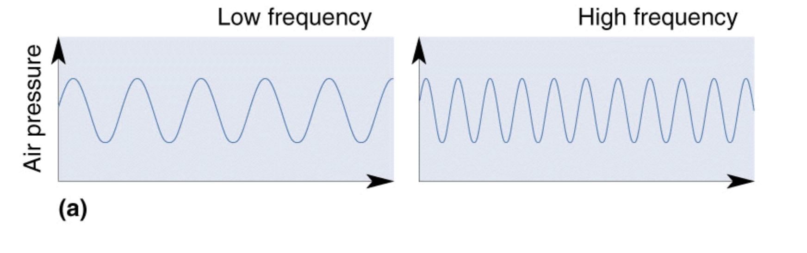
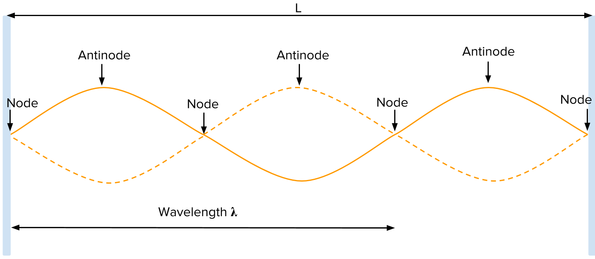
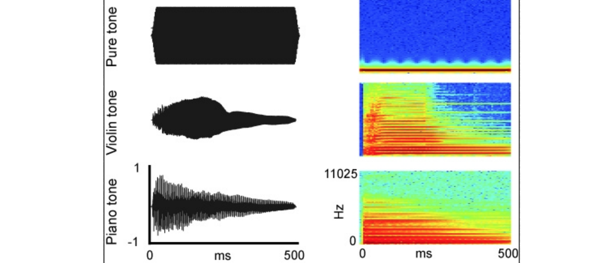
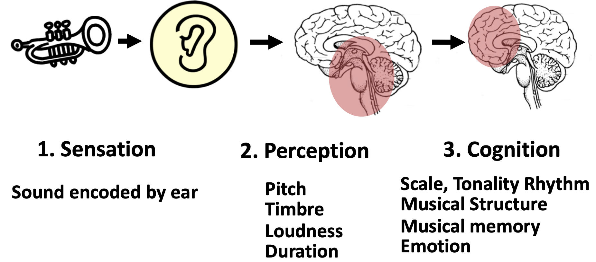

본 포스팅은 문화기술대학원 이경면 교수님의 [GCT731 Cognitive Science of Music](https://hss.kaist.ac.kr/sub02/info.php?idx=76)과 [Auditoryneuroscience](https://auditoryneuroscience.com/acoustics)를 참고했음을 밝힙니다.

## 소리란 무엇인가?
소리는 일반적으로 진동으로 인한 공기의 압축으로 생성됩니다. 그렇다면 압축이 얼마나 됬느냐에 따라서 표현되것이 바로 Wave(파동)인데요. 파동은 진동하며 공간/매질을 전파해 나가는 현상입니다. 질량의 이동은 없지만 에너지/운동량의 운반은 존재합니다.

Wave에서 저희가 얻을수 있는 정보는 크게 3가지가 있습니다.
- Phase(Degress of displacement) : 위상
- Amplitude(Intensity) : 진폭
- Frequency : 주파수

## 소리의 요소
일반적으로 소리는 물리량이지만, 소리를 받아드리는 것은 사람입니다. 우리는 따라서 이 2가지 주체에 대해서 소리의 요소를 구별할 수 있습니다.
- 물리 음향
    - Intensity : 소리 진폭의 세기
    - Frequency : 소리 떨림의 빠르기
    - Tone-Color : 소리 파동의 모양
- 심리 음향
    - Loudness : 소리 크기
    - Pitch : 음정, 소리의 높낮이 / 진동수
    - Timbre : 음색, 소리 감각
- 물리량과 심리량의 관계
    - 읍압(presurre) : Loudenss에 가장 큰 영향을 준다.
    - 주파수(frequency) : Pitch에 가장 큰 영향을 주며, Loudenss와 Timbre 역시 영향이 있다.
    - 스펙트럼(spectrum) : Timbre에 영향을 준다.
    - 포락선(envelope) : Timbre에 영향을 준다.
    - 지속시간(duration) : Loudenss에 가장 큰 영향을 준다.

위 상관관계는 향후에 조금더 구체적으로 알아보겠습니다. 일단 크게 우리는 소리를 물리 음향과 심리 음향을 통해서 듣게 된다고 생각하시면 좋을 것 같습니다.

### Sound Intensity (Loudness)
일반적으로 소리의 세기는 음파에 의한 음향 에너지의 순간 전달량 입니다.($w/m^{2}$). 소리의 크기는 압력으로 표현이 됩니다. 
- 물리음향적 크기 : Pressure level (dB)
- 심리음향적 크기 : Loudness (phon, sone)
일반적으로 주파수에 따라서 심리음향인 Loudness는 차이가 있습니다. 주파수에 따라 소리의 크기가 달라지게 됩니다. 음량 자체가 작으면 저음 및 고음의 청취가 약화되며 명료성이 떨어집니다. 또한 음악의 지속시간이 길어지면 라우드 니스도 커지게 됩니다. 

### Frequency (pitch)
일반적으로 소리의 Frequency는 The number of compressed를 표현합니다. 단위는 Hertz를 사용하며, 1Hertz는 1초에 한번 vibration을 의미합니다. 일반적으로 주파수는 우리가 알고 있는 pitch (음)과 동일합니다. 일반적으로 pitch는 사람이 인지하는 음의 높낮이 입니다 (고음과 저음).
- 1 Hertz  : 1 vibration/second
- Audible Frequency Range (20-2000) : 가청 주파수 범위

**Standing waves (정상파)** 
이러한 주파수는, 일반적으로 정상파의 형태로 존재하게 됩니다. 멈춰있는 파동라고 생각하시면 좋습니다. 진동의 마디(node)나 배(antinode)의 위치가 공간적으로 이동하지 않는 파동입니다.

**Harmonics (배음)** 
수 많은 지동음들 가운데 기본음과 정수배의 관계를 유지하는 그룹입니다. 아름답고 부드러운 음색을 제공합니다. 일반적으로 악기의 음계들을 생각하시면 이해가 빠르실 것 같습니다.

**Fundamental Frequency (기본음)** 
기본음은 하나의 현(String) 혹은 막(drum head)에서 발생하는 수 많은 진동음들 가운데 가장 낮은 주파수의 음입니다. 악기에 음정에 기여하며 첫 배음이라고도 합니다. 이 기본음은 인간의 pitch perception에 있어서 아주 큰 영향을 끼치게 됩니다. 만약 여러분이 도미솔을 치신다면 기본음은 도가 될 것입니다.

### Sound Color(Timbre)
음색은 일반적으로 소리의 감각적 특색이자, 청각적 인상이라고도 합니다. 어떤 악기를 사용하는지에 따라서 음색이 달라집니다. 왜 악기에 따라서 음색이 달라지게 될까요? 이러한 음색을 구별하는 중요한 요인은 Components of Harmonics와 Envelope of Waveform가 있습니다. Components of Harmonics 는 일반적으로 푸리에 변환을 통해 Frequency 축과 Amplitude 축으로 나누어진 Spectrum 그래프를 통해서 확인 할 수 있습니다. Envelope의 경우에는 Time 과 Amplitude축으로 나누어진 Waveform을 통해서 확인이 가능합니다. 악기는 대표적으로 이 두가지 요소가 달라지는 경향이 있습니다.

## Cognition of Sound
인지는 감각기관 (귀)를 이용한 Knowing입니다. Performer 와 Listener를 위한 음악인지를 공부한다. 음악의 인지 과정은 Auditory Sensation, Perception, Coginition의 Process를 거치게 됩니다.. 

1. Sensation (감각)
    - Sound encoded by ear, 소리를 귀를 통해 encoding 하는 과정이 있습니다.
2. Perception (지각)
    - 인식 과정에서는 크게 정보처리시간이 길지 않습니다. 
    - Pitch(음역), Timbre(음색, 피아노와 바이올린), Loudness(음의 크기), Duration(Longer and Shorter) 
3. Cognition (인지)
    - 인지의 단계로 넘어가면 사람은, 정보처리를 통해서 소리나 음악에 대한 정보를 output으로 생산합니다. 
    - Scale, Tonality, Rhythm, Musical Structure, Musical Memory, Emotion

## Human Knowledge to Explain Music
그렇다면 인지를 통해서 나온 정보를 인간이 어떠한 지식으로 생산해 낼까요? 일반적으로는 소리 자체를 듣는 어쿠스틱한 영역과, 음악과 같은 컨텐츠를 듣는 경우로 나눌 수도 있습니다. 어쿠스틱한 영역은 소리 자체의 물리량의 영역이고, Musical Level은 인간의 사회 문화 활동을 통해서 생성되는 추가적인 정보라고 생각하시면 좋을 것 같습니다. 일종의 규칙이 될수도 있고, 아니면 인간이 형성하는 사회적인 용어일수도 있습니다.

- Acustic Level
    - Loudness
    - Pitch
    - Timbre
- Musical Level
    - Factual Information
        - Track ID, artist, years, composers
    - Score-level Information
        - Key and scale
        - Chord and melodic pattern
        - Rhythm
        - Lyrics, structure, singing style
    - Semantic Information
        - Instrumentation
        - Mood
        - Genre
        - Text descriptions

본 포스팅은 소리가 무엇인지 부터 시작하여 인간이 소리를 인지하는 과정과 그 속에서 사용되는 정보에 대해서 알아보았습니다. 소리에 대한 기본적인 이해로 부터 앞으로는 인간의 청각경로를 살펴보며, 소리를 인지하는 과정에서 사용되는 우리의 감각기관과 그 매커니즘에 대해서 살펴보려고합니다.