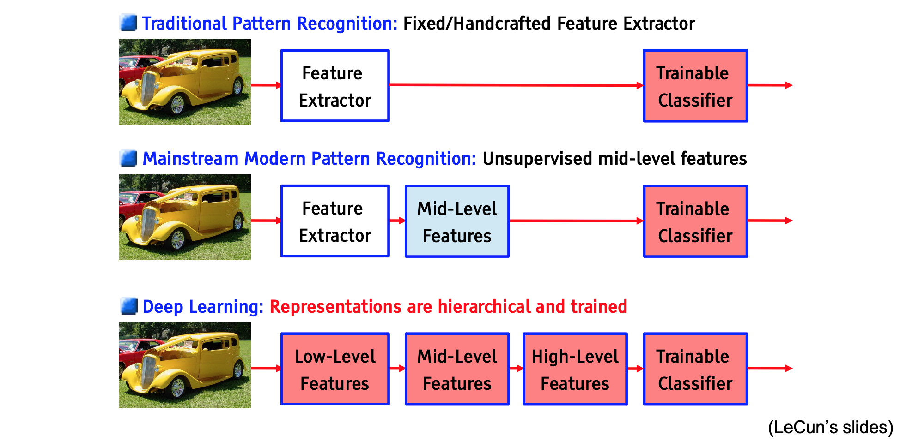

## Deep Learning이란?

일반적으로 우리가 알고 있는 딥러닝이란, 컴퓨터가 데이터로 부터 학습을 통해, 개념들 간의 관계와 hierarchy를 만들어서 복잡한 패턴을 이해하는 것입니다. 딥러닝이란 무엇일까요? 일반적으로는 End to end feature learning 으로 Domain knowledge에 대한 의존성이 낮으면서 해결 할 수 있습니다.



- Traditional Pattern Recognition
    - 여러가지 Fixed 되어있고 Handcrafted 한 Feature Extreaction 기법을 통해서 Feature를 추출하고 학습을 시켰습니다. 이 당시에는 main knowledge가 매우 중요했습니다.
    
- Mainstram Modern pattern Recognition
    - Feature Extraction 이후에 Unsupervised learning을 통해 mid-level feature가 뽑혀서 나오기 시작했습니다.
    
- Representation are hierarchical and trained
    - Deep learning의 시대가 되었습니다. 각 layer는 feature를 learning 시키는 역할을 하게 되었습니다. 이는 인간이 feature를 이해하는 학습 시스템과 점점 더 비슷하게 변하게 됩니다.


### Data-Driven Algorithm Design
딥러닝에 들어가기전에 간단하게 몇가지 용어를 정리해봅시다. Learning이 중요해진 이유는 알고리즘의 기본적인 발상을 뒤집어 버렸기 떄문입니다. 간단하게 알고리즘, 머신러닝, Supervised Learning에 대해서 알아봅시다.

- Algorithm : 어떤 문제를 푸는데 있어서 필요한 일련의 명령입니다.
    - a Sequence of instructions that solves a problem.

- Machine Learning : 예전에는 문제가 주어졌을 때, 해당 문제에 알맞는 알고리즘을 만드는 것이 일이였으나, 머신러닝에서는 문제를 결정하는 것이 어렵기 때문에 데이터로 부터 알고리즘을 학습시킵니다.
    - 데이터의 Sample이 있습니다
    - ML 모델이 문제를 풀도록 훈련을 시킵니다.
    
- Supervised Learning
    - Provide
        - Training Example : N개의 input과 output으로 구성된 샘플
        - Loss function : 모델의 추정 ouput과 실제 값인 y을 평가할 지표 
        $$
        L(M(x),y) > 0
        $$
        - Evaluation : 모형을 평가할 validation set과 test set으로 검증을 합니다.
        
    - Decide
        - Hypothesis Set : 모델의 아키텍쳐를 설정하는, 하이퍼 파라미터를 수정하게 만듭니다.
        - Optimization Algorithm : 각 모형들의 Performance인 loss function을 낮출 수 있는 머신을 학습합니다.  

### Deep Learning

딥러닝은 모형들의 output이 다시 input으로 들어가서 학습을 이어나가는 Layer 구조를 가지는 모형입니다. 모형의 특징을 결정하는데는 다음과 같은 요소들이 필요하게 됩니다. 앞으로는 밑의 개념들을 하나씩 정리해 보려고합니다.

- 모델 Building
    - Connectivity patterns
    - Nonlinearity Modules
    - Loss function
- 모델 학습
    - Optimization
    - Hyper Parameters

### Connectivity Pattern

딥러닝은 여러 레이어를 쌓아나가는 구조입니다. 뉴런은 각 레이어에 있으며, 레이어들간의 연결관계에 따라서 패턴이 나눠집니다.
- Fully-Conntected
- Convolutional
- Dilated
- Recurrent
- Skip / Residual
- Random

### Nonlinearity modules

왜 Nonlinear function을 Hidden layer에 쓰는가? 이유는 input units들의 interaction을 확인하기 위해서 입니다. 이 non-linear function으로 인해서 

만약 linear Mutiplication만 진행한다면, 결국 layer를 여러개 쌓을 이유가 없습니다. Multiplication of linear transformation = another linear transformations. 

hidden layer는 어떠한 feature라고 생각할수 있다. 그렇다면 hidden layer space에서 본다면, 
- ReLU
- Sigmoid
- Tanh
- GRU
- LSTM

### Loss
손실함수를 정의하는 방식입니다. 학습의 핵심을 만들어주는 기능도 같이 해주는 경향이 있습니다.

- Cross Entropy
- Adversarial
- Variational
- MLE
- L1 and L2

### Optimizer
학습의 진행을 도와줍니다.

- SGD
- Momentum
- RMSProp
- Adagrad
- Adam
- Second Order

### Hyper Parameter
- Learning rate
- Weight decay
- Layer size
- Batch size
- Dropout rate
- Weight initalization
- Data augmentation
- Gradient Clipping
- Momentum


```python

```
