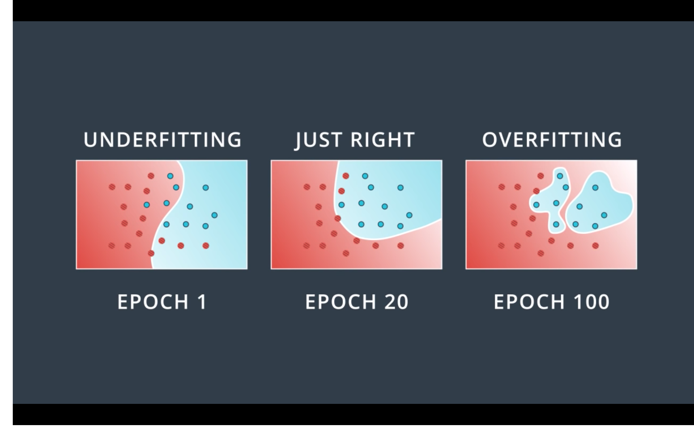
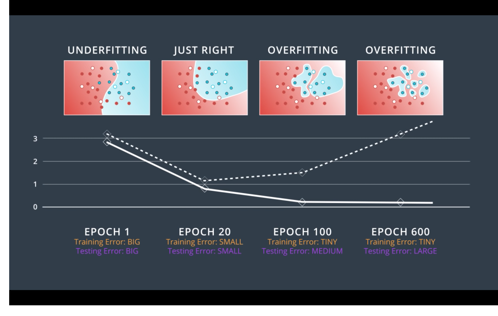
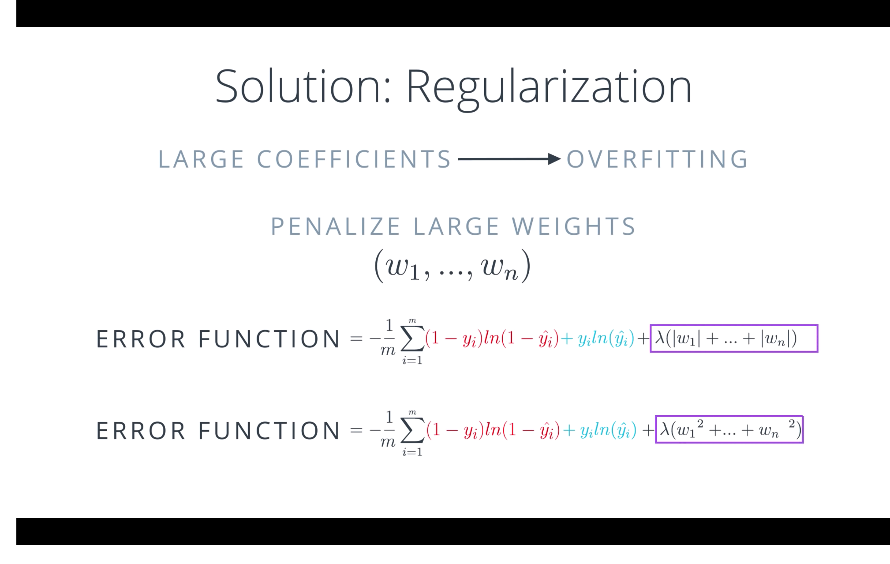

overfitting과 underfitting은 모형에 Just-right하지않은 모형의 복잡도 혹은 모형의 학습횟수에 따라서 결정이 됩니다. 모형이 학습 데이터를 충분히 반영하지 못하는 경우를 underfitting, 모형이 학습데이터에 과도하게 적합하여 새로운 데이터를 설명하지 못하는 현상을 overfitting이라고 합니다.

### 2 Case of Overfitting
- 애초에 모형이 너무 복잡하게 설계 되었기 떄문에 발생한 것이다? -> Machine Learning, Deep Learning
- Epoch가 증가에 따라서 판별함수가 너무 training set에 fit해졌다? -> Deep Learning

### Model Complexity?
- 각 뉴런은 layer-by-layer 그리고 feed-forward 관계로 directed acyclic graph 형태입니다.
- 각 뉴런들의 activation 과 output은 non-linear transform of weighted sum of inputs 입니다.
- Model complexity는 데이터의 feautures 개수에 따라 결정이 됩니다.
    - 파라미터 layer의 갯수 or Parameter의 갯수는 영향을 끼치지 않는가요?

### Epoch?

- Epoch
한번의 forward pass와 한번의 backward pass가 모든 training examples에 대해서 진행되었다는 소리입니다.

- batch size
한번의 forward pass와 한번의 backward pass 사이에 사용된 data의 갯수를 사용합니다. 만약 batch size가 크다는 소리는, 더 많은 memory space가 필요하다는 소리입니다.

- number of Iteration
흔히 passes 숫자라고도 합니다. batchsize가 몇번 forward 와 backward를 반복했는지를 의미합니다.

### How we detact Over & Underfitting

전체 데이터 셋을 Test, Train, Validation set으로 나누어서 cross validation을 진행한다.

- 3개의 데이터셋 분포를 파악해야한다. Sampling에 따른 모집단의 추종여부를 확인할 것!
- High Bias : Underfitting, 모델의 퍼포먼스가 좋지않다.
    - Sol : 모델의 복잡도를 높이거나 Epoch를 증가시킨다.
- High Variance : Overfitting, Train set에 fit하다.
    - Overfitting이 발생하는 곳에서 Early stopping을 한다.
    - Sol : 데이터의 갯수를 늘리거나, Regulariazation을 사용한다.



### Epoch 증가의 경우

- Underfitting : Training Error, Test Error의 차이가 거의 적고, Error의 크기가 매우 크다. (High Bias)
- Just right : Training error 는 작고, test error 역시 작다 매우 이상적인 상태이다. 
- Overfitting : Training error는 작고, test error 는 큰 상태이다. (High Variance)



### More about Error

- Noise : 관측에서 오는 에러 (통제 불가), 확률프로세스이거나, 관측이 안된 무언가가 있거나
- Bias : 타겟 함수($y$) - 추정함수($\hat{y}$)의 평균의 차이이다.
- Variance : 추정 평균과 추정값의 차이이다.

### Large Weight & Overfitting

- Large Weight 가 overfitting을 만든다.
- Regularization을 해주자!



## How we solve Over & Underfitting


### Regluarlization

뉴럴넷의 weight값을 0에 가깝게 만들어주는 효과가 있습니다. 

$\lambda$ 가 커지면 Activate function에 들어가는 input값이 0에 가까워지게 됩니다. 그러면서 activation함수의 linear한 영역을 통과하게 됩니다.

- L2 norm
    - 모든 Parameters의 영향력을 정규화합니다.
    - 뉴럴넷에서는 일반적으로 Frobenius norm이라고 부릅니다.
    - Weight decay의 효과도 있습니다.
    
- L1 norm
    - 특정 Parameters의 영향력을 정규화합니다. (sparse solutions이 됩니다.)
    - 모델을 압축하기 위한 목적이 없다면 딱히 사용하진 않습니다.

### Dropout

더 작은 뉴럴넷 모형을 상용해서, 정규화 효과를 줍니다. 또한 Dropout으로 인해서 각 노드들은 이제 어떠한 feature에 의존하는 경향으 줄어들게 됩니다. 때문에 가중치를 줄이게 되는 효과를 줍니다. 각 레이어들 마다 keep_prob 의 값을 바꾸어줄수 있다.

feedforward pass에서, hidden layer unit들을 랜덤하게 끊어버린다. 이는 hidden unit들의 co-adaptiation을 방지한다. 이던 feature의 reduendency를 만들며, waste of resource가 발생한다.
- Co-adaptation : 두개나 더 많은 hidden이 같은 feature를 학습하는 것

또한 Dropout은 큰 ensemble 모델처럼 사용이 가능하다. 앙상블 모형은 모델은 variance를 줄여준다. Fully connected layer의 1024 유닛은 2^1024은 masks combination을 만든다. 그들은 파라미터를 공유한다.

- Inverted dropout


### Normalization
problem은 zero mean과 unit variance에 있다.
- input normalization
    - Standadization : 평균으로 빼고, std로 나누어줍니다. 문제는 Std가 0이 되면 큰일납니다.
    - PCA : orthogonal 한 latent axis로 projection 시켜줍니다. 일반적으로 뉴럴넷에서 학습해주기 때문에, reduendency를 만드는 경향이 있습니다.
- Weight Initalization
    - Gaussian random number
        - 깁은 뉴럴넷 레이어의 경우에는, 문제가 생기는 경우가 많습니다.
    - Xavier initalization
        - hanh function에 잘 작동합니다.
    - He initalization
        - ReLU에 잘 됩니다.

### Batch normalization
Batch normalization은 Sergey loffe와 Christian Szegedy가 만든 알고리즘입니다. 우리는 위에서 보듯이 Data 에 대한 Normalization에 대해서 이해해봤습니다. 하지만 우리가 더 deep한 뉴럴넷을 설계하게 되면서 $a^{[1]}$,$a^{[2]}$ 와 같은 연산이 들어가는 layer를 만나게 됩니다. 각 hidden 레이어에 나오는 값들을 중간중간에 Normalization을 해주자는 접근이 바로 Batch Normalization입니다. 하지만 여기서는 한가지 이슈가 있습니다. 그렇다면 Activation function 앞과 뒤중 어디에 Normalization을 진행해야할까요? 정답은 앞이라고 합니다. 즉 $a^{[1]}$ 이 아니라 $z^{[1]}$에 Normalization을 넣어주는 것이 좋습니다. 이것은 activation function의 linear 구간을 scaling 해주고 shift 해주면서 더 좋은 nonlinearity position을 잡아냅니다. 

그렇다면 왜 사람들은 Batch Normalization에 이렇게 열광하는 것일까요? 일단 첫번째는 학습속도를 높여준다는 것입니다. Activation function에 들어가기전에 입력들에 대해서 평균을 0으로 분산을 1로 만들어 주게 되는데요. 이것은 입력특성들이 비슷한 범위를 가지게 되면서, 학습의 속도가 증가하는 효과를 가지게 됩니다. 두번째는 Covariate shift를 보정해준다는 점입니다. 만약 우리가 검은 고양이를 분류하는 문제를 푸는 모형을 학습하다가, 색깔이 있는 고양이도 구별하는 문제를 푼다고 해봅시다. 그렇다면 고양이라는 공통요소가 있지만 색이라는 추가적인 정보를 또한 모형이 분류해야합니다. 즉 우리가 $x->y$인 맵핑관계에서 $x$의 확률 분포가 변한다면, 러닝 알고리즘을 다시 트레이닝 시켜야한다는 점입니다. 이것을 뉴럴넷 아키텍쳐의 관점에서 본다면, 새로운 input인 색이 있는 고양이가 들어온다면 학습과정에서 $w$와 $b$의 변화가 발생하게 됩니다. 그것에 따른 hidden unit의 분포도 변하게 되겠죠 $a^{[1]}$,$a^{[2]}$. 이때 Batch Normalization은 이런 hidden unit의 분포가 변하는 량을 줄여줍니다. 즉 고양이에 대한 정보를 최대한 보존해 주는 것이죠. 데이터의 관점에서 본다면, 평균과 분산의 정보가 유지된다는 점입니다. 고양이에 대한 정보에 대해서는 generalization 기능이 향상되겠군요. Gradient Vanishing, Gradient Exploding 문제를 해결해줍니다.


### Data Augmentation
데이터의 variance를 주면서 데이터의 양을 증가시킵니다. 오디오 데이터의 경우에는 다음과 같은 방식이 있습니다.
- Pitch Shifting
- Resampling
- Time-stretching
- Equalization
- Adding noises

```python

```
