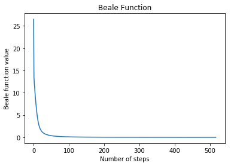
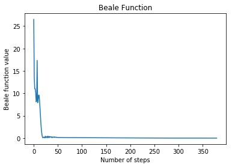

본 포스팅은 Beale Function을 이용하여 한번 다양한 NN optimzation 함수를 구현해보고 해결해 보려고 합니다! 각 최적화 기법들의 특징들을 살펴봅시다. 일반적인 Gradient Descent의 문제점은, Local Minimum 과 Saddle point에 빠지는 경우의 수입니다.

- Contents
    - GD & SGD
    - Momentum
    - Adagrad
    - RMSprop
    - Adam

## Gradient Descent
Gradient descent는 제약조건이 없는 convex이고 differentiable한 function의 최적화 문제를 풀기위한 가장 단순한 알고리즘입니다.    

$$
w_{t+1} = w_{t} - \eta_{t} \frac{\partial \mathcal{L}}{\partial w_{t}}
$$


```python
import numpy as np
import matplotlib.pyplot as plt
%matplotlib inline
```

```python
# setup function
f = lambda x,y: (1.5 - x + x*y)**2 + (2.25 - x + x*y**2)**2 + (2.625 -x+x*y**3)**2
minima = np.array([3., .5])
minima_ = minima.reshape(-1, 1)

def gradients(x, y):
    dx = 2. * ( (1.5 - x + x * y) * (y - 1) + \
                (2.25 - x + x * y**2) * (y**2 - 1) + \
                (2.625 - x + x * y**3) * (y**3 - 1) )
    dy = 2. * ( (1.5 - x + x * y) * x + \
              (2.25 - x + x * y**2) * 2. * x * y + \
              (2.625 - x + x * y**3) * 3. * x * y**2 )
    grads = np.array([dx, dy])
    return grads
```


```python
class GradientDesecnt():
    def __init__(self, function, x_init=None, y_init=None, learning_rate=0.01):
        self.f = function
        scale = 3.0
        if x_init is not None:
            self.x = x_init
        else:
            self.x = np.random.uniform(low=-scale, high = scale)
        if y_init is not None:
            self.y = y_init
        else:
            self.y = np.random.uniform(low=-scale, high = scale)
        print("x_init:{:.3f}".format(self.x))
        print("y_init:{:.3f}".format(self.y))
        
        self.lr = learning_rate

        self.z_history = []
        self.x_history = []
        self.y_history = []
    
    def func(self, x, y):
        z = self.f(x,y)
        return z

    def gradient(self,x,y):
        dx = 2. * ( (1.5 - x + x * y) * (y - 1) + \
                (2.25 - x + x * y**2) * (y**2 - 1) + \
                (2.625 - x + x * y**3) * (y**3 - 1) )
        dy = 2. * ( (1.5 - x + x * y) * x + \
                (2.25 - x + x * y**2) * 2. * x * y + \
                (2.625 - x + x * y**3) * 3. * x * y**2 )
        return dx, dy
    
    def weights_update(self):
        self.x = self.x - self.lr * self.dx
        self.y = self.y - self.lr * self.dy
    
    def history_update(self, z, x, y):
        self.z_history.append(z)
        self.x_history.append(x)
        self.y_history.append(y)
    
    def train(self, max_steps):
        self.z_history = []
        self.x_history = []
        self.y_history = []
        pre_z = 0.0
        print("steps:{} z:{:.6f} x:{:5f} y:{:.5f}".format(0, self.func(self.x, self.y), self.x, self.y))
        
        # range의 변화를 
        for step in range(max_steps):
            self.z = self.func(self.x, self.y)
            self.history_update(self.z, self.x, self.y)
            
            self.dx, self.dy = self.gradient(self.x, self.y)
            
            self.weights_update()
            
            if (step+1) % 100 == 0:
                print("steps: {}  z: {:.6f}  x: {:.5f}  y: {:.5f}  dx: {:.5f}  dy: {:.5f}".format(step+1, self.func(self.x, self.y), self.x, self.y, self.dx, self.dy))
                
            if np.abs(pre_z - self.z) < 1e-5:
                print("Enough convergence")
                print("steps: {}  z: {:.6f}  x: {:.5f}  y: {:.5f}".format(step+1, self.func(self.x, self.y), self.x, self.y))
                self.z = self.func(self.x, self.y)
                self.history_update(self.z, self.x, self.y)
                break
            
            pre_z = self.z
        
        self.x_history = np.array(self.x_history)
        self.y_history = np.array(self.y_history)
        self.path = np.concatenate((np.expand_dims(self.x_history,1), np.expand_dims(self.y_history, 1)), axis =1).T
```
```python
gd = GradientDesecnt(f ,x_init=0.7, y_init=1.4, learning_rate=0.01)
```
    x_init:0.700
    y_init:1.400
```python
gd.train(1000)
```
    steps:0 z:26.496662 x:0.700000 y:1.40000
    steps: 100  z: 0.096636  x: 2.44472  y: 0.32327  dx: -0.41345  dy: -0.16275
    steps: 200  z: 0.021728  x: 2.69244  y: 0.41208  dx: -0.15311  dy: -0.04974
    steps: 300  z: 0.007734  x: 2.80373  y: 0.44659  dx: -0.08138  dy: -0.02408
    steps: 400  z: 0.003281  x: 2.86728  y: 0.46488  dx: -0.04962  dy: -0.01390
    steps: 500  z: 0.001523  x: 2.90744  y: 0.47594  dx: -0.03243  dy: -0.00878
    Enough convergence
    steps: 516  z: 0.001355  x: 2.91246  y: 0.47730
```python
print("x: {:.4f}  y: {:.4f}".format(gd.x, gd.y))
```

    x: 2.9125  y: 0.4773


```python
#Plot the Beale function
plt.title('Beale Function')
plt.xlabel('Number of steps')
plt.ylabel('Beale function value')
plt.plot(gd.z_history)
plt.show()
```




## Stochastic Gradient Descent
전체 데이터에서 구하지 않고 mini-batch로 랜덤하게 샘플링하여 loss를 구하게 됩니다.
## Momentum method 
파라미터들을 단지 현재의 gradient만 고려하지말고 history 역시 고려해보자는게 주요한 아이디어입니다.
이것은 마치 leaky integrator (IIR filter)와 비슷한 기능을 하게 된다. Gradient에 관성을 넣어주는 것이죠.

- Velocity variable : v를 도입해봅시다.
- direction,speed(속력)은 파라미터의 space에서 파라미터의 움직임을 따르게됩니다.
- 모멘텀은 물리학에서 mass(질량) x velocity(속도) 입니다.
- unit 을 mass로 생각해볼 수 있습니다.
- hyperparameter γ∈[0,1) determines exponential decay

$$
v_{t+1} = \gamma v_{t} + \frac{\partial \mathcal{L}(w_{t})}{\partial w_{t}}
$$

$$
w_{t+1} = w_{t} - \eta v_{t+1}
$$

- $v_{t}$ : 누적된 gradients의 관성
- $w_{t}$ : Gradients (가속도)


```python
class MomentumOptimizer():
    def __init__(self, function, gradients, x_init=None, y_init=None, learning_rate=0.01, momentum=0.9):
        self.f = function
        self.g = gradients
        scale = 3.0
        self.vars = np.zeros([2])
        if x_init is not None:
            self.vars[0] = x_init
        else:
            self.vars[0] = np.random.uniform(low=-scale, high=scale)
        if y_init is not None:
            self.vars[1] = y_init
        else:
            self.vars[1] = np.random.uniform(low=-scale, high=scale)
        print("x_init: {:.3f}".format(self.vars[0]))
        print("y_init: {:.3f}".format(self.vars[1]))
        self.lr = learning_rate
        self.momentum = momentum
        self.velocity = np.zeros([2])
        
        # for accumulation of loss and path (w, b)
        self.z_history = []
        self.x_history = []
        self.y_history = []
  
    def func(self, variables):
        x, y = variables
        z = self.f(x, y)
        return z
    
    def gradients(self, variables):
        x, y = variables
        grads = self.g(x, y)
        return grads
    
    def weights_update(self, grads):
        """
          v' = gamma * v + dL/dw
          w' = w - lr * v'
        """
        self.velocity = self.momentum * self.velocity + grads
        self.vars = self.vars - self.lr * self.velocity
        
    
    def weights_update1(self, grads):
        """
          Weights update using Momentum.

          v' = gamma * v - lr * dL/dw
          w' = w + v'
        """
        self.velocity = self.momentum * self.velocity - self.lr * grads
        self.vars = self.vars + self.velocity
    
    def history_update(self, z, x, y):
        self.z_history.append(z)
        self.x_history.append(x)
        self.y_history.append(y)

    def train(self, max_steps):
        pre_z = 0.0
        print("steps: {}  z: {:.6f}  x: {:.5f}  y: {:.5f}".format(0, self.func(self.vars), self.x, self.y))

        for step in range(max_steps):
            self.z = self.func(self.vars)
            self.history_update(self.z, self.x, self.y)
            self.grads = self.gradients(self.vars)
            self.weights_update1(self.grads)

            if (step+1) % 100 == 0:
                print("steps: {}  z: {:.6f}  x: {:.5f}  y: {:.5f}  dx: {:.5f}  dy: {:.5f}".format(step+1, self.func(self.vars), self.x, self.y, self.dx, self.dy))

            if np.abs(pre_z - self.z) < 1e-7:
                print("Enough convergence")
                print("steps: {}  z: {:.6f}  x: {:.5f}  y: {:.5f}".format(step+1, self.func(self.vars), self.x, self.y))
                self.z = self.func(self.vars)
                self.history_update(self.z, self.x, self.y)
                break

            pre_z = self.z

        self.x_history = np.array(self.x_history)
        self.y_history = np.array(self.y_history)
        self.path = np.concatenate((np.expand_dims(self.x_history, 1), np.expand_dims(self.y_history, 1)), axis=1).T

    
    @property
    def x(self):
        return self.vars[0]

    @property
    def y(self):
        return self.vars[1]

    @property
    def dx(self):
        return self.grads[0]

    @property
    def dy(self):
        return self.grads[1]
```


```python
Momentum = MomentumOptimizer(f, gradients, x_init=0.7, y_init=1.4, learning_rate=0.01, momentum=0.9)
```

    x_init: 0.700
    y_init: 1.400


```python
Momentum.train(1000)
```

    steps: 0  z: 26.496662  x: 0.70000  y: 1.40000
    steps: 100  z: 0.099510  x: 4.46410  y: 0.71417  dx: 0.09680  dy: -0.29558
    steps: 200  z: 0.039972  x: 3.70210  y: 0.63209  dx: 0.07884  dy: 0.01149
    steps: 300  z: 0.001087  x: 3.08637  y: 0.52077  dx: 0.02342  dy: 0.00558
    Enough convergence
    steps: 379  z: 0.000001  x: 3.00194  y: 0.50048


```python
print("x: {:.4f}  y: {:.4f}".format(Momentum.x, Momentum.y))
```

    x: 3.0019  y: 0.5005


```python
#Plot the Beale function
plt.title('Beale Function')
plt.xlabel('Number of steps')
plt.ylabel('Beale function value')
plt.plot(Momentum.z_history)
plt.show()
```


 학습속도가 매우 느려진다.

### RMSprop
* 학습 속도의 감소를 막아주는 효과가 있습니다.
* Moving average of squared gradient : 무지하게 커지니까 앞에 있는걸, Learning rate의 패널티를 moving average 해주게 됩니다.
* 학습시 Gradient의 미분식에 Normalizae panelity가 들어가는 것입니다.

### Adam
* Adaptive moment estimation입니다.
* RMSprop + Momentum 입니다.
* moving average of past and past squared gradients

### Learning rate decay
* Iteration이 진행에 따라서 시작부분에서는 크게 움직이고, 후반에는 천천하게 움직이게 됩니다.

$$
\alpha = \frac{1}{1-decayRate*epochNum}\alpha_{0}
$$


### 하이퍼 파라미터 튜닝
그렇다면 우리는 최대한 최적의 하이퍼 파라미터를 튜닝해주어야 할까요?? 위에서 최적화 알고리즘을 확인해 본다며 우리는 가장 간단하게 learning rate부터 시작해서 모멘텀 값, 아니면 Adam의 beta와 같은 여러 하이퍼 파라미터가 생기는 것을 볼 수 있겠습니다. 최적화 알고리즘 뿐만 아니라, 우리가 모형을 설계할때도 layer의 숫자나 혹은 아키텍처의 순서를 다르게 할 수도 있겠죠. 다양한 하이퍼 파라미터를 튜닝하는 것 역시 optimization의 중요한 이슈가 되었습니다.

일반적인 머신러닝에서 사용된 최적화의 고전적인 방식은 바로 Grid Search입니다. 각 하이퍼 파라미터들의 경우의 수들을 정의해 주고, 그들의 조합을 통해서 Objective function의 변화를 측정해 보는 것이죠. 딥러닝에 경우에는 Random Search가 더 많이 이루어지고 있다고 합니다. 이때 사용하는 진행방식은 바로 Coarse to fine sampling scheme입니다. 

### Coarse to fine sampling scheme
아래 그림처럼 우리가 2차원의 Hyperparameter space에서 각 포인트들을 샘플링 한다고 해도겠습니다. 우리가 Objective function이 높은 퍼포먼스를 보이는 영역을 발견한다고 했을때, 그 영역에 초점을 맞춰서 dense하게 search를 진행하게 됩니다. 또한 Random한 sampling을 할수도 있습니다.

### Appropriate scale for hyperparameters
한번 우리가 Learning rate를 찾기위해서 Hyperparameter searching을 한다고 생각해 봅시다. 0.1, 0.2, 0.3 ... 이런식으로 찾아보게 된다면 끝이 없게 될 것입니다. 때문에 scale에 대한 이슈가 등장하게 되었는데요. 저희는 Linear scale을 사용할수도 Log scale을 사용할수도 있을 것입니다. 우선 저희가 해야할 것은 궁금한 가설집단을 규정하는 것입니다. 만약 learning rate라면 0.1 부터 0.0001 사이에서 최적의 파라미터가 궁금하다 같은 것이죠. 이 Lower bound와 Upper bound를 잘 찾을수 있는 scale을 그 다음에 결정하는 것이 좋습니다. 
1. 가설 영역을 설정한다.
2. Scale을 설정한다.
3. Uniform random sampling을 한다.