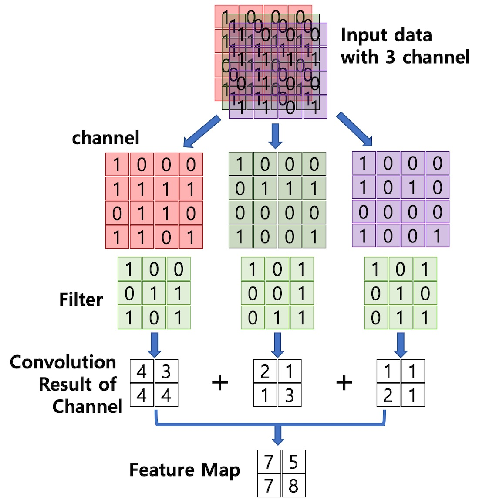
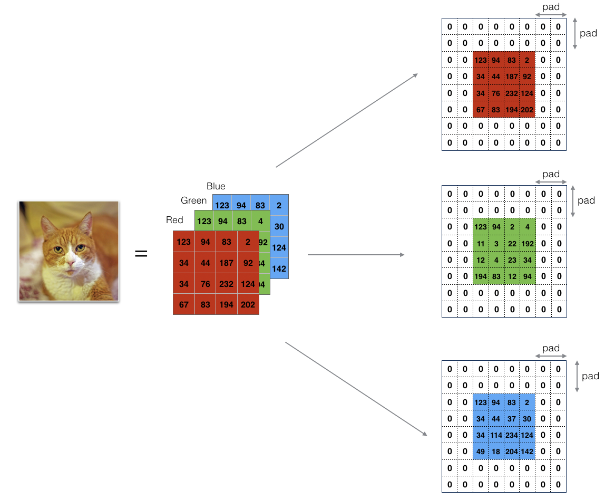
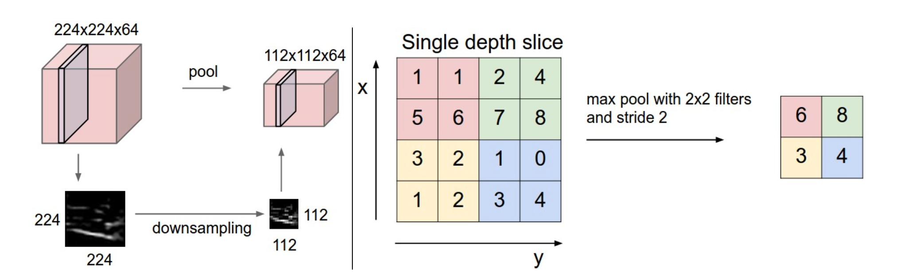
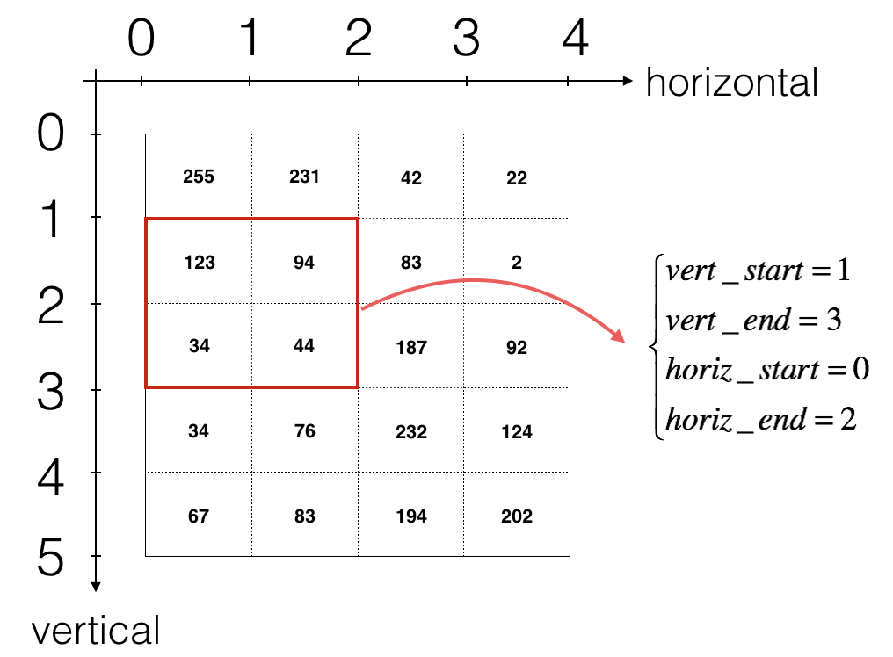

본 포스팅은 Ian-goodfellow의 [태원님의 블로그](http://taewan.kim/post/cnn/)과 Andrew ug 교수님의 [Neural Networks and Deep Learning](https://www.coursera.org/learn/neural-networks-deep-learning/home/welcome) 강의를 참고했음을 밝힙니다.


## Convolutional Neural Network

이미지 분류를 위한 신경망 구조, 세상의 실제 이미지들은 생각보다 정형화 되어있지 않습니다. 따라서 컴퓨터가 다른 구도의 같은 이미지를 이해하려면 많은 학습량이 필요하게 됩니다. 이 뜻은 파라미터의 크기가 엄청나게 커진다는 것입니다.

이러한 문제를 해결하기 위해서, 처음에는 가장 기초가 되는 특징을 확인하고, 그 특징들을 조합하여, 복잡한 특징이 존재하는지를 살펴본 뒤, 마지막으로 물체를 분류하고자 했습니다.

CNN은 기존의 Fully Connected NerualNetwork와 비교하여 다음과 같은 차별성을 갖습니다.
- 각 레이어의 입출력 데이터의 형상 유지
- 이미지의 공간 정보를 유지하면서 인접 이미지와의 특징을 효과적으로 인식
- 복수의 필터로 이미지의 특징 추출 및 학습
- 추출한 이미지의 특징을 모으고 강화하는 Pooling 레이어
- 필터를 공유 파라미터로 사용하기 때문에, 일반 신공망에 비해 학습 파라미터가 매우 적음
<br>


## CNN 역사
CNN은 인간의 visual recognition과 높은 연관을 같습니다.
인간의 시신경으로 부터 시작되는 시각인지의 영역과 매우 동일한 효과를 가지게 됩니다. edges and lines 로 부터 shapes, 그리고 objects 마지막으로 face까지 이어지는 구조를 가지게 됩니다. 아래 영역은 인간의 뇌로부터 Receptive fields size와 feature의 차이를 보이는 것을 보여줍니다.

## CNN 구조

CNN 은 이미지의 __특징을 추출__ 하는 부분과 __클래스를 분류__ 하는 부분으로 나눌 수 있습니다. 

__특징 추출__ : Convolution Layer,Pooling Layer<br>
입력 데이터를 필터가 순회하며 합성곱을 계산하고, 그 계산 결과를 이용하여 Feature map을 만듭니다. Feature map는 sub-sampled 를 통해서 차원을 줄여주는 효과를 가지게 됩니다. Convolution Layer는 Filter 크기, Stride, Padding 적용여부, Max Pooling의 크기에 따라서 출력 데이터의 Shape이 결정됩니다. 
- Convolution Layer : 입력데이터에 필터(Filter or Weight)를 적용 후 활성함수를 반영하는 요소입니다.
- Pooling Layer(Subsampling) : spatial 차원의 다운샘플링을 책임집니다.

__클래스 분류__ : Fully Connected Layer

## CNN 특징
__Locality__<br>
CNN에서 우리가 집중하는 부분은 object의 local structure 입니다. Filter는 전체를 다 보는게 아니라 일부분에 집중해서 보게됩니다. 

__Translation Invariance__<br>
Object에 대한 인식은 location과 independent합니다. 부분적인 패턴은 location에 독립적입니다. 오디오의 경우에는 time에 대해서 독립적인 성격을 가질 수 있습니다. 이는 고양이가 몇 픽셀 이동해도 고양이 임을 알아낼 수 있다는 것입니다.

__Weight sharing__<br>
하나의 feature map을 만드는데는 동일한 filter를 사용하기 때문에, weight를 학습하는 filter의 경우 다들 이 weight를 공유하게 됩니다.

## 1.Convolution

> 합성곱은 두 함수 f,g가운데 하나의 함수를 reverse, shift 시킨 다음에 다른 하나의 함수와 곱한 결과를 적분하는 것을 의미한다.

컨볼루션 레이어는 입력데이터로부터 특징을 추출하는 역할을 합니다. 컨볼루션 레이어는 특징을 추출하는 필터(Fliter)와, 값을 비선형 값으로 바꾸어주는 확성함수로 이루어져 있습니다. 또한 입력 데이터는 일반적으러 3차원 tensor입니다. width, height 그리고 depth(channel)로 구성되어 있습니다. 하지만 batch 나 mini-batch를 활용할 경우에는 4D tensor를 사용하게 됩니다.

Signal Processing 의 convolution과의 차이점은, Input과 convolution을 변형시키지 않다는 점입니다. Input과 Filter의 depth가 같다면, 바로 곱이 들어가게 됩니다.



## 2. Filter
필터는 그 특징이 데이터에 있는지 없는지를 검출해주는 함수입니다. 필터는 행렬로서 정의가 뇝니다. 필터는 입력받은 데이터에서 그 특성을 가지고 있으면 큰값이 나오고, 특성이 없다면 결과값이 0에 가까운 값이 나오게 되서, 해당 특성이 있는지를 파악하게 해주게 됩니다.
<br>
__Filter & Kernel?__<br>
또한 필터는 이미지의 특징을 찾아내기 위한 공용 파라미터이기도 합니다. CNN에서 Filter와 Kernel 은 비슷한 의미로 사용됩니다. 필터는 지정된 간격으로 이동하면서, 전체 입력데이터와의 합성곱으로 하여 Feature Map을 만듭니다. Filter는 input을 돌면서 element wise product를 진행하고 결과를 계산해서 하나의 scalar값을 반환합니다. 

__Filter number__<br>
Filter에 들어갈 값들은 어떻게 결정되는 것일까요? DeepLearning은 파라미터를 학습하게 됩니다. 그렇기 때문에 Backpropagtion을 통해서 filter의 weight를 학습하는 것이 되는 것입니다.

__Stride__<br>
필터는 입력데이터를 지정한 간격으로 순회하면서 합성곱을 계산합니다. 이때 필터를 순회하는 간격을 Stride라고 합니다. Stride 1로 둔다면 어떤 기능을 하게 될까요? 좀더 자세하게 input을 분석한다는 의미가 됩니다. 모든 spatial의 다운 샘플링은 pool 레이어에게 맡기게 됩니다. conv layer는 입력 볼륨의 깊이만을 변화시키게 됩니다.

__Padding__<br>
일반적으로 우리가 $n$ input을 $f$사이즈의 filter를 이용해서 ouput을 산출한다면 $n-f+1$의 정방혈 행렬이 나오게 될것입니다. 이말은 처음의 input이미지로 부터 크기가 작아지는 현상이 발생하게 됩니다. 또한 filter의 진행방향에 따라서 가운데에 있는 픽셀들은 모서리나 가에 있는 픽셀들 보다 더 큰 영향력을 가지게 될 것입니다. 일반적으로 $f$, 필터는 홀수차원입니다. 필터가 짝수이면, 비대칭적인 padding이 필요합니다. 그리고 홀수 필터는 center지점을 가질수 있게됩니다.

- Shrinking output
- Through away into from edge

패딩은 Feature Map의 크기가 입력데이터보다 작아지는 현상을 방지하는 방법입니다. 출력데이터와 입력데이터의 크기를 갖게 만들기 위해, 입력 데이터의 외각에 지정된 픽셀만큼 특정 값으로 채워 넣는 것을 의미합니다. 

만약 입력 데이터가 여러 채널을 갖을 경우, 필터는 각 채널을 순회하며, 합성곱을 계산한 후, 채널별 피처 맵을 만듭니다. 각 채널별 피처 맵을 합산하여, 최종 피처 맵을 반환합니다. 따라서 입력 데이터는 채널 수와 상관없이 필터 별로 하나의 피처맵을 구성합니다.

- Valid Convolution : Padding을 붙이지 않는 것
- Same Convolution : input과 output의 사이즈를 동일하게 하는 Padding 입니다.

__Volume__<br>
Filter의 width를 input의 Channel과 동일하게 구성하는 것입니다. 그 결과 Feature Map은 3가지 Channel에서 계산된 결과값들의 합으로 구성될 것입니다.



__Activation Function__<br>
Feature Map이 추출된 이후에는, Activation function 이 적용하게 됩니다. 정량적으로 나와있는 Feautre Map을 "있다, 없다"와 같은 비선형 값으로 바꿔주는 과정이 들어가게됩니다.

각 Convolution Layer 의 입력 데이터를 필터가 순회하며 합성곱을 통해서 만든 출력을 Feature Map 또는 Activation Map 이라고 합니다. 

__Multiple filters__<br>
Channel이 동일한 여러개의 Filter들을 사용해서 두개의 output 형태를 일치시키면 그것을 width 축에 대해서 concat 시킵니다. 그러면 Volume 을 가지는 Feature Map을 형성할 수 있을 것입니다.

### 3. Pooling Layer
풀링레이어는 컨폴루션 레이어의 출력데이터를 입력으로 받아서 출력 데이터(Feature Map)의 크기를 줄이거나 특정 데이터를 강조하는 용도로 사용합니다. 일반적으로 더 적은 차원의 매트릭스가 구성됩니다. 이것은 Gradient Descent가 관여하는 learning에 관여하지 않습니다. 그저 feature map을 조절하는 용도로 사용되기 때문입니다. 일반적으로 pooling 시에는 padding을 잘 사용하진 않습니다. 
- Max Pooling
- Average Pooling
- Min Pooling

위 풀링 레이어들은 Convolution layer 와 비교하여 다음과 같은 특징이 있습니다.
- 학습대상 파라미터가 없음
- 풀링 레이어를 통과하면 행렬의 크기가 감소
- Pooling 레이어를 통해서 채널의 수 변경이 없음



## 5. 레이어별 출력 데이터의 크기를 계산해보자.

__Convolution layer 의 크기에 따른 Feature Map__<br>
- 입력 데이터 높이: H
- 입력 데이터 폭: W
- 필터 높이: FH
- 필터 폭: FW
- Strid 크기: S
- 패딩 사이즈: P

$$
\text{OutputHeight} = OH = \frac{(H + 2P - FH)}{S} + 1
$$
$$
\text{OutputWeight} = OW = \frac{(W + 2P - FW)}{S} + 1
$$

Convolution layer 다음에 Pooling layer가 온다면 , Feature Map의 행과 열의 크기는 Pooling 크기의 배수여야합니다. Input size를 때문에 2의 배수로 넣는 경향이 있습니다.<br>

__Pooling layer 의 사이즈를 결정__<br>
pooling layer 는 정사각형의 사이즈입니다. Pooling 사이즈를 Stride 사이즈와 같은 크기로 만든다면, 모든 요소가 Pooling 에 관여할 수 있습니다. 

$$
\text{OutputRowSize} = \frac{InputRowSize}{PoolingSize}
$$
$$
\text{OutputColumnSize} = \frac{InputColumnSize}{PoolingSize}
$$

### Fully Connected Layer

컨볼류션 계층에서 특징이 추출되었다면, 추출된 값을 기존의 뉴럴 넷에 넣어서 분류를 하게됩니다.
<br>

__SoftMax__
<br>
Activation 함수중 하나이지만, 일반적으로 Multiclass Classification에 사용되기도 합니다. y range 가 확률 도메인으로 결정되며, X 값에 따라서 모든 class의 확률값을 return 합니다.
<br>

__Dropout__
<br>
CNN 그래프에서 Softmax로 가기전에 Dropout 계층이 있습니다. 이는 over-fitting을 방지하기 위해 뉴럴 넷이 학습중일때, 랜덤하게 뉴런을 꺼서 학습을 방지하는 기법입니다.

### CNN Implementation

CNN의 구현은 다음과 같이 진행됩니다. 

- Convolution Layer
    - Zero Padding
    - Convolve window 
    - Convolution forward
    - Convolution backward (optional)
- Pooling Layer
    - Pooling forward
    - Create mask 
    - Distribute value
    - Pooling backward (optional)   
- Fully-Connected Layer

### 1. Zero Padding

위에서 언급했듯이 Conv레이어를 지나게 되면서 shrinking 현상이 발생하게 됩니다. 따라서 Padding이 자연스럽게 필요하게 됩니다. Same conv를 구현하기 위해서 Padding이 필요하게 됩니다. np.pad를 활용하여 한번 구현해 봅시다.
    
__Argument__

$X$ : python numpy array of shape (m, n\_H, n\_W, n\_C) 
 - $m$ : batch of m images
 - $n_H$ : 데이터의 Hight
 - $n_W$ : 데이터의 Width
 - $n_C$ : 데이터의 Channel
 
$pad$ : padding numberd입니다.

__Returns__

$X\_pad$ : 패딩이 붙은 2D 이미지입니다. (m, n\_H + 2\*pad, n\_W + 2\*pad, n\_C)


```python
import numpy as np

def zero_pad(X,pad):
    X_pad = np.pad(X,((0,0),(pad,pad),(pad,pad),(0,0)),'constant',constant_values=0)
    return X_pad

x = np.random.randn(4,3,3,2)
x_pad = zero_pad(x, 2)
print(x.shape, x_pad.shape)
```

    (4, 3, 3, 2) (4, 7, 7, 2)


### 2. Convolve Window

이번에는 Filter를 이동시키며 convolution 연산하는 과정을 구해보려고 합니다. input의 volume을 받아서(3차원), 모든 position의 input에 filter를 적용해보고자합니다. Convolution 연산은 element wise multiplication으로 이루어집니다.
    
__Argument__
- $a\_slice\_prev$ : Filter가 적용될 Input입니다. (f, f, n\_C\_prev)
- $W$ : Filter의 사이즈입니다. (f, f, n\_C\_prev)
- $b$ : Bais입니다. - matrix of shape (1, 1, 1)
    
__Returns__
- $Z$ : Convolution 연산의 결과로 나오는 값입니다.


```python
def conv_single_step(a_slice_prev, W, b):
    # Element-wise product
    s = a_slice_prev * W
    # 채널을 기반으로 모두 더해줍니다.
    Z = np.sum(s)
    # Bias b를 더해줍니다.
    Z = Z + np.float(b)
    return Z
```


```python
np.random.seed(1)
a_slice_prev = np.random.randn(4, 4, 3)
W = np.random.randn(4, 4, 3)
b = np.random.randn(1, 1, 1)
Z = conv_single_step(a_slice_prev, W, b)
print("Z =", Z)
```

    Z = -6.999089450680221


### 3. Convolutional Neural Networks - Forward pass

Forward pass에서는 다양한 필터를 통해서, 구현을 위해 2D input의 horizental과 vertial index를 계산하면서 filter를 적용해보려고합니다. stack이 되는 output을 계산해 보려고합니다.



Convolution의 output shape을 결정하는 식은 다음과 같습니다.
$$
n_H = \lfloor \frac{n_{H_{prev}} - f + 2 \times pad}{stride} \rfloor +1
$$
$$
n_W = \lfloor \frac{n_{W_{prev}} - f + 2 \times pad}{stride} \rfloor +1
$$
$$
n_C = \text{number of filters used in the convolution}
$$
__Arguments__
- A\_prev : Input으로 들어가는 Matrix입니다. 데이터의 batch m, Hight, Width, Channel이 포함되어 있습니다. (m, n\_H\_prev, n\_W\_prev, n\_C\_prev)
- W : Weights, Filter입니다. (f, f, n\_C\_prev, n\_C)
- b : Biases (1, 1, 1, n\_C)
- hparameters : "stride" 와 "pad"를 결정하는 python dictionary입니다.

__Returns__
- Z : conv output입니다. (m, n_H, n_W, n_C)
- cache : conv_backward() 에 도움을 줄 cache입니다.


```python
def conv_forward(A_prev, W, b, hparameters):
    # Input의 shpae을 정의합니다.
    (m, n_H_prev, n_W_prev, n_C_prev) = A_prev.shape
    # filter의 shape을 정의합니다.
    (f,f,n_C_prev,n_C) = W.shape
    # input dictionary에서 받을 value 값입니다.
    stride = hparameters['stride']
    pad = hparameters['pad']
    
    # Conv의 output volumn을 정의해줍니다
    n_H = int(((n_H_prev - f + (2*pad)) / stride)+1)
    n_W = int(((n_W_prev - f + (2*pad)) / stride)+1)
    
    # output volumn을 initialize해줍시다
    Z = np.zeros((m, n_H, n_W, n_C))
    
    # Padding을 설정해줍니다.
    A_prev_pad = zero_pad(A_prev,pad)
    
    for i in range(m): #batch에 있는 traindata를 조회
        a_prev_pad = A_prev_pad[i]
        for h in range(n_H): #hight를 돌고
            for w in range(n_W): #width를 돌고
                for c in range(n_C): #Channel을 돌면서
                    #input의 slice를 해줍시다
                    vert_start = h*stride
                    vert_end = vert_start+f
                    horiz_start = w*stride
                    horiz_end = horiz_start+f
                    
                    a_slice_prev = a_prev_pad[vert_start:vert_end, horiz_start:horiz_end,:]
                    Z[i,h,w,c]=conv_single_step(a_slice_prev,W[...,c],b[...,c])
    assert(Z.shape == (m,n_H,n_W,n_C))
    cache = (A_prev,W,b,hparameters)
    
    return Z, cache
```


```python
np.random.seed(1)
A_prev = np.random.randn(10,4,4,3)
W = np.random.randn(2,2,3,8)
b = np.random.randn(1,1,1,8)
hparameters = {"pad" : 2,
               "stride": 2}
Z, cache_conv = conv_forward(A_prev, W, b, hparameters)
```


```python
print("Z's mean =", np.mean(Z))
```

    Z's mean = 0.048995203528855794


### 4. Forward Pooling

Activation function은 잠시 넘어가고 이제 MAX-POOL과 AVG-POOL을 구현해 봅시다.
패딩이 없다고 가정하고 Pooling을 구현해보려고합니다. 다음과 같은 공식을 기반으로 구현이 이루어집니다.

$$
n_H = \lfloor \frac{n_{H_{prev}} - f}{stride} \rfloor +1
$$
$$
n_W = \lfloor \frac{n_{W_{prev}} - f}{stride} \rfloor +1
$$
$$
n_C = n_{C_{prev}}
$$

__Arguments__
- $A\_prev$ : Input데이터입니다. 일반적으로 Convolution layer의 결과값이 됩니다. (m, n\_H\_prev, n\_W\_prev, n\_C\_prev)
- hparameters : "f" 와 "stride"가 담긴 dictionary입니다.
- mode : "max" or "average"를 결정하는 인자입니다.

__Returns__
- $A$ : pool layer의 output입니다. (m, n\_H, n\_W, n\_C)
- cache : Backward pass를 계산히기 위해 저장해두는 캐시입니다.


```python
def pool_forward(A_prev, hparameters, mode="max"):
    # input의 shape을 받아옵니다
    (m, n_H_prev, n_W_prev, n_C_prev) = A_prev.shape
    # filter size와 stride size를 받아옵니다.
    f = hparameters["f"]
    stride = hparameters["stride"]
    # ouput dimension을 잡아줍시다
    n_H = int(1+(n_H_prev-f)/stride)
    n_W = int(1+(n_W_prev-f)/stride)
    n_C = n_C_prev
    
    A = np.zeros((m, n_H, n_W, n_C))
    
    for i in range(m):
        for h in range(n_H):
            for w in range(n_W):
                for c in range(n_C):
                    vert_start = h*stride
                    vert_end = vert_start + f
                    horiz_start = w*stride
                    horiz_end = horiz_start + f
                    
                    a_prev_slice = A_prev[i, vert_start:vert_end, horiz_start:horiz_end, c]
                    
                    if mode == "max":
                        A[i,h,w,c] = np.max(a_prev_slice)
                    elif mode == "average":
                        A[i,h,w,c] = np.mean(a_prev_slice)
                        
    cache = (A_prev, hparameters)
    assert(A.shape ==(m,n_H,n_W,n_C))
    
    return A, cache
```


```python
np.random.seed(1)
A_prev = np.random.randn(2, 4, 4, 3)
hparameters = {"stride" : 2, "f": 3}
A, cache = pool_forward(A_prev, hparameters)
print(A)
A, cache = pool_forward(A_prev, hparameters, mode = "average")
print(A)
```

    [[[[1.74481176 0.86540763 1.13376944]]]
    
    
     [[[1.13162939 1.51981682 2.18557541]]]]
    [[[[ 0.02105773 -0.20328806 -0.40389855]]]
    
    
     [[[-0.22154621  0.51716526  0.48155844]]]]


```python

```
