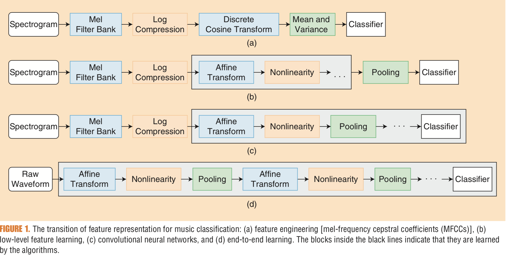
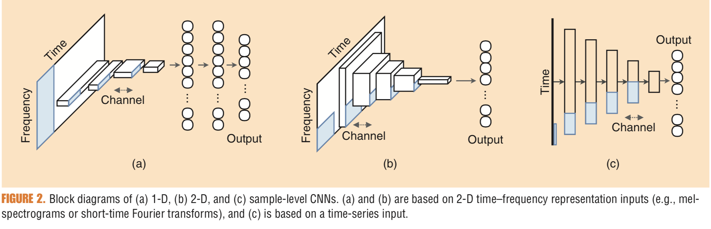
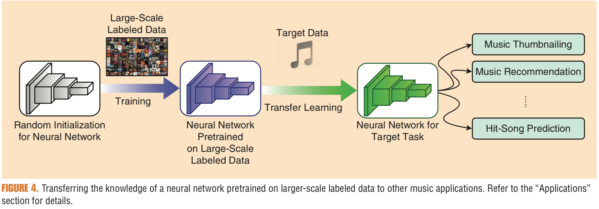

IEEE Signal processing magazine 2019년 1월호에 기재된 남주한 교수님의 글 [Deep Learning for Audio-Based Music Classification and Tagging: Teaching Computers to Distinguish Rock from Bach](https://ieeexplore.ieee.org/document/8588424)을 번역한 글입니다. Music data processing에 대한 최근 동향을 제시한다는 점에서 좋은 리뷰 페이퍼일것으로 예상됩니다.

### Introduction
최근들어 music-streaming services들(Pandora, Spotify, Apple music)의 큰 성장에 따라서 일반 사람들에 음악에 대한 접근에 훨신 더 쉬워졌습니다. 음악의 접근성이 올라간 것에 따라서, 수 많은 음악들 중 사용자들의 취향에 맞는 음악을 제공하는 것이 중요한 문제로 떠오르게 됩니다. 일반적으로 이러한 Task를 해결하기 위한 분야가 collaborative filtering 입니다. Collaborative filtering은 이전의 사용자들의 사용 History또는 Song rating을 기반으로 사람들이 흥미를 가지게 될 분야를 추천해주는 방식입니다. 하지만 Collaborative filtering의 한계점이 발견되기 시작합니다. 그것은 pupolarity bias와 cold-start problem으로 알려진 문제점입니다. 

이에 대해서 새로운 접근이 나타난 것이 바로 content-based approach입니다. 대표적인 예시는 Song descriptor를 사용하는 것입니다. 이것은 genre, mood, instruments, 그리고 vocal quality와 같은 요소들을 사용합니다. 하지만 이러한 manual annotation은 많이 비용이 등장하고 scalable하지 않습니다. 

이러한 한계점에 따라서 조명을 받게 된 것이 바로 Music information retrieval(MIR)입니다. 음악의 raw data에서 음악의 장르와 무드등을 찾아내는 것이 매우 중요한 문제가 되었습니다. 음악의 Semantic label을 찾아내는 Music classification과 tagging 등의 Task가 중요해졌습니다.


### From Feature engineering to end-to-end learning
위에서 언급한 Music classification과 Tagging Task를 푸는 방법론에는, 컴퓨터에게 음악의 패턴을 인식시켜서 classify시키는 것이 매우 중요했습니다. 2011년도의 $\text{A survey of audio-based music classification and annotation}$에 따르면, 149개의 논문에서 전통적인 machine-learning framework가 사용되는 것을 알 수 있었습니다. 이러한 전통적인 framework의 특징은 Feature engineering과 classifier 제작으로 진행되는 pipeline design이 매우 중요했습니다. 인간이 음악을 구별할때, 악기의 소리를 통해서 장르를 구별하거나 리듬을 통해서 구별하는 것처럼, 기계에게도 음악 내부에 있는 feature를 알려주는게 중요했습니다. 이것을 일반적으로 domain knowledge를 이용한 hand engineering 이라고 불렀습니다.

하지만 2015년도 이후 딥러닝의 시대로 넘어오게 되면서, 다양한 시도와 높은 performance가 생겨나기 시작합니니다. [K. Choi]의 $\text{A tutorial on deep learning for music information retrieval}$ 을 참고해보시는 것을 추천드립니다. 일반적으로 deeplearning 방법론은 linear 파트인 affine transformation, 그리고 nonlinear 파트인 activation function과, optional pooling operation을 통해서 pipeline을 구축합니다. 이러한 layer를 통과하면서 모형은 feature를 학습해 나가면서 end-to-end learning을 가능하게 합니다. 

아래 그림은 feature engineering 부터 end-to-end learning까지의 모형의 변화를 보여줍니다.



### Deep Learning Model
필자는 글에서 3가지 CNN 아키텍쳐를 리뷰해주었습니다. 1-D CNN, 2-D CNN 그리고 마지막은 sample-level CNN 입니다. 앞에서 제시한 1D,2D CNN의 경우에는, network를 더욱 flexible하게 만들어주는 효과가 있습니다. Flexibility를 향한 추구는 더 성공적인 Sample-level CNN 까지 이어지게 되었습니다. 그렇다면 3개의 CNN의 차이는 무엇일까요? 가장 기본적인 구분 방식은 Input의 종류와 Convolution의 진행방향으로 확인 할 수 있을 것입니다. 이후 글의 Nootation을 정리하려고합니다.
- Frequency : $F$
- Time : $T$
- Channel : $N$
- strides : $(s1,s2)$



### 1-D CNN
1-D CNN의 경우를 보면, Convolution이 input에 대해서 straight forward한 방향으로 진행이 됩니다. 일반적으로 Input은 time-frequency representation으로 표현된 데이터 매트릭스입니다. 대표적으로 Mel-spectrogram이 있습니다. 2D으로 생각하실수 있으나, 1D CNN라는 이름이 붙은 이유는 Convolution filter의 크기가 frequency 영역대는 고정되어 있으며, Time에 따라서 진행됩니다. 1D CNN의 구조는 시간의 흐름에 영향을 받는 음악데이터에 타당한 것으로 보입니다. 일반적인 CNN을 생각하신다면 대부분이 2D CNN을 생각하실것이라 생각합니다. 하지만 음악데이터의 경우에서는 조금 다른 해석이 존재할 수 있습니다. Time-Frequency Representation에서 보면, 음악적인 패턴은 어떠한 시간대에서도 나타날 수 있습니다, 그러나 특정 frequency band에서는 아닐수 있죠. 이러한 해석에서 음악데이터에서 1D CNN이 높은 평가를 받고 있습니다. 

또한 1D CNN은 Computation efficient 측면에서도 높은 평가를 받고 있습니다. 첫 Convolution layer에서 대부분의 frequency 영역을 커버하여 feature map을 형성하기 때문에, network parameter의 총 갯수를 줄일 수 있습니다.

하지만 1D CNN의 단점도 역시 존재합니다. 비교적 적은수의 parameter가 존재한다는 것은 small data set에 더 쉽게 학습이 된다는 것을 의미합니다. 이말은 즉 높은 computation 기능을 가지는 hardwaredhk Large scale의 데이터의 이점을 크게 살리지 못할 가능성이 있다는 것입니다.

결론적으로 1D CNN은 frequency 영역을 모두 커버하는 강한 가정을 가지게 됩니다. 이 가정의 단점으로 제안되는 부분은 바로 frequency-axis shift-invariance 입니다. 더 구체적으로 이야기한다면, 첫번째 레이어의 1D CNN을 사용한다는 것은 전체 frequency ranged에서 어떤 유사한 패턴을 추출하게 된다는 단점이 발생하게 됩니다.

### 2-D CNN
2D CNN은 1D CNN과의 차이를 살펴보면 빠르게 이해가 가능합니다. 가장 큰 특징은, Convolution filter의 사이즈의 차이입니다. 더 작아진 frequency영역을 가지게 됩니다. 이러한 특성으로 인해서, time-frequency 두가지 영역에서 pattern을 찾게 됩니다. 이것은 더 높은 flexibility를 가지게 되었다고 해석할수 있습니다. 1D CNN의 단점이였던, Shift invariance, pattern의 사이즈, small distortions들을 해결할수 있기 때문입니다. 일반적으로는 2D CNN이 1D CNN에 비해 큰 데이터 셋에 대해서 높은 성능을 보이게 됩니다. 

### Sample Level CNN
Sample level CNN 의 가장 큰 특징은 바로 input데이터를 waveform 그 자체로 사용할 수 있다는 점입니다. 위 figure에 표현되어 있는 모델은 $3^9$ model 입니다. 모델은 1D cov(filter=128, kernel=3, strides=3), Maxpooling(size=3)을 9개 붙여서 만든 레이어 입니다. 이 128 1D kernel을 참고할때, Time 축에 다라서 나오는 데이터로 부터, 사실상 sinusoid패턴을 찾을 수 있습니다. 이후의 convolution들은 nonsinusoid 패턴들 역시 찾아주는 역할을 하게 됩니다. 

이 sample level CNN은 크게 3가지 성질을 가진하고 합니다. 첫번째는 CNN이 "phase-invariant" representation을 반영한다는 점입니다. 시간축의 커널은 window에 따라서 모든 time shift를 반영하게 되고, large kernal의 사용은 다양한 변화량을 반영할수 있습니다. 그리고 short kernel의 deep stack은 CNN이 phase variation을 반영하는 역할을 하게 됩니다. 두번째는, 사실상 커널이 input signal에 대한 spectral bandwidth를 계산해 준다는 점입니다. 마지막은 첫번째 Convolution의 커널들이 harmonic component들을 표현해준다는 점입니다. 이는 위에서 언급한 phase에 대한 정보를 표현한다는 점입니다. 

### CRNN
Convolutional recurrent neural network의 경우, CNN위에 RNN을 합쳐서 학습시키는 것입니다. RNN layer의 추가는 long-term pattern을 추가하여 더 좋은 encoding을 만들어내는 장점이 있습니다. 음악과 같이 길이의 차이가 있는 데이터의 경우, input length에 좀더  flexible 한 모델을 만들 수 있을 것입니다.

### Residual networks and squeeze-and-excitation network
이 긴 이름의 네트워크는 컴퓨터비전 분야의 ImageNet Challenge에 큰 역할을 한 모델들 입니다. Residual Network의 경우에는 skip connection이라는 기술을 통해서 새로운 모형을 만들어 냈습니다. The squeeze and excitation network의 경우 Channel wise weighting을 통해서, layer의 representation을 강화하였습니다. 이것은 역시 music autotagging에 큰 역할을 하게 됩니다. 

### Practical Guide
__Data preprocessing__<br>
첫번째 체크할 사항은 sample rate입니다. 일반적으로 음악 트랙은 $\text{44.1 kHZ}$ 를 사용하게 됩니다. 하지만 대부분의 데이터 셈플은 다운샘플링을 통해서 $\text{16}$ 또는 $\text{22.05 kHZ}$를 가지게 됩니다. 하지만 대부분의 리서쳐들은 한번더 down sampling을 통해 $\text{8}$에서 $\text{12 kHZ}$까지 샘플링을 내리는 경우가 많습니다. 또한 일반적으로 mel-spectogram을 1,2D CNN의 input으로 사용합니다. 이와 대조적으로 sample-level CNN의 경우에는 전처리를 요구하지 않습니다. postprocessing 단계에서 zero-centered, Normalize 데이터를 사용합니다.

__Data augmentation__<br>
Data augmentation은 데이터를 증가시켜 모델에 학습을 도와주는 효과를 가지고 옵니다. Audio signal들의 경우에는 digital audio effect인 pitch-shifting이나 time-streching등이 많이 사용됩니다. 이를 도와주는 audio processing library는 Musical Data Augmentation (http://muda.readthedocs.io/en/latest/) 입니다.

### Application
실제 이러한 학습 모델이 활용되는 분야는 상당히 많습니다. Classifying across data sets, making recommendations, thumbnailing music and predict hitsong이 그런것입니다. 이러한 Task를 large scale data가 있다는 가정하에 푼다면 어떻게 될까요?

__Transfer learning__<br>
우리는 pretraining 기법을 사용해서 음악이라는 동일한 데이터셋을 다양한 Task에서 풀게 됩니다. 뉴럴넷 모형이 Task를 풀기위해 학습하는동안 다양한 Parameter들이 학습되면서, 이러한 학습을 다른 Task로 옮겨서 풀수 있게 됩니다.



### Future Challenges : Musically meaningful network design
DeepLearning 기법의 사용에 따라서 feature learning과 end-to-end learning을 맹신하는 것이 아니라, 우리는 music-domian knowledge와 network design이 병행되어야합니다. 예를 들어서 Music domain knowledge의 예시는 musical scores이 될수 있습니다. Musical scores들은 음악 요소의 멜로디 라인이나 화성진행과 같은 다양한 정보를 가지게 됩니다. Audio file에 담겨있지 않은 정보들을 활용한다면, 저희는 performance-related feature도 사용할수 있을 것입니다. (Velocity Change, note duration, different techniques)

지금까지 주요한 Music domain의 DeepLearning을 활용한 Task에 대해서 알아보았습니다. 음악 스트리밍 산업에 영향을 끼치는 딥러닝 기술이 였습니다. Music-classification 과 Auto-tagging이 주가 되었습니다. 접근법은 데이터 크게 1D, 2D, Sample CNN 으로 구성되었습니다. 또한 Computer Vision 혹은 NLP 영역에서 발견된 테크닉들이 연결되기도 했습니다. Transfer learning 이나 혹은 CRNN, Residual networks and squeeze-and-excitation network 가 그 예시입니다. 앞으로는 음악 도메인에 대한 이해 뿐만 아니라, 다른 분야의 모형들을 이해하고 새로운 아키텍쳐를 제안해야할 것으로 보입니다.

```python
 
```
