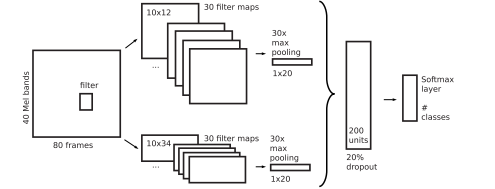
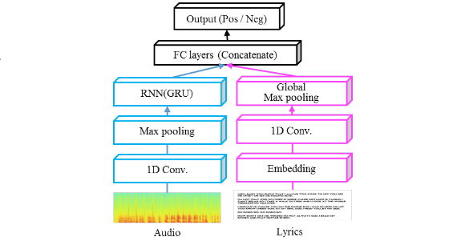
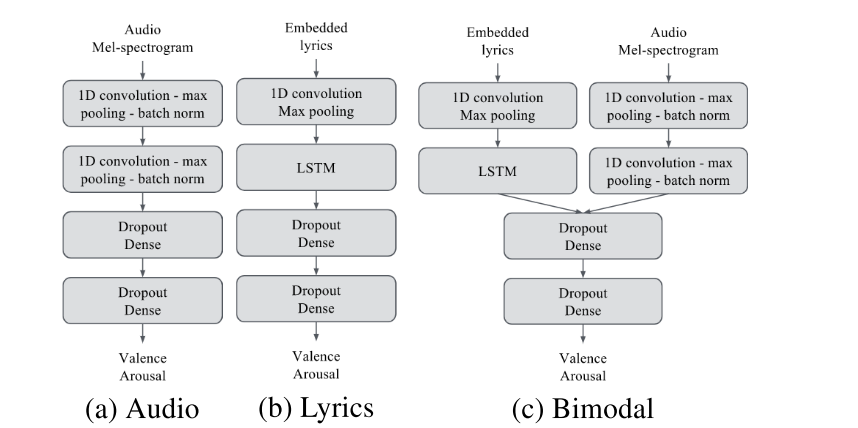
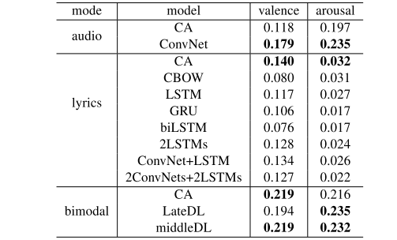

ISMIR에서 2018년도에 발표된 [MUSIC MOOD DETECTION BASED ON AUDIO AND LYRICS WITH DEEP NEURAL NET](https://arxiv.org/abs/1809.07276v1)을 번역한 글입니다. Deezer라는 프랑스의 Music-Tech 기업에서 나온 논문이며, Multimodel music mood prediction을 제안한 점에서 재밌는 논문이 될것 같습니다. 음악을 들으며 감정을 느끼는 것을 과연 뉴럴넷을 통해서 예측이 가능할 까요? 이에 대한 대답을 줄 수 있는 훌륭한 논문이 될 것으로 예상됩니다.

### Introduction
이 논문은 18,000개의 음원과 가사데이터를 활용하여, Valence, Arousal이 Label로 붙은 데이터셋의 Prediction Model을 만들기 위한 Regression Task를 수행합니다. 이런한 Task는 넓은 범주에서 본다면, automatic music mood detection의 분야이며 Music Information Retrieval로 분류될 수 있습니다. 이 Paper의 주된 특징은 데이터의 도메인이 음원과 가사라는 2가지 도메인을 활용한다는 점, 그리고 DeepLearning Approach를 통한 적은 feature engineering 을 진행했다는 점인 것 같습니다. 

관련 연구의 경우는 전에 [Lidy at el.](https://pdfs.semanticscholar.org/9143/9bd130b608cf5012a84cdc517e636a57221f.pdf)이 발표한 Parallel CNN이 있었습니다. 가장 큰 특징은 80 frame의 40 Mel bands input 데이터를 Convolution Layer로 보내면서 병렬적으로 네트워크 아키텍쳐를 2개로 구성하여, 하나는 10x12, 하나는 10x34를 사용했습니다. 이후 각각의 max pooling을 거친 후, Fully connected 단계에서 concatenate되어집니다. 200개의 units들로 말이죠, 그 다음에는 Softmax를 통해서 label을 분류합니다.
 

위 논문에서는 2개의 modal을 썻다는 특징을 발견할 수 있습니다. 그 뒤로는 이 muti-modal을 2개의 다른 데이터 도메인에서 학습시킨 [Jeon at el.](http://ceur-ws.org/Vol-1905/recsys2017_poster18.pdf)이 발표한 End-to-End Multimodal NN 입니다. 네이버 뮤직 스트리밍 서비스에, 각 음악 트랙에 editor가 붙인 테그를 바탕으로 Positive, Negative Label이 부착되어 있습니다. 길이가 1분 미만인 음악이나, 30단어 미만인 트랙은 제거하고, 1분의 음원데이터와 해당 가사데이터의 명사, 동사, 형용사, 부사만을 사용하였습니다. 최종 데이터는 1024 time x 128 mel 의 input을 기반으로 학습하게 됩니다. 네트워크의 가장 큰 특징은 오디오와 음원을 bi-modal로 학습한점, 그리고 음원에 CRNN 을, Lyrics에는 그냥 단순한 1D Conv를 통해서 학습한 점이 특징입니다. 정확도는 80프로 이상을 기록하였습니다.
 

### Model Architecture
그렇다면 이번 논문의 아키텍쳐는 어떤 contribution이 있을까요? 첫번째는, 조금더 end-to-end 로 가고 있다는 점입니다. 완벽한 waveform을 활용해서 학습시킨 것은 아니지만, 많은 feature engieering이 이루어지진 않았습니다. 또한 Regression Task입니다. 위에서 소개된 논문들은 특정한 Category Label을 분류하는 Classification 문제임에 반해, 이번 논문은 감정을 정량화 시키는 Valence (감정의 긍부정), Arousal (감정의 각성) 정도를 나타내는 Numerical Value를 예측하는 문제로 푼 것입니다. 

 

모델의 아키텍쳐는 기본적으로 위에서 사용한 모델들과 비슷합니다. Audio Net의 경우에는 Mel-spectrogram을 input으로 해서 2개의 1D CNN 을 사용해 줍니다. 이때 Mel-Spectrogram의 경우에는 Time과 Frequency축으로 구성되어 있습니다. 때문에 Frequency축을 고정시키고 Time축을 기반으로 Convolution 연산을 진행하게 됩니다. 
- 1D CNN layer 1
    - 32 feature map : 8, stride : 1
    - Max pooling : 4, stride :4
    - Batch Normalization
- 1D CNN layer 2
    - 16 feature map : 8, stride : 1
    - Max pooling : 4, stride : 4
    - Batch Normalization
- Fully Connected Layer
    - Hidden 64
    - output 2

Lyrics Net의 경우에는 word embedding을 활용하여 input 데이터를 사용합니다. Word2vec 을 활용하여 1.6 million 의 단어를 embedding space에 맵핑시킵니다. 아러한 단어들을 Stacked 시켜서 input matrix를 제작하게 됩니다. 이러한 input matrix에 1D convolution을 통과 시킨다음에 LSTM layer를 통과시키게 합니다.
- 1D CONV
    - 16 feature map (2,2), stride(1)
    - Maxpooling (2), stride (2)
- LSTM
    - Hidden size : 40
- Dense
    - hidden : 32
    - output : 2 (Arousal, Balence)

Multi Net 의 경우에는 마지막의 Fully connected layer를 보내기 전에 2개의 아키텍쳐에서 학습되 노드들을 concatenate 하게 됩니다. intermediate layer 의 vector length는 100입니다. 이 논문에서는 Concatenate 방식과 개별적으로 예측된 unimodal들의 output을 wieghted average하는 방식을 통해서 학습했습니다. 이 Weight는 grid search를 통해서 0,1사이의 값을 결정했다고 합니다. wiegthed average 하는 방식을 $\text{late DL}$, 이와 다르게 Concatenate 방식을 $\text{Middle DL}$이라고 부르겠습니다.

### DataSet
데이터 셋의 경우에는 Million Song Dataset의 Subset을 사용했습니다. 18,000개의 노래에는 LastFM 에 의해서 노래를 대표하는 Tag가 붙어있습니다. 그리고 그것은 노래의 Mood와 관련이 있습니다. 마치 노래를 듣고 이 노래는 행복하고 신나는 노래야! 라고 느끼고 happy, excited 등을 tag한 것이죠. 이것을 [Warriner at el](https://link.springer.com/article/10.3758/s13428-012-0314-x) 이 만들었던 14,000개의 단어가 담긴 emotional space의 valence, arousal 좌표값에 맵핑한 것 입니다. 이것이 바로 위 regression task의 label 이 됩니다.
- Audio : Million song dataset subset
    - 40 mel-filters, 1292 time domain, 44.1kHz Sampling freuqency
- Lyrics
    - Gensim's word2vec word embedding with 100 dimension
    - Extracting seven 50-word segments from each tracks.

### Result
 

결론에 언급되는 Metric은 모델의 설명력을 이야기하는 $R^2$ 가 상용되었습니다.

__Uni-Modal__ 
$\text{CA}$ 는 전통적인 feature engieering 기반의 머신러닝 모형입니다. 첫번째 눈에 띄는 특징은 Audio와 Lyrics의 성능차이 입니다. Valence prediction의 task의 경우에는 두 모형 역시 비슷한 성능을 내는 것으로 확인됩니다. 하지만 Arousal prediction에 있어서는 Audio가 Lyrics에 비해 더 좋은 데이터를 낸다는 점입니다. Lyrics의 영역에서는 Arousal의 단서를 찾아내기 힘든것으로 보입니다.저자는 이 이유가 arousal가 리듬이나 에너지와 깊은 관계가 있기 때문에 당연한 결과라고 생각된다고 합니다. 이와 반대로 valence의 경우에는 가사와 오디오 둘다 발생한다고 합니다. 긍, 부정에 경우에는 메세지에 담겨있을 수도 혹은, 멜로디, 하모니, 리듬등에 담겨있을 것이라고 예상한다고 합니다. 예를들어 우리의 대화에서도 언어의 소리와 메세지가 구분되는 것 처럼, 사랑한다는 말에서도 상실이 느껴지기도, 행복이 느껴지기도 하는 것입니다. 표현이 극대화되는 음악에서는 더더욱 arousal를 가사를 가지고 표현하기에는 힘들것 같다는 생각이 듭니다. 두번째 특징은 Audio 데이터는 딥러닝 방식이 전통적인 머신러닝 방식보다 조금 더 좋은 성능을 낸다는 것입니다. 반면에 Lyrics 데이터의 경우에는 머신러닝의 방법론이 좀 더 좋은 성능을 내는 것으로 보였습니다. 

__Bi-Modal__ 
이 Parer 에서 실험한 Bi-Modal은 2가지 입니다. Audio Net과 Lyrics Net, 두 개의 네트워크에서 학습된 마지막 feature layer들을 가지고 둘 사이의 weight를 optimization한 $\text{LateDL}$과 Concatenate를 진행한 $\text{Middle DL}$ 이 있습니다. 또한 bi-modal의 경우에는 모두 약간의 성과를 올린것으로 나타났습니다. 특히 valence prediction의 경우에는 uni modal에 비해서 더 높은 성능을 내는 것으로 확인 되었습니다. 하지만 전통적인 머신러닝 모형과 거의 동일한 성능을 내는 것으로 볼때 발전이 필요할 것으로 보입니다. 하지만 $\text{LateDL}$의 경우에는 Lyrics data가 큰 영향력을 끼치지 못한 것으로 나타났습니다.  

### Conclusion

저자들은 결론적으로 DeepLearning 접근법이 전통적인 ML 접근법에 비해서, Arousal에서 더 좋은 성과를 보이고 Valence에서는 비슷한 성과를 낸다고 말합니다. 그리고 Future works 로 언급한 요소는 Audio 와 Lyrics의 synchronize를 맞추어서, 해당 음에 매칭되는 Lyrics를 써야함을 강조했습니다. 그 다음은 데이터베이스의 Label의 한계입니다. 감정의 주관성을 커버할수 있는 넓은 데이터베이스를 구축하는 것을 이야기합니다. 또한 Arousal 에서 큰 영향을 끼치지 못한 Lyrics 데이터에 대한 더 훌륭한 Embedding 방법론이나, 모델 아키텍쳐를 제안합니다.
