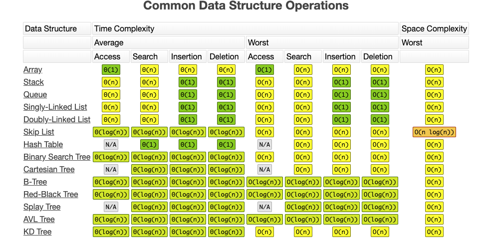
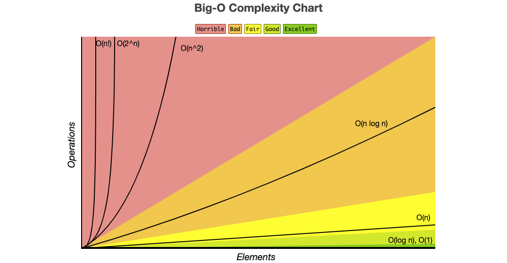

본 게시물은 Data Structure & Algorithm 에 대한 [ratsgo](https://ratsgo.github.io/data%20structure&algorithm/2017/09/07/algorithm/)을 블로그, [grepsean](https://grepsean.github.io/Algorithms-and-Data-Structures-with-Python-3/) 님의 블로그, 구종만님의 저서 [알고리즘 문제 해결 전략](https://book.algospot.com/)을 참고하여 함께 정리했습니다.


## Programming and DS&A

가장 기본적으로 프로그래밍과 데이터구조, 알고리즘 이 3가지 용어에 대해서 접근해 봅시다. 예를들어서 건축을 한다고 해봅시다. 집을 건축하기 위해서는 설계도가 필요합니다. 설계도는 바로 구조와 유저의 시나리오가 존재하겠죠. 또한 시공을 위해서는 도구가 필요할 것입니다. 엔지니어는 그러면 설계와 구현 이 2가지를 하게 됩니다. 구현을 위해서는 Programming이, 설계에는 UML이 쓰이게 됩니다. UML이 바로 우리가 알아보려는 자료구조와 알고리즘이 될 것입니다. 설계와 구현 모두 중요한 요소입니다.

- Programming: 구현 (Implement)
- DataStructure & Algorithm : 설계(Design)

만약 가정을 해봅시다 좋은 디자인인데 구현이 별로면 어떨까요? 아쉽겠지만 그래도 봐줄만 할 것입니다. 하지만 나쁜 디자인의 좋은 구현체를 본다면, 우리의 필요를 충족해 주지 못할 것입니다. 


### 문제해결과 Programming
그렇다면 프로그래밍은 무엇일까요? 알고리즘 문제 해결 전략의 저자 구종만님은 프로그래밍은 문제해결이라고 말해주십니다. 문제 해결 능력은 매우 추상적인 이야기로 들리게 됩니다. 제가 느낄때는 문제해결은 주어진 제약조건 속에서 목적을 달성하는 것입니다. 그렇다면 제약조건에는 무엇이 있을까요? 자기가 사용하고 있는 프로그래밍 언어의 특성, 프로그래밍 언어가 동작할 하드웨어와 운영체제, 사용하는 라이브러리들의 유의사항, 사용자가 답답하지 않을 정도의 시간, 메모리의 한계, 그리고 재사용성등이 있겠군요. 그렇다면 이제는 목적을 정의하는 방법을 생각해 봅시다.

1. 문제를 읽고 이해하기
2. 재정의와 추상화
3. 계획 세우기
4. 계획 검증하기
5. 계획 수행하기
6. 회고하기

### 체계적인 접근을 위한 질문들
만약 문제를 읽었을때, 머리가 하얗게 변하거나 어떻게 풀지 모를때 접근할만한 질문들을 정리해 보았습니다.

- 비슷한 문제를 풀어본 적이 있는가?
- 단순한 방법에서 시작할 수 있을까? (점진적인 개선이 가능한가?)
    - 시간과 공간의 제약을 생각하지 않고 문제를 해결할 가장 단순한 알고리즘이 있을까? (합친 LIS, 신호 라우팅)
    - 변수를 줄어본다. 다차원을 1차원으로 바꾸어본다.  (비대칭 타일링, 근거리 네트워크)
- 내가 문제를 푸는 과정을 수식화 할 수 있을까?
    - 손으로 문제를 풀어보자 (Quantization, 실험데이터 복구하기)
- 그림으로 그려볼 수 있을까?
    - 기하학적 도형을 통한 직관적 이해를 해본다. (문자열 합치기, 너드인가 아닌가)
- 문제를 분해할 수 있는가?
    - 제약조건을 분해해보자. 한개의 복잡한 조건을 여러개의 단순한 조건으로 바꿔서 풀어보자.
- 문제의 순서를 바꾸어 보거나 순서를 강제해 본다.
    - 뒤에서부터 문제를 풀어본다.(삽입 정렬 뒤집기, 감시 카메라 설치, Sorting Game)
    - 순서를 강제한다. (경우의 수, 게임판 덮기, 폴리오미노, 웨브바짐)
    - 특정 형태의 답을 고려한다. 


### Python

파이썬은 91년도에 만들어진 Interpreter 언어입니다(Not compiler). 제약 조건이 덜하고 생산성에 초점이 맞추어져 있습니다. 빠르게 구현이 가능하고, 실행은 살짝 느린 형태가 됩니다. 그리고 무엇보다 객체지향적이고 동적 타이핑이 가능하다는 특징이있습니다.그리고 독특한 코드 스트럭쳐입니다. Pythonic 한 코드의 형태가 존재하기도 합니다. 규칙을 이해한다면 편하게 짤 수 있습니다. 그리고 데이터 분석에 아주 Speciality가 있다는 특징이 있습니다. 저는 앞으로 파이썬의 특징을 활용해서 데이터 구조와 알고리즘을 짜보려고합니다.

### Data Structure 란?
자료구조는 데이터를 효율적으로 이용할 수 있도록 저장하는 방법입니다. 데이터의 타입에 따라서 효율적인 자료구조를 선택할수 있어야한니다.

- 형태
    - linear 자료구조
        - 스택 Stack : 후입선출 구조의 자료구조이다. 데이터를 스택에 넣고 다시 꺼내면 역순으로 나온다
        - 큐 Queue : 선입 선출의 자료구조이다
        - 덱 Deque : 양쪽에서 넣고 뺼수 있는 자료구조이다. 스택과 큐가 합쳐져 있다.
        - __리스트 List : 같은 값이 한번 이상 존재 할 수 있고, 일련의 값이 모여있는 추상 자료형입니다.__
    - Non-linear 자료구조
        - 트리 tree : 부모 노드와 N개의 자식 노드로 구성된 자료구조이며, 자식 노드도 재귀적으로 서브트리를 구성한다.
        - 그래프 Graph : 트리 구조와 비슷하지만, 순환구조를 가진다.

### Algorithm (Definite Finite Automata)

> 주어진 입력을 원하는 출력으로 변환하는 명확하게 정의된 일련의 계산단계

하나의 상태만을 가지게 되며, 어떤 사건에 의해 다른 사건으로 전이가 일어납니다. 전이가 결정적이고 유한상태입니다. 
<br>

알고리즘은 자료구조에 저장되어 있는 데이터를 연산하여 어떠한 문제를 해결하는 과정이다. 
1. 입력 : 0개 이상의 입력을 받아야한다
2. 출력 : 전달받는 입력에 대해서는 의도하는 결과가 반환되어야한다.
3. 명확성 : 수행과정은 명확하고 모호하지 않는 명령어로 구성되어야한다.
4. 유한성(종결성) : 유한 번의 명령어를 수행 한 후 종료한다
5. 효율성 모든 과정은 명백하게 실행가능 및 검증 가능해야한다.


### Complexity & Notation BigO
복작도는 공간과 시간으로 나눌 수 있습니다. 공간 복잡도는 알고리즘에 필요한 메모리 공간이 얼마인지, 시간 복잡도는 알고리즘이 동작하는 시간이 얼마인지 계산해 내는 것입니다. 메모리는 충분히 보충가능하지만, 시간은 추가할 수 없는 절대적 가치이기 때문에 시간 복잡도가 더 우선시 됩니다. 


### Complexity Approximation
임의의 함수에 대하여 "함수의 입력값"이 충분히 커짐에 따라 출력값이 얼마나 빠르게 커지는가로 된다. 


앞으로는 자료구조를 Python으로 구현해보면서 자료구조와 연관성이 높은 프로그래밍 문제를 하나씩 구현해 나가볼 예정입니다.

```python

```
