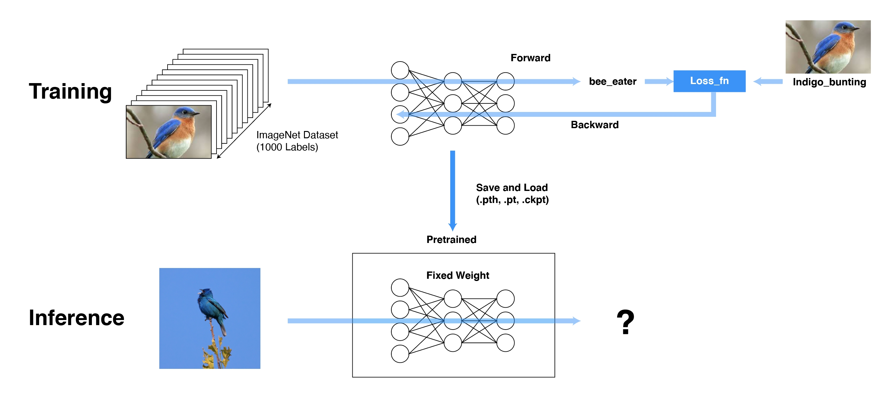
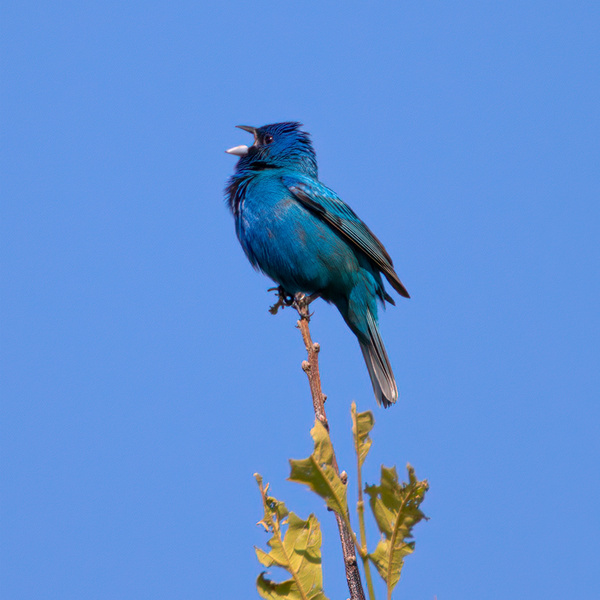

# DeepLearning For everyone!

Deep learning is rapidly becoming a key technology in the application field of artificial intelligence (LeCun et al. 2015). In the meantime, deep learning has shown tremendous achievements in various fields such as computer vision, natural language processing, and speech recognition. As a result, interest in deep learning continues to grow. However, some hurdles are challenging to implement these deep learning papers directly or understand their implementation. First of all, it requires enormous data and storage space and various computational resources (GPU, TPU). For example, Bert uses a huge Corpus of 330 million words **(800 million words of BookCorpus data and 2.5 billion words of Wikipedia data)**. Also, the GPU used for training is huge. In the base model case, 8 chapters of V100 must be trained for 12 days, and in the case of the large model, 64TPU chips are trained for 4 days. This is equivalent to the amount of learning 280 V100s per day. There is a very high cost to build such an infrastructure.

Also, at this point, most applications do not have as many computational resources as expected. However, the actual application model is not the data or the GPU, but **the weight of the model** that is actually and used.

# What is Model Weight?

To understand the weight of a model, we first need to know the environment in which the training takes place. If training is a process of creating a deep learning model, after the training is completed, we apply an instance to the model and perform an inference process. In the learning phase, you need to build the big data mentioned above, knowledge of the model architecture, and the Computational Infrastructure used for learning. The model architecture represents the data as a high-dimensional latent. If this latent representation is suitable for the learning task, it will perform better. At this time, while repeating Forward and Back-Propagation, we learn the model's weight by the loss created by the data. These weights can be seen as converting the data we have into knowledge and converting it to the model. Then, if we stop learning and have the weight of the given model, we can get answers to the knowledge of the task we learned in the learning phase (e.g., is this sentence positive or negative, what document is classified?). For data in the same format!




# Inference Process

Deep learning inference is the process of predicting previously unseen data using a trained DNN model. DNN models created for image classification, natural language processing, and other AI tasks can be large and complex due to tens or hundreds of layers of artificial neurons and the millions or billions of weights that connect them. The larger the DNN, the more compute, memory, and energy it takes to run it. The longer the response time (or "wait time") from entering data into the DNN to receiving the result.

Therefore, in deep learning research, much research is being done on the efficiency of the model and the performance of the model.

# Tutorial!

In example, we will try how to get the desired result by using the pre-trained model for the task in Image Classification.

We will focus on using a pre-trained model to predict the label of the input, so we will also discuss the process involved in this. This process is called model inference. The whole process consists of the following main steps:

### Process

- Perform transformations on the image (e.g., resize, crop center, normalize, etc.)
- Forward Pass: Find the output vector using pre-trained weights. Each element of this output vector describes the confidence that the model predicts an input image that belongs to a particular class.
- Display predictions based on the scores obtained.


# Download Torch Model

Torchvision supports various pre-trained models. These pre-trained models are neural network models trained on large benchmark data sets such as ImageNet. The deep learning community has benefited a lot from these open-source models, which is also one of the main reasons for the rapid development of computer vision research. Other researchers and practitioners can use these state-of-the-art models instead of inventing everything from scratch.


```python
import torch
from torchvision import models
```

```python
dir(models)
```
    ['alexnet',
     'densenet',
     .
     .
     .
     'detection',
     'googlenet',
     'inception',
     'inception_v3',
     'mnasnet',
     'mobilenet',
     .
     .
     .
     'video',
     'wide_resnet101_2',
     'wide_resnet50_2']

Use the `dir(models)` command to see what kind of pre-trained models we currently have available. In this post, we use the representative model resnet50. Resnet presents the perspective of viewing data from various perspectives by combining X coming through the input with the feature learned by the Convolution Block again. The relevant code is attached below.

----

`dir(models)` 명령어를 확인해 보면 우리가 현재 사용할수 있는 pretrained 모델의 종류를 알 수 있습니다. 본 포스팅에서는 저희는 대표적인 모델 resnet50을 사용합니다. resnet은 input으로 들어오는 X를 Convolution Block에 의해 학습된 Feature와 다시 결합함으로서 다양한 관점에서 데이터를 바라보는 시각을 제시합니다. 관련된 코드는 아래 첨부되어 있습니다.

```python
from torch import nn
from torch.nn import functional as F

class Residual(nn.Module):  #@save
    """The Residual block of ResNet."""
    def __init__(self, input_channels, num_channels,
                 use_1x1conv=False, strides=1):
        super().__init__()
        self.conv1 = nn.Conv2d(input_channels, num_channels,
                               kernel_size=3, padding=1, stride=strides)
        self.conv2 = nn.Conv2d(num_channels, num_channels,
                               kernel_size=3, padding=1)
        if use_1x1conv:
            self.conv3 = nn.Conv2d(input_channels, num_channels,
                                   kernel_size=1, stride=strides)
        else:
            self.conv3 = None
        self.bn1 = nn.BatchNorm2d(num_channels)
        self.bn2 = nn.BatchNorm2d(num_channels)
        self.relu = nn.ReLU(inplace=True)

    def forward(self, X):
        Y = F.relu(self.bn1(self.conv1(X)))
        Y = self.bn2(self.conv2(Y))
        if self.conv3:
            X = self.conv3(X)
        Y += X
        return F.relu(Y)
```


```python
resnet50 = models.resnet50(pretrained=True)
```
```
    Downloading: "https://download.pytorch.org/models/resnet50-19c8e357.pth" to /Users/seungheondoh/.cache/torch/checkpoints/resnet50-19c8e357.pth
    100%|██████████| 97.8M/97.8M [00:10<00:00, 9.38MB/s]
```
We can download pretrained weights from https://download.pytorch.org/models/resnet50-19c8e357.pth through the command `pretrained=True`. At this time, you can see that huge data and Computational Infra are compressed into less than 100M of knowledge.

Once we have the model with us, the next step is to transform the input image with specific format. If the data domain of the input is different, the result cannot be obtained significantly. (When sentence input is inserted in the vision model or voice input is inserted)

```python
from torchvision import transforms

transform = transforms.Compose([            
    transforms.Resize(224),                 
    transforms.ToTensor(),                  
    transforms.Normalize(                   
        mean=[0.5, 0.5, 0.5],
        std=[0.229, 0.224, 0.225]               
    )
])
```

We are going to use a simple image called blue_brid for the image. Can our model really recognize this blue bird?


```python
from PIL import Image
img = Image.open("blue_bird.jpg")
img
```



```python
img_t = transform(img)
batch_t = torch.unsqueeze(img_t, 0)
```

The model is converted to a specific format by the function created above. We change the image above to the input shape used in the model, 224, and then normalize it for better performance. After that, it is made in batch units through the unsqueeze function. For now, batch is 1. 

Then we have to declare that the function no longer needs to learn through a function called torch.eval. If we put the image in the model, we can get the output corresponding to 1xClass Number.


```python
resnet50.eval()
with torch.no_grad():
    out = resnet50(batch_t)
    
out.shape
```

```
    torch.Size([1, 1000])
```


# Image Net Classes 

The Image Net dataset is a matter of classifying 1000 images. Meta annotations corresponding to 1000 images can be downloaded from the site below. Then, let's find out which image our model classified the instance image into through the largest value among the values corresponding to each index of each output.

you can download in https://s3.amazonaws.com/deep-learning-models/image-models/imagenet_class_index.json


```python
import json
class_idx = json.load(open("imagenet_class_index.json",'r'))
idx2label = [class_idx[str(k)][1] for k in range(len(class_idx))]
```


```python
_, index = torch.max(out, 1)
percentage = torch.nn.functional.softmax(out, dim=1)[0] * 100
```


```python
_, indices = torch.sort(out, descending=True)
infernece = [(idx2label[idx], percentage[idx].item()) for idx in indices[0][:5]]
```


```python
infernece
```

```
    [('indigo_bunting', 99.34516906738281),
     ('bee_eater', 0.2820887863636017),
     ('jacamar', 0.03670770302414894),
     ('macaw', 0.02816816233098507),
     ('European_gallinule', 0.0279614869505167)]
```


99% are classified as indigo_bunting. It's not bad performance!

reference
- https://github.com/huggingface/transformers
- https://www.learnopencv.com/pytorch-for-beginners-image-classification-using-pre-trained-models/
- https://www.analyticsvidhya.com/blog/2017/06/transfer-learning-the-art-of-fine-tuning-a-pre-trained-model/


```python

```
